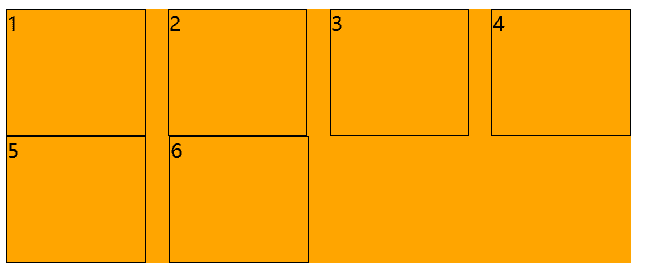

## 单行显示省略号

```css
white-space: nowrap;	/* 文本一行显示 */
overflow: hidden;	/* 隐藏超出的文本 */
text-overflow: ellipsis;	/* 超出的用省略号 */
```


## 去除表格中间隙和两层边框

当我们给td设置 border的时候，两个单元格之间会出现间隙和两层边框

给table加上边框折叠属性：`border-collapse:collapse;`


## 用CSS画一个三角形

使用**border**

```html
<style>
    .box{
        width: 100px;
        height: 100px;
        border: 100px solid red;
        box-sizing: border-box;
        border-top-color: transparent;
        border-left-color: transparent;
        border-right-color: transparent;
    }
</style>


<div class="box"></div>
```


## 随着浏览器窗口变化，图片中间部分一直在浏览器中间显示

### 方法一：使用background-position

```html
<style>
    .box{
       background-image:url(...);
       background-position:center;
    }
</style>


<div class="box"></div>
```


### 方法二：使用relative

```html
<style>
    .box{
        height: 400px;
        background-color: red;
        overflow: hidden;
    }

    .box img{
        position:relative;
        /*left: px ;  这个大小需要我们计算一下，值为你的图片长度的一半,下面是优化 */
        transfrom:translate(-50%,0);
        margin-left: 50%;
    }
</style>


<div class="box">
    
</div>
```

 

## 去除多个行内级元素中间的空格

造成这样的原因是因为我们在写代码的时候，换行符被浏览器解析了

```html
/* 换行符造成了行内级元素之间有间隙 */
<div>
    <span>1</span>
    <span>2</span>
    <span>3</span>
</div>
```

- 删除换行符(不推荐)
- 将父级元素的font-size设置为0，但是需要子元素设置回来（不推荐）
- 通过子元素(span)统一向一个方向浮动即可
- flex布局


## 中间居中布局

1、**效果图**


2、当我们设置为这样的时候：

```html
<style>
    body,div{
        margin: 0;
        padding: 0;
        box-sizing: border-box;
    }
    .box{
        width: 1190px;
        height: 500px;
        background-color: aqua;
        margin: 0 auto;
        color:white;
    }
    .item{
        width: 230px;
        height: 322px;
        background-color: blue;
        float: left;
        margin-right: 10px;
    }
</style> 

<body>
    <div class="box">
        <div class="item">1</div>
        <div class="item">2</div>
        <div class="item">3</div>
        <div class="item">4</div>
        <div class="item">5</div>
    </div>
</body>
```

3、变成这样：

4、第五个区域会因为不够宽而跑出去，因为我们设置了box宽度为1190px；盒子宽度230px；margin-right:10px；总宽度 230×5+10×5 = 1200 > 1190

5、**解决办法**【不能直接将 .box的宽度设置为1200px，如果直接设置，其实我们的区域向左偏了这个 margin-left:10px;】

在 .item 外面重新套一个div，把这个div的宽度变成 1200px 

```html
<style>
    body,div{
        margin: 0;
        padding: 0;
        box-sizing: border-box;
    }
    .box{
        width: 1190px;
        height: 500px;
        background-color: aqua;
        margin: 10px auto;
        color: white;
    }
    .contain{
        margin-right: -10px;
    }
    .item{
        width: 230px;
        height: 322px;
        background-color: blue;
        float: left;
        margin-right: 10px;
    }
</style> 

<body>
    <div class="box">
        <div class="contain">
            <div class="item">1</div>
            <div class="item">2</div>
            <div class="item">3</div>
            <div class="item">4</div>
            <div class="item">5</div>
        </div>
    </div>
</body>
```

6、为什么里面的div宽度会变成 1200px呢？

**原理**：定位参照对象的宽度= left + right + margin-left + margin-right + 绝对定位元素的实际占用宽度

父级盒子宽度（.box）= 子盒子（.contain） + left + right + margin-left + margin-right

1190px = x + 0 + 0 + 0 + (-10px)		——>			所有x被迫为1200px，子盒子宽度为1200px


## 解决如下布局问题

### 问题


```html
<style>
    .container{
        width: 500px;
        background-color: orange;
        display: flex;
        flex-wrap: wrap;
        justify-content: space-between;
    }

    .item{
        width: 110px;
        height: 100px;
        border: 1px solid black;
        box-sizing: content-box;
    }
</style> 

<body>
    <div class="container">
        <div class="item item1">1</div>
        <div class="item item2">2</div>
        <div class="item item3">3</div>
        <div class="item item4">4</div>
        <div class="item item5">5</div>
        <div class="item item6">6</div>
    </div>
</body>
```


### 解决办法

加入span元素（或者i也行）去填充空缺的位置



```
<style>
    .container{
        width: 500px;
        background-color: orange;
        display: flex;
        flex-wrap: wrap;
        justify-content: space-between;
    }

    .item{
        width: 110px;
        height: 100px;
        border: 1px solid black;
        box-sizing: content-box;
    }
    
     span{
     	/* 设置的宽度就是items的宽度，用span来填充空的位置，因为span没有设置高度，所以不会有影响 */
    	 width: 110px;
     }
</style> 

<body>
    <div class="container">
        <div class="item item1">1</div>
        <div class="item item2">2</div>
        <div class="item item3">3</div>
        <div class="item item4">4</div>
        <div class="item item5">5</div>
        <div class="item item6">6</div>
        /* 添加span个数为 列数-2 */
         <span></span>
         <span></span>
    </div>
</body>
```


## 蒙版

```html
 <div className="coverAll"></div>


.coverAll{
	// 记得给父元素这是 position:relative;
    position: absolute;
    left:0;
    right: 0;
    top: 0;
    bottom: 0;
    background-color:rgba(255,255,255,.8)
}
```


## 毛玻璃


```html
<div class="box">
  <div class="frosted__glass">毛玻璃</div>
</div>
```

```css
.box {
  width: 700px;
  height: 700px;
  display: flex;
  justify-content: center;
  align-items: center;
  background: url('http://k21vin.gitee.io/front-end-data-visualization/assets/bg01.13dfb262.jpg');
  background-size: 100%;
  background-position: center;
}

.frosted__glass {
  width: 80%;
  height: 40%;
  border-radius: 40px;
  display: flex;
  justify-content: center;
  align-items: center;
  font-size: 60px;
  letter-spacing: 0.5em;
  backdrop-filter: blur(20px);
  color: #fff;
  box-shadow: 0 0 30px 10px rgba(0, 0, 0, .3);
}
```


在 `CSS` 中，想要实现模糊效果，可以使用 **滤镜** 。背景通常设置成黑色、灰色或者白色，然后再设置一下背景的不透明度就能实现一个简单的毛玻璃效果。

上面的代码中，`backdrop-filter: blur(20px);` 是重点。有了它就实现了毛玻璃的基本效果。

最后加上 `box-shadow: 0 0 30px 10px rgba(0, 0, 0, .3);` 让毛玻璃与背景之间产生一点阴影，看起来会更自然


## 使用视频作为背景

[CSS技巧系列--使用视频作为背景_css 视频背景](https://blog.csdn.net/chengqige/article/details/122643867)

```html
<div class="video-box">
   <video class="video-background" preload="auto" loop playsinline autoplay src="链接" tabindex="-1" muted="muted"></video>
</div>
```

```css
* {
    margin: 0;
    padding: 0;
}

.video-box {
    position: relative;
    height: 100vh;
    background-color: #C1CFF7;
    /*进行视频裁剪*/
    overflow: hidden;
}

.video-box .video-background {
    position: absolute;
    left: 50%;
    top: 50%;
    /*保证视频内容始终居中*/
    transform: translate(-50%, -50%);
    width: 100%;
    height: 100%;
    /*保证视频充满屏幕*/
    object-fit: cover;
    min-height: 800px;
}
```


## 通过CSS实现文本内容过长，中间显示省略号...，两端正常展示

```html
<ul class="con">
    <li class="wrap">
        <span class="txt">CSS 实现优惠券的技巧 - 2021-03-26</span>
        <span class="title" title="CSS 实现优惠券的技巧 - 2021-03-26">CSS 实现优惠券的技巧 - 2021-03-26</span>
    </li>
    <li class="wrap">
        <span class="txt">CSS 测试标题，这是一个稍微有点长的标题，超出一行以后才会有title提示，标题是 实现优惠券的技巧 - 2021-03-26</span>
        <span class="title" title="CSS 测试标题，这是一个稍微有点长的标题，超出一行以后才会有title提示，标题是 实现优惠券的技巧 - 2021-03-26">CSS
            测试标题，这是一个稍微有点长的标题，超出一行以后才会有title提示，标题是 实现优惠券的技巧 - 2021-03-26</span>
    </li>
    <li class="wrap">
        <span class="txt">CSS 拖拽?</span>
        <span class="title" title="CSS 拖拽?">CSS 拖拽?</span>
    </li>
    <li class="wrap">
        <span class="txt">CSS 文本超出自动显示title</span>
        <span class="title" title="CSS 文本超出自动显示title">CSS 文本超出自动显示title</span>
    </li>
</ul>
```

```css
.con {
    font-size: 14px;
    color: #666;
    width: 600px;
    margin: 50px auto;
    border-radius: 8px;
    padding: 15px;
    overflow: hidden;
    resize: horizontal;
    box-shadow: 20px 20px 60px #bebebe,
        -20px -20px 60px #ffffff;
}

.wrap {
    position: relative;
    line-height: 2;
    height: 2em;
    padding: 0 10px;
    overflow: hidden;
    background: #fff;
    margin: 5px 0;
}

.wrap:nth-child(odd) {
    background: #f5f5f5;
}

.title {
    display: block;
    position: relative;
    background: inherit;
    text-align: justify;
    height: 2em;
    overflow: hidden;
    top: -4em;
}

.txt {
    display: block;
    max-height: 4em;
}
.title::before{
    content: attr(title);
    width: 50%;
    float: right;
    white-space: nowrap;
    overflow: hidden;
    text-overflow: ellipsis;
    direction: rtl;
}
```

