Canvas 最早是由 Apple 引入 WebKit，用于Mac OS X 的 Dashboard，随后被各个浏览器实现。如今除一些过时的浏览器不支持Canvas元素外，所有的新版本主流浏览器都支持它。

Canvas元素的学习需要具备一些基本的HTML和JavaScript知识。


## 基本使用

下面我们来简单创建一个例子，看看canvas究竟如何使用。

```html
<!DOCTYPE html>
<html lang="en">
<head>
  <meta charset="UTF-8">
  <meta http-equiv="X-UA-Compatible" content="IE=edge">
  <meta name="viewport" content="width=device-width, initial-scale=1.0">
  <title>canvas 基本使用</title>
</head>
<body>
  <canvas width="200" height="200">
    当前浏览器不支持canvas元素，请升级或更换浏览器！
  </canvas>
</body>
</html>
```


上面代码就是一个基本的使用Canvas标签的例子。可以看到我们为它设置了宽和高，还在 Canvas标签内部给出一个提示文案。在这里需要说明一下：

- Canvas标签的默认大小为：300 x 150 (像素)，而这里咱们设置为了：200 x 200（像素）。
- Canvas标签中的文字是在不支持Canvas标签的浏览器中使用的，因为支持Canvas标签的浏览器会忽略容器中包含的内容正常渲染Canvas标签，而不支持Canvas标签的浏览器则相反，浏览器会忽略容器而显示其中的内容。

可以看一下上面代码在浏览器上的展示样式：


## 渲染上下文

Canvas标签起初只是创造了一个固定大小的画布，它公开了一个或多个渲染上下文，而我们想对它进行绘制就需要找到渲染上下文。

Canvas标签提供了一个方法叫：**getContext()** ，通过它我们可以获得渲染上下文和绘画功能。简单写个例子：

```html
<!DOCTYPE html>
<html lang="en">
<head>
  <meta charset="UTF-8">
  <meta http-equiv="X-UA-Compatible" content="IE=edge">
  <meta name="viewport" content="width=device-width, initial-scale=1.0">
  <title>canvas 基本使用</title>
</head>
<body>
  <canvas id="canvas" width="200" height="200">
    当前浏览器不支持canvas元素，请升级或更换浏览器！
  </canvas>
  <script>
    // 获取 canvas 元素
    var canvas = document.getElementById('canvas');
    // 通过判断getContext方法是否存在来判断浏览器的支持性
    if(canvas.getContext) {
      // 获取绘图上下文
      var ctx = canvas.getContext('2d');
    }
  </script>
</body>
</html>
```

这里需要注意一点，getContext方法是有一个接收参数，它是绘图上下文的类型，可能的参数有：

- 2d：建立一个二维渲染上下文。这种情况可以用 CanvasRenderingContext2D()来替换getContext('2d')。
- webgl（或 experimental-webgl）： 创建一个 WebGLRenderingContext 三维渲染上下文对象。只在实现WebGL 版本1(OpenGL ES 2.0)的浏览器上可用。
- webgl2（或 experimental-webgl2）：创建一个 WebGL2RenderingContext 三维渲染上下文对象。只在实现 WebGL 版本2 (OpenGL ES 3.0)的浏览器上可用。
- bitmaprenderer：创建一个只提供将canvas内容替换为指定ImageBitmap功能的ImageBitmapRenderingContext。


## 绘制形状

在我们获得绘制上下文以后，就可以根据绘制上下文开始绘制一些基本的形状，比如：直线、三角形、矩形、圆弧和圆。接下来咱们具体实现一下。


### 直线

绘制直线咱们需要了解三个函数：

- **moveTo(x, y)**：设置初始位置，参数为初始位置x和y的坐标点

- **lineTo(x, y)**：绘制一条从初始位置到指定位置的直线，参数为指定位置x和y的坐标点

- **stroke()**：通过线条来绘制图形轮廓

接下里咱们应用上面的三个函数来试着绘制一条直线，代码如下：

```html
<!DOCTYPE html>
<html lang="en">
<head>
  <meta charset="UTF-8">
  <meta http-equiv="X-UA-Compatible" content="IE=edge">
  <meta name="viewport" content="width=device-width, initial-scale=1.0">
  <title>canvas - 绘制直线</title>
  <style>
    /* 给画布增加一个阴影和圆角的样式 */
    canvas {
      box-shadow: 0px 0px 5px #ccc;
      border-radius: 8px;
    }
  </style>
</head>
<body>
  <canvas id="canvas" width="500" height="500">
    当前浏览器不支持canvas元素，请升级或更换浏览器！
  </canvas>
  <script>
    // 获取 canvas 元素
    var canvas = document.getElementById('canvas');
    // 通过判断getContext方法是否存在来判断浏览器的支持性
    if(canvas.getContext) {
      // 获取绘图上下文
      var ctx = canvas.getContext('2d');
      // 绘制一条从起点（x: 50, y:50）到 另一个点（x: 200, y:200）的直线
      ctx.moveTo(50, 50);
      ctx.lineTo(200, 200);
      ctx.stroke();
    }
  </script>
</body>
</html>
```

为了展示的效果好一点，这里我调整了一下画布的大小：500 x 500，还给画布添加了一个阴影和圆角。得到的直线如图：


### 三角形

知道了如何绘制一条直线，那么绘制三角形也就不难了，咱们只需要画三条直线拼在一起就是一个三角形了，代码如下：

```html
<script>
    // 获取 canvas 元素
    var canvas = document.getElementById('canvas');
    // 通过判断getContext方法是否存在来判断浏览器的支持性
    if(canvas.getContext) {
        // 获取绘图上下文
        var ctx = canvas.getContext('2d');
        // 绘制一个三角形:(50,50)是起点 -> (200, 200) -> (200, 50) -> (50, 50)
        ctx.moveTo(50, 50);
        ctx.lineTo(200, 200);
        ctx.lineTo(200, 50);
        ctx.lineTo(50, 50);
        ctx.stroke();
    }
</script>
```

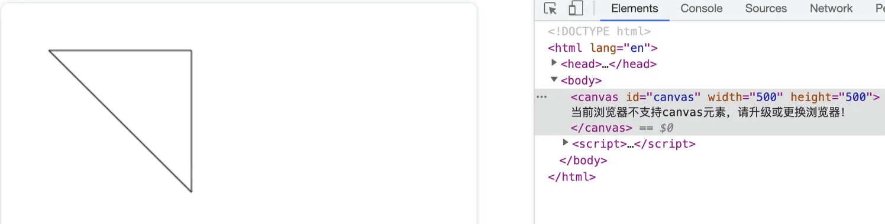


### 矩形

知道了三角形的绘制，那么矩形的绘制是不是也用直线来拼凑呢？答案是否定的，矩形虽然可以用四条直线来拼凑成，但那样太复杂了，Canvas API 给提供了三种绘制矩形的方法：

- strokeRect(x, y, width, height) 绘制一个矩形的边框
- fillRect(x, y, width, height) 绘制一个填充的矩形
- clearRect(x, y, width, height) 清除指定矩形区域，让清除部分完全透明。

下面我们依次看一下他们有什么异同。


#### strokeRect

strokeRect(x, y, width, height) 是用来绘制一个矩形的边框，x和y 是矩形的起点坐标，width和height 是矩形的宽高

```html
<script>
    // 获取 canvas 元素
    var canvas = document.getElementById('canvas');
    // 通过判断getContext方法是否存在来判断浏览器的支持性
    if(canvas.getContext) {
        // 获取绘图上下文
        var ctx = canvas.getContext('2d');
        // 绘制一个矩形边框
        ctx.strokeRect(50, 50, 200, 100);
    }
</script>
```


#### fillRect

fillRect(x, y, width, height) 绘制一个填充的矩形，x和y 是矩形的起点坐标，width和height 是矩形的宽高

```html
<script>
    // 获取 canvas 元素
    var canvas = document.getElementById('canvas');
    // 通过判断getContext方法是否存在来判断浏览器的支持性
    if(canvas.getContext) {
        // 获取绘图上下文
        var ctx = canvas.getContext('2d');
        // 绘制一个填充矩形
        ctx.fillRect(100, 100, 200, 100);
    }
</script>
```

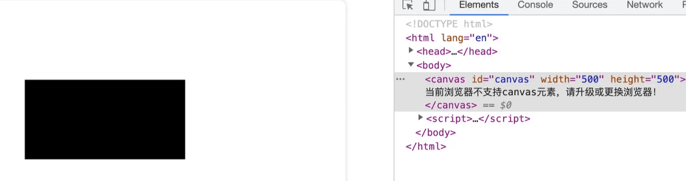


#### clearRect

clearRect(x, y, width, height) 清除指定矩形区域，让清除部分完全透明，x和y 是矩形的起点坐标，width和height 是矩形的宽高。这里需要结合结合另外两种画法来对比一下，才能看出具体的效果，代码如下：

```html
<script>
    // 获取 canvas 元素
    var canvas = document.getElementById('canvas');
    // 通过判断getContext方法是否存在来判断浏览器的支持性
    if(canvas.getContext) {
        // 获取绘图上下文
        var ctx = canvas.getContext('2d');
        // 绘制一个填充矩形
        ctx.fillRect(100, 100, 200, 100);
        ctx.fillRect(50, 50, 200, 100);
        ctx.clearRect(75, 75, 100, 70);
    }
</script>
```

如下图，中间白色的矩形就是被指定清除的区域：


### 圆弧和圆

#### 半弧

绘制圆弧或者圆，使用的方法是：arc(x, y, radius, startAngle, endAngle, anticlockwise)。x和Y为圆心的坐标，radius为半径，startAngle为圆弧或圆的开始位置，endAngle为圆弧或圆的结束位置，anticlockwise是绘制的方向（不写默认为false，从顺时针方向）。

下面画一个半圆弧看看效果，代码如下：

```html
<script>
    // 获取 canvas 元素
    var canvas = document.getElementById('canvas');
    // 通过判断getContext方法是否存在来判断浏览器的支持性
    if(canvas.getContext) {
        // 获取绘图上下文
        var ctx = canvas.getContext('2d');
        // 绘制一段圆弧
        ctx.arc(60, 60, 50, 0, Math.PI, false);
        ctx.stroke();
    }
</script>
```


这里需要注意的是：在画弧的时候，arc()函数中角的单位是弧度而不是角度。角度换算为弧度的表达式为：弧度=(Math.PI/180)*角度。


#### 整圆

所以想要画一个圆的弧度就是：Math.PI*2，咱们继续画一个圆弧看一下，代码如下：

```html
<script>
    // 获取 canvas 元素
    var canvas = document.getElementById('canvas');
    // 通过判断getContext方法是否存在来判断浏览器的支持性
    if(canvas.getContext) {
        // 获取绘图上下文
        var ctx = canvas.getContext('2d');
        ctx.stroke();
        // 绘制一个圆弧
        ctx.arc(200, 60, 50, 0, Math.PI*2, false);
        ctx.stroke();
    }
</script>
```

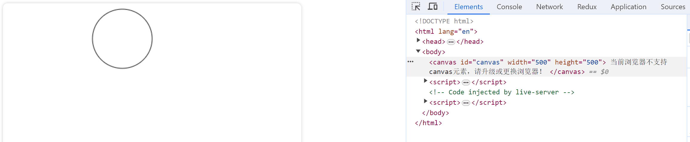


#### 半弧+整圆

但是现在我想先画一个半圆，再画一个整圆

```html
<script>
    // 获取 canvas 元素
    var canvas = document.getElementById('canvas');
    // 通过判断getContext方法是否存在来判断浏览器的支持性
    if(canvas.getContext) {
        // 获取绘图上下文
        var ctx = canvas.getContext('2d');
        // 绘制一段圆弧
        ctx.arc(60, 60, 50, 0, Math.PI, false);
        ctx.stroke();
        // 绘制一个圆弧
        ctx.arc(200, 60, 50, 0, Math.PI*2, false);
        ctx.stroke();
    }
</script>
```

但效果似乎不想我们想象的一样，如下图：

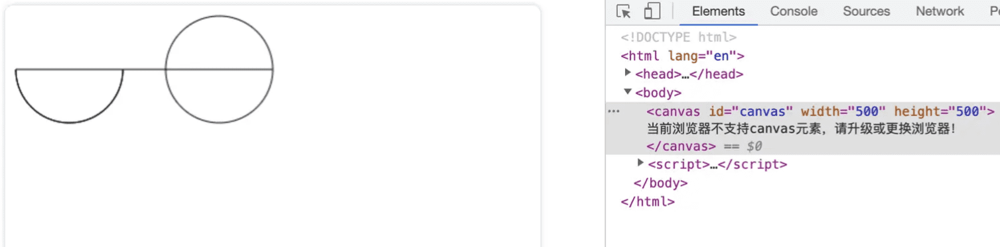

如上图所示，先画的半圆弧和后画的圆弧被连在了一起，其实这是因为在咱们每次新建路径的时候都需要开启和闭合路径，这样不同路径之间才不会相互干扰。下面咱们就来介绍一下如何开启和闭合路径。


- **beginPath**：新建一条路径，生成之后，图形绘制命令被指向到路径上。

- **closePath**：闭合路径之后图形绘制命令又重新指向到上下文中。

具体怎么使用这两个函数呢？下面咱们介绍一下，直接上代码：

```html
<script>
    // 获取 canvas 元素
    var canvas = document.getElementById('canvas');
    // 通过判断getContext方法是否存在来判断浏览器的支持性
    if(canvas.getContext) {
        // 获取绘图上下文
        var ctx = canvas.getContext('2d');
        // 绘制一段圆弧
        ctx.beginPath() // 开启路径
        ctx.arc(60, 60, 50, 0, Math.PI, false);
        ctx.stroke();
        ctx.closePath() // 闭合路径
        // 绘制一个圆弧
        ctx.beginPath() // 开启路径
        ctx.arc(200, 60, 50, 0, Math.PI*2, false);
        ctx.stroke();
        ctx.closePath() // 闭合路径
    }
</script>
```


这里有一点需要说明一下，其实在咱们开启和关闭路径的时候，关闭路径其实并不是必须的，对于新路径其实每次都开启新路径就ok。

以上其实都是通过stroke方法来做描边，那么如果想填充有没有对应的方法呢？


#### 填充

**fill**：stroke方法是通过线条来绘制图形轮廓，而fill方法则是通过填充路径的内容区域生成实心的图形。

具体如何使用举个例子看一下。代码如下：

```html
<script>
    // 获取 canvas 元素
    var canvas = document.getElementById('canvas');
    // 通过判断getContext方法是否存在来判断浏览器的支持性
    if(canvas.getContext) {
        // 获取绘图上下文
        var ctx = canvas.getContext('2d');
        // 绘制一段圆弧
        ctx.beginPath() // 开启路径
        ctx.arc(60, 60, 50, 0, Math.PI, false);
        ctx.stroke();
        // 绘制一个圆弧
        ctx.beginPath() // 开启路径
        ctx.arc(200, 60, 50, 0, Math.PI*2, false);
        ctx.stroke();
        // 填充一个四分之一圆弧
        ctx.beginPath() // 开启路径
        ctx.arc(60, 200, 50, 0, Math.PI/2, false);
        ctx.fill();
        // 填充一个半圆弧
        ctx.beginPath() // 开启路径
        ctx.arc(200, 200, 50, 0, Math.PI, false);
        ctx.fill();
        // 填充一个圆弧
        ctx.beginPath() // 开启路径
        ctx.arc(350, 200, 50, 0, Math.PI*2, false);
        ctx.fill();
    }
</script>
```

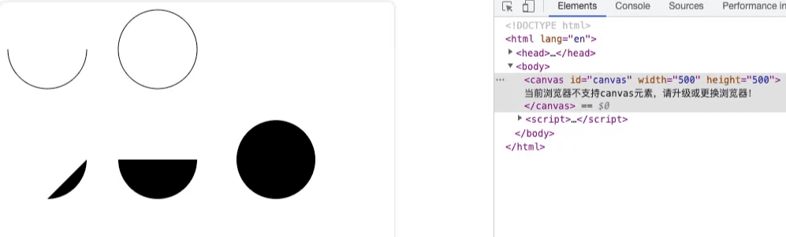


### 椭圆

添加椭圆路径。

语法：ellipse(x, y, radiusX, radiusY, rotation, startAngle, endAngle, anticlockwise)

- x、y：椭圆的圆心位置
- radiusX、radiusY：x轴和y轴的半径
- rotation：椭圆的旋转角度，以弧度表示
- startAngle：开始绘制点
- endAngle：结束绘制点
- anticlockwise：绘制的方向（默认顺时针），可选参数。

举个例子看一下：

```html
<script>
    // 获取 canvas 元素
    var canvas = document.getElementById('canvas');
    // 通过判断getContext方法是否存在来判断浏览器的支持性
    if(canvas.getContext) {
        // 获取绘图上下文
        var ctx = canvas.getContext('2d');
        ctx.beginPath();
        ctx.ellipse(100, 150, 50, 100, 0, 0, 2 * Math.PI);
        ctx.stroke();
        ctx.beginPath();
        ctx.ellipse(400, 150, 50, 100, 0, 0, 2 * Math.PI);
        ctx.stroke();
        ctx.beginPath();
        ctx.ellipse(250, 350, 50, 100, Math.PI/2, 0, 2 * Math.PI); // 旋转90°
        ctx.fill();
    }
</script>
```

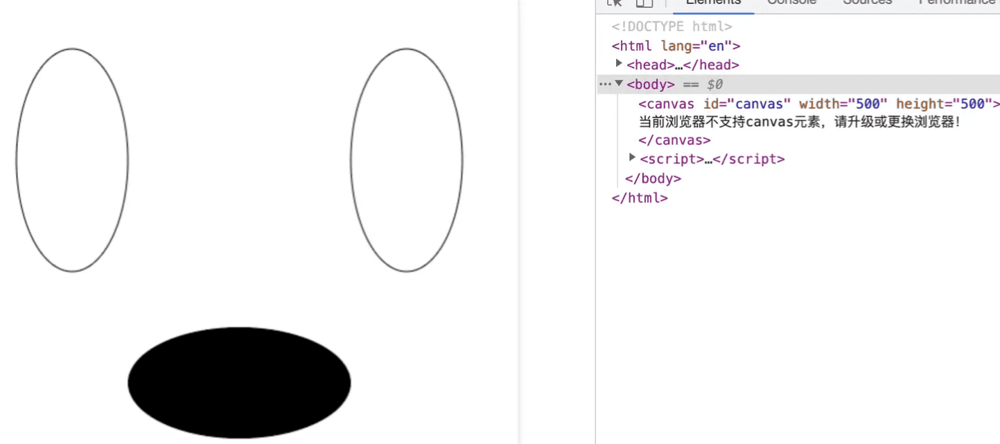


### 贝塞尔曲线

贝塞尔曲线一般用来绘制复杂有规律的图形，在Canvas中也是一个十分有用的路径类型。


#### 二次贝塞尔曲线

语法：quadraticCurveTo(cp1x, cp1y, x, y)，其中cp1x和cp1y为一个控制点，x和y为结束点。

举个例子，代码如下：

```html
<script>
    // 获取 canvas 元素
    var canvas = document.getElementById('canvas');
    // 通过判断getContext方法是否存在来判断浏览器的支持性
    if(canvas.getContext) {
        // 获取绘图上下文
        var ctx = canvas.getContext('2d');
        // 绘制一段二次贝塞尔曲线
        ctx.moveTo(50, 50);
        ctx.quadraticCurveTo(200, 200, 350, 50);
        // 绘制
        ctx.stroke();
    }
</script>
```


如上图，一段二次贝塞尔曲线是通过一个起点、终点和结束点来控制的。下面通过控制点的变化来看一下二次贝塞尔曲线的变化。

把控制点往左移100像素点，代码如下：

```html
<script>
    // 获取 canvas 元素
    var canvas = document.getElementById('canvas');
    // 通过判断getContext方法是否存在来判断浏览器的支持性
    if(canvas.getContext) {
        // 获取绘图上下文
        var ctx = canvas.getContext('2d');
        // 绘制一段二次贝塞尔曲线
        ctx.beginPath() // 开启路径
        ctx.moveTo(50, 50);
        ctx.quadraticCurveTo(200, 200, 350, 50);
        // 绘制
        ctx.stroke();
        // 绘制一段二次贝塞尔曲线
        ctx.beginPath() // 开启路径
        ctx.moveTo(50, 250);
        ctx.quadraticCurveTo(100, 400, 350, 250);
        // 绘制
        ctx.stroke();
    }
</script>
```


这个其实可以借助一个网页版的[二次贝塞尔曲线调试工具](https://link.juejin.cn/?target=http%3A%2F%2Fblogs.sitepointstatic.com%2Fexamples%2Ftech%2Fcanvas-curves%2Fquadratic-curve.html)来看一下效果


#### 三次贝塞尔曲线

和二次贝塞尔曲线不同的是三次贝塞尔曲线有两个控制点。

语法：ctx.bezierCurveTo(cp1x,cp1y, cp2x,cp2y, x, y)，其中cp1x和cp1y为一个控制点，cp2x和cp2y为第二个控制点，x和y为结束点。

举个例子，代码如下：

```html
<script>
    // 获取 canvas 元素
    var canvas = document.getElementById('canvas');
    // 通过判断getContext方法是否存在来判断浏览器的支持性
    if(canvas.getContext) {
        // 获取绘图上下文
        var ctx = canvas.getContext('2d');
        // 绘制一段三次贝塞尔曲线
        ctx.beginPath() // 开启路径
        ctx.moveTo(50, 200);
        ctx.bezierCurveTo(150, 50, 250, 350, 350, 200);
        // 绘制
        ctx.stroke();
    }
</script>
```

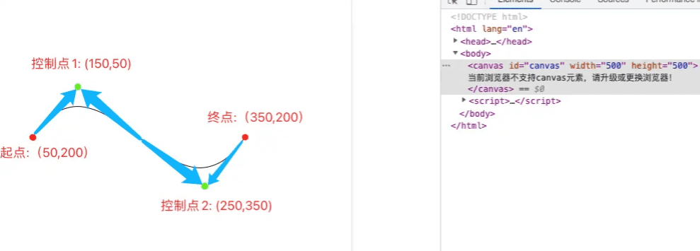

这里也可以借助一个网页版的[三次贝塞尔曲线调试工具](https://link.juejin.cn/?target=http%3A%2F%2Fblogs.sitepointstatic.com%2Fexamples%2Ftech%2Fcanvas-curves%2Fbezier-curve.html)来看一下效果


## 绘制样式

在上面的图形绘制中都只是默认的样式。接下来说一下具体有哪些绘制样式。


### 线条的样式

线条的样式可以通过下面一系列属性来设置。


#### lineWidth

lineWidth 设置当前绘线的粗细。属性值必须为正数。默认值是 1.0。

```js
// 获取 canvas 元素
var canvas = document.getElementById('canvas');
// 通过判断getContext方法是否存在来判断浏览器的支持性
if(canvas.getContext) {
    // 获取绘图上下文
    var ctx = canvas.getContext('2d');
    // 绘制一条宽度为10的直线
    ctx.beginPath()
    ctx.lineWidth = 10;
    ctx.moveTo(50, 20);
    ctx.lineTo(250, 20);
    ctx.stroke();
    ctx.closePath();
    // 绘制一条宽度为20的直线
    ctx.beginPath()
    ctx.lineWidth = 20;
    ctx.moveTo(50, 50);
    ctx.lineTo(250, 50);
    ctx.stroke();
    ctx.closePath();
}
```


#### lineCap

lineCap 设置线段端点显示的样子。可选值为：butt，round 和 square。默认是 butt。

```js
// 获取 canvas 元素
var canvas = document.getElementById('canvas');
// 通过判断getContext方法是否存在来判断浏览器的支持性
if(canvas.getContext) {
    // 获取绘图上下文
    var ctx = canvas.getContext('2d');
    // lineCap 值为 butt
    ctx.beginPath()
    ctx.lineWidth = 10;
    ctx.lineCap='butt'
    ctx.moveTo(50, 20);
    ctx.lineTo(250, 20);
    ctx.stroke();
    ctx.closePath();
    // lineCap 值为 round
    ctx.beginPath()
    ctx.lineWidth = 10;
    ctx.lineCap='round'
    ctx.moveTo(50, 50);
    ctx.lineTo(250, 50);
    ctx.stroke();
    ctx.closePath();
    // lineCap 值为 square
    ctx.beginPath()
    ctx.lineWidth = 10;
    ctx.lineCap='square'
    ctx.moveTo(50, 80);
    ctx.lineTo(250, 80);
    ctx.stroke();
    ctx.closePath();
}
```


#### lineJoin

lineJoin 该属性可以设置两线段连接处所显示的样子。可选值为：round, bevel 和 miter。默认是 miter。

```js
// 获取 canvas 元素
var canvas = document.getElementById('canvas');
// 通过判断getContext方法是否存在来判断浏览器的支持性
if(canvas.getContext) {
    // 获取绘图上下文
    var ctx = canvas.getContext('2d');
    // lineJoin 值为 miter
    ctx.beginPath()
    ctx.lineWidth = 10;
    ctx.lineJoin='miter'
    ctx.moveTo(50, 20);
    ctx.lineTo(100, 60);
    ctx.lineTo(150, 20);
    ctx.lineTo(200, 60);
    ctx.lineTo(250, 20);
    ctx.stroke();
    ctx.closePath();
    // lineJoin 值为 round
    ctx.beginPath()
    ctx.lineWidth = 10;
    ctx.lineJoin='round'
    ctx.moveTo(50, 100);
    ctx.lineTo(100, 140);
    ctx.lineTo(150, 100);
    ctx.lineTo(200, 140);
    ctx.lineTo(250, 100);
    ctx.stroke();
    ctx.closePath();
    // lineJoin 值为 bevel
    ctx.beginPath()
    ctx.lineWidth = 10;
    ctx.lineJoin='bevel'
    ctx.moveTo(50, 180);
    ctx.lineTo(100, 220);
    ctx.lineTo(150, 180);
    ctx.lineTo(200, 220);
    ctx.lineTo(250, 180);
    ctx.stroke();
    ctx.closePath();
}
```


#### miterLimit

miterLimit 限制当两条线相交时交接处最大长度；所谓交接处长度（斜接长度）是指线条交接处内角顶点到外角顶点的长度。

线段之间夹角比较大时，交点不会太远，但随着夹角变小，交点距离会呈指数级增大。

如果交点距离大于miterLimit值，连接效果会变成了 lineJoin = bevel 的效果。

举个例子看一下

```js
// 获取 canvas 元素
var canvas = document.getElementById('canvas');
// 通过判断getContext方法是否存在来判断浏览器的支持性
if(canvas.getContext) {
    // 获取绘图上下文
    var ctx = canvas.getContext('2d');
    // miterLimit为定值，角度越大
    ctx.beginPath()
    ctx.lineWidth = 5;
    ctx.lineJoin='miter'
    ctx.miterLimit = 10
    ctx.moveTo(0, 100);
    for (i = 0; i < 30 ; i++) {
        var dy = i % 2 == 0 ? 200 : 100;
        ctx.lineTo(Math.pow(i, 1.5) * 2, dy);
    }
    ctx.stroke();
    ctx.closePath();
}
```

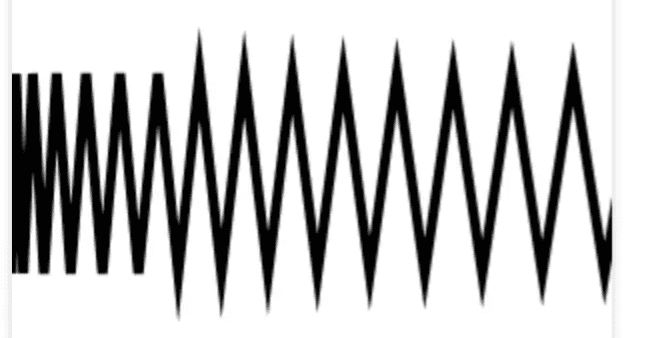


#### setLineDash/getLineDash

setLineDash 可以设置当前虚线样式。

getLineDash 则是返回当前虚线设置的样式，长度为非负偶数的数组。

举个例子看一下

```js
// 获取 canvas 元素
var canvas = document.getElementById('canvas');
// 通过判断getContext方法是否存在来判断浏览器的支持性
if(canvas.getContext) {
    // 获取绘图上下文
    var ctx = canvas.getContext('2d');
    // 绘制一条虚线
    ctx.setLineDash([5, 10, 20]);
    console.log(ctx.getLineDash()); // [5, 10, 20, 5, 10, 20]
    ctx.beginPath();
    ctx.moveTo(0,100);
    ctx.lineTo(400, 100);
    ctx.stroke();
    // 再绘制一条虚线
    ctx.setLineDash([5, 10, 20, 40]);
    console.log(ctx.getLineDash()); // [5, 10, 20, 40]
    ctx.beginPath();
    ctx.moveTo(0,200);
    ctx.lineTo(400, 200);
    ctx.stroke();
}
```

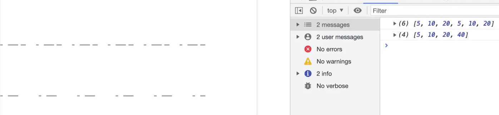

首先这里画两条虚线是想对比一下传参为奇数数组和偶数数组的区别，在我们设置虚线的时候，如果传参为奇数，例如：ctx.setLineDash([5, 10, 20])，那么 setLineDash 会复制一份数组补全为偶数，相当于我们设置的是：ctx.setLineDash([5, 10, 20, 5, 10, 20])。所以这也就是为什么上图中我们设置的是 [5, 10, 20]，结果打印出来是 [5, 10, 20, 5, 10, 20]


#### lineDashOffset

lineDashOffset 设置虚线样式的起始偏移量。

这里咱们再画第三条虚线来对比一下

```js
// 获取 canvas 元素
var canvas = document.getElementById('canvas');
// 通过判断getContext方法是否存在来判断浏览器的支持性
if(canvas.getContext) {
    // 获取绘图上下文
    var ctx = canvas.getContext('2d');
    // 绘制一段圆弧
    ctx.setLineDash([5, 10, 20]);
    console.log(ctx.getLineDash()); // [5, 10, 20, 5, 10, 20]
    ctx.beginPath();
    ctx.moveTo(0,100);
    ctx.lineTo(400, 100);
    ctx.stroke();
    ctx.setLineDash([5, 10, 20, 40]);
    console.log(ctx.getLineDash()); // [5, 10, 20, 40]
    ctx.beginPath();
    ctx.moveTo(0,200);
    ctx.lineTo(400, 200);
    ctx.stroke();
    ctx.setLineDash([5, 10, 20, 40]);
    ctx.lineDashOffset = 3;
    ctx.beginPath();
    ctx.moveTo(0,300);
    ctx.lineTo(400, 300);
    ctx.stroke();
}
```

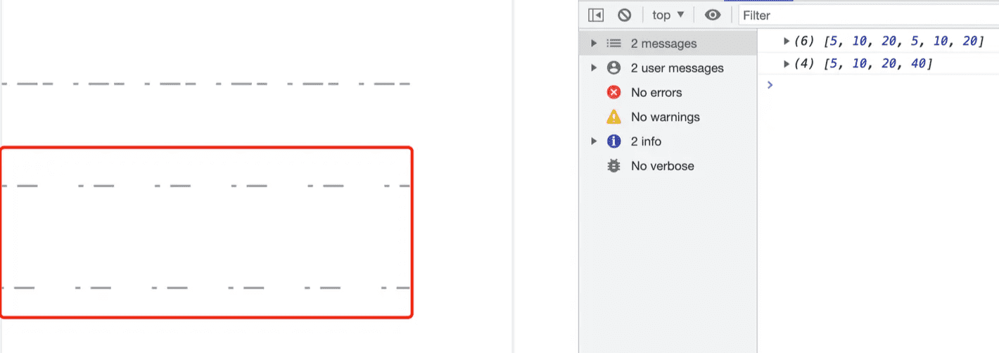

这里可以明显看出虚线的总长度没有变化，只是起始点向左位移了3像素。


### 透明度

除了绘制实色的图形，还可以绘制有透明度的图形。通过设置 globalAlpha 属性或者使用有透明度的样式作为轮廓或填充都可以实现

```js
// 获取 canvas 元素
var canvas = document.getElementById('canvas');
// 通过判断getContext方法是否存在来判断浏览器的支持性
if(canvas.getContext) {
    // 获取绘图上下文
    var ctx = canvas.getContext('2d');
    // 绘制一个矩形
    ctx.beginPath();
    // 指定透明度的填充样式
    ctx.fillStyle = "rgba(0, 255, 0, 0.2)";
    ctx.fillRect(10,10,300,100);
    // 绘制一个矩形边框
    ctx.beginPath();
    // 指定透明度的描边样式
    ctx.strokeStyle = "rgba(255, 0, 0, 0.7)";
    ctx.strokeRect(10, 90, 100, 300);
    // 绘制一个圆
    ctx.beginPath()
    ctx.fillStyle = "rgba(255, 255, 0, 1)";
    // 设置透明度值
    ctx.globalAlpha = 0.5;
    ctx.arc(200, 200, 100, 0, Math.PI*2, true);
    ctx.fill();
}
```

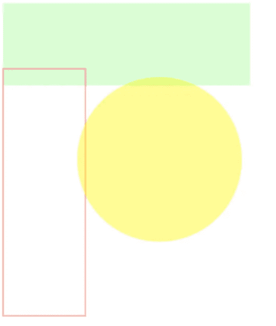


### 渐变

渐变分为两种，分别是线性渐变和径向渐变，在绘图中我们可以用线性或者径向的渐变来填充或描边。

#### 线性渐变

语法： createLinearGradient(x1, y1, x2, y2)，参数分别为 起点的坐标和终点的坐标。

在渐变的设置中还需要一个方法来添加渐变的颜色，语法为：gradient.addColorStop(offset, color)，其中color就是颜色，offset 则是颜色的偏移值，只为0到1之间的数。

```js
// 获取 canvas 元素
var canvas = document.getElementById('canvas');
// 通过判断getContext方法是否存在来判断浏览器的支持性
if(canvas.getContext) {
    // 获取绘图上下文
    var ctx = canvas.getContext('2d');
    // 创建渐变
    var gradient1 = ctx.createLinearGradient(10, 10, 400, 10);
    gradient1.addColorStop(0, "#00ff00");
    gradient1.addColorStop(1, "#ff0000");
    var gradient2 = ctx.createLinearGradient(10, 10, 400, 10);
    // 从0.5的位置才开始渐变
    gradient2.addColorStop(0.5, "#00ff00");
    gradient2.addColorStop(1, "#ff0000");
    ctx.beginPath()
    ctx.fillStyle = gradient1;
    ctx.fillRect(10, 10, 400, 100);
    ctx.beginPath();
    ctx.fillStyle = gradient2;
    ctx.fillRect(10, 150, 400, 100);
}
```

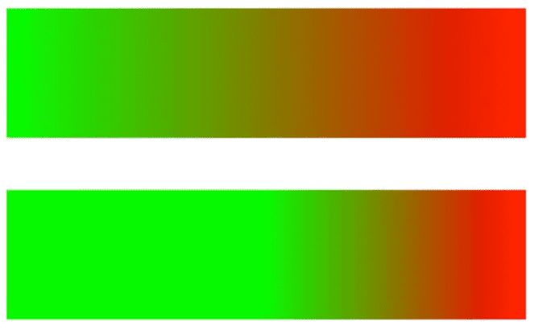

#### 径向渐变

语法：ctx.createRadialGradient(x0, y0, r0, x1, y1, r1)，参数分别为开始圆的坐标和半径以及结束圆的坐标和半径。

```js
// 获取 canvas 元素
var canvas = document.getElementById('canvas');
// 通过判断getContext方法是否存在来判断浏览器的支持性
if(canvas.getContext) {
    // 获取绘图上下文
    var ctx = canvas.getContext('2d');
    // 创建渐变
    // 结束坐标为点
    var gradient1 = ctx.createRadialGradient(100, 100, 100, 100, 100, 0);
    gradient1.addColorStop(0, "#ff770f");
    gradient1.addColorStop(1, "#ffffff");
    // 结束坐标为半径30的圆
    var gradient2 = ctx.createRadialGradient(320, 100, 100, 320, 100, 30); 
    gradient2.addColorStop(0, "#ff770f");
    gradient2.addColorStop(1, "#ffffff");
    // 从0.5的位置才开始渲染
    var gradient3 = ctx.createRadialGradient(100, 320, 100, 100, 320, 0); 
    gradient3.addColorStop(0.5, "#ff770f"); 
    gradient3.addColorStop(1, "#ffffff");
    // 开始坐标和结束坐标不一样
    var gradient4 = ctx.createRadialGradient(320, 320, 100, 250, 250, 0);
    gradient4.addColorStop(0, "#ff770f");
    gradient4.addColorStop(1, "#ffffff");
    ctx.beginPath();
    ctx.fillStyle = gradient1;
    ctx.fillRect(10, 10, 200, 200);
    ctx.beginPath();
    ctx.fillStyle = gradient2;
    ctx.fillRect(220, 10, 200, 200);
    ctx.beginPath();
    ctx.fillStyle = gradient3;
    ctx.fillRect(10, 220, 200, 200);
    ctx.beginPath();
    ctx.fillStyle = gradient4;
    ctx.fillRect(220, 220, 200, 200);
}
```


### 图案形状

Canvas中想绘制图案效果，需要用 createPattern 方法来实现。

语法：createPattern(image, type)，参数分别为：Image 参数可以是一个 Image 对象，也可以是一个 canvas 对象，Type 为图案绘制的类型，可用的类型分别有：repeat，repeat-x，repeat-y 和 no-repeat。

首先先看一下如何应用 Image 对象来绘制图案。

```js
// 获取 canvas 元素
var canvas = document.getElementById('canvas');
// 通过判断getContext方法是否存在来判断浏览器的支持性
if(canvas.getContext) {
    // 获取绘图上下文
    var ctx = canvas.getContext('2d');
    // 创建一个 image对象
    var img = new Image();
    img.src = "./image.png";
    img.onload = function() {
        // 图片加载完以后
        // 创建图案
        var ptrn = ctx.createPattern(img, 'no-repeat');
        ctx.fillStyle = ptrn;
        ctx.fillRect(0, 0, 500, 500);
    }
}
```

上面是一个用image对象绘制的例子，效果如下：


从上面的代码我们可以看出，本来我们想填充的是一个500*500的长方形，但是因为咱们绘制的类型设置为不平铺（no-repeat）所以看到的效果不能让我们满意，那么咱们分别看看这四个类型分别是什么效果。

设置为平铺（repeat），效果如下：

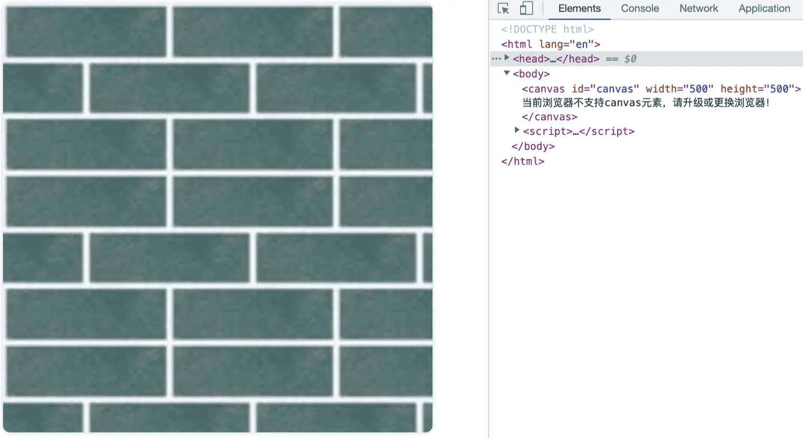

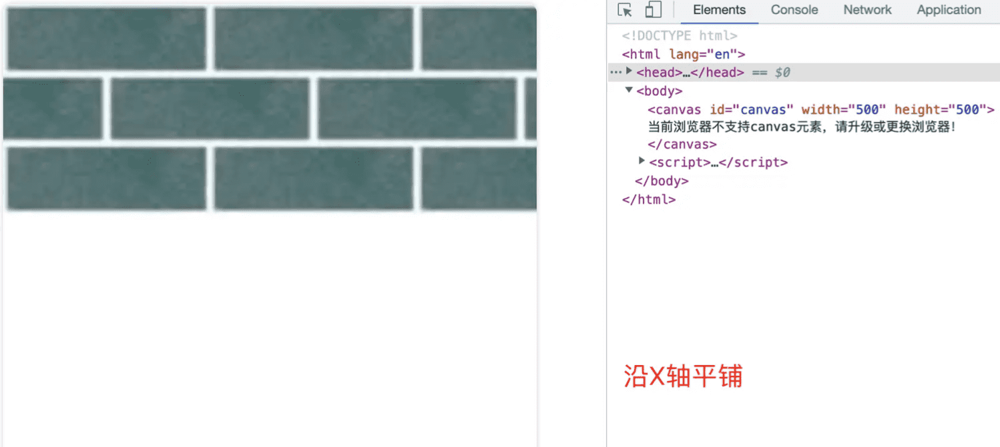

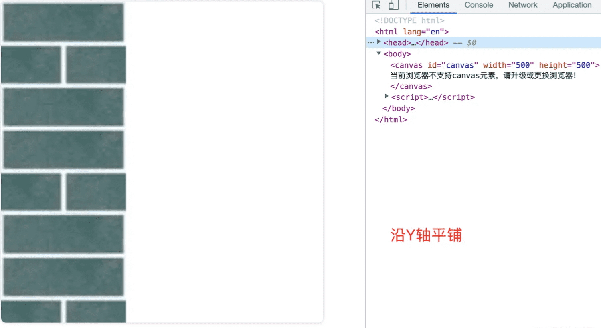

最后看一下如何应用 canvas 对象来绘制图案。 举个例子看一下：

```html
<!DOCTYPE html>
<html lang="en">
    <head>
        <meta charset="UTF-8">
        <meta http-equiv="X-UA-Compatible" content="IE=edge">
        <meta name="viewport" content="width=device-width, initial-scale=1.0">
        <title>canvas - 绘制图案</title>
        <style>
            /* 给画布增加一个阴影和圆角的样式 */
            canvas {
                box-shadow: 0px 0px 5px #ccc;
                border-radius: 8px;
                margin-right: 50px;
            }
        </style>
    </head>
    <body>
        <canvas id="canvas" width="200" height="200">
            当前浏览器不支持canvas元素，请升级或更换浏览器！
        </canvas>
        <canvas id="canvas2" width="500" height="500">
            当前浏览器不支持canvas元素，请升级或更换浏览器！
        </canvas>
        <script>
            // 获取 canvas 元素
            var canvas = document.getElementById('canvas');
            var canvas2 = document.getElementById('canvas2');
            // 通过判断getContext方法是否存在来判断浏览器的支持性
            if(canvas.getContext && canvas2.getContext) {
                // 获取绘图上下文
                var ctx = canvas.getContext('2d');
                var ctx2 = canvas2.getContext('2d');
                // 创建一个 canvas对象
                var img = new Image();
                img.src = "./image.png";
                img.onload = function() {
                    // 图片加载完以后
                    // 创建图案
                    var ptrn = ctx.createPattern(img, 'repeat');
                    ctx.fillStyle = ptrn;
                    ctx.fillRect(0, 0, 200, 200);
                    // 用canvas来绘制canvas2
                    var ptrn2 = ctx2.createPattern(canvas, 'repeat');
                    ctx2.fillStyle = ptrn2;
                    ctx2.fillRect(0, 0, 500, 500);
                }
            }
        </script>
    </body>
</html>
```


上面的例子可以看出，canvas2是用canvas1来绘制图案的


## 绘制文本

### strokeText（描边）

语法：ctx.strokeText(text, x, y, maxWidth)参数分别为：

- text：绘制的文案
- x、y：文本的起始位置
- maxWidth：可选参数，最大宽度。需要注意的是当文案大于最大宽度时不是裁剪或者换行，而是缩小字体。

```js
// 获取 canvas 元素
var canvas = document.getElementById('canvas');
// 通过判断getContext方法是否存在来判断浏览器的支持性
if(canvas.getContext) {
    // 获取绘图上下文
    var ctx = canvas.getContext('2d');
    ctx.font = "50px serif"; // 设置文案大小和字体
    ctx.strokeText("Canvas 详解", 50, 50);
}
```


### fillText（填充）

语法：ctx.fillText(text, x, y, maxWidth)参数分别为：

- text：绘制的文案
- x、y：文本的起始位置
- maxWidth：可选参数，最大宽度。需要注意的是当文案大于最大宽度时不是裁剪或者换行，而是缩小字体。

```js
// 获取 canvas 元素
var canvas = document.getElementById('canvas');
// 通过判断getContext方法是否存在来判断浏览器的支持性
if(canvas.getContext) {
    // 获取绘图上下文
    var ctx = canvas.getContext('2d');
    ctx.font = "50px serif"; // 设置文案大小和字体
    ctx.fillText("Canvas 详解", 50, 50);
}
```


### 文本样式

文本也是可以添加样式的，下面看一下可以设置那些样式

```
font/textAlign/direction/textBaseline/measureText...
```


### 阴影

```
shadowOffsetX/shadowOffsetY/shadowBlur/shadowColor
```


## 绘制图片

绘制图片和上面的图案样式绘制基本大同小异，不同的是所用方式不一样，绘制图片是使用 drawImage 方法将它渲染到 canvas 里。


这里咱们主要要说的就是drawImage方法的使用，他的用法有三种，是根据不同的传参实现不同的功能。先看看都有哪些参数：

- image：绘制到上下文的元素。
- sx、sy：裁剪框的左上角X轴坐标和Y轴坐标。
- sWidth、sHeight：裁剪框的宽度和高度。
- dx、dy：绘制到上下文的元素，在上下文中左上角的X轴坐标和Y轴坐标。
- dWidth、dHeight：绘制到上下文的元素，在上下文中绘制的宽度和高度。如果不说明，在绘制时image宽度和高度不会缩放。


### 绘制

drawImage(image, dx, dy)：只有单纯的绘制功能，可以绘制图片、视频和别的Canvas对象等。

```js
// 获取 canvas 元素
var canvas = document.getElementById('canvas');
// 通过判断getContext方法是否存在来判断浏览器的支持性
if(canvas.getContext) {
    // 获取绘图上下文
    var ctx = canvas.getContext('2d');
    var img = new Image();
    img.src = '...';
    img.onload = function(){
        ctx.drawImage(img, 0, 0);
    }
}
```


如上图所示，咱们可以简单地把一个图片绘制到Canvas中。但上面的效果却不是我们预期中的效果，那么如果我们想把图片完整的绘制到canvas中，我们就需要别的参数。


### 缩放

drawImage(image, dx, dy, dWidth, dHeight)：在绘制的基础上我们又增加了两个参数，这两个参数能控制绘制元素的大小，整体实现一个缩放的效果。

```js
// 获取 canvas 元素
var canvas = document.getElementById('canvas');
// 通过判断getContext方法是否存在来判断浏览器的支持性
if(canvas.getContext) {
    // 获取绘图上下文
    var ctx = canvas.getContext('2d');
    var img = new Image();
    img.src = '...';
    img.onload = function(){
        ctx.drawImage(img, 0, 0, 500, 500);
    }
}
```

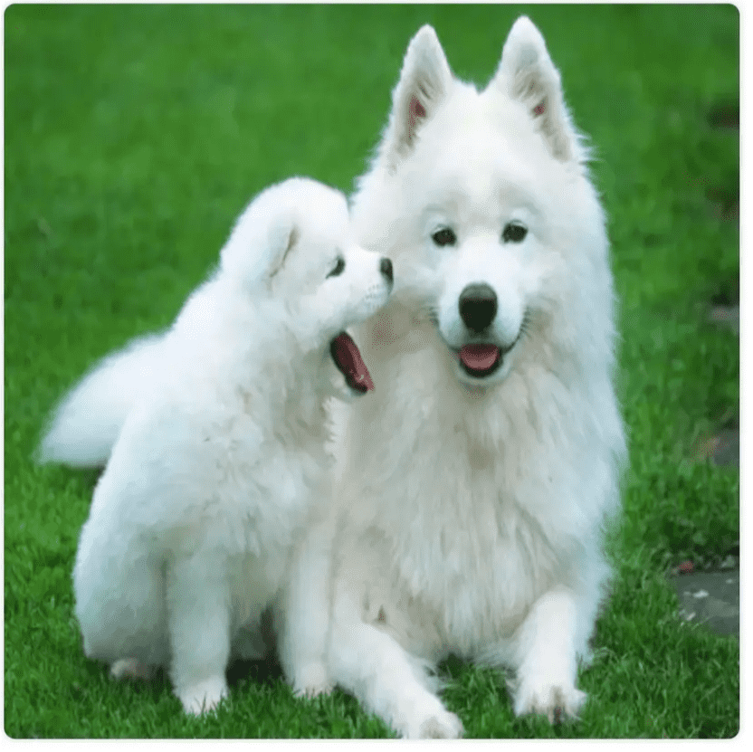

这里需要说明一点，在设置dWidth和dHeight两个参数时，不能只设置其中一个，要么都设置要么都不设置。


### 剪裁

drawImage(image, sx, sy, sWidth, sHeight, dx, dy, dWidth, dHeight)：在缩放的基础上又增加了四个参数，整体也是在缩放的基础上增加了裁剪的功能。

```js
// 获取 canvas 元素
var canvas = document.getElementById('canvas');
// 通过判断getContext方法是否存在来判断浏览器的支持性
if(canvas.getContext) {
    // 获取绘图上下文
    var ctx = canvas.getContext('2d');
    var img = new Image();
    img.src = '...';
    img.onload = function(){
        // 在图片的（100，100）位置，裁剪一个300*300大小的内容，然后缩放到500*500绘制到Canvas中（0, 0）的地方
        ctx.drawImage(img, 100, 100, 300, 300, 0, 0, 500, 500);
    }
}
```

上面代码其实就是：在原图片的（100，100）位置，裁剪一个300*300大小的内容，然后再缩放到500*500绘制到Canvas中（0, 0）的地方。


## 变形

变形算是canvas基础的进阶把，它是一种更强大的方法，可以将原点移动到另一点，还能对网格进行旋转和缩放。


### 状态的保存和恢复

save() 和 restore() 方法是用来保存和恢复 canvas 状态的，方法不需要参数。可以理解为就是对canvas 状态的快照进行保存和恢复。

```js
var canvas = document.getElementById('canvas');
// 通过判断getContext方法是否存在来判断浏览器的支持性
if(canvas.getContext) {
    // 获取绘图上下文
    var ctx = canvas.getContext('2d');
    ctx.fillStyle = "#cccccc";
    ctx.fillRect(10, 10, 300, 100);
    ctx.save(); // 保存状态
    ctx.fillStyle = "#ee7034";
    ctx.fillRect(10, 150, 300, 100);
    ctx.restore(); // 还原到上次保存的状态
    ctx.fillRect(10, 300, 300, 100);
}
```

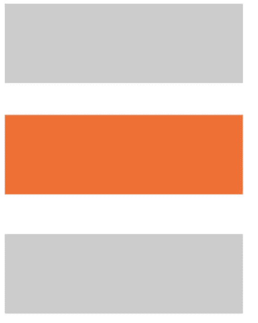

如上图效果我们可以看出，当我们保存一个状态以后，在我们恢复以后可以继续使用这个状态。

Canvas的状态是存储在栈中的，每次调用save()方法后，当前的状态都会被推送到栈中保存起来。

一个绘画状态包括：

- 应用的变形：移动、旋转、缩放、strokeStyle、fillStyle、globalAlpha、lineWidth、lineCap、lineJoin、miterLimit、lineDashOffset、shadowOffsetX、shadowOffsetY、shadowBlur、shadowColor、globalCompositeOperation、font、textAlign、textBaseline、direction、imageSmoothingEnabled等。
- 应用的裁切路径：clipping path

PS：保存和恢复可以多次调用， 需要注意的是每一次调用 restore 方法，上一个保存的状态就从栈中弹出，所有设定都恢复。


### 移动、旋转和缩放

- 移动：translate(x, y) ，x 是左右偏移量，y 是上下偏移量。
- 旋转：rotate(angle)，angle是旋转的角度，它是顺时针旋转，以弧度为单位的值。
- 缩放：scale(x, y)，x 为水平缩放的值，y 为垂直缩放得值。x和y的值小于1则为缩小，大于1则为放大。默认值为 1。

```js
// 获取 canvas 元素
var canvas = document.getElementById('canvas');
// 通过判断getContext方法是否存在来判断浏览器的支持性
if(canvas.getContext) {
    // 获取绘图上下文
    var ctx = canvas.getContext('2d');
    ctx.fillStyle = '#ee7034';
    ctx.save();
    ctx.save();
    ctx.translate(100, 100); // x和y轴都移动了100
    ctx.fillRect(0, 0, 100, 100);
    ctx.restore();
    ctx.rotate(Math.PI / 4); // 旋转了45度，Math.PI=180度
    ctx.fillRect(0, 0, 100, 100);
    ctx.restore();
    ctx.scale(2, 1);
    ctx.fillRect(100, 300, 100, 100);
}
```


PS：这里需要注意三点：

- save()保存的状态是可以多次保存的，同时保存在栈中的元素遵循的是后进先出的顺序；
- 旋转的中心点始终是 canvas 的原点；
- 缩放如果是负值的话，则是一个镜像的效果。


### transform、setTransform、resetTransform

- transform(a, b, c, d, e, f)方法能将当前的变形矩阵乘上一个基于自身参数的矩阵；
- setTransform(a, b, c, d, e, f)方法会将当前变形矩阵重置为单位矩阵，然后用相同的参数调用 transform 方法
- resetTransform()方法为重置当前变形为单位矩阵。效果等同于调用 setTransform(1, 0, 0, 1, 0, 0)

需要注意的是transform方法和setTransform方法中如果任意一个参数是无限大（Infinity），那么变形矩阵也必须被标记为无限大，否则会抛出异常。

参数说明：

- a：水平方向的缩放
- b：竖直方向的倾斜偏移
- c：水平方向的倾斜偏移
- d：竖直方向的缩放
- e：水平方向的移动
- f：竖直方向的移动


## 合成与裁剪


## 动画

在 canvas 上绘制内容是用 canvas 提供的或者自定义的方法，而通常我们仅仅在脚本执行结束后才能看见结果，所以想在 for 循环里面完成动画是不可能的。那么为了实现动画，我们需要一些可以定时执行重绘的方法。

- setInterval(function, delay) ：定时器，当设定好间隔时间后，function 会定期执行。
- setTimeout(function, delay)：延时器，在设定好的时间之后执行函数
- requestAnimationFrame(callback)：告诉浏览器你希望执行一个动画，并在重绘之前，请求浏览器执行一个特定的函数来更新动画。

如果不需要与用户互动，可以使用 setInterval() 方法，它可以定期执行指定的代码。如果需要做游戏，可以使用键盘或者鼠标事件配合上 setTimeout() 方法来实现。通过设置事件监听，可以捕捉用户的交互，并执行相应的动作。

下面我们采用 window.requestAnimationFrame()来实现一个动画效果。requestAnimationFrame()方法提供了更加平缓且有效率的方式来执行动画，当系统准备好重绘条件后才会调用绘制动画帧。一般每秒钟回调函数执行 60 次，也有可能会被降低，因为通常情况下requestAnimationFrame()方法会遵循 W3C 的建议，浏览器中的回调函数执行次数通常与浏览器屏幕刷新次数相匹配。还有为了提高性能和电池寿命，通常 requestAnimationFrame() 方法运行在后台标签页或者隐藏在 里时，requestAnimationFrame() 方法会暂停调用以提升性能和电池寿命。

```js
// 获取 canvas 元素
var canvas = document.getElementById('canvas');
// 通过判断getContext方法是否存在来判断浏览器的支持性
if(canvas.getContext) {
    // 获取绘图上下文
    var ctx = canvas.getContext('2d');
    var sun = new Image();
    var moon = new Image();
    var earth = new Image();
    function init(){
        sun.src = 'https://img.lovepik.com/element/40097/4339.png_300.png';
        moon.src = 'https://www.freepnglogos.com/uploads/moon-png/moon-png-annual-celestial-overview-simone-matthews-18.png';
        earth.src = 'https://gd-filems.dancf.com/mcm79j/mcm79j/92054/b3162056-61ba-4ebd-8da1-fd98ce15a1cb31401764.png';
        window.requestAnimationFrame(draw);
    }
    function draw() {
        var ctx = document.getElementById('canvas').getContext('2d');
        ctx.globalCompositeOperation = 'destination-over';
        // 清空画布
        ctx.clearRect(0, 0, 500, 500);
        ctx.fillStyle = 'rgba(0, 0, 0, 0.4)';
        ctx.strokeStyle = 'rgba(0, 153, 255, 0.4)';
        ctx.save(); // 第一次保存画布状态
        ctx.translate(250, 250); // 把原心移到画布中间
        // 画一个地球
        var time = new Date();
        var earthDeg =  ((2 * Math.PI) / 60) * time.getSeconds() + ((2 * Math.PI) / 60000) * time.getMilliseconds()
        ctx.rotate(earthDeg);
        ctx.translate(200, 0);
        ctx.drawImage(earth, -20, -20, 40, 40);
        // 画一个月亮
        ctx.save(); // 第二次保存画布状态
        var moonDeg = ((2 * Math.PI) / 6) * time.getSeconds() + ((2 * Math.PI) / 6000) * time.getMilliseconds() 
        ctx.rotate(moonDeg);
        ctx.translate(0, 40);
        ctx.drawImage(moon, -7.5, -7.5, 15, 15);
        // 恢复状态
        ctx.restore(); 
        ctx.restore();
        // 画一个地球运行的轨迹
        ctx.beginPath();
        ctx.arc(250, 250, 200, 0, Math.PI * 2, false);
        ctx.stroke();
        // 画一个太阳
        ctx.drawImage(sun, 0, 0, 500, 500);
        window.requestAnimationFrame(draw);
    }
    init();
}
```

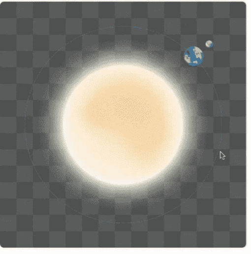

总结一下绘制动画的基本步骤

- 清空 canvas：除非接下来要画的内容会完全充满 canvas（例如背景图），否则需要清空所有。最简单的做法就是用 clearRect 方法。
- 保存 canvas 状态：如果要改变 canvas 状态的设置（样式，变形之类的），之后又要在每画一帧之时都是原始状态的情况时，需要先保存一下。
- 绘制动画图形（animated shapes）
- 恢复 canvas 状态：如果已经保存了 canvas 的状态，可以先恢复它，然后重绘下一帧。


## 高级动画

高级动画就是在初级动画的基础上加上一些符合物理的运动，这样就能使我们的动画更生动而不是那么的呆板。


### 绘制小球

```js
// 获取 canvas 元素
var canvas = document.getElementById('canvas');
// 通过判断getContext方法是否存在来判断浏览器的支持性
if(canvas.getContext) {
    // 获取绘图上下文
    var ctx = canvas.getContext('2d');
    var ball = {
        x: 100,
        y: 100,
        radius: 25,
        color: 'blue',
        draw: function() {
            ctx.beginPath();
            ctx.arc(this.x, this.y, this.radius, 0, Math.PI * 2, true);
            ctx.closePath();
            ctx.fillStyle = this.color;
            ctx.fill();
        }
    };
    ball.draw();
}
```


### 速率

我们通过给小球添加速率矢量进行移动。这个依旧用requestAnimationFrame() 方法来实现，在每一帧里面，依旧用clear 清理掉之前帧里旧的圆形。

```js
// 获取 canvas 元素
var canvas = document.getElementById('canvas');
// 通过判断getContext方法是否存在来判断浏览器的支持性
if(canvas.getContext) {
    // 获取绘图上下文
    var ctx = canvas.getContext('2d');
    var ball = {
        x: 100,
        y: 100,
        vx: 1,
        vy: 3,
        radius: 25,
        color: 'blue',
        draw: function() {
            ctx.beginPath();
            ctx.arc(this.x, this.y, this.radius, 0, Math.PI * 2, true);
            ctx.closePath();
            ctx.fillStyle = this.color;
            ctx.fill();
        }
    };
    function draw() {
        ctx.clearRect(0, 0, canvas.width, canvas.height);
        ball.draw();
        // 添加速率
        ball.x += ball.vx;
        ball.y += ball.vy;
        window.requestAnimationFrame(draw);
    }
    window.requestAnimationFrame(draw);
    ball.draw();
}
```


### 边界

想让小球反弹那么我们就需要添加边界

```js
// 获取 canvas 元素
var canvas = document.getElementById('canvas');
// 通过判断getContext方法是否存在来判断浏览器的支持性
if(canvas.getContext) {
    // 获取绘图上下文
    var ctx = canvas.getContext('2d');
    var ball = {
        x: 100,
        y: 100,
        vx: 1,
        vy: 3,
        radius: 25,
        color: 'blue',
        draw: function() {
            ctx.beginPath();
            ctx.arc(this.x, this.y, this.radius, 0, Math.PI * 2, true);
            ctx.closePath();
            ctx.fillStyle = this.color;
            ctx.fill();
        }
    };
    function draw() {
        ctx.clearRect(0,0, canvas.width, canvas.height);
        ball.draw();
        // 添加速率
        ball.x += ball.vx;
        ball.y += ball.vy;
        // 添加边界
        if (ball.y + ball.vy > canvas.height || ball.y + ball.vy < 0) {
            ball.vy = -ball.vy;
        }
        if (ball.x + ball.vx > canvas.width || ball.x + ball.vx < 0) {
            ball.vx = -ball.vx;
        }
        window.requestAnimationFrame(draw);
    }
    window.requestAnimationFrame(draw);
    ball.draw();
}
```


### 加速度

为了让动作更真实，我们还需要加入加速度的处理。

```js
// 获取 canvas 元素
var canvas = document.getElementById('canvas');
// 通过判断getContext方法是否存在来判断浏览器的支持性
if(canvas.getContext) {
    // 获取绘图上下文
    var ctx = canvas.getContext('2d');
    var ball = {
        x: 100,
        y: 100,
        vx: 1,
        vy: 3,
        radius: 25,
        color: 'blue',
        draw: function() {
            ctx.beginPath();
            ctx.arc(this.x, this.y, this.radius, 0, Math.PI * 2, true);
            ctx.closePath();
            ctx.fillStyle = this.color;
            ctx.fill();
        }
    };
    function draw() {
        ctx.clearRect(0,0, canvas.width, canvas.height);
        ball.draw();
        // 添加加速度
        ball.vy *= .99;
        ball.vy += .25;
        // 添加速率
        ball.x += ball.vx;
        ball.y += ball.vy;
        // 添加边界
        if (ball.y + ball.vy > canvas.height || ball.y + ball.vy < 0) {
            ball.vy = -ball.vy;
        }
        if (ball.x + ball.vx > canvas.width || ball.x + ball.vx < 0) {
            ball.vx = -ball.vx;
        }
        window.requestAnimationFrame(draw);
    }
    window.requestAnimationFrame(draw);
    ball.draw();
}
```


### 拖尾效果

加一个拖尾效果

```js
// 获取 canvas 元素
var canvas = document.getElementById('canvas');
// 通过判断getContext方法是否存在来判断浏览器的支持性
if(canvas.getContext) {
    // 获取绘图上下文
    var ctx = canvas.getContext('2d');
    var ball = {
        x: 100,
        y: 100,
        vx: 1,
        vy: 3,
        radius: 25,
        color: 'blue',
        draw: function() {
            ctx.beginPath();
            ctx.arc(this.x, this.y, this.radius, 0, Math.PI * 2, true);
            ctx.closePath();
            ctx.fillStyle = this.color;
            ctx.fill();
        }
    };
    function draw() {
        // ctx.clearRect(0, 0, canvas.width, canvas.height);
        // 用带透明度的矩形代替清空
        ctx.fillStyle = 'rgba(255, 255, 255, 0.3)';
        ctx.fillRect(0, 0, canvas.width, canvas.height);
        ball.draw();
        // 添加加速度
        ball.vy *= .995;
        ball.vy += .15;
        // 添加速率
        ball.x += ball.vx;
        ball.y += ball.vy;
        // 添加边界
        if (ball.y + ball.vy > canvas.height || ball.y + ball.vy < 0) {
            ball.vy = -ball.vy;
        }
        if (ball.x + ball.vx > canvas.width || ball.x + ball.vx < 0) {
            ball.vx = -ball.vx;
        }
        window.requestAnimationFrame(draw);
    }
    window.requestAnimationFrame(draw);
    ball.draw();
}
```


## 结语

Canvas在刚推出时主打的优势就是更快的渲染速度，刷新了人们对Web页面元素绘制速度的印象，但Canvas的优势却不仅限于此。随着技术的不断更新Canvas的应用也越来越广泛，各种可视化图标、游戏和各种图形化编辑器都把Canvas突显的淋漓尽致，尤其Google Docs已经宣布将会把HTML迁移到基于Canvas渲染，这一消息的出现又把Canvas推上了一个新的高度。

总之Canvas只会越来越重要，它一定会成为每个前端工程师必备的技能之一。所以学会它掌握它让你的技能图谱再添一员猛将。