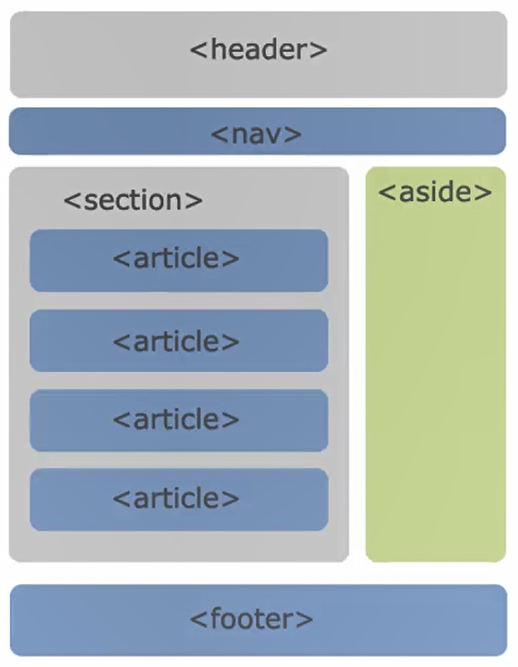

## 文档声明

### !DOCTYPE html

HTML最上方的一段文本我们称之为 **文档类型声明**，用于声明 **文档类型**：`!DOCTYPE html`

- HTML文档声明，告诉浏览器当前页面是HTML5页面
- 让浏览器用HTML5的标准去解析识别内容
- 必须放在HTML文档的最前面，不能省略，省略了会出现兼容性问题


### html元素

- `<html>`元素表示一个HTML文档的**根**（顶级元素），所以它也被称为**根元素**。
- W3C标准建议为html元素增加一个 **lang属性**，作用是：帮助语音合成工具确定要使用的发音；帮助翻译工具确定要使用的翻译规则；
  - lang = "en" ：表示这个HTML文档的语言是英文
  - lang = "zh-CN" ：表示这个HTML文档的语言是中文


### head元素

规定文档相关的配置信息（也称之为元数据，元数据就是描述数据的数据），包括文档的标题，引用的文档样式和脚本等。

**常见设置：**

- 网页标题：title元素：`<title>标题</title>`
- 网页编码：meta元素（功能非常多）
  - 设置网页的字符编码，一般设置为utf-8 【不设置或者设置错误会导致乱码】：`<meta charset="utf-8">`
  - ...


## 元素标签

### body元素

body元素里面的内容将是你在**浏览器窗口中看到的东西**，也就是**网页的具体内容和结构**。


### h元素

在一个页面中通常会有一些比较重要的文字作为标题，这个时候我们可以使用h元素。

`<h1> — <h6> `标题(Heading)元素【h1级别最高，h6最低】

注意：**h元素通过和SEO优化有关系**


### p元素

如果我们想表示一个段落，这个时候可以使用p元素。

`<p>`元素表示**文本的一个段落**


### img元素

使用img元素显示一张图片【img —> image】

**常见属性：**

-src属性：表示源，必须有的【source缩写】，加入路径
-alt属性：不是强制性的，两个作用
  - 当图片加载不成功（错误的地址或者图片资源不存在)，那么会显示这段文本
  - 屏幕阅读器会将这些描述读给需要使用阅读器的使用者听，让他们知道图像的含义
- 这里我们补充一个img的css属性：`object-fit`
  - **`object-fit`** [CSS](https://developer.mozilla.org/zh-CN/docs/Web/CSS) 属性指定[可替换元素](https://developer.mozilla.org/zh-CN/docs/Web/CSS/Replaced_element)（例如：`img`和`video`）的内容应该如何适应到其使用高度和宽度确定的框。
  - 【常取值：cover】


### a元素

在网页中我们经常需要**跳转到另外一个链接**，这个时候我们使用**a元素**：定义超链接，打开新的URL

**常见属性：**

- href：指定要打开的URL地址，也可以是一个本地地址
- target：改属性指定在何处显示链接的资源
  - _self：默认值，在当前窗口打开URL
  - _blank：在一个新的窗口中打开URL
  - 其他的不常用，在 iframe 会简单提及

**锚点链接：**可以实现跳转到网页中的具体位置

两个重要步骤：

- 在要跳到的元素上定义一个id属性
- 定义a元素，并且a元素的href指向对应的id


### iframe元素

利用iframe元素可以实现：在一个HTML文档中嵌入其他HTML文档

【其实在很多网页都设置了禁止在iframe中打开网页，原理是在网络中设置X-Frame-Options: sameorigin】

src：链接地址

frameborder属性：用于规定是否显示边框 

- 1：显示
- 0：不显示

a元素target的其他值：

- _parent:在父窗口中打开URL
- _top:在顶层窗口中打开URL


### div与span元素

 div元素和span元素都是**“纯粹的”容器**，也可以把他们理解成**“盒子”**，它们都是用来**包裹内容**的

- **div元素**：多个div元素包裹的内容会在不同的行显示
  - 一般作为其他元素的父容器，把其他元素包住，代表一个整体
  - 用于把网页分割为多个独立的部分
- **span元素**：多个span元素包裹的内容会在同一行显示
  - 默认情况下，跟普通文本几乎没差别
  - 用于区分特殊文本和普通文本，比如用来显示一些关键字


### 不常见元素

1. strong元素：内容加粗强调
2. i元素：内容倾斜
3. code元素：用于显示代码
4. br元素：换行元素

 


## HTML高级元素

### 列表元素

- 有序列表：ol、li

  - ol：有序列表，直接子元素只能是li

  - li：列表中的每一项

  - 去除有序列表的序列：`list-style:none;`

  - ```html
    <ol>
        <li></li>
        <li></li>
        <li></li>
    </ol>
    ```

- 无序列表：ul、li

  - 去除有序列表的序列：`list-style:none;`

  - ```html
    <ul>
        <li></li>
        <li></li>
        <li></li>
    </ul>
    ```

- 定义列表：dl、dt、dd

  - dl：定义列表，直接子元素只能是dt、dd

  - dt：项，列表中每一项的项目名

  - dd：列表中每一项的具体描述，是对dt的描述、解释、补充。

  - ```html
    <dl>
        <dt>阶段一</dt>
        <dd>第一步</dd>
        <dd>第二步</dd>
        <dd>第三步</dd>
        
        <dt>阶段二</dt>
        <dd>第一步</dd>
        <dd>第二步</dd>
        <dd>第三步</dd>
        
        <dt>阶段三</dt>
        <dd>第一步</dd>
        <dd>第二步</dd>
        <dd>第三步</dd>
    </dl>
    ```


### 表格元素

表格中有很多相关的属性可以设置表格的样式，但是已经不推荐使用了

- table：表格
- tr：表格中的行
- td：行中的单元格
- ...

**单元格合并：**

- 跨列合并：在需要跨列的单元格上使用colspan
- 跨行合并：在需要跨行的单元格上使用rowspan


### 表单元素

- form：表单，一般情况下，其他表单相关元素都是它的后代元素

  - action：服务器地址
  - method：get和post，默认get

- input：单行文本输入框、单选框、复选框、按钮等元素

  - text：文本输入框（明文输入）

  - password：文本输入框（密文输入）

  - radio：单选框

    - name属性实现单选框互斥：设置相同的name

    - ```html
      <input type="radio" name="sex">男
      <input type="radio" name="sex">女
      ```

    - value属性：当我们提交表单的时候，value会携带我们选择的值进行提交

    - ```html
      <input type="radio" name="sex" value="man">男
      <input type="radio" name="sex" value="woman">女
      
      /* 当我们点击提交的时候，对于get请求的在路径上会出现 sex='value值' */
      <button type="submit">提交</button>
      ```

  - checkbox：复选框

  - 按钮

    - button：普通按钮	`<input type="button" value="普通按钮">`  `<button>普通按钮</button>`
    - reset：重置按钮	`<input type="reset" value="重置按钮">`  `<button type="reset">重置按钮</button>`
    - submit：提交按钮	`<input type="submit" value="提交按钮">`  `<button type="submit">提交按钮</button>`

  - file：文件上传

  - ...

- textarea：多行文本框

  - cols：列数
  - rows：行数

- select、option：下拉选择框

- button：按钮

- label：表单元素的标题，可以与input进行交互，当我们点击标题的时候就可以实现对输入框的聚焦【for与id】

  - ```html
    <div>
        <label for="username">用户名</label>
        <input id="username" type="text">
    </div>
    ```

  - 


## HTML全局属性

有一些属性是所有HTML都可以设置和拥有的，这样的属性我们称之为“全局属性(Global Attributes)"

1. id：定义唯一标识符(ID)，该标识符在整个文档中必须是唯一的。其目的是在链接（使用片段标识符)，脚本或样式(使用CSS)时标识元素
2. class：一个以空格分隔的元素的类名(classes ）列表，它允许CSS和Javascript通过类选择器或者DOM方法来选择和访问特定的元素
3. style：给元素添加内联样式
4. title：包含表示与其所属元素相关信息的文本。这些信息通常可以作为提示呈现给用户，但不是必须的
5. ...


## 字符实体

常见字符实体

|      |  描述  |   实体   | 实体编号 |
| :--: | :----: | :------: | :------: |
|      |  空格  | `&nbsp;` | `&#160;` |
|  <   | 小于号 |  `&lt;`  | `&#60;`  |
|  >   | 大于号 |  `&gt;`  | `&#62;`  |
| ...  |  ...   |   ...    |   ...    |


## HTML5语义化元素

我们往往过多的使用div,通过id或class来区分元素，对于浏览器来说这些元素不够语义化，对于搜索引擎来说,不利于SEO的优化

HTML5新增了语义化的元素：

- `<header>`：头部元素
- `<nav>`：导航元素
- `<section>`：定义文档某个区域的元素
- `<article>`：内容元素
- `<aside>`：侧边栏元素
- `<footer>` ：尾部元素




## HTML5新增其他的元素

### 媒体类型

- 视频：`<video>`

  - | 常见属性 |      值的方式      |                           属性作用                           |
    | :------: | :----------------: | :----------------------------------------------------------: |
    |   src    |      URL地址       |                      视频播放的URL地址                       |
    |  width   |    pixels(像素)    |                        设置video宽度                         |
    |  height  |    pixels(像素)    |                        设置video高度                         |
    | controls |    Boolean类型     |        是否显示控制栏,包括音量,跨帧，暂停/恢复播放。         |
    | autoplay |    Boolean类型     | 是否视频自动播放（**某些浏览器需要添加muted才能实现自动播放**) |
    |  muted   |    Boolean类型     |                         是否静音播放                         |
    | preload  | none/metadata/auto | 是否需要预加载视频.metadata表示预加载元数据(比如视频时长等)  |
    |  poster  |      URL地址       |                         —海报帧的URL                         |

  - 在`<video>`元素中间的内容，是针对浏览器不支持此元素时候的降级处理。

    - 内容一：通过`<source>`元素指定更多视频格式的源

    - 内容二：通过p/div等元素指定在浏览器不支持video元素的情况,显示的内容

    - ```html
      /* 浏览器先执行video的视频，如果不支持在执行source的视频，一直往后，如果都不执行，展示p元素的内容 */
      <video src="...">
          <source src="...">
          <source src="...">
          <p>当前您的浏览器不支持，请更换浏览器</p>
      </video>
      ```

- 音频：`<audio>`

  - | 常见属性 |      值的方式      |                           属性作用                           |
    | :------: | :----------------: | :----------------------------------------------------------: |
    |   src    |      URL地址       |                      视频播放的URL地址                       |
    | controls |    Boolean类型     |        是否显示控制栏,包括音量,跨帧，暂停/恢复播放。         |
    | autoplay |    Boolean类型     | 是否视频自动播放（**某些浏览器需要添加muted才能实现自动播放**) |
    |  muted   |    Boolean类型     |                         是否静音播放                         |
    | preload  | none/metadata/auto | 是否需要预加载视频.metadata表示预加载元数据(比如视频时长等)  |

  - 在`<audio>`元素中间的内容，是针对浏览器不支持此元素时候，依然使用 `<source>`


### input元素的扩展内容

**属性新增**：

- placeholder：输入框的占位文字
- multiple：多个值
- autofocus：自动聚焦


## 全局属性 data-*

在HTML5中，新增一种全局属性的格式data-*，用于自定义数据属性：data设置的属性可以在JavaScript的DOM操作中通过dataset轻松获取到；通常用于HTML和JavaScript数据之间的传递；

```html
<body>
    <div class="box" data-name="xjn" data-age="age"></div>
    
    <script>
        let box = document.querySelector('.box')
        console.log(box.dataset);
    </script>
</body>
```