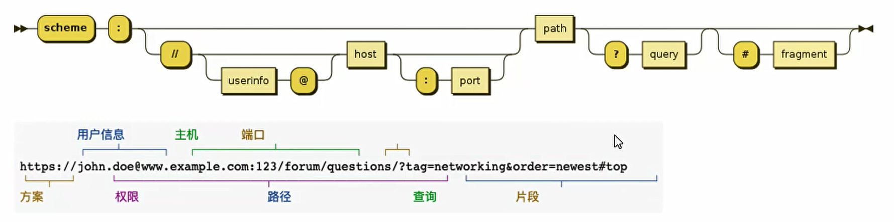
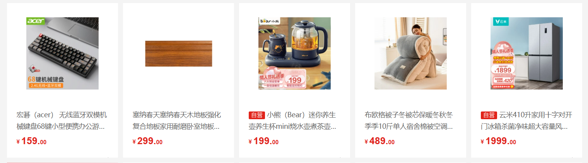
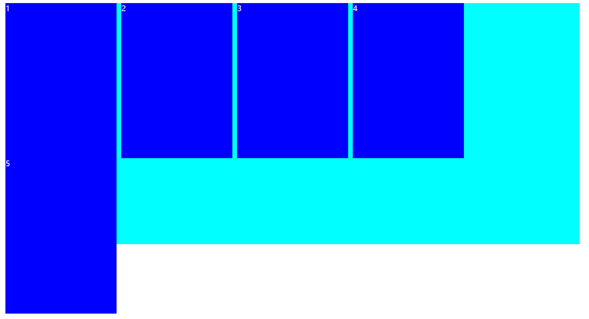
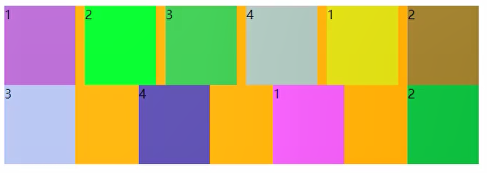
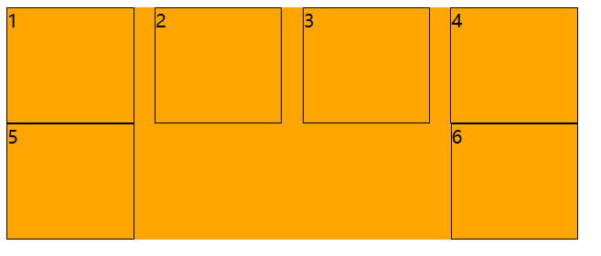
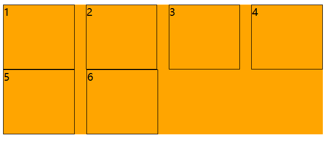

## 认识URL

### URL的格式

**URL代表着是统一资源定位符**

URL的标准格式：[协议类型]://[服务器地址]:[端口号]/[文件路径]:[文件名]/[][]?[查询]#[片段ID]




### 和URI的区别

- 区别
  - URl = Uniform Resource ldentifier  统一资源**标志符**，用于标识Web技术使用的逻辑或物理资源
  - URL = Uniform Resource Locator    统一资源**定位符**，俗称网络地址，相当于网络中的门牌号
- URI在某一个规则下能把一个资源独一无二的识别出来。
  - URL作为一个网络Web资源的地址，可以唯一将一个资源识别出来，所以URL是一个URI
  - 所以URL是URI的一个子集
  - 但是URI并不一定就是URL


## 元素语义化

元素的语义化：用正确的元素做正确的事情

好处：

- 方便代码维护
- 减少让开发者之间的沟通成本
- 能让语音合成工具正确识别网页元素的用途，以便作出正确的反应
- 有利于SEO
- ...


## SEO

搜索擎优化(英语: search engine optimization，缩写为SEO)是通过了解搜索引擎的运作规则来调整网站，以及提高网站在有关搜索引擎内排名的方式。


## CSS补充

### 单行显示省略号

```css
white-space: nowrap;	/* 文本一行显示 */
overflow: hidden;	/* 隐藏超出的文本 */
text-overflow: ellipsis;	/* 超出的用省略号 */
```


### 去除表格中间隙和两层边框

当我们给td设置 border的时候，两个单元格之间会出现间隙和两层边框

给table加上边框折叠属性：`border-collapse:collapse;`


### 用CSS画一个三角形

使用**border**

```html
<style>
    .box{
        width: 100px;
        height: 100px;
        border: 100px solid red;
        box-sizing: border-box;
        border-top-color: transparent;
        border-left-color: transparent;
        border-right-color: transparent;
    }
</style>


<div class="box"></div>
```


### 随着浏览器窗口变化，图片中间部分一直在浏览器中间显示

#### 方法一：使用background-position

```html
<style>
    .box{
       background-image:url(...);
       background-position:center;
    }
</style>


<div class="box"></div>
```


#### 方法二：使用relative

```html
<style>
    .box{
        height: 400px;
        background-color: red;
        overflow: hidden;
    }

    .box img{
        position:relative;
        /*left: px ;  这个大小需要我们计算一下，值为你的图片长度的一半,下面是优化 */
        transfrom:translate(-50%,0);
        margin-left: 50%;
    }
</style>


<div class="box">
    
</div>
```

 

### 去除多个行内级元素中间的空格

造成这样的原因是因为我们在写代码的时候，换行符被浏览器解析了

```html
/* 换行符造成了行内级元素之间有间隙 */
<div>
    <span>1</span>
    <span>2</span>
    <span>3</span>
</div>
```

- 删除换行符(不推荐)
- 将父级元素的font-size设置为0，但是需要子元素设置回来（不推荐）
- 通过子元素(span)统一向一个方向浮动即可
- flex布局


### 中间居中布局

1、**效果图**



2、当我们设置为这样的时候：

```html
<style>
    body,div{
        margin: 0;
        padding: 0;
        box-sizing: border-box;
    }
    .box{
        width: 1190px;
        height: 500px;
        background-color: aqua;
        margin: 0 auto;
        color:white;
    }
    .item{
        width: 230px;
        height: 322px;
        background-color: blue;
        float: left;
        margin-right: 10px;
    }
</style> 

<body>
    <div class="box">
        <div class="item">1</div>
        <div class="item">2</div>
        <div class="item">3</div>
        <div class="item">4</div>
        <div class="item">5</div>
    </div>
</body>
```

3、变成这样：4、第五个区域会因为不够宽而跑出去，因为我们设置了box宽度为1190px；盒子宽度230px；margin-right:10px；总宽度 230×5+10×5 = 1200 > 1190

5、**解决办法**【不能直接将 .box的宽度设置为1200px，如果直接设置，其实我们的区域向左偏了这个 margin-left:10px;】

在 .item 外面重新套一个div，把这个div的宽度变成 1200px 

```html
<style>
    body,div{
        margin: 0;
        padding: 0;
        box-sizing: border-box;
    }
    .box{
        width: 1190px;
        height: 500px;
        background-color: aqua;
        margin: 10px auto;
        color: white;
    }
    .contain{
        margin-right: -10px;
    }
    .item{
        width: 230px;
        height: 322px;
        background-color: blue;
        float: left;
        margin-right: 10px;
    }
</style> 

<body>
    <div class="box">
        <div class="contain">
            <div class="item">1</div>
            <div class="item">2</div>
            <div class="item">3</div>
            <div class="item">4</div>
            <div class="item">5</div>
        </div>
    </div>
</body>
```

6、为什么里面的div宽度会变成 1200px呢？

**原理**：定位参照对象的宽度= left + right + margin-left + margin-right + 绝对定位元素的实际占用宽度

父级盒子宽度（.box）= 子盒子（.contain） + left + right + margin-left + margin-right

1190px = x + 0 + 0 + 0 + (-10px)		——>			所有x被迫为1200px，子盒子宽度为1200px


### 解决如下布局问题

#### 问题





```html
<style>
    .container{
        width: 500px;
        background-color: orange;
        display: flex;
        flex-wrap: wrap;
        justify-content: space-between;
    }

    .item{
        width: 110px;
        height: 100px;
        border: 1px solid black;
        box-sizing: content-box;
    }
</style> 

<body>
    <div class="container">
        <div class="item item1">1</div>
        <div class="item item2">2</div>
        <div class="item item3">3</div>
        <div class="item item4">4</div>
        <div class="item item5">5</div>
        <div class="item item6">6</div>
    </div>
</body>
```


#### 解决办法

加入span元素（或者i也行）去填充空缺的位置



```
<style>
    .container{
        width: 500px;
        background-color: orange;
        display: flex;
        flex-wrap: wrap;
        justify-content: space-between;
    }

    .item{
        width: 110px;
        height: 100px;
        border: 1px solid black;
        box-sizing: content-box;
    }
    
     span{
     	/* 设置的宽度就是items的宽度，用span来填充空的位置，因为span没有设置高度，所以不会有影响 */
    	 width: 110px;
     }
</style> 

<body>
    <div class="container">
        <div class="item item1">1</div>
        <div class="item item2">2</div>
        <div class="item item3">3</div>
        <div class="item item4">4</div>
        <div class="item item5">5</div>
        <div class="item item6">6</div>
        /* 添加span个数为 列数-2 */
         <span></span>
         <span></span>
    </div>
</body>
```


### 蒙版

```html
 <div className="coverAll"></div>


.coverAll{
	// 记得给父元素这是 position:relative;
    position: absolute;
    left:0;
    right: 0;
    top: 0;
    bottom: 0;
    background-color:rgba(255,255,255,.8)
}
```