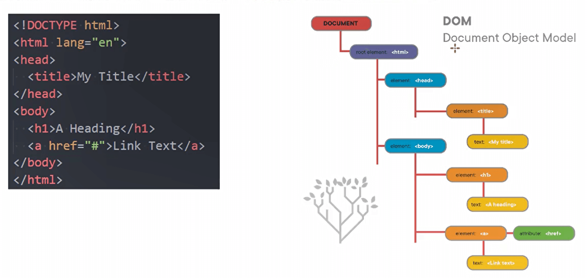
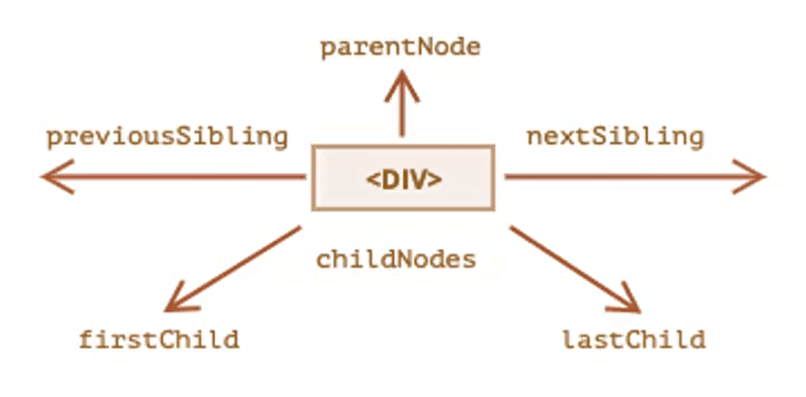
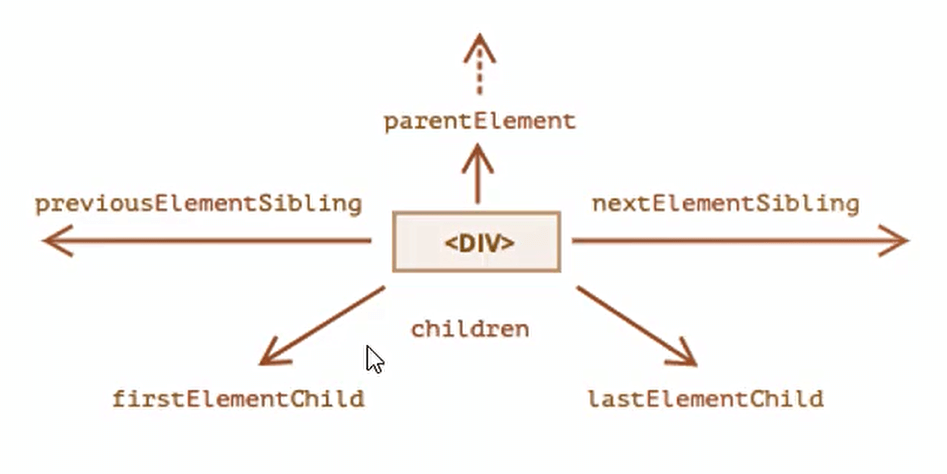
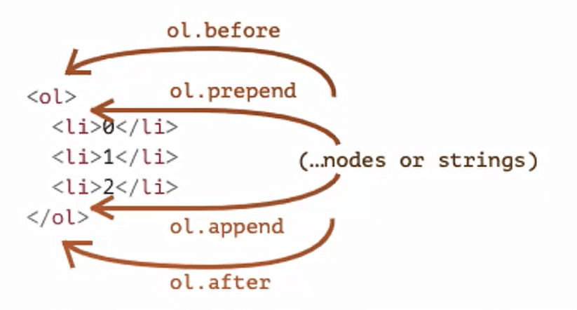
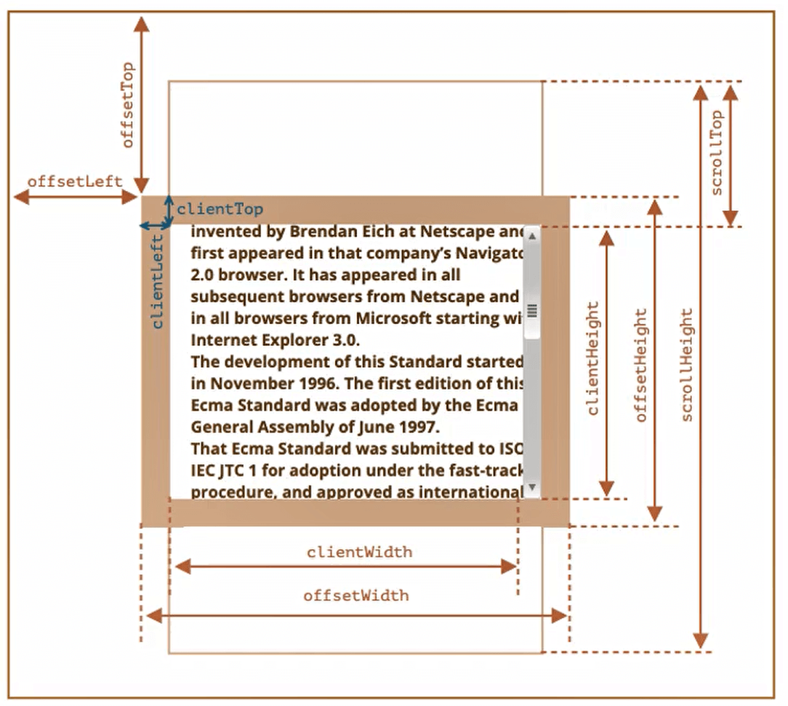

## JavaScript基础

### 三种编写方式

- 位置一：HTML代码行内
- 位置二：script标签内
- 位置三：外部的script文件【需要通过script元素的src属性来引入JavaScript文件】


### `<noscript>`元素

如果运行的浏览器不支持JavaScript，那么我们如何给用户更好的提示呢?

- 针对早期浏览器不支持JavaScript 的问题，需要一个页面优雅降级的处理方案

- 最终，`<noscript>`元素出现，被用于给不支持JavaScript的浏览器提供替代内容

- ```html
  <noscript>
  	<p>您的浏览器不支持或打开运行script！</p>
  </noscript>
  ```


### 注意事项

- 注意一：script元素不能写成单标签
  - 在外联式引用js文件时，script标签中不可以写JavaScript代码，并且script标签不能写成单标签
  - 即不能写成`<script src= “index.js"/>`
- 注意二：省略type属性
  - 在以前的代码中，`<script>`标签中会使用type=“text/javascript”
  - 现在可不写这个代码了，因为JavaScript是所有现代浏览器以及HTML5中的默认脚本语言
- 注意三：**加载顺序**
  - 作为HTML文档内容的一部分，JavaScript默认遵循HTML文档的加载顺序，即自上而下的加载顺序
  - 推荐将JavaScript代码和编写位置放在body子元素的最后一行
- 注意四：JavaScript代码严格区分大小写


### Javascript用户交互

|    交互方法     |    方法说明    |       效果查看       |
| :-------------: | :------------: | :------------------: |
|      alert      |  接受一个参数  |       弹窗查看       |
| **console.log** |  接受多个参数  |  在浏览器控制台查看  |
| document.write  | 接受多个字符串 |   在浏览器页面查看   |
|     prompt      |  接受一个参数  | 在浏览器接受用户输入 |


### 文档注释

使用 `/**` 敲回车即可生成

```js
/**
 * 纪录姓名年龄
 * @param {string} name 姓名
 * @param {*} age 年龄
 */
function aa(name,age){
    console.log("dad");
}
```


### typeof

用来确定变量的数据类型 `typeof name` 【name是变量的名称】

- "undefined"返回"undefined"
- "boolean"返回"boolean"
- "string"返回"string"
- "number"返回"number"
- "object"和"null"和"数组"返回"object"
- "function"返回"function"
- "symbol”返回"symbol"

注意："object"和"null"和"Array"返回"object"


### Javascript数据类型

#### 所有类型

基本数据类型（又叫原始数据类型）：boolean、null、undefined、String、Number、symbol

引用类型：Object

- **Number**
- **String**
- **Boolean**
- **Undefined**
- **Null**
- **Object**
- Biglnt(后续了解)
- Symbol(后续了解)


#### Number类型

number类型表示整数和浮点数，并且number类型是可以进行数值运算的。

除了常规的数字，还包括所谓的“特殊数值(“special numeric values")”也属于Number类型(了解)

- **Infinity**: 代表数学概念中的无穷大，也可以表示-Infinity【比如1/0得到的就是无穷大】
- **NaN**: NaN代表一个计算错误，它是一个错误的操作所得到的结果【比如字符串和一个数字相乘 `3 * 'abc'`】

判断一个变量是不是数字：isNaN【`isNaN(result)`，是数字返回true，不是返回false】


#### String类型

一般在开发中有文本需要表示，需要使用字符串String


#### Boolean类型

表示真假，true和false


#### Undefined类型

Undefined类型只有一个值，就是特殊值undefined。如果我们声明一个变量，但是没有对其进行初始化时，它默认就是undefined

这里有两个注意事项：

- 注意一：最好在变量定义的时候进行初始化，而不只是声明一个变量
- 注意二：不要显示的将一个变量赋值为undefined【如果变量刚开始什么都没有，我们可以初始化为0、空字符串、null等值】


#### Object类型

**Object类型是一个特殊的类型，我们通常把它称为引用类型或者复杂类型**

- 其他的数据类型我们通常称之为“原始类型”，因为它们的值质保函一个单独的内容（字符串、数字或者其他)
- Object往往可以表示一组数据，是其他数据的一个集合
- 在JavaScript中我们可以使用花括号{}的方式来表示一个对象


#### Null类型

当对一个对象类型进行初始化时,不建议初始化为大括号，建议初始化null

`var book = {}`会隐式的专为true

`var book = null`会隐式的专为false

null和undefined的关系：

- undefined通常只有在一个变量声明但是未初始化时，它的默认值是undefined才会用到
- 并且我们不推荐直接给一个变量赋值为undefined，所以很少主动来使用
- null值非常常用，当一个变量准备保存一个对象，但是这个对象不确定时，我们可以先赋值为null


### 数据类型的转换

#### 其他类型转换成String

- 转换方式一：隐式转换

  - 一个字符串和其他类型进行+操作【如果+运算符左右两边有一个是字符串，那么另一边会自动转换成字符串类型进行拼接】

    - ```js
      var num1 = 123
      var num2 = num1 + ""//我们常常使用空字符串来进行转换
      ```

  - 某些函数的执行也会自动将参数转为字符串类型

- 转换方式二：显式转换

  - 调用String()函数

    - ```js
      var num1 = 123
      var num2 = String(num1)
      ```

  - 调用toString()方法（后续面向对象再学习)


#### 其他类型转换成Number

- 转换方式一:隐式转换
  - 在算数运算中，通常会将其他类型转换成数字类型来进行运算【比如"6”/ "2"，但是如果是+运算，并且其中一边有字符串，那么还是按照字符串来连接的】
- 转换方式二:显式转换
  - 我们也可以使用Number()函数来进行显式的转换


其他类型转换数字的规则:

|     值     |                          转换后的值                          |
| :--------: | :----------------------------------------------------------: |
| undefined  |                             NaN                              |
|    null    |                              0                               |
| true/false |                             1/0                              |
|   String   | 去掉首尾空格后的纯数字字符串中含有的数字。<br/>如果剩余字符串为空，则转换结果为0。<br/>否则，将会从剩余字符串中“读取"数字。<br/>当类型转换出现 error时返回NaN。 |


#### 其他类型转换成Boolean

布尔(boolean)类型转换是最简单的。它发生在逻辑运算中，但是也可以通过调用Boolean(value)显式地进行转换。
转换规则如下:

- 直观上为“空”的值(如0、空字符串、null、undefined和NaN)将变为false。
- 其他值变成true。
- **注意：包含0的字符串"0”是true**【因为他是非空字符串，非空字符串总是true】


### 代码块

**理解代码块，和对象进行区别**

代码块：

```js
{
    var num1 = 10;
    var name = "jl";
}
```

对象：

```js
var obj = {
	name:"jl",
    num1:10
}
```

代码块是多行执行代码的集合，通过一个花括号{}放到了一起

- 在开发中，一行代码很难完成某一个特定的功能，我们就会将这些代码放到一个代码块中


### 三元运算符

格式：`var result = condition ? value1 : value2`【condition是条件的意思，条件成立result = vaule1，否则等于value2】


## JavaScript函数

### 函数的声明

#### 函数声明

【优先选择函数声明】

`function foo(){}`


#### 函数的表达式

`var foo = function(){}`


#### 函数声明 VS 函数表达式

```js
foo1()//foo1
function foo1(){
    console.log("foo1");
}


foo2()//报错：Uncaught TypeError: foo2 is not a function
var foo2 = function(){
    console.log("foo2");
}
```


### 函数返回值return

函数不仅仅可以有参数,也可以有返回值：

- 使用return关键字来返回结果
- 一旦在函数中执行return操作，那么当前函数会立即终止
- 如果函数中没有使用return语句，那么函数有默认的返回值:undefined
- 如果函数使用return语句，但是return后面没有任何值，那么函数的返回值也是: undefined


### 递归

eg：实现一个数的多少次方【不使用es7语法 ** 和Math方法】

使用for循环：

```js
<script>

    function foo(x,y){
        var result = 1
        for (let index = 0; index < y; index++) {
            result = x*result
        }
        return result
    }

console.log(foo(2,3));

</script>
```

使用递归：

```js
//原理： x^n = x * x^(n-1)
<script>

    function foo(x,y){
        if(y === 1) return x
        return x * foo(x,y-1)
    }

console.log(foo(2,3));

</script>
```

递归实现斐波那契数列：

```js
<script>

    // n位置值 = (n-1)位置值 + (n-2)位置值
    function foo(n){
        if(n === 1 || n === 2) return 1
        return foo(n-1) + foo(n-2)
    }

console.log(foo(4));

</script>
```


### 局部变量和外部变量

#### 作用域

- 定义的变量在哪一个范围可以被使用，称为这个变量的作用域(scoped)

- ES5之前是没有块级作用域（var定义的变量是没有块级作用域）

  - ```js
    //两个都可以访问到message
    {
        var message = "是这样的"
        console.log("代码块中的message：" + message)
    }
    console.log("代码块外的message：" + message)
    ```

- ES5之前函数代码块是会形成自己的作用域的【意味着在函数内部定义的变量在外部是访问不到的】

变量定义：

- 全局变量：在全局(script元素中)定义一个变量，那么这个变量是可以在定义之后的任何范围内被访问到的，那么这个变量就称之为是一个全局变量
- 外部变量：在函数内部去访问函数之外的变量，访问的变量称之为外部变量
- 局部变量：在函数内部定义的变量，只有在函数内部才能进行访问,称之为布局变量


### Javascript头等函数

头等函数（first-class function;第一级函数）是指在程序设计语言中，函数被当作头等公民。

- 这意味着，函数可以作为别的函数的参数、函数的返回值，赋值给变量或存储在数据结构中
- 有人主张也应包括支持匿名函数
- 通常我们对作为头等公民的编程方式，称之为函数式编程【JavaScript就是符合函数式编程的语言，这个也是JavaScript的一大特点】


### 函数的回调

```js
function foo1(){
    console.log("foo1~");
}

function foo2(fn){
    fn()
}

foo2(foo1)
```

函数回调的案例：【向服务器获取数据的时候】

```js
function request(url,fn){
    console.log("向服务器请求数据...");
    console.log("等待时间...");
    var list = ["a","b","c"]
    fn(list)
}

//名称可以省略：
//request("www.baidu.com",function wait(res){
	//console.log(`获取到了数据${res}`);
//})

//匿名函数：
request("www.baidu.com",function(res){
	console.log(`获取到了数据${res}`);
})
```


### 立即执行函数

表达的含义是一个函数定义都被立即执行

```js
(function(){
    console.log("立即执行函数");
})()
```

立即执行函数的好处：拥有自己的作用域

应用场景【在ES6之前】

```html
<body>
    <button class="btn">按钮1</button>
    <button class="btn">按钮2</button>
    <button class="btn">按钮3</button>
    <button class="btn">按钮4</button>

    <script>

        var btnEls = document.querySelectorAll(".btn")

        for(var i = 0;i<btnEls.length;i++){
            var btn = btnEls[i];
            (function(m){
                btn.onclick = function(){
                    console.log(`这是按钮${m+1}`);
                }
            })(i)
        }

    </script>
</body>
```


### this指向

函数中，有很多自己定义的参数，比如arguments【保存传入的所有参数】、this【this在大多数情况下会指向一个变量】

**this调用有很多的情况，目前在这我们先掌握两种**

- 情况一：如果普通的函数被默认调用，那么this指向的就是window

  - ```js
    function foo(){
        console.log(this)//指向window
    }
    foo()
    ```

- 情况二：如果函数它是被某一个对象来引用并且调用它，那么this会指向这个对象【调用它的对象】

  - ```js
    var obj = {
        name:"jl",
        eat:function(){
            console.log(this)
            console.log(obj)
            console.log(this === obj)//true
        }
    }
    
    obj.eat()//指向obj
    ```

- 注意理解这两种情况，**this指向要看这个函数是怎么被调用**

  - ```js
    var obj = {
        name:"jl",
        eat:function(){
            console.log(this)
            console.log(obj)
            console.log(this === obj)//false
        }
    }
    
    var fn = obj.eat
    fn()//this指向window
    ```


### 构造函数

**我们先理解什么是构造函数**?

- 构造函数也称之为构造器(constructor)，通常是我们在创建对象时会调用的函数
- 在其他面向的编程语言里面，构造函数是存在于类中的一个方法，称之为构造方法
- 但是JavaScript中的构造函数有点不太一样，构造函数扮演了其他语言中类的角色

**也就是在JavaScript中，构造函数其实就是类的扮演者：**

- 比如系统默认给我们提供的Date就是一个构造函数，也可以看成是一个类
- 在ES5之前，我们都是通过function来声明一个构造函数(类)的，之后通过new关键字来对其进行调用
- 在ES6之后，JavaScript可以像别的语言一样，通过class来声明一个类

**在JavaScript中类的表示形式就是构造函数。**

**JavaScript中的构造函数是怎么样的?**

- 构造函数也是一个普通的函数，从表现形式来说，和千千万万个普通的函数没有任何区别
- 那么如果这么一个普通的函数被使用new操作符来调用了，那么这个函数就称之为是一个构造函数

**如果一个函数被使用new操作符调用了，那么它会执行如下操作:**

- 1.在内存中创建一个新的对象（空对象)
- 2.这个对象内部的[prototype]属性会被赋值为该构造函数的prototype属性(后面详细讲)
- 3.构造函数内部的this，会指向创建出来的新对象
- 4.执行函数的内部代码（函数体代码)
- 5.如果构造函数没有返回非空对象，则返回创建出来的新对象

构造函数：

```js
function Person(name.age){
    this.name = name
    this.age = age
}

var one = new Person("jl",18)
```


## Javascript面向对象

### 对象类型

- 对象类型可以使用{...}来创建的复杂类型，里面包含的是键值对(“key: value” ) 
- 键值对可以是属性和方法（在对象中的函数称之为方法
- 其中key是字符串（也叫做属性名property name，ES6之后也可以是symbol类型，后续学习)
- 其中value可以是任意类型，包括基本数据类型、函数类型、对象类型等


对象的创建方法有很多，包括三种

- 对象字面量(Object Literal) ：通过  {}
- new Object+动态添加属性
- new其他类


### 对象的常见操作

- 访问对象的属性`console.log(info.name)`
- 修改对象的属性`info.name = "xjn"`
- 添加对象的属性`info.age = 18`
- 删除对象的属性[delete操作符]`delete info.age`


### 方括号的使用

方括号使我们在定义或者操作属性时更加的灵活

```js
var info = {
    name:"jl",
    age:18,
    heigth:1.88,
    eat(){
		console.log("eat")
    },
    sleep:function(){
		console.log("sleep")
    }
}

//两者是一样的，一般都用 . ,特殊情况会用 []
console.log(info.name)
console.log(info["name"])

info.eat()
info["eat"]()
```

一般如果我们将我们的key保存到一个变量里，就要使用 []

```js
var info = {
    name:"jl",
    age:18,
    heigth:1.88,
    "my friend":"zwj"
}

var myFriend = "my friend"
console.log(info[myFriend])
```


### 对象的遍历

#### 普通for循环遍历

前提得使用Object方法将对象转为数组形式【**Object.keys()**】

```js
var info = {
    name:"jl",
    age:18,
    heigth:1.88,
    "my friend":"zwj"
}

var key = Object.keys(info)//['name', 'age', 'heigth', 'my friend']
console.log(key);

for(var i = 0;i<key.length;i++){
    var value = key[i]
    console.log(`key:${key[i]},value:${info[value]}`);
}
```


#### for...in

可以直接遍历对象

```js
var info = {
    name:"jl",
    age:18,
    heigth:1.88,
    "my friend":"zwj"
}

for (var key in info) {
    // console.log(key);
    console.log(`key:${key},value:${info[key]}`);
}
```


#### for...of

默认我们的for...of是不能遍历对象的【可以遍历数组】，主要是因为**他不是一个可迭代对象**，我们可以将对象变成一个可迭代的对象，在使用for...of


### 栈内存和堆内存

**栈内存stack		堆内存heap**

我们知道程序是需要加载到内存中来执行的，我们可以将内存划分为两个区域：栈内存和堆内存。

- 原始类型占据的空间是在栈内存中分配的
- 对象类型占据的空间是在堆内存中分配的


**值类型和引用类型**

原始类型的保存方式：在变量中保存的是值本身，所以原始类型也被称之为值类型
对象类型的保存方式：在变量中保存的是对象的“引用”，所以对象类型也被称之为引用类型


**javascript中一些内存的现象**

```js
//现象一：两个对象的比较
var num1 = 10
var num2 = 10
console.log(num1 ==== num2)//true

var obj1 = {}
var obj2 = {}
console.log(obj1 ==== obj2)//false


//现象二：引用的赋值

//现象三：值传递
function foo(a){
    a = 200
}

var num = 100
foo(num)
console.log(num)//100

//现象四：引用传递，但是在函数中创建了一个新对象，没有对传入对象进行修改
function foo(a){
    a = {
        name:'one'
    }
}

var obj = {
    name:"two"
}

foo(obj)
console.log(obj.name)//two


//现象五：引用传递，但是对传入的对象进行修改
function foo(a){
    a.name = "one"
}

var obj = {
    name:"two"
}

foo(obj)
console.log(obj.name)//one
```


### JavaScript常见内置类

#### 原始类型的包装类

原始类型：boolean、null、undefined、String、Number、symbol

- JavaScript的原始类型并非对象类型，所以从理论上采说，它们是没有办法获取属性或调用方法的。

- 但是，在开发中会看到，我们会经常这样操作：

  - ```js
    var word = "hello world"
    var height = 1.888888
    
    word.length
    heigth.splice(" ")
    
    //其实本质上会先 var word = new String()
    ```

- 那么，为什么会出现这样奇怪的现象呢?（悖论)

  - 原始类型是简单的值，默认并不能调用属性和方法
  - 这是因为JavaScript为了可以使其可以获取属性和调用方法，对其封装了对应的包装类型

- 常见的包装类型有：String、Number、Boolean、Symbol、Biglnt类型

- **包装类型的使用过程**【默认情况，当我们调用一个原始类型的属性或者方法时，会进行如下操作】

  - 根据原始值，创建一个原始类型对应的包装类型对象
  - 调用对应的属性或者方法，返回一个新的值
  - 创建的包装类对象被销毁
  - 通常JavaScript引擎会进行很多的优化，它可以跳过创建包装类的过程在内部直接完成属性的获取或者方法的调用

- 注意事项：null、undefined没有任何的方法，也没有对应的“对象包装类”


#### Number类型

前面我们已经学习了Number类型，它有一个对应的数字包装类型Number，我们来对它的方法做一些补充。

Number实例方法补充：

- 方法一：toString(base)，将数字转成字符串，并且按照base进制进行转化【base的范围可以从2到36，默认情况下是10】

  - ```js
    var num = 100
    console.log(num.toString())//数组转字符串
    console.log(num.toString(2))//二进制转换
    ```

- 方法二：toFixed(digits)，格式化一个数字，保留digits位的小数【 digits的范围是0到20(包含)之间】，返回值为一个String类型

  - ```js
    var num = 1.67347328
    console.log(num.toFixed(2))//四舍五入
    ```

Number类方法补充:

- 方法一：Number.parselnt(string)，将字符串解析成整数，也有对应的全局方法parselnt

- 方法二：Number. parseFloat(string)，将字符串解析成浮点数，也有对应的全局方法parseFloat

- ```js
  var num = "123.321"
  
  console.log(Number(num))//123.321
  console.log(Number.parseInt(num))//123
  console.log(Number.parseFloat(num))//123.321
  
  //在window下也有这两个方法 ，并且 window.parseInt === Number.parseInt 为true
  console.log(parseInt(num))//123
  console.log(parseFloat(num))//123.321
  ```


#### Math对象的使用

- 在除了Number类可以对数字进行处理之外，JavaScript还提供了一个Math对象。
  - Math是一个内置对象（**不是一个构造函数**)【不能new Math()】，它拥有一些数学常数属性和数学函数方法
  - Math常见属性：`Math.PI`【圆周率】
- Math常见方法
  - Math.floor：向下舍取整
  - Math.ceil：向上入取整
  - Math.round：四舍五入取整
  - Math.random：生成0~1的随机数（包含0，不包含1)【0-4的整数就是`Math.floor(Math.random() * 4)`】
  - Math.pow(x, y)：返回x的y次幂
  - ...


#### String类型

在开发中，我们经常需要对字符串进行各种各样的操作，String类提供给了我们对应的属性和方法。

String常见的属性：length【获取字符串的长度】

String也有很多常见的方法和操作，我们来进行学习。

- 操作一：访问字符串的字符

  - 使用方法一：通过字符串的索引 str[pos]

  - 使用方法二：通过str.charAt(pos)方法

  - 它们的区别是索引的方式没有找到会返回undefined，而charAt没有找到会返回空字符串

  - 补充：**遍历**

    - for循环

      - ```js
        var message = "hello world"
        for(var i = 0;i<message.length;i++){
            console.log(message[i])
        }
        ```

    - for...of【一般不推荐使用for...in来遍历字符串，因为有可以遍历出来别的属性】【String对象内部是将字符串变成了一个可迭代对象】

      - ```js
        var message = "hello world"
        for(var char of message){
            console.log(char)
        }
        ```

- 操作二：修改字符串

  - 字符串的不可变性【字符串在定义后是不可以修改的，所以下面的操作是没有任何意义的】

    - ```js
      var message = "hello"
      message[0] = a
      console.log(message)//hello
      ```

  - 所以，在我们改变很多字符串的操作中，都是生成了一个新的字符串，比如改变字符串大小的两个方法

    - toLowerCase()：将所有的字符转成小写
    - toUpperCase()：将所有的字符转成大写

- 操作三：判断一个字符串是否有另外一个字符串

  - 方法一：查找字符串位置`str.indexOf(searchValue,[formIndex])`

    - 从fromIndex开始，查找searchValue的索引
    - 如果没有找到，那么返回-1
    - 有一个相似的方法，叫lastIndexOf，从最后开始查找（用的较少)

  - 方法二：是否包含字符串`str.includes ( searchstring[ , position])`

    - 从position位置开始查找searchString，根据情况返回true或 false
    - 这是ES6新增的方法

  - 方法三：以xxx开头`str.startswith (searchstring[ , position])`

    - 从position位置开始，判断字符串是否以searchString开头
    - 这是ES6新增的方法

  - 方法四：以xxx结尾`str.endswith(searchstring[ ,length])`

    - 在length长度内，判断字符串是否以searchString结尾
    - 这是ES6新增的方法

  - 方法五：替换字符串`str.replace()`

    - 找到对应的字符串，并且使用新的字符串进行替换

    - ```js
      var message = "hello"
      
      var newMsg = message.replace('e','a')
      console.log(message,newMsg)//hello   hallo
      ```

- 操作四：获取子字符串

  - **slice**(start, end)：从start 到 end(不含end)，允许负值参数【截取到最后写一个参数就行】

  - substring(start, end)：从start 到 end(不含end)，允许负值参数，负值代表0

  - substr(start, length)：从start开始获取长为length 的字符串，允许start为负数

  - ```js
    // slice与substring的区别
    
    // slice：两个参数分别表示截取字符串的起始位置和结束位置，如果大于0，则从前面计数，如果小于0，则从后面计数，如果省略第二个参数，则会截取到字符串的尾部
    var s = "hello ECMAScript5.1 and ECMAScript2015";
    	console.log(s.slice(6,19)); //ECMAScript5.1
    	console.log(s.slice(6,-4)); //ECMAScript5.1 and ECMAScript
    	console.log(s.slice(-14,-4)); //ECMAScript
    	console.log(s.slice(0,-14)); //hello ECMAScript5.1 and
    	console.log(s.slice(-14)); //ECMAScript2015
    
    
    // substring：两个参数分别表示字符串的起始位置和结束位置，所不同的是substring中如果结束位置在起始位置之前，则会自动将其调换后截取，当参数小于0 时按0处理，如果省略第二个参数，则会截取到字符串的尾部
    var w = "www.excelib.com";
    	console.log(w.substring(4,11)); //excelib
    	console.log(w.substring(11,4)); //excelib
    	console.log(w.substring(3,-4)); //www
    	console.log(w.substring(3,0)); //www
    	console.log(w.substring(4)); //excelib.com
    ```

- 操作五：字符串拼接

  - 使用 `+`

  - concat()方法

    - ```js
      var str1 = "abc"
      var str2 = "das"
      var str3 = "fdsdf"
      
      var str = str1.concat(str2,str3)
      console.log(str)//abcdasfdsfd
      ```

- 操作六：删除首尾的空格`str.trim()`

- 操作七：字符串切割`str.split()`【**返回值是一个数组**】【与join()相辅相成】

  - ```js
    var str = "aa-bb-cc-dd"
    var bar = str.split("-")
    console.log(bar)//["aa","bb","cc"]
    ```

- ...


## Javascript数组

数组是一种特殊的对象类型，对应的构造函数就是Array

### 数组基本操作

#### splice()

`var names = ['a','b','c']`

**splice()**：【arr.splice方法可以说是处理数组的利器，它可以做所有事情:添加，删除和替换元素】【**修改数组本身**】

- 删除操作：

  - 参数一：start，从什么位置开始操作元素

  - 参数二：删除元素的个数
  - `names.splice(1,2)`【从下标为1的位置往后删除2个】

- 增加操作

  - 参数一：start，从什么位置开始操作元素
  - 参数二：写0，就代表是增加的意思
  - 参数n：你需要新增的参数
  - `names.splice(1,0,'d','e')`

- 替换操作

  - 先删，在增
  - `names.splice(1,2,'d','e','f')`


#### 增

- 在尾部增加：push()【`names.push('d','e')`】
- 在头部增加：unshift()【`names.unshift('d','e')`】
- 在任意位置增加：splice()


#### 删

- 一次只能在尾部删除一个元素：pop()【`names.pop()`】（你是可以接收你移除的参数的`console.log(names.pop())`）
- 一次只能在头部删除一个元素：shift()【`names.shift()`】
- 在任意位置删除：splice()


### length属性

- length属性用于获取数组的长度：当我们修改数组的时候，length属性会自动更新。
- length 属性的另一个有意思的点是它是可写的。如果我们手动增加一个大于默认length的数值，那么会增加数组的长度。但是如果我们减少它，数组就会被截断。

- 所以，清空数组最简单的方法就是：arr.length = 0


### 数组的遍历

#### for循环

```js
var names = ['a','b','c']
for(var i = 0;i<names.length;i++){
    console.log(names[i])
}
```


#### for...in

遍历出来的值是索引值index

```js
var names = ['a','b','c']
for(var index in names){
    console.log(index,names[index])
}
```


#### for...of

遍历出来的是每一个值【但是它是拿不到索引值的】

```js
var names = ['a','b','c']
for(var item in names){
    console.log(item)//a,b,c
}
```


### 数组方法

- slice()：对数组进行截取`arr.slice(2,3)`【可以不包含end元素】【不修改原数组】

- arr.concat()：创建一个新数组，其中包含来自于其他数组和其他项的值

  - ```js
    var name1 = ['a','b']
    var name2 = ['c','d']
    var name3 = ['e','f']
    
    console.log(name1.concat(name2,name3))
    ```

- join()：将数组变成字符串【参数是用什么进行连接】

  - ```js
    var names = ['a','b','c','d']
    
    console.log(names.join("-"))//a-b-c-d
    console.log(names.join(""))//abcd
    ```

- 查找元素

  - indexOf()【当数组里全是原始数据类型的时候比较好用】

    - 找到返回对应的索引值，没找到返回 -1

    - ```js
      var names = ['a','b','c','d']
      
      console.log(names.indexOf("b"))//1
      console.log(names.indexOf("e"))//-1
      ```

  - 当数组里嵌套着对象的时候，使用indexOf就比较麻烦了，可以使用**find()**

    - find()方法：高阶函数，将数组里的值每一个都遍历出来【高阶函数就是传给他的参数为函数】

    - find(item,index,arr)【值，下标，本身】

    - ```js
      var students = [
          {id:001,name:'j1',age:18},
          {id:002,name:'j2',age:19},
          {id:003,name:'j3',age:20},
          {id:004,name:'j4',age:21},
      ]
      
      var stu = students.find(function(item){
          console.log(item)//：
          //{id: 1, name: 'j1', age: 18}
      	//{id: 2, name: 'j2', age: 19}
      	//{id: 3, name: 'j3', age: 20}
          if(item.id === 003)
              return item
      })
      ```
      
    - ```js
      //可以直接返回查询的结果
      var students = [
          {id:001,name:'j1',age:18},
          {id:002,name:'j2',age:19},
          {id:003,name:'j3',age:20},
          {id:004,name:'j4',age:21},
      ]
      
      var stu = students.find(function(item){
          return item.id === 003
      })
      console.log(stu)//{id:003,name:'j3',age:20}
      ```
      
    - ```js
      //理解find的原理，我们可以自己手写方法
      var students = [
          {id:001,name:'j1',age:18},
          {id:002,name:'j2',age:19},
          {id:003,name:'j3',age:20},
          {id:004,name:'j4',age:21},
      ]
      
      Array.prototype.myFind = function(fn){
          for(var i = 0;i<this.length;i++){
              var isFale = fn(this[i],i,this)
              if(isFale){
                  return this[i]
              }
          }
      }
      
      var arr = students.myFind(function(item,index,a){
          // console.log(item);
          return item.id === 002
      })
      console.log(arr);
      ```
    
  - `arr.includes`：判断数组是否含有某个元素，找到返回true
  
  - `findIndex`：找到返回值为索引值，和find一样的用法
  
- 排序

  - sort()：高阶函数，用于对数组进行排序`arr.sort()`

    - ```js
      var num = [20,4,21,53,6]
      num.sort(function(a,b){
          return a-b//升序
      })
      console.log(num)
      num.sort(function(a,b){
          return b-a//降序
      })
      ```

    - ```js
      //根据对象中数组的值进行排序
      let row=[
          {id:"1",name:"张三",age:"12"},
          {id:"2",name:"李四",age:"10"},
          {id:"3",name:"王五",age:"52"},
          {id:"4",name:"赵六",age:"32"}
      ]
      row.sort(function (a,b){return a.age-b.age;})
      ```
  
    - 
  
  - reverse()：反转数组


- forEach()函数 —— 遍历

  - ```js
    var names = ['a','b','c']
    names.forEach(function(item,index,arr){
        console.log(item,index,arr)
    })
    ```

- filter()函数 —— 过滤

  - ```js
    var names = [20,4,21,53,6]
    var newName = names.filter(function(item,index,arr){
        return item%2 === 0
    })
    console.log(newName)//[20, 4, 6]
    ```

- map()函数 —— 映射

  - ```js
    var names = [20,4,21,53,6]
    var newName = names.map(function(item,index,arr){
        return item*item
    })
    console.log(newName)//[400, 16, 441, 2809, 36]
    ```

- reduce()函数 —— 累加

  - ```js
    var names = [20,4,21,53,6]
    //preValue：前一次的返回值
    //第一次执行：preValue->0 item->20
    //第二次执行：preValue->20 item->4
    var newName = names.reduce(function(preValue,item){
        return preValue + item
    },0)
    console.log(newName)//104
    ```


### Date对象

#### 创建Date对象的方式

- 不传参数，获取当前时间：`console.log(new Date())//Thu Feb 23 2023 21:32:05 GMT+0800 (中国标准时间)`
- 传入时间字符串、时分秒、**时间戳**等参数


#### 获取时间自己格式化

我们可以从Date对象中获取各种详细的信息：

- getFullYear()：获取年份（4位数)
- getMonth()：获取月份，从0到11
- getDate()：获取当月的具体日期，从1到31 (方法名字有点迷)
- getHours()：获取小时
- getMinutes()：获取分钟
- getSeconds()：获取秒钟
- getMilliseconds()：获取毫秒

```js
//自己封装的
function time(nowTime,bar1,bar2){
    var y = nowTime.getFullYear()
    var m = nowTime.getMonth() + 1
    var r = nowTime.getDate()
    var h = nowTime.getHours()
    var mi = nowTime.getMinutes()
    var s = nowTime.getSeconds()

    m = foo(m)
    r = foo(r)
    h = foo(h)
    mi = foo(mi)
    s = foo(s)

    return `${y{bar1{m{bar1{r} ${h{bar2{mi{bar2{s}`

}

function foo(x){
    if(x<10){
        x = '0' + x
        return x
    }
    return x
}

console.log(time(new Date(),"-",":"));
```


#### 将时间转为时间戳

- 获取当前时间的时间戳：`new Date().getTime()` 或 `console.log(new Date("2022-02-19").valueOf())`或`Date.now()`
- 将date对象转为时间戳：【两者是一样的】
  - getTime()：`console.log(new Date("2022-02-19").getTime())`
  - valueOf()：`console.log(new Date("2022-02-19").valueOf())`
- 使用 + ：`console.log(+new Date("2022-02-19"));`
- 使用Date.parse()：`console.log(Date.parse("2022-02-19"));`


## 了解DOM和BOM

### DOM和BOM

**DOM**：文档对象模型(Document Object Model)

- 简称DOM，将页面所有的内容表示为可以修改的对象

**BOM**：浏览器对象模型(Browser Object Model)

- 简称BOM，由浏览器提供的用于处理文档(document)之外的所有内容的其他对象
- 比如navigator、location、history等对象


### 深入理解DOM

- 浏览器会对我们编写的HTML、CSS进行渲染，同时它又要考虑我们可能会通过JavaScript来对其进行操作:
  - 于是浏览器将我们编写在HTML中的每一个元素(Element）都抽象成了一个个对象
  - 所有这些对象都可以通过JavaScript来对其进行访问，那么我们就可以通过JavaScript来操作页面
  - 所以，我们将这个抽象过程称之为文档对象模型(Document Object Model) ;
- 整个文档被抽象到document对象中:
  - 比如document.documentElement对应的是html元素
  - 比如document.body对应的是body元素
  - 比如document.head对应的是head元素
- 所以我们学习DOM，就是在学习如何通过JavaScript对文档进行操作的


### DOM Tree

一个页面不只是有html、head、body元素，也包括很多的子元素：

- 在html结构中，最终会形成一个树结构
- 在抽象成DOM对象的时候，它们也会形成一个树结构，我们称之为DOM Tree




### DOM继承关系图

DOM相当于是JavaScript和HTML、CSS之间的桥梁。通过浏览器提供给我们的DOM API，我们可以对元素以及其中的内容做任何事情。

类型之间有如下的继承关系：


## DOM

### document对象

- Document节点表示的整个载入的网页，它的实例是全局的document对象
  - 对DOM的所有操作都是从document 对象开始的
  - 它是DOM的入口点，可以从document开始去访问任何节点元素
- 对于最顶层的html、head、body元素，我们可以直接在document对象中获取到：
  - html元素：`<html>` = document.documentElement
  - body元素: `<body>` = document.body
  - head元素: `<head>` = document.head
  - 文档声明：`<!DOCTYPE html>` = document.doctype


### 节点(node)之间的导航(navigator)

- 如果我们获取到一个节点(Node)后，可以根据这个节点去获取其他的节点，我们称之为节点之间的导航。
- 节点之间存在如下的关系：
  - 父节点：parentNode
  - 前兄弟节点：previousSibling
  - 后兄弟节点：nextSibling
  - 子节点：childNodes
  - 第一个子节点：firstChild
  - 第二个子节点：lastChild




### 元素(element)之间的导航(navigator)

- 如果我们获取到一个元素(Element)后，可以根据这个元素去获取其他的元素，我们称之为元素之间的导航
- 节点之间存在如下的关系：
  - 父元素：parentElement
  - 前兄弟节点：previousElementSibling
  - 后兄弟节点：nextElementSibling
  - 子节点：children
  - 第一个子节点：firstElementChild
  - 第二个子节点：lastElementChild



### DOM获取元素

|           方法名           |    搜索方式    | 可以在元素上调用 | 实时的？ |
| :------------------------: | :------------: | :--------------: | :------: |
|     **querySelector**      | CSS - selector |        √         |          |
|    **querySelectorAll**    | CSS - selector |        √         |          |
|     **getElementById**     |       id       |                  |          |
|     getElementsByName      |      name      |                  |    √     |
|    getElementsByTagName    |    tag or *    |        √         |    √     |
| **getElementsByClassName** |     class      |        √         |    √     |


### 节点属性

#### nodeName和tagName

- nodeName：获取node节点的名字
- tagName:获取元素的标签名词
- tagName和nodeName之间有什么不同呢?
  - tagName属性仅适用于Element节点
  - nodeName是为任意Node定义的：
    - 对于元素，它的意义与tagName相同，所以使用哪一个都是可以的
    - 对于其他节点类型(text，comment等)，它拥有一个对应节点类型的字符串


#### data/innerHTML/textContent

- data：针对非元素的节点获取数据
- innerHTML：对应的html元素也会获取
- textContent：只会获取文本内容

innerHTML和textContent区别：

- 在设置文本的时候，两个是一样的
- 当文本里有HTML标签的时候，innerHTML会将标签解析，textContent则会将标签当做文本展示


### 元素Element

#### 属性attribute的分类

- 标准的attribute：某些attribute属性是标准的，比如id、class、href、type、value等
- 非标准的attribute：某些attribute属性是自定义的，比如abc、age、height等


#### 属性attribute的操作

- 所有attribute都支持的操作
  - elem.hasAttribute(name)：检查特性是否存在
  - elem.getAttribute(name)：获取这个特性值【**返回值是一个字符串**】
  - elem.setAttribute(name, value)：设置这个特性值
  - elem.removeAttribute(name)：移除这个特性
  - attributes：attr对象的集合，具有name、value属性


#### Property操作

【对象里的属性成为property，元素中的属性成为attribute】

对于标准的attribute，会在DOM对象上创建与其对应的property属性

所以对于非标准的attribute，只能通过getAttribute来获取

非标准的attribute推荐使用 data-【data-heigth、data-age】，浏览器会将数据放到dataset中【ele.dataset.age】

```html
<body>
    /* 非标准的attribute推荐使用 data-*/
    <div class="box" id="one" title="oneBox" height="1.8" age="18">盒子</div>

    <script>
       
       var box = document.querySelector(".box")

       console.log(box.id,box.title,box.height,box.age);//one oneBox undefined undefined
       
    </script>
</body>
```


#### 动态修改样式

- 不推荐直接在js中修改样式，那样代码太可能会太多，维护比较麻烦，推荐的是，给属性动态的添加class。
- 但是如果我们需要动态的修改样式（比如点击按钮，没点一次字体变大一点，在style就不能写死了）
- className和classList
  - className：会覆盖我们之前设置的class
  - classList【如果我们需要添加或者移除单个的class，那么可以使用classList属性】
    - elem.classList.add (class)：添加一个类
    - elem.classList.remove(class)：添加/移除类。
    - elem.classList.toggle(class)：如果类不存在就添加类，存在就移除它
    - elem.classList.contains(class)：检查给定类，返回true/false。

```html
<style>
    .boxStyle{
        font-size: 30px;
        color: red;
    }
</style>

<body>
    <div class="box">盒子</div>

    <script>
       
       var box = document.querySelector(".box")

       box.onclick = function(){
        //不推荐直接修改style
        // box.style.color = "red"
        // box.style.fontSize = "30px"

        //动态添加class
        //1.使用className【但是这样不好，他会覆盖我们之前设置的class box】
        // box.className = "boxStyle"

        //2.使用classList
        box.classList.add("boxStyle")
       }
       
    </script>
</body>
```


#### 元素style的读取

如果我们需要读取样式:

- 对于内联样式，是可以通过style.*的方式读取到的
- 对于style、css文件中的样式，是读取不到的
- 这个时候，我们可以通过getComputedStyle的全局函数来实现

```html
<style>
    .box{
        font-size: 30px;
    }
</style>

<body>
    <div class="box" style="color: red;">盒子</div>

    <script>
       
       var box = document.querySelector(".box")

       console.log(box.style.color)//red
       console.log(box.style.fontSize)//空的

       console.log(getComputedStyle(box).fontSize)//30px
       
    </script>
</body>
```


#### 创建元素和将元素插入DOM中

- 方法一：使用innerHTML（不推荐）

  - ```js
    var box = document.querySelector(".box")
    box.innerHTML = `
    	<h2>哈哈哈</h2>
    `
    ```

- 方法二：真实的创建一个DOM对象，并将其插入到那个位置

  - ```js
    <body>
        <div class="box"></div>
    
        <script>
           
           var box = document.querySelector(".box")
    
           //1.创建DOM
           var h2El = document.createElement("h2")
           h2El.classList.add("box")
           h2El.textContent = "哈哈哈"
    
           //2.插入box中
           box.append(h2El)
           
        </script>
    </body>
    ```

  - 插入元素的方式如下：

    - node.append( . ..nodes or strings)：在node末尾插入节点或字符串
    - node.prepend( . ..nodes or strings)：在node开头插入节点或字符串
    - node.before( ...nodes or strings)：在node 前面插入节点或字符串
    - node.after(. ..nodes or strings)：在node后面插入节点或字符串
    - node.replacewith(...nodes or strings)：将node替换为给定的节点或字符串
    - 


#### 删除元素和克隆元素

- 移除：调用remove()方法即可【谁被移除谁调用】
- 克隆：cloneNode()【返回node节点】【cloneNode(true)：深度克隆，将元素里面的内容也一起克隆】


### 获取大小-位置-滚动

#### 元素

- clientWidth: contentWith+padding(不包含滚动条)
- clientHeight: contentHeight+padding
- clientTop: border-top的宽度
- clientLeft: border-left的宽度
- offsetWidth:元素完整的宽度
- offsetHeight:元素完整的高度
- offsetLeft:距离父元素的x
- offsetHeight:距离父元素的y
- scrollHeight:整个可滚动的区域高度
- scrollTop:滚动部分的高度




#### window

- window的width和height

  - innerWidth、innerHeight:获取window窗口的宽度和高度(包含滚动条)

  - outerWidth、outerHeight:获取window窗口的整个宽度和高度（包括调试工具、工具栏)

  - documentElement.clientHeight、documentElement.clientWidth:获取html的宽度和高度（不包含滚动条)

- window的滚动位置：

  - scrollX: X轴滚动的位置（别名pagexOffset)
  - scrollY: Y轴滚动的位置（别名pageYOffset)

- 也有提供对应的滚动方法：

  - 方法scrollBy(x,y)︰将页面滚动至相对于当前位置的(x, y)位置
  - 方法 scrollTo(pagex,pageY)将页面滚动至绝对坐标


## Javascript事件处理

### 事件监听

- 事件监听方式一：在script中直接监听（很少使用)
- 事件监听方式二：DOM属性，通过元素的on来监听事件
- 事件监听方式三：通过EventTarget中的addEventListener来监听

```html
<body>
    <button class="btn1" onclick="console.log('1')">1</button>
    <button class="btn2">2</button>
    <button class="btn3">3</button>

    <script>

     var btn2 = document.querySelector(".btn2")
     var btn3 = document.querySelector(".btn3")

    btn2.onclick = function(){
        console.log("2");
    }

    btn3.addEventListener("click",function(){
        console.log("3");
    })
       
    </script>
</body>
```


### 事件流

事实上对于事件有一个概念叫做事件流，为什么会产生事件流呢?

- 我们可以想到一个问题:当我们在浏览器上对着一个元素点击时，你点击的不仅仅是这个元素本身
- 这是因为我们的HTML元素是存在父子元素叠加层级的
- 比如一个span元素是放在div元素上的,div元素是放在body元素上的,body元素是放在html元素上的


### 事件冒泡和事件捕获

```html
<body>
    <div>
        <span></span>
    </div>
</body>
```

- 我们会发现默认情况下事件是从最内层的span向外依次传递的顺序，这个顺序我们称之为事件冒泡(Event Bubble) 
- 事实上，还有另外一种监听事件流的方式就是从外层到内层(body -> span)，这种称之为事件捕获(Event Capture)【了解】
- 所以先执行捕获，在执行冒泡


```js
//事件冒泡：
span.addEventListener("click",function(){
    console.log("span冒泡");
})
div.addEventListener("click",function(){
    console.log("div冒泡");
})
body.addEventListener("click",function(){
    console.log("body冒泡");
})


//事件捕获：【加上true】
span.addEventListener("click",function(){
    console.log("span捕获");
},true)
div.addEventListener("click",function(){
    console.log("div捕获");
},true)
body.addEventListener("click",function(){
    console.log("body捕获");
},true)
```


### 事件对象

- 当一个事件发生时，就会有和这个事件相关的很多信息：

  - 比如事件的类型是什么，你点击的是哪一个元素，点击的位置是哪里等等相关的信息
  - 那么这些信息会被封装到一个Event对象中，这个对象由浏览器创建，称之为event对象
  - 该对象给我们提供了想要的一些属性，以及可以通过该对象进行某些操作

- 如何获取这个event对象呢?

  - event对象会在传入的事件处理(event handler)函数回调时，被系统传入

  - 我们可以在回调函数中拿到这个event对象

  - ```js
    span.addEventListener("click",function(event){
        console.log(event)
    })
    div.onclick = function(event){
        console.log(event)
    }
    ```

- 常见属性

  - type：事件的类型
  - **target**：当前事件发生的元素
  - **currentTarget**：当前处理事件的元素
  - eventPhase：事件所处的阶段
  - offsetX、offsetY：事件发生在元素内的位置
  - clientX、clientY：事件发生在客户端内的位置
  - pageX、 pageY：事件发生在客户端相对于document的位置
  - screenX、screenY：事件发生相对于屏幕的位置
  - target：触发事件的元素。currentTarget：事件绑定的元素。两者在没有冒泡的情况下，是一样的值，但在用了事件委托的情况下，就不一样了


### 阻止默认行为

`event.preventDefault()`

```html
<body>
    <a href="www.baidu.com">百度一下</a>
    <script>

     var a = document.querySelector("a")
     a.onclick = function(event){
        console.log("a被点击了");
        event.preventDefault()
     }
    </script>
</body>
```


### 阻止事件传递

`event.stopPropagation()`

```js
//事件捕获
span.addEventListener("click",function(){
    console.log("span捕获");
},true)
div.addEventListener("click",function(){
    console.log("div捕获");
    event.stopPropagation();//【放在这，只会打印body捕获和div捕获】
},true)
body.addEventListener("click",function(){
    console.log("body捕获");
},true)

//事件冒泡：
span.addEventListener("click",function(){
    console.log("span冒泡");
})
div.addEventListener("click",function(){
    console.log("div冒泡");
})
body.addEventListener("click",function(){
    console.log("body冒泡");
})


```


### 事件处理函数中的this指向

this指向处理元素，即在事件处理程序内部，对象this始终等于currentTarget的值


### EventTarget类

- 我们会发现，所有的节点、元素都继承自EventTarget【事实上Window也继承自EventTarget】
- 那么这个EventTarget是什么呢?
  - EventTarget是一个DOM接口，主要用于添加、删除、派发Event事件
- EventTarget常见的方法:
  - addEventListener：注册某个事件类型以及事件处理函数
  - removeEventListener：移除某个事件类型以及事件处理函数
  - dispatchEvent：派发某个事件类型到EventTarget上


### 事件委托

- 事件冒泡在某种情况下可以帮助我们实现强大的事件处理模式——**事件委托模式**(也是一种设计模式)
- 那么这个模式是怎么样的呢?
  - 因为当子元素被点击时，父元素可以通过冒泡可以监听到子元素的点击
  - 并且可以通过event.target获取到当前监听(点击)的元素


案例一：一个ul中存放多个li，点击某一个li会变成红色

```html
<style>
    .active{
        color: red;
        font-size: 20px;
    }
</style>

<body>
    <ul>
        <li>1</li>
        <li>2</li>
        <li>3</li>
        <li>4</li>
    </ul>
    <script>

    //1.每一个li都创建了自己的监听函数
    //  var ilEl = document.querySelectorAll("li")
    //  for (var value of ilEl) {
    //     console.log(value);
    //     value.addEventListener("click",function(event){
    //         event.target.classList.add("active")
    //     })
    //  }

    //2.统一在我们的ul中监听
    // var ulEl = document.querySelector("ul")
    // ulEl.addEventListener("click",function(event){
    //     console.log("点击了这个li：",event.target);
    //     event.target.classList.add("active")
    // })

    //新需求：点击li变成active，其他li取消active
    var ulEl = document.querySelector("ul")
    var beforeEl = null
    ulEl.addEventListener("click",function(event){
        console.log("点击了这个li：",event.target);
        
        if(beforeEl && event.target !== ulEl)
            beforeEl.classList.remove("active")

        if(event.target !== ulEl)
            event.target.classList.add("active")


        beforeEl = event.target
    })

    </script>
</body>
```


### 鼠标事件

|    属性     |                   描述                   |
| :---------: | :--------------------------------------: |
|    click    |    当用户点击某个对象时调用的事件句柄    |
| contextmenu |  在用户点击鼠标右键打开上下文菜单时触发  |
|  dblclick   |    当用户双击某个对象时调用的事件句柄    |
|  mousedown  |              鼠标按钮被按下              |
|   mouseup   |              鼠标按键被松开              |
|  mouseover  |       鼠标移到某元素之上(支持冒泡)       |
|  mouseout   |        鼠标从某元素移开(支持冒泡)        |
| mouseenter  | 当鼠标指针移动到元素上时触发(不支持冒泡) |
| mouseleave  |   当鼠标指针移出元素时触发(不支持冒泡)   |
|  mousemove  |                鼠标被移动                |

- mouseenter和mouseleave
  - 不支持冒泡
  - 进入子元素依然属于在该元素内，没有任何反应
- mouseover和mouseout
  - 支持冒泡
  - 进入元素的子元素时
    - 先调用父元素的mouseout
    - 再调用子元素的mouseover
    - 因为支持冒泡，所以会将mouseover传递到父元素中


### 键盘事件

|       属性       |        描述        |
| :--------------: | :----------------: |
|    onkeydown     | 某个键盘按键被按下 |
| onkeypress(了解) | 某个键盘按键被按下 |
|     onkeyup      | 某个键盘按键被松开 |

事件的执行顺序是onkeydown、onkeypress、onkeyup

- down事件先发生
- press发生在文本被输入
- up发生在文本输入完成

我们可以通过key和code来区分按下的键：

- code:“按键代码”("KeyA"，"ArrowLeft"等)，特定于键盘上按键的物理位置
- key:字符("A"，"a"等)，对于非字符(non-character）的按键，通常具有与code相同的值。


### 表单事件

|   属性   |                             描述                             |
| :------: | :----------------------------------------------------------: |
| onchange | 该事件在表单元素的内容改变时触发<br/> (`<input>,<keygen>,<select>和<textarea>`) |
| oninput  |                    元素获取用户输入时触发                    |
| onfocus  |                      元素获取焦点时触发                      |
|  onblur  |                      元素失去焦点时触发                      |
| onreset  |                        表单重置时触发                        |
| onsubmit |                        表单提交时触发                        |


### 文档加载事件

- **DOMContentLoaded**：浏览器已完全加载HTML，并构建了DOM树，但像``和样式表之类的外部资源可能尚未加载完成。
- **load**：浏览器不仅加载完成了HTML，还加载完成了所有外部资源:图片，样式等。


## window定时器

目前有两种方式可以实现：

- setTimeout：允许我们将函数推迟到一段时间间隔之后再执行
- setInterval：允许我们重复运行一个函数，从一段时间间隔之后开始运行，之后以该时间间隔连续重复运行该函数

并且通常情况下有提供对应的取消方法

- clearTimeout：取消setTimeout的定时器
- clearlnterval：取消setlnterval的定时器


## BOM

### location对象

- location对象用于表示window上当前链接到的URL信息。
- 常见的属性有哪些呢?
  - href:当前window对应的超链接URL,整个URL
  - protocol:当前的协议
  - host:主机地址
  - hostname:主机地址(不带端口)
  - port:端口
  - pathname:路径
  - search:查询字符串
  - hash:哈希值
  - username: URL中的
  - username(很多浏览器已经禁用)
  - password: URL中的password(很多浏览器已经禁用)

- location有如下常用的方法：
  - assign:赋值一个新的URL，并且跳转到该URL中
  - replace:打开一个新的URL，并且跳转到该URL中(不同的是不会在浏览记录中留下之前的记录)
  - reload:重新加载页面，可以传入一个Boolean类型


**URLSearchParams**

- URLSearchParams定义了一些实用的方法来处理URL 的查询字符串

  - 可以将一个字符串转化成URLSearchParams类型

  - 也可以将一个URLSearchParams类型转成字符串

  - ```js
    var url = "?name=jl&age=18&height=1.9"
    
    var bar = new URLSearchParams(url)
    console.log(bar.get("name"));
    ```

  - 

- URLSearchParams常见的方法有如下

  - get:获取搜索参数的值
  - set:设置一个搜索参数和值
  - append:追加一个搜索参数和值
  - has:判断是否有某个搜索参数

- 中文会使用 encodeURIComponent 和 decodeURIComponent 进行编码和解码


### history对象

【

​	前端路由核心：修改了URL，但是页面不刷新

​	实现方法：1》：修改hash值			2》：修改history

  】

- **history对象允许我们访问浏览器曾经的会话历史记录**
- 有两个属性:
  - length：会话中的记录条数
  - state：当前保留的状态值【url的search】
- 有五个方法:
  - back()：返回上一页，等价于history.go(-1)
  - forward()：前进下一页，等价于history.go(1)
  - go()：加载历史中的某一页
  - pushState()：打开一个指定的地址
  - replaceState()：打开一个新的地址，并且使用replace

```html
<body>
    <button>修改history</button>
    <button>返回</button>
    <button>前进</button>

    <script type="text/javascript">
      
      var btn = document.querySelectorAll("button")

      //修改history
      btn[0].onclick = function(){
        history.pushState({name:"why",age:18},"","/jl")
        console.log(history.state);//{name:"why",age:18}
      }
      //后退
      btn[1].onclick = function(){
        history.back()
      }
      //前进
      btn[2].onclick = function(){
        history.forward()
      }

    </script>
</body>
```


## JSON

在目前的开发中，JSON是一种非常重要的数据格式，它并不是编程语言，而是一种可以在服务器和客户端之间传输的数据格式。

**JSON的顶层支持三种类型的值**：

- 简单值：数字(Number)、字符串(String，不支持单引号)、布尔类型(Boolean)、 null类型【没有undefined】
- 对象值：由key、value组成，key是字符串类型，并且必须添加双引号，值可以是简单值、对象值、数组值
- 数组值：数组的值可以是简单值、对象值、数组值


**json与对象之间的转化**：

- 对象转json：`JSON.stringify(obj)`【stringify方法：将JavaScript类型转成对应的JSON字符串】
- json转对象：`JSON.parse(objson)`【parse方法：解析JSON字符串，转回对应的JavaScript类型】


## 区别

### ++a和a++

++a是先a+1,在使用整体，a++是先使用a再+1


### == 和 === 的区别

普通的相等性检查 == 存在一个问题，它不能区分出0和false，或者空字符串和 false这类运算

- 这是因为在比较不同类型的值时，处于判断符号 == 两侧的值会先被转化为数字

- 空字符串和false 也是如此，转化后它们都为数字0

- 【null比较特殊】

- ```js
  var num1 = ""
  var num2 = 0
  console.log(num1 == num2)//true
  
  var num3 = ""
  var num4 = false
  console.log(num3 == num4)//true
  
  var num5 = undefined
  var num6 = null
  console.log(num5 == num6)//true
  ```


=== 在类型不相等的情况下直接返回fasle


### break和continue

**循环的跳转控制**

break：直接跳出循环，循环结束。【break某一条件满足时，退出循环，不再执行后续重复的代码】

continue：结束本次循环次，执行下一次循环体【continue某一条件满足时，不执行后续重复的代码】


## 补充

### 小知识点

- 交换数组两个值：` [ arr[i], arr[j] ] = [ arr[j], arr[i] ] `
- 取数组中最大值：`Math.max(...arr)`
- 填充数组（二维数组）：`let res = new Array(n).fill(0).map(() => new Array(n).fill(0));`


### 对象+数组+字符串操作

**遍历**：对象【for，for...in】、数组【for，for...in，for...of，forEach】、字符串【for，for...of】

**对象：**

- 合并对象：Object.assign()
- 获取key：Object.keys()
- 获取value：Objtec.values()
- 获取key和value：Object.entries()
- 将 Object.entries()生成的二维数组转成对象：Object.fromEntries()
- 对象转字符串：obj.tostring


**字符串操作**：

- str.indexOf：查找
- str.includes：是否包含字符串
- str.replace：替换
- str.slice：截取字符串
- str.split：字符串切割变成数组
- concat()：合并多个数组/字符串
- toLowercase()/toUppercase()：转大小写


**数组操作**：

- splice：增删改
- 增：push（尾）、unshift（头）
- 删：pop（尾）、shift（头）
- 遍历：for...in（出来index，可以通过index获取值）、for...of（只能获取到值）、for、forEach
- slice()：截取
- concat()：合并多个数组/字符串
- join()：用字符拼接将数组转字符串
- 查找：indexOf、find、include、findIndex
- 排序：sort()【reverse()：反转】
- filter()：过滤
- map()：映射
- reduce()：累加
- Array.from()：就是将一个类数组对象或者可遍历对象转换成一个真正的数组
- fill()：向默认数组中填充一个固定的值
- some：some() 方法用于检测数组中的元素是否满足指定条件
  - some() 方法会依次执行数组的每个元素：
    - 如果有一个元素满足条件，则表达式返回*true* , 剩余的元素不会再执行检测。
    - 如果没有满足条件的元素，则返回false。
  - some() 不会对空数组进行检测。
  - some() 不会改变原始数组。
- every()：用于检测数组中的元素是否都满足指定条件
  - 都满足返回true，有一个不满足返回false

- flat：数组扁平化（添加**Infinity**深度扁平化）


**操作原数组**

1. push()：向数组尾部插入元素。

2. unshift()：向数组头部插入元素。

3. pop()：删除最后一个元素

4. shift()：删除第一个元素

5. splice()：替换数组的指定元素【slice()也截取数据，但他不改变数组】

6. sort()：对数组进行排序

7. reverse()：对数组进行反转


### debugger

在代码中加入debugger标识符，就是在代码中打上断点


### HTML全局属性hidden

控制显示与隐藏

```html
<body>
    <button class="one">切换</button>

    <div class="two">dasddasdsa</div>

    <script>
       
       var btn = document.querySelector(".one")
       var content = document.querySelector(".two")

       btn.onclick = function(){
           //并不是content.style.hidden
            content.hidden = !content.hidden
       }
       
    </script>
</body>
```


### ?? 和 ||

值1 ?? 值2    值1 || 值2

用法相同，都是前后是值，中间用符号连接。根据前面的值来**判断**最终返回前面的值还是后面的值。

判断方式不同：
使用 `??` 时，只有当**值1**为`null`或`undefined`时才返回**值2**；
使用 `||` 时，**值1**会转换为布尔值判断，为`true`返回**值1**，`false` 返回**值2**【就是值1为01的时候，也会使用值2】


### && 和 ||

- 如果`&&`的第一个运算数是true，就执行第二个运算数或表达式

- 如果 `||` 的第一个运算数是true，也不再执行第二个运算数或表达式

- ```js
  true&&console.log("&&左边为true")	// 打印结果：&&左边为true
  false&&console.log("&&左边为false")	// 不打印
  
  true||console.log("||左边为true")	// 不打印
  false||console.log("||左边为false")	// 打印结果：||左边为false
  ```


### !!

javascript中的!!是逻辑"非非"，即是在逻辑“非”的基础上再"非"一次。通过!或!!可以将很多类型转换成bool类型，再做其它判断。

使用javascript时，有时会在变量前面加上两个感叹号，这样做表示什么含义呢？Javascript中，!表示运算符“非”，如果变量不是布尔类型，会将变量自动转化为布尔类型，再取非，**那么用两个!!就可以将变量转化为对应布尔值。**


### 可选链

`let arr = res && res.data && res.data.list`

可选链写法：`let arr = res?.data?.list`

**总结 可选链 这种写法就是防止报错 判断值是否为null或者undefined**

