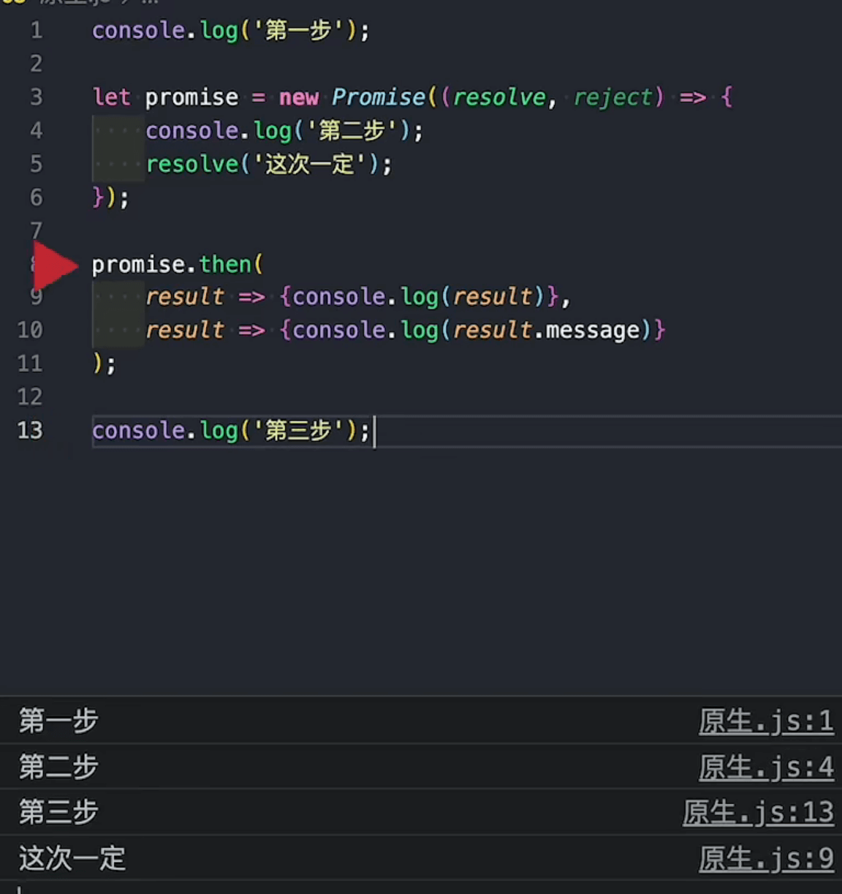

## 格式当前时间

```js
function myTime(){
    const time = new Date()
    const year = foo(time.getFullYear())
    const month = foo(time.getMonth() + 1)
    const day = foo(time.getDate())
    const hours = foo(time.getHours())
    const minute = foo(time.getMinutes())
    const second =  foo(time.getSeconds())

    return `${year}-${month}-${day} ${hours}:${minute}:${second}`
}

function foo(a){
	return a<10 ? ("0" + a) : a
}

console.log(myTime());
```


## 手写Object.create

```js
function CreateObject(o){
    function F(){}
    F.prototype = o
    return new F()
}
```


## ES6之前的继承

**寄生组合式继承**

```js
//工具函数，一般我们会将封装在一个单独的js文件中进行引用

//创建一个新的对象，将新对象的隐式原型指向构造函数的显式原型
//创建对象的
function CreateObject(o){
    function F(){}
    F.prototype = o
    return new F()
}


function inherit(SubType,SuperType){
    //SubType.prototype = Object.create(SuperType.prototype)
    SubType.prototype = CreateObject(SuperType.prototype)
    Object.defineProperty(SubType.prototype,"constructor",{
        enumerable:false,
        configurable:true,
        writable:true,
        value:SubType
    })
}


function Person(name,age,height){
    this.name = name
    this.age = age
    this.height = height
}

Person.prototype.runing = function(){
    console.log(`${this.name}runing`);
}

Person.prototype.eating = function(){
    console.log(`${this.name}eating`);
}

function Student(name,age,height,id,result){
    Person.call(this,name,age,height)
    this.id = id
    this.result = result
}

inherit(Student,Person)

Student.prototype.palying = function(){
    console.log(`${this.name}playing`)
}

var stu1 = new Student("哈",18,1.8,001,100)
stu1.palying()
stu1.eating()
console.log(stu1)
```


## 手写promise — 技术蛋 + coderwhy

### 初始结构

```js
const MYPROMISE_PENDING = "pending"
const MYPROMISE_FULFILLED = "fulfilled"
const MYPROMISE_REJECTED = "rejected"

class myPromsie{

    constructor(fn){
        this.status = MYPROMISE_PENDING
        this.result = null
        this.reason = null
        fn(this.resolve, this.reject)
    }

    resolve(result){

        if(this.status === MYPROMISE_PENDING){
            this.status = MYPROMISE_FULFILLED
            this.result = result
        }

    }

    reject(reason){

        if(this.status === MYPROMISE_PENDING){
            this.status = MYPROMISE_REJECTED
            this.reason = reason
        }

    }

}


const promise = new myPromsie((resolve, reject)=>{
    console.log("ddd");
})
```


### this指向

修改this指向给构造函数

```js
constructor(fn){
    this.status = MYPROMISE_PENDING
    this.result = null
    this.reason = null
    fn(this.resolve.bind(this), this.reject.bind(this))//绑定当前构造函数的实例对象
}
```


### then

```js
const MYPROMISE_PENDING = "pending"
const MYPROMISE_FULFILLED = "fulfilled"
const MYPROMISE_REJECTED = "rejected"

class myPromsie{

    constructor(fn){
        this.status = MYPROMISE_PENDING
        this.result = null
        this.reason = null
        fn(this.resolve.bind(this), this.reject.bind(this))
    }
    
    resolve(result){
        if(this.status === MYPROMISE_PENDING){
            this.status = MYPROMISE_FULFILLED
            this.result = result
        }
    }

    reject(reason){
        if(this.status === MYPROMISE_PENDING){
            this.status = MYPROMISE_REJECTED
            this.reason = reason
        }
    }

    then(onFulfilled, onRejected){
        //做一个判断，使得二者只能指向其一

        if(this.status === MYPROMISE_FULFILLED){
            onFulfilled(this.result)
        }
        if(this.status === MYPROMISE_REJECTED){
            onRejected(this.reason)
        }

    }

}


const promise = new myPromsie((resolve, reject)=>{
    resolve("手写的promsie")
})

promise.then(res =>{
    console.log("res:",res);
},err =>{
    console.log("err,",err);
})
```


### 执行异常

- 原生promise如果直接抛出异常会在reject中捕获：解决办法（在执行resolve和reject之前进行判断）
- 原生promise规定then里面的两个参数如果不是函数就要被忽略：解决办法（将不是函数参数改为函数）

```js
const MYPROMISE_PENDING = "pending"
const MYPROMISE_FULFILLED = "fulfilled"
const MYPROMISE_REJECTED = "rejected"

class myPromsie{

    constructor(fn){
        this.status = MYPROMISE_PENDING
        this.result = null
        this.reason = null
        //在执行resolve和reject之前进行判断
        try {
            fn(this.resolve.bind(this), this.reject.bind(this))
        } catch (error) {
            this.reject(error)//不需要绑定this，因为这里是直接执行，而不是创建实例后在执行
        }
    }
    
    resolve(result){
        if(this.status === MYPROMISE_PENDING){
            this.status = MYPROMISE_FULFILLED
            this.result = result
        }
    }

    reject(reason){
        if(this.status === MYPROMISE_PENDING){
            this.status = MYPROMISE_REJECTED
            this.reason = reason
        }
    }

    then(onFulfilled, onRejected){
        //如果是函数继续执行，不是函数将其改为函数
        onFulfilled = typeof onFulfilled === "function" ? onFulfilled : ()=>{}
        onRejected = typeof onRejected === "function" ? onRejected : ()=>{}

        if(this.status === MYPROMISE_FULFILLED){
            onFulfilled(this.result)
        }
        if(this.status === MYPROMISE_REJECTED){
            onRejected(this.reason)
        }

    }

}


const promise = new myPromsie((resolve, reject)=>{
    resolve("下次一点")
    // throw new Error("dui")
})

promise.then(
    undefined,
    err =>{
        console.log("err,",err);
    }
)
```


### 异步

#### 问题一

第一个问题：原生promise的异步操作：


解决办法：在then操作中，执行完if操作之后加上异步操作【推荐使用queueMicrotask而不是setTimeout，因为setTimeout是一个宏任务，但在原生的promise中，执行then操作是一个微任务。但其实他们用法都是一样的，但本质不同】【queueMicrotask：直接将回调函数加入到微任务中】

```js
then(onFulfilled, onRejected){
    onFulfilled = typeof onFulfilled === "function" ? onFulfilled : ()=>{}
    onRejected = typeof onRejected === "function" ? onRejected : ()=>{}

    if(this.status === MYPROMISE_FULFILLED){
        queueMicrotask(()=>{
            onFulfilled(this.result)
        })
    }
    if(this.status === MYPROMISE_REJECTED){
        queueMicrotask(()=>{
            onRejected(this.reason)
        })
    }

}
```


#### 问题二

第二个问题：看代码

执行顺序为 第1、2、3、4步，而 下次一定 并没有执行。

```js
console.log("第1步");
const promise = new myPromsie((resolve, reject)=>{
    console.log("第2步");
    setTimeout(()=>{
        resolve("下次一定")
        console.log("第4步");
    }) 
})

promise.then(
    res =>{
        console.log("res",res);
    },
    err =>{
        console.log("err:",err);
    }
)

console.log("第3步");
```


原因是then里面的状态出了问题。因为先执行了then这个异步操作，执行setTimeout这个异步操作，在执行then操作的时候，发现这个时候的状态是 pending，而我们手写then方法中并没有定义 pending状态应该做什么，所有就少了 这次一定 这个输出，所有我们在then方法中添加 pending 状态的情况就可以了。

但是问题又来了，当then判断状态为pending的时候我们应该做什么？因为这个时候resolve和reject还没获取到如何值，因此我们必须让then里的函数稍后在执行，等resolve执行了之后在执行then。

为了保存then里面的函数，我们可以创建数组来保存函数【会涉及到链式调用，还有级setTimeout可能不止一个，所以使用数组】

```js
const MYPROMISE_PENDING = "pending"
const MYPROMISE_FULFILLED = "fulfilled"
const MYPROMISE_REJECTED = "rejected"
// debugger
class myPromsie{

    constructor(fn){
        this.status = MYPROMISE_PENDING
        this.result = null
        this.reason = null

        //第一步：定义数组来保存函数
        this.onFulfilledArr = []
        this.onRejectedArr = []

        try {
            fn(this.resolve.bind(this), this.reject.bind(this))
        } catch (error) {
            this.reject(error)
        }
    }
    
    resolve(result){
        if(this.status === MYPROMISE_PENDING){
            this.status = MYPROMISE_FULFILLED
            this.result = result
            // 第四步：完善代码，遍历数组，看看数组中有没有then那边传来的待执行函数，然后逐个执行数组中的函数
            this.onFulfilledArr.forEach(fnArr =>{
                fnArr(result)
            })
        }
    }

    reject(reason){
        if(this.status === MYPROMISE_PENDING){
            this.status = MYPROMISE_REJECTED
            this.reason = reason
            // 第四步
            this.onRejectedArr.forEach(fnArr =>{
                fnArr(reason)
            })
        }
    }

    then(onFulfilled, onRejected){
        onFulfilled = typeof onFulfilled === "function" ? onFulfilled : ()=>{}
        onRejected = typeof onRejected === "function" ? onRejected : ()=>{}

        //第二步：添加 pending 状态的执行情况
        if(this.status === MYPROMISE_PENDING){
            //第三步：将函数添加到数组中
            this.onFulfilledArr.push(onFulfilled)
            this.onRejectedArr.push(onRejected)
        }

        if(this.status === MYPROMISE_FULFILLED){
            queueMicrotask(()=>{
                onFulfilled(this.result)
            })
        }
        if(this.status === MYPROMISE_REJECTED){
            queueMicrotask(()=>{
                onRejected(this.reason)
            })
        }

    }

}
```


#### 问题三

第三个问题：但是当我们测试这个代码的时候

执行顺序为 第1、2、3、这次一定、4步【错误的，应该是先1234步，最后才是这次一定】

```js
console.log("第1步");
const promise = new myPromsie((resolve, reject)=>{
    console.log("第2步");
    setTimeout(()=>{
        resolve("这次一定")
        reject("下次一定")
        console.log("第4步");
    }) 
    // throw new Error("dui")
})

promise.then(
    res =>{
        console.log("res",res);
    },
    err =>{
        console.log("err:",err);
    }
)

console.log("第3步");
```


这里有个小细节，resolve和reject是要在事件循环末尾执行的，因此我们可以给resolve和reject里面加上queueMicrotask

```js
resolve(result){
    //添加异步操作
    queueMicrotask(()=>{
        if(this.status === MYPROMISE_PENDING){
            this.status = MYPROMISE_FULFILLED
            this.result = result
            this.onFulfilledArr.forEach(fnArr =>{
                fnArr(result)
            })
        }
    })
}

reject(reason){
    queueMicrotask(()=>{
        if(this.status === MYPROMISE_PENDING){
            this.status = MYPROMISE_REJECTED
            this.reason = reason
            this.onRejectedArr.forEach(fnArr =>{
                fnArr(reason)
            })
        }
    })
}
```


#### 完整代码

```js
const MYPROMISE_PENDING = "pending"
const MYPROMISE_FULFILLED = "fulfilled"
const MYPROMISE_REJECTED = "rejected"
// debugger
class myPromsie{

    constructor(fn){
        this.status = MYPROMISE_PENDING
        this.result = null
        this.reason = null

        this.onFulfilledArr = []
        this.onRejectedArr = []

        try {
            fn(this.resolve.bind(this), this.reject.bind(this))
        } catch (error) {
            this.reject(error)
        }
    }
    
    resolve(result){
        queueMicrotask(()=>{
            if(this.status === MYPROMISE_PENDING){
                this.status = MYPROMISE_FULFILLED
                this.result = result
                this.onFulfilledArr.forEach(fnArr =>{
                    fnArr(result)
                })
            }
        })
    }

    reject(reason){
        queueMicrotask(()=>{
            if(this.status === MYPROMISE_PENDING){
                this.status = MYPROMISE_REJECTED
                this.reason = reason
                this.onRejectedArr.forEach(fnArr =>{
                    fnArr(reason)
                })
            }
        })
    }

    then(onFulfilled, onRejected){
        onFulfilled = typeof onFulfilled === "function" ? onFulfilled : ()=>{}
        onRejected = typeof onRejected === "function" ? onRejected : ()=>{}

        if(this.status === MYPROMISE_PENDING){
            this.onFulfilledArr.push(onFulfilled)
            this.onRejectedArr.push(onRejected)
        }

        if(this.status === MYPROMISE_FULFILLED){
            queueMicrotask(()=>{
                onFulfilled(this.result)
            })
        }
        if(this.status === MYPROMISE_REJECTED){
            queueMicrotask(()=>{
                onRejected(this.reason)
            })
        }

    }

}

console.log("第1步");
const promise = new myPromsie((resolve, reject)=>{
    console.log("第2步");
    setTimeout(()=>{
        resolve("这次一定")
        reject("下次一定")
        console.log("第4步");
    }) 
    // throw new Error("dui")
})

promise.then(
    res =>{
        console.log("res",res);
    },
    err =>{
        console.log("err:",err);
    }
)

console.log("第3步");
```


### 链式调用

为了实现链式调用，我们需要让then方法返回一个新的promise，返回一个新的promise它就有自己的then方法，这样就能实现无限的链式

解决办法：在原来的then方法中返回promise，并且我们要捕获异常进行返回

```js
const MYPROMISE_PENDING = "pending"
const MYPROMISE_FULFILLED = "fulfilled"
const MYPROMISE_REJECTED = "rejected"
// debugger
class myPromise{

    constructor(fn){
        this.status = MYPROMISE_PENDING
        this.result = null
        this.reason = null

        this.onFulfilledArr = []
        this.onRejectedArr = []

        try {
            fn(this.resolve.bind(this), this.reject.bind(this))
        } catch (error) {
            this.reject(error)
        }
    }
    
    resolve(result){
        queueMicrotask(()=>{
            if(this.status === MYPROMISE_PENDING){
                this.status = MYPROMISE_FULFILLED
                this.result = result
                this.onFulfilledArr.forEach(fnArr =>{
                    fnArr(result)
                })
            }
        })
    }

    reject(reason){
        queueMicrotask(()=>{
            if(this.status === MYPROMISE_PENDING){
                this.status = MYPROMISE_REJECTED
                this.reason = reason
                this.onRejectedArr.forEach(fnArr =>{
                    fnArr(reason)
                })
            }
        })
    }

    then(onFulfilled, onRejected){
        // 1.返回值return
        return new myPromsie((resolve, reject)=>{
            onFulfilled = typeof onFulfilled === "function" ? onFulfilled : ()=>{}
            onRejected = typeof onRejected === "function" ? onRejected : ()=>{}

            if(this.status === MYPROMISE_PENDING){
                //一开始我们是直接将onFulfilled函数给添加到数组中，在resolve中执行
                // 但是我们要拿到函数执行结果的值，是很难拿的，所以我们改变一下策略
                // 执行onFulfilled函数，将结果给这个箭头函数，之后在这个监听函数添加到数组中
                // 我们需要拿到 onFulfilled 的执行结果给resolve，进行下一次回调
                this.onFulfilledArr.push(()=>{
                    try {
                        const result = onFulfilled(this.result)
                        resolve(result)
                    } catch (error) {
                        this.reject(error)
                    }
                })
                this.onRejectedArr.push(()=>{
                    try {
                        const reason = onRejected(this.reason)
                        resolve(reason)
                    } catch (error) {
                        reject(error)
                    }
                })
            }

            if(this.status === MYPROMISE_FULFILLED){
                queueMicrotask(()=>{
                    try {
                        const result = onFulfilled(this.result)
                        resolve(result)
                    } catch (error) {
                        reject(error)
                    }
                })
            }
            if(this.status === MYPROMISE_REJECTED){
                queueMicrotask(()=>{
                    try {
                        const reason = onRejected(this.reason)
                        resolve(reason)
                    } catch (error) {
                        reject(error)
                    }
                })
            }
        })
    }

}


const promise = new myPromise((resolve, reject)=>{
    resolve("这次一定")
})

promise.then(res =>{
    console.log("res1:",res);
    return "aaa"
},err =>{
    console.log("err1:",err);
}).then(res =>{
    console.log("res2:",res);
},err =>{
    console.log("err2:",err);
})
```


建议将try...catch封装为函数

```js
const MYPROMISE_PENDING = "pending"
const MYPROMISE_FULFILLED = "fulfilled"
const MYPROMISE_REJECTED = "rejected"

function tryCatch(value, fn, resolve, reject){
    try {
        const result = fn(value)
        resolve(result)
    } catch (error) {
        reject(error)
    }
}


class myPromsie{

    constructor(fn){
        this.status = MYPROMISE_PENDING
        this.result = null
        this.reason = null

        this.onFulfilledArr = []
        this.onRejectedArr = []

        try {
            fn(this.resolve.bind(this), this.reject.bind(this))
        } catch (error) {
            this.reject(error)
        }
    }
    
    resolve(result){
        queueMicrotask(()=>{
            if(this.status === MYPROMISE_PENDING){
                this.status = MYPROMISE_FULFILLED
                this.result = result
                this.onFulfilledArr.forEach(fnArr =>{
                    fnArr(result)
                })
            }
        })
    }

    reject(reason){
        queueMicrotask(()=>{
            if(this.status === MYPROMISE_PENDING){
                this.status = MYPROMISE_REJECTED
                this.reason = reason
                this.onRejectedArr.forEach(fnArr =>{
                    fnArr(reason)
                })
            }
        })
    }

    then(onFulfilled, onRejected){
        return new myPromsie((resolve, reject)=>{
            onFulfilled = typeof onFulfilled === "function" ? onFulfilled : ()=>{}
            onRejected = typeof onRejected === "function" ? onRejected : ()=>{}

            if(this.status === MYPROMISE_PENDING){
                this.onFulfilledArr.push(()=>{
                    tryCatch(this.result, onFulfilled, resolve ,reject)
                })
                this.onRejectedArr.push(()=>{
                    tryCatch(this.reason, onRejected, resolve, reject)
                })
            }

            if(this.status === MYPROMISE_FULFILLED){
                queueMicrotask(()=>{
                    tryCatch(this.result, onFulfilled, resolve, reject)
                })
            }
            if(this.status === MYPROMISE_REJECTED){
                queueMicrotask(()=>{
                    tryCatch(this.reason, onRejected, resolve, reject)
                })
            }
        })
    }

}


const promise = new myPromsie((resolve, reject)=>{
    
    resolve("这次一定")
    // throw new Error("dwdq")

})

promise.then(res =>{
    console.log("res1:",res);
    // return "aaa"
    return new Error("ddd")
},err =>{
    console.log("err1:",err);
}).then(res =>{
    console.log("res2:",res);
},err =>{
    console.log("err2:",err);
})
```


### catch方法

```js
const MYPROMISE_PENDING = "pending"
const MYPROMISE_FULFILLED = "fulfilled"
const MYPROMISE_REJECTED = "rejected"

function tryCatch(value, fn, resolve, reject){
    try {
        resolve(fn(value))
    } catch (error) {
        reject(error)
    }
}

class myPromise{
    constructor(fn){
        this.status = MYPROMISE_PENDING
        this.result = null
        this.reason = null
        this.onFulfilledArr = []
        this.onRejectedArr = []
        try {
            fn(this.resolve.bind(this), this.reject.bind(this))
        } catch (error) {
            this.reject(error)
        }
    }

    resolve(result){
        queueMicrotask(()=>{
            if(this.status === MYPROMISE_PENDING){
                this.status = MYPROMISE_FULFILLED
                this.result = result
                this.onFulfilledArr.forEach(fnArr =>{
                    fnArr(result)
                })
            }
        })
    }

    reject(reason){
        queueMicrotask(()=>{
            if(this.status === MYPROMISE_PENDING){
                this.status = MYPROMISE_REJECTED
                this.reason = reason
                this.onRejectedArr.forEach(fnArr =>{
                    fnArr(reason)
                })
            }
        })
    }

    then(onFulfilled, onRejected){
		//2、判断一个有没有直接在then写err=>，有就在then中执行，没有就抛给catch
        onRejected = onRejected || (error => {throw error})

        return new myPromise((resolve, reject)=>{
            onFulfilled = (typeof onFulfilled === "function") ? onFulfilled : ()=>{}
            onRejected = (typeof onRejected === "function") ? onRejected : ()=>{}

            if(this.status === MYPROMISE_PENDING){
                this.onFulfilledArr.push(()=>{
                    tryCatch(this.result, onFulfilled, resolve, reject)
                })
                this.onRejectedArr.push(()=>{
                    tryCatch(this.reason, onRejected, resolve, reject)
                })
            }

            if(this.status === MYPROMISE_FULFILLED){
                queueMicrotask(()=>{
                    tryCatch(this.result, onFulfilled, resolve, reject)
                })
            }

            if(this.status === MYPROMISE_REJECTED){
                queueMicrotask(()=>{
                    tryCatch(this.reason, onRejected, resolve, reject)
                })
            }
        })
    }
	//1。直接调用then方法
    catch(onRejected){
        this.then(undefined, onRejected)
    }
}

const promise = new myPromise((resolve, reject)=>{

    // resolve("这次一定")
    reject("dada")
    // throw new Error("dwdq")

})

promise.then(res =>{
    console.log("res1:",res);
    // // return "aaa"
    // return new Error("ddd")
}).catch(res =>{
    console.log("res2:",res);
})
```


### finally方法

```js
// 1. 添加放回return，因为如果用户使用 then和catch，catch在finally之前的
catch(onRejected){
    return this.then(undefined, onRejected)
}

// 2. 添加finally方法不管我成功还是失败都会调用finally方法
finally(onFinally){
    this.then(()=>{
        onFinally()
    },()=>{
        onFinally()
    })
}

//测试：
const promise = new myPromise((resolve, reject)=>{

    // resolve("这次一定")
    reject("dada")
    // throw new Error("dwdq")

})

promise.then(res =>{
    console.log("res1:",res);
    // return "aaa"
    // return new Error("ddd")
}).catch(res =>{
    console.log("res2:",res);
}).finally(all =>{
    console.log("aaa111");
})
```


### resolve/reject方法

```js
//resolve和reject方法本质就是new promise调用
static resolve(result){
    return new myPromise((resolve)=>resolve(result))
}

static reject(reason){
    return new myPromise((resolve, reject)=>reject(reason))
}


//测试：
myPromise.resolve("hello").then(res=>{
    console.log(res);
})

myPromise.reject("err111").catch(err=>{
    console.log(err);
})
```


### all方法

```js
//参数是一个数组
static all(promises){
    // all方法是：执行多个promise，当所有的promise都返回resolve，在执行all的then
    // 如果有一个promise返回catch，就执行all的catch
    // 1.本身返回promise的
    return new myPromise((resolve, reject)=>{
        // 2.没执行完之前，将前面promise1的resolve结果放到数组中
        //做一个判断，是不是数字
        if(Array.isArray(promises)){
            let values = []
            promises.forEach(promise =>{
                if(promise instanceof myPromise){
                    promise.then(res =>{
                        values.push(res)
                        // 3. 当数组中填充完，就可以返回all的resolve了
                        if(values.length === promises.length){
                            resolve(values)
                        }
                    }, err =>{
                        reject(err)
                    })
                }
            })
        }else{
            reject(new TypeError('Argument is not iterable'))//可以返回不是数组什么的
        }
    })
}


//测试：
const p1 = new myPromise((resolve, reject)=>{
    resolve("111")
})
const p2 = new myPromise((resolve, reject)=>{
    // resolve("222")
    reject("222reject")
})
const p3 = new myPromise((resolve, reject)=>{
    resolve("333")
})

myPromise.all([p1, p2, p3]).then(res=>{
    console.log(res);
}).catch(err =>{
    console.log(err);
})
```


### allSettled方法

```js
//不管你中间有没有reject，我都会等到你所有的东西都有结果【allSettled不会执行cacth】
// 返回值传的是状态和值
static allSettled(promises){
    return new myPromise((resolve)=>{
        const values = []
        //小的promise还是会调reject的
        if(Array.isArray(promises)){
            promises.forEach(promise =>{
                if(promise instanceof myPromise){
                    promise.then(res =>{
                        values.push({
                            status:MYPROMISE_FULFILLED,
                            value:res
                        })
                        //做一个判断，那个先到相等，就返回
                        if(values.length === promises.length){
                            resolve(values)
                        }
                    },err =>{
                        values.push({
                            status:MYPROMISE_REJECTED,
                            value:err
                        })
                        //做一个判断，那个先到相等，就返回
                        if(values.length === promises.length){
                            resolve(values)
                        }
                    })
                }
            })
        }else{
            reject(new TypeError('Argument is not iterable'))//可以返回不是数组什么的
        } 
    })
}


//测试：
const p1 = new myPromise((resolve, reject)=>{
    resolve("111")
})
const p2 = new myPromise((resolve, reject)=>{
    // resolve("222")
    reject("222reject")
})
const p3 = new myPromise((resolve, reject)=>{
    resolve("333")
})

myPromise.allSettled([p1, p2, p3]).then(res=>{
    console.log(res);
}).catch(err =>{
    console.log(err);
})
```


### race方法

竞争，返回第一个

```js
static race(promises){
    return new myPromise((resolve, reject)=>{
        if(Array.isArray(promises)){
            promises.forEach(promise =>{
                if(promise instanceof myPromise){
                    promise.then(res =>{
                        resolve(res)
                    }, err =>{
                        reject(err)
                    })
                }
            })
        }else{
            reject(new TypeError('Argument is not iterable'))
        }
    })
}

const p1 = new myPromise((resolve, reject)=>{
    setTimeout(()=>{
        resolve('111')
    }, 3000)
})
const p2 = new myPromise((resolve, reject)=>{
    setTimeout(()=>{
        reject('222')
    }, 2000)
})
const p3 = new myPromise((resolve, reject)=>{
    setTimeout(()=>{
        resolve('333')
    }, 3000)
})

myPromise.race([p1, p2, p3]).then(res =>{
    console.log('res', res);
}).catch(err =>{
    console.log('err', err);
})
```


### any方法

返回第一个成功的，如果都失败再一起返回

```js
static any(promises){
    return new myPromise((resolve, reject)=>{
        let values = []
        if(Array.isArray(promises)){
            promises.forEach(promise =>{
                if(promise instanceof myPromise){
                    promise.then(res =>{
                        resolve(res)
                    }, err =>{
                        values.push(err)
                        if( values.length === promises.length ){
                            reject(values)
                        }
                    })
                }
            })
        }else{
            reject(new TypeError('Argument is not iterable'))
        }
    })
}

const p1 = new myPromise((resolve, reject)=>{
    setTimeout(()=>{
        reject('111')
    }, 3000)
})
const p2 = new myPromise((resolve, reject)=>{
    setTimeout(()=>{
        reject('222')
    }, 2000)
})
const p3 = new myPromise((resolve, reject)=>{
    setTimeout(()=>{
        reject('333')
    }, 3000)
})

myPromise.any([p1, p2, p3]).then(res =>{
    console.log('res', res);
}).catch(err =>{
    console.log('err', err);
})
```


### 完整代码

```js
const MYPROMISE_PENDING = "pending"
const MYPROMISE_FULFILLED = "fulfilled"
const MYPROMISE_REJECTED = "rejected"

function tryCatch(value, fn, resolve, reject){
    try {
        resolve(fn(value))
    } catch (error) {
        reject(error)
    }
}

class myPromise{
    constructor(fn){
        this.status = MYPROMISE_PENDING
        this.result = null
        this.reason = null
        this.onFulfilledArr = []
        this.onRejectedArr = []
        try {
            fn(this.resolve.bind(this), this.reject.bind(this))
        } catch (error) {
            this.reject(error)
        }
    }

    resolve(result){
        queueMicrotask(()=>{
            if(this.status === MYPROMISE_PENDING){
                this.status = MYPROMISE_FULFILLED
                this.result = result
                this.onFulfilledArr.forEach(fnArr =>{
                    fnArr(result)
                })
            }
        })
    }

    reject(reason){
        queueMicrotask(()=>{
            if(this.status === MYPROMISE_PENDING){
                this.status = MYPROMISE_REJECTED
                this.reason = reason
                this.onRejectedArr.forEach(fnArr =>{
                    fnArr(reason)
                })
            }
        })
    }

    then(onFulfilled, onRejected){
        onRejected = onRejected || (error => {throw error})

        return new myPromise((resolve, reject)=>{
            onFulfilled = (typeof onFulfilled === "function") ? onFulfilled : ()=>{}
            onRejected = (typeof onRejected === "function") ? onRejected : ()=>{}

            if(this.status === MYPROMISE_PENDING){
                this.onFulfilledArr.push(()=>{
                    tryCatch(this.result, onFulfilled, resolve, reject)
                })
                this.onRejectedArr.push(()=>{
                    tryCatch(this.reason, onRejected, resolve, reject)
                })
            }

            if(this.status === MYPROMISE_FULFILLED){
                queueMicrotask(()=>{
                    tryCatch(this.result, onFulfilled, resolve, reject)
                })
            }

            if(this.status === MYPROMISE_REJECTED){
                queueMicrotask(()=>{
                    tryCatch(this.reason, onRejected, resolve, reject)
                })
            }
        })
    }
    catch(onRejected){
        return this.then(undefined, onRejected)
    }
    
    finally(onFinally){
        this.then(()=>{
            onFinally()
        },()=>{
            onFinally()
        })
    }

    static resolve(result){
        return new myPromise((resolve)=>resolve(result))
    }
    
    static reject(reason){
        return new myPromise((resolve, reject)=>reject(reason))
    }

    static all(promises){
        return new myPromise((resolve, reject)=>{
            if(Array.isArray(promises)){
                let values = []
                promises.forEach(promise =>{
                    if(promise instanceof myPromise){
                        promise.then(res =>{
                            values.push(res)
                            if(values.length === promises.length){
                                resolve(values)
                            }
                        }, err =>{
                            reject(err)
                        })
                    }
                })
            }else{
                reject(new TypeError('Argument is not iterable'))
            }
        })
    }

    static allSettled(promises){
        return new myPromise((resolve)=>{
            const values = []
            if(Array.isArray(promises)){
                promises.forEach(promise =>{
                    if(promise instanceof myPromise){
                        promise.then(res =>{
                            values.push({
                                status:MYPROMISE_FULFILLED,
                                value:res
                            })
                            if(values.length === promises.length){
                                resolve(values)
                            }
                        },err =>{
                            values.push({
                                status:MYPROMISE_REJECTED,
                                value:err
                            })
                            if(values.length === promises.length){
                                resolve(values)
                            }
                        })
                    }
                })
            }else{
                reject(new TypeError('Argument is not iterable'))
            } 
        })
    }


    static race(promises){
        return new myPromise((resolve, reject)=>{
            if(Array.isArray(promises)){
                promises.forEach(promise =>{
                    if(promise instanceof myPromise){
                        promise.then(res =>{
                            resolve(res)
                        }, err =>{
                            reject(err)
                        })
                    }
                })
            }else{
                reject(new TypeError('Argument is not iterable'))
            }
        })
    }

    static any(promises){
        return new myPromise((resolve, reject)=>{
            let values = []
            if(Array.isArray(promises)){
                promises.forEach(promise =>{
                    if(promise instanceof myPromise){
                        promise.then(res =>{
                            resolve(res)
                        }, err =>{
                            values.push(err)
                            if( values.length === promises.length ){
                                reject(values)
                            }
                        })
                    }
                })
            }else{
                reject(new TypeError('Argument is not iterable'))
            }
        })
    }

}
```


## 防抖函数

**基本功能**

```js
<input type="text" name="" id="">
   
<script>

function myDebounce(fn, delay){
    // 1.纪录上一次事件触发的timer
    let timer = null
    // 2.触发事件执行的函数
    const _debounce = function(){
        // 3.如果再次触发，取消上一次的触发
        if(timer) clearTimeout(timer)
        timer = setTimeout(()=>{
            fn()
            // 执行函数之后，将timer重置为null
            timer = null
        }, delay)
    }

    return _debounce
}

const ipt = document.querySelector("input")

let index = 0
ipt.oninput = myDebounce(function(){
    console.log(`执行次数${++index}`);
},1000)

</script>
```

**this绑定和传参**

```js
<input type="text">

<script>

function myDebounce(fn, delay){
    let time = null

    // 携带多个参数
    const _debounce = function(...arg){
        if(time) clearTimeout(time)
        time = setTimeout(()=>{
            // 绑定inp的this
            fn.apply(this, arg)
            timer = null
        }, delay)
    }

    return _debounce
}


const inp = document.querySelector('input')

let index = 0
inp.oninput = myDebounce(function(e){
    console.log(`${index++}次执行`, this.value, e);
}, 1000)

</script>
```


## 节流函数

```js
<input type="text">

<script>

function myThrottle(fn, time){
    let startTime = 0
    const _throttle = function(...arg){
        const newTime = new Date().getTime()
        const waitTime = time - ( newTime - startTime )

        if(waitTime <=0 ){
            fn.apply(this, arg)
            startTime = newTime
        }
    }

    return _throttle
}

const ipt = document.querySelector('input')

ipt.oninput = myThrottle(function(e){
    console.log(this.value, e);
}, 1000)

</script>
```


## 深拷贝

```js
//工具函数，判断是不是对象
function isObject(value){
    //null,object,array都会返回object，但null是应该返回false
    //function也应该返回true
    const valueType = typeof value
    return (value !== null) && (valueType === 'object' || valueType === 'function')
}

function deepCopy(obj){
    //判断：如果是对象类型，才需要创建新对象。原始类型直接返回
    if(!isObject(obj)) return obj

    //判断是不是数组，是定义[],不是定义{}
    const newObj = Array.isArray(obj) ? [] :{}
    for(const key in obj){
        if(typeof obj[key] === 'function'){
            newObj[key] = obj[key]
        }else{
            newObj[key] = deepCopy(obj[key])
        }
    }

    return newObj
}

const info = {
    name:"a",
    age:18,
    friend:{
        name:"b",
        other: undefined,
        address:{
            name:"c",
            detail:"d",
            foo: function(){
                console.log('一层一层的');
            }
        }
    }
}       

const newObj = deepCopy(info)
newObj.friend.address.name = "dwasdas"
newObj.friend.address.foo = function() {
    console.log('dasdasda');
}
info.friend.address.foo()
newObj.friend.address.foo()
console.log('info', info);
console.log('newObj', newObj);
```


## 封装axios

- 使用axios实例对象create

```js
// 安装：npm install axios

import axios from 'axios'

// 这里可以定义一些默认参数，像baseUrl、timeout、headers等
const xjnAxios = axios.create({
    baseUrl:"",
    timeout: ,
    headers: {
    
    }
})
```

- 定义请求拦截器和响应拦截器
  - 请求拦截器：可以在发请求之前处理一些业务逻辑
  - 响应拦截器：服务器数据返回以后，可以处理一些事情

```js
// 请求拦截器：request
xjnAxios.interceptors.request.use(res =>{
   	// 操作逻辑...
    console.log(res) //res就是我们请求的信息
    return res	// 我们一定要将信息返回回去
}, err=>{
    // 抛出错误
    Promise.reject(err)
})
```

```js
// 响应拦截器：response
xjnAxios.interceptors.response.use(res =>{
    // 操作逻辑...
    console.log(res)//我们在这里打印res，就是和我们直接使用axios获取的数据是一样的
    return res
}, err=>{
    // 请求错误来到这，抛出错误
    Promise.reject(err)
})

export default xjnAxios
```

- 操作逻辑

```js
xjnAxios.interceptors.request.use(res =>{
   	// 每次发请求前，都有loading加载
   	// 某些请求，要求用户携带token，没有携带跳转到登录页面
    res.headers.common["Authorization"] = window.sessionStorage.getItem('token')
    res.headers.Authorization = window.sessionStorage.getItem('token')//一样的和上面，推荐上面，官网这么写的
    // data/prams一些数据处理
    console.log(res)
    return res
}, err=>{
    Promise.reject(err)
})
```

```js
// 响应拦截器：response
xjnAxios.interceptors.response.use(res =>{
    // 操作逻辑...
    console.log(res)//我们在这里打印res，就是和我们直接使用axios获取的数据是一样的
    return res
}, err=>{
    // 抛出错误
    Promise.reject(err)
})

export default xjnAxios
```


## 数组扁平化

### Array.prototype.flat()

```js
const animals = [1, [2, 3], [4, [5, [6]], 7]];

// 不传参数时，默认“拉平”一层
animals.flat();
// [1, 2, 3, 4, [5, [6]], 7]

// 传入一个整数参数，整数即“拉平”的层数
animals.flat(2);
// [1, 2, 3, 4, 5, [6], 7]

// Infinity 关键字作为参数时，无论多少层嵌套，都会转为一维数组
animals.flat(Infinity);
// [1, 2, 3, 4, 5, 6, 7]

// 传入 <=0 的整数将返回原数组，不“拉平”
animals.flat(0);
animals.flat(-10);
// [1, [2, 3], [4, [5, [6]], 7]];

// 如果原数组有空位，flat()方法会跳过空位。
[1, 2, 3, 4,,].flat();
// [1, 2, 3, 4]
```


### 用`forEach`实现`flat`

```js
const arr = [1, 2, 3, 4, [1, 2, 3, [1, 2, 3, [1, 2, 3]]], 5, "string", { name: "鲸落" }];
function flat(arr) {
  if( !Array.isArray(arr) ) return arr
  let arrResult = [];
  arr.forEach(item => {
    if (Array.isArray(item)) {
      arrResult.push(...flat(item))
    } else {
      arrResult.push(item);
    }
  });
  return arrResult;
}
flat(arr)
// [1, 2, 3, 4, 1, 2, 3, 1, 2, 3, 1, 2, 3, 5, "string", { name: "鲸落" }];
```


### 用 `reduce` 实现 `flat` 函数

```js
const arr = [1, 2, 3, 4, [1, 2, 3, [1, 2, 3, [1, 2, 3]]], 5, "string", { name: "鲸落" }];
console.log(arr.flat(Infinity));

// 首先使用 reduce 展开一层
let a = arr.reduce((pre, cur) => pre.concat(cur), []);
console.log(a);
// [1, 2, 3, 4, 1, 2, 3, [1, 2, 3, [1, 2, 3]], 5, "string", { name: "鲸落" }];

// 用 reduce 展开一层 + 递归
const flat = arr => {
   if( !Array.isArray(arr) ) return arr
  return arr.reduce((pre, cur) => {
    return pre.concat(Array.isArray(cur) ? flat(cur) : cur);
  }, []);
};
console.log(flat(arr));
// [1, 2, 3, 4, 1, 2, 3, 1, 2, 3, 1, 2, 3, 5, "string", { name: "鲸落" }];
```


## 实现call/apply/bind

### call/apply

```js
function foo(name,age){
    console.log('执行');
    console.log(this,name,age);
}

//apply多种情况：
// apply({name:'jl'})
// apply("abc")
// apply(123)
// apply(null)
// apply(undefined)


//apply
Function.prototype.jlApply = function(thisArg,otherArgs){
    //this ——> 调用的函数对象
    //thisArg ——> 传入的第一个参数，要绑定的this
    console.log(this);//foo

    // 1.先确定传来的thisArg的类型
    // 1.1 null和undefined将this指向window,如果不是转为Object类型
    thisArg = (thisArg === null || thisArg === undefined) ? window : Object(thisArg)

    // 在thisArg上添加fn属性，并设置为可删除不可枚举，值为调用的对象函数
    Object.defineProperty(thisArg,"fn",{
        configurable:true,
        enumerable:false,
        value:this
    })
    
    //原理：
    // thisArg.fn = this
    // thisArg.fn()

    thisArg.fn(...otherArgs)
    
    //最后删除这个 fn
    delete thisArg.fn
}

foo.jlApply({name:"aaa"},["jl",18])
foo.jlApply(123,["jl",18])
foo.jlApply(null,["jl",18])


//call
Function.prototype.jlCall = function(thisArg,...otherArgs){
    //this ——> 调用的函数对象
    //thisArg ——> 传入的第一个参数，要绑定的this
    console.log(this);

    // 1.先确定传来的thisArg的类型
    // 1.1 null和undefined将this指向window,如果不是转为Object类型
    thisArg = (thisArg === null || thisArg === undefined) ? window : Object(thisArg)

    // 在thisArg上添加fn属性，并设置为可删除不可枚举，值为调用的对象函数
    Object.defineProperty(thisArg,"fn",{
        configurable:true,
        enumerable:false,
        value:this
    })

    thisArg.fn(...otherArgs)

    //最后删除这个 fn
    delete thisArg.fn
}

foo.jlCall({name:"jl"},"jl",18)
foo.jlCall(123,"jl",18)
foo.jlCall(undefined,"jl",18)
```


### bind

```js
function foo(name,age){
    // console.log('执行');
    console.log(this,name,age);
}

// var bar = foo.bind({name:"jl"})
// bar("jl",18)

Function.prototype.jlBind = function(thisArg, ...otherArgs){
    thisArg = (thisArg === null || thisArg === undefined) ? window : Object(thisArg)
    Object.defineProperty(thisArg,"fn",{
        configurable:true,
        enumerable:false,
        value:this
    })
    //使用箭头函数可以拿到调用者的this，默认函数有的this指向window
    return (...newArgs)=>{//这个...newArgs是在   newFoo("jl",18)中的参数
        //将newArgs和otherArgs结合
        //方式一：var allArgs = otherArgs.concat(newArgs)
        //方式二：
        var allArgs = [...otherArgs,...newArgs]
        // thisArg.fn(...otherArgs)//...otherArgs 是在jlBind中的参数
        thisArg.fn(...allArgs) 
    }
}

var newFoo = foo.jlBind({name:"jl"})
newFoo("jl",18)
```


## 实现函数柯里化

`柯里化`:其实是函数式编程的一个过程，在这个过程中我们能把一个带有多个参数的函数转换成一系列的嵌套函数。它返回一个新函数，这个新函数期望传入下一个参数。

前置知识：`Funcxxx.length：参数长度`

```js
// 实现的功能
function sum(x, y, z) {
    console.log(x + y + z);
}

let foo = curry(sum)  // 将sum函数柯里化

foo(10)(20)(30) // 60
foo(10,20)(30) // 60
foo(10,20,30) // 60
```

```js
function curry(fn) {
    function curryFn(...args) {
      	// fn.length 代表的是获取函数行参的长度
        // 当收集到的参数和fn中要传入的参数数量相同时，就可以执行fn函数了
        if (args.length >= fn.length) {
            fn.call(this, ...args)
        } else {
          // 利用每次currFn的递归去收集参数args.concat(newArgs)
            return function (...newArgs) {
                return curryFn(...args.concat(newArgs))
            }
        }
    }
    return curryFn
}

var foo = curry(sum)

foo(10)(20)(30) // 60
foo(10, 20)(30) // 60
foo(10, 20, 30) // 60
```


## 下划线转驼峰

实现：` let s = 'hello_world' => helloWorld`

```js
function underlineToCamel(str) {
    let arr = str.split('_');
    for (let i = 1; i < arr.length; i++) {
        arr[i] = arr[i][0].toUpperCase() + arr[i].slice(1);
    }
    return arr.join('');
}

let s = 'hello_world'
console.log(underlineToCamel(s))  // helloWorld
```


## 发布订阅者模式

```js
class EventEmitter{
    constructor(){
        this.events = {}
    }

    // 注册事件
    on(event, listener){
        if(!this.events[event]){
            this.events[event] = [listener]
        }else{
            this.events[event].push(listener)
        }
    }

    // 触发事件
    emit(event, ...args){
        const listeners = this.events[event] || [];
        listeners.forEach((listener) => listener(...args));
    }

    // 取消事件(移除事件)
    off(event, listener){
        const listeners = this.events[event] || [];
        const index = listeners.indexOf(listener);
        if (index >= 0) {
            listeners.splice(index, 1);
        }
    }

    // 只触发一次事件
    once(event, listener){
        let fn = (...args) =>{
            listener(...args)
            this.off(event, fn)
        }

        this.on(event, fn)
    }

}

// 运行示例
let ev = new EventEmitter();
const fun1 = (str) => {
  console.log(str);
}

ev.on('say', fun1);
ev.once('say', fun1)
ev.emit('say', 'visa');
ev.off('say', fun1);
```

但是上述的简单写法有一个问题，off 无法移除 once 的原始 listener

无法通过 off(event, listener) 移除 once 注册的监听器

为什么会发生这个问题？

来看你写的 once 方法：

```js
once(event, listener) {
    let fn = (...args) => {
        listener(...args);
        this.off(event, fn);
    };
    this.on(event, fn);
}
```

你注册的是 包装函数 fn，而不是传入的原始 listener 本身。

举个例子说明

```js
let ev = new EventEmitter();

function hello() {
  console.log('hi');
}

ev.once('say', hello);

// 尝试取消
ev.off('say', hello);  // ⚠️ 这不会生效
```

**为什么不起作用？**

- 因为 `ev.on('say', fn)` 注册的是包装函数 `fn`；
- `ev.off('say', hello)` 会去 `this.events['say']` 里找是否有 `hello` 函数；
- 但数组中只有 `fn`，找不到 `hello`，所以 `splice` 不执行，移除失败。


**解决方法（进阶写法）**

用 Map 存储原始函数与包装函数的映射关系，以便用原始函数也能找到包装函数并移除

```js
class EventEmitter {
  constructor() {
    this.events = {};
    this.onceWrappers = new Map(); // 存储原始函数 => 包装函数
  }

  on(event, listener) {
    if (!this.events[event]) {
      this.events[event] = [listener];
    } else {
      this.events[event].push(listener);
    }
  }

  emit(event, ...args) {
    const listeners = this.events[event] || [];
    listeners.forEach((listener) => listener(...args));
  }

  off(event, listener) {
    const listeners = this.events[event] || [];
    const fn = this.onceWrappers.get(listener) || listener; // 找到包装函数
    const index = listeners.indexOf(fn);
    if (index >= 0) {
      listeners.splice(index, 1);
    }
  }

  once(event, listener) {
    const fn = (...args) => {
      listener(...args);
      this.off(event, listener);
      this.onceWrappers.delete(listener);
    };
    this.onceWrappers.set(listener, fn);
    this.on(event, fn);
  }
}
```


