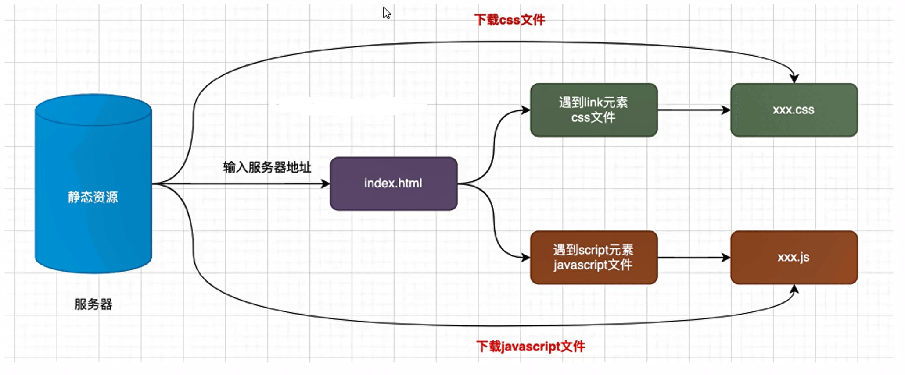
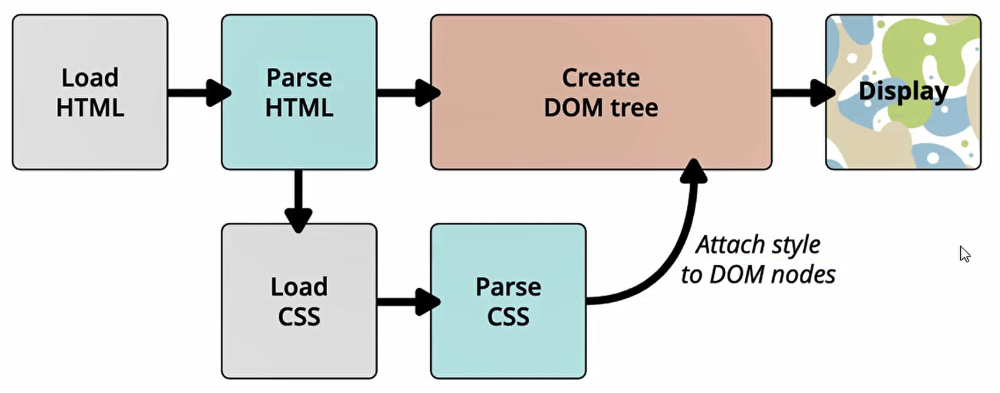
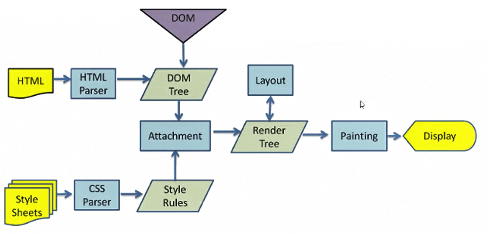
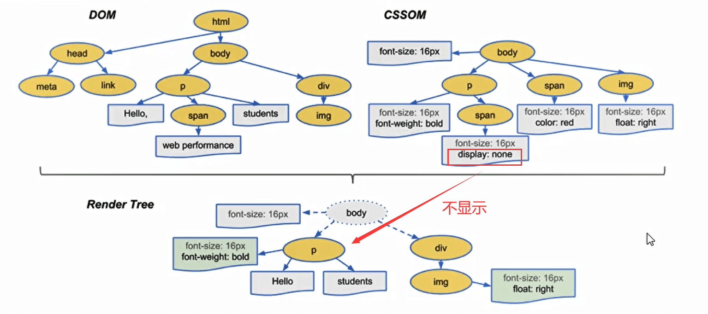
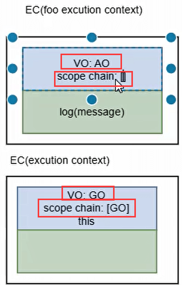
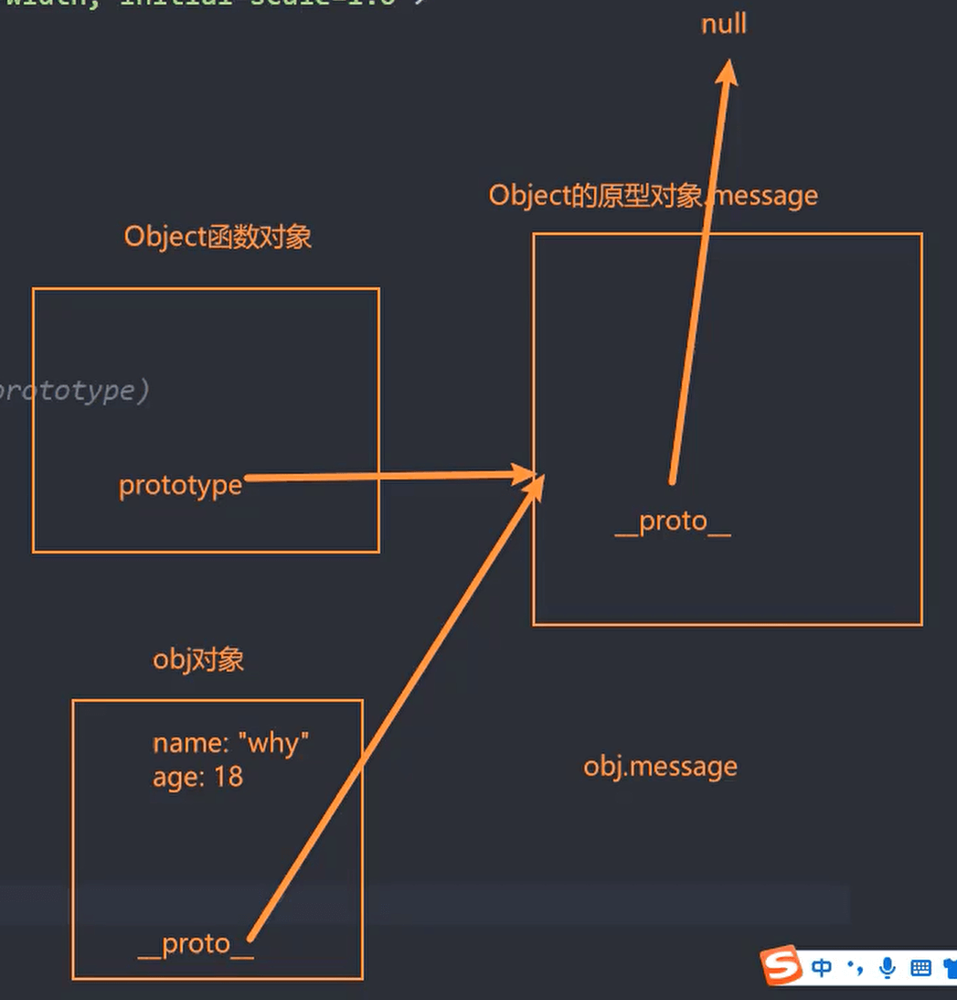
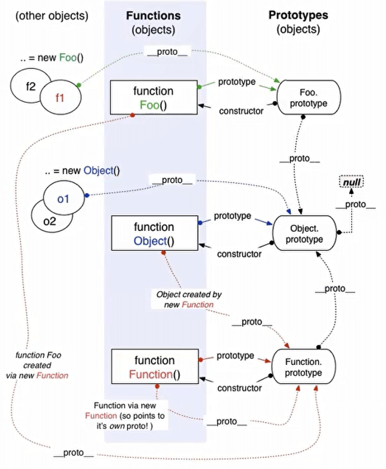
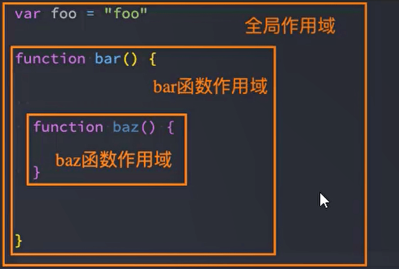
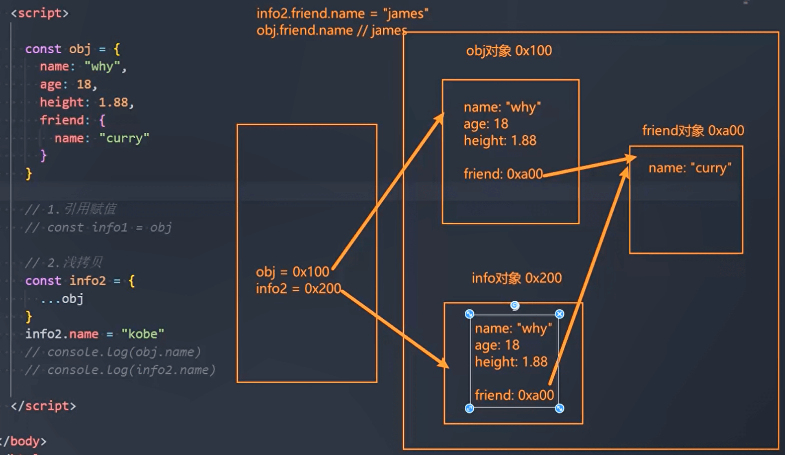

## this

### this指向

**定义一个函数，采用不同的方式对它进行调用，产生不同的结果**（先不考虑call、apply等修改this指向）

```js
function foo(){
    console.log("this:",this);
}

//1.直接调用，this指向window
// foo()

//2.通过对象的形式，this指向调用的对象
var obj = {
    name:"jl"
}

obj.aaa = foo

obj.aaa()
```


### this绑定规则一 — 默认绑定

什么是默认绑定？就是独立函数调用

- 普通函数被独立调用

  - ```js
    function foo(){
        console.log("this:",this);
    }
    
    foo()//this指向为window
    ```

- 函数定义在对象里，但是独立调用

  - ```js
    var obj = {
        name:"jl",
        age:18,
        bar:function(){
    		console.log("bar:",this)
        }
    }
    
    var baz = obj.bar
    
    baz()//this指向为window
    ```

- 严格模式下，独立调用的函数this指向的是undefined


### this绑定规则二 — 隐式绑定

通过某个对象进行调用：也就是它的调用位置中，是通过某个对象发起的函数调用

```js
function foo(){
    console.log("this:",this);
}

var obj = {
    bar:foo
}

obj.bar()//this指向obj
```


### this绑定规则三 — new绑定

**如果一个函数被使用new操作符调用了，那么它会执行如下操作:**

- 1.在内存中创建一个新的对象（空对象)
- 2.这个对象内部的[prototype]属性会被赋值为该构造函数的prototype属性(后面详细讲)
- 3.构造函数内部的this，会指向创建出来的新对象
- 4.执行函数的内部代码（函数体代码)
- 5.如果构造函数没有返回非空对象，则返回创建出来的新对象【将这个对象默认返回】

```js
function foo(){
    console.log("this:",this);//this指向foo
    this.name = "jl"//默认创建一个对象，并将这个name给这个空对象
}

new foo()
```


### this绑定规则四 — 显式绑定

**自己指定this指向谁，就是显式绑定**

如果我们不希望在对象内部包含这个函数的引用，同时又希望在这个对象上进行强制调用，该怎么做呢?

JavaScript所有的函数都可以使用call和apply方法。

```js
function foo(){
    console.log("this:",this);
}

var obj = {
    name:"jl"
}

//需求：执行函数，并将函数中的this指向obj对象
//1.隐式调用
//obj.foo = foo
//foo()

//隐式调用有点麻烦，强制将this改为obj对象
foo.call(obj)
```


**apply和call**

区别对比

```js
function foo(name,age,heigth){
    console.log("this:",this);
    console.log("传入参数：",name,age,heigth);
}

// 直接调用
foo("jl",18,1.88)

// apply
// 第一个参数：绑定this
// 第二个参数：传入额外的实参，以数组的形式
foo.apply("abc",['jl',18,1.88])

// call
// 第一个参数：绑定this
// 参数列表，后续为实参
foo.call("abc","jl",18,1.88)
```


**bind绑定**

如果我们希望一个函数总是显示的绑定到一个对象上，可以怎么做呢?

使用bind方法，bind()方法创建一个新的绑定函数(bound function，BF) ;

```js
function foo(){
    console.log("this:",this);
}

var obj = {
    name:"jl"
}

var bar = foo.apply(obj)//指向obj，但是下面这一行在执行的话还是指向window
foo()//window

//bind基本使用
//其实他是创建了一个新的函数并进行返回，将这个this指向obj
var bar = foo.bind(obj)
bar()//指向obj，但是下面这一行在执行的话就直接指向obj
bar()//this指向obj
```


| 方法    | 是否立即执行               | 参数传递方式                 | 返回值                          |
| ------- | -------------------------- | ---------------------------- | ------------------------------- |
| `call`  | ✅ 立即执行                 | 单个参数依次传递（逗号分隔） | 函数执行结果                    |
| `apply` | ✅ 立即执行                 | 参数打包成数组传递           | 函数执行结果                    |
| `bind`  | ❌ 不立即执行（返回新函数） | 单个参数依次传递（逗号分隔） | **返回新的函数**（绑定了 this） |


### this绑定的优先级

- 默认规则的优先级最低【毫无疑问，默认规则的优先级是最低的，因为存在其他规则时，就会通过其他规则的方式来绑定this】
- 显示绑定优先级高于隐式绑定
- new绑定优先级高于隐式绑定
- new绑定优先级高于bind
  - new绑定和call、apply是不允许同时使用的，所以不存在谁的优先级更高
  - new绑定可以和bind一起使用，new绑定优先级更高
- 总结：new > bind > call/apply > 隐式绑定 > 默认绑定


### 箭头函数this指向

#### 特点

箭头函数不会绑定this、arguments属性

```js
var foo = () =>{
    console.log(this);
}

foo()//this指向window。但是在箭头函数中，压根没有this，这里打印出this，是因为他自身没有，所有往外找，找到全局的this
```


#### 查找规则

箭头函数this查找规则【有点类似于变量的查找，看图片下面的代码】【一整个函数是一个作用域】

```js
var obj = {
    name:"jl",
    foo:function(){

        var bar = () =>{
            console.log("bar:",this);
        }
        return bar

    }
}

var fn = obj.foo()
fn.apply("aaa")//this指向obj
```

```js
var obj = {
    name:"jl",
    foo:() => {

        var bar = () =>{
            console.log("bar:",this);
        }
        return bar

    }
}

var fn = obj.foo()
fn.apply("aaa")//this指向window
```


```js
//箭头函数this查找规则,有点类似于变量的查找
var message = "global-message1"
var obj = {
    name:"jl",
    message:"self-message2",
    foo:() => {
        message = "self-message3"
        var bar = () =>{
            console.log("bar:",this);
            message = "self-message4"
            console.log(message);//先打印self-message4，没有则打印self-message3，
            					 //然后到global-message1，是绝对不可能打印出self-message2,它是一个对象
        }
        return bar

    }
}
```


#### 应用

```js
//封装的工具函数
function request(url,callBackFn){
    var result = ['a','b','c']
    callBackFn(result)
}

//实际操作的业务
var foo = {
    name:[],
    bar : function(){
        //1、有箭头函数之前的做法：定义一个变量来存obj的this
        // var _this = this
        // request("/list",function(result){
        //     _this.name = result
        // })

        //2、箭头函数：自己没有this，往上找
        request("/list",(result)=> {
            this.name = result
        })
    }
}

foo.bar()
console.log(foo.name);
```


#### 面试题

面试题一：

```js
var name = "windowName"

var person = {
    name:"personName",
    sayName:function(){
        console.log(this);
        console.log(this.name);
    }
}

function sayName(){
    var sss = person.sayName;

    sss();//this指向window，name为windowName

    person.sayName();//this指向person，name为personName

    (person.sayName)();//this指向person，name为personName【与person.sayName()相同】

    (b = person.sayName)(); // 间距函数引用：this指向window，name为windowName
}

sayName()
```


面试题二：

```js
var name = "windowName"

var person1 = {
    name:"person1",
    foo1:function(){
        console.log(this.name);
    },
    foo2:()=> console.log(this.name),
    foo3:function(){
        console.log(this);//this1
        return function(){//给这个函数起一个名字吧，好理解在下面，bar1
            console.log(this);//this2
            console.log(this.name);
        }
    },
    foo4:function(){
        console.log(this);//this1
        return ()=>{//这个叫 bar2
            console.log(this);//this2
            console.log(this.name);
        }
    }
}

var person2 = {name:"person2"}

person1.foo1()//隐式绑定：this指向person1，name为person1
person1.foo1.call(person2)//显式绑定：this指向person2，name为person2

person1.foo2()//上层作用域：this指向window，name为windomName
person1.foo2.call(person2)//上层作用域：this指向window，name为windowName

person1.foo3()();//默认绑定，类似于直接对里面的函数调用 bar1()，所以this1指向person1，this2指向window，name为windowName
person1.foo3.call(person2)();//默认绑定，类似于直接对里面的函数调用 bar1()，但this1被修改了指向person2，this2还是window，name任为windowName
person1.foo3().call(person2);//显式绑定，将bar1的this2指向person2，所以name为person2，但this1还是指向person1

person1.foo4()();//this1、this2都是指向person1的，name为person1【this2指向person1的原因是，this2在箭头函数中是不存在的，所有他会往上找，找到了this1】
person1.foo4.call(person2)();//显式绑定：this1、this2指向person2，name为person2
person1.foo4().call(person2);//this1、this2都是指向person1的，name为person1
```


面试题三：

```js
var name = "windowName"

function Person(name){
    this.name = name

    this.foo1 = function(){
        console.log(this.name);
    }

    this.foo2 = () => console.log(this.name);

    this.foo3 = function(){
        return function(){
            console.log(this.name);
        }
    }

    this.foo4 = function(){
        return ()=>{
            console.log(this.name);
        }
    }
}

var person1 = new Person('person1')
var person2 = new Person('person2')

person1.foo1()//隐式绑定：person1
person1.foo1.call(person2)//显式绑定：person2

person1.foo2()// 上层作用域查找：person1
person1.foo2.call(person2)// 上层作用域查找：person1

person1.foo3()()// 默认绑定：windowName
person1.foo3.call(person2)()// 默认绑定：windowName
person1.foo3().call(person2)// 显式绑定：person2

person1.foo4()()// 上层作用域查找：person1
person1.foo4.call(person2)()// 上层作用域查找：person2(显式绑定)
person1.foo4().call(person2)//上层作用域查找：person1(隐式绑定)
```


面试题四：

```js
var name = "windowName"

function Person(name){
    this.name = name

    this.obj = {
        name:"obj",
        foo1:function(){
            return function(){
                console.log(this.name);
            }
        },
        foo2:function(){
            return ()=>{
                console.log(this.name);
            }
        }
    }
}

var person1 = new Person("person1")
var person2 = new Person("person2")

person1.obj.foo1()()// 默认绑定：windowName
person1.obj.foo1.call(person2)()// 默认绑定：windowName 
person1.obj.foo1().call(person2)// 显式绑定：person2

person1.obj.foo2()()// 上层作用域：obj(隐式绑定)
person1.obj.foo2.call(person2)()// 上层作用域：person2(显式绑定)
person1.obj.foo2().call(person2)// 上层作用域：obj(隐式绑定)
```


## 箭头函数

- `var obj = () = >{}`
- 箭头函数不会绑定this、arguments、super
- 箭头函数不能作为构造函数来使用（不能和new一起来使用，会抛出错误)【因为在之后推荐创建构造函数使用class】


**箭头函数编写优化**

- 优化一：只有一个参数 () 可以省略【 `num.forEach(item => {})`】
- 优化二：如果函数执行体中只有一行代码，那么可以省略大括号。并且这行代码的返回值会作为整个函数的返回值【`num.forEach(item => console.log(item))`】
- 优化三：如果函数执行体只有返回一个对象,那么需要给这个对象加上()【`var obj = () => ({name:'jl'})`】


补充：

- 箭头函数没有显式原型prototype

  - ```js
    var foo = () =>{}
    console.log(foo.__proto__)//有
    console.log(foo.__proto__ === Function.prototype)//true
    console.log(foo.prototype)//undefined
    //监听函数没有显式原型，我们就不能new了
    var baz = new foo()//错误的我们想new要使用class
    ```


## 浏览器原理

### 网页被解析的过程

一个网页URL从输入到浏览器中，到显示经历了怎样的解析过程？



要想深入理解下载的过程,我们还要先理解，一个index.html被下载下来后是如何被解析和显示在浏览器上的


### 浏览器内核

我们经常说的浏览器内核指的是浏览器的排版引擎【排版引擎(layout engine)，也称为浏览器引擎(browser engine)、页面渲染引擎(rendering engine)或样版引擎。】

也就是一个网页下载下来后，就是由我们的渲染引擎来帮助我们解析的


### 渲染引擎如何解析页面

渲染引擎在拿到一个页面后，如何解析整个页面并且最终呈现出我们的网页呢?

#### 详细过程

我们之前学习过下面的这幅图：



更详细的过程：




#### 解析一：HTML解析过程

因为默认情况下服务器会给浏览器返回index.html文件，所以解析HTML是所有步骤的开始：解析HTML，会构建DOM Tree


#### 解析二：生成CSS规则

- 在解析的过程中，如果遇到CSS的link元素，那么会由浏览器负责下载对应的CSS文件【注意:下载CSS文件是不会影响DOM的解析的】
- 浏览器下载完CSS文件后，就会对CSS文件进行解析，解析出对应的规则树【我们可以称之为CSSOM (CSS Object Model，CSS对象模型)】


#### 解析三：构建Render Tree

当有了DOM Tree 和 CSSOM Tree  后，就可以两个结合来构建 Render Tree



- 注意一：link元素不会阻塞DOM Tree的构建过程，但是会阻塞Render Tree的构建过程【因为Render Tree在构建时，需要对应的CSSOM Tree】
- 注意二：Render Tree和DOMTree并不是一一对应的关系【比如对于display为none的元素，压根不会出现在render tree中】


#### 解析四：布局(layout)和绘制(Paint)

- 第四步是在渲染树(Render Tree)上运行布局(Layout)以计算每个节点的几何体。
  - 渲染树会表示显示哪些节点以及其他样式，但是不表示每个节点的尺寸、位置等信息
  - 布局是确定呈现树中所有节点的宽度、高度和位置信息
- 第五步是将每个节点绘制(Paint)到屏幕上
  - 在绘制阶段，浏览器将布局阶段计算的每个frame转为屏幕上实际的像素点
  - 包括将元素的可见部分进行绘制，比如文本、颜色、边框、阴影、替换元素（比如img)


#### 特殊解析：composite合成

- 绘制的过程,可以将布局后的元素绘制到多个合成图层中【这是浏览器的一种优化手段】

- 默认情况下，标准流中的内容都是被绘制在同一个图层(Layer)中的

- 而一些特殊的属性，会创建一个新的合成层（Compositinglayer )，并且新的图层可以利用GPU来加速绘制【因为每个合成层都是单独渲染的】

- 那么哪些属性可以形成新的合成层呢?常见的一些属性：

  - 3D transforms

  - video、canvas、iframe
  - opacity动画转换时
  - position: fixed
  - will-change:一个实验性的属性，提前告诉浏览器元素可能发生哪些变化
  - animation或 transition设置了opacity、transform

- 分层确实可以提高性能，但是它以内存管理为代价，因此不应作为web性能优化策略的一部分过度使用


### 回流和重绘

#### 回流

- 回流reflow(也可以称之为重排)
  - 第一次确定节点的大小和位置，称之为**布局**(layout)
  - 之后对节点的大小、位置修改重新计算称之为**回流**
- 什么情况下引起回流呢?
  - 比如DOM结构发生改变（添加新的节点或者移除节点)
  - 比如改变了布局(修改了width、height、padding、font-size等值)
  - 比如窗口resize(修改了窗口的尺寸等)
  - 比如调用getComputedStyle方法获取尺寸、位置信息


#### 重绘

- 重绘repaint【字面理解就是对页面再做绘制】
  - 第一次渲染内容称之为**绘制**(paint)
  - 之后重新渲染称之为**重绘**
- 什么情况下会引起重绘呢?
  - 比如修改背景色、文字颜色、边框颜色、样式等


#### 联系

- 回流一定会引起重绘，所以回流是一件很消耗性能的事情。
- 所以在开发中要尽量避免发生回流
  - 修改样式时尽量一次性修改【比如通过cssText修改，比如通过添加class修改】
  - 尽量避免频繁的操作DOM【我们可以在一个DocumentFragment或者父元素中将要操作的DOM操作完成，再一次性的操作】
  - 尽量避免通过getComputedStyle获取尺寸、位置等信息
  - 对某些元素使用position的absolute或者fixed【并不是不会引起回流，而是开销相对较小，不会对其他元素造成影响】


### script元素和页面解析之间的关系

- 我们现在已经知道了页面的渲染过程，但是JavaScript在哪里呢?
  - 事实上，浏览器在解析HTML的过程中，遇到了script元素是不能继续构建DOM树的
  - 它会停止继续构建，首先下载JavaScript代码，并且执行JavaScript的脚本
  - 只有等到JavaScript脚本执行结束后，才会继续解析HTML，构建DOM树
- 为什么要这样做呢?
  - 这是因为JavaScript的作用之一就是操作DOM，并且可以修改DOM
  - 如果我们等到DOM树构建完成并且渲染再执行JavaScript会造成严重的回流和重绘，影响页面的性能
  - 所以会在遇到script元素时，优先下载和执行JavaScript代码，再继续构建DOM树
- 但是这个也往往会带来新的问题，特别是现代页面开发中:
  - 在目前的开发模式中（比如Vue、React)，脚本往往比HTML页面更“重”，处理时间需要更长
  - 所以会造成页面的解析阻塞，在脚本下载、执行完成之前，用户在界面上什么都看不到
- 为了解决这个问题，script元素给我们提供了两个属性(attribute) : defer和async


### defer属性

- defer属性告诉浏览器不要等待脚本下载，而继续解析HTML，构建DOM Tree

  - 脚本会由浏览器来进行下载，但是不会阻塞DOM Tree的构建过程
  - 如果脚本提前下载好了，它会等待DOM Tree构建完成，在DOMContentLoaded事件之前先执行defer中的代码

- 所以DOMContentLoaded总是会等待defer中的代码先执行完成

  - ```html
    <script src="./foo.js" defer></script>
    <script>
    	 window.addEventListener("DOMContentLoaded",()=>{
             console.log("DOMContentLoaded");
         })
    </script>
    ```

  - 

- 另外多个带defer的脚步是可以保持正确的执行顺序的

- 从某种角度来说，defer可以提高页面的性能，并且推荐放到head元素中

- 注意：defer仅适用于外部脚本，对于script默认内容会被忽略


### async属性

- async特性与defer有些类似，它也能够让脚本不阻塞页面
- async是让一个脚本完全独立的:
  - 浏览器不会因async 脚本而阻塞(与defer类似)
  - async脚本不能保证顺序，它是独立下载、独立运行，不会等待其他脚本
  - async不会能保证在DOMContentLoaded之前或者之后执行

- defer通常用于需要在文档解析后操作DOM的JavaScript代码，并且对多个script文件有顺序要求的
- async通常用于独立的脚本，对其他脚本，甚至DOM没有依赖的


## Javascript运行原理

### Javascript代码的执行

- JavaScript代码下载好之后，是如何一步步被执行的呢?
- 我们知道，浏览器内核是由两部分组成的，以webkit为例：
  - WebCore:负责HTML解析、布局、渲染等等相关的工作
  - JavaScriptCore:解析、执行JavaScript代码
- 另外一个强大的JavaScript引擎就是**V8引擎**


### V8引擎的执行原理


- Parse模块会将JavaScript代码转换成AST(抽象语法树)，这是因为解释器并不直接认识JavaScript代码
  - 如果函数没有被调用，那么是不会被转换成AST的
- lgnition是一个解释器，会将AST转换成ByteCode(字节码)
  - 同时会收集TurboFan优化所需要的信息（比如函数参数的类型信息，有了类型才能进行真实的运算)
  - 如果函数只调用一次，lgnition会解释执行ByteCode
- TurboFan是一个编译器，可以将字节码编译为CPU可以直接执行的机器码;
  - 如果一个函数被多次调用，那么就会被标记为热点函数，那么就会经过TurboFan转换成优化的机器码，提高代码的执行性能
  - 但是，机器码实际上也会被还原为ByteCode，这是因为如果后续执行函数的过程中，类型发生了变化(比如sum函数原
    来执行的是number类型，后来执行变成了string类型)，之前优化的机器码并不能正确的处理运算，就会逆向的转换成字节码;


## js执行原理

### 初始化全局对象

- js引擎会在执行代码之前，会在堆内存中创建一个全局对象：Global Object (GO)
  - 该对象所有的作用域(scope)都可以访问
  - 里面会包含Date、Array、String、Number、setTimeout、setInterval等等
  - 其中还有一个window属性指向自己


### 执行上下文

- js引擎内部有一个**执行上下文栈**（Execution Context Stack，简称ECS），它用于执行**代码的调用栈**
- 那么现在它要执行谁呢？执行的是**全局的代码块**：
  - 全局的代码块为了执行会构建一个 **Global Execution Context (GEC，全局上下文)** 
  - GEC会被放入到ECS中执行
- GEC被放入到ECS中里面包含两部分内容：
  - 第一部分：在代码执行前，在parser转成AST的过程中，会将全局定义的变量、函数等加入到GlobalObject中，但是并不会赋值【这个过程也称之为变量的作用域提升(hoisting)】
  - 第二部分：在代码执行中，对变量赋值，或者执行其他的函数


### VO对象

每一个执行上下文会关联一个VO(Variable Object，变量对象)，变量和函数声明会被添加到这个VO对象中。

执行上下文的时候都会有一个VO，这个VO对于全局来说就是GO，对于函数来说就是AO


### 函数如何被执行

- 在执行的过程中**执行到一个函数**时，就会根据函数体创建一个**函数执行上下文**(Functional Execution Context,）并且压入到**EC Stack**中。
- **只有用function声明的才会被提前创建出来**
- **因为每个执行上下文都会关联一个VO，那么函数执行上下文关联的VO是什么呢?**
  - 当进入一个函数执行上下文时，会创建一个AO对象(Activation Object) 
  - 这个AO对象会使用arguments作为初始化，并且初始值是传入的参数
  - 这个AO对象会作为执行上下文的VO来存放变量的初始化


### 执行过程

```js
var message = "Global Message"

function foo(){
    var message = "Foo Message"
}

var num1 = 10
var num2 = 20
var result = num1 + num2
console.log(result);
```


#### 执行前

- 函数是最先被声明的

  - ```js
    foo()//可以执行
    function foo(){
        console.log("foo函数")
    }
    ```

  - 

- 变量提升机制，变量赋值为undefined


#### 执行后

...


## js作用域

### 作用域和作用域链（Scope Chain）

- **当进入到一个执行上下文时，执行上下文也会关联一个作用域链(Scope Chain)**
  - 作用域链是一个对象列表，用于变量标识符的求值
  - 当进入一个执行上下文时，这个作用域链被创建，并且根据代码类型，添加一系列的对象




代码：

```js
var message = "Global Message"

function foo(){
    console.log(message);
}

// foo()

var obj = {
    name:"obj",
    bar:function(){
        var message = "bar message"
        foo()
    }
}

obj.bar()
```

解析：

....


### 面试题

**作用域的查找和定义的位置有关系，和在哪执行没有关系**

面试题一：

```js
var n = 100

function foo(){
	n = 200
}

foo()

console.log(n);//200

// ......

var n = 100

function foo(){
	var n = 200
}

foo()

console.log(n);//100
```

面试题二：

```js
function foo(){
    console.log(n);
    var n = 200
    console.log(n);
}

var n = 100
foo()//undefined,200

// ....

function foo(){
    console.log(n);
    n = 200
    console.log(n);
}

var n = 100
foo()//100,200
```

面试题三：

```js
var n = 100

function foo1(){
    console.log(n);
}

function foo2(){
    var n = 200
    console.log(n)
    foo1()
}

foo2()//200,100

console.log(n);//100
```

面试题四：

```js
var n = 100

function foo(){
    console.log(n);//打印undefined是变量提升机制的原理
    return
    var n = 200
}

foo()//undefined
```

面试题五：

我们先了解一个东西，我们在定义变量的时候就需要`var message = "a"`，如果我们直接写`message = "a"`，并没有var的话，js引擎会将其解析成为全局变量，所有：

```js
function foo(){
    var message1 = "a"
    message2 = "b"
}
foo()
console.log(message1)//报错
console.log(message2)//b
```

所以面试题五：
```js
function foo(){
    var a = b = 100
}
foo()
console.log(a)//报错
console.log(b)//100
```


## js内存管理

### 认识内存管理

- 不管什么样的编程语言，在代码的执行过程中都是需要给它分配内存的，不同的是某些编程语言需要我们自己手动的管理
  通，某些编程语言会可以自动帮助我们管理内存【js为自动管理】
- 不管以什么样的方式来管理内存，内存的管理都会有如下的生命周期：
  - 第一步：分配申请你需要的内存（申请)
  - 第二步：使用分配的内存(存放一些东西，比如对象等)
  - 第三步：不需要使用时，对其进行释放
- JavaScript会在定义数据时为我们分配内存。但是内存分配方式是一样的吗?
  - JS对于原始数据类型内存的分配会在执行时，直接在栈空间进行分配
  - JS对于复杂数据类型内存的分配会在堆内存中开辟一块空间，并且将这块空间的指针返回值变量引用


### js垃圾回收

- 因为内存的大小是有限的，所以当内存不再需要的时候，我们要对复进行释放，以便腾出更多的内存空间。
- 大部分现代的编程语言都是有自己的垃圾回收机制：
  - 垃圾回收的英文是Garbage Collection，简称GC
  - 对于那些不再使用的对象，我们都称之为是垃圾，它需要被回收，以释放更多的内存空间
  - 而我们的语言运行环境，比如Java的运行环境JVM，JavaScript的运行环境js引擎都会内存垃圾回收器
  - 垃圾回收器我们也会简称为GC，所以在很多地方你看到GC其实指的是垃圾回收器
- 但是这里又出现了另外一个很关键的问题：**GC怎么知道哪些对象是不再使用的呢？**
  - 这里就要用到GC的实现以及对应的算法


### 常见GC算法

**引用计数（了解）**

- 当一个对象有一个引用指向它时，那么这个对象的引用就+1
- 当一个对象的引用为0时，这个对象就可以被销毁掉
- 这个算法有一个很大的弊端就是会产生循环引用


**标记清除**

- 标记清除的核心思路是可达性(Reachability)
- 这个算法是设置一个根对象（root object)，垃圾回收器会定期从这个根开始，找所有从根开始有引用到的对象，对于那些没有引用到的对象，就认为是不可用的对象
- 这个算法可以很好的解决循环引用的问题
- 【其实在js中，这个根对象就是window】


## js闭包

### 定义

- MDN对JavaScript闭包的解释：
  - 一个函数和对其周围状态(lexical environment，词法环境)的引用捆绑在一起(或者说函数被引用包围)，这样的组合就是**闭包(closure)**
  - 也就是说，闭包让你可以在一个内层函数中访问到其外层函数的作用域
  - 在JavaScript中，每当创建一个函数，闭包就会在函数创建的同时被创建出来
- coderwhy的理解：
  - 一个普通的函数function，如果它可以访问外层作用域的自由变量，那么这个函数和周围环境就是一个闭包
  - 从广义的角度来说：JavaScript中的函数都是闭包
  - 从狭义的角度来说：JavaScript中一个函数，如果访问了外层作用域的变量，那么它是一个闭包


### 闭包的访问过程

...


### 闭包的内存泄漏

内存泄漏：那些我们永远不会再使用的对象，但是对于GC来说，它不知道要进行释放的对应内存会依然保留着
解决办法方法：释放内存【设置null】

```js
function createAdder(count){
    function adder(num){
        return count + num
    }
}

var adder8 = createAdder(8)
adder8(10)
adder8(11)
adder8(12)
//当我们后面不会在用到这个adder8的时候，将其设置为null
adder8 = null
```


### 浏览器优化操作


## 函数增强

### 函数对象的属性补充

在我们创建一个函数的时候，他就拥有了自己的属性：

- name属性：一个函数的名字可以通过name来访问

  - ```js
    function foo(){
        
    }
    
    console.log(foo.name)//foo
    ```

- **length属性**：用于返回函数形参的个数（默认给一个参数值和...args是不算在内的）

- **arguments属性**

  - arguments是一个对应于**传递给函数的参数**的**类数组(array-like)对象。**【类数组并不是数组】
  - array-like意味着它不是一个数组类型，而是一个对象类型
  - 但是它却拥有数组的一些特性，比如说length，比如可以通过index索引来访问
  - 但是它却没有数组的一些方法，比如filter、map等
  - 箭头函数不绑定arguments


**arguments转数组**

- 方法一：通过循环将arguments的值插入到数组中

  - ```js
    var newArguments = []
    for(var arg of arguments){
        newArguments.push(arg)
    }
    
    console.log(newArguments)
    ```

- 方法二：调用slice()方法

  - ```js
    var newArgs = [].slice.apply(arguments)
    console.log(newArgs)
    ```

- 方法三：【es6新语法】

  - 使用Array.from()【必须传入一个可迭代的对象】

    - ```js
      var newArgs = Array.from(arguments)
      console.log(newArgs)
      ```

  - 使用 `...`

    - ```js
      var newArgs = [...arguments]
      console.log(newArgs)
      ```


### 函数的剩余(rest)参数

思考：在箭头函数中没有arguments，那怎么拿到我们的参数呢？

使用的就是剩余参数：`...`	【返回值是一个数组，将除了新参之外的剩余参数接收】【剩余参数必须放在最后一个位置】

```js
function foo(a,b,...args){
    console.log(a,b);//1 2
    //...args返回值是一个数组，将除了新参之外的剩余参数接收
    console.log(args);//[3,4]
}

foo(1,2,3,4)
```


**那么剩余参数和arguments有什么区别呢？**

- 剩余参数只包含那些没有对应形参的实参，而arguments对象包含了传给函数的所有实参
- arguments对象不是一个真正的数组，而rest参数是一个真正的数组，可以进行数组的所有操作
- arguments是早期的ECMAScript中为了方便去获取所有的参数提供的一个数据结构，而rest参数是ES6中提供并且希望
  以此来替代arguments的


### 纯函数

维基百科纯函数的定义：

- 此函数在相同的输入值时，需产生相同的输出
- 函数的输出和输入值以外的其他隐藏信息或状态无关，也和由I/O设备产生的外部输出无关
- 该函数不能有语义上可观察的函数副作用，诸如“触发事件”，使输出设备输出，或更改输出值以外物件的内容等

副作用：表示在执行一个函数时，除了返回函数值之外，还对调用函数产生了附加的影响，比如修改了全局弯量,修改参数或者改弯外部的存储


### 柯里化

维基百科解释：

- 在计算机科学中，柯里化(英语:Currying)，又译为卡瑞化或加里化
- 是把接收多个参数的函数，变成接受一个单一参数（最初函数的第一个参数)的函数，并且返回接受余下的参数，而且返回结果的新函数的技术。
- 柯里化声称“如果你固定某些参数，你将得到接受余下参数的一个函数”

总结：只传递给函数一部分参数来调用它，让它返回一个函数去处理剩余的参数，这个过程就称之为柯里化

```js
//普通函数
function foo1(a,b,c){
    console.log(a+b+c);
}
foo1(1,2,3)

//从 foo1  ——>  foo2的过程就叫柯里化的过程

//柯里化函数
function foo2(a){
    return function(b){
        return function(c){
            console.log(a+b+c);
        }
    }
}
foo2(1)(2)(3)

//柯里化箭头函数的写法
var foo3 = x => y => z =>{
    console.log(x+y+z)
}
```


## 严格模式

- 在ECMAScript5标准中，JavaScript提出了严格模式的概念(Strict Mode) ：
  - 严格模式很好理解，是一种具有限制性的JavaScript模式，从而使代码隐式的脱离了”懒散(sloppy)模式“
  - 支持严格模式的浏览器在检测到代码中有严格模式时，会以更加严格的方式对代码进行检测和执行

- 严格模式对正常的JavaScript语义进行了一些限制:
  - 严格模式通过抛出错误来消除一些原有的静默(silent)错误
  - 严格模式让JS引擎在执行代码时可以进行更多的优化(不需要对一些特殊的语法进行处理)
  - 严格模式禁用了在ECMAScript未来版本中可能会定义的一些语法


那么如何开启严格模式呢?严格模式支持粒度话的迁移：【严格模式通过在文件或者函数开头使用`"use strict"`来开启。】

- 可以支持在js文件中开启严格模式
- 也支持对某一个函数开启严格模式


**常见限制**

- 无法意外的创建全局变量
- 严格模式会使引起静默失败(silently fail,注:不报错也没有任何效果)的赋值操作抛出
- 异常严格模式下试图删除不可删除的属性
- 严格模式不允许函数参数有相同的名称
- 不允许0的八进制语法
- 在严格模式下，不允许使用with
- 在严格模式下,eval不再为上层引用变量
- 严格模式下，this绑定不会默认转成对象类型【独立函数执行默认模式下，this绑定window对象。严格模式下，不绑定全局对象而是undefined】


## 对象增强

### 概念

- 在前面我们的属性都是直接定义在对象内部，或者直接添加到对象内部的
  - 但是这样来做的时候我们就不能对这个属性进行一些限制
  - 比如这个属性是否是可以通过delete删除的?这个属性是否在for-in遍历的时候被遍历出来呢?
- 如果我们想要对一个属性进行比较精准的操作控制，那么我们就可以使用属性描述符。
  - 通过属性描述符可以精准的添加或修改对象的属性
  - 属性描述符需要使用Object.defineProperty来对属性进行添加或者修改


### Object.defineProperty

`Object.defineProperty()`方法会直接在一个对象上定义一个新属性，或者修改一个对象的现有属性，并返回此对象。

语法：Object.defineProperty(obj, prop, descriptor)	【对象，属性，属性描述符】


### 描述符

#### 分类

描述符分类：

- 数据属性描述符
- 存取属性描述符


#### 数据属性描述符

- [[Configurable]]:表示属性是否可以通过delete删除属性，是否可以修改它的特性，或者是否可以将它修改为存取属性描述符

  - 当我们直接在一个对象上定义某个属性时，这个属性的[[Configurable]]为true

  - 当我们通过属性描述符定义一个属性时，这个属性的[[Configurable]]默认为false

  - ```js
    var obj = {
        name:"jl",//当我们直接在一个对象上定义某个属性时，这个属性的[[Configurable]]为true
        age:18
    }
    
    //configurable不仅可以配置他是否被删除，也可以配置他能否再次被修改
    Object.defineProperty(obj,"name",{
        configurable:false,//告诉js引擎，obj.name对象不可被删除
    })
    
    //默认情况下我是可以删除这个name的，如果不想删除就使用上面的方法
    delete obj.name
    
    Object.defineProperty(obj,"height",{})//当我们通过属性描述符定义一个属性时，这个属性的[[Configurable]]默认为false
    ```

- [[Enumerable]]（可枚举的）：表示属性是否可以通过for-in或者Object.keys()返回该属性

  - 当我们直接在一个对象上定义某个属性时，这个属性的[[Enumerable]]为true
  - 当我们通过属性描述符定义一个属性时，这个属性的[[Enumerable]默认为false

- [[Writable]]:表示是否可以修改属性的值;
  
  - 当我们直接在一个对象上定义某个属性时，这个属性的[[Writable]]为true
  - 当我们通过属性描述符定义一个属性时，这个属性的[[Writable]]默认为false
- [[value]]：属性的value值，读取属性时会返回该值，修改属性时，会对其进行修改
  
  - 默认情况下这个值是undefined


#### 存取属性描述符

- [[Configurable]]
- [[Enumerable]]
- [[get]]：获取属性时会执行的函数。默认为undefined
- [[set]]：设置属性时会执行的函数。默认为undefined


## ES5中实现继承

### 对象的原型

#### 认识对象原型

- JavaScript当中每个对象都有一个特殊的内置属性[[prototype]]，这个特殊的对象可以指向另外一个对象。
- 那么这个对象有什么用呢?
  - 当我们通过引用对象的属性key来获取一个value时，它会触发[[Get]]的操作
  - 这个操作会首先检查该对象是否有对应的属性，如果有的话就使用它
  - 如果对象中没有改属性，那么会访问对象[[prototype]]内置属性指向的对象上的属性


#### 获取对象原型

```js
var obj = {
    name:"jl",
    age:18
}

//非标准的，浏览器自己实现的，想使用得先判断浏览器有没有。__proto__是浏览器自实现的[[prototype]]
console.log(obj.__proto__);
//标准的
console.log(Object.getPrototypeOf(obj));
```


### 函数的原型

#### 注意

**所有的函数都有一个prototype的属性（注意:不是`__proto__`）**

```js
var obj = {}
function foo(){}

// 1.将函数看成是一个普通的对象时,它是具备__proto__(隐式原型)
console.log(obj.__proto__)
console.log(foo.__proto__)
// 2.将函数看成是一个函数时，它是具备prototype（显式原型），对象是不具有的
console.log(foo.prototype)
console.log(obj.prototype)//undefined
```


#### new操作符

**我们再看new操作符**

第二点：这个对象内部的[[prototype]]属性会被赋值为该构造函数的prototype属性

那么也就意味着我们通过Person构造函数创建出来的所有对象的[[prototype]属性都指向Person.prototype

```js
function Foo(){
    // 2.将Foo的prototype原型(显式原型)赋值给空的对象的 __proto__ (隐式原型)
}

console.log(Foo.prototype);

var f1 = new Foo()
var f2 = new Foo()

console.log(f1.__proto__);

// 2.将Foo的prototype原型(显式原型)赋值给空的对象的 __proto__ (隐式原型)
console.log(Foo.prototype === f1.__proto__);//true

console.log(f1.__proto__ === f2.__proto__);//true
```

#### 案例

```js
function Student(name,age,height){
    this.name = name
    this.age = age
    this.height = height

    //方式一：编写函数，创建了多个对象

    // this.runing = function(){
    //     console.log(`${this.name}跑步`);
    // }

    // this.eating = function(){
    //     console.log(`${this.name}吃`);
    // }
}

//当我们多个对象拥有共同的值时，我们可以将它放到构造函数的显式原形
//由构造函数创建出来的所有对象都共享这些属性
Student.prototype.runing = function(){
    console.log(`${this.name}跑步`);
}
Student.prototype.eating = function(){
    console.log(`${this.name}吃`);
}

var stu1 = new Student("one",18,1.8)
var stu2 = new Student("two",19,1.7)
var stu3 = new Student("three",20,1.9)
```


#### constructor属性

事实上原型对象上面是有一个属性的: constructor。

默认情况下原型上都会添加一个属性叫做constructor，这个constructor指向当前的函数对象

```js
//constructor指向Person对象
function Person(){

}

console.log(Person.prototype);
console.log(Person.prototype.constructor);
console.log(Person.prototype.constructor === Person);//true
```


#### 创建对象的内存表现

```js
function Person(name,age,height){
    this.name = name
    this.age = age
}

Person.prototype.runing = function(){
    console.log(`${this.name}跑步`);
}

var p1 = new Person("why",18)
var p2 = new Person("kobe",30)
```


**当我们新增属性**

```js
//新增属性
Person.prototype.address = "中国"
p1.__proto__.info = "中国很好"

p1.height = 1.88
p1.isAdmin = true

//修改属性
p1.address = "广东"
```


#### 重写原型对象

```js
function Person(){
    
}

Person.prototype = {
    name:"jl",
    age:18,
    runing:function(){},
    eating:function(){}
    
    //我们重写的原型对象是没有constructor属性的，一般我们会加上
    constructor:Person
}
```


### 面向对象三大特征分析 — 继承

#### 概念

- 面向对象有三大特性：封装、继承、多态
  - 封装：我们前面将属性和方法封装到一个类中，可以称之为封装的过程
  - 继承：继承是面向对象中非常重要的，不仅仅可以减少重复代码的数量，也是多态前提（纯面向对象中)
  - 多态：不同的对象在执行时表现出不同的形态

那么继承是做什么呢？

- 继承可以帮助我们将重复的代码和逻辑抽取到父类中，子类只需要直接继承过来使用即可
- 在很多编程语言中，继承也是多态的前提


补充：多态存在需要有以下条件

- 必须有继承（实现接口）
- 必须有父类引用指向子类对象


#### 原型链

在真正实现继承之前，我们先来理解一个非常重要的概念：**原型链**。

我们知道，从一个对象上获取属性，如果在当前对象中没有获取到就会去它的原型上面获取。

```js
// 1.{} 的本质
var info = {} // 其实就是 var info = new Object()
console.log(info.__proto__ === Object.prototype);//true


// 2.原型链
var obj = {
    name:"jl",
    age:18
}

// 3.查找顺序：obj上查找 ——> obj.__proto__上查找 ——> 
//      obj.__proto__.__proto__上查找(其实就是Object.prototype.__proto__) ——> null (返回undefined)
console.log(obj.message);//undefined
```





#### 利用原型链实现继承

**寄生组合式继承**

##### 属性的继承

```js
function Person(name,age,height){
    this.name = name
    this.age = age
    this.height = height
}

function Student(name,age,height,id,result){
    //重点：借用构造函数
    Person.call(this,name,age,height)
    this.id = id
    this.result = result
}
```


##### 方法的继承

```js
function Person(){}//父类
function Student(){}//子类

//中间需要一个桥梁，来链接这个两个构造函数，使Student继承Person
/**
         * 满足条件:
            1.必须创建出来一个对象
            2.这个对象的隐式原型必须指向父类的显式原型
            3.将这个对象赋值给子类的显式原型
        */

//方案1
var obj = {}
Object.setPrototypeOf(obj,Person.prototype)// obj.__proto__ = Person.prototype  //注意浏览器的兼容问题
Student.prototype = obj

//方案2：兼容性最好
function F(){}
F.prototype = Person.prototype
Student.prototype = new F()

//方案3
var obj = Object.create(Person.prototype)
console.log(obj.__proto__ === Person.prototype);//true
Student.prototype = obj

//真实开发我们会对方案3进行封装；传入子类和父类
function inherit(SubType,SuperType){
    // 创建一个新的对象，将新对象的隐式原型指向构造函数的显式原型:Object.create()可以做到
    // var obj = Object.create(SuperType.prototype)
    // SubType.prototype = obj
    //简写：
    SubType.prototype = Object.create(SuperType.prototype)
    Object.defineProperty(SubType.prototype,"constructor",{
        enumerable:false,
        configurable:true,
        writable:true,
        value:SubType
    })
}


//如果你担心兼容性的问题【就是Object.create的兼容问题】，一般我们会将方案2和方案3结合进行封装
function CreateObject(o){
    function F(){}
    F.prototype = o
    return new F()
}
//寄生式函数
function inherit(SubType,SuperType){
    SubType.prototype = CreateObject(SuperType.prototype)
    Object.defineProperty(SubType.prototype,"constructor",{
        enumerable:false,
        configurable:true,
        writable:true,
        value:SubType
    })
}
```


##### 最终方案

```js
//工具函数，一般我们会将封装在一个单独的js文件中进行引用

//创建一个新的对象，将新对象的隐式原型指向构造函数的显式原型
//创建对象的过程
function CreateObject(o){
    function F(){}
    F.prototype = o
    return new F()
}


function inherit(SubType,SuperType){
    //SubType.prototype = Object.create(SuperType.prototype)
    SubType.prototype = CreateObject(SuperType.prototype)
    Object.defineProperty(SubType.prototype,"constructor",{
        enumerable:false,
        configurable:true,
        writable:true,
        value:SubType
    })
}


function Person(name,age,height){
    this.name = name
    this.age = age
    this.height = height
}

Person.prototype.runing = function(){
    console.log(`${this.name}runing`);
}

Person.prototype.eating = function(){
    console.log(`${this.name}eating`);
}

function Student(name,age,height,id,result){
    Person.call(this,name,age,height)
    this.id = id
    this.result = result
}

inherit(Student,Person)

Student.prototype.palying = function(){
    console.log(`${this.name}playing`)
}

var stu1 = new Student("哈",18,1.8,001,100)
stu1.palying()
stu1.eating()
console.log(stu1)
```


### Object类是其他所有类的父类

```js
function Person(){}
function Staudent(){}

inherit(Student,Person)

console.log(Person.prototype.__proto__ === Object.prototype);//true

Object.prototype.message = "coderwhy"

var stu = new Student()
console.log(stu.message);//coderwhy

//函数对象最终也继承object
function foo(){}
console.log(foo.message);//coderwhy
```


### 对象判断方法的补充

- hasOwnProperty：对象是否有某一个属于自己的属性（不是在原型上的属性)
- in/for in操作符：判断某个属性是否在某个对象或者对象的原型上
- instanceof：用于检测构造函数(Person、Student类)的pototype，是否出现在某个实例对象的原型链上【用于判断对象和类之间的关系】
- isPrototypeOf：用于检测某个对象，是否出现在某个实例对象的原型链上【用于判断对象和对象之间的关系】

```js
var obj = {
    name:"why",
    age:18
}

var info = CreateObject(obj)
info.address = "中国"
info.desc = "对对"

console.log(info.name,info.address);

console.log(info.hasOwnProperty("name"));//false
console.log(info.hasOwnProperty("address"));//true

//in操作符
console.log("name" in info);//true
console.log("address" in info);//true

//for...in 遍历不仅仅是自己的内容，也包括原型对象上的内容
for(var key in info){
    console.log(key);//address、desc、name、age
}

function Person(){}
function Student(){}
inherit(Student,Person)

// instanceof用于判断对象和类之间的关系
var stu = new Student()
console.log(stu instanceof Student);//true
console.log(stu instanceof Person);//true
console.log(stu instanceof Object);//true
console.log(stu instanceof Array);//false

// isPrototypeOf用于判断对象和对象之间的关系
console.log(Student.prototype.isPrototypeOf(stu));//true
console.log(Person.prototype.isPrototypeOf(stu));//true
console.log(obj.isPrototypeOf(info));//true
```


### 原型继承关系图

- p1是Person的实例对象
- obj是Object的实例对象
- Function/Object/Foo都是Function的实例对象
- 原型对象默认创建的时候，隐式原型都是指向Object的显式原型（Object指向 null）【所以可以推导出另外一个结论：Object是Person/Function的父类】
- Object是Function的父类，Function是Object对应的构造函数




## ES6中实现继承

### class定义类

语法：`class 类名{}`	【另外一个表达式的定义方法，不常用：`var 类名 = class{}`】


当我们通过new关键字调用一个Person类时，默认调用class中的constructor方法。我们一般会重写这个函数

```js
//原型什么的都和ES5之前的一样，只是在ES6之后更加的规范了
class Person{
   	// 1.类中的构造函数：当我们通过new关键字调用一个Person类时，默认调用class中的constructor方法。
    constructor(name,age){
        this.name = name
        this.age = age
    }//注意这里没有逗号，不要乱加
    
    // 2.实例方法
    // 本质上是放在Person.prototype上面的，我们通过 Person.runing() 是拿不到的
    runing(){
        console.log(`${this.name}在runing`)
    }
}

var p1 = new Person("jl",18)
//用了new操作符，将构造函数的显示原型赋值给该对象的隐式原型
console.log(Person.prototype === p1.__proto__)//true

p1.runing()
```


### 类中静态方法的定义(类方法)

静态方法（ES6之前叫类方法）通常用于定义直接使用类来执行的方法，不需要有类的实例，使用static关键字来定义。

【实例方法只能通过创建的实例进行调用的，静态方法可以直接通过类来进行调用】

```js
class Person{
    constructor(){}
    //实例方法
    runing(){}
    
    //静态方法（类方法）
    static eating(){}
}

//通过实例对象来对实例方法进行调用
var p1 = new Person()
p1.runing()
// Person.runing()  //错误的【本质上是放在Person.prototype上面的，我们通过 Person.runing() 是拿不到的】

Person.eating()
// p1.eating()	//报错
```


### 继承 — extends

```js
class Person{
    constructor(name,age){
        this.name = name
        this.age = age
    }

    runing(){
        console.log("runing");
    }
}

class Student extends Person{
    constructor(name,age,heigth,sex){
        super(name,age)
        this.heigth = heigth
        this.sex = sex
    }

    eating(){
        console.log("eating");
    }
}

var stu = new Student("jl",18,1.8,"nan")
stu.runing()
console.log(stu);
```


### super关键字

- 调用父类方法（静态方法也可以）：`super.父类方法名字()`
- 执行super()来调用一个父类 constructor （只能在子类的构造方法中使用）
- 注意：在子（派生)类的构造函数中使用this或者返回默认对象之前，必须先通过super调用父类的构造函数


## ES6

### 字面量增强

- ES6中对对象字面量进行了增强，称之为Enhanced object literals（增强对象字面量)。
- 字面量的增强主要包括下面几部分:
  - 属性的简写： Property Shorthand
  - 方法的简写：Method Shorthand
  - 计算属性名的简写：Computed Property Names

```js
//属性的简写
var name = "why"
var key = "address"
var obj = {
    name,//属性的简写：原本我们是name:name,但key和value名字相同，可以简写
    run(){},//方法的简写：原本是这样写的run:function(){}
    [key]:"中国",//计算属性名的简写：当我们就像用address的时候，我们给 key 加上 []
}
```


### 解构Destructuring

#### 数组的解构

```js
var names = ["a","b","c"]

//ES6之前获取数组的值给变量
var name1 = names[0]
var name2 = names[1]
var name3 = names[2]

// 1基本使用：
var [name1,name2,name3="ss"] = names
console.log(name1,name2,name3);//a,b,c

// 2 顺序问题，有严格的顺序
var [ , , name3] = names //不需要name1，name2的话也需要给位置
console.log(name3);//c

// 3 解构出数组
var [name1, ...otherName] = names
console.log(name,otherName);//why ['b', 'c']

// 4 解构的默认值
//当那个值为undefined的时候，我们设置默认值会打印默认值，有值则打印那个值
```


#### 对象的解构

```js
var obj = {
    name: "why",
    age: 18,
    height: 1.8
}

//ES6之前获取拿对象的值
var name = obj.name
var age = obj.age
var height = obj.height

// 1.基本使用
var {name, age, heigth} = obj
console.log(name, age, height);//why 18 1.8

// 2.顺序问题：对象的解构是没有顺序的，根据key来解构的【name对应name的,所以我们的key不能写错，写错就获取不到了】

// 3.重命名问题
var {name: myName, age: myAge, heigth} = obj
console.log(myName, myAge, height);//why 18 1.8

// 4.默认值
var {name: myName, age: myAge, heigth, address = "中国"} = obj
console.log(myName, myAge, height, address);//why 18 1.8 中国

// 5.对象的剩余
var {name, ...otherObj} = obj
console.log(name,otherObj);//why {age: 18, height: 1.8}

// 6.修改赋值
let obj = {
    name:"xjn",
    age:19
}

let a = { ...obj }
let b = { ...obj, name:"sss" }

console.log(a);//{name: 'xjn', age: 19}
console.log(b);//{name: 'sss', age: 19}
```


**应用**

```js
function position( { x, y} ){
    console.log(x, y)
}

position({x:10, y:20})
```


### 手写apply、call和bind

#### apply和call

```js
function foo(name,age){
    console.log('执行');
    console.log(this,name,age);
}

//apply多种情况：
// apply({name:'jl'})
// apply("abc")
// apply(123)
// apply(null)
// apply(undefined)


//apply
Function.prototype.jlApply = function(thisArg,otherArgs){
    //this ——> 调用的函数对象
    //thisArg ——> 传入的第一个参数，要绑定的this
    console.log(this);//foo

    // 1.先确定传来的thisArg的类型
    // 1.1 null和undefined将this指向window,如果不是转为Object类型
    thisArg = (thisArg === null || thisArg === undefined) ? window : Object(thisArg)

    // 在thisArg上添加fn属性，并设置为可删除不可枚举，值为调用的对象函数
    Object.defineProperty(thisArg,"fn",{
        configurable:true,
        enumerable:false,
        value:this
    })
    
    //原理：
    // thisArg.fn = this
    // thisArg.fn()

    thisArg.fn(...otherArgs)
    
    //最后删除这个 fn
    delete thisArg.fn
}

foo.jlApply({name:"aaa"},["jl",18])
foo.jlApply(123,["jl",18])
foo.jlApply(null,["jl",18])


//call
Function.prototype.jlCall = function(thisArg,...otherArgs){
    //this ——> 调用的函数对象
    //thisArg ——> 传入的第一个参数，要绑定的this
    console.log(this);

    // 1.先确定传来的thisArg的类型
    // 1.1 null和undefined将this指向window,如果不是转为Object类型
    thisArg = (thisArg === null || thisArg === undefined) ? window : Object(thisArg)

    // 在thisArg上添加fn属性，并设置为可删除不可枚举，值为调用的对象函数
    Object.defineProperty(thisArg,"fn",{
        configurable:true,
        enumerable:false,
        value:this
    })

    thisArg.fn(...otherArgs)

    //最后删除这个 fn
    delete thisArg.fn
}

foo.jlCall({name:"jl"},"jl",18)
foo.jlCall(123,"jl",18)
foo.jlCall(undefined,"jl",18)
```


**重复代码可以进行封装**

```js
Function.prototype.jlexec = function(thisArg, otherArgs){
    thisArg = (thisArg === null || thisArg === undefined) ? window : Object(thisArg)

    Object.defineProperty(thisArg,"fn",{
        configurable:true,
        enumerable:false,
        value:this
    })

    thisArg.fn(...otherArgs)

    delete thisArg.fn
}

Function.prototype.jlApply = function(thisArg, otherArgs){
    this.jlexec(thisArg, otherArgs)
}

Function.prototype.jlCall = function(thisArg, ...otherArgs){
    this.jlexec(thisArg, otherArgs)
}

foo.jlApply({name:"jl"},["jl",18])
foo.jlCall({name:"jl"},"jl",20)
```


#### bind

```js
function foo(name,age){
    // console.log('执行');
    console.log(this,name,age);
}

// var bar = foo.bind({name:"jl"})
// bar("jl",18)

Function.prototype.jlBind = function(thisArg, ...otherArgs){
    thisArg = (thisArg === null || thisArg === undefined) ? window : Object(thisArg)
    Object.defineProperty(thisArg,"fn",{
        configurable:true,
        enumerable:false,
        value:this
    })
    //使用箭头函数可以拿到调用者的this，默认函数有的this指向window
    return (...newArgs)=>{//这个...newArgs是在   newFoo("jl",18)中的参数
        //将newArgs和otherArgs结合
        //方式一：var allArgs = otherArgs.concat(newArgs)
        //方式二：
        var allArgs = [...otherArgs,...newArgs]
        // thisArg.fn(...otherArgs)//...otherArgs 是在jlBind中的参数
        thisArg.fn(...allArgs) 
    }
}

var newFoo = foo.jlBind({name:"jl"})
newFoo("jl",18)
```


### 词法环境

- 词法环境是一种规范类型，用于在词法嵌套结构中定义关联的变量、函数等标识符
  - **一个词法环境**是由**环境记录**(Environment Record)和一个**外部词法环境**（outer Lexical Environment)组成
  - 一个词法环境经常用于关联一个函数声明、代码块语句、try-catch语句，当它们的代码被执行时，词法环境被创建出来
- 也就是在ES5之后，执行一个代码，通常会关联对应的词法环境
  - 那么执行上下文会关联哪些词法环境呢？
    - LexicalEnvironment：用于处理let、const声明的标识符【词法环境】
    - VariableEnvironment：用于处理var、function声明的标识符【变量环境】


### let/const

#### 基本使用

- let关键字：从直观的角度来说，let和var是没有太大的区别的，都是用于声明一个变量

- const关键字：

  - const关键字是constant的单词的缩写，表示常量、衡量的意思

  - 它表示保存的数据一旦被赋值，就不能被修改

    - ```js
      const message = "鲸落"
      message = "a"//报错
      ```

  - 但是如果赋值的是引用类型，那么可以通过引用找到对应的对象，修改对象的内容

    - ```js
      const obj = {
          name:"鲸落",
          age:18
      }
      obj = {}//报错
      obj.age = 20//可以
      ```


#### 注意事项

- let和const不允许变量的重复声明


#### 作用域提升

- let、const和var的另一个重要区别是作用域提升

  - 我们知道var声明的变量是会进行作用域提升的

  - 但是如果我们使用let声明的变量，在声明之前访问会报错【let、const是没有作用域提升的】

  - ```js
    console.log(foo)
    
    let foo = "foo"
    ```

- 那么是不是意味着foo变量只有在代码执行阶段才会创建的呢

  - 事实上并不是这样的，我们可以看一下ECMA262对let和const的描述
  - **这些变量会被创建在包含他们的词法环境被实例化时，但是是不可以访问它们的，直到词法绑定被求值**


#### 暂时性死区(不是官方定义的名词)

- 我们知道，在let、const定义的标识符真正执行到声明的代码之前，是不能被访问的

  - 从块作用域的顶部一直到变量声明完成之前，这个变量处在暂时性死区(TDZ，temporal dead zone)

  - 暂时性死区和定义的位置没有关系，和代码的执行顺序有关

  - 暂时性死区形成之后，在该区域内这个标识符不能访间

    - ```js
      let message = "a"
      function foo(){
          console.log(message)//报错
          let message = "b"
      }
      foo()
      ```


#### let/const变量不会添加到window

- 我们知道，在全局通过var来声明一个变量，事实上会在window上添加一个属性
  - 但是let、const是不会给window上添加任何属性的
  - 那么我们可能会想这个变量是保存在哪里呢
    - 添加到另外一个对象，叫**声明环境变量**上

```js
//var定义的变量默认会添加到window上
var name = "鲸落"
var age = 18

console.log(window,window.name,window.age);


// let/const变量不会添加到window
let name = "鲸落"
const age = 18

console.log(window,window.name,window.age);//报错
```


#### let/const具备块级作用域

- 在我们前面的学习中，JavaScript只会形成两个作用域：全局作用域和函数作用域

  - 

- ES5中放到一个代码中定义的变量，外面是可以访问的：

  - ```js
    //var没有块级作用域
    {
        var message = "message"
    }
    console.log(message)//可以访问
    ```

- 在ES6中新增了块级作用域，并且通过let、const、function、class声明的标识符是具备块级作用域的限制的

  - ```js
    {
        let a1 = "a1"
        let a2 = "a2"
    }
    console.log(a1,a2)//报错
    ```

- 但是我们会发现函数拥有块级作用域，但是外面依然是可以访问的

  - 这是因为引擎会对函数的声明进行特殊的处理，允许像var一样在外界访问


#### let/const应用场景

代码：

```js
var message = "hello world"
var age = 18
function foo(){}
let address = "中国"

{
    var height = 1.8
    let title = "标题"
    let info = "了解"
}
```

对应内存图


应用场景

```html
<button>1</button>
<button>2</button>
<button>3</button>
<button>4</button>

<script>

    var btns = document.querySelectorAll("button")
	//不使用var,使用var，i在全局，变成了4
    for (let i = 0; i < btns.length; i++) {
        btns[i].onclick = function(){
            console.log(`这是第${i+1}个按钮`);
        }
    }

</script>
```


### 模板字符串

#### 基本语法

```js
let name = "鲸落"
let age = 18
console.log(`我的名字是${name},${age}岁`)
```


#### 标签模板字符串

```js
let name = "鲸落"
let age = 18
function foo(...args){
    console.log(args);
    //数组0：['我的名字是', ',', '岁', raw: Array(3)]
    //数组1：'鲸落'
    //数组2：18
}

foo`我的名字是${name},${age}岁`
```


### 函数默认值

```js
//当我们不传参数的时候，可以设置一个默认值，来代替这个参数，传参数则使用我们传入的参数
function foo(arg1 = "我是默认参数1",arg2 = "我是默认参数2"){
    console.log(arg1,arg2)
}
foo()//我是默认参数1 我是默认参数2
foo(1,2)//1 2
foo(undefined,null)//我是默认参数1 null【会对undefined进行处理】
```


注意事项：

- 有默认参数最好写在后面
- 有默认参数的形参，是不会计算在 length 之内的【并且后面所有的参数都不会计算在 length 之内】
- 当有剩余参数的时候，默认参数放到剩余参数的前面


### 展开语法

- **展开语法**(Spread syntax)：`...`

  - 可以在函数调用/数组构造时，将数组表达式或者string在语法层面展开

  - 还可以在构造字面量对象时,将对象表达式按key-value的方式展开

- 展开语法的场景：

  - 在函数调用时使用
  - 在数组构造时使用
  - 在构建对象字面量时，也可以使用展开运算符，这个是在ES2018(ES9）中添加的新特性

- 注意：展开运算符其实是一种浅拷贝

  - ```js
    var obj = {
        name:"鲸落",
        age:18,
        height:1.8
    }
    
    var obj1 = {
        ...obj
    }
    
    obj1.name = "jl"
    console.log(obj.name,obj1.name);//鲸落,jl
    
    //目前到这，你可以觉得，这不是一个深拷贝吗，继续往下看
    var obj = {
        name:"鲸落",
        age:18,
        height:1.8,
        obj2:{
            name:"why"
        }
    }
    
    var obj3 = {
        ...obj
    }
    
    obj3.obj2.name = "nowhy"
    console.log(obj.obj2.name, obj3.obj2.name);//nowhy nowhy
    ```

  - 

  -  


基本使用：

```js
let names = ['aa','bb','cc','dd']
let str = "hello"

function foo(a,b,...c){
    console.log(a,b,c);
}

foo(...names)// aa bb ['cc', 'dd']
foo(...str)// h e ['l', 'l', 'o']
let allName = [...names,'ee','ff']
console.log(allName);//['aa', 'bb', 'cc', 'dd', 'ee', 'ff']

var obj1 = {
    name:"鲸落",
    age:19
}

var obj2 = {
    ...obj1,
    height:1.8
}
```


### 数值的表示

- 二进制：0b（binary）
- 八进制：0o（octonary）
- 十六进制：0x（hexadecimal）
- 另外在ES2021新增特性:数字过长时，可以使用_作为连接符


### Symbol的基本使用

- Symbol是什么呢? Symbol是ES6中新增的一个基本数据类型，翻译为符号。
- 那么为什么需要Symbol呢?
  - 在ES6之前，对象的属性名都是字符串形式，那么很容易造成属性名的冲突
  - 比如原来有一个对象，我们希望在其中添加一个新的属性和值，但是我们在不确定它原来内部有什么内容的情况下，很造成冲突，从而覆盖掉它内部的某个属性
  - 比如我们前面在讲apply、call、 bind实现时，我们有给其中添加一个fn属性，那么如果它内部原来已经有了fn属性了呢?
  - 比如开发中我们使用混入，那么混入中出现了同名的属性，必然有一个会被覆盖掉
- Symbol就是为了解决上面的问题，用来生成一个独一无二的值。
  - Symbol值是通过Symbol函数来生成的，生成后可以作为属性名
  - 也就是在ES6中，对象的属性名可以使用字符串，也可以使用Symbol值

```js
const name = Symbol()

//基本使用：
let obj = {
    [name]:"鲸落",
    age:18
}

console.log(obj);
console.log(Object.keys(obj));

//获取Symbol：
const symbolKeys = Object.getOwnPropertySymbols(obj)
console.log(Object.getOwnPropertySymbols(obj));
for(const key of symbolKeys){
    console.log(obj[key]);
}
```


- Symbol的目的是为了创建一个独一无二的值，那么如果我们现在就是想创建相同的Symbol应该怎么来做呢?
  - 我们可以使用Symbol.for方法来做到这一点
  - 并且我们可以通过Symbol.keyFor方法来获取对应的key


### Set的基本使用

- 在ES6之前，我们存储数据的结构主要有两种：数组、对象

  - 在ES6中新增了另外两种数据结构：Set、Map，以及它们的另外形式WeakSet、WeakMap

- Set是一个新增的数据结构，可以用来保存数据，类似于数组，但是和数组的区别是元素不能重复

  - 创建Set我们需要通过Set构造函数（暂时没有字面量创建的方式)

- 我们可以发现Set中存放的元素是不会重复的，那么Set有一个非常常用的功能就是给数组去重

- ```js
  // 1.创建set
  const arr = new Set()
  
  // 2.添加元素
  arr.add(10)
  arr.add(20)
  arr.add(20)
  console.log(arr);//{10, 20}
  
  
  // 3.数组去重
  // 3.1不使用set
  const names = ['a','b','c','b','a']
  const newNames = []
  for (const key of names) {
      if(!newNames.includes(key)){
          newNames.push(key)
      }
  }
  console.log(newNames);//['a', 'b', 'c']
  
  // 3.2使用set
  const namess = ['a','b','c','b','a']
  const newNameSet = new Set(namess)//这是一个set对象，再转成数组
  const newNamess = Array.from(newNameSet)
  console.log(newNamess);//['a', 'b', 'c']
  ```

- Set常见的属性：size：返回Set中元素的个数

- Set常用的方法

  - add(value)：添加某个元素，返回Set对象本身
  - delete(value)：从set中删除和这个值相等的元素，返回boolean类型
  - has(value)：判断set中是否存在某个元素，返回boolean类型
  - clear()：清空set中所有的元素，没有返回值
  - forEach(callback, [, thisArg])：通过forEach遍历set


### Map的基本使用

- 另外一个新增的数据结构是Map，用于存储映射关系
- 但是我们可能会想，在之前我们可以使用对象来存储映射关系，他们有什么区别呢?
  - 事实上我们对象存储映射关系只能用字符串(ES6新增了Symbol)作为属性名(key) 
  - 某些情况下我们可能希望通过其他类型作为key，比如对象，这个时候会自动将对象转成字符串来作为key
- 那么我们就可以使用Map
- Map常见的属性：size:返回Map中元素的个数;
- Map常见的方法:
  - set(key, value):在Map中添加key、value，并且返回整个Map对象
  - get(key):根据key获取Map中的value;
  - has("key"):判断是否包括某一个key，返回Boolean类型
  - delete(key):根据key删除一个键值对，返回Boolean类型
  - clear():清空所有的元素;
  - forEach(callback,[, thisArg]):通过forEach遍历Map


## ES7 ~ ES13

### ES7

#### Array includes

- 在ES7之前，如果我们想判断一个数组中是否包含某个元素，需要通过indexOf获取结果，并且判断是否为-1
- 在ES7中，我们可以通过**includes**来判断一个数组中是否包含一个指定的元素，根据情况，如果包含则返回true，否则返回false


#### 指数运算符

- 在ES7之前，计算数字的乘方需要通过Math.pow方法来完成。
- 在ES7中，增加了 ****** 运算符，可以对数字来计算乘方。


### ES8

#### Object.values

获取对象的值

```js
var obj = {
    name:'jl',
    age:18,
    height:1.8,
    address:'中国'
}

//获取所有的key
const key = Object.keys(obj)
console.log(key);//['name', 'age', 'height', 'address']

//获取所有的value
const value = Object.values(obj)
console.log(value);// ['jl', 18, 1.8, '中国']
```


#### Object.entries

通过 **Object.entries**可以获取到一个数组，数组中会存放**可枚举属性的键值对数组**。可以针对**对象、数组、字符串**进行操作。

```js
var obj = {
    name:'jl',
    age:18,
    height:1.8,
    address:'中国'
}

//获取所有的key
const entries = Object.entries(obj)
console.log(entries);// ['name', 'jl'] ['age', 18] ['height', 1.8] ['address', '中国']
for(let entry of entries){
    const [key,value] = entry
    console.log(key,value);
}
```


#### String Padding

某些字符串我们需要对其进行前后的填充，来实现某种格式化效果，ES8中增加了 padStart 和 padEnd 方法，分别是对字符串的首尾进行填充的。


### ES9 ~ ES13

#### 类中增添新成员和私有属性

```js
class Person{
    //全局属性
    height = 1.8
    //私有属性，用#开头，在class外面不能被访问
    #age = 18
    //静态公共属性
    static address = "中国"
    //静态私有属性
    static #sex = "男"

    constructor(name){
        this.name = name
    }
}
```


## 深拷贝和浅拷贝

### 概念

- 浅拷贝：浅拷贝只拷贝基本类型的数据，而符合类型的数据只复制指向其的指针，而不复制对象本身，新旧对象还是共享同一块内存。
- 深拷贝：深拷贝会另外创造一个一模一样的对象，新对象跟原对象不共享内存，修改新对象不会改到原对象bind
