## 数据获取、缓存与重新验证

在 Next.js 中如何获取数据呢？

Next.js 优先推荐使用原生的 fetch 方法，因为 Next.js 拓展了原生的 fetch 方法，为其添加了缓存和更新缓存(重新验证)的机制。

这样做的好处在于可以自动复用请求数据，提高性能。坏处在于如果你不熟悉，经常会有一些“莫名奇妙”的状况出现……

让我们来看看具体如何使用吧。


### 服务端使用 fetch

#### 基本用法

Next.js 拓展了原生的 [fetch Web API](https://developer.mozilla.org/zh-CN/docs/Web/API/Fetch_API)，可以为**服务端的每个请求**配置缓存（caching）和重新验证（ revalidating）行为。

你可以在**服务端组件、路由处理程序、Server Actions** 中搭配 `async`/`await` 语法使用 fetch。

举个例子：

```javascript
// app/page.js
async function getData() {
  const res = await fetch('https://jsonplaceholder.typicode.com/todos')
  if (!res.ok) {
    // 由最近的 error.js 处理
    throw new Error('Failed to fetch data')
  }
  return res.json()
}

export default async function Page() {
  const data = await getData()
  return <main>{JSON.stringify(data)}</main>
}
```


#### 默认缓存

默认情况下，Next.js 会自动缓存服务端 `fetch` 请求的返回值（背后用的是[数据缓存（Data Cache）](https://juejin.cn/book/7307859898316881957/section/7309077169735958565#heading-6)）。

```javascript
// fetch 的 cache 选项用于控制该请求的缓存行为
// 默认就是 'force-cache', 平时写的时候可以省略
fetch('https://...', { cache: 'force-cache' })
```

但这些情况默认不会自动缓存：

1. 在 Server Action 中使用的时候
2. 在定义了非 GET 方法的路由处理程序中使用的时候

**简单的来说，在服务端组件和只有 GET 方法的路由处理程序中使用 fetch，返回结果会自动缓存。**


#### 重新验证

**在 Next.js 中，清除数据缓存并重新获取最新数据的过程就叫做重新验证（Revalidation）。**

Next.js 提供了两种方式重新验证：

- 一种是**基于时间的重新验证（Time-based revalidation）**，即经过一定时间并有新请求产生后重新验证数据，适用于不经常更改且新鲜度不那么重要的数据。
- 一种是**按需重新验证（On-demand revalidation）**，根据事件手动重新验证数据。按需重新验证又可以使用基于标签（tag-based）和基于路径（path-based）两种方法重新验证数据。适用于需要尽快展示最新数据的场景。


**基于时间的重新验证**

使用基于时间的重新验证，你需要在使用 fetch 的时候设置 `next.revalidate` 选项（以秒为单位）：

```javascript
fetch('https://...', { next: { revalidate: 3600 } })
```

或者通过[路由段配置项](https://juejin.cn/book/7307859898316881957/section/7309079033223446554)进行配置，使用这种方法，它会重新验证该路由段所有的 `fetch` 请求。

```javascript
// layout.jsx | page.jsx | route.js
export const revalidate = 3600
```

注：在一个静态渲染的路由中，如果你有多个请求，每个请求设置了不同的重新验证时间，将会使用最短的时间用于所有的请求。而对于动态渲染的路由，每一个 `fetch`请求都将独立重新验证。


**按需重新验证**

使用按需重新验证，在**路由处理程序或者 Server Action** 中通过路径（ [revalidatePath](https://juejin.cn/book/7307859898316881957/section/7309079586296791050#heading-12)） 或缓存标签 [revalidateTag](https://juejin.cn/book/7307859898316881957/section/7309079586296791050#heading-23) 实现。


**错误处理和重新验证**

如果在尝试重新验证的过程中出现错误，缓存会继续提供上一个重新生成的数据，而在下一个后续请求中，Next.js 会尝试再次重新验证数据。


#### 退出数据缓存

当 `fetch` 请求满足这些条件时都会退出数据缓存：

*   `fetch` 请求添加了 `cache: 'no-store'` 选项
*   `fetch` 请求添加了 `revalidate: 0` 选项
*   `fetch` 请求在路由处理程序中并使用了 `POST` 方法
*   使用`headers` 或 `cookies` 的方法之后使用 `fetch`请求
*   配置了路由段选项 `const dynamic = 'force-dynamic'`
*   配置了路由段选项 `fetchCache` ，默认会跳过缓存
*   `fetch` 请求使用了 `Authorization`或者 `Cookie`请求头，并且在组件树中其上方还有一个未缓存的请求


在具体使用的时候，如果你不想缓存某个单独请求：

```javascript
// layout.js | page.js
fetch('https://...', { cache: 'no-store' })
```

不缓存多个请求，可以借助[路由段配置项](https://juejin.cn/book/7307859898316881957/section/7309079033223446554)：

```javascript
// layout.js | page.js
export const dynamic = 'force-dynamic'
```

**Next.js 推荐单独配置每个请求的缓存行为，这可以让你更精细化的控制缓存行为。**


### 服务端使用三方请求库

也不是所有时候都能使用 fetch 请求，如果你使用了不支持或者暴露 fetch 方法的三方库（如数据库、CMS 或 ORM 客户端），但又想实现数据缓存机制，那你可以使用 React 的 `cache` 函数和路由段配置项来实现请求的缓存和重新验证。


举个例子：

```javascript
// app/utils.js
import { cache } from 'react'
 
export const getItem = cache(async (id) => {
  const item = await db.item.findUnique({ id })
  return item
})
```

现在我们调用两次接口，但只会产生一次数据库查询。

注：这里的代码并不是完整可运行的，如果想要细致了解 React Cache 函数的特性，可以查看： [（技巧）当 Next.js 遇到频繁重复的数据库操作时，记住使用 React 的 cache 函数](https://juejin.cn/post/7348643498117038099#heading-5)


### 客户端使用路由处理程序

如果你需要在客户端组件中获取数据，可以在客户端调用路由处理程序。路由处理程序会在服务端被执行，然后将数据返回给客户端，适用于不想暴露敏感信息给客户端（比如 API tokens）的场景。

如果你使用的是服务端组件，无须借助路由处理程序，直接获取数据即可。


### 客户端使用三方请求库

你也可以在客户端使用三方的库如 [SWR](https://swr.vercel.app/) 或 [React Query](https://tanstack.com/query/latest) 来获取数据。这些库都有提供自己的 API 实现记忆请求、缓存、重新验证和更改数据。


### 建议与最佳实践


**尽可能在服务端获取数据**

尽可能在服务端获取数据，这样做有很多好处，比如：

1.  可以直接访问后端资源（如数据库）
2.  防止敏感信息泄漏
3.  减少客户端和服务端之间的来回通信，加快响应时间
4.  ...


**在需要的地方就地获取数据**

如果组件树中的多个组件使用相同的数据，无须先全局获取，再通过 props 传递，你可以直接在需要的地方使用 `fetch` 或者 React `cache` 获取数据，不用担心多次请求造成的性能问题，因为 `fetch` 请求会自动被记忆化。这也同样适用于布局，毕竟本来父子布局之间也不能传递数据。


**适当的时候使用 Streaming**

Streaming 和 `Suspense`都是 React 的功能，允许你增量传输内容以及渐进式渲染 UI 单元。页面可以直接渲染部分内容，剩余获取数据的部分会展示加载态，这也意味着用户不需要等到页面完全加载完才能与其交互。


**串行获取数据**

在 React 组件内获取数据时，有两种数据获取模式，并行和串行。

所谓串行数据获取，数据请求相互依赖，形成瀑布结构，这种行为有的时候是必要的，但也会导致加载时间更长。

所谓并行数据获取，请求同时发生并加载数据，这会减少加载数据所需的总时间。


我们先说说串行数据获取，直接举个例子：

```javascript
// app/artist/page.js
// ...
 
async function Playlists({ artistID }) {
  // 等待 playlists 数据
  const playlists = await getArtistPlaylists(artistID)
 
  return (
    <ul>
      {playlists.map((playlist) => (
        <li key={playlist.id}>{playlist.name}</li>
      ))}
    </ul>
  )
}
 
export default async function Page({ params: { username } }) {
  // 等待 artist 数据
  const artist = await getArtist(username)
 
  return (
    <>
      <h1>{artist.name}</h1>
      <Suspense fallback={<div>Loading...</div>}>
        <Playlists artistID={artist.id} />
      </Suspense>
    </>
  )
}
```

在这个例子中，`Playlists` 组件只有当 `Artist` 组件获得数据才会开始获取数据，因为 `Playlists` 组件依赖 `artistId` 这个 prop。这也很容易理解，毕竟只有先知道了是哪位艺术家，才能获取这位艺术家对应的曲目。

在这种情况下，你可以使用 `loading.js` 或者 React 的 `<Suspense>` 组件，展示一个即时加载状态，防止整个路由被数据请求阻塞，而且用户还可以与未被阻塞的部分进行交互。

关于阻塞数据请求：

*   一种防止出现串行数据请求的方法是在应用程序根部全局获取数据，但这会阻塞其下所有路由段的渲染，直到数据加载完毕。
*   任何使用 `await` 的 `fetch` 请求都会阻塞渲染和下方所有组件的数据请求，除非它们使用了 `<Suspense>` 或者 `loading.js`。另一种替代方式就是使用并行数据请求或者预加载模式。


要实现并行请求数据，你可以在使用数据的组件外定义请求，然后在组件内部调用，举个例子：

```javascript
import Albums from './albums'

// 组件外定义
async function getArtist(username) {
  const res = await fetch(`https://api.example.com/artist/${username}`)
  return res.json()
}
 
async function getArtistAlbums(username) {
  const res = await fetch(`https://api.example.com/artist/${username}/albums`)
  return res.json()
}
 
export default async function Page({ params: { username } }) {
  // 组件内调用，这里是并行的
  const artistData = getArtist(username)
  const albumsData = getArtistAlbums(username)
 
  // 等待 promise resolve
  const [artist, albums] = await Promise.all([artistData, albumsData])
 
  return (
    <>
      <h1>{artist.name}</h1>
      <Albums list={albums}></Albums>
    </>
  )
}
```

在这个例子中，`getArtist` 和 `getArtistAlbums` 函数都是在 `Page` 组件外定义，然后在 `Page` 组件内部调用。用户需要等待两个 promise 都 resolve 后才能看到结果。

为了提升用户体验，可以使用 Suspense 组件来分解渲染工作，尽快展示出部分结果。


### 使用 React `cache` `server-only` 和预加载模式

你可以将 `cache` 函数，`preload` 模式和 [server-only](https://juejin.cn/book/7307859898316881957/section/7309076661532622885#heading-15) 包一起使用，创建一个可在整个应用使用的数据请求工具函数。

```javascript
// utils/get-article.js
import { cache } from 'react'
import 'server-only'
 
export const preloadArticle = (id) => {
  void getArticle(id)
}
 
export const getArticle = cache(async (id) => {
  // ...
})
```

现在，你可以提前获取数据、缓存返回结果，并保证数据获取只发生在服务端。此外，布局、页面、组件都可以使用 `utils/get-article.js`

注：如果想要细致了解 preload 函数和 server-only 以及 cache 的特性，可以查看： [（技巧）当 Next.js 遇到频繁重复的数据库操作时，记住使用 React 的 cache 函数](https://juejin.cn/post/7348643498117038099#heading-5)


:::info 详解

这一段是在讲 **Next.js 的 Server Component 模式下如何写一个服务端专用、自动缓存的数据获取工具函数**，结合了：

- React 的 `cache`（缓存函数结果）
- `server-only`（限制只能服务端用）
- preload（预加载机制）


**背景**

在 Next.js App Router 中（使用 React Server Components），我们常常需要在服务端获取数据，但又希望：

- 数据只在服务端获取（不会被打包进客户端）
- 同一个参数的请求只发一次（避免重复 fetch）
- 可以手动「预加载」，实现延迟加载、提前加载的效果


**代码解释**

- 第一句：`import { cache } from 'react'`
  - `cache(fn)` 会返回一个**缓存版本的函数**
  - 当你用相同参数调用它多次，只会真正执行一次
  - 类似“记忆化”函数（Memoization）。
- 第二句：`import 'server-only'`
  - 这是一个特殊的标志语句，告诉 **Next.js 构建工具**：这个模块只能在服务端使用，如果被客户端代码引用，会报错。
  - 它的作用是为了**安全、性能和构建体积**：
    - 避免把 `getArticle` 打包进客户端
    - 防止客户端访问到服务端接口（可能暴露 secret）
- `getArticle = cache(async (id) => { ... })`
  - 这是你真正获取文章数据的函数。
  - 它是缓存过的，**相同参数只 fetch 一次**。
  - 你可以在布局、页面、组件中反复用这个函数，它只发一次请求。
- `preloadArticle(id)`
  - 这是你用来**“提前加载文章”**的工具。
  - 它调用 `getArticle(id)` 但不等待结果，只是触发。
  - 比如你在页面加载时预取接下来用户可能要看的文章，配合交互：`onMouseEnter={() => preloadArticle('123')}`。用户 hover 的时候先预取数据，等点进去时已经加载好了。


需要注意的是：`cache` 和 `'server-only'` 都**只能在 Server Component 中使用**，**不能用于客户端组件（带 `use client`）**


**示例代码**

1. 封装数据请求函数（服务端专用）

```ts
// utils/get-article.ts
import { cache } from 'react'
import 'server-only'

export const getArticle = cache(async (id: string) => {
  // 模拟服务端请求
  const res = await fetch(`https://jsonplaceholder.typicode.com/posts/${id}`)

  if (!res.ok) throw new Error('Failed to fetch article')
  return res.json()
})

// 预加载函数
export const preloadArticle = (id: string) => {
  void getArticle(id)
}
```

2. 页面使用 `getArticle`

```tsx
// app/article/[id]/page.tsx
import { getArticle } from '@/utils/get-article'

export default async function ArticlePage({ params }: { params: { id: string } }) {
  const article = await getArticle(params.id)

  return (
    <div>
      <h1>{article.title}</h1>
      <p>{article.body}</p>
    </div>
  )
}
```

3. 客户端组件中使用 `preloadArticle`

```tsx
// components/ArticleLink.tsx
'use client'

import Link from 'next/link'
import { preloadArticle } from '@/utils/get-article'

export function ArticleLink({ id, title }: { id: string; title: string }) {
  return (
    <Link
      href={`/article/${id}`}
      onMouseEnter={() => preloadArticle(id)} // 悬停时预取数据
    >
      {title}
    </Link>
  )
}
```

:::


## Server Actions

**Server Actions 是指在服务端执行的异步函数，它们可以在服务端和客户端组件中使用，以处理 Next.js 应用中的数据提交和更改。**


### 基本用法

定义一个 Server Action 需要使用 React 的 ["use server"](https://react.dev/reference/react/use-server) 指令。按指令的定义位置分为两种用法：

1.  将 "use server" 放到一个 async 函数的顶部表示该函数为 Server Action（函数级别）
2.  将 "use server" 放到一个单独文件的顶部表示该文件导出的所有函数都是 Server Actions（模块级别）

**Server Actions 可以在服务端组件使用，也可以在客户端组件使用。**

当在服务端组件中使用的时候，两种级别都可以使用：

```javascript
// app/page.jsx
export default function Page() {
  // Server Action
  async function create() {
    'use server'
 
    // ...
  }
 
  return (
    // ...
  )
}
```

而在客户端组件中使用的时候，只支持模块级别。需要先创建一个文件（文件名无约定，很多开发者常命名为 "actions"），在顶部添加 "use server" 指令：

```javascript
'use server'

// app/actions.js
export async function create() {
  // ...
}
```

当需要使用的时候，导入该文件：

```javascript
import { create } from '@/app/actions'
 
export function Button() {
  return (
    // ...
  )
}
```

也可以将 Server Action 作为 props 传给客户端组件：

```javascript
<ClientComponent updateItem={updateItem} />
```

```javascript
'use client'
 
export default function ClientComponent({ updateItem }) {
  return <form action={updateItem}>{/* ... */}</form>
}
```


### 使用场景

在 Pages Router 下，如果要进行前后端交互，需要先定义一个接口，然后前端调用接口完整前后端交互。而在 App Router 下，这种操作都可以简化为 Server Actions。

也就是说，如果你要实现一个功能，按照传统前后端分离的架构，需要自己先写一个接口，用于前后端交互，那就都可以尝试使用 Server Actions，除非你就是需要写接口方便外部调用。

**而在具体使用上，虽然 Server Actions 常与 `<form>` 一起使用，但其实还可以在事件处理程序、useEffect、三方库、其他表单元素（如 `<button>`）中调用。**


### 实战体会

我们的目标是写一个简单的 ToDoList


#### Pages Router  - API

实现一个 ToDoList，我们需要先创建一个 `/api/todo`接口。新建 `app/api/todos/route.js`，代码如下：

```javascript
import { NextResponse } from 'next/server'

const data = ['阅读', '写作', '冥想']
 
export async function GET() {
  return NextResponse.json({ data })
}

export async function POST(request) {
  const formData = await request.formData()
  const todo = formData.get('todo')
  data.push(todo)
  return NextResponse.json({ data })
}
```

现在我们开始写页面，在项目根目录新建 `pages`目录（用了 src，就放到 src 下），新建 `pages/form.js`，代码如下：

```javascript
import { useEffect, useState } from "react"

export default function Page() {

  const [todos, setTodos] = useState([])

  useEffect(() => {
    const fetchData = async () => {
      const { data } = await (await fetch('/api/todos')).json()
      setTodos(data)
    }
    fetchData()
  }, [])

  async function onSubmit(event) {
    event.preventDefault()
    const response = await fetch('/api/todos', {
      method: 'POST',
      body: new FormData(event.currentTarget),
    })

    const {data} = await response.json()
    setTodos(data)
  }
  return (
    <>
      <form onSubmit={onSubmit}>
        <input type="text" name="todo" />
        <button type="submit">Submit</button>
      </form>
      <ul>
        {todos.map((todo, i) => <li key={i}>{todo}</li>)}
      </ul>
    </>
  )
}
```

代码很简单，页面加载的时候 GET 请求 `/api/todos` 渲染待办事项，表单提交的时候 POST 请求 `/api/todos`修改数据，然后渲染最新的待办事项。


#### App Router - Server Actions

那么用 Server Actions 该怎么实现呢？

新建 `app/form2/page.js`，代码如下：

```javascript
import { findToDos, createToDo } from './actions';

export default async function Page() {
  const todos = await findToDos();
  return (
    <>
      <form action={createToDo}>
        <input type="text" name="todo" />
        <button type="submit">Submit</button>
      </form>
      <ul>
        {todos.map((todo, i) => <li key={i}>{todo}</li>)}
      </ul>
    </>
  )
}
```

新建 `app/form2/actions.js`，代码如下：

```javascript
'use server'

import { revalidatePath } from "next/cache";

const data = ['阅读', '写作', '冥想']
 
export async function findToDos() {
  return data
}

export async function createToDo(formData) {
  const todo = formData.get('todo')
  data.push(todo)
  revalidatePath("/form2");
  return data
}
```

交互效果其实效果跟 Pages Router 下相同


### 详析 Server Actions

就让我们以这个简单的 Server Actions Demo 为例来分析下 Server Actions。


#### 基本原理

首先是原理，Server Actions 是怎么实现的呢？让我们看下表单对应的 HTML 元素：

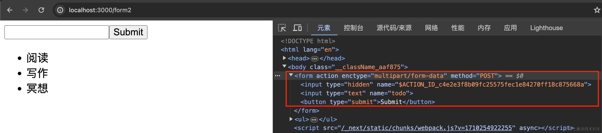

Next.js 会自动插入一个 `<input type="hidden">`，其值为 `$ACTION_ID_xxxxxxxx`，用于让服务端区分 Action（因为一个页面可能使用多个 Server Actions）。

当点击 Submit 的时候，触发表单提交，会发送一个 POST 请求到当前页面地址：

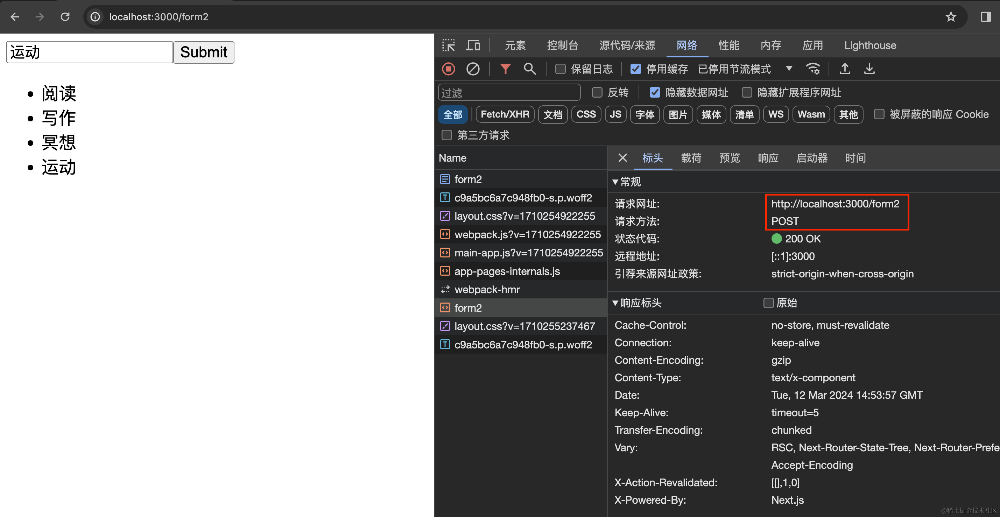

请求会携带表单中的值，以及 \$ACTION\_ID：

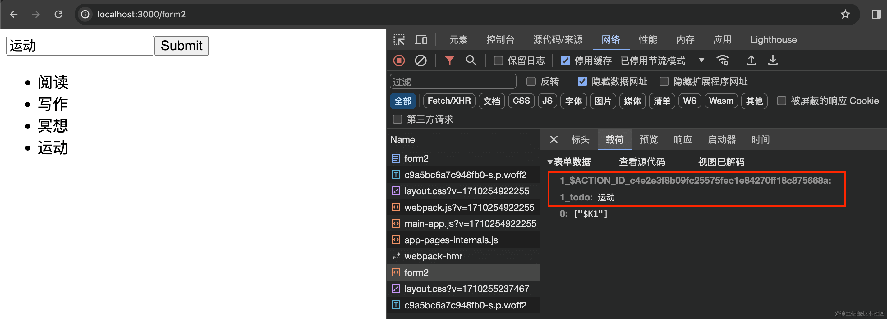

接口返回 RSC Payload，用于渲染更新后的数据：

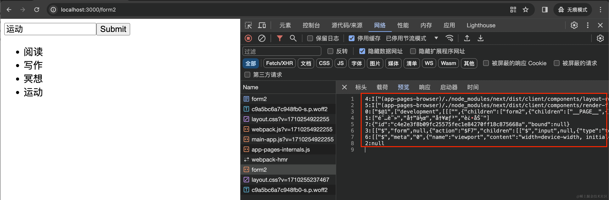

其中，中文在 Chrome 显示乱码了（火狐可以正常查看）。RSC Payload 中包含最新的数据（返回最新的数据是因为我们调用了 revalidatePath）：

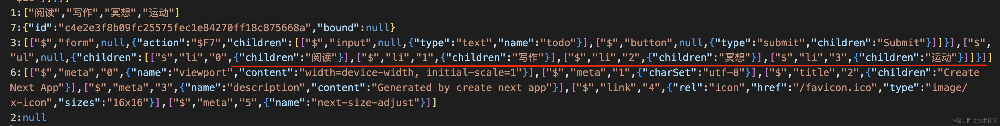

简而言之：

1.  **Server Actions 背后使用的是 POST 请求方法**，请求当前页面地址，根据 \$ACTION\_ID 区分
2.  **Server Actions 与 Next.js 的缓存和重新验证架构集成**。调用 Action 时，Next.js 可以一次性返回更新的 UI 和新数据


#### 使用好处

其次我们说说使用 Server Actions 的好处：

1.  代码更简洁。你也不需要手动创建接口，而且 Server Actions 是函数，这意味着它们可以在应用程序的任意位置中复用。
2.  当结合 form 使用的时候，支持渐进式增强。也就是说，即使禁用 JavaScript，表单也可以正常提交：

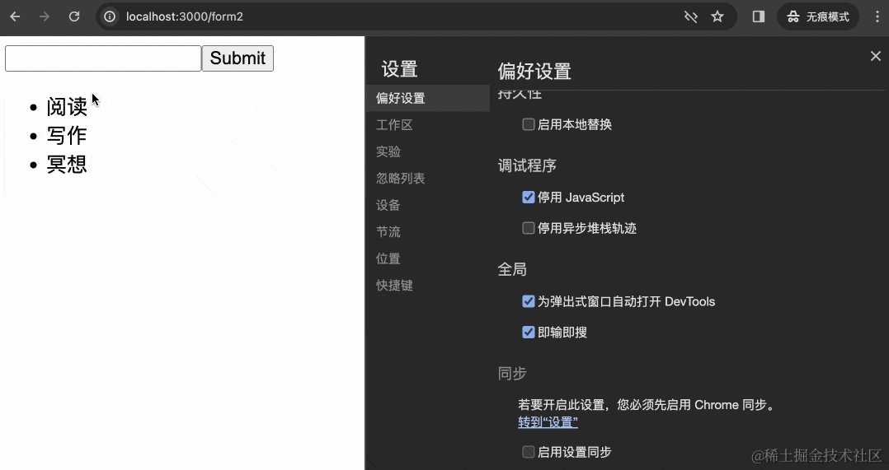

如果使用 Pages Router 下的监听事件的方式，表单就无法正常工作了。但是 Server Actions 即使禁用 JS，也可以正常工作。

使用 Server Actions 禁用和不禁用 JS 的差别是，**不禁用的时候提交表单，页面不会刷新**。禁用的时候提交表单页面会刷新（仔细看上图提交“早起”这项任务的时候，刷新按钮有变化）


#### 注意要点

最后讲讲使用 Server Actions 的注意要点。

1.  **Server Actions 的参数和返回值都必须是可序列化的**，简单的说，JSON.stringfiy 这个值不出错
2.  Server Actions 会继承使用的页面或者布局的运行时和路由段配置项，包括像 maxDuration 等字段


#### 支持事件

前面也说过：

> **而在具体使用上，虽然 Server Actions 常与 `<form>` 一起使用，但其实还可以在事件处理程序、useEffect、三方库、其他表单元素（如 `<button>`）中调用。**


如果是在事件处理程序中，该怎么使用呢？

我们为刚才的 ToDoList 增加一个 “添加运动” 的按钮。当点击的时候，将运动添加到 TODO 中：


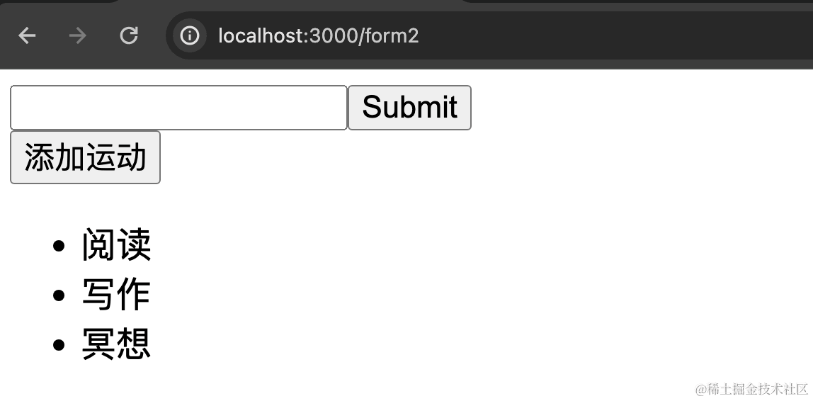

修改 `app/form2/page.js`，代码如下：

```js
import { findToDos, createToDo } from './actions';
import Button from './button';

export default async function Page() {
  const todos = await findToDos();
  return (
    <>
      <form action={createToDo}>
        <input type="text" name="todo" />
        <button type="submit">Submit</button>
      </form>
      <Button>添加运动</Button>
      <ul>
        {todos.map((todo, i) => <li key={i}>{todo}</li>)}
      </ul>
    </>
  )
}
```

新建 `app/form2/button.js`，代码如下：

```js
'use client'

import { createToDoDirectly } from './actions';

export default function Button({children}) {
  return <button onClick={async () => {
    const data = await createToDoDirectly('运动')
    alert(JSON.stringify(data))
  }}>{children}</button>
}
```

修改 `app/form2/actions.js`，添加代码：

```js
export async function createToDoDirectly(value) {
  const form = new FormData()
  form.append("todo", value);
  return createToDo(form)
}
```

交互效果如下：


这里的 Server Actions 是怎么实现的呢？

其实还是发送了一个 POST 请求到当前地址：


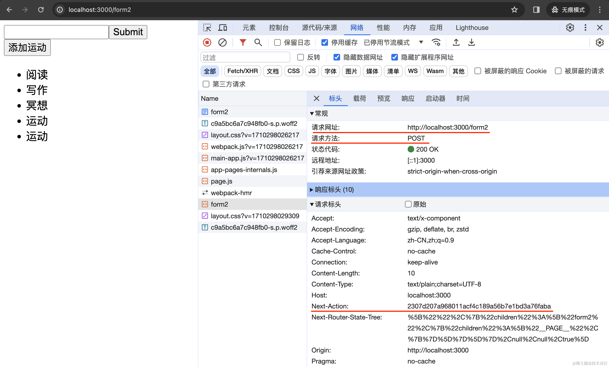

返回的依然是 RSC Payload：


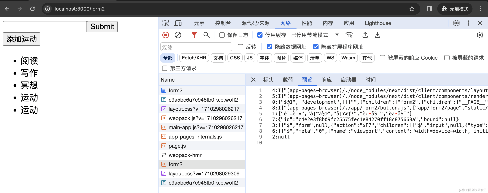


## Server Actions的用法

### Form

先讲讲 Server Actions 处理表单提交时常搭配使用的一些 API。


#### useFormStatus

首先是 [useFormStatus](https://react.dev/reference/react-dom/hooks/useFormStatus)，这是 React 的官方 hook，用于返回表单提交的状态信息。示例代码如下：

```javascript
'use client'
// app/submit-button.jsx
import { useFormStatus } from 'react-dom'
 
export function SubmitButton() {
  const { pending } = useFormStatus()
 
  return (
    <button type="submit" aria-disabled={pending}>
      {pending ? 'Adding' : 'Add'}
    </button>
  )
}
```

```javascript
// app/page.jsx
import { SubmitButton } from '@/app/submit-button'
 
export default async function Home() {
  return (
    <form action={...}>
      <input type="text" name="field-name" />
      <SubmitButton />
    </form>
  )
}
```

使用的时候要注意：useFormStatus 必须用在 `<form>` 下的组件内部，就像这段示例代码一样。先建立一个按钮组件，在组件内部调用 useFormStatus，然后 `<form>` 下引用该组件。不能完全写到一个组件中，像这样写就是错误的：

```javascript
function Form() {
  // 🚩 `pending` will never be true
  // useFormStatus does not track the form rendered in this component
  const { pending } = useFormStatus();
  return <form action={submit}></form>;
}
```


#### useFormState

然后是 [useFormState](https://react.dev/reference/react-dom/hooks/useFormState)，这也是 React 官方 hook，根据表单 action 的结果更新状态。

用在 React 时示例代码如下：

```javascript
import { useFormState } from "react-dom";

async function increment(previousState, formData) {
  return previousState + 1;
}

function StatefulForm({}) {
  const [state, formAction] = useFormState(increment, 0);
  return (
    <form>
      {state}
      <button formAction={formAction}>Increment</button>
    </form>
  )
}
```

用在 Next.js，结合 Server Actions 时，示例代码如下：

```javascript
'use client'

import { useFormState } from 'react-dom'

export default function Home() {

  async function createTodo(prevState, formData) {
    return prevState.concat(formData.get('todo'));
  }

  const [state, formAction] = useFormState(createTodo, [])

  return (
    <form action={formAction}>
      <input type="text" name="todo" />
      <button type="submit">Submit</button>
      <p>{state.join(',')}</p>
    </form>
  ) 
}
```


#### 实战体会

现在让我们结合 useFormStatus 和 useFormState，讲解使用 Server Actions 如何处理 form 提交。涉及的目录和文件如下：

```javascript
app                 
└─ form3           
   ├─ actions.js   
   ├─ form.js      
   └─ page.js            
```

其中 `app/form3/page.js` 代码如下：

```javascript
import { findToDos } from './actions';
import AddToDoForm from './form';

export default async function Page() {
  const todos = await findToDos();
  return (
    <>
      <AddToDoForm />
      <ul>
        {todos.map((todo, i) => <li key={i}>{todo}</li>)}
      </ul>
    </>
  )
}
```

`app/form3/form.js`，代码如下：

```javascript
'use client'
 
import { useFormState, useFormStatus } from 'react-dom'
import { createToDo } from './actions';

const initialState = {
  message: '',
}
 
function SubmitButton() {
  const { pending } = useFormStatus()
  return (
    <button type="submit" aria-disabled={pending}>
      {pending ? 'Adding' : 'Add'}
    </button>
  )
}

export default function AddToDoForm() {
  const [state, formAction] = useFormState(createToDo, initialState)
 
  return (
    <form action={formAction}>
      <input type="text" name="todo" />
      <SubmitButton />
      <p aria-live="polite" className="sr-only">
        {state?.message}
      </p>
    </form>
  )
}
```

`app/form3/actions.js`，代码如下：

```javascript
'use server'

import { revalidatePath } from "next/cache";

const sleep = ms => new Promise(r => setTimeout(r, ms));

let data = ['阅读', '写作', '冥想']
 
export async function findToDos() {
  return data
}

export async function createToDo(prevState, formData) {
  await sleep(500)
  const todo = formData.get('todo')
  data.push(todo)
  revalidatePath("/form3");
  return {
    message: `add ${todo} success!`
  }
}
```

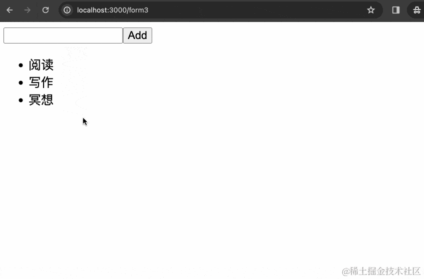

注意：

1. 当使用 useFormState 的时候，对应 Server Action 函数的参数，第一个参数是 prevState，第二个参数是 formData。
2. 当使用 useFormStatus 的时候，要写在 form 下的单独的组件中。

使用的时候，注意这两点就行。

值得一提的是：

```javascript
<p aria-live="polite" className="sr-only">
  {state?.message}
</p>
```

`aria-live`表示这是一个 ARIA 标签，用于礼貌通知用户发生了变更。`"sr-only"`表示这是一个只用于 screen reader 的内容。因为我们并没有设置 sr-only 的样式，所以在页面中显露了出来，按理说要加一个如下的样式：

```css
.sr-only {
  position: absolute;
  width: 1px;
  height: 1px;
  padding: 0;
  margin: -1px;
  overflow: hidden;
  clip: rect(0, 0, 0, 0);
  white-space: nowrap;
  border-width: 0;
}
```

简单的来说，这段内容在屏幕上并不应该显示出来。返回这个信息是用于通知不能像正常人看到屏幕内容、需要借助屏幕阅读器工具的人，任务创建成功。


### Server Actions 注意点

接下来讲讲写 Server Actions 有哪些注意要点。简单来说，要注意：

1.  获取提交的数据
2.  进行数据校验和错误处理
3.  重新验证数据
4.  错误处理


#### 获取数据

如果使用 form action 这种最基本的形式，Server Action 函数第一个参数就是 formData：

```javascript
export default function Page() {
  async function createInvoice(formData) {
    'use server'
 
    const rawFormData = {
      customerId: formData.get('customerId')
    }
 
    // mutate data
    // revalidate cache
  }
 
  return <form action={createInvoice}>...</form>
}
```

如果使用 form action + useFormState 这种形式，Server Actions 函数第一个参数是 prevState，第二个参数是 formData：

```javascript
'use client'

import { useFormState } from 'react-dom'

export default function Home() {

  async function createTodo(prevState, formData) {
    return prevState.concat(formData.get('todo'));
  }

  const [state, formAction] = useFormState(createTodo, [])

  return (
    <form action={formAction}>
      <input type="text" name="todo" />
      <button type="submit">Submit</button>
      <p>{state.join(',')}</p>
    </form>
  ) 
}
```

如果是直接调用，那看调用的时候是怎么传入的，比如上面举的事件调用的例子：

```javascript
'use client'

import { createToDoDirectly } from './actions';

export default function Button({children}) {
  return <button onClick={async () => {
    const data = await createToDoDirectly('运动')
    alert(JSON.stringify(data))
  }}>{children}</button>
}
```

```javascript
'use server'

export async function createToDoDirectly(value) {
  const form = new FormData()
  form.append("todo", value);
  return createToDo(form)
}
```


#### 表单验证

Next.js 推荐基本的表单验证使用 HTML 元素自带的验证如 `required`、`type="email"`等。

对于更高阶的服务端数据验证，可以使用 [zod](https://zod.dev/) 这样的 schema 验证库来验证表单数据的结构：

```javascript
'use server'
 
import { z } from 'zod'
 
const schema = z.object({
  email: z.string({
    invalid_type_error: 'Invalid Email',
  }),
})
 
export default async function createsUser(formData) {
  const validatedFields = schema.safeParse({
    email: formData.get('email'),
  })
 
  // Return early if the form data is invalid
  if (!validatedFields.success) {
    return {
      errors: validatedFields.error.flatten().fieldErrors,
    }
  }
 
  // Mutate data
}
```


#### 重新验证数据

Server Action 修改数据后，一定要注意重新验证数据，否则数据不会及时更新。

使用 revalidatePath：

```javascript
'use server'
 
import { revalidatePath } from 'next/cache'
 
export async function createPost() {
  try {
    // ...
  } catch (error) {
    // ...
  }
 
  revalidatePath('/posts')
}
```

使用 revalidateTag：

```javascript
'use server'
 
import { revalidateTag } from 'next/cache'
 
export async function createPost() {
  try {
    // ...
  } catch (error) {
    // ...
  }
 
  revalidateTag('posts')
}
```


#### 错误处理

一种是返回错误信息。举个例子，当一个条目创建失败，返回错误信息：

```javascript
'use server'
// app/actions.js
export async function createTodo(prevState, formData) {
  try {
    await createItem(formData.get('todo'))
    return revalidatePath('/')
  } catch (e) {
    return { message: 'Failed to create' }
  }
}
```

在客户端组件中，读取这个值并显示错误信息：

```javascript
'use client'
// app/add-form.jsx
import { useFormState, useFormStatus } from 'react-dom'
import { createTodo } from '@/app/actions'
 
const initialState = {
  message: null,
}
 
function SubmitButton() {
  const { pending } = useFormStatus()
 
  return (
    <button type="submit" aria-disabled={pending}>
      Add
    </button>
  )
}
 
export function AddForm() {
  const [state, formAction] = useFormState(createTodo, initialState)
 
  return (
    <form action={formAction}>
      <label htmlFor="todo">Enter Task</label>
      <input type="text" id="todo" name="todo" required />
      <SubmitButton />
      <p aria-live="polite" className="sr-only">
        {state?.message}
      </p>
    </form>
  )
}
```

一种是抛出错误，会由最近的 error.js 捕获：

```javascript
'use client'
// error.js
export default function Error() {
  return (
    <h2>error</h2>
  )
}
```

```javascript
// page.js
import { useFormState } from 'react-dom'

function AddForm() {
  async function serverActionWithError() {
    'use server';   
    throw new Error(`This is error is in the Server Action`);
  }

  return (
    <form action={serverActionWithError}>
      <button type="submit">Submit</button>
    </form>
  ) 
}

export default AddForm
```

这样当 Server Action 发生错误的时候，就会展示错误 UI。


### 乐观更新

#### useOptimistic

所谓乐观更新，举个例子，当用户点击一个点赞按钮的时候，传统的做法是等待接口返回成功时再更新 UI。乐观更新是先更新 UI，同时发送数据请求，至于数据请求后的错误处理，则根据自己的需要自定义实现。

React 提供了 [useOptimistic](https://react.dev/reference/react/useOptimistic) hook，这也是官方 hook，基本用法如下：

```javascript
import { useOptimistic } from 'react';

function AppContainer() {
  const [optimisticState, addOptimistic] = useOptimistic(
    state,
    // updateFn
    (currentState, optimisticValue) => {
      // merge and return new state
      // with optimistic value
    }
  );
}
```

结合 Server Actions 使用的示例代码如下：

```javascript
'use client'
 
import { useOptimistic } from 'react'
import { send } from './actions'
 
export function Thread({ messages }) {
  const [optimisticMessages, addOptimisticMessage] = useOptimistic(
    messages,
    (state, newMessage) => [...state, { message: newMessage }]
  )
 
  return (
    <div>
      {optimisticMessages.map((m) => (
        <div>{m.message}</div>
      ))}
      <form
        action={async (formData) => {
          const message = formData.get('message')
          addOptimisticMessage(message)
          await send(message)
        }}
      >
        <input type="text" name="message" />
        <button type="submit">Send</button>
      </form>
    </div>
  )
}
```


#### 实战体会

为了加深对乐观更新的理解，我们来写一个例子。项目目录和文件如下：

```javascript
app                 
└─ form4           
   ├─ actions.js   
   ├─ form.js      
   └─ page.js            
```

其中 `app/form4/page.js` 代码如下：

```javascript
import { findToDos } from './actions';
import Form from './form';

export default async function Page() {
  const todos = await findToDos();
  return (
    <Form todos={todos} />
  )
}
```

`app/form4/form.js`，代码如下：

```javascript
'use client'

import { useOptimistic } from 'react'
import { useFormState } from 'react-dom'
import { createToDo } from './actions';

export default function Form({ todos }) {
  const [state, sendFormAction] = useFormState(createToDo, { message: '' })

  const [optimistiToDos, addOptimisticTodo] = useOptimistic(
    todos.map((i) => ({text: i})),
    (state, newTodo) => [
      ...state,
      {
        text: newTodo,
        sending: true
      }
    ]
  );

  async function formAction(formData) {
    addOptimisticTodo(formData.get("todo"));
    await sendFormAction(formData);
  }

  console.log(optimistiToDos)

  return (
    <>
      <form action={formAction}>
        <input type="text" name="todo" />
        <button type="submit"> Add </button>
        <p aria-live="polite" className="sr-only">
          {state?.message}
        </p>
      </form>
      <ul>
        {optimistiToDos.map(({text, sending}, i) => <li key={i}>{text}{!!sending && <small> (Sending...)</small>}</li>)}
      </ul>
    </>
  )
}
```

`app/form4/actions.js`，代码如下：

```javascript
'use server'

import { revalidatePath } from "next/cache";

const sleep = ms => new Promise(r => setTimeout(r, ms));

let data = ['阅读', '写作', '冥想']
 
export async function findToDos() {
  return data
}

export async function createToDo(prevState, formData) {
  await sleep(2500)
  const todo = formData.get('todo')
  data.push(todo)
  revalidatePath("/form4");
  return {
    message: `add ${todo} success!`
  }
}
```

交互效果如下：

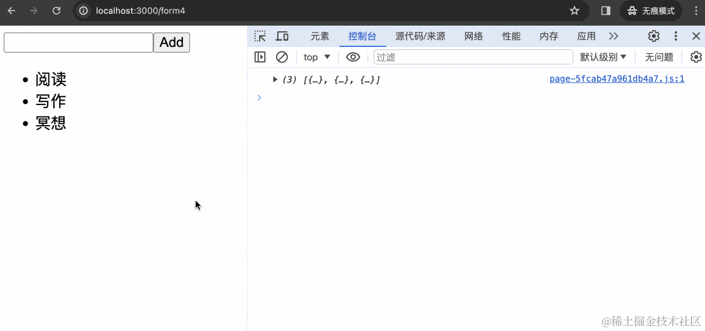

注：乐观更新是一种面向未来的 UI 更新方式。如何在接口错误的时候撤回数据？如果接口实在是太慢了，乐观更新的时候，用户要离开该怎么办？

关于这些更细节的实现问题，欢迎参考 [《Next.js v14 实现乐观更新，面向未来的 UI 更新方式，你可以不去做，但你不应该不了解》](https://juejin.cn/post/7347957960884355113)


## 常见问题

### 如何处理 Cookies ?

```javascript
'use server'
 
import { cookies } from 'next/headers'
 
export async function exampleAction() {
  // Get cookie
  const value = cookies().get('name')?.value
 
  // Set cookie
  cookies().set('name', 'Delba')
 
  // Delete cookie
  cookies().delete('name')
}
```


### 如何重定向？

```javascript
'use server'
 
import { redirect } from 'next/navigation'
import { revalidateTag } from 'next/cache'
 
export async function createPost(id) {
  try {
    // ...
  } catch (error) {
    // ...
  }
 
  revalidateTag('posts') // Update cached posts
  redirect(`/post/${id}`) // Navigate to the new post page
}
```


