## CSR、SSR、SSG、ISR

### CSR

#### 概念介绍

我们先从传统的 CSR 开始说起。

**CSR，英文全称“Client-side Rendering”，中文翻译“客户端渲染”。顾名思义，渲染工作主要在客户端执行。**

像我们传统使用 React 的方式，就是客户端渲染。浏览器会先下载一个非常小的 HTML 文件和所需的  JavaScript 文件。在 JavaScript 中执行发送请求、获取数据、更新 DOM 和渲染页面等操作。

这样做最大的问题就是不够快。（SEO 问题是其次，现在的爬虫已经普遍能够支持 CSR 渲染的页面）

在下载、解析、执行 JavaScript以及请求数据没有返回前，页面不会完全呈现。


#### Next.js 实现 CSR

Next.js 支持 CSR，在 Next.js Pages Router 下有两种方式实现客户端渲染。

一种是在页面中使用 React `useEffect` hook，而不是服务端的渲染方法（比如 `getStaticProps`和 `getServerSideProps`，这两个方法后面会讲到），举个例子：

```javascript
// pages/csr.js
import React, { useState, useEffect } from 'react'
 
export default function Page() {
  const [data, setData] = useState(null)
 
  useEffect(() => {
    const fetchData = async () => {
      const response = await fetch('https://jsonplaceholder.typicode.com/todos/1')
      if (!response.ok) {
        throw new Error(`HTTP error! status: ${response.status}`)
      }
      const result = await response.json()
      setData(result)
    }
 
    fetchData().catch((e) => {
      console.error('An error occurred while fetching the data: ', e)
    })
  }, [])
 
  return <p>{data ? `Your data: ${JSON.stringify(data)}` : 'Loading...'}</p>
}
```

可以看到，请求由客户端发出，同时页面显示 loading 状态，等数据返回后，主要内容在客户端进行渲染。

当访问 `/csr`的时候，渲染的 HTML 文件为：

```html
<body>
  <div id="__next">
    <p>Loading...</p>
  </div>
</body>
```

js获取数据后，更新为：

```html
<body>
  <div id="__next">
    <p>Your dtat: json...</p>
  </div>
</body>
```


第二种方法是在客户端使用数据获取的库比如 [SWR](https://swr.vercel.app/)（也是 Next.js 团队开发的）或 [TanStack Query](https://tanstack.com/query/latest/)，举个例子：

```javascript
// pages/csr2.js
import useSWR from 'swr'
const fetcher = (...args) => fetch(...args).then((res) => res.json())

export default function Page() {
  const { data, error, isLoading } = useSWR(
    'https://jsonplaceholder.typicode.com/todos/1',
    fetcher
  )
 
  if (error) return <p>Failed to load.</p>
  if (isLoading) return <p>Loading...</p>
 
  return <p>Your Data: {data.title}</p>
}
```

效果同上


### SSR

#### 概念介绍

**SSR，英文全称“Server-side Rendering”，中文翻译“服务端渲染”。顾名思义，渲染工作主要在服务端执行。**

比如打开一篇博客文章页面，没有必要每次都让客户端请求，万一客户端网速不好呢，那干脆由服务端直接请求接口、获取数据，然后渲染成静态的 HTML 文件返回给用户。

虽然同样是发送请求，但通常服务端的环境（网络环境、设备性能）要好于客户端，所以最终的渲染速度（首屏加载时间）也会更快。

虽然总体速度是更快的，但因为 CSR 响应时只用返回一个很小的 HTML，SSR 响应还要请求接口，渲染 HTML，所以其响应时间会更长，对应到性能指标 TTFB (Time To First Byte)，SSR 更长。

> getServerSideProps由服务端执行，也就是调用接口在浏览器控制台是看不到的


#### Next.js 实现 SSR

Next.js 支持 SSR，我们使用 Pages Router 写个 demo：

```javascript
// pages/ssr.js
export default function Page({ data }) {
  return <p>{JSON.stringify(data)}</p>
}
 
export async function getServerSideProps() {
  const res = await fetch(`https://jsonplaceholder.typicode.com/todos`)
  const data = await res.json()
 
  return { props: { data } }
}
```

使用 SSR，你需要导出一个名为 `getServerSideProps`的 async 函数。这个函数会在每次请求的时候被调用。返回的数据会通过组件的 props 属性传递给组件。服务端会在每次请求的时候编译 HTML 文件返回给客户端。


### SSG

#### 3.1. 概念介绍

**SSG，英文全称“Static Site Generation”，中文翻译“静态站点生成”。**

SSG 会在构建阶段，就将页面编译为静态的 HTML 文件。

比如打开一篇博客文章页面，既然所有人看到的内容都是一样的，没有必要在用户请求页面的时候，服务端再请求接口。干脆先获取数据，提前编译成 HTML 文件，等用户访问的时候，直接返回 HTML 文件。这样速度会更快。再配上 CDN 缓存，速度就更快了。

所以能用 SSG 就用 SSG。“在用户访问之前是否能预渲染出来？”如果能，就用 SSG。

#### Next.js 实现 SSG

Next.js 支持 SSG。当不获取数据时，默认使用的就是 SSG。我们使用 Pages Router 写个 demo：

```javascript
// pages/ssg1.js
function About() {
  return <div>About</div>
}
 
export default About
```

像这种没有数据请求的页面，Next.js 会在构建的时候生成一个单独的 HTML 文件。

不过 Next.js 默认没有导出该文件。如果你想看到构建生成的 HTML 文件，修改 `next.config.js` 文件：

```javascript
const nextConfig = {
  output: 'export'
}
 
module.exports = nextConfig
```

再执行 `npm run build`，你就会在根目录下看到生成的 `out` 文件夹，里面存放了构建生成的 HTML 文件。

那如果要获取数据呢？这分两种情况。

第一种情况，页面内容需要获取数据。就比如博客的文章内容需要调用 API 获取。Next.js 提供了 `getStaticProps`。写个 demo：

```javascript
// pages/ssg2.js
export default function Blog({ posts }) {
  return (
    <ul>
      {posts.map((post) => (
        <li key={post.id}>{post.title}</li>
      ))}
    </ul>
  )
}

export async function getStaticProps() {
  const res = await fetch('https://jsonplaceholder.typicode.com/posts')
  const posts = await res.json()
  return {
    props: {
      posts,
    },
  }
}
```

`getStaticProps`会在构建的时候被调用，并将数据通过 props 属性传递给页面。

（还记得 `getServerSideProps` 吗？两者在用法上类似，不过 `getServerSideProps` 是在每次请求的时候被调用，`getStaticProps` 在每次构建的时候）

第二种情况，是页面路径需要获取数据。

这是什么意思呢？就比如数据库里有 100 篇文章，我肯定不可能自己手动定义 100 个路由，然后预渲染 100 个 HTML 吧。Next.js 提供了 `getStaticPaths`用于定义预渲染的路径。它需要搭配动态路由使用。写个 demo：

新建 `/pages/post/[id].js`，代码如下：

```javascript
// /pages/post/[id].js
export default function Blog({ post }) {
  return (
    <>
      <header>{post.title}</header>
      <main>{post.body}</main>
    </>
  )
}

export async function getStaticPaths() {
  const res = await fetch('https://jsonplaceholder.typicode.com/posts')
  const posts = await res.json()
 
  const paths = posts.map((post) => ({
    params: { id: String(post.id) },
  }))

  // { fallback: false } 意味着当访问其他路由的时候返回 404
  return { paths, fallback: false }
}

export async function getStaticProps({ params }) {
  // 如果路由地址为 /posts/1, params.id 为 1
  const res = await fetch(`https://jsonplaceholder.typicode.com/posts/${params.id}`)
  const post = await res.json()
 
  return { props: { post } }
}
```

其中，`getStaticPaths` 和 `getStaticProps`都会在构建的时候被调用，`getStaticPaths` 定义了哪些路径被预渲染，`getStaticProps`获取路径参数，请求数据传给页面。

当你执行 `npm run build`的时候，就会看到 post 文件下生成了一堆 HTML 文件。


### ISR

#### 概念介绍

**ISR，英文全称“Incremental Static Regeneration”，中文翻译“增量静态再生”。**

还是打开一篇博客文章页面，博客的主体内容也许是不变的，但像比如点赞、收藏这些数据总是在变化的吧。使用 SSG 编译成 HTML 文件后，这些数据就无法准确获取了，那你可能就退而求其次改为 SSR 或者 CSR 了。

考虑到这种情况，Next.js 提出了 ISR。当用户访问了这个页面，第一次依然是老的 HTML 内容，但是 Next.js 同时静态编译成新的 HTML 文件，当你第二次访问或者其他用户访问的时候，就会变成新的 HTML 内容了。你可以在[demo](https://on-demand-isr.vercel.app/) 中测试 ISR 效果。


#### Next.js 实现 ISR

Next.js 支持 ISR，并且使用的方式很简单。你只用在 `getStaticProps` 中添加一个 `revalidate`即可。我们基于 SSG 的示例代码上进行修改：

```javascript
// pages/post/[id].js
// 保持不变
export default function Blog({ post }) {
  return (
    <>
      <header>{post.title}</header>
      <main>{post.body}</main>
    </>
  )
}

// fallback 的模式改为 'blocking'
export async function getStaticPaths() {
  const res = await fetch('https://jsonplaceholder.typicode.com/posts')
  const posts = await res.json()
 
  const paths = posts.slice(0, 10).map((post) => ({
    params: { id: String(post.id) },
  }))
 
  return { paths, fallback: 'blocking' }
}

// 使用这种随机的方式模拟数据改变
function getRandomInt(max) {
  return Math.floor(Math.random() * max);
}

// 多返回了 revalidata 属性
export async function getStaticProps({ params }) {
  const res = await fetch(`https://jsonplaceholder.typicode.com/posts/${getRandomInt(100)}`)
  const post = await res.json()
 
  return { 
    props: { post }, 
    revalidate: 10
  }
}
```

`revalidate`表示当发生请求的时候，至少间隔多少秒才更新页面。

这听起来有些抽象，以 `revalidate: 10` 为例，在初始请求后和接下来的 10 秒内，页面都会使用之前构建的 HTML。10s 后第一个请求发生的时候，依然使用之前编译的 HTML。但 Next.js 会开始构建更新 HTML，从下个请求起就会使用新的 HTML。（如果构建失败了，就还是用之前的，等下次再触发更新）

当你在本地使用 `next dev`运行的时候，`getStaticProps`会在每次请求的时候被调用。所以如果你要测试 ISR 功能，先构建出生产版本，再运行生产服务。也就是说，测试 ISR 效果，用这俩命令：

```javascript
next build // 或 npm run build
next start // 或 npm run start
```


页面刷新后，文章内容发生变化。然后 10s 内的刷新，页面内容都没有变化。10s 后的第一次刷新触发了更新，10s 后的第二次刷新内容发生了变化。

注意这次 `getStaticPaths` 函数的返回为`return { paths, fallback: 'blocking' }`。它表示构建的时候就渲染 `paths` 里的这些路径。如果请求其他的路径，那就执行服务端渲染。在上节 SSG 的例子中，我们设置 `fallback`为 false，它表示如果请求其他的路径，就会返回 404 错误。

所以在这个 ISR demo 中，如果请求了尚未生成的路径，Next.js 会在第一次请求的时候就执行服务端渲染，编译出 HTML 文件，再请求时就从缓存里返回该 HTML 文件。SSG 优雅降级到 SSR。


### 支持混合使用

在写 demo 的时候，想必你已经发现了，其实每个页面你并没有专门声明使用哪种渲染模式，Next.js 是自动判断的。所以一个 Next.js 应用里支持混合使用多种渲染模式。

当页面有 `getServerSideProps`的时候，Next.js 切成 SSR 模式。没有 `getServerSideProps` 则会预渲染页面为静态的 HTML。那你可能会问，CSR 呢？就算用 CSR 模式，Next.js 也要提供一个静态的 HTML，所以还是要走预渲染这步的，只不过相比 SSG，渲染的内容少了些。

页面可以是 SSG + CSR 的混合，由 SSG 提供初始的静态页面，提高首屏加载速度。CSR 动态填充内容，提供交互能力。举个例子：

```javascript
// pages/postList.js
import React, { useState } from 'react'

export default function Blog({ posts }) {
  const [data, setData] = useState(posts)
  return (
    <>
      <button onClick={async () => {
          const res = await fetch('https://jsonplaceholder.typicode.com/posts')
          const posts = await res.json()
          setData(posts.slice(10, 20))
      }}>换一批</button>
      <ul>
        {data.map((post) => (
          <li key={post.id}>{post.title}</li>
        ))}
      </ul>
    </>
  )
}

export async function getStaticProps() {
  const res = await fetch('https://jsonplaceholder.typicode.com/posts')
  const posts = await res.json()
  return {
    props: {
      posts: posts.slice(0, 10),
    },
  }
}
```

初始的文章列表数据就是在构建的时候写入 HTML 里的，在点击换一批按钮的时候，则是在客户端发送请求重新渲染内容。


## React Server Component 与 SSR

Next.js v13 推出了基于 React Server Component 的 App Router 路由解决方案。对于 Next.js 而言堪称是一个颠覆式的更新，更是将 React 一直宣传的 React Server Component 这个概念真正推进并落实到项目中。

因为 React Server Component 的引入，Next.js 中的组件开始区分客户端组件还是服务端组件，但考虑到部分同学对 React Server Component 并不熟悉，本篇我们会先从 React Server Components 的出现背景开始讲起，并将其与常混淆的 SSR 概念做区分，为大家理解和使用服务端组件和客户端组件打下基础。


## Suspense 与 Streaming

Suspense 是 Next.js 项目中常用的一个组件，了解其原理和背景有助于我们正确使用 Suspense 组件。


### 传统 SSR

在最近的两篇文章里，我们已经介绍了 SSR 的原理和缺陷。简单来说，使用 SSR，需要经过一系列的步骤，用户才能查看页面、与之交互。具体这些步骤是：

1.  服务端获取所有数据
2.  服务端渲染 HTML
3.  将页面的 HTML、CSS、JavaScript 发送到客户端
4.  使用 HTML 和 CSS 生成不可交互的用户界面（non-interactive UI）
5.  React 对用户界面进行水合（hydrate），使其可交互（interactive UI）

::info 水合

在 Next.js 中，**水合（hydrate）**是指从服务器端渲染（SSR）生成的 HTML 内容被客户端的 JavaScript 完全接管和激活的过程。

具体来说，**水合**通常在一个使用 SSR 的应用程序中发生，当浏览器加载一个页面时，服务器端渲染了 HTML 并返回给浏览器，这时页面是静态的，没有绑定事件或者 JavaScript 行为。这时，客户端的 JavaScript 会接管这个页面，加载和初始化 React 组件的状态，使页面从静态变成动态，这个过程就叫做“水合”。

**水合的过程**：

1. **服务器端渲染（SSR）**：
   - 在服务器上执行 React 代码，并生成一个完整的 HTML 页面，响应给客户端。
   - 页面包含所有需要的内容，但没有 JavaScript 交互。
2. **客户端水合**：
   - 客户端接收到由服务器生成的 HTML 页面后，React 会使用 React 组件的代码、事件监听器等动态内容来激活页面。
   - 在这个过程中，React 会将静态 HTML 转变成动态可交互的页面。

:::


这些步骤是连续的、阻塞的。这意味着服务端只能在获取所有数据后渲染 HTML，React 只能在下载了所有组件代码后才能进行水合：

还记得上篇总结的 SSR 的几个缺点吗？

1.  SSR 的数据获取必须在组件渲染之前
2.  组件的 JavaScript 必须先加载到客户端，才能开始水合
3.  所有组件必须先水合，然后才能跟其中任意一个组件交互


### Suspense

#### 介绍

为了解决这些问题，React 18 引入了 [\<Suspense\>](https://react.dev/reference/react/Suspense) 组件。react中怎么使用就不介绍了

 Next.js 是怎么实现的呢？

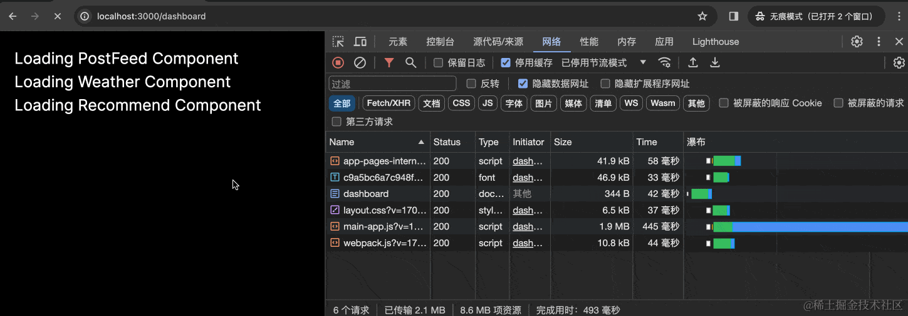

让我们观察下 dashboard 这个 HTML 文件的加载情况，你会发现它一开始是 2.03s，然后变成了 5.03s，最后变成了 8.04s，这不就正是我们设置的 sleep 时间吗？

查看 dashboard 请求的响应头：

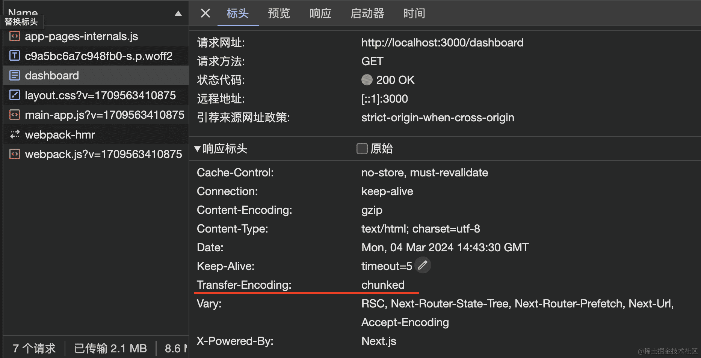

`Transfer-Encoding` 标头的值为 `chunked`，表示数据将以一系列分块的形式进行发送。

> 分块传输编码（Chunked transfer encoding）是超文本传输协议（HTTP）中的一种数据传输机制，允许 HTTP由网页服务器发送给客户端应用（ 通常是网页浏览器）的数据可以分成多个部分。分块传输编码只在 HTTP 协议1.1版本（HTTP/1.1）中提供。

再查看 dashboard 返回的数据（这里我们做了简化）：

```html
<!DOCTYPE html>
<html lang="en">
    <head>
        // ...
    </head>
    <body class="__className_aaf875">
        <section style="padding:20px">
            <!--$?-->
            <template id="B:0"></template>
            <p>Loading PostFeed Component</p>
            <!--/$-->
            <!--$?-->
            <template id="B:1"></template>
            <p>Loading Weather Component</p>
            <!--/$-->
            <!--$?-->
            <template id="B:2"></template>
            <p>Loading Recommend Component</p>
            <!--/$-->
        </section>
        // ...
        <div hidden id="S:0">
            <h1>Hello PostFeed</h1>
        </div>
        <script>
            // 交换位置
            $RC = function(b, c, e) {
                // ...
            };
            $RC("B:0", "S:0")
        </script>
        <div hidden id="S:2">
            <h1>Hello Recommend</h1>
        </div>
        <script>
            $RC("B:2", "S:2")
        </script>
        <div hidden id="S:1">
            <h1>Hello Weather</h1>
        </div>
        <script>
            $RC("B:1", "S:1")
        </script>
    </body>
</html>

```

可以看到使用 Suspense 组件的 fallback UI 和渲染后的内容都会出现在该 HTML 文件中，说明该请求持续与服务端保持连接，服务端在组件渲染完后会将渲染后的内容追加传给客户端，客户端收到新的内容后进行解析，执行类似于 `$RC("B:2", "S:2")`这样的函数交换 DOM 内容，使 fallback UI 替换为渲染后的内容。

这个过程被称之为 Streaming Server Rendering（流式渲染），它解决了传统 SSR 的第一个问题，那就是数据获取必须在组件渲染之前。使用 Suspense，先渲染 Fallback UI，等数据返回再渲染具体的组件内容。

使用 Suspense 还有一个好处就是 Selective Hydration（选择性水合）。简单的来说，当多个组件等待水合的时候，React 可以根据用户交互决定组件水合的优先级。比如 Sidebar 和 MainContent 组件都在等待水合，快要到 Sidebar 了，但此时用户点击了 MainContent 组件，React 会在单击事件的捕获阶段同步水合 MainContent 组件以保证立即响应，Sidebar 稍后水合。

总结一下，使用 Suspense，可以解锁两个主要的好处，使得 SSR 的功能更加强大：

1.  Streaming Server Rendering（流式渲染）：从服务器到客户端渐进式渲染 HTML
2.  Selective Hydration（选择性水合）：React 根据用户交互决定水合的优先级


#### Suspense 会影响 SEO 吗？

首先，Next.js 会等待 [generateMetadata](https://juejin.cn/book/7307859898316881957/section/7309079119902277669#heading-3) 内的数据请求完毕后，再将 UI 流式传输到客户端，这保证了响应的第一部分就会包含 `<head>` 标签。

其次，因为 Streaming 是流式渲染，HTML 中会包含最终渲染的内容，所以它不会影响 SEO。


#### Suspense 如何控制渲染顺序？

我们将三个组件同时进行渲染，哪个组件的数据先返回，就先渲染哪个组件。

但有的时候，希望按照某种顺序展示组件，比如先展示 `PostFeed`，再展示`Weather`，最后展示`Recommend`，此时你可以将 Suspense 组件进行嵌套：

```js
export default function Dashboard() {
  return (
    <section style={{padding: '20px'}}>
      <Suspense fallback={<p>Loading PostFeed Component</p>}>
        <PostFeed />
        <Suspense fallback={<p>Loading Weather Component</p>}>
          <Weather />
          <Suspense fallback={<p>Loading Recommend Component</p>}>
            <Recommend />
          </Suspense>
        </Suspense>
      </Suspense>
    </section>
  )
}
```

那么问题来了，此时页面的最终加载时间是多少秒？是请求花费时间最长的 8s 还是 2 + 8 + 5 = 15s 呢？

答案是 8s，这些数据请求是同时发送的，所以当 Weather 组件返回的时候，Recommend 组件立刻就展示了出来。

注意：这也是因为这里的数据请求并没有前后依赖关系，如果有那就另讲了。


### Streaming

#### 介绍

Suspense 背后的这种技术称之为 Streaming。将页面的 HTML 拆分成多个 chunks，然后逐步将这些块从服务端发送到客户端。

这样就可以更快的展现出页面的某些内容，而无需在渲染 UI 之前等待加载所有数据。提前发送的组件可以提前开始水合，这样当其他部分还在加载的时候，用户可以和已完成水合的组件进行交互，有效改善用户体验。

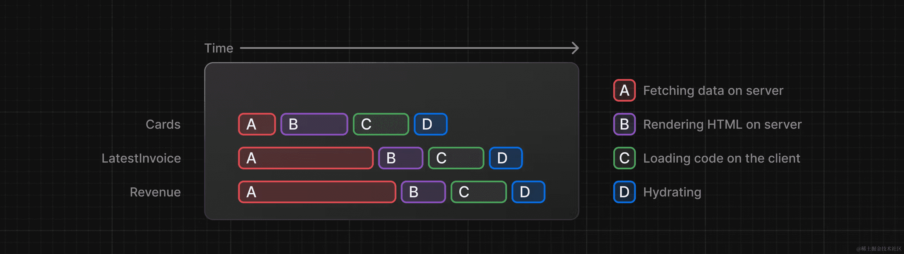

Streaming 可以有效的阻止耗时长的数据请求阻塞整个页面加载的情况。它还可以减少加载[第一个字节所需时间（TTFB）](https://web.dev/articles/ttfb?hl=zh-cn)和[首次内容绘制（FCP）](https://developer.chrome.com/docs/lighthouse/performance/first-contentful-paint/)，有助于缩短[可交互时间（TTI）](https://developer.chrome.com/en/docs/lighthouse/performance/interactive/)，尤其在速度慢的设备上。

传统 SSR：

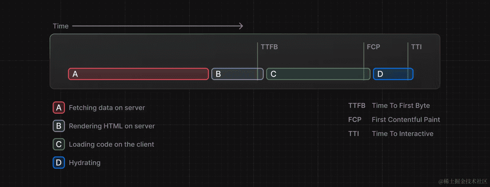

使用 Streaming 后：

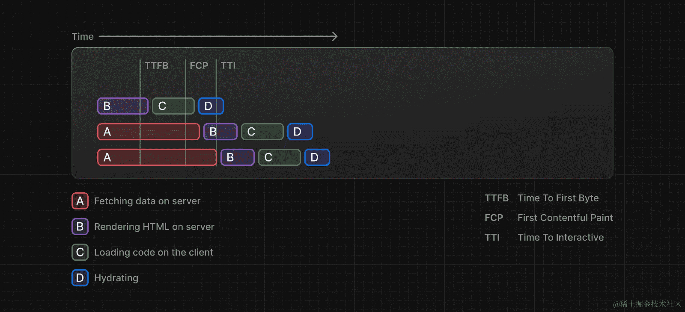


#### 使用

在 Next.js 中有两种实现 Streaming 的方法：

1.  页面级别，使用 `loading.jsx`
2.  特定组件，使用 `<Suspense>`

这里分享一个使用 `loading.jsx` 的小技巧，那就是当多个页面复用一个 loading.jsx 效果的时候可以借助路由组来实现。

目录结构如下：

```javascript
app                  
├─ (dashboard)       
│  ├─ about          
│  │  └─ page.js     
│  ├─ settings       
│  │  └─ page.js     
│  ├─ team           
│  │  └─ page.js     
│  ├─ layout.js      
│  └─ loading.js         
```


#### 缺点

Suspense 和 Streaming 确实很好，将原本只能先获取数据、再渲染水合的传统 SSR 改为渐进式渲染水合，但还有一些问题没有解决。就比如用户下载的 JavaScript 代码，该下载的代码还是没有少，可是用户真的需要下载那么多的 Javascript 代码吗？又比如所有的组件都必须在客户端进行水合，对于不需要交互性的组件其实没有必要进行水合。

为了解决这些问题，目前的最终方案就是上一篇介绍的 RSC：

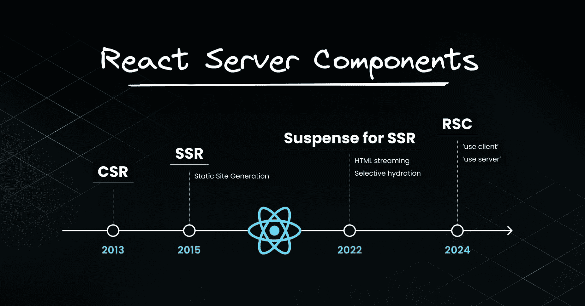

当然这并不是说 RSC 可以替代 Suspense，实际上两者可以组合使用，带来更好的性能体验。


## 服务端组件和客户端组件

服务端组件和客户端组件是 Next.js 中非常重要的概念。如果没有细致的了解过，你可能会简单的以为所谓服务端组件就是 SSR，客户端组件就是 CSR，服务端组件在服务端进行渲染，客户端组件在客户端进行渲染等等，实际上并非如此。本篇就让我们深入学习和探究 Next.js 的双组件模型吧！


### 服务端组件

#### 介绍

在 Next.js 中，组件默认就是服务端组件。创建一个js文件，请求会在服务端执行，并将渲染后的 HTML 发送给客户端：

```js
export default async function Page() {
  const res = await fetch('https://jsonplaceholder.typicode.com/todos')
  const data = (await res.json()).slice(0, 10)
  console.log(data)
  return <ul>
    {data.map(({ title, id }) => {
      return <li key={id}>{title}</li>
    })}
  </ul>
}
```

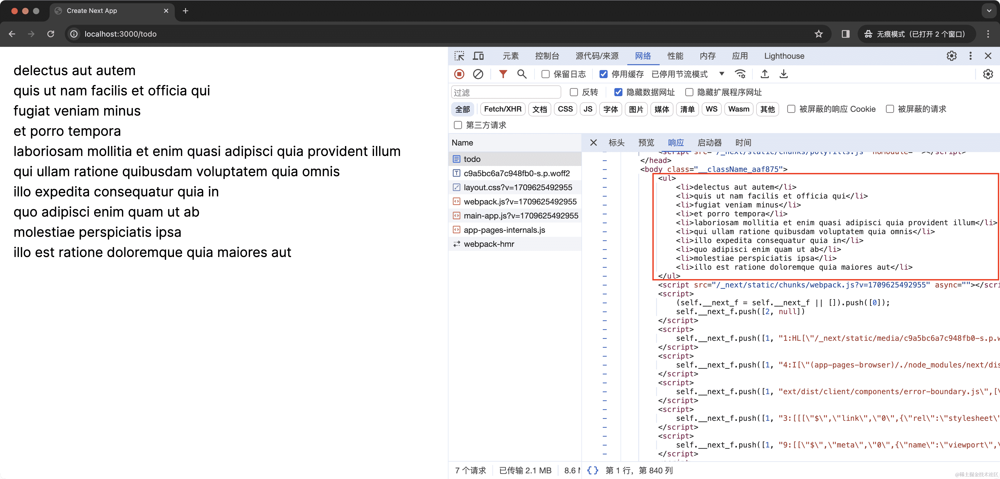

因为在服务端执行，`console` 打印的结果也只可能会出现在命令行中，而非客户端浏览器中。


#### 优势

使用服务端渲染有很多好处：

1.  数据获取：通常服务端环境（网络、性能等）更好，离数据源更近，在服务端获取数据会更快。通过减少数据加载时间以及客户端发出的请求数量来提高性能
2.  安全：在服务端保留敏感数据和逻辑，不用担心暴露给客户端
3.  缓存：服务端渲染的结果可以在后续的请求中复用，提高性能
4.  bundle 大小：服务端组件的代码不会打包到 bundle 中，减少了 bundle 包的大小
5.  初始页面加载和 FCP：服务端渲染生成 HTML，快速展示 UI
6.  Streaming：服务端组件可以将渲染工作拆分为 chunks，并在准备就绪时将它们流式传输到客户端。用户可以更早看到页面的部分内容，而不必等待整个页面渲染完毕

因为服务端组件的诸多好处，**在实际项目开发的时候，能使用服务端组件就尽可能使用服务端组件**。


#### 限制

虽然使用服务端组件有很多好处，但使用服务端组件也有一些限制，比如不能使用 useState 管理状态，不能使用浏览器的 API 等等。如果我们使用了 Next.js 会报错。报错提示我们此时需要使用客户端组件。那么又该如何使用客户端组件呢？


### 客户端组件

#### 介绍

使用客户端组件，你需要在文件顶部添加一个 `"use client"` 声明，修改 `app/todo/page.js`，代码如下：

```js
'use client'

import { useEffect, useState } from 'react';

function getRandomInt(min, max) {
  const minCeiled = Math.ceil(min);
  const maxFloored = Math.floor(max);
  return Math.floor(Math.random() * (maxFloored - minCeiled) + minCeiled);
}

export default function Page() {

  const [list, setList] = useState([]);

  const fetchData = async () => {
    const res = await fetch('https://jsonplaceholder.typicode.com/todos')
    const data = (await res.json()).slice(0, getRandomInt(1, 10))
    setList(data)
  }

  useEffect(() => {
    fetchData()
  }, [])

  return (
    <>
      <ul>
        {list.map(({ title, id }) => {
          return <li key={id}>{title}</li>
        })}
      </ul>
      <button onClick={() => {
        location.reload()
      }}>换一批</button>
    </>
  )
}
```

在这个例子中，我们使用了 useEffect、useState 等 React API，也给按钮添加了点击事件、使用了浏览器的 API。无论使用哪个都需要先声明为客户端组件。

**注意：`"use client"`用于声明服务端和客户端组件模块之间的边界。当你在文件中定义了一个 `"use client"`，导入的其他模块包括子组件，都会被视为客户端 bundle 的一部分。**

> 意思就是：**当在 `a.js` 中使用 `'use client'`** 来标记为客户端组件时，**`a.js` 中引入的 `b.js` 也必须是客户端组件**，否则会出现问题。


#### 优势

1.  交互性：客户端组件可以使用 state、effects 和事件监听器，意味着用户可以与之交互
2.  浏览器 API：客户端组件可以使用浏览器 API 如地理位置、localStorage 等


### 服务端组件 VS 客户端组件

#### 如何选择使用？

| 如果你需要……                                                 | 服务端组件 | 客户端组件 |
| ------------------------------------------------------------ | ---------- | ---------- |
| 获取数据                                                     | ✅          | ❌          |
| 访问后端资源（直接）                                         | ✅          | ❌          |
| 在服务端上保留敏感信息（访问令牌、API 密钥等）               | ✅          | ❌          |
| 在服务端使用依赖包，从而减少客户端 JavaScript 大小           | ✅          | ❌          |
| 添加交互和事件侦听器（onClick(), onChange() 等）             | ❌          | ✅          |
| 使用状态和生命周期（useState(), useReducer(), useEffect()等） | ❌          | ✅          |
| 使用仅限浏览器的 API                                         | ❌          | ✅          |
| 使用依赖于状态、效果或仅限浏览器的 API 的自定义 hook         | ❌          | ✅          |
| 使用 React 类组件                                            | ❌          | ✅          |


#### 渲染环境

服务端组件只会在服务端渲染，但客户端组件会在服务端渲染一次，然后在客户端渲染。

这是什么意思呢？让我们写个例子，新建 `app/client/page.js`，代码如下：

```javascript
'use client'

import { useState } from 'react';

console.log('client')

export default function Page() {

  console.log('client Page')

  const [text, setText] = useState('init text');

  return (
    <button onClick={() => {
      setText('change text')
    }}>{text}</button>
  )
}
```

新建 `app/server/page.js`，代码如下：

```javascript
console.log('server')

export default function Page() {

  console.log('server Page')

  return (
    <button>button</button>
  )
}
```

现在运行 `npm run build`，会打印哪些数据呢？

答案是无论客户端组件还是服务端组件，都会打印：

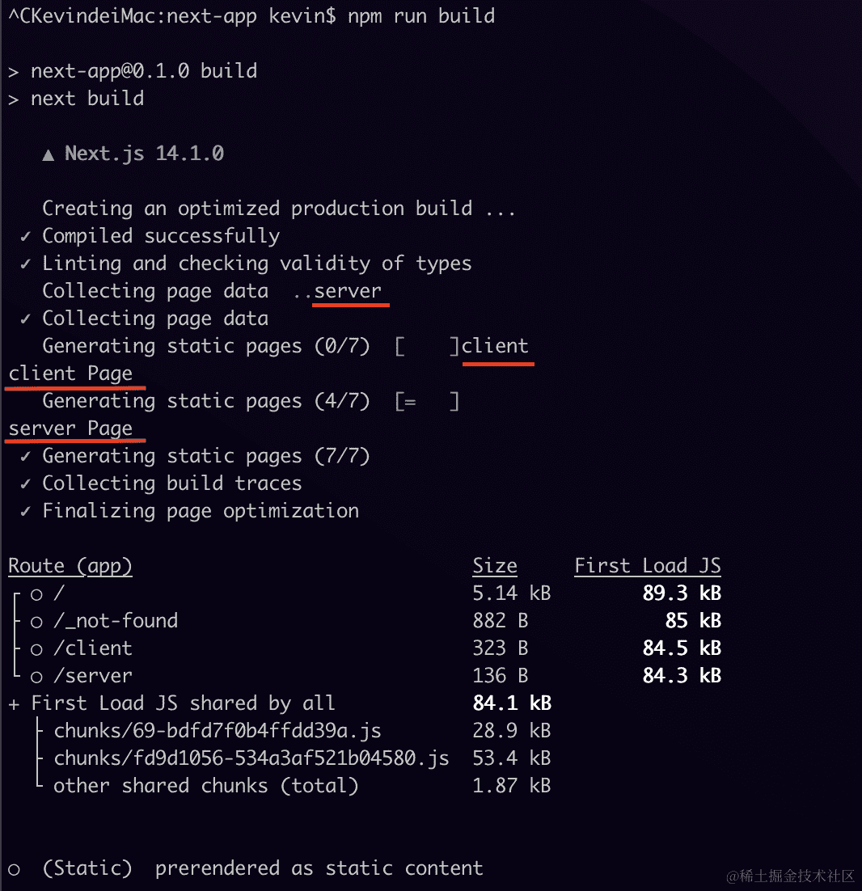

而且根据输出的结果，无论是 `/client`还是 `/server`走的都是静态渲染。

当运行 `npm run start`的时候，又会打印哪些数据呢？

答案是命令行中并不会有输出，访问 `/client`的时候，浏览器会有打印：

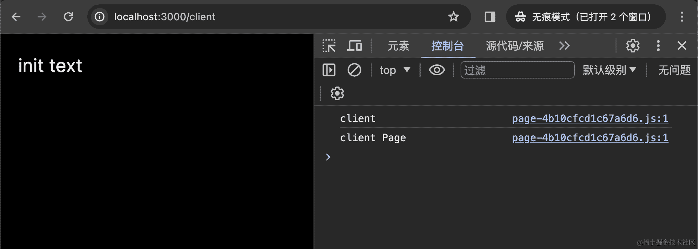

访问 `/server`的时候，浏览器不会有任何打印：

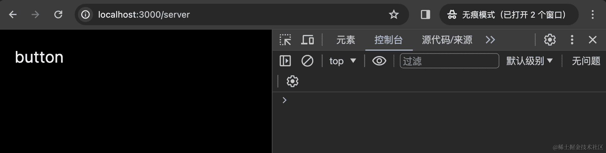

客户端组件在浏览器中打印，这可以理解，毕竟它是客户端组件，当然要在客户端运行。可是客户端组件为什么在编译的时候会运行一次呢？让我们看下 `/client` 的返回：

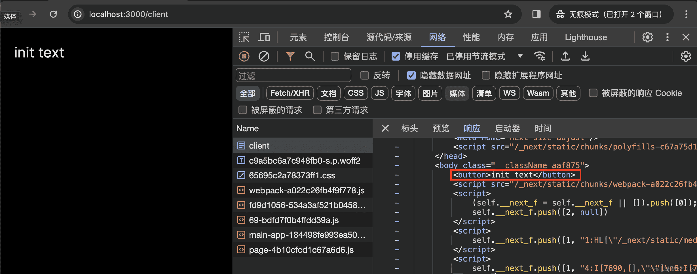

你会发现 `init text`其实是来自于 useState 中的值，但是却依然输出在 HTML 中。这就是编译客户端组件的作用，为了第一次加载的时候能更快的展示出内容。

所以其实所谓服务端组件、客户端组件并不直接对应于物理上的服务器和客户端。服务端组件运行在构建时和服务端，客户端组件运行在构建时、服务端（生成初始 HTML）和客户端（管理 DOM）。


#### 交替使用服务端组件和客户端组件

实际开发的时候，不可能纯用服务端组件或者客户端组件，当交替使用的时候，一定要注意一点，那就是：

**服务端组件可以直接导入客户端组件，但客户端组件并不能导入服务端组件**


#### 组件渲染原理

在服务端：Next.js 使用 React API 编排渲染，渲染工作会根据路由和 Suspense 拆分成多个块（chunks），每个块分两步进行渲染：

1.  React 将服务端组件渲染成一个特殊的数据格式称为 **React Server Component Payload (RSC Payload)**
2.  Next.js 使用 RSC Payload 和客户端组件代码在服务端渲染 HTML

> RSC payload 中包含如下这些信息：
>
> 1.  服务端组件的渲染结果
> 2.  客户端组件占位符和引用文件
> 3.  从服务端组件传给客户端组件的数据

在客户端：

1.  加载渲染的 HTML 快速展示一个非交互界面（Non-interactive UI）
2.  RSC Payload 会被用于协调（reconcile）客户端和服务端组件树，并更新 DOM
3.  JavaScript 代码被用于水合客户端组件，使应用程序具有交互性（Interactive UI）

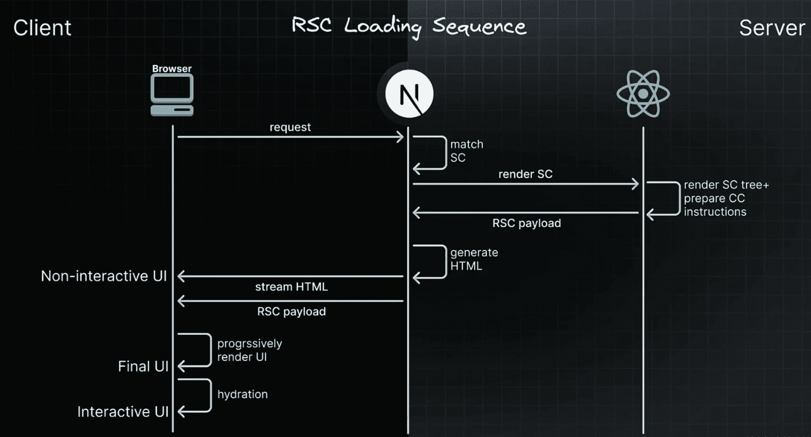

注意：上图描述的是页面初始加载的过程。其中 SC 表示 Server Components 服务端组件，CC 表示 Client Components 客户端组件。

而在后续导航的时候：

1.  客户端组件完全在客户端进行渲染
2.  React 使用 RSC Payload 来协调客户端和服务端组件树，并更新 DOM

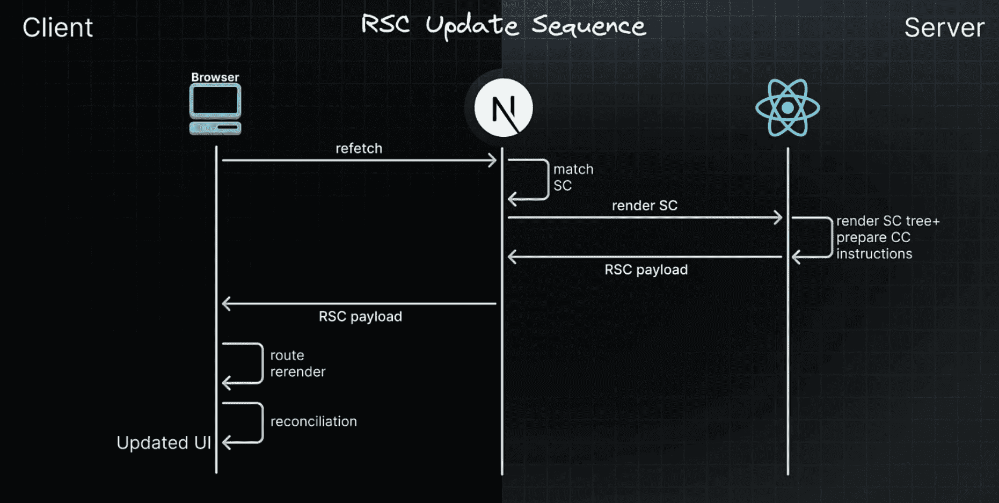


### 最佳实践：使用服务端组件

#### 共享数据

当在服务端获取数据的时候，有可能出现多个组件共用一个数据的情况。

面对这种情况，你不需要使用 React Context（当然服务端也用不了），也不需要通过 props 传递数据，直接在需要的组件中请求数据即可。这是因为 React 拓展了 fetch 的功能，添加了记忆缓存功能，相同的请求和参数，返回的数据会做缓存。

```javascript
async function getItem() {
  const res = await fetch('https://.../item/1')
  return res.json()
}
 
// 函数被调用了两次，但只有第一次才执行
const item = await getItem() // cache MISS
 
// 第二次使用了缓存
const item = await getItem() // cache HIT
```

当然这个缓存也是有一定条件限制的，比如只能在 GET 请求中，具体的限制和原理我们会在缓存篇中具体讲解。


#### 组件只在服务端使用

由于 JavaScript 模块可以在服务器和客户端组件模块之间共享，所以如果你希望一个模块只用于服务端，就比如这段代码：

```javascript
export async function getData() {
  const res = await fetch('https://external-service.com/data', {
    headers: {
      authorization: process.env.API_KEY,
    },
  })
 
  return res.json()
}
```

这个函数使用了 API\_KEY，所以它应该是只用在服务端的。如果用在客户端，为了防止泄露，Next.js 会将私有环境变量替换为空字符串，所以这段代码可以在客户端导入并执行，但并不会如期运行。

为了防止客户端意外使用服务器代码，我们可以借助 `server-only`包，这样在客户端意外使用的时候，会抛出构建错误。

使用 `server-only`，首先安装该包：

```bash
npm install server-only
```

其次将该包导入只用在服务端的组件代码中：

```javascript
import 'server-only'
 
export async function getData() {
  const res = await fetch('https://external-service.com/data', {
    headers: {
      authorization: process.env.API_KEY,
    },
  })
 
  return res.json()
}
```

现在，任何导入 `getData`的客户端组件都会在构建的时候抛出错误，以保证该模块只能在服务端使用。


#### 使用三方包

毕竟 React Server Component 是一个新特性， React 生态里的很多包可能还没有跟上，这样就可能会导致一些问题。

比如你使用了一个导出 `<Carousel />`组件的 `acme-carousel`包。这个组件使用了 useState，但是它并没有 `"use client"` 声明。

当你在客户端组件中使用的时候，然而如果你在服务端组件中使用，它会报错

这是因为 Next.js 并不知道 `<Carousel />`是一个只能用在客户端的组件，毕竟它是三方的，你也无法修改它的代码，为它添加 `"use client"` 声明，Next.js 于是就按照服务端组件进行处理，结果它使用了客户端组件的特性 `useState`，于是便有了报错。

为了解决这个问题，你可以自己包一层，将该三方组件包在自己的客户端组件中，比如：

```javascript
'use client'
 
import { Carousel } from 'acme-carousel'
 
export default Carousel
```

现在，你就可以在服务端组件中使用 `<Carousel />`了：

```javascript
import Carousel from './carousel'
 
export default function Page() {
  return (
    <div>
      <p>View pictures</p>
      <Carousel />
    </div>
  )
}
```

注：有的时候改为使用客户端组件也不能解决问题，如果遇到 document is not defined、window is not defined 这种报错，可以参考 [《Next.js v14 报 document is not defined 这种错怎么办？》](https://juejin.cn/post/7352342892785352755) 解决


### 最佳实践：使用客户端组件

#### 客户端组件尽可能下移

为了尽可能减少客户端 JavaScript 包的大小，尽可能将客户端组件在组件树中下移。

举个例子，当你有一个包含一些静态元素和一个交互式的使用状态的搜索栏的布局，没有必要让整个布局都成为客户端组件，将交互的逻辑部分抽离成一个客户端组件（比如`<SearchBar />`），让布局成为一个服务端组件：

```javascript
// SearchBar 客户端组件
import SearchBar from './searchbar'
// Logo 服务端组件
import Logo from './logo'
 
// Layout 依然作为服务端组件
export default function Layout({ children }) {
  return (
    <>
      <nav>
        <Logo />
        <SearchBar />
      </nav>
      <main>{children}</main>
    </>
  )
}
```


#### 从服务端组件到客户端组件传递的数据需要序列化

当你在服务端组件中获取的数据，需要以 props 的形式向下传给客户端组件，这个数据需要做序列化。

这是因为 React 需要先在服务端将组件树先序列化传给客户端，再在客户端反序列化构建出组件树。如果你传递了不能序列化的数据，这就会导致错误。

如果你不能序列化，那就改为在客户端使用三方包获取数据吧。

:::info 解释

**背景知识**

在使用 React Server Components（通常配合 Next.js 的 `app/` 目录）时：

1. 服务端组件是运行在 Node.js 环境里的。
2. 当服务端渲染组件树时，它会把这棵“树”打包成一个 JSON-like 的数据结构（也就是“**序列化**”），通过网络发给浏览器。
3. 浏览器（客户端）接收这个“组件树快照”后，会用 React 的 JS 引擎重新构建出真实的 DOM（也就是“**反序列化 + hydrate**”）。


**那为什么“不能序列化”会出错？**

React 在这个过程中 **只能序列化特定的数据类型**，比如：

✅ 可以序列化的数据：

- 字符串、数字、布尔值
- 对象（里面的值也要可序列化）
- 数组
- `null`

❌ 不能序列化的常见数据：

- 函数（如回调函数）
- 类的实例（比如 `new Date()`、`Map`、`Set`、`Buffer`、`File`、`BigInt` 等）
- 包含 DOM 节点、引用、复杂对象等
- 数据库连接、文件流等


**举个例子**

```tsx
// ❌ Server Component（app/page.tsx）

import ClientComponent from './ClientComponent';

export default async function Page() {
  const data = new Map(); // Map 不能序列化

  return <ClientComponent data={data} />;
}
```

**错误提示**：`Map` 不能被序列化成 JSON，因此 React 无法将它传递给客户端组件，会报错。


**正确做法：转成可序列化的结构**

```tsx
// ✅ Server Component

import ClientComponent from './ClientComponent';

export default async function Page() {
  const data = new Map([
    ['name', '鲸落'],
    ['age', '28']
  ]);

  const serializableData = Object.fromEntries(data);

  return <ClientComponent data={serializableData} />;
}
```


或者你干脆在客户端组件中自己去 fetch：如果数据很难序列化（比如有函数、Buffer、流等），你就不要在服务端传它了，而是让 **客户端自己调用接口获取数据**。


**总结一句话**：

> 服务端组件的数据要传给客户端组件时，必须是“可以 JSON.stringify 的”。否则就会报错。
>  不能序列化？那就改在客户端组件里自己 fetch 数据吧！

:::


## 服务端渲染策略

### 案例

现在让我们新建一个 `app/server/page.js`，代码如下：

```javascript
export default async function Page() {
  const url = (await (await fetch('https://api.thecatapi.com/v1/images/search')).json())[0].url
  
  return (
    
  )
}
```

其中，<https://api.thecatapi.com/v1/images/search> 是一个返回猫猫图片的接口，每次调用都会返回一张随机的猫猫图片数据。

现在让我们运行 `npm run dev`，开发模式下，每次刷新都会返回一张新的图片

现在让我们运行 `npm run build && npm run start`，然而此时每次刷新都是相同的图片

这是为什么呢？让我们看下构建时的输出结果：

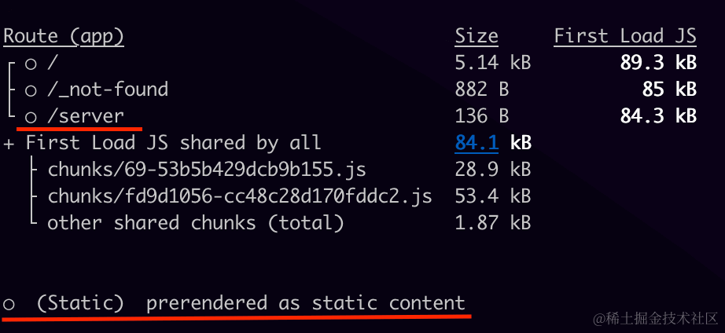

`/server` 被标记为 `Static`，表示被预渲染为静态内容。也就是说，`/server`的返回内容其实在构建的时候就已经决定了。页面返回的图片正是构建时调用猫猫接口返回的那张图片。

那么问题来了，如何让 `/server` 每次都返回新的图片呢？

这就要说到 Next.js 的服务端渲染策略了。


### 服务端渲染策略

Next.js 存在三种不同的服务端渲染策略：

*   静态渲染
*   动态渲染
*   Streaming


#### 静态渲染

**这是默认渲染策略**，**路由在构建时渲染，或者在重新验证后后台渲染**，其结果会被缓存并且可以推送到 CDN。适用于未针对用户个性化且数据已知的情况，比如静态博客文章、产品介绍页面等。

开头中的例子就是构建时渲染。那么如何在重新验证后后台渲染呢？

具体重新验证的方法我们会在[《缓存篇 | Caching》](https://juejin.cn/book/7307859898316881957/section/7309077169735958565#heading-9)中详细介绍。这里为了举例说一种 —— 使用路由段配置项 `revalidate`。

修改 `app/server/page.js`，代码如下：

```javascript
export const revalidate = 10

export default async function Page() {

  const url = (await (await fetch('https://api.thecatapi.com/v1/images/search')).json())[0].url
  
  return (
    
  )
}
```

此时虽然在 `npm run build`的输出中，`/server`依然是标记为静态渲染，但图片已经可以更新了，虽然每隔一段时间才更新。

其中 `revalidate=10`表示设置重新验证频率为 10s，但是要注意：

这句代码的效果并不是设置服务器每 10s 会自动更新一次 `/server`。而是至少 10s 后进行重新验证。

举个例子，假设你现在访问了 `/server`，此时时间设为 0s，10s 内持续访问，`/server` 返回的都是之前缓存的结果。当 10s 过后，假设你第 12s 又访问了一次 `/server`，此时虽然超过了 10s，但依然会返回之前缓存的结果，但同时会触发服务器更新缓存，当你第 13s 再次访问的时候，就是更新后的结果。

简单来说，超过 revalidate 设置时间的首次访问会触发缓存更新，如果更新成功，后续的返回就都是新的内容，直到下一次触发缓存更新。


#### 动态渲染（Dynamic Rendering）

路由在请求时渲染，适用于针对用户个性化或依赖请求中的信息（如 cookie、URL 参数）的情况。

在渲染过程中，**如果使用了动态函数（Dynamic functions）或者未缓存的数据请求（uncached data request），Next.js 就会切换为动态渲染**：

| 动态函数 | 数据缓存 | 渲染策略 |
| -------- | -------- | -------- |
| 否       | 缓存     | 静态渲染 |
| 是       | 缓存     | 动态渲染 |
| 否       | 未缓存   | 动态渲染 |
| 是       | 未缓存   | 动态渲染 |

注意：作为开发者，无须选择静态还是动态渲染，Next.js 会自动根据使用的功能和 API 为每个路由选择最佳的渲染策略


**使用动态函数（Dynamic functions）**

**动态函数指的是获取只有在请求时才能得到信息（如 cookie、请求头、URL 参数）的函数**。

在 Next.js 中这些动态函数是：

*   [cookies()](https://juejin.cn/book/7307859898316881957/section/7309079651500949530#heading-7) 和 [headers()](https://juejin.cn/book/7307859898316881957/section/7309079651500949530#heading-20) ：获取 cookie 和 header
*   `searchParams`：页面查询参数

使用这些函数的任意一个，都会导致路由转为动态渲染。

第一个例子，修改 `app/server/page.js`，代码如下：

```javascript
import { cookies } from 'next/headers'

export default async function Page() {

  const cookieStore = cookies()
  const theme = cookieStore.get('theme')

  const url = (await (await fetch('https://api.thecatapi.com/v1/images/search')).json())[0].url
  
  return (
    
  )
}
```

运行 `npm run build && npm run start`，此时 `/server`显示为动态渲染：

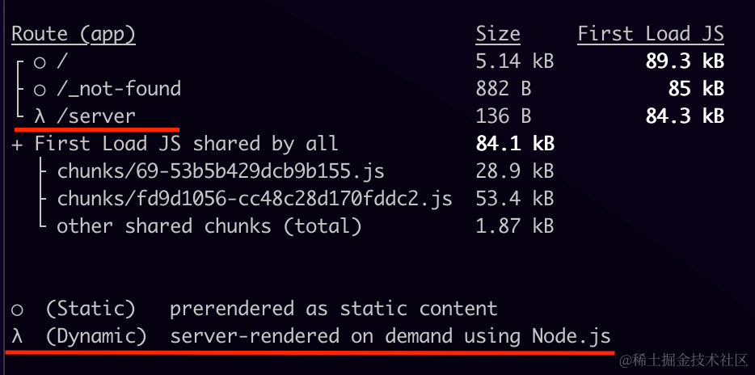

第二个例子，使用 searchParams，修改 `app/server/page.js`，代码如下：

```javascript
export default async function Page({ searchParams }) {
  const url = (await (await fetch('https://api.thecatapi.com/v1/images/search')).json())[0].url
  return (
    <>
      
      {new Date().toLocaleTimeString()}
      {JSON.stringify(searchParams)}
    </>
  )
}
```

运行 `npm run build && npm run start`，此时 `/server`显示为动态渲染：


但是图片却没有在页面刷新的时候改变（此时又是一只 emo 的猫猫）

页面确实是动态渲染，因为每次刷新时间都发生了改变。但为什么图片没有更新呢？

这是因为**动态渲染和数据请求缓存是两件事情，页面动态渲染并不代表页面涉及的请求一定不被缓存**。正是因为 fetch 接口的返回数据被缓存了，这才导致了图片每次都是这一张。

修改 `app/server/page.js`，代码如下：

```javascript
export default async function Page({ searchParams }) {
  const url = (await (await fetch('https://api.thecatapi.com/v1/images/search', { cache: 'no-store' })).json())[0].url
  return (
    <>
      
      {new Date().toLocaleTimeString()}
      {JSON.stringify(searchParams)}
    </>
  )
}
```

我们为 fetch 请求添加了 `{ cache: 'no-store' }`，使 fetch 请求退出了缓存。此时运行生产版本，图片和时间在刷新的时候都会改变

注：同样是转为动态渲染，为什么使用 cookies 的时候，fetch 请求没有被缓存呢？这就是接下来要讲的内容。

当你在 `headers` 或 `cookies` 方法之后使用 fetch 请求会导致请求退出缓存，这是 Next.js 的自动逻辑，但还有哪些情况导致 fetch 请求自动退出缓存呢？让我们往下看。


**使用未缓存的数据请求（uncached data request）**

在 Next.js 中，fetch 请求的结果默认会被缓存，但你可以设置退出缓存，一旦你设置了退出缓存，就意味着使用了未缓存的数据请求（uncached data request），会导致路由进入动态渲染，如：

*   `fetch` 请求添加了 `cache: 'no-store'`选项
*   `fetch` 请求添加了 `revalidate: 0`选项
*   `fetch` 请求在路由处理程序中并使用了 `POST` 方法
*   在`headers` 或 `cookies` 方法之后使用 `fetch`请求
*   配置了路由段选项 `const dynamic = 'force-dynamic'`
*   配置了路由段选项`fetchCache` ，默认会跳过缓存
*   `fetch` 请求使用了 `Authorization`或者 `Cookie`请求头，并且在组件树中其上方还有一个未缓存的请求

注：关于数据请求，具体我们还会在[《数据获取篇 | 数据获取、缓存与重新验证》](https://juejin.cn/book/7307859898316881957/section/7309076949182709811)中详细介绍。

举个例子，修改 `app/server/page.js`，代码如下：

```javascript
export default async function Page() {
  const url = (await (await fetch('https://api.thecatapi.com/v1/images/search', { cache: 'no-store' })).json())[0].url
  return (
    <>
      
      {new Date().toLocaleTimeString()}
    </>
  )
}
```

此时页面会转为动态渲染，每次刷新页面都会出现新的图片。

关于动态渲染再重申一遍：数据缓存和渲染策略是分开的。假如你选择了动态渲染，Next.js 会在请求的时候再渲染 RSC Payload 和 HTML，但其中涉及的数据请求，依然是可以从缓存中获取的。


#### Streaming

使用 `loading.js` 或者 React Suspense 组件会开启 Streaming。


### 其他术语防混淆

除了静态渲染、动态渲染、动态函数、未缓存数据请求等术语，阅读官方文档的时候，你还可能遇到局部渲染、动态路由等这些与“渲染”、“动态”、“静态”有关的词，所以我们在这里列出来帮助大家区分。


#### 局部渲染（Partial rendering）

局部渲染指的是仅在客户端重新渲染导航时更改的路由段，共享段的内容的继续保留。举个例子，当在两个相邻的路由间导航的时候, `/dashboard/settings` 和 `/dashboard/analytics`，`settings` 和 `analytics` 页面会重新渲染，共享的 `dashboard` 布局会保留。

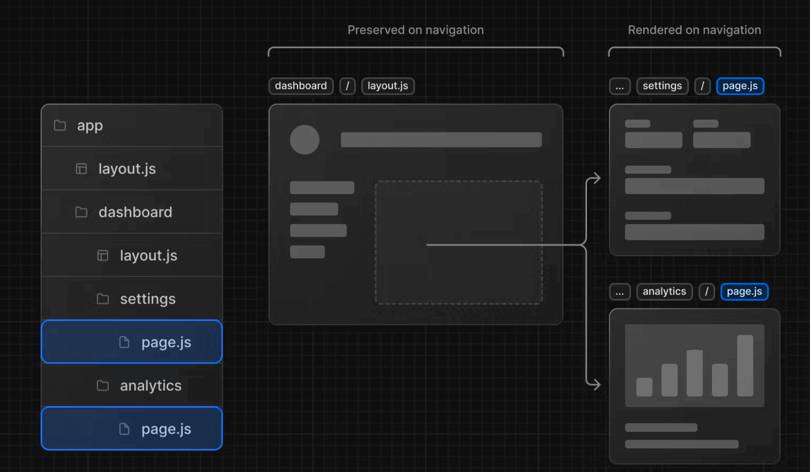

局部渲染的目的也是为了减少路由切换时的传输数据量和执行时间，从而提高性能。


#### 动态路由（Dynamic Routes）

动态路由我们在之前之前介绍过


#### 动态段（Dynamic Segment）

路由中的动态段，举个例子，`app/blog/[slug]/page.js`中 `[slug]`就是动态段。


