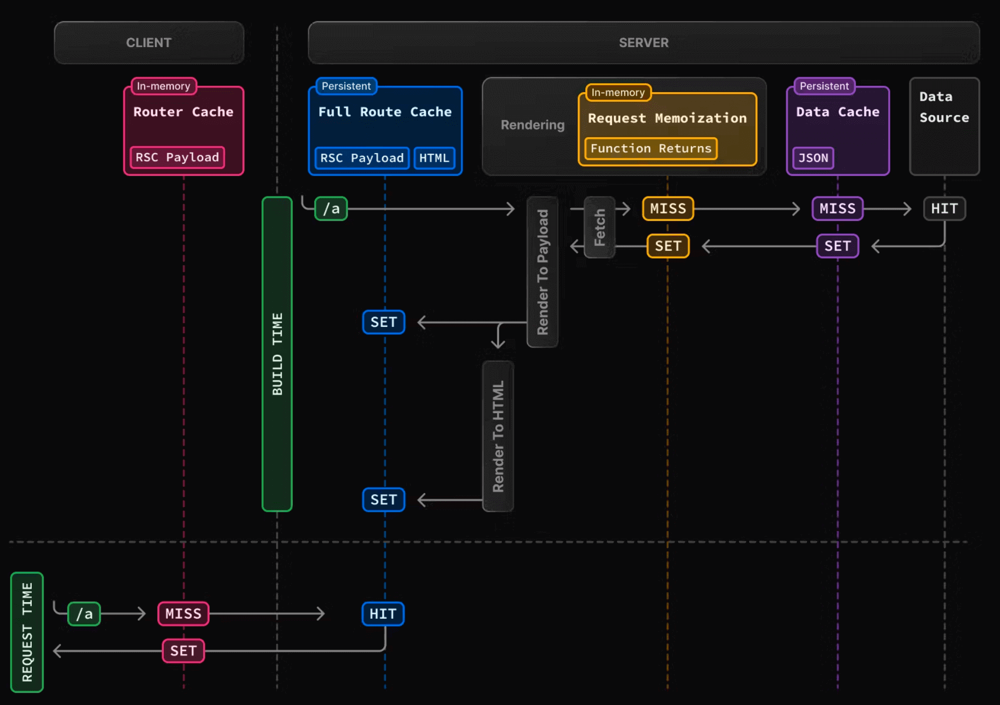

## 前言

本章我们将介绍 Next.js 的缓存机制。

Next.js 的缓存功能非常强大，以至于让人又爱又恨。一方面，缓存的重要性不言而喻，可以优化应用性能和降低开销。另一方面，写 Next.js 项目的时候常会遇到数据没有更新的问题，多半都是缓存搞得鬼……

理论上，缓存不是使用 Next.js 的必要知识。因为 Next.js 会自动根据你使用的 API 做好缓存管理。但实际上，你还是要认真学习下缓存，至少要清楚知道 Next.js 的缓存机制有哪些，大致的工作原理，以及如何退出缓存，否则遇到缓存问题的时候你甚至不知道如何解决……

现在就让我们认真学习下缓存吧。


## 概览

Next.js 中有四种缓存机制：

| 机制                             | 缓存内容            | 存储地方 | 目的                      | 期间               |
| -------------------------------- | ------------------- | -------- | ------------------------- | ------------------ |
| 请求记忆（Request Memoization）  | 函数返回值          | 服务端   | 在 React 组件树中复用数据 | 每个请求的生命周期 |
| 数据缓存（Data Cache ）          | 数据                | 服务端   | 跨用户请求和部署复用数据  | 持久（可重新验证） |
| 完整路由缓存（Full Route Cache） | HTML 和 RSC payload | 服务端   | 降低渲染成本、提高性能    | 持久（可重新验证） |
| 路由缓存（Router Cache）         | RSC payload         | 客户端   | 减少导航时的服务端请求    | 用户会话或基于时间 |

默认情况下，Next.js 会尽可能多的使用缓存以提高性能和降低成本。像路由默认会采用静态渲染，数据请求的结果默认会被缓存。下图是构建时静态路由渲染以及首次访问静态路由的原理图：



在这张图中：

打包构建 `/a`时（BUILD TIME），因为路由中的请求是首次，所以都会 `MISS`，从数据源获取数据后，将数据在**请求记忆**和**数据缓存**中都保存了一份（`SET`），并将生成的 RSC Payload 和 HTML 也在服务端保存了一份（**完整路由缓存**）。

当客户端访问 `/a` 的时候，命中服务端缓存的 RSC Payload 和 HTML，并将 RSC Payload 在客户端保存一份（**路由缓存**）。

缓存行为是会发生变化的，具体取决的因素有很多，比如路由是动态渲染还是静态渲染，数据是缓存还是未缓存，请求是在初始化访问中还是后续导航中。

是不是有点懵？没有关系，随着内容的展开，我们会有更加深入的了解。


## 请求记忆（Request Memoization）

### 工作原理

React 拓展了 [fetch API](https://nextjs.org/docs/app/building-your-application/caching#fetch)，当有相同的 URL 和参数的时候，React 会自动将请求结果缓存。也就是说，即时你在组件树中的多个位置请求一份相同的数据，但数据获取只会执行一次。

这样当你跨路由（比如跨布局、页面、组件）时，你不需要在顶层请求数据，然后将返回结果通过 props 转发，直接在需要数据的组件中请求数据即可，不用担心对同一数据发出多次请求造成的性能影响。

它背后的原理想必大家也想到了，就是[函数记忆](https://juejin.cn/post/6844903494256705543)，《JavaScript 权威指南》中就有类似的函数：

```javascript
function memoize(f) {
    var cache = {};
    return function(){
        var key = arguments.length + Array.prototype.join.call(arguments, ",");
        if (key in cache) {
            return cache[key]
        }
        else return cache[key] = f.apply(this, arguments)
    }
}
```

关于请求记忆，要注意：

*   请求记忆是 React 的特性，并非 Next.js 的特性。 React 和 Next.js 都做了请求缓存，React 的方案叫做“请求记忆”，Next.js 的方案叫做“数据缓存”，两者有很多不同
*   请求记忆只适合用于用 `GET` 方法的 `fetch` 请求
*   请求记忆只应用于 React 组件树，也就是说你在 `generateMetadata`、`generateStaticParams`、布局、页面和其他服务端组件中使用 fetch 会触发请求记忆，但是在路由处理程序中使用则不会触发，因为这就不在 React 组件树中了


### 持续时间

缓存会持续在服务端请求的生命周期中，直到 React 组件树渲染完毕。它的存在是为了避免组件树渲染的时候多次请求同一数据造成的性能影响。


### 重新验证

由于请求记忆只会在渲染期间使用，因此也无须重新验证。


### 退出方式

这个行为是 React 的默认优化。不建议退出。

如果你不希望 fetch 请求被记忆，可以借助 [AbortController](https://developer.mozilla.org/zh-CN/docs/Web/API/AbortController) 这个 Web API，具体使用方式如下（虽然这个 API 本来的作用是用来中止请求）：

```javascript
const { signal } = new AbortController()
fetch(url, { signal })
```


### React Cache

如果你不能使用 fetch 请求，但是又想实现记忆，可以借助 React 的 cache 函数：

```javascript
// utils/get-item.ts
import { cache } from 'react'
import db from '@/lib/db'
 
export const getItem = cache(async (id: string) => {
  const item = await db.item.findUnique({ id })
  return item
})
```

注：为了让大家更好的理解**请求记忆**和**数据缓存**，实战例子我们会放到本篇最后。


## 数据缓存（Data Cache）

### 工作原理

Next.js 有自己的数据缓存方案，可以跨服务端请求和构建部署存储数据。之所以能够实现，是因为 Next.js 拓展了 fetch API，在 Next.js 中，每个请求都可以设置自己的缓存方式。

不过与 React 的请求记忆不同的是，请求记忆因为只用于组件树渲染的时候，所以不用考虑数据缓存更新的情况，但 Next.js 的数据缓存方案更为持久，则需要考虑这个问题。

默认情况下，使用 `fetch` 的数据请求都会被缓存，这个缓存是持久的，它不会自动被重置。你可以使用 `fetch` 的 `cache` 和 `next.revalidate` 选项来配置缓存行为：

```javascript
fetch(`https://...`, { cache: 'force-cache' | 'no-store' })
```

```javascript
fetch(`https://...`, { next: { revalidate: 3600 } })
```


### 持续时间

数据缓存在传入请求和部署中都保持不变，除非重新验证或者选择退出。


### 重新验证

Next.js 提供了两种方式更新缓存：

一种是**基于时间的重新验证（Time-based revalidation）**，即经过一定时间并有新请求产生后重新验证数据，适用于不经常更改且新鲜度不那么重要的数据。

一种是**按需重新验证（On-demand revalidation）**，根据事件手动重新验证数据。按需重新验证又可以使用基于标签（tag-based）和基于路径（path-based）两种方法重新验证数据。适用于需要尽快展示最新数据的场景。


### 退出方式

如果你想要退出数据缓存，有两种方式：

一种是将 `fetch` 的 `cache` 选项设置为 `no-store`，示例如下，每次调用的时候都会重新获取数据：

```javascript
fetch(`https://...`, { cache: 'no-store' })
```

一种是使用[路由段配置项](https://juejin.cn/book/7307859898316881957/section/7309079033223446554)，它会影响该路由段中的所有数据请求：

```javascript
export const dynamic = 'force-dynamic'
```


## 路由缓存（Router Cache）

### 工作原理

当你访问一个路由时，Next.js 会将该路由生成的页面（含 HTML + 数据）缓存在内存中，下次访问时可以直接复用，提高响应速度。


**特点**：

- **缓存的是页面 HTML + 数据（不是整个浏览器页面）**
- **按路径缓存**，例如 `/blog/1`、`/blog/2` 分别缓存
- **首次访问 SSR，之后访问走缓存**
- **适用于静态和动态路径**
- 会根据路由参数的不同分别缓存不同版本


### 持续时间

路由缓存存放在浏览器的临时缓存中，有两个因素决定了路由缓存的持续时间：

*   Session，缓存在导航时持续存在，当页面刷新的时候会被清除
*   自动失效期：单个路由段会在特定时长后自动失效
    * **如果路由是静态渲染，持续 5 分钟**
    * **如果路由是动态渲染，持续 30s**

比如上面的 demo 中如果等 5 分钟后再去点击，就会重新获取新的 RSC Payload

通过添加 `prefetch={true}`（Link 组件的 prefetch 默认就为 true）或者在动态渲染路由中调用 `router.prefetch`，可以进入缓存 5 分钟。


### 失效方式

**有两种方法可以让路由缓存失效：**

*   在 Server Action 中
    *   通过 `revalidatePath` 或 `revalidateTag` 重新验证数据 
    *   使用  `cookies.set` 或者 `cookies.delete` 会使路由缓存失效，这是为了防止使用 cookie 的路由过时（如身份验证）
*   调用 `router.refresh` 会使路由缓存失效并发起一个重新获取当前路由的请求


### 退出方式

**无法退出路由缓存**。你可以通过给 `<Link>` 组件的 `prefetch` 传递 `false` 来退出预获取，但依然会临时存储路由段 30s，这是为了实现嵌套路由段之间的即时导航。此外访问过的路由也会被缓存。


## 完整路由缓存（Full Route Cache）

### 工作原理

这是“路由缓存”的升级版本，除了缓存 HTML + 数据，还会缓存 **整棵组件树的状态和交互副作用**。


**特点**：

- 缓存的是 **整个路由状态**（包括客户端状态）
- 在返回时（例如点击“返回”按钮），可以**瞬间还原到离开前的状态**
- 类似于浏览器原生的“历史栈”能力，但更可靠
- 默认开启，不需要配置
- **仅适用于 App Router**
- 完整路由缓存只适用于静态页面


举个例子：

用户打开 `/products`，滚动到页面中间，点击某个商品进入 `/products/123`，然后点击“返回”按钮：

- 如果是“完整路由缓存”，你会瞬间看到 `/products` 页面处于上次滚动的位置，数据和 UI 都无需重新加载。
- 如果只是普通“路由缓存”，页面会重新渲染，滚动也可能需要恢复。


### 持续时间

完整路由缓存默认是持久的，这意味着可以跨用户请求复用。


### 失效方式

有两种方式可以使完整路由缓存失效：

*   重新验证数据：重新验证数据缓存会使完整路由缓存失效，毕竟渲染输出依赖于数据
*   重新部署：数据缓存是可以跨部署的，但完整路由缓存会在重新部署中被清除


### 退出方式

退出完整路由缓存的方式就是将其改为动态渲染：

*   使用动态函数：使用动态函数后会改为动态渲染，此时数据缓存依然可以用
*   使用路由段配置项：`dynamic = 'force-dynamic'`或 `revalidate = 0` 这会跳过完整路由缓存和数据缓存，也就是说，每次请求时都会重新获取数据并渲染组件。此时路由缓存依然可以用，毕竟它是客户端缓存
*   退出数据缓存：如果路由中有一个 fetch 请求退出了缓存，则会退出完整路由缓存。这个特定的 fetch 请求会在每次请求时重新获取，其他 fetch 请求依然会使用数据缓存。Next.js 允许这种缓存和未缓存数据的混合

简单来说，完整路由缓存只适用于静态渲染，在服务端保留静态渲染的产物 RSC Payload 和 HTML。

使用动态渲染则会退出完整路由缓存。如何让路由从静态渲染转为动态渲染，也可以参考 [《渲染篇 | 服务端渲染策略》](https://juejin.cn/book/7307859898316881957/section/7342031804771565619#heading-2)。


## Next.js 各类 API 与四种缓存的关系表

Next.js 会根据你使用的 API 自动决定是否启用缓存、触发重新验证或退出缓存。以下是常用 API 对应的缓存行为：

| API                                                          | 路由缓存（Route Cache）    | 完整路由缓存（Full Route Cache） | 数据缓存（Data Cache）   | 请求记忆（Request Memoization） |
| ------------------------------------------------------------ | -------------------------- | -------------------------------- | ------------------------ | ------------------------------- |
| [`<Link prefetch>`](https://nextjs.org/docs/app/building-your-application/caching#link) | ✅ Cache                    |                                  |                          |                                 |
| [`router.prefetch`](https://nextjs.org/docs/app/building-your-application/caching#routerprefetch) | ✅ Cache                    |                                  |                          |                                 |
| [`router.refresh`](https://nextjs.org/docs/app/building-your-application/caching#routerrefresh) | 🔄 Revalidate               |                                  | 🔄 Revalidate             |                                 |
| [`fetch`](https://nextjs.org/docs/app/building-your-application/caching#fetch) |                            |                                  | ✅ Cache                  | ✅ Cache（默认记忆）             |
| [`fetch` `options.cache`](https://nextjs.org/docs/app/building-your-application/caching#fetch-optionscache) |                            |                                  | ✅ Cache / ❌ Opt out      |                                 |
| [`fetch` `options.next.revalidate`](https://nextjs.org/docs/app/building-your-application/caching#fetch-optionsnextrevalidate) |                            | 🔄 Revalidate                     | 🔄 Revalidate             |                                 |
| [`fetch` `options.next.tags`](https://nextjs.org/docs/app/building-your-application/caching#fetch-optionsnexttags-and-revalidatetag) |                            | ✅ Cache                          | ✅ Cache                  |                                 |
| [`revalidateTag`](https://nextjs.org/docs/app/building-your-application/caching#fetch-optionsnexttags-and-revalidatetag) | 🔄 Revalidate（服务端动作） | 🔄 Revalidate                     | 🔄 Revalidate             |                                 |
| [`revalidatePath`](https://nextjs.org/docs/app/building-your-application/caching#revalidatepath) | 🔄 Revalidate（服务端动作） | 🔄 Revalidate                     | 🔄 Revalidate             |                                 |
| [`const revalidate`](https://nextjs.org/docs/app/building-your-application/caching#segment-config-options) |                            | 🔄 Revalidate / ❌ Opt out         | 🔄 Revalidate / ❌ Opt out |                                 |
| [`const dynamic`](https://nextjs.org/docs/app/building-your-application/caching#segment-config-options) |                            | ✅ Cache / ❌ Opt out              | ✅ Cache / ❌ Opt out      |                                 |
| [`cookies()`](https://nextjs.org/docs/app/building-your-application/caching#cookies) | 🔄 Revalidate（服务端动作） | ❌ Opt out                        |                          |                                 |
| [`headers()`, `searchParams`](https://nextjs.org/docs/app/building-your-application/caching#dynamic-functions) |                            | ❌ Opt out                        |                          |                                 |
| [`generateStaticParams`](https://nextjs.org/docs/app/building-your-application/caching#generatestaticparams) |                            | ✅ Cache                          |                          |                                 |
| [`React.cache`](https://nextjs.org/docs/app/building-your-application/caching#react-cache-function) |                            |                                  |                          | ✅ Cache（记忆函数结果）         |

> 注：✅ Cache 表示启用缓存；🔄 Revalidate 表示触发重新验证（缓存依然存在但被刷新）；❌ Opt out 表示彻底退出缓存。


**使用建议**

在开发中遇到缓存相关问题时，可以按照以下思路定位问题：

1. **查看你使用了哪些 API**：比如 `fetch`、`router.refresh`、`cookies()` 等；
2. **对应表格查找缓存行为**：看这些 API 是触发了缓存、重新验证，还是完全跳过了缓存；
3. **根据页面是否需要“缓存”决定策略**：
   - **强一致性页面**：使用 `dynamic = 'force-dynamic'` 或 `cache: 'no-store'` 禁用缓存；
   - **需要响应式更新页面**：配合 `revalidateTag()`、`revalidatePath()` 进行刷新；
   - **普通展示页面**：使用默认缓存机制提升性能即可。


## 总结

比较一下请求记忆和数据缓存：

请求记忆是 React 的数据缓存方案，它只持续在组件树渲染期间，目的是为了避免组件树渲染的时候多次请求同一数据造成的性能影响。

数据缓存是 Next.js 的数据缓存方案，它可以跨部署和请求缓存，缓存数据不会失效，除非重新验证或者主动退出。目的在于优化应用性能。


路由缓存和完整路由缓存的区别：

1.  路由缓存发生在用户访问期间，将 RSC Payload 暂时存储在浏览器，导航期间都会持续存在，页面刷新的时候会被清除。而完整路由缓存则会持久的将 RSC Payload 和 HTML 缓存在服务器上
2.  完整路由缓存仅缓存静态渲染的路由，路由缓存可以应用于静态和动态渲染的路由


