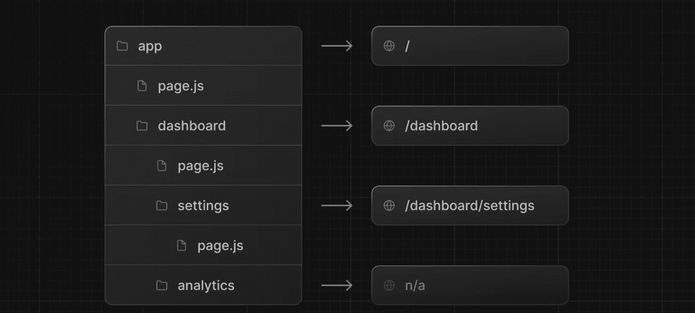
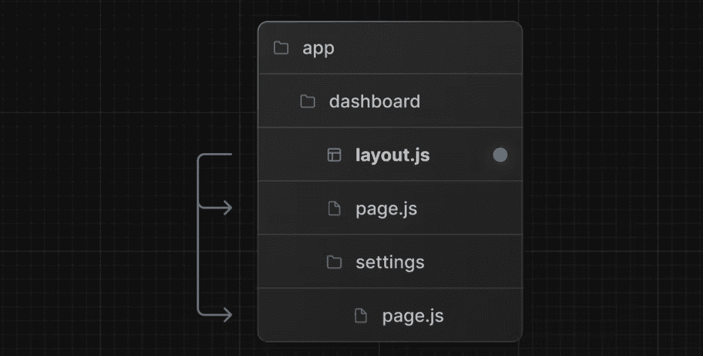
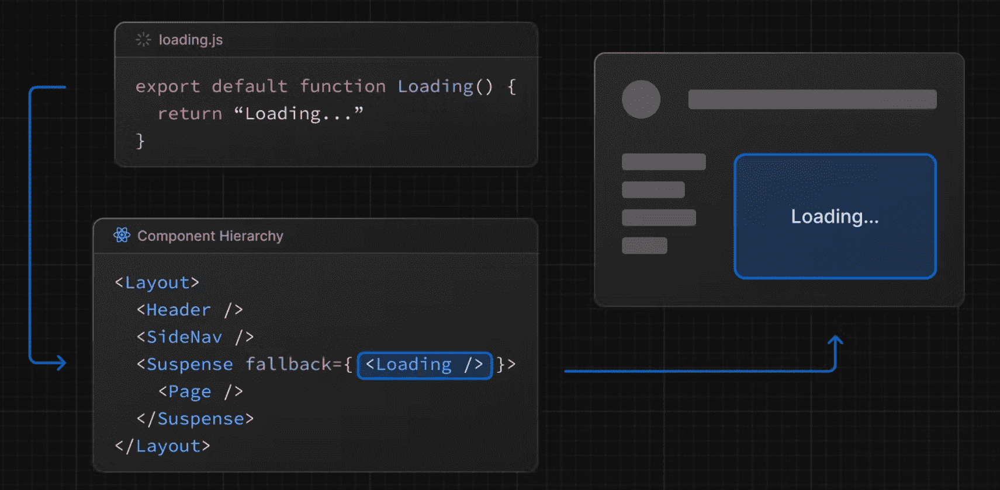
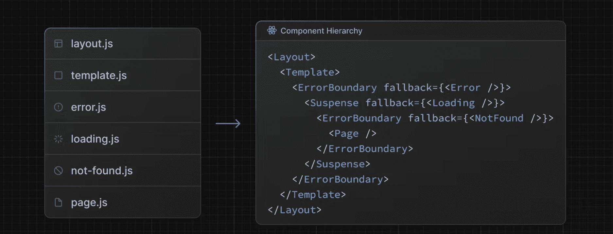

## 初识Nextjs

创建项目：`npx create-next-app@latest`

接下来会有一系列的操作提示，比如设置项目名称、是否使用 TypeScript、是否开启 ESLint、是否使用 Tailwind CSS 等，根据自己的实际情况进行选择即可


## App Router

路由（Router）是 Next.js 应用的重要组成部分。在 Next.js 中，路由决定了一个页面如何渲染或者一个请求该如何返回。

Next.js 有两套路由解决方案，之前的方案称之为“Pages Router”，目前的方案称之为“App Router”，两套方案目前是兼容的，都可以在 Next.js 中使用。

从 v13.4 起，App Router 已成为默认的路由方案，新的 Next.js 项目建议使用 App Router。


### 文件系统（file-system）

Next.js 的路由基于的是文件系统，也就是说，一个文件就可以是一个路由。举个例子，在 `pages` 目录下创建一个 `index.js` 文件，它会直接映射到 `/` 路由地址

在 `pages` 目录下创建一个 `about.js` 文件，它会直接映射到 `/about` 路由地址


### 从 Pages Router 到 App Router

Next.js 从 v13 起就使用了新的路由模式 —— App Router。之前的路由模式我们称之为“Pages Router”，为保持渐进式更新，依然存在。从 v13.4 起，App Router 正式进入稳定化阶段，App Router 功能更强、性能更好、代码组织更灵活

可是这俩到底有啥区别呢？Next.js 又为什么升级到 App Router 呢？知其然知其所以然，让我们简单追溯一下。以前我们声明一个路由，只用在 `pages` 目录下创建一个文件就可以了，以前的目录结构类似于：

```javascript
└── pages
    ├── index.js
    ├── about.js
    └── more.js
```

这种方式有一个弊端，那就是 `pages` 目录的所有 js 文件都会被当成路由文件，这就导致比如组件不能写在 `pages` 目录下，这就不符合开发者的使用习惯。（当然 Pages Router 还有很多其他的问题，只不过目前我们介绍的内容还太少，为了不增加大家的理解成本，就不多说了）

升级为新的 App Router 后，现在的目录结构类似于：

```javascript
src/
└── app
    ├── page.js 
    ├── layout.js
    ├── template.js
    ├── loading.js
    ├── error.js
    └── not-found.js
    ├── about
    │   └── page.js
    └── more
        └── page.js
```

使用新的模式后，你会发现 `app` 下多了很多文件。这些文件的名字并不是乱起的，而是 Next.js 约定的一些特殊文件。从这些文件的名称中你也可以了解文件实现的功能，比如布局（layout.js）、模板（template.js）、加载状态（loading.js）、错误处理（error.js）、404（not-found.js）等。

简单的来说，App Router 制定了更加完善的规范，使代码更好被组织和管理。至于这些文件具体的功能和介绍，不要着急，本篇我们会慢慢展开。


### 使用 Pages Router

暂不介绍学习


### 使用 App Router

#### 定义路由（Routes）

先是定义路由，文件夹被用来定义路由。每个文件夹都代表一个对应到 URL 片段的路由片段。创建嵌套的路由，只需要创建嵌套的文件夹。举个例子，文件夹目录 `app/dashboard/settings`目录对应的路由地址就是 `/dashboard/settings`


#### 定义页面（Pages）

如何保证这个路由可以被访问呢？你需要创建一个特殊的名为 `page.js` 的文件。至于为什么叫 `page.js`呢？除了 `page` 有“页面”这个含义之外，你可以理解为这是一种约定或者规范。



在上图这个例子中：

* `app/page.js` 对应路由 `/`
* `app/dashboard/page.js` 对应路由 `/dashboard`
* `app/dashboard/settings/page.js` 对应路由`/dashboard/settings`
* `analytics` 目录下因为没有 `page.js` 文件，所以没有对应的路由。这个文件可以被用于存放组件、样式表、图片或者其他文件。

> 当你想将这个文件夹目录变成一个路由的时候，这个文件夹下需要有一个 page.[js/ts/tsx] 文件

**当然不止 `.js`文件，Next.js 默认是支持 React、TypeScript 的，所以 `.js`、`.jsx`、`.tsx` 都是可以的。**

那 `page.js` 的代码该如何写呢？最常见的是展示 UI，比如：

```javascript
// app/page.js
export default function Page() {
  return <h1>Hello, Next.js!</h1>
}
```


#### 定义布局（Layouts）

布局是指多个页面共享的 UI。在导航的时候，布局会保留状态、保持可交互性并且不会重新渲染，比如用来实现后台管理系统的侧边导航栏。

定义一个布局，你需要新建一个名为 `layout.js`的文件，该文件默认导出一个 React 组件，该组件应接收一个 `children` prop，`chidren` 表示子布局（如果有的话）或者子页面。

举个例子，我们新建目录和文件如下图所示：



相关代码如下：

```javascript
// app/dashboard/layout.tsx
export default function DashboardLayout({
  children,
}: Readonly<{
  children: React.ReactNode;
}>) {
  return (
    <section>
      <nav>nav</nav>
      {children}
    </section>
  )
}
```

```javascript
// app/dashboard/page.tsx
import { memo } from 'react'

export default memo(() => {
  return (
    <div>dashboard</div>
  )
})
```

当访问 `/dashboard`的时候可以看到效果：

```
nav
dashboard
```

其中，`nav` 来自于 `app/dashboard/layout.tsx`，`dashboard` 来自于 `app/dashboard/page.tsx`

**你可以发现：同一文件夹下如果有 layout.js 和 page.js，page 会作为 children 参数传入 layout。换句话说，layout 会包裹同层级的 page。**

当访问 `/dashboard/settings`的时候，效果如下：

```
nav
setting
```

其中，`nav` 来自于 `app/dashboard/layout.tsx`，`setting` 来自于 `app/dashboard/settings/page.tsx`

**你可以发现：布局是支持嵌套的**，`app/dashboard/settings/page.tsx` 会使用 `app/layout.tsx` 和 `app/dashboard/layout.tsx` 两个布局中的内容，不过因为我们没有在 `app/layout.js` 写入可以展示的内容，所以图中没有体现出来。

如果我们在`app/layout.tsx`中加上一个div写上`这是next`，那么访问`http://localhost:3000/dashboard/settings`看到的效果：

```
这是next
nav
setting
```


**根布局（Root Layout）**

布局支持嵌套，最顶层的布局我们称之为根布局（Root Layout），也就是 `app/layout.js`。它会应用于所有的路由。除此之外，这个布局还有点特殊。

其中

1.  `app` 目录必须包含根布局，也就是 `app/layout.js` 这个文件是必需的。
2.  根布局必须包含 `html` 和 `body`标签，其他布局不能包含这些标签。如果你要更改这些标签，不推荐直接修改，参考[《Metadata 篇》](https://juejin.cn/book/7307859898316881957/section/7309079119902277669)。
3.  你可以使用**路由组**创建多个根布局。
4.  默认根布局是**服务端组件**，且不能设置为客户端组件。


#### 定义模板（Templates）

模板类似于布局，它也会传入每个子布局或者页面。但不会像布局那样维持状态。

模板在路由切换时会为每一个 children  创建一个实例。这就意味着当用户在共享一个模板的路由间跳转的时候，将会重新挂载组件实例，重新创建 DOM 元素，不保留状态。

定义一个模板，你需要新建一个名为 `template.tsx` 的文件，该文件默认导出一个 React 组件，该组件接收一个 `children` prop。我们写个示例代码。

在 `app`目录下新建一个 `template.tsx`文件：

```tsx
export default function Template({ children }: { children: React.ReactNode }) {
  return (
    <>
        <div>app下的template</div>
        <div>{children}</div>
    </>
  )
}
```

你会发现，这用法跟布局一模一样。它们最大的区别就是状态的保持。如果同一目录下既有 `template.js` 也有 `layout.js`，最后的输出效果如下：

```tsx
<Layout>
  {/* 模板需要给一个唯一的 key */}
  <Template key={routeParam}>{children}</Template>
</Layout>
```

也就是说 `layout` 会包裹 `template`，`template` 又会包裹 `page`。

某些情况下，模板会比布局更适合：

* 依赖于 useEffect 和 useState 的功能，比如记录页面访问数（维持状态就不会在路由切换时记录访问数了）、用户反馈表单（每次重新填写）等

* 更改框架的默认行为，举个例子，布局内的 Suspense 只会在布局加载的时候展示一次 fallback UI，当切换页面的时候不会展示。但是使用模板，fallback 会在每次路由切换的时候展示

注：关于模板的适用场景，可以参考[《Next.js v14 的模板（template.js）到底有啥用？》](https://juejin.cn/post/7343569488744300553)，对这两种情况都做了举例说明


#### 定义加载界面（Loading UI）

现在我们已经了解了 `page.tsx`、`layout.tsx`、`template.tsx`的功能，然而特殊文件还不止这些。App Router 提供了用于展示加载界面的 `loading.tsx`

这个功能的实现借助了 React 的`Suspense` API。它实现的效果就是当发生路由变化的时候，立刻展示 fallback UI，等加载完成后，展示数据。

```tsx
// 在 ProfilePage 组件处于加载阶段时显示 Spinner
<Suspense fallback={<Spinner />}>
  <ProfilePage />
</Suspense>
```

初次接触 Suspense 这个概念的时候，往往会有一个疑惑，那就是——“在哪里控制关闭 fallback UI 的呢？”

哪怕在 React 官网中，对背后的实现逻辑并无过多提及。但其实实现的逻辑很简单，简单的来说，ProfilePage 会 throw 一个数据加载的 promise，Suspense 会捕获这个 promise，追加一个 then 函数，then 函数中实现替换 fallback UI 。当数据加载完毕，promise 进入 resolve 状态，then 函数执行，于是更新替换 fallback UI。

了解了原理，那我们来看看如何写这个 `loading.tsx`吧。`dashboard` 目录下我们新建一个 `loading.tsx`。

```tsx
// app/dashboard/loading.tsx
export default function DashboardLoading() {
  return <>Loading dashboard...</>
}
```

同级的 `page.js` 代码如下：

```tsx
// app/dashboard/page.tsx
async function getData() {
  await new Promise((resolve) => setTimeout(resolve, 3000))
  return {
    message: 'Hello, Dashboard!',
  }
}

export default async function DashboardPage(props) {
  const { message } = await getData()
  return <h1>{message}</h1>
}
```

不再需要其他的代码，loading 的效果就实现了

就是这么简单。其关键在于 `page.tsx`导出了一个 async 函数。

`loading.tsx` 的实现原理是将 `page.tsx`和下面的 children 用 `<Suspense>` 包裹。因为`page.tsx`导出一个 async 函数，Suspense 得以捕获数据加载的 promise，借此实现了 loading 组件的关闭。



如果你想针对 `/dashboard/about` 单独实现一个 loading 效果，那就在 `about` 目录下再写一个 `loading.tsx` 即可。

如果同一文件夹既有 `layout.tsx` 又有 `template.tsx` 又有 `loading.tsx` ，那它们的层级关系是怎样呢？

对于这些特殊文件的层级问题，直接一张图搞定：




#### 定义错误处理（Error Handling）

再讲讲特殊文件 `error.tsx`。顾名思义，用来创建发生错误时的展示 UI。

其实现借助了 React 的 [Error Boundary](https://react.dev/reference/react/Component#catching-rendering-errors-with-an-error-boundary) 功能。简单来说，就是给 page.js 和 children 包了一层 `ErrorBoundary`。

`dashboard` 目录下新建一个 `error.tsx`


