## 初识Nextjs

创建项目：`npx create-next-app@latest`

接下来会有一系列的操作提示，比如设置项目名称、是否使用 TypeScript、是否开启 ESLint、是否使用 Tailwind CSS 等，根据自己的实际情况进行选择即可


## App Router

路由（Router）是 Next.js 应用的重要组成部分。在 Next.js 中，路由决定了一个页面如何渲染或者一个请求该如何返回。

Next.js 有两套路由解决方案，之前的方案称之为“Pages Router”，目前的方案称之为“App Router”，两套方案目前是兼容的，都可以在 Next.js 中使用。

从 v13.4 起，App Router 已成为默认的路由方案，新的 Next.js 项目建议使用 App Router。


### 文件系统（file-system）

Next.js 的路由基于的是文件系统，也就是说，一个文件就可以是一个路由。举个例子，在 `pages` 目录下创建一个 `index.js` 文件，它会直接映射到 `/` 路由地址

在 `pages` 目录下创建一个 `about.js` 文件，它会直接映射到 `/about` 路由地址


### 从 Pages Router 到 App Router

Next.js 从 v13 起就使用了新的路由模式 —— App Router。之前的路由模式我们称之为“Pages Router”，为保持渐进式更新，依然存在。从 v13.4 起，App Router 正式进入稳定化阶段，App Router 功能更强、性能更好、代码组织更灵活

可是这俩到底有啥区别呢？Next.js 又为什么升级到 App Router 呢？知其然知其所以然，让我们简单追溯一下。以前我们声明一个路由，只用在 `pages` 目录下创建一个文件就可以了，以前的目录结构类似于：

```javascript
└── pages
    ├── index.js
    ├── about.js
    └── more.js
```

这种方式有一个弊端，那就是 `pages` 目录的所有 js 文件都会被当成路由文件，这就导致比如组件不能写在 `pages` 目录下，这就不符合开发者的使用习惯。（当然 Pages Router 还有很多其他的问题，只不过目前我们介绍的内容还太少，为了不增加大家的理解成本，就不多说了）

升级为新的 App Router 后，现在的目录结构类似于：

```javascript
src/
└── app
    ├── page.js 
    ├── layout.js
    ├── template.js
    ├── loading.js
    ├── error.js
    └── not-found.js
    ├── about
    │   └── page.js
    └── more
        └── page.js
```

使用新的模式后，你会发现 `app` 下多了很多文件。这些文件的名字并不是乱起的，而是 Next.js 约定的一些特殊文件。从这些文件的名称中你也可以了解文件实现的功能，比如布局（layout.js）、模板（template.js）、加载状态（loading.js）、错误处理（error.js）、404（not-found.js）等。

简单的来说，App Router 制定了更加完善的规范，使代码更好被组织和管理。至于这些文件具体的功能和介绍，不要着急，本篇我们会慢慢展开。


### 使用 Pages Router

暂不介绍学习


### 使用 App Router

#### 定义路由（Routes）

先是定义路由，文件夹被用来定义路由。每个文件夹都代表一个对应到 URL 片段的路由片段。创建嵌套的路由，只需要创建嵌套的文件夹。举个例子，文件夹目录 `app/dashboard/settings`目录对应的路由地址就是 `/dashboard/settings`


#### 定义页面（Pages）

如何保证这个路由可以被访问呢？你需要创建一个特殊的名为 `page.js` 的文件。至于为什么叫 `page.js`呢？除了 `page` 有“页面”这个含义之外，你可以理解为这是一种约定或者规范。


在上图这个例子中：

* `app/page.js` 对应路由 `/`
* `app/dashboard/page.js` 对应路由 `/dashboard`
* `app/dashboard/settings/page.js` 对应路由`/dashboard/settings`
* `analytics` 目录下因为没有 `page.js` 文件，所以没有对应的路由。这个文件可以被用于存放组件、样式表、图片或者其他文件。

> 当你想将这个文件夹目录变成一个路由的时候，这个文件夹下需要有一个 page.[js/ts/tsx] 文件

**当然不止 `.js`文件，Next.js 默认是支持 React、TypeScript 的，所以 `.js`、`.jsx`、`.tsx` 都是可以的。**

那 `page.js` 的代码该如何写呢？最常见的是展示 UI，比如：

```javascript
// app/page.js
export default function Page() {
  return <h1>Hello, Next.js!</h1>
}
```


#### 定义布局（Layouts）

布局是指多个页面共享的 UI。在导航的时候，布局会保留状态、保持可交互性并且不会重新渲染，比如用来实现后台管理系统的侧边导航栏。

定义一个布局，你需要新建一个名为 `layout.js`的文件，该文件默认导出一个 React 组件，该组件应接收一个 `children` prop，`chidren` 表示子布局（如果有的话）或者子页面。

举个例子，我们新建目录和文件如下图所示：


相关代码如下：

```javascript
// app/dashboard/layout.tsx
export default function DashboardLayout({
  children,
}: Readonly<{
  children: React.ReactNode;
}>) {
  return (
    <section>
      <nav>nav</nav>
      {children}
    </section>
  )
}
```

```javascript
// app/dashboard/page.tsx
import { memo } from 'react'

export default memo(() => {
  return (
    <div>dashboard</div>
  )
})
```

当访问 `/dashboard`的时候可以看到效果：

```
nav
dashboard
```

其中，`nav` 来自于 `app/dashboard/layout.tsx`，`dashboard` 来自于 `app/dashboard/page.tsx`

**你可以发现：同一文件夹下如果有 layout.js 和 page.js，page 会作为 children 参数传入 layout。换句话说，layout 会包裹同层级的 page。**

当访问 `/dashboard/settings`的时候，效果如下：

```
nav
setting
```

其中，`nav` 来自于 `app/dashboard/layout.tsx`，`setting` 来自于 `app/dashboard/settings/page.tsx`

**你可以发现：布局是支持嵌套的**，`app/dashboard/settings/page.tsx` 会使用 `app/layout.tsx` 和 `app/dashboard/layout.tsx` 两个布局中的内容，不过因为我们没有在 `app/layout.js` 写入可以展示的内容，所以图中没有体现出来。

如果我们在`app/layout.tsx`中加上一个div写上`这是next`，那么访问`http://localhost:3000/dashboard/settings`看到的效果：

```
这是next
nav
setting
```


**根布局（Root Layout）**

布局支持嵌套，最顶层的布局我们称之为根布局（Root Layout），也就是 `app/layout.js`。它会应用于所有的路由。除此之外，这个布局还有点特殊。

其中

1.  `app` 目录必须包含根布局，也就是 `app/layout.js` 这个文件是必需的。
2.  根布局必须包含 `html` 和 `body`标签，其他布局不能包含这些标签。如果你要更改这些标签，不推荐直接修改，参考[《Metadata 篇》](https://juejin.cn/book/7307859898316881957/section/7309079119902277669)。
3.  你可以使用**路由组**创建多个根布局。
4.  默认根布局是**服务端组件**，且不能设置为客户端组件。


#### 定义模板（Templates）

模板类似于布局，它也会传入每个子布局或者页面。但不会像布局那样维持状态。

模板在路由切换时会为每一个 children  创建一个实例。这就意味着当用户在共享一个模板的路由间跳转的时候，将会重新挂载组件实例，重新创建 DOM 元素，不保留状态。

定义一个模板，你需要新建一个名为 `template.tsx` 的文件，该文件默认导出一个 React 组件，该组件接收一个 `children` prop。我们写个示例代码。

在 `app`目录下新建一个 `template.tsx`文件：

```tsx
export default function Template({ children }: { children: React.ReactNode }) {
  return (
    <>
        <div>app下的template</div>
        <div>{children}</div>
    </>
  )
}
```

你会发现，这用法跟布局一模一样。它们最大的区别就是状态的保持。如果同一目录下既有 `template.js` 也有 `layout.js`，最后的输出效果如下：

```tsx
<Layout>
  {/* 模板需要给一个唯一的 key */}
  <Template key={routeParam}>{children}</Template>
</Layout>
```

也就是说 `layout` 会包裹 `template`，`template` 又会包裹 `page`。

某些情况下，模板会比布局更适合：

* 依赖于 useEffect 和 useState 的功能，比如记录页面访问数（维持状态就不会在路由切换时记录访问数了）、用户反馈表单（每次重新填写）等

* 更改框架的默认行为，举个例子，布局内的 Suspense 只会在布局加载的时候展示一次 fallback UI，当切换页面的时候不会展示。但是使用模板，fallback 会在每次路由切换的时候展示

注：关于模板的适用场景，可以参考[《Next.js v14 的模板（template.js）到底有啥用？》](https://juejin.cn/post/7343569488744300553)，对这两种情况都做了举例说明


#### 定义加载界面（Loading UI）

现在我们已经了解了 `page.tsx`、`layout.tsx`、`template.tsx`的功能，然而特殊文件还不止这些。App Router 提供了用于展示加载界面的 `loading.tsx`

这个功能的实现借助了 React 的`Suspense` API。它实现的效果就是当发生路由变化的时候，立刻展示 fallback UI，等加载完成后，展示数据。

```tsx
// 在 ProfilePage 组件处于加载阶段时显示 Spinner
<Suspense fallback={<Spinner />}>
  <ProfilePage />
</Suspense>
```

初次接触 Suspense 这个概念的时候，往往会有一个疑惑，那就是——“在哪里控制关闭 fallback UI 的呢？”

哪怕在 React 官网中，对背后的实现逻辑并无过多提及。但其实实现的逻辑很简单，简单的来说，ProfilePage 会 throw 一个数据加载的 promise，Suspense 会捕获这个 promise，追加一个 then 函数，then 函数中实现替换 fallback UI 。当数据加载完毕，promise 进入 resolve 状态，then 函数执行，于是更新替换 fallback UI。

了解了原理，那我们来看看如何写这个 `loading.tsx`吧。`dashboard` 目录下我们新建一个 `loading.tsx`。

```tsx
// app/dashboard/loading.tsx
export default function DashboardLoading() {
  return <>Loading dashboard...</>
}
```

同级的 `page.js` 代码如下：

```tsx
// app/dashboard/page.tsx
async function getData() {
  await new Promise((resolve) => setTimeout(resolve, 3000))
  return {
    message: 'Hello, Dashboard!',
  }
}

export default async function DashboardPage(props) {
  const { message } = await getData()
  return <h1>{message}</h1>
}
```

不再需要其他的代码，loading 的效果就实现了

就是这么简单。其关键在于 `page.tsx`导出了一个 async 函数。

`loading.tsx` 的实现原理是将 `page.tsx`和下面的 children 用 `<Suspense>` 包裹。因为`page.tsx`导出一个 async 函数，Suspense 得以捕获数据加载的 promise，借此实现了 loading 组件的关闭。


如果你想针对 `/dashboard/about` 单独实现一个 loading 效果，那就在 `about` 目录下再写一个 `loading.tsx` 即可。

如果同一文件夹既有 `layout.tsx` 又有 `template.tsx` 又有 `loading.tsx` ，那它们的层级关系是怎样呢？

对于这些特殊文件的层级问题，直接一张图搞定：


#### 定义错误处理（Error Handling）

再讲讲特殊文件 `error.tsx`。顾名思义，用来创建发生错误时的展示 UI。

其实现借助了 React 的 [Error Boundary](https://react.dev/reference/react/Component#catching-rendering-errors-with-an-error-boundary) 功能。简单来说，就是给 page.js 和 children 包了一层 `ErrorBoundary`。

`dashboard` 目录下新建一个 `error.tsx`，示例代码如下：

```tsx
'use client' // 错误组件必须是客户端组件，这个是必须要加的
// dashboard/error.tsx
import { useEffect } from 'react'
 
export default function Error({ error, reset }) {
  useEffect(() => {
    console.error(error)
  }, [error])
 
  return (
    <div>
      <h2>Something went wrong!</h2>
      <button
        onClick={
          // 尝试恢复
          () => reset()
        }
      >
        Try again
      </button>
    </div>
  )
}
```

:::info 在next中`'use client'`是什么意思

在 Next.js 13 和更高版本中，`'use client'` 是为了告诉 Next.js 该文件是客户端组件（Client Component）。这在 Next.js 的 **App Router** 模式下尤其重要，因为它区分了客户端和服务器端的代码。

默认情况下，Next.js 在 **App Router** 中会将文件视为服务器端组件（Server Component）。但是，有些功能或组件只能在客户端运行（比如使用 `window` 或 `localStorage` 等浏览器特有的 API）。为了让 Next.js 知道一个文件是客户端组件，你需要在文件的开头加上 `'use client'` 指令。

:::


之前的层级问题：

从这张图里你会发现一个问题：因为 `Layout` 和 `Template` 在 `ErrorBoundary` 外面，这说明错误边界不能捕获同级的 `layout.tsx` 或者 `template.js` 中的错误。如果你想捕获特定布局或者模板中的错误，那就需要在父级的 `error.tsx` 里进行捕获。

那问题来了，如果已经到了顶层，就比如根布局中的错误如何捕获呢？为了解决这个问题，Next.js 提供了 `global-error.tsx`文件，使用它时，需要将其放在 `app` 目录下。

`global-error.tsx`会包裹整个应用，而且当它触发的时候，它会替换掉根布局的内容。所以，`global-error.tsx` 中也要定义 `<html>` 和 `<body>` 标签。

`global-error.tsx`示例代码如下：

```tsx
'use client'
// app/global-error.js
export default function GlobalError({ error, reset }) {
  return (
    <html>
      <body>
        <h2>Something went wrong!</h2>
        <button onClick={() => reset()}>Try again</button>
      </body>
    </html>
  )
}
```

注：`global-error.tsx` 用来处理根布局和根模板中的错误，`app/error.tsx` 建议还是要写的


#### 定义 404 页面

最后再讲一个特殊文件 —— `not-found.js`。顾名思义，当该路由不存在的时候展示的内容。

Next.js 项目有自己默认的not-found页面，如果你要替换这个效果，只需要在 `app` 目录下新建一个 `not-found.tsx`即可

关于 `app/not-found.tsx` 一定要说明一点的是，它只能由两种情况触发：

1.  当组件抛出了 notFound 函数的时候
1.  当路由地址不匹配的时候

所以 `app/not-found.tsx` 可以修改默认 404 页面的样式。但是，如果 `not-found.tsx`放到了任何子文件夹下，它只能由 `notFound`函数手动触发。比如这样：

```tsx
// /dashboard/blog/page.js
import { notFound } from 'next/navigation'

export default function Page() {
  notFound()
  return <></>
}
```

执行 notFound 函数时，会由最近的 `not-found.js` 来处理。但如果直接访问不存在的路由，则都是由 `app/not-found.js` 来处理。

对应到实际开发，当我们请求一个用户的数据时或是请求一篇文章的数据时，如果该数据不存在，就可以直接丢出 `notFound` 函数，渲染自定义的 `not-found.js` 界面。示例代码如下：

```tsx
// app/dashboard/blog/[id]/page.js
import { notFound } from 'next/navigation'
 
async function fetchUser(id) {
  const res = await fetch('https://...')
  if (!res.ok) return undefined
  return res.json()
}
 
export default async function Profile({ params }) {
  const user = await fetchUser(params.id)
 
  if (!user) {
    notFound()
  }
 
  // ...
}
```

注：后面我们还会讲到“路由组”这个概念，当 `app/not-found.js` 和路由组一起使用的时候，可能会出现问题。具体参考 [《Next.js v14 如何为多个根布局自定义不同的 404 页面？竟然还有些麻烦！欢迎探讨》](https://juejin.cn/post/7351321244125265930)


## 导航与路由

在 Next.js 中，有 4 种方式可以实现路由导航：

1.  使用 `<Link>` 组件
2.  使用 `useRouter` Hook（客户端组件）
3.  使用 `redirect` 函数（服务端组件）
4.  使用浏览器原生 History API


### `<Link>`组件

Next.js 的`<Link>`组件是一个拓展了原生 HTML `<a>` 标签的内置组件，用来实现预获取（prefetching） 和客户端路由导航。这是 Next.js 中路由导航的主要和推荐方式。

**基本使用**：

```js
import Link from 'next/link'
 
export default function Page() {
  return <Link href="/dashboard">Dashboard</Link>
}
```


**获取当前路径名**：

如果需要对当前链接进行判断，你可以使用 [usePathname()](https://juejin.cn/book/7307859898316881957/section/7309079651500949530#heading-54) ，它会读取当前 URL 的路径名（pathname）

```js
'use client'
 
import { usePathname } from 'next/navigation'
import Link from 'next/link'

export function Navigation({ navLinks }) {
  const pathname = usePathname()
 
  return (
    <>
      {navLinks.map((link) => {
        const isActive = pathname === link.href
 
        return (
          <Link
            className={isActive ? 'text-blue' : 'text-black'}
            href={link.href}
            key={link.name}
          >
            {link.name}
          </Link>
        )
      })}
    </>
  )
}
```


**跳转行为设置**：

App Router 的默认行为是滚动到新路由的顶部，或者在前进后退导航时维持之前的滚动距离。

如果你想要禁用这个行为，你可以给 `<Link>` 组件传递一个 `scroll={false}`属性，或者在使用 `router.push`和 `router.replace`的时候，设置 `scroll: false`：

```javascript
// next/link
<Link href="/dashboard" scroll={false}>
  Dashboard
</Link>
```

```javascript
// useRouter
import { useRouter } from 'next/navigation'
 
const router = useRouter()
 
router.push('/dashboard', { scroll: false })
```

注：关于 `<Link>` 组件的具体用法，我们还会在[《组件篇 | Link 和 Script》](https://juejin.cn/book/7307859898316881957/section/7309077238333308937)中详细介绍。


### useRouter() hook

第二种方式是使用 useRouter，这是 Next.js 提供的用于更改路由的 hook。使用示例代码如下：

```js
'use client'
 
import { useRouter } from 'next/navigation'
 
export default function Page() {
  const router = useRouter()
 
  return (
    <button type="button" onClick={() => router.push('/dashboard')}>
      Dashboard
    </button>
  )
}
```

注意使用该 hook 需要在客户端组件中。（顶层的 `'use client'` 就是声明这是客户端组件）

注：关于 useRouter() hook 的具体用法，我们会在[《API 篇 | 常用函数与方法（上）》](https://juejin.cn/book/7307859898316881957/section/7309079651500949530#heading-58) 中详细介绍。


### redirect 函数

客户端组件使用 useRouter hook，服务端组件则可以直接使用 redirect 函数，这也是 Next.js 提供的 API，使用示例代码如下：

```js
import { redirect } from 'next/navigation'
 
async function fetchTeam(id) {
  const res = await fetch('https://...')
  if (!res.ok) return undefined
  return res.json()
}
 
export default async function Profile({ params }) {
  const team = await fetchTeam(params.id)
  if (!team) {
    redirect('/login')
  }
 
  // ...
}
```

注：关于 redirect() 函数的具体用法，我们会在[《API 篇 | 常用函数与方法（上）》](https://juejin.cn/book/7307859898316881957/section/7309079651500949530#heading-44) 中详细介绍。


### History API

也可以使用浏览器原生的 [window.history.pushState](https://developer.mozilla.org/en-US/docs/Web/API/History/pushState) 和 [window.history.replaceState](https://developer.mozilla.org/en-US/docs/Web/API/History/replaceState) 方法更新浏览器的历史记录堆栈。


## 动态、平行、拦截路由和路由组

际项目开发的时候，有的路由场景会比较复杂，比如数据库里的文章有很多，我们不可能一一去定义路由，此时该怎么办？组织代码的时候，有的路由是用于移动端，有的路由是用于 PC 端，该如何组织代码？如何有条件的渲染页面，比如未授权的时候显示登录页？如何让同一个路由根据不同的场景展示不同的内容？

本篇我们会一一解决这些问题，在此篇，你将会感受到 App Router 强大的路由功能。


### 动态路由（Dynamic Routes）

有的时候，你并不能提前知道路由的地址，就比如根据 URL 中的 id 参数展示该 id 对应的文章内容，文章那么多，我们不可能一一定义路由，这个时候就需要用到动态路由。

> 动态路由不管是layout还是page都可以拿到数据


#### [folderName]

使用动态路由，你需要将文件夹的名字用方括号括住，比如 `[id]`、`[slug]`。这个路由的名字会作为 `params` prop 传给**布局**、 **页面**、 **[路由处理程序](https://juejin.cn/book/7307859898316881957/section/7308914343129645065#heading-4)** 以及 **[generateMetadata](https://juejin.cn/book/7307859898316881957/section/7309079119902277669#heading-3)** 函数。

举个例子，我们在 `app/blog` 目录下新建一个名为 `[slug]` 的文件夹，在该文件夹新建一个 `page.js` 文件，代码如下：

```javascript
// app/blog/[slug]/page.js
export default function Page({ params }) {
  return <div>My Post: {params.slug}</div>
}
```

效果如下：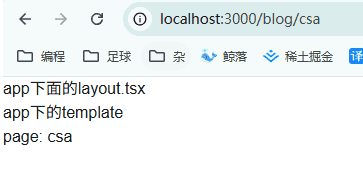

:::caution `Error: Route "/blog/[slug]" used params.slug. params should be awaited before using its properties. `

在 Next 15 中，动态 API 已变成异步，详情请看：https://nextjs.org/docs/messages/sync-dynamic-apis

:::

```tsx
import React, { memo } from 'react'

interface PageProps {
  params: {
    slug: string
  }
}

const page = memo(async (props: PageProps) => {
  const { slug } = await props.params

  return (
    <div>page: {slug}</div>
  )
})

export default page
```


#### \[...folderName]

在命名文件夹的时候，如果你在方括号内添加省略号，比如 `[...folderName]`，这表示捕获所有后面所有的路由片段。

也就是说，`app/shop/[...slug]/page.js`会匹配 `/shop/clothes`，也会匹配 `/shop/clothes/tops`、`/shop/clothes/tops/t-shirts`等等。

当你访问 `/shop/a`的时候，`params` 的值为 `{ slug: ['a'] }`。

当你访问 `/shop/a/b`的时候，`params` 的值为 `{ slug: ['a', 'b'] }`。

当你访问 `/shop/a/b/c`的时候，`params` 的值为 `{ slug: ['a', 'b', 'c'] }`。

以此类推。


#### \[\[...folderName]]

**在命名文件夹的时候，如果你在双方括号内添加省略号，比如 `[[...folderName]]`，这表示可选的捕获所有后面所有的路由片段。**

也就是说，`app/shop/[[...slug]]/page.js`会匹配 `/shop`，也会匹配 `/shop/clothes`、 `/shop/clothes/tops`、`/shop/clothes/tops/t-shirts`等等。

它与上一种的区别就在于，不带参数的路由也会被匹配（就比如 `/shop`）

当你访问 `/shop`的时候，params 的值为 `{}`。

当你访问 `/shop/a`的时候，params 的值为 `{ slug: ['a'] }`。

当你访问 `/shop/a/b`的时候，params 的值为 `{ slug: ['a', 'b'] }`。

当你访问 `/shop/a/b/c`的时候，params 的值为 `{ slug: ['a', 'b', 'c'] }`。

以此类推。


### 路由组（Route groups）

在 `app`目录下，文件夹名称通常会被映射到 URL 中，但你可以将文件夹标记为路由组，阻止文件夹名称被映射到 URL 中。

使用路由组，你可以将路由和项目文件按照逻辑进行分组，但不会影响 URL 路径结构。路由组可用于比如：

1.  按站点、意图、团队等将路由分组
2.  在同一层级中创建多个布局，甚至是创建多个根布局

那么该如何标记呢？把文件夹用括号括住就可以了，就比如 `(dashboard)`。举些例子：


#### 按逻辑分组

**将路由按逻辑分组，但不影响 URL 路径：**

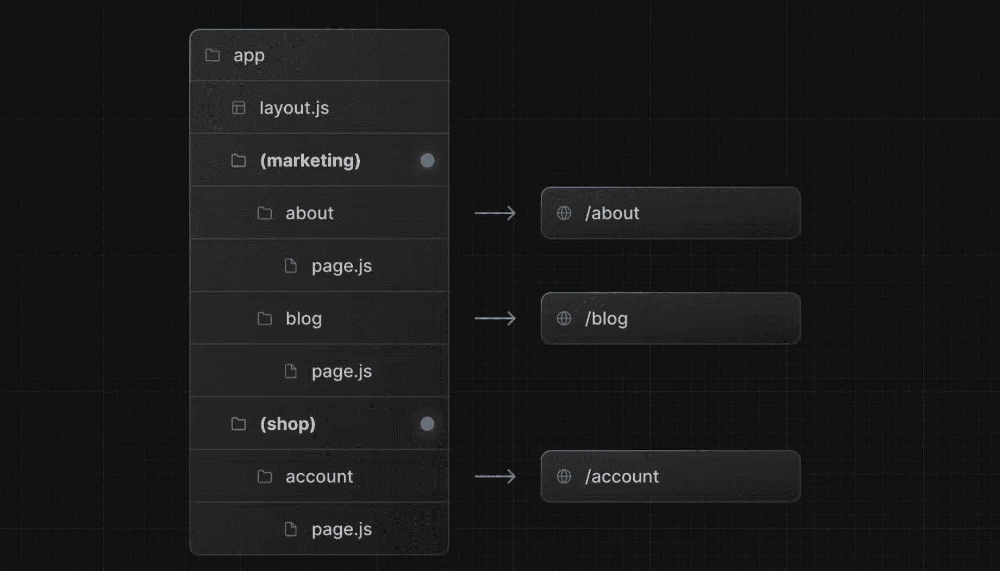

你会发现，最终的 URL 中省略了带括号的文件夹（上图中的`(marketing)`和`(shop)`）。


#### 创建不同布局

**借助路由组，即便在同一层级，也可以创建不同的布局：**

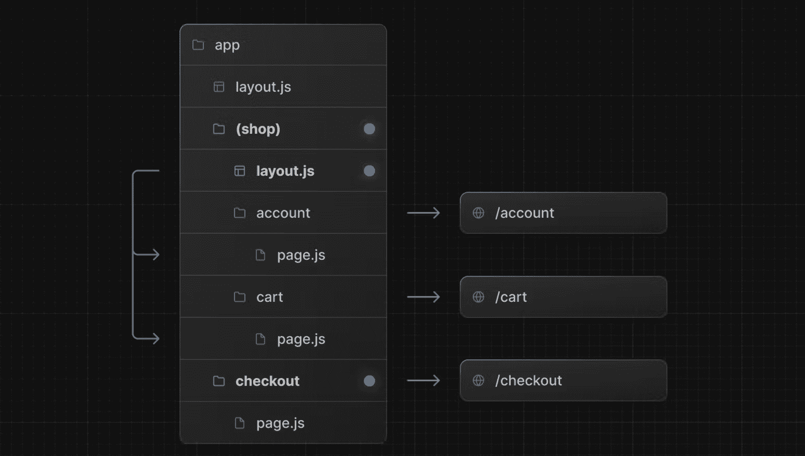

在这个例子中，`/account` 、`/cart`、`/checkout` 都在同一层级。但是 `/account`和 `/cart`使用的是 `/app/(shop)/layout.js`布局和`app/layout.js`布局，`/checkout`使用的是 `app/layout.js`


#### 创建多个根布局

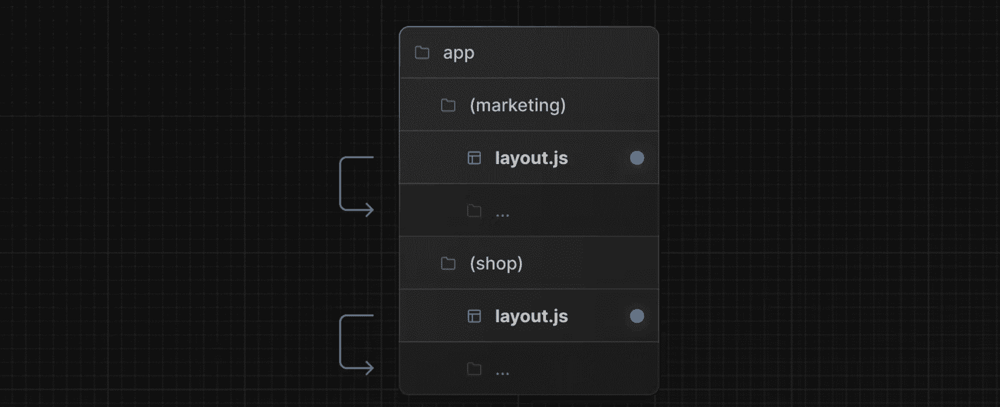

创建多个根布局，你需要删除掉 `app/layout.js` 文件，然后在每组都创建一个 `layout.js`文件。创建的时候要注意，因为是根布局，所以要有 `<html>` 和 `<body>` 标签。

这个功能很实用，比如你将前台购买页面和后台管理页面都放在一个项目里，一个 C 端，一个 B 端，两个项目的布局肯定不一样，借助路由组，就可以轻松实现区分。

再多说几点：

1.  路由组的命名除了用于组织之外并无特殊意义。它们不会影响 URL 路径。
2.  注意不要解析为相同的 URL 路径。举个例子，因为路由组不影响 URL 路径，所以  `(marketing)/about/page.js`和 `(shop)/about/page.js`都会解析为 `/about`，这会导致报错。
3.  创建多个根布局的时候，因为删除了顶层的 `app/layout.js`文件，访问 `/`会报错，所以`app/page.js`需要定义在其中一个路由组中。
4.  跨根布局导航会导致页面完全重新加载，就比如使用 `app/(shop)/layout.js`根布局的 `/cart` 跳转到使用 `app/(marketing)/layout.js`根布局的 `/blog` 会导致页面重新加载（full page load）。

注：当定义多个根布局的时候，使用 `app/not-found.js`会出现问题。具体参考 [《Next.js v14 如何为多个根布局自定义不同的 404 页面？竟然还有些麻烦！欢迎探讨》](https://juejin.cn/post/7351321244125265930)


### 平行路由（Parallel Routes）

平行路由可以使你在同一个布局中同时或者有条件的渲染一个或者多个页面（类似于 Vue 的插槽功能）

> 平行路由只有layout可以拿到数据，page中拿不到


#### 用途 1：条件渲染

举个例子，在后台管理页面，需要同时展示团队（team）和数据分析（analytics）页面：

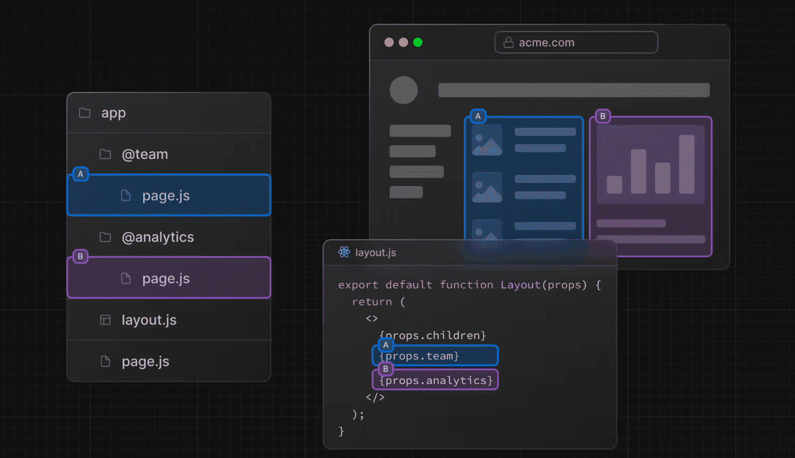

```js
// app/layout.js
export default function Layout({ children, team, analytics }) {
  return (
    <>
      {children}
      {team}
      {analytics}
    </>
  )
}
```

注：从这张图也可以看出，`children` prop 其实就是一个隐式的插槽，`/app/page.js`相当于 `app/@children/page.js`。

除了让它们同时展示，你也可以根据条件判断展示。


#### 用途 2：独立路由处理

**平行路由可以让你为每个路由定义独立的错误处理和加载界面：**


#### 用途 3：子导航

注意我们描述 team 和 analytics 时依然用的是“页面”这个说法，因为它们就像书写正常的页面一样使用 page.js。除此之外，它们也能像正常的页面一样，添加子页面，比如我们在 `@analytics` 下添加两个子页面：`/page-views` and `/visitors`：

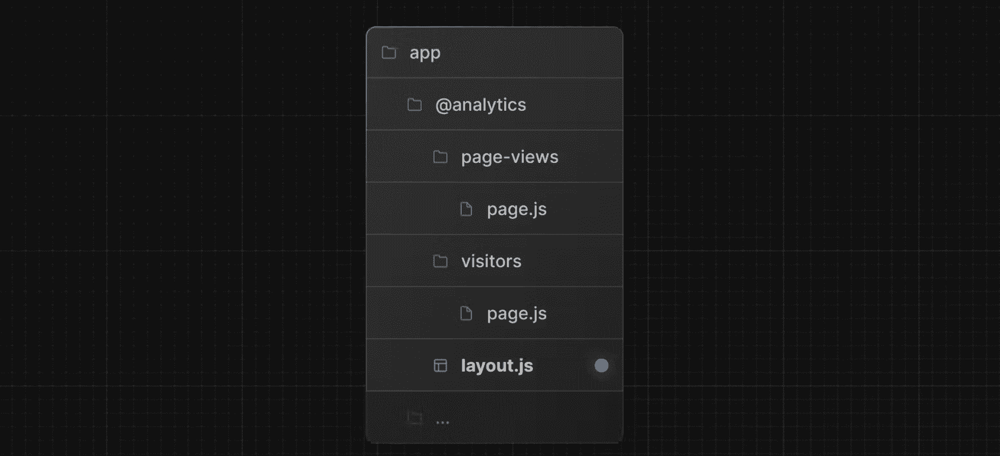

平行路由跟路由组一样，不会影响 URL，所以 `/@analytics/page-views/page.js` 对应的地址是 `/page-views`，`/@analytics/visitors/page.js` 对应的地址是 `/visitors`

当导航至这些子页面的时候，子页面的内容会取代 `/@analytics/page.js` 以 props 的形式注入到布局中


这也就是说，每个插槽都可以有自己独立的导航和状态管理，就像一个小型应用一样。这种特性适合于构建复杂的应用如 dashboard。

最后，让我们总结一下使用平行路由的优势：

1. 使用平行路由可以将单个布局拆分为多个插槽，使代码更易于管理，尤其适用于团队协作的时候
2. 每个插槽都可以定义自己的加载界面和错误状态，比如某个插槽加载速度比较慢，那就可以加一个加载效果，加载期间，也不会影响其他插槽的渲染和交互。当出现错误的时候，也只会在具体的插槽上出现错误提示，而不会影响页面其他部分，有效改善用户体验
3. 每个插槽都可以有自己独立的导航和状态管理，这使得插槽的功能更加丰富，比如在上面的例子中，我们在 `@analytics` 插槽下又建了查看页面 PV 的 `/page-views`、查看访客的 `/visitors`，使得同一个插槽区域可以根据路由显示不同的内容

那你可能要问了，我就不使用平行路由，我就完全使用拆分组件的形式，加载状态和错误状态全都自己处理，子路由也统统自己处理，可不可以？

当然是可以的，只要不嫌麻烦的话……

**注意：使用平行路由的时候，热加载有可能会出现错误。如果出现了让你匪夷所思的情况，重新运行 npm run dev 或者构建生产版本查看效果**


#### default.js

为了让大家更好的理解平行路由，我们写一个示例代码。项目结构如下：

```javascript
app
├─ @analytics
│   └─ page-views
│   │    └─ page.js
│   └─ visitors
│   │     └─ page.js
│   └─ page.js
├─ @team
│  └─ page.js
├─ layout.js
└─ page.js
```

其中 `app/layout.js`代码如下：

```jsx
import Link from "next/link";
import "./globals.css";

export default function RootLayout({ children, team, analytics }) {
  return (
    <html>
      <body className="p-6">
        <div className="p-10 mb-6 bg-sky-600 text-white rounded-xl">
          Parallel Routes Examples
        </div>
        <nav className="flex items-center justify-center gap-10 text-blue-600 mb-6">
          <Link href="/">Home</Link>
          <Link href="/page-views">Page Views</Link>
          <Link href="/visitors">Visitors</Link>
        </nav>
        <div className="flex gap-6">
          {team}
          {analytics}
        </div>
        {children}
      </body>
    </html>
  );
}
```

`app/page.js`代码如下：

```jsx
export default function Page() {
  return (
    <div className="p-10 mt-6 bg-sky-600 text-white rounded-xl">
      Hello, App!
    </div>
  );
}
```

`app/@analytics/page.js`代码如下：

```javascript
export default function Page() {
    return <div className="h-60 flex-1 rounded-xl bg-indigo-500 text-white flex items-center justify-center">Hello, Analytics!</div>
}
```

`app/@analytics/page-views/page.js`代码如下：

```javascript
export default function Page() {
    return <div className="h-60 flex-1 rounded-xl bg-indigo-600 text-white flex items-center justify-center">Hello, Analytics Page Views!</div>
}
```

`app/@analytics/visitors/page.js`代码如下：

```javascript
export default function Page() {
    return <div className="h-60 flex-1 rounded-xl bg-indigo-700 text-white flex items-center justify-center">Hello, Analytics Visitors!</div>
}
```

`app/@team/page.js`代码如下：

```jsx
export default function Page() {
    return <div className="h-60 flex-1 rounded-xl bg-sky-500 text-white flex items-center justify-center">Hello, Team!</div>
}
```

其实各个 `page.js` 代码差异不大，主要是做了一点样式和文字区分。

此时访问 `/`，效果如下：


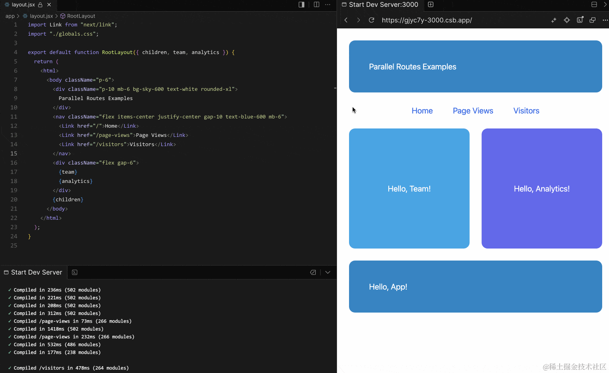

到这里其实还只是上节例子的样式美化版。现在，点击 `Visitors` 链接导航至 `/visitors` 路由，然后刷新页面，此时你会发现，页面出现了 404 错误：


这是为什么呢？为什么我们从首页导航至 `/visitors` 的时候可以正常显示？而直接进入 `/visitors` 就会出现 404 错误呢？

> 自己的理解：直接进入/visitors，匹配的是/app/@analytics/visitors/page.tsx文件，但是在app/layout中，是有{team}，直接访问不能匹配这个{team}，所以会报404，如果我们把{team}注释掉，直接访问是可以展示的

先说说为什么从首页导航至 `/visitors` 的时候可以正常显示？这是因为 Next.js 默认会追踪每个插槽的状态，具体插槽中显示的内容其实跟导航的类型有关：

* 如果是软导航（Soft Navigation，比如通过 `<Link />` 标签），在导航时，Next.js 将执行部分渲染，更改插槽的内容，如果它们与当前 URL 不匹配，维持之前的状态
* 如果是硬导航（Hard Navigation，比如浏览器刷新页面），因为 Next.js 无法确定与当前 URL 不匹配的插槽的状态，所以会渲染 404 错误

简单的来说，访问 `/visitors` 本身就会造成插槽内容与当前 URL 不匹配，按理说要渲染 404 错误，但是在软导航的时候，为了更好的用户体验，如果 URL 不匹配，Next.js 会继续保持该插槽之前的状态，而不渲染 404 错误。

那么问题又来了？不是写了 `app/@analytics/visitors/page.js` 吗？怎么会不匹配呢？对于 `@analytics` 而言，确实是匹配的，但是对于 `@team` 和 `children` 就不匹配了！

也就是说，当你访问 `/visitors` 的时候，读取的不仅仅是 `app/@analytics/visitors/page.js`，还有 `app/@team/visitors/page.js` 和 `app/visitors/page.js`。

那么问题又来了，如果我在某一个插槽里新建了一个路由，我难道还要在其他插槽里也新建这个路由吗？这岂不是很麻烦？

为了解决这个问题，Next.js 提供了 default.js。当发生硬导航的时候，Next.js 会为不匹配的插槽呈现 default.js 中定义的内容，如果 default.js 没有定义，再渲染 404 错误。

新建 `app/@team/default.js`，代码如下：

```js
export default function Page() {
    return <div className="h-60 flex-1 rounded-xl bg-indigo-700 text-white flex items-center justify-center">Hello, Team Default!</div>
}
```

新建 `app/default.js`，代码如下：

```js
export default function Page() {
  return (
    <div className="p-10 mt-6 bg-sky-600 text-white rounded-xl">
      Hello, App Default!
    </div>
  );
}
```

此时效果如下：

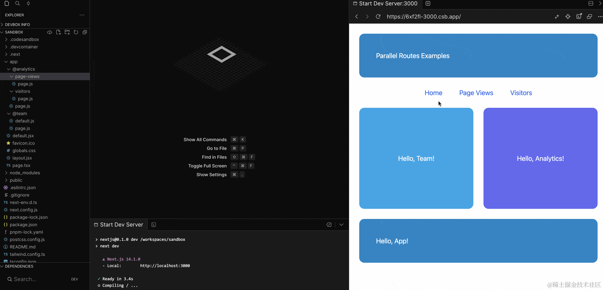


### 拦截路由（Intercepting Routes）

拦截路由允许你在当前路由拦截其他路由地址并在当前路由中展示内容。


#### 效果展示

让我们直接看个案例，打开 [dribbble.com](https://dribbble.com/) 这个网站，你可以看到很多美图，现在点击任意一张图片，此时页面弹出了一层 Modal，Modal 中展示了该图片的具体内容。如果你想要查看其他图片，点击右上角的关闭按钮，关掉 Modal 即可继续浏览。值得注意的是，此时路由地址也发生了变化，它变成了这张图片的具体地址。如果你喜欢这张图片，直接复制当前的地址分享给朋友即可。而当你的朋友打开时，其实不需要再以 Modal 的形式展现，直接展示这张图片的具体内容即可。现在刷新下该页面，你会发现页面的样式不同了。

在这个样式里没有 Modal，就是展示这张图片的内容。

同样一个路由地址，却展示了不同的内容。这就是拦截路由的效果。如果你在 `dribbble.com` 想要访问 `dribbble.com/shots/xxxxx`，此时会拦截 `dribbble.com/shots/xxxxx` 这个路由地址，以 Modal 的形式展现。而当直接访问 `dribbble.com/shots/xxxxx` 时，则是原本的样式。

示意图如下：

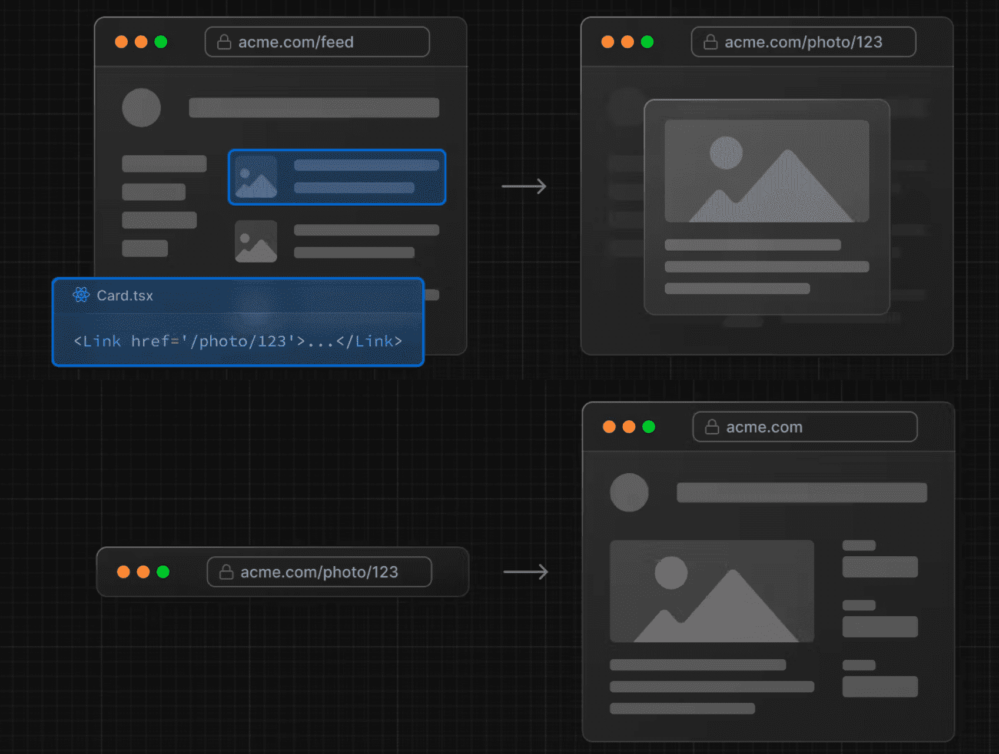

这是另一个拦截路由的 Demo 演示：<https://nextjs-app-route-interception.vercel.app/>

了解了拦截路由的效果，让我们再思考下使用拦截路由的意义是什么。

简单的来说，就是希望用户继续停留在重要的页面上。比如上述例子中的图片流页面，开发者肯定是希望用户能够持续在图片流页面浏览，如果点击一张图片就跳转出去，会打断用户的浏览体验，如果点击只展示一个 Modal，分享操作又会变得麻烦一点。拦截路由正好可以实现这样一种平衡。又比如任务列表页面，点击其中一项任务，弹出 Modal 让你能够编辑此任务，同时又可以方便的分享任务内容。


#### 实现方式

那么这个效果该如何实现呢？在 Next.js 中，实现拦截路由需要你在命名文件夹的时候以 `(..)` 开头，其中：

*   `(.)` 表示匹配同一层级
*   `(..)` 表示匹配上一层级
*   `(..)(..)` 表示匹配上上层级。
*   `(...)` 表示匹配根目录

但是要注意的是，这个匹配的是路由的层级而不是文件夹路径的层级，就比如路由组、平行路由这些不会影响 URL 的文件夹就不会被计算层级。

看个例子：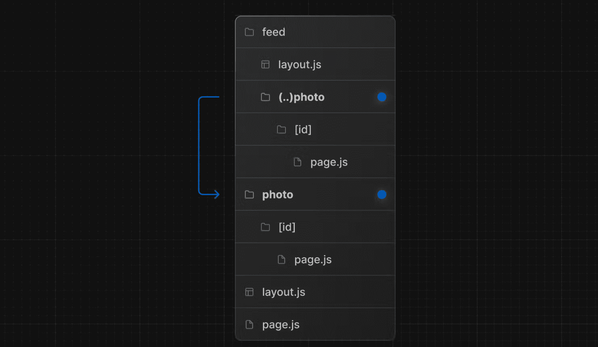

`/feed/(..)photo`对应的路由是 `/feed/photo`，要拦截的路由是 `/photo`，两者只差了一个层级，所以使用 `(..)`


#### 示例代码

我们写个 demo 来实现这个效果，目录结构如下：

```javascript
app
├─ layout.js
├─ page.js
├─ data.js
├─ default.js
├─ @modal
│  ├─ default.js
│  └─ (.)photo
│     └─ [id]
│        └─ page.js
└─ photo
   └─ [id]
      └─ page.js
```

虽然涉及的文件很多，但每个文件的代码都很简单。

先 Mock 一下图片的数据，`app/data.js`代码如下：

```javascript
export const photos = [
  { id: "1", src: "http://placekitten.com/210/210" },
  { id: "2", src: "http://placekitten.com/330/330" },
  { id: "3", src: "http://placekitten.com/220/220" },
  { id: "4", src: "http://placekitten.com/240/240" },
  { id: "5", src: "http://placekitten.com/250/250" },
  { id: "6", src: "http://placekitten.com/300/300" },
  { id: "7", src: "http://placekitten.com/500/500" },
];
```

`app/page.js`代码如下：

```javascript
import Link from "next/link";
import { photos } from "./data";

export default function Home() {
  return (
    <main className="flex flex-row flex-wrap">
      {photos.map(({ id, src }) => (
        <Link key={id} href={`/photo/${id}`}>
          
        </Link>
      ))}
    </main>
  );
}
```

`app/layout.js` 代码如下：

```javascript
import "./globals.css";

export default function Layout({ children, modal }) {
  return (
    <html>
      <body>
        {children}
        {modal}
      </body>
    </html>
  );
}
```

此时访问 `/`，效果如下：

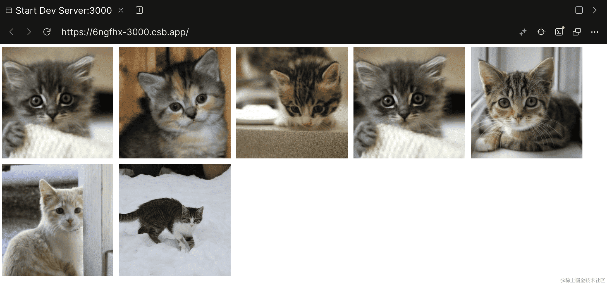

现在我们再来实现下单独访问图片地址时的效果，新建 `app/photo/[id]/page.js`，代码如下：

```javascript
import { photos } from "../../data";

export default function PhotoPage({ params: { id } }) {
  const photo = photos.find((p) => p.id === id);
  return ;
}
```

访问 `/photo/6`，效果如下：

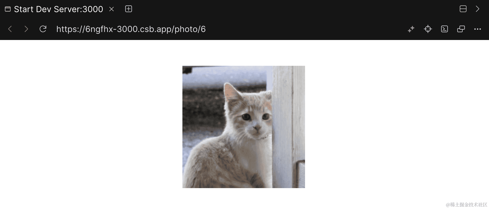


现在我们开始实现拦截路由，为了和单独访问图片地址时的样式区分，我们声明另一种样式效果。`app/@modal/(.)photo/[id]/page.js` 代码如下：

```javascript
import { photos } from "../../../data";

export default function PhotoModal({ params: { id } }) {
  const photo = photos.find((p) => p.id === id)
  return (
    <div className="flex h-60 justify-center items-center fixed bottom-0 bg-slate-300 w-full">
      
    </div>
  )
}
```

因为用到了平行路由，所以我们需要设置 default.js。`app/default.js` 和 `app/@modal/default.js`的代码都是：

```javascript
export default function Default() {
  return null
}
```

最终的效果如下：

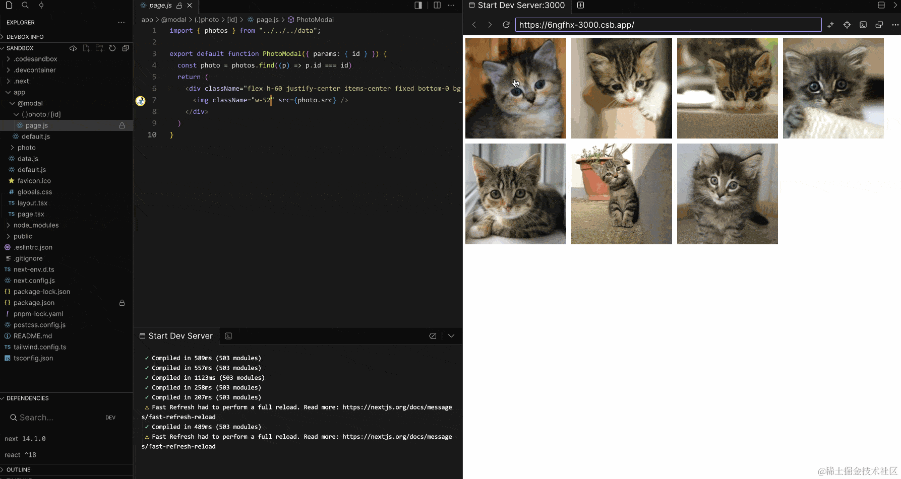

你可以看到，在 `/`路由下，访问 `/photo/5`，路由会被拦截，并使用 `@modal/(.)photo/[id]/page.js` 的样式。


