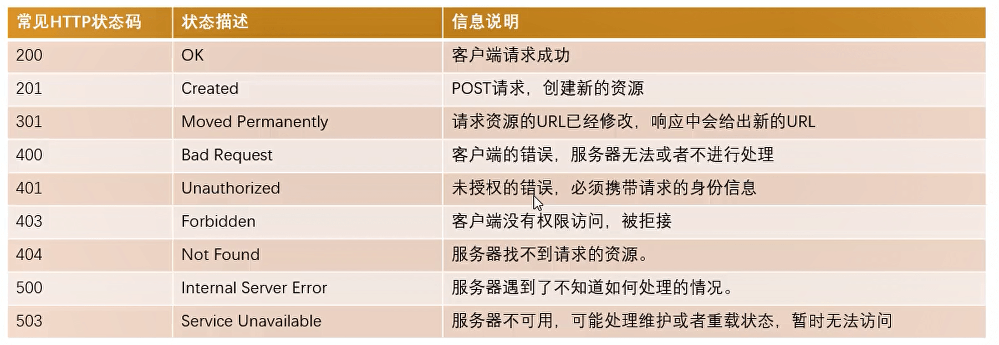

## fs文件系统模块

### 什么是fs文件系统模块

- fs 模块是 Node.js 官方提供的、用来操作文件的模块。它提供了一系列的方法和属性，用来满足用户对文件的操作需求。
- 如果要在JavaScript代码中，使用fs模块来操作文件，则需要使用如下的方式先导入它：`const fs = require('fs')`


### 读取内容—readFile()

- 语法格式：`fs.readFile(path[,options],callback)`【path，callback为必选参数，options为可选参数】

- path：路径

- options：两个参数
  - encoding：表示以什么编码格式来读取文件，默认utf-8。
  - flag：进行哪些操作，比如r，是读的默认值

- callback：文件读取完成之后，通过回调函数拿到读取的结果【回调函数两个参数err和data，err是错误，data是成功拿到的数据，读出成功err默认为null】

```javascript
const fs = require("fs")
//异步读取
fs.readFile("./test.txt","utf-8",function(err,data){
    console.log(err,data);
})

//promise写法
fs.promise.readFile().then().catch()
```


- 可以通过判断err对象是否为null，来知晓是否读取文件成功

```javascript
const fs = require("fs")

fs.readFile("./test.txt","utf-8",function(err,data){
    if(err){
        console.log("读取失败，失败原因是：" + err.message);
    }else{
        console.log("文件读取成功，文件内容是：" + data);
    }
})
```


### 写入内容—writeFile()

- 语法格式：`fs.writeFile(file,data[,options],callback)`【file,data,callback为必选参数，options为可选参数】

- file：需要指定一个文件路径的字符串，表示文件的存放路径

- data：写的内容

- options：两个参数
  - encoding：表示以什么编码格式来读取文件，默认utf-8。
  - flag：进行哪些操作，比如`w`，是读的默认值。还有`w+`，是打开文件进行读写，不纯在就创建文件。还有不是覆盖文件的操作，是在文件后继续写的操作`a`。详细查一下

- callback：文件读取完成之后，通过回调函数拿到读取的结果【回调函数一个参数err，写成功err返回null，写失败返回失败原因】

```javascript
const fs = require("fs")

fs.writeFile("./testTwo.txt","学习node.js","utf-8",function(err){
    console.log(err);
})
//也有promise写法
```


- 当然也可以通过判断err对象是否为null，来知晓是否写文件成功

```javascript
const fs = require("fs")

fs.writeFile("./testTwo.txt","学习node.js","utf-8",function(err){
    if(err){
        console.log("写入失败，失败原因是：" + err.message);
    }else{
        console.log("写入成功");
    }
})
```


### 文件描述符

- 在常见的操作系统上，对于每个进程，内核都维护着一张当前打开着的文件和资源的表格。
- 每个打开的文件都分配了一个**称为文件描述符的简单的数字标识符**。
- 在系统层，**所有文件系统操作都使用这些文件描述符来标识和跟踪每个特定的文件**。
- Windows 系统使用了一个虽然不同但概念上类似的机制来跟踪资源。

```js
//我们可以通过fs.open这个方法，打开文件，获取fd（数字标识符）
const fs = requirt('fs')

// 打开文件
fs.open("./test.txt",(err, fd)=>{
    console.log(fd)//这就是我们的文件描述符
})

// 当我们获取到这个文件标识符的时候，可以做读写的操作（当然读写也可以直接进行，不需要fd）
fs.open("./test.txt",(err, fd)=>{
    if(err) return
    
    //获取文件的详细信息
    fs.fstat(fd, (err, data)=>{
        if(err) return
        console.log(data)
        
        // 一般我们会手动关闭一下打开的文件
        fs.close()
    })
})
```


### 创建文件夹

```js
const fs = require('fs')

fs.mkdir(./one,(err)=>{
    console.log(err)
})
```


### 读取文件夹

```js
const fs = require('fs')

//打印的是数组显示文件名：[ 'one', 'one.js', 'one.txt' ]
fs.readdir('../code',(err, files)=>{
    console.log(files);
})

//获取详细信息，是文件还是文件夹，添加  withFileTypes: true
fs.readdir('../code', { withFileTypes: true } , (err, files)=>{
    console.log(files);//默认属性值为2代表文件夹，1代表文件
    files.forEach( item =>{
        console.log(item);
        //一般我们获取这个属性时不好获取的，但是有一个方法可以帮助我们获取
        if( item.isDirectory() ){
            console.log("文件夹:",item.name);
            //文件夹我们可以继续读取
        }else{
            console.log("文件:",item.name);
        }
    })
})

// 我们可以将这个读取文件夹里的所有文件改为递归的操作
function readDirector(path){
    fs.readdir(path, { withFileTypes: true } , (err, files)=>{
        if(err) return

        files.forEach(item =>{
            if( item.isDirectory() ){
                readDirector(`./${path}/${item.name}`)
            }else{
                console.log("文件:",item.name);
            }
        })
    } )
}
readDirector('../../Node.js')
```


### 文件夹/文件重命名

```js
const fs = require('fs')

// 对文件夹重命名
fs.rename("./test","./why", err=>{.})

// 对文件重命名
fs.rename("./test.txt","./why.txt", err=>{.})
```


## path路径模块

### 什么是path路径模块

path模块是Node.js官方提供的、用来处理路径的模块。它提供了一系列的方法和属性，用来满足用户对路径的处理需求。

如果要在JavaScript代码中，使用path模块来操作文件，则需要使用如下的方式先导入它：`const path = require('path')`


### 路径拼接—join

使用 path.join() 方法，可以把多个路径片段拼接为完整的路径字符串

语法格式：`path.join([...paths])`

...paths：路径片段的序列

返回值为String

注意：

1. ​     ../ 会抵消一层路径
2. 今后凡是涉及到路径拼接的操作，都要使用path.join方法进行处理。不要直接使用＋进行字符串的拼接。

```javascript
const path = require("path")
const fs = require("fs")

const pathStr = path.join('/a','/b/c','../','./d','e')

console.log(pathStr)  //  \a\b\d\e
//这里用 ./testOne.txt  或直接  testOne.txt  都可以
fs.readFile(path.join(__dirname,"testOne.txt"),"utf-8",function(err,data){
    console.log(err,data);
})
```


### 获取路径的文件名—basename

使用path.basename()方法，可以获取路径中的最后一部分，经常通过这个方法获取路径中的文件名

语法格式：`path.basename(path[,ext])`【path为必选参数，ext是可选参数】

path：路径

ext：表示文件拓展名

返回值：路径中的最后一部分

```
const path = require("path")

//文件路径
const basePath = "./a/b/c/testOne.txt"  

const aName = path.basename(basePath)
console.log(aName);  //  testOne.txt

//当我们传入扩展名的时候，返回值会删除扩展名，保留名字
const bName =  path.basename(basePath,".txt")
console.log(bName);  //  testOne
```


### 获取路径的文件扩展名—extname

使用path.EXTname()方法，可以获取路径中的扩展名部分

语法格式：`path.extname(path)`

path：路径

返回值：路径中的扩展名部分

```javascript
const path = require("path")

//文件路径
const basePath = "./a/b/c/testOne.txt"  

const aName = path.extname(basePath)
console.log(aName);  //  .txt
```


### path.resolve

- path.resolve()方法会把一个路径或路径片段的序列解析为一个绝对路径
- 给定的路径的序列是从右往左被处理的，后面每个path 被依次解析，直到构造完成一个绝对路径
- 如果在处理完所有给定path的段之后，还没有生成绝对路径则使用当前工作目录
- 生成的路径被规范化并删除尾部斜杠，零长度path段被忽略
- 如果没有path传递段,path.resolve()将返回当前工作目录的绝对路径


## events模块

发出事件和监听事件都是通过EventEmitter类来完成的，它们都属于events对象。

```js
// events 事件总线
const EventEmitter = require('events')

// 创建实例对象
const emitter = new EventEmitter()

function handleFn(){
    console.log("监听事件");
}

// 监听事件
emitter.on('jl',handleFn)

// 发送事件
setTimeout(()=>{
    emitter.emit('jl')

    // 取消事件
    console.log("将要取消");
    emitter.off('jl', handleFn)
    console.log("node结束");
},2000)
```


**传递参数**

```js
const EventEmitter = require('events')

const emitter = new EventEmitter()

// 剩余参数形式接受参数
function handleFn(...args){
    console.log("监听事件", args);
}

emitter.on('jl',handleFn)

setTimeout(()=>{
    // 1. 发送的时候携带参数
    emitter.emit('jl','鲸落', 18, '前端')

   
    emitter.off('jl', handleFn)
},2000)
```


## Buffer

我们会发现，对于前端开发来说，通常很少会和二进制直接打交道。

但是对于服务器端为了做很多的功能，我们必须直接去操作其二进制的数据。

所以Node为了可以方便开发者完成更多功能，提供给了我们一个类Buffer，并且它是全局的。

```js
// 查看字符的二进制数据
const buf = Buffer.from("hhh")
console.log(buf);

const buf2 = Buffer.from("鲸落")
console.log(buf2);

//buffer转为字符串
console.log(buf2.toString())
```

```js
//我们在读取文件的时候，在不设置编码的时候，读取的就是二进制数据
const fs = require('fs')

fs.readFile('./one.txt',(err, data)=>{
    console.log(data);
})
```


## Stream

### 概念

- 什么是Stream(小溪、小河，在编程中通常翻译为流)呢?
  - 我们的第一反应应该是流水，源源不断的流动;
  - 程序中的流也是类似的含义，我们可以想象当我们从一个文件中读取数据时，文件的二进制(字节）数据会源源不断的被读取到我们程序中，而这个一连串的字节，就是我们程序中的流
- 所以，我们可以这样理解流：是连续字节的一种表现形式和抽象概念。流应该是可读的，也是可写的;
- 在之前学习文件的读写时，我们可以直接通过readFile或者writeFile方式读写文件，为什么还需要流呢?
  - 直接读写文件的方式，虽然简单，但是无法控制一些细节的操作
  - 比如从什么位置开始读、读到什么位置、一次性读取多少个字节
  - 读到某个位置后，暂停读取，某个时刻恢复继续读取等等;
  - 或者这个文件非常大，比如一个视频文件，一次性全部读取并不合适


### 可读流

```js
const fs = require('fs')

//精准控制
const readStream = fs.createReadStream('./one.txt',{
    start:8,//开始位置
    end:20,//结束位置
    highWaterMark:3,//每次读几个，不写默认64kb
})

// 监听读取数据
readStream.on('data', data =>{
    console.log(data.toString());

    //暂停读取
    readStream.pause()

    setTimeout(()=>{
        // 恢复读取
        readStream.resume()
    }, 2000)
})

// 补充其他事件：

// 1.文件打开的时候被监听,可以拿到fd
readStream.on('open',(fd)=>{
    console.log("文件被打开",fd)
})

// 2.文件读取结束的时候监听，他会自动关闭文件
readStream.on('end',(fd)=>{
    console.log("文件读取结束",fd)
})

// 2.文件读取结束并关闭
readStream.on('close',(fd)=>{
    console.log("文件读取结束并关闭",fd)
})
```


### 可写流

```js
const fs = require('fs')

const writetream = fs.createWriteStream('./one.txt',{
    flags:'a+'
})

// 可以多次写入
writetream.write("aaa")
writetream.write("bbb")
writetream.write("ccc")

// 写入完成需要手动调用close来关闭
writetream.close()

writetream.on('close',()=>{
    console.log("文件写入完成关闭");
})
```

```js
const fs = require('fs')

const writetream = fs.createWriteStream('./one.txt',{
    flags:'a+'
})

// 可以多次写入
writetream.write("aaa")
writetream.write("bbb")
writetream.write("ccc")
// 我们可以在将最后一次写入事件改为end，它的功能是先将文件写入，再关闭文件
writetream.end("ddd")

writetream.on('close',()=>{
    console.log("文件写入完成关闭");
})
```


### 读写的联系

将一个文件复制一个新的文件

```js
// 方式一：一次新读取文件，在写入新的文件中
const fs = require('fs')

fs.readFile('./one.txt',(err, data)=>{
    fs.writeFile("./two.txt",data, (err)=>{
        console.log("文件复制完成");
    })
})
```

```js
// 方式二：可读流+可写流
const fs = require('fs')

const readStream = fs.createReadStream('./one.txt')
const writeStream = fs.createWriteStream('./two.txt')

readStream.on('data', data=>{
    writeStream.write(data)
})
```

```js
// 方式三：在可读流和可写流之间建立一个管道
const fs = require('fs')

const readStream = fs.createReadStream('./one.txt')
const writeStream = fs.createWriteStream('./two.txt')

readStream.pipe(writeStream)
```


## http模块

### 概念

- 在网络节点中，负责消费资源的电脑，叫做客户端。负责对外提供网络资源的电脑，叫做服务器。

- http模块是Node.js官方提供的、用来创建web服务器的模块。通过 http模块提供的 http.createServer()方法，就能方便的把一台普通的电脑，变成一台Web服务器，从而对外提供Web资源服务。

- 如果希望http模块创建Web服务器，则需要先导入它：`const http = require('http')`


### 基本使用

```js
//1.导入http模块
const http = require('http')

// 2.创建web服务器实例
// request 对象包含本次客户端请求的所有信息，比如请求urk、method、headers等
// response 对象是给客户端返回的信息
const server = http.createServer((request,response)=>{
    console.log(request);
    console.log('request被调用了')
    // end()方法的作用：向客户端发送指定的内容，并结束这次请求的处理过程
    response.end('hello world!')
})

// 也可以用过on方法监听
// server.on('request',(request ,response)=>{})

//4.启动服务器
//调用 server.listen(端口号，回调函数) 方法，即可启动 web 服务器，启动成功调用回调函数
server.listen(8000,()=>{
    console.log("启动！！！")
})
```


### request

req本质是一个readable可读流，我们要先设置编码，然后监听data

- 路径信息：`req.url`
- 请求方式：`req.method`
- 请求头：`req.headers`


#### query参数解析

```js
const http = require('http')
// 1. 引入url
const url = require('url')

// 4.引入query解析模块
const qs = require('querystring')

// 请求路径：localhost:8000/addUser?name=123&age=18
const serve = http.createServer((req, res)=>{
    const urlString = req.url
    // 2. 使用url.parse进行解析
    const urlInfo = url.parse(urlString)
    // 拿到整个query参数：uerInfo.query：name=123&age=18     /addUser
    console.log(urlInfo.query, urlInfo.pathname);
    // 3.解析query
    const queryString = urlInfo.query
    const queryInfo = qs.parse(queryString)
    console.log(queryInfo)  // { name: '123', age: '18' }


    res.end(`${url}`)
})

serve.listen(8000, ()=>{
    console.log("服务器被监听了");
})
```


#### body参数解析

body参数不能想query参数一样直接去获取的，因为body参数是放在请求体里面的

```js
const http = require('http')

const serve = http.createServer((req, res)=>{
    // req本质是一个readable可读流，我们要先设置编码，然后监听data
    req.setEncoding("utf-8")

    req.on('data',(data)=>{
        // 拿到前端传来的数据
        console.log(data);
    })
    
    req.on('end',()=>{
        //在这里我们可以做判断，比如登录成功end返回成功，失败返回失败
        console.log('请求结束');
    })
    
    res.end(`被请求了`)
})

serve.listen(8000, ()=>{
    console.log("服务器被监听了");
})
```


####  Header请求头

 在request对象的header中也包含很多的信息，客户端默认会发来一些信息

- `content-type是这次请求携带的数据的类型`
  - `application/x-www-form-urlencoded`：表示数据被编码成以`&`分隔的键值对
  - `application/json`：表示一个json类型
  - `text/plain`：表示文本类型
  - `application/xml`：表示xml类型
  - `multipart/from-data`：表示上传文件

```js
const http = require('http')

const serve = http.createServer((req, res)=>{
    console.log(req.headers);
    // 请求体
    console.log(req.headers['content-type']);
    // token
    console.log(req.headers['authorization']);
    
    res.end(`被请求了`)
})

serve.listen(8000, ()=>{
    console.log("服务器被监听了");
}) 
```


### response

#### 基本使用

- 本质是一个writable可写流
- 在结束可写流的时候一般用`close()`，但是http重写了这个人close，不允许我们使用它，让我们使用`end()` 

```js
const http = require('http')

const serve = http.createServer((req, res)=>{
    res.write("第一次写入")
    res.write("第二次写入")
    
    res.end("写入结束")
    // 响应给客户端：第一次写入第二次写入写入结束
})

serve.listen(8000, ()=>{
    console.log("服务器被监听了");
})
```


#### 响应状态码

常见状态码：



```js
const http = require('http')

const serve = http.createServer((req, res)=>{
    //设置响应状态码
    res.statusCode = 200
    
    res.end("请求结束")
})

serve.listen(8000, ()=>{
    console.log("服务器被监听了");
})
```


#### 请求头

```js
const http = require('http')

const serve = http.createServer((req, res)=>{
    // 设置header信息：数据的类型以及数据的编码格式，否则可能会出现乱码
    // 方式一：单独设置一个header
    res.setHeader('Content-Type', 'application/json;charset=utf-8')

    // 方式二：和http status code 一起设置
    res.writeHead(200,{
        'Content-Type': 'application/json;charset=utf-8'
    })
    
    // 我们可以返回json
    res.end('{ "message": "你好" }')
})

serve.listen(8000, ()=>{
    console.log("服务器被监听了");
})
```


### 发送网络请求

除了用http，还可以用axios【`const axios = require('axios')`】

```js
const http = require('http')

const req = http.request({
    method:'POST',
    hostname:'',
    port:'',//将url的路径与端口分开了
},(res)=>{
    res.on('data',(data)=>{
        console.log(data)
    })
})

req.end()//记得要主动结束
```


### 文件上传

...


## express

### 基本使用

先安装：`npm install express`

```
// 1.导入
const express = require('express')

// 2.创建服务器
const app = express()

// 3.启动服务器，并监听端口
app.listen(8000, ()=>{
    console.log("express服务器启动成功");
})
```

```js
// 监听请求

const express = require('express')

const app = express()

// 在express我们直接通过这种方式来实现对post/get方法的监听，并且监听对应的路径
app.post("/login",(req, res)=>{
    res.send("欢迎登录")
})

app.get("/message",(req, res)=>{
    res.send("数据返回")
})

app.listen(8000, ()=>{
    console.log("express服务器启动成功");
})
```


### 中间件

#### 概念

- 给express创建的app传入一个回调函数，传入的这个回调函数就称为中间件
- 中间件中可以执行哪些任务呢
  - 执行任何代码
  - 更改请求(request)和响应(response)对象
  - 结束请求-响应周期(返回数据)
  - 调用栈中的下一个中间件：`next()`
- 如果当前中间件功能没有结束请求-响应周期，则必须调用next()将控制权传递给下一个中间件功能，否则，请求将被挂起。


#### 注册中间件

- 普通的：`app.use()`
- `app.post(...) / app.get(...) / app.delete(...) `

```js
const express = require('express')

const app = express()

// 通过use方法瘫册的中间件是最普通的/简单的中间件
// 通过use注册的中间件,无论是什么请求方式都可以匹配上
// 当我们有多个中间件的时候，只会匹配第一个中间件，
// 当我们想让他继续匹配的时候，就需要使用next
app.use((req, res, next)=>{

})

app.listen(8000,()=>{
    console.log("express服务器开启!");
})
```


#### 路径匹配中间件

```js
// 只有/home的路径才会执行这个中间件【但是他没有对请求方式做限制】
app.use('/home',(req, res, next)=>{

})
```


#### 路径/方法匹配中间件

```js
// 对path/method进行限制
app.get('/home',(req, res, next)=>{
    
})
app.post('/home',(req, res, next)=>{
    
})
```


#### 注册多个中间件

```js
// 方式一：
app.get('/home',(req, res, next)=>{
    
})
app.get('/home',(req, res, next)=>{
    //第二个中间件是否执行取决于第一个是否调用了next()
})


// 方式二：
app.get('/home',(req, res, next)=>{
    
},(req, res, next)=>{
    //第二个中间件是否执行取决于第一个是否调用了next()
})
```


#### 解析参数

- 解析json。除了我们拿到数据使用JSON.parse转为对象类型。还可以使用express自己的中间件

```js
const express = require('express')

const app = express()

// 应用中间件
app.use(express.json())

...
```

- 解析`application/x-www-form-urlencoded`

```js
const express = require('express')

const app = express()

// 应用中间件
app.use(express.urlencode({ extended: true }))

...
```


#### 第三方中间件

##### 纪录请求日志

如果我们希望将请求日志记录下来，那么可以使用express官网开发的第三方库：morgan。注意:需要单独安装：`npm install morgan`

```js
const fs = require('fs')
const express = require('express')
const morgan = require('morgan')

const app = express()

// 应用第三方编写的中间件
const writeStream = fs.createWriteStream('./log/access.log')
app.use(morgan('combined', { stream: writeStream }))

...
```


##### 单文件上传

安装：`npm install multer`

```js
const express = require('express')
const multer = require('multer')

const app = express()

// 应用第三方编写的中间件
const upload = multer({
	dest:"./uploads"//上传文件放到这个文件夹里面去
})

// 编写中间件
// image 名字要和前端对应
app.post("/img", upload.single('image'), (req, res, next)=>{
    console.log(req.file)
    res.end("文件上传成功")
})

...
```

```js
//我们通过上传方式获取的图片是没有后缀名的，但是他的数据是正确的，我们加上后后缀名就可以看到，那如何自动加上后缀名呢

const upload = multer({
	storage:multer.diskStorage({
        // 文件位置
        destination(req, file, callback){
            // 第一个参数有没有错误， 第二个参数是存储位置
            callback(null, './uploads')
        },
        //文件名字
        filename(req, file, callback){
            // file.originalname 原文件名字。在这里当然可以自定义后缀名
            callback(null, file.originalname)
        }
    })
})
```


##### 多文件上传

还是使用multer

```js
// 编写中间件
// image 名字要和前端对应。不再使用single
app.post("/img", upload.array('image'), (req, res, next)=>{
    // 是files，是一个数组
    console.log(req.files)
    res.end("文件上传成功")
})

...
```


##### form-data解析

`express.json`是解析json数据的，`express.urlencode`是解析`x-www-form-urlencoded`数据的。他们都不能解析form-data数据

解析form-data还是用multer

```js
const express = require('express')
const multer = require('multer')

const app = express()

// 应用第三方编写的中间件
const formdata = multer()

// 编写中间件
// image 名字要和前端对应
app.post("/img", formdata.any(), (req, res, next)=>{
    console.log(req.body)
    res.end("文件上传成功")
})

...
```


##### 其他参数类型的解析

```js
// query
app.get('/list',(req, res, next)=>{
    const queryInfo = req.query
    console.log(queryInfo)
})

// params    /user/:id动态拼接
app.get("/user/:id", (req, res, next)=>{
    const {id} = req.params
    res.send(`${id}`)
})
```


### 服务器响应客户端数据

```js
const express = require('express')

const app = express()

//响应客户端数据
app.post('/login',(res, req, next)=>{
    // 方式一：使用res.end方法，但是他使用的少
    res.end("登录成功")
    // 方式二：使用res.json()
    // json方法中可以传入很多的类型:object、array、string.boolean、number、null等，它们会被转换成json格式返回;
	res.json({
        code:200,
        message:"登录成功",
        list:[
            { name:'11', age:18 },
            { name:'22', age:20 }
        ]
    })
})

app.listen(8000, (res, req, next)=>{
    console.log('express服务器开启~~')
})
```


### 路由系统的使用

- 如果我们将所有的代码逻辑都写在app中，那么app会变得越来越复杂
- 我们可以使用express.Router来创建一个路由处理程序
  - 一个Router实例**拥有完整的中间件和路由系统**
  - 因此，它也被称为**迷你应用程序**(mini-app) 

```js
// 单独的定义user相关路由的文件

const express = require('express')

const app = express()

// 1. 创建路由
const userRouter = express.Router()

// 2.定义路由对象中的映射接口
// 这里我们直接用/，是因为我们在主文件中会配置基本路径，类似于baseUrl
userRouter.get('/',(res, req, next)=>{
    
})
userRouter.get('/:id',(res, req, next)=>{
    
})

// 3.导出
module.exports = userRouter
```

```js
// 主文件中：
const express = require('express')
const app = express()
// 1.导入
const userRouter = require('path')

// 2.使用【/users 就是上述我们提到的配置的baseUrl】
app.use('/users',userRouter)

app.listen(8000,()=>{
    console.log("express服务器开启!");
})
```


### 部署静态资源

#### 静态图片

```js
const express = require('express')

const app = express()

// 使用中间件
// 访问就是location:8000/文件名字   【不需要加文件夹名字】
app.use(express.static('path'))

app.listen(8000,()=>{
    console.log("express服务器开启!");
})
```


#### 静态文件夹

比如我们把我之前学习的vue项目dist文件夹或者react项目build文件夹，放到目录中

```js
const express = require('express')

const app = express()

// 直接访问 location:8000。因为他会默认去找index.html文件，只有build中有
app.use(express.static('./build'))

app.listen(8000,()=>{
    console.log("express服务器开启!");
})
```


### 服务器返回错误信息

```js
// 一般我们会将错误信息单独写出来

const express = require('express')

const app = express()

app.post("/login",(req, res, next)=>{
    const { name, password } = req.body

    // next是可以用来传递参数的
    if(!name || !password){
        next(-1001)
    }else if(...){
        next(-10002)
    }
})

app.use((err, req, res, next)=>{
    let code = err
    let message = '未知错误'
    
    switch(code){
        case -1001:
            message = '没有账户或密码'
            break
        case -1002:
            message = '账户或密码错误'
            break
        default:
            break
    }

    res.json({
        code,
        message,
    })
})

app.listen(8000,()=>{
    console.log("express服务器开启!");
})
```


## koa

### 概念

也是一个流行的Node Web服务器框架。他是需要单独安装的

安装：`npm install koa`


### 初体验

```js
const koa = require('koa')

// 创建app对象，他不像express通过函数式创建的，他需要new对象
const app = new koa()

// 注册中间件:两个参数
app.use((context, next)=>{
    console.log("匹配koa中间件");
    
    // 通过context.body将数据响应给客户端
    context.body="你请求了服务器"
})

app.listen(8000,()=>{
    console.log("koa服务器启动");
})
```


### 中间件

- koa通过创建的app对象，**注册中间件只能通过use方法**
- Koa并没有提供methods的方式来注册中间件，也没有提供path中间件来匹配路径


#### context参数解析

- context：上下文对象【koa并没有像express一样，将req和res分开，而是将它们作为ctx的属性】
  - ctx代表一次请求的上下文对象
  - ctx.request：获取请求对象
  - ctx.response：获取响应对象

```js
const koa = require('koa')

const app = new koa()

// 注册中间件:两个参数
app.use((context, next)=>{
    // 请求对象  响应对象同理
    console.log(context.request);//Koa封装的请求对象
    console.log(context.req);//Node封装的请求对象
})

app.listen(8000,()=>{
    console.log("koa服务器启动");
})
```


#### 区分路径和方法

- 真实开发中我们如何将路径和method分离呢
  - 方式一：根据request自己来判断
  - 方式二：使用第三方路由中间件

```js
app.use((ctx next)=>{
    // 大部分在我们 request/response 中的数据在ctx中都有的
    console.log(ctx.request.path)
    console.log(ctx.path)
    console.log(ctx.method)
    
    // 所以一般在koa中我们不会自己用method和path去判断，会使用路由
})
```


- 安装：`npm install @koa/router`

```js
// 单独的定义user相关路由的文件
const KoaRouter = require('@koa/router')

// 1. 创建路由,配置baseUrl
const userRouter = new KoaRouter({ prefix:'/users' })

// 2.定义路由对象中的映射接口
// 这里我们直接用/，是因为我们在主文件中会配置基本路径，类似于baseUrl
userRouter.get('/',(ctx, next)=>{
    
})
userRouter.get('/:id',(ctx, next)=>{
    
})

// 3.导出
module.exports = userRouter
```


```js
// 主文件中：
const koa = require('koa')
const app = new koa()
// 1.导入
const userRouter = require('path')

// 2.使用
app.use(userRouter.routes())
// 建议每次我们封装路由的时候都加上，他的作用是：会检查我们配置的所有方法，如果客户端请求的方法我们没有配置，会给客户端响应`Method Not Allowed`
app.use(userRouter.allowedMethods)

app.listen(8000,()=>{
    console.log("koa服务器开启!");
})
```


#### 参数解析

- get请求
  - params方式，动态路由，eg：`:id`
  - query方式，eg：`?name=jl&age=18`
- post请求
  - json【使用第三方库：`npm install koa-bodyparser`】
  - x-www-form-urlencoded
  - form-data 【使用第三方库：`npm install @koa/multer multer`】

```js
// params
userRouter.get('/:id',(ctx, next)=>{
    console.log(ctx.params.id)
})

// query
userRouter.get('/',(ctx, next)=>{
    console.log(ctx.query)
})

// json
userRouter.post('/',(ctx, next)=>{
    // 比较麻烦，使用第三方的库koa-bodyparser
    console.log(ctx.request.body)
})

// x-www-form-urlencoded
userRouter.post('/',(ctx, next)=>{
    // 比较麻烦，使用第三方的库koa-bodyparser
    console.log(ctx.request.body)
})
```

```js
// json / x-www-form-urlencoded

// 1.导入
const bodyParser = require('koa-bodyparser')

app.use(bodyParser())

userRouter.post('/',(ctx, next)=>{
    // 我们没有用bodyParser的时候ctx.request.body是undefined，有的时候就可以解析出来
    console.log(ctx.request.body)
    // ctx.body是向客户端返回数据的
    ctx.body("用户数据")
})
```

```js
// form-data 

// 1.导入
const multer = require('@koa/multer')

const formRarser = multer()

userRouter.post('/', formRarser.any(), (ctx, next)=>{
    console.log(ctx.request.body)

    ctx.body("用户数据")
})
```


#### 文件上传

```js
const multer = require('@koa/multer')

// 当然和之前一样是没有后缀名的
const upload = multer({
    dest:"path"
})

userRouter.post('/', upload.single('imgName'), (ctx, next)=>{
    console.log(ctx.request.file)//文件信息
    ctx.body("图片")
})
```


### 部署静态资源

安装：`npm install koa-static`

```js
const static = require('koa-static')

app.use(static(path))
```


### 客户端响应数据

- 使用ctx.body返回给客户端数据

- 输出结果: body将响应主体设置为以下之一
  - string :字符串数据
  - Buffer : Buffer数据Stream:流数据
  - Object|[ Array:对象或者数组
  - null:不输出任何内容 
  - 如果response.status尚未设置，Koa会自动将状态设置为200或204。

```js
...

ctx.body = {
    code:200,
    data:[
        {...},
        {...}
    ]
}

...
```


### 错误处理

```js
const koa = require('koa')

const app = new koa()

app.use((ctx, next)=>{
    // 一般我们会将这个ctx当做参数传过去的，这个在错误处理的时候就可以给客户端返回信息
    ctx.app.emit('error', -10001, ctx)
})

//可能是另一个文件
app.on('error',(code, ctx)=>{
    const codeStatus = code
    switch codeStatus:
    	...
        
        
    ctx.body
})

app.listen(8000,()=>{
    console.log("koa服务器启动");
})
```


## Koa和express对比

### 架构对比

- express是完整和强大的，其中帮助我们内置了非常多好用的功能
- koa是简洁和自由的，它只包含最核心的功能，并不会对我们使用其他中间件进行任何的限制
  - 甚至是在app中连最基本的get、post都没有给我们提供
  - 我们需要通过自己或者路由来判断请求方式或者其他功能


### 代码执行顺序

#### 同步代码

**koa**

```js
const koa = require('koa')

const app = new koa()

app.use((ctx, next)=>{
    console.log("1");
    next()
    console.log("2");
    ctx.body = "哈哈哈"
})

app.use((ctx, next)=>{
    console.log("3");
    next()
    console.log("4");
})

app.use((ctx, next)=>{
    console.log("5");
    console.log("6");
})

app.listen(8000,()=>{
    console.log("koa服务器启动");
})
```

```js
//打印：1 3 5 6 4 2 哈哈哈 会被响应客户端
```


**express**

```js
// 监听请求

const express = require('express')

const app = express()

app.use((req, res, next)=>{
    console.log("1");
    next()
    console.log("2");
    res.json("返回数据")
})

app.use((req, res, next)=>{
    console.log("3");
    next()
    console.log("4");
    
})

app.use((req, res, next)=>{
    console.log("5");
    console.log("6");
})

app.listen(8000, ()=>{
    console.log("express服务器启动成功");
})
```

```js
//打印：1 3 5 6 4 2 与koa相同
```


#### 异步代码

**koa**

```js
const koa = require('koa')

const app = new koa()

app.use((ctx, next)=>{
    ctx.msg = 'aaa'
    next()
    ctx.body = ctx.msg
})

app.use((ctx, next)=>{
    setTimeout(()=>{
        ctx.msg += 'bbb'
    },1000)
    next()
})

app.use((ctx, next)=>{
    setTimeout(()=>{
        ctx.msg += 'ccc'
    },1000)
})

app.listen(8000,()=>{
    console.log("koa服务器启动");
})
```

```js
// 返回给客户端的结果为 aaa
// 如果执行的下一个中间件是一个异步函数,那么next默认不会等到中间件的结果,就会执行下一步操作

// 但是我们在网络请求的时候，我们希望其获取到数据在进行下一步操作。在koa中将next设置为await

const koa = require('koa')

const app = new koa()

app.use(async (ctx, next)=>{
    ctx.msg = 'aaa'
    // 当然这里也要变成异步函数
    await next()
    ctx.body = ctx.msg
})

app.use(async (ctx, next)=>{
    let msg = await axios...
    ctx.msg += msg
    // 添加 await
    await next()
})

app.use((ctx, next)=>{
    ctx.msg += 'ccc'
})

app.listen(8000,()=>{
    console.log("koa服务器启动");
})
```


**express**

```js
// express中不能像koa使用await，没有意义，做不到。不建议你在第一个中返回数据
```


### 洋葱模型

将koa执行中间件的整个过程，包括返回结果的整个过程形象化了【回想koa执行代码：1 3 5 6 4 2】


## 补充

### node服务器热监听

- 安装：`npm install nodemon -g`【建议全局安装】
- 使用：`nodemon ./one.js`

