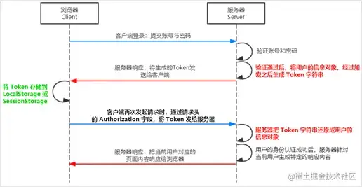

## 在Node中生成唯一的ID

### 使用加密模块

Node中内置的[密码模块](https://link.juejin.cn/?target=https%3A%2F%2Fnodejs.org%2Fdocs%2Flatest-v14.x%2Fapi%2Fcrypto.html%23crypto_crypto_randomuuid_options)提供了随机UUID()方法来生成UUID

```js
const crypto = require("crypto")
const uuid = crypto.randomUUID()
```

为了防止**randomUUID()\**在生成UUID时使用缓存，请将\**disableEntropyCache**设置为true，像这样。

```js
const uuid = crypto.randomUUID({ disableEntropyCache: true })
```


### 使用uuid包

与crypto模块不同，uuid包是一个第三方的npm模块。要安装它，请运行以下命令。

```js
npm install uuid
```

uuid允许你生成不同的ID版本。

- 版本1和4生成一个随机产生的唯一ID。
- 版本3和5从命名空间和名称生成一个唯一的ID。

这个例子显示了你如何生成一个版本4的UUID。

```js
const {v4 : uuidv4} = require("uuid")
const id = uuidv4()
```


## nodejs express中使用token验证机制

[nodejs express中使用token验证机制](https://juejin.cn/post/7033045180345384991)

### 什么是token

token的意思是“令牌”，是服务端生成的一串字符串，作为客户端进行请求的一个标识。

当用户第一次登录后，服务器生成一个token并将此token返回给客户端，以后客户端只需带上这个token前来请求数据即可，无需再次带上用户名和密码


### JWT

**`JWT`**（英文全称：JSON Web Token）是目前最流行的跨域认证解决方案。


### jwt的原理



**总结**：

1. 用户的信息通过 Token 字符串的形式，保存在客户端浏览器中。
2. 服务器通过还原 Token 字符串的形式来认证用户的身份。


### jwt的使用方式

**前端**

1. 客户端收到服务器返回的 JWT 之后，通常会将它储存在**localStorage** 或**sessionStorage** 中。
2. 此后，客户端每次与服务器通信，都要带上这个 JWT 的字符串，从而进行身份认证。推荐的做法是**把 JWT 放在 HTTP 请求头的 `Authorization` 字段中**

**后端**

1. 登录成功, 生成token, 返回给浏览器
2. 所有的接口中. 判断请求头是否携带了token(登录页面除外)


### 在express中使用jwt

#### 依赖

- [jsonwebtoken](https://link.juejin.cn/?target=https%3A%2F%2Fwww.npmjs.com%2Fpackage%2Fjsonwebtoken) 用于生成 JWT 字符串
- [express-jwt](https://link.juejin.cn/?target=https%3A%2F%2Fwww.npmjs.com%2Fpackage%2Fexpress-jwt) 用于将 JWT 字符串解析还原成 JSON 对象

```js
npm i jsonwebtoken express-jwt
```


#### 定义secret密钥

为了保证 JWT 字符串的安全性，防止 JWT 字符串在网络传输过程中被别人破解，我们需要专门定义一个用于加密和解密的 secret 密钥

1. 当生成 JWT 字符串的时候，需要使用 secret 密钥对用户的信息进行加密，最终得到加密好的 JWT 字符串
2. 当把 JWT 字符串解析还原成 JSON 对象的时候，需要使用 secret 密钥进行解密

```js
const SECRET_KEY = 'login2023'
```


#### 在登录成功后生成 JWT 字符串

调用 jsonwebtoken 包提供的 sign() 方法，将用户的信息加密成 JWT 字符串，响应给客户端：

```js
// v1Router.js
const v1Router = express.Router()
const jwt = require('jsonwebtoken')
const SECRET_KEY = 'login2023'

// 登录接口
v1Router.post('/login', (req, res) => {
  // 校验密码....(此处省略), 如果校验成功, 生成jwt
  // 参数1: 生成到token中的信息,添加Bearer是为了解析，Bearer后面有个空格
  // 参数2: 密钥
  // 参数3: token的有效时间: 60, "2 days", "10h", "7d"
  const token ='Bearer ' +  jwt.sign(
    { user: { name: 'zs', password: 123 } },
    SECRET_KEY,
    { expiresIn: '3h' }
  )
  console.log('token', token)
  res.send({
    status: 200,
    message: 'login success!',
    token,
  })
})	
```


#### 解析 JWT字符串 还原为JSON对象

客户端每次在访问那些有权限接口的时候，都需要主动通过请求头中的 **`Authorization`** 字段，将 Token 字符串发送到服务器进行身份认证。

此时，服务器可以通过 **express-jwt**这个中间件，自动将客户端发送过来的 Token 解析还原成 JSON 对象

```js
// app.js
// 导入校验token的模块, 解析JWT字符串, 还原成 JSON 对象 的模块
const parseJwt = require('express-jwt')
const SECRET_KEY = 'login2023' // 与生成token的密钥要一致!

// 1. 使用中间件解析token
// 2. 使用 .unless 排除无需校验的路由(比如: 登录)
app.use(
    expressJWT.expressjwt(
        { secret: SECRET_KEY, algorithms: ["HS256"] }
    ).unless({
        path: ["/login","/register"]//添加不需要token验证的路由 
    })
)
```


#### 使用req.user 获取用户信息

当 express-jwt 这个中间件配置成功之后，即可在那些有权限的接口中，使用 req.auth对象，来访问从 JWT 字符串中解析出来的用户信息了，示例代码如下：

```js
// 这是一个有权限的api接口
app.get('/admin/getInfo', (req, res) => {
    console.log(req.auth)
    res.send({
        status: 200,
        message: 'success',
        data: req.user,
    })
})
```


#### 错误中间件

统一处理捕获的错误 当使用 express-jwt 解析 Token 字符串时，如果客户端发送过来的 Token 字符串过期或不合法，会产生一个解析失败的错误，影响项目的正常运行。我们可以通过 Express 的错误中间件，捕获这个错误并进行相关的处理，示例代码如下：

```js
// 定义错误中间件
// middleware/errorhandler.js
function errorHandler(err, req, res, next) {
  console.log(err, err.name);
  let code = 500;
  let message = 'Internal Server Error';
  // token解析的错误
  if (err.name === 'UnauthorizedError') {
    code = 401
    message = 'no login'
  }
  res.statusCode = code;
  res.send({
    status: code,
    message,
  })
}

module.exports = errorHandler
```


#### 前端如何使用token

保存token

```js
const token = this.axios.post('v1/login', {...});
localStorage.setItem('token', token);
```

请求时 **在headers中添加`Authorization`携带token**

```js
const axios = require('axios').default;
const instance = axios.create({
    baseURL: 'http://localhost:8001/v1',
});

// 可在axios拦截中统一添加
instance.interceptors.request.use((config) => {
    config.headers = {
        ...config.headers,
        // 如果后端没有添加 'Bearer ', 则需要前端自己拼接
        Authorization: localStorage.getItem('token'),
    }
})
```


## expres异步调用函数

我的情况是：在一个js中定义了一个函数，用户获取用户的id。在另一个js文件中调用这个函数，将id返回给这个js文件中

### 方法一：使用callback

```js
function getUserId(username, password, callback) {
  const sql = `SELECT userId FROM userinfo WHERE username = ? AND password = ?`;
  db.query(sql, [username, password], (err, result) => {
    if (err) {
      callback(err, null);
      return;
    }
    
    if (result.length > 0) {
      callback(null, result[0].userId);
    } else {
      callback(new Error('User not found.'), null);
    }
  });
}

// 调用示例
getOnlyUserId('example_username', 'example_password', (err, userId) => {
  if (err) {
    console.error(err);
    return;
  }

  console.log('User ID:', userId);
});
```


### 方法二：使用promise

```js
function getOnlyUserId(username, password) {
  return new Promise((resolve, reject) => {
    const sql = `SELECT userId FROM userinfo WHERE username = ? AND password = ?`;
    db.query(sql, [username, password], (err, result) => {
      if (err) {
        reject(err);
        return;
      }
      
      if (result.length > 0) {
        resolve(result[0].userId);
      } else {
        reject(new Error('User not found.'));
      }
    });
  });
}

// 调用示例(也可以修改为async await的形式)
getOnlyUserId('example_username', 'example_password')
  .then(userId => {
    console.log('User ID:', userId);
  })
  .catch(err => {
    console.error(err);
  });
```


## Express 之处理上传的文件

[Express 之处理上传的文件](https://juejin.cn/post/7214146630466388026)

### Express 之处理上传的文件

- 我们可以使用 express 官方出品的第三方中间件 [multer](https://link.juejin.cn/?target=https%3A%2F%2Fgithub.com%2Fexpressjs%2Fmulter) 来处理，先是安装：`npm i multer`

- 引入后的 `multer` 为一个函数，执行它得到 `upload` 对象，执行时可以传入配置，比如设置 `dest` (destination 的缩写） 为 `'./uploads'`，用于指定上传后的文件的存放位置
- 由于对上传文件的处理并不是普遍需要的，所以对 `upload` 的使用是直接在匹配上传路径（我们定义为 `'/upload'`）和方法（一般为 POST）的 `app.post('/upload', )` 内，处理的是单个文件上传，所以使用 `upload.single()` 方法，传入的 `'file'`（自定义，也可以为其它名字） 为上传文件时的 key
- 文件会存储在 uploads 目录下，可以看到，文件名为哈希值，且没有后缀
- 解决办法：在执行 `const upload = multer()` 时，传入的配置对象不再设置 `dest` 的值而改为设置 `storage`

完整代码

```js
const express = require('express')
const multer = require('multer')
const app = express()

const storage = multer.diskStorage({
    destination(req, file, cb) {
      cb(null, UPLOAD_PATH)
    },
    filename(req, file, cb) {
      cb(null, Date.now() + '-' + file.originalname)
    }
  })
const upload = multer({ storage })

app.post('/upload', upload.single('file'), (req, res) => {
  console.log(req.file)
  res.end('上传成功')
})

app.listen(4396, () => {
  console.log('服务器开启')
})
```


## express配置请求跨域

要在Node.js中使用Express配置跨域，你可以使用`cors`中间件。`cors`是一个非常常用的Express中间件，它可以轻松地启用跨域资源共享（CORS）。

以下是在Node.js中使用Express配置跨域的步骤：

1. 安装：`npm install cors`
2. 引入并使用

```js
const express = require('express');
const cors = require('cors');
const app = express();

const corsOptions = {
  origin: 'http://example.com' // 将你的域名替换为实际的域名
};

//允许多个域名访问
const corsOptions = {
  origin: ['http://example1.com', 'http://example2.com'] // 将你的域名替换为实际的域名
};

app.use(cors(corsOptions));
```


## express连接数据库区分开发和生成环境

在 Node.js 中，`process.env.NODE_ENV` 是一个环境变量，用于指示当前的运行环境。默认情况下，Node.js 不会自动设置 `NODE_ENV` 环境变量，它的值是未定义的。因此，在没有明确设置 `NODE_ENV` 环境变量的情况下，`process.env.NODE_ENV` 的值将是 `undefined`。

我们可以根据这个特性来区分开发和生产环境

```js
// 创建config-dev.js文件
module.exports = {
  host: 'localhost',
  user: 'dev_user',
  password: 'dev_password',
  database: 'dev_database'
};
```

```js
// 创建config-prod.js文件
module.exports = {
  host: 'localhost',
  user: 'dev_user',
  password: 'dev_password',
  database: 'dev_database'
};
```

```js
// 创建index.js文件
//1．导入mysql模块
const mysql = require('mysql2')

const env = process.env.NODE_ENV  || 'develop';
const config = env === 'develop' ? require('./sql-dev') : require('./sql-prod');

// 2．建立与MySQL数据库的连接
const db = mysql.createConnection({
    host:config.host,//数据库的IP地址
    user:config.user,//登录数据库的账号
    password:config.password,//登录数据库的密码
    database:config.database,//指定要操作哪个数据库
})
```


