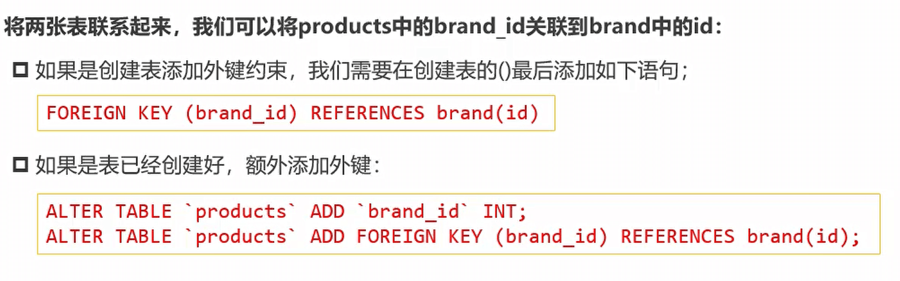
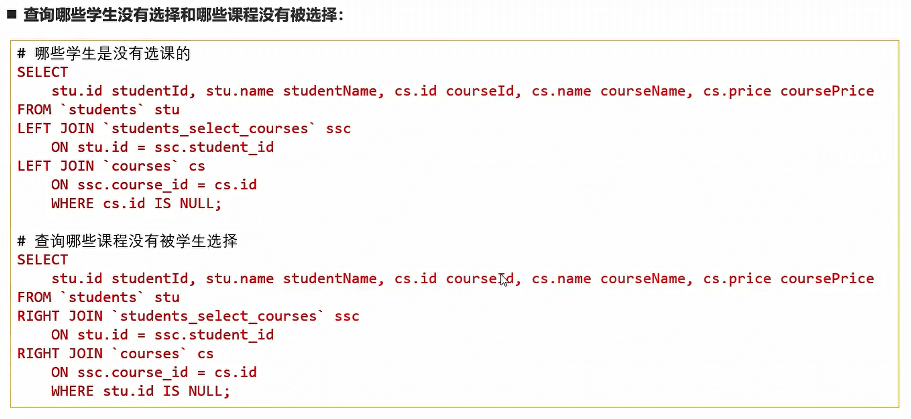

## SQL语句 

在数据库中直接使用sql语句，关键词部分需要用 "   ``   "

eg:   select price from `phone` where `name`="华为"

### 查询

**全部查询**

```javascript
// 全部查询
select * from users

// 只看age
select age from users
```


**条件查询**

```js
// 条件查询
// 有一条限制语句
select * from users where age > 18
// 多条限制语句 && 与 and 是一样的
select * from users where age > 18 && price < 2000
select * from users where age > 18 and price < 2000
// || 或语句  or 与 || 一样
```


**模糊查询**

- 模糊查询
- 模糊查询 使用LIKE关键字
  -  %表示匹配任意个的任意字符
  -  _表示匹配一个的任意字符

```js
// 查询所有title以v开头    使用% 表示你后面有多少个我都不关心
select * from users where title like 'v%';

// 查询所有title有v就行
select * from users where title like '%v%';

// 查询所有title第三个字符必须是v
select * from users where title like '__v%';
```


**排序**

- 当我们查询到结果的时候，我们希望讲结果按照某种方式进行排序，这个时候使用的是ORDER BY
- ORDER BY有两个常用的值
  - ASC：升序排列
  - DESC：降序排列

```js
// 查询价格大于3000的手机，并按照评分降序返回结果
select * from phone where price > 3000 order by score desc
```


**分页查询**

- 当数据库中的数据非常多时，一次性查询到所有的结果进行显示是不太现实的
- 在真实开发中，我们都会要求用户传入offset、limit或者page等字段
- 它们的目的是让我们可以在数据库中进行分页查询
- 它的用法有`[LIMIT {[offset,] row_count | row_count OFFSET offset}]`

```js
//直接查询20条数据（就是从第1条到第20条）
select * from phone limit 20

//偏移10条数据后查询20条数据（就是从第11条到第30条）
select * from phone limit 20 offset 10
//另一种写法，不推荐
select * from phone limit 10, 20
```


### 插入

```javascript
//插入的数据
const user = {username:'王五',password:'789'}
const sqlStr = 'insert into users (username,password) values (?,?)'	//在js中，sql可以用?来表示占位符
db.query(sqlStr,[user.username,user.password],(err,result)=>{
    if(err)
        return console.log(err.message)
    if(result.affectedRows === 1)	//插入语句，result返回值是一个对象
        console.log("新增数据成功！")
})
```

简便写法：向表中新增数据时，如果数据对象的每个属性和数据表的字段一一对应，则可以通过如下方式快速插入数据:

```javascript
const user = {username:'刘六',password:'000'}
const sqlStr = 'insert into users set ?'	
db.query(sqlStr,user,(err,result)=>{
    if(err)
        return console.log(err.message)
    if(result.affectedRows === 1)	//插入语句，result返回值是一个对象
        console.log("新增数据成功！")
})
```


### 更新

```javascript
//更新的数据
const user = {id:2,username:'李四',password:'911'}
const sqlStr = 'update users set username = ?,password = ? where id = ?'
db.query(sqlStr,[user.username,user.password,user.id],(err,result)=>{
    if(err)
        return console.log(err.message)
    if(result.affectedRows === 1)	//更新语句，result返回值是一个对象
        console.log("更新数据成功！")
})
```

简便写法：向表中更新数据时，如果数据对象的每个属性和数据表的字段一一对应，则可以通过如下方式快速更新数据:

```javascript
const user = {id:3,username:'王五',password:'119'}
const sqlStr = 'update users set ? where id = ?'
db.query(sqlStr,[user,user.id],(err,result)=>{
    if(err)
        return console.log(err.message)
    if(result.affectedRows === 1)	//更新语句，result返回值是一个对象
        console.log("更新数据成功！")
})
```

```js
// 扩展:当修改某一条数据时，使用最新的时间记录
alter table phone add updateTime TIMESTAMP DEFAULT CURRENT_TIMESTAMP ON UPDATE CURRENT_TIMESTAMP;
```


### 删除

```javascript
const sqlStr = 'delete from users where id = ?'
db.query(sqlStr,6,(err,result)=>{
    if(err){
        return console.log(err.message)
    }
    if(result.affectedRows === 1)	//删除语句，result返回值是一个对象
        console.log("删除数据成功！")
})
```


### 补充

- 创建时间项并且自动更新：`ALTER TABLE 表名字 ADD COLUMN CreateTime datetime NULL DEFAULT CURRENT_TIMESTAMP COMMENT ‘创建时间' `
- 请空数据库并重置ID：`TRUNCATE TABLE your_table_name;`


## 聚合函数

### 基本使用

**聚合函数表示对值的集合进行操作的组(集合)函数**。

```js
// 查询华为手机的价格
select price from phone where name = '华为'

// 获取平均价格
select AVG(price) from phone where name = '华为'

// 重命名:重命名as可以省略，可写可不写
select AVG(price) as miPrice from phone where name = '华为'

// 最高：MAX()。但其实这样查询我们是不知道我们这个最大值是对应哪个手机的，在后面学习子查询
select MAX(price) from phone
// 最低：MIN()

// 手机价格总和：
select SUM(price) from phone

// 手机个数
select SUM(*) from phone
           
// 保留几位小数：round(哪个 , 位数)：平均值保留2位有效值
select round(AVG(price), 2) from phone where name = '华为'
```


### Group By

- 事实上聚合函数相当于默认将**所有的数据分成了一组**
- 我们前面使用avg还是max等，都是将所有的结果看成一组来计算的;
- 那么如果我们希望**划分多个组**：比如华为、苹果、小米等手机分别的平均价格，应该怎么来做呢?
- 这个时候我们可以使用**GROUP BY**;

- GROUP BY通常和聚合函数一起使用：表示我们先对数据进行分组，再对每一组数据，进行聚合函数的计算

```js
// 根据品牌进行划分，并查询有哪些分组
select brand from phone group by brand

// 根据品牌进行划分，并查询有哪些分组，每组价格最高的
select brand, MAX(price) from phone group by brand
```

- 对group by 之后的数据进行条件查询，我们不使用where，使用having

```js
select brand, MAX(price) maxPrice from phone group by brand having maxPrice < 3000
```


## 多表

### 创建外键




### 外键存在时更新/删除数据


### 多表查询

- 直接从两张表查询数据：`select * from products, brands`【但是这样查询出来的数据是 X * Y条】
- 先查询后过滤：`select * from products, brands where products.id = brands.id`【但是当我们某个表没有id1的时候，数据也不会展示，这也不是我们想要的】

- 事实上我们想要的效果并不是这样的，而且表中的某些特定的数据这个时候我们可以使用SQL JOIN操作


#### 左连接

- 如果我们希望获取到的是左边所有的数据（以左表为主)：
- 这个时候就表示无论左边的表是否有对应的brand_id的值对应右边表的id，左边的数据都会被查询出来
- 这个也是开发中使用最多的情况，它的完整写法是LEFT [OUTER] JOIN，但是OUTER可以省略的

```sql
-- 左连接 left join ‘表’ on 连接条件
select * from products left join 'brands' on products.id = brands.id
```


#### 右连接

使用RIGHT [OUTER] JOIN


#### 内连接

- 内连接是表示左边的表和右边的表都有对应的数据关联

- 写法：cross join 或 join 都可以

- 其结果和这个是一样的`select * from products, brands where products.id = brands.id`


#### 全连接


## 多对多的表结构


### 查询操作





### 多表查询 - 对象类型

不应该将所有的数据放在一个对象里，应该一个对象包含一个对象


### 多表查询 - 数组类型

查询结果转为数组，数组中存放对象类型


## 在node中操作数据库

- 如何可以在Node的代码中执行SQL语句来，这里我们可以借助于两个库
  - mysql:最早的Node连接MySQL的数据库驱动;
  - mysql2:在mysql的基础之上，进行了很多的优化、改进;
- 目前相对来说，更偏向于使用mysql2，mysq2兼容mysql的API，并且提供了一些附加功能
  - 更快/更好的性能
  - Prepared Statement(预编译语句)
  - 支持Promise，所以我们可以使用async和await语法
  - 等等


#### 基本使用

- 安装操作MySQL数据库的第三方模块(mysql2)：`npm install mysql2`【mysql好久不维护了】
- 通过mysql模块连接到MySQL 数据库

```javascript
//1．导入mysql模块
const mysql = require('mysql2')
//2．建立与MySQL数据库的连接
const db = mysql.createConnection({
	host:'localhost',//数据库的IP地址
    user:'root',//登录数据库的账号
	password:'123456',//登录数据库的密码
    database:'teacher',//指定要操作哪个数据库
})
```

- 测试mysql模块是否正常工作

```javascript
//调用db.query()函数，指定要执行的sql语句，通过回调拿到执行的结果【成功err默认为null】
db.query('select * from userteacher',(err,result)=>{
    if(err){
        return console.log(err.message)
    }
    console.log(result)
})
```

- 通过mysql模块执行SQL语句 


#### 预处理语句

```js
const mysql = require('mysql2')

const connection = mysql.createConnection({
	host:'localhost',
    user:'root',
	password:'123456',
    database:'teacher',
})

// 执行sql语句：预处理语句
const statement = 'select * from userteacher where age > ? and price < ?'
connection.execute(statement, [20, 3000], (err, values) =>{
    console.log(values);
})

//销毁
connection.destroy()
```


#### 连接池

- 前面我们是创建了一个连接(connection)，但是如果我们有多个请求的话，该连接很有可能正在被占用，那么我们是否需要每次一个请求都去创建一个新的连接呢?
- 事实上，mysql2给我们提供了连接池(connection pools) ;
- 连接池可以在需要的时候自动创建连接，并且创建的连接不会被销毁，会放到连接池中，后续可以继续使用
- 我们可以在创建连接池的时候设置LIMIT，也就是最大创建个数

```js
const mysql = require('mysql2')

const connectionPool = mysql.createPool({
	host:'localhost',
    user:'root',
	password:'123456',
    database:'teacher',
    connectionLimit:5,//最大创建个数
})


// 执行sql语句：预处理语句
const statement = 'select * from userteacher where age > ? and price < ?'
connectionPool.execute(statement, [20, 3000], (err, values) =>{
    console.log(values);
})
```


#### 回调promise

也可以使用async和await

```js
const statement = 'select * from userteacher where age > ? && price < ?'
//[values, fileds]:数组解构，res有两个数组，fileds是数据库字段
connectionPool.promise().execute(statement, [30, 3000]).then(([values, fileds])=>{
    console.log(values);
}).catch((err)=>{
    console.log(err);
})
```
