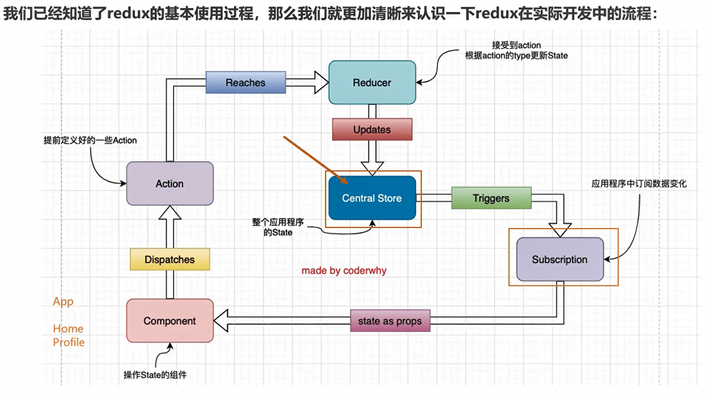
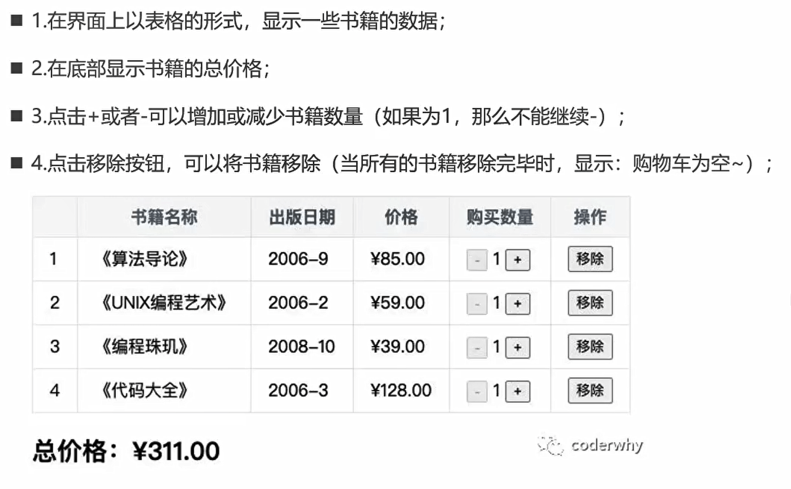

 rpce/rmc【报告memo】

react常用高阶方法：map、filter、reduce、forEach

## 初识React

### react开发依赖

开发React必须依赖三个库：

- react：包含react所必须的核心代码
- react-dom：react渲染在不同平台所需要的核心代码
- babel：将jsx转换成React代码的工具

```html
<!-- 开发依赖的引入 -->
<script crossorigin src="https://unpkg.com/react@18/umd/react.development.js"></script>
<script crossorigin src="https://unpkg.com/react-dom@18/umd/react-dom.development.js"></script>
<!-- bable -->
<script src="https://unpkg.com/babel-standalone@6/babel.min.js"></script>
```

当然我们也可以将其下载下来进行引用


### babel和react的关系

- 默认情况下开发React其实可以不使用babel。
- 但是前提是我们自己使用React.createElement来编写源代码，它编写的代码非常的繁琐和可读性差
- 那么我们就可以直接编写jsx(JavaScript XML)的语法，并且让babel帮助我们转换成React.createElement


### Hello React

在页面上展示hello react

```html
<body>
    <div id="root"></div>

    <!-- 开发依赖的引入 -->
    <script crossorigin src="https://unpkg.com/react@18/umd/react.development.js"></script>
    <script crossorigin src="https://unpkg.com/react-dom@18/umd/react-dom.development.js"></script>
    <!-- bable -->
    <script src="https://unpkg.com/babel-standalone@6/babel.min.js"></script>

    <!-- type="text/babel" 一定要写，否则bable不会去解析jsx的语法 -->
    <script type="text/babel">
    
        // react18之前：ReactDOM.render
        // ReactDOM.render(<h2>hello react</h2>,document.querySelector("#root"))

        // react18之后： 
        const root = ReactDOM.createRoot(document.querySelector("#root"))
        // 里面加上()代表这是一个整体
        root.render((
            <div>
                <h2>hello react</h2>    
                <button>改变文本</button>
            </div>
        ))
    
    </script>
</body>
```


### 小案例一

点击按钮将 hello world 修改为 hello react

```js
<script type="text/babel">

        // 1.将数据定义为一个变量
        let message = "hello world"

        // 2.监听按钮的点击
        function btnClick(){
            // 2.1 修改数据
            message = "hello react"

            // 2.2 在vue中，当我们修改了数据之后，他会动态的渲染出来
            //     在react中，默认是不会的，所有我们需要重新渲染一下
            root.render((
                <div>
                    <h2>{message}</h2>    
                    <button onClick={btnClick}>改变文本</button>
                </div>
            ))
            
        }

        // 在react中，都是使用 一个括号`{}` 来动态的渲染变量，函数也是
        const root = ReactDOM.createRoot(document.querySelector("#root"))
        root.render((
            <div>
                <h2>{message}</h2>    
                <button onClick={btnClick}>改变文本</button>
            </div>
        ))

</script>
```


### hello React — 组件化开发

#### 了解思想

上面的小案例整个逻辑其实可以看做一个整体，那么我们就可以将其封装成一个组件：

- root.render参数是一个HTML元素或者一个组件;
- 所以我们可以先将之前的业务逻辑封装到一个组件中，然后传入到ReactDOM.render函数中的第一个参数;

React中的组件分为两种情况：**类组件和函数式组件**（这里我们先学习类组件）


#### 类组件

##### 实现步骤

- 定义一个类(类名大写，组件的名称是必须大写的，小写会被认为是HTML元素)，继承自React.Component
- 实现当前组件的render函数：render当中返回的jsx内容，就是之后React会帮助我们渲染的内容


##### 数据依赖

- 在组件中的数据，我们可以分成两类：
  - 参与界面更新的数据：当数据变量时，需要更新组件渲染的内容
  - 不参与界面更新的数据：当数据变量时，不需要更新将组建渲染的内容

- 参与界面更新的数据我们也可以称之为是参与数据流，这个数据是定义在当前对象的state中
  - 我们可以通过在**构造函数中this.state = {定义的数据}**
  - 当我们的数据发生变化时，我们可以调用this.setState 来更新数据，并且通知React进行update操作【在进行update操作时，就会重新调用render函数，并且使用最新的数据，来渲染界面】


##### 事件绑定


##### 渲染内容


##### 完整代码

```js
<script type="text/babel">

    // 1.使用组件重构代码（类组件）
    class App extends React.Component {
        // 1.1 组件数据
        constructor(){
            super()
            // 1.1.1 state 名字固定
            this.state = {
                message:'hello world'
            }

            // 提前绑定this
            // this.btnClick = this.btnClick.bind(this)
        }

        // 1.2 组件方法（实例方法）
        btnClick(){
            // 1.2.1 在react中，我们不需要在修改数据之后在手动的渲染，只需要一个操作就可以
            // 1.2.2 但是我们也不能直接调用 this.setState 因为这个时候的this为undefined
            // 1.2.3 解决办法：在调用的时候绑定 render的this。
            // 两次绑定：1.直接在调用的时候绑定 2.在constructor中提前绑定
            this.setState({
                message:"hello react"
            })

            // this.setState 解析：内部做了两件事，1.将state中的值修改掉 2.自动重新执行render函数
            console.log(this);
        }

        // 1.3 渲染内容（固定的：使用render方法）
        // 1.3.1 return 返回什么我们就渲染什么
        render(){
            // this.btnClick.bind(this):直接在调用的时候绑定
            return (
                <div>
                	<h2>{this.state.message}</h2>    
                	<button onClick={this.btnClick.bind(this)}>改变文本</button>
            	</div>
            )
        }
    }

// 2.将组件渲染到页面上
const root = ReactDOM.createRoot(document.querySelector("#root"))
// 2.1 当我们渲染App的时候就会去调用App中的render函数
root.render(<App></App>)

</script>
```


#### 小案例二

展示电影的列表

```js
class App extends React.Component{
    constructor(){
        super()
        this.state = {
            movies:['大话西游','齐天大圣','盗墓笔记','海贼王']
        }
    }

    render(){

        // 1.方式一：for循环
        let values = []
        for (let i = 0; i < this.state.movies.length; i++) {
            const movie = this.state.movies[i];
            const liEL = <li>{movie}</li>
            values.push(liEL)
        }

        //方式二：映射 map方法
        const liEL = this.state.movies.map( movie 对象
            return <li>{movie}</li>
        })

        return (
            <div>
            	<ul>{liEL}</ul>
            </div>
        )
    }

}

const root = ReactDOM.createRoot(document.querySelector('#root'))

root.render(<App></App>)
```


#### 小案例三

计数器

```js
class App extends React.Component{
    constructor(){
        super()
        this.state = {
            message:1,
        }
    }

    add(){
        this.setState({
            message:this.state.message+1
        })
    }

    sup(){
        this.setState({
            message:this.state.message-1
        })
    }


    render(){
        const {message} = this.state
        return (
            <div>
            	<span>{message}</span>  
            	<button onClick={this.add.bind(this)}>+1</button>  
            	<button onClick={this.sup.bind(this)}>-1</button>
            </div>
        )
    }
}


const root = ReactDOM.createRoot(document.querySelector("#root"))
root.render(<App></App>)
```


## React基础

### JSX的书写规范

- JSX的顶层只能有一个根元素，所以我们很多时候会在外层包裹一个div元素(或者使用后面我们学习的Fragment)
- 为了方便阅读，我们通常在jsx的外层包裹一个小括号()，这样可以方便阅读，并且jsx可以进行换行书写
- JSX中的标签可以是单标签，也可以是双标签【注意：如果是单标签，必须以/>结尾】


### JSX的使用

#### JSX的注释

`{ /* 注释 */ }`

```js
render(){
    const {message} = this.state
    return (
        <div>
            { /* 注释 */ }
            <span>{message}</span>  
            <button onClick={this.add.bind(this)}>+1</button>  
            <button onClick={this.sup.bind(this)}>-1</button>
        </div>
    )
}
```


#### JSX嵌入变量作为子元素

- 情况一：当变量是Number、String、Array类型时，可以直接显示
- 情况二：当变量是null、undefined、Boolean类型时，内容为空
  - 如果希望可以显示null、undefined、Boolean，那么需要转成字符串
  - 转换的方式有很多，比如toString方法、和空字符串拼接，String(变量)等方式
- 情况三：Object对象类型**不能作为子元素**(not valid as a React child)


#### JSX绑定属性

**基本属性的绑定**：直接使用`{}`

```jsx
render(){
    // 解构
    const {message, url, titl} = this.state
    return (
        <div>
        	<span title={title}>{message}</span>
    		  
        </div>
    )
}
```


**绑定class属性和style**

- 首先在绑定class的时候react推荐使用className，因为class是一个关键词，使用class不会报错，但会有警告
- 想要实现动态绑定【需要：根据isActive的true和false来动态的添加class active】 

```jsx
render(){
	const { message, isActive } = this.state
	return (
		<div>
			{/* 直接绑定class */}
			<span className="aaa">{message}</span>
			{/* 动态绑定class */}{/* 当我们也可以将这个表达式拆除，在外面计算好 */}
			<span className={ `aaa ${isActive ? 'active' : ''}` }>{message}</span>
			{/* 绑定style属性：绑定对象类型（第二个大括号代表对象） */}
			<span style={{color:"red",fontSize:"30px"}}>{message}</span>
		</div>
	)
}
```


### react事件绑定

#### this绑定

第一种：使用apply直接绑定

```jsx
class App extends React.Component{
    constructor(){
        super()
        this.state = {
            message:100
        }
    }
    foo(){
        console.log("this:",this);
    }
    render(){
        return (
            <div>
                {/* 1.1 将this直接绑定在render中 */}    
                <button onClick={this.foo.bind(this)}>按钮</button>
            </div>
        )
    }
}
```

```jsx
class App extends React.Component{
    constructor(){
        super()
        this.state = {
            message:100
        }
        //1.2 在constructor中绑定一下
        this.foo = this.foo.bind(this)
    }
    foo(){
        console.log("this:",this);
    }
    render(){
        return (
            <div>   
                <button onClick={this.foo}>按钮</button>
            </div>
        )
    }
}
```


第二种绑定：使用箭头函数【箭头函数没有自己的this，向外找，找到App】

```jsx
class App extends React.Component{
    constructor(){
        super()
        this.state = {
            message:100
        }
        this.foo = this.foo.bind(this)
    }
    foo = () =>{
        console.log("this:",this);
    }
    render(){
        return (
            <div>   
                <button onClick={this.foo}>按钮</button>
            </div>
        )
    }
}
```


 第三种绑定：直接传递箭头函数【推荐】

```jsx
class App extends React.Component{
    constructor(){
        super()
        this.state = {
            message:100
        }
    }
    foo(){
        console.log("this:",this);
    }
    render(){
        return (
            <div>
                {/* 直接传递箭头函数:注意理解一下这里需要执行这个函数 */}    
                <button onClick={()=>{this.foo()}}>按钮</button>
            </div>
        )
    }
}
```


#### 事件参数传递

**event参数的传递**

```jsx
class App extends React.Component{
    constructor(){
        super()
        this.state = {
            message:100
        }
    }
    foo(event){
        console.log(event);
    }
    render(){
        return (
            <div>
                {/* 在调用的时候传递一下 */}    
                <button onClick={()=>{this.foo}}>按钮</button>
            </div>
        )
    }
}
```


**传递其他参数**（也推荐使用箭头函数来传参）

```jsx
class App extends React.Component{
    constructor(){
        super()
        this.state = {
            message:100
        }
    }
    foo(event, name, age){
        console.log(event, name, age);
    }
    render(){
        return (
            <div> 
                <button onClick={(event)=>{this.foo(event, "jl", 18)}}>按钮</button>
            </div>
        )
    }
}
```


小案例：一开始列表第一个是红色，后面点击哪个哪个变红

```jsx
class App extends React.Component{
    constructor(){
        super()
        this.state = {
            currentIndex:0,
            movies:['111','222','333','444','555']
        }

    }
    foo(index){
        console.log(index);
        this.setState({
            currentIndex:index
        })
    }
    render(){

        const { movies, currentIndex } = this.state

        return (
            <div>
                <ul className="aa">
                {
                	movies.map((movie, index)=>
                    <li 
                        className={ currentIndex === index ? 'active' : '' }
                        onClick={()=>{this.foo(index)}}
                    >
                        {movie}
                    </li>)
                }       
                </ul>
    		</div>
    	)
    }
}
```


### react条件渲染

```js
class App extends React.Component{
            constructor(){
                super()
                this.state = {
                    message1:"hhh",
                    message2:"hhhddd",
                    isShow:false,
                    friend:{
                        name:'jl',
                        age:18
                    }
                }
            }

            render(){
                const {isShow} = this.state

                let show = null
                if(isShow){
                    show = <h1>{this.state.message1}</h1>
                }else{
                    show = <h1>{this.state.message2}</h1>
                }

                return (
                    <div>
                    	{/* 方式一：根据条件的变量赋值不同的内容 */}   
                        <div>{show}</div>
                    	{/* 方式二：三元运算符 */} 
                    	<div>{ isShow ? <button>开始</button> : <span>请准备</span> }</div>
						{/* 方式三： 逻辑与&& */} 
						{/* 使用场景：当我们从服务器请求数据的时候，一开始friend可能为undefined，使用&&来判断 */}
						<div>{ friend && <span>{friend.name + friend.age}</span> }</div>
                    </div>
                )
            }
        }
```


## React脚手架的使用

- 安装脚手架：`npm install create-react-app -g`【全局安装】
- 安装之后就可以创建react项目了【注意：项目名称**不能包含大写字母**】

- 创建
  - js：`create-react-app 项目名称`

  - ts：`create -react-app 项目名称 --template typescript`

- 打开：`npm start`


## 初始化构建

- 删除src目录下所有的文件和public下除index.html和favicon.ico文件

- 在src下创建index.js文件

  - ```js
    import ReactDOM from 'react-dom/client'
    import App from './App'
    
    const root = ReactDOM.createRoot(document.querySelector("#root"))
    
    root.render(<App></App>)
    ```

- 在src下创建App.jsx

  - ```js
    //引入react
    import React from 'react'
    
    class App extends React.Component{
        constructor(){
            super()
            this.state = {
                message:"kkk"
            }
        }
    
        render(){
            return (
                <div>
                    <h2>{this.state.message}</h2>
                </div>
            )
        }
    }
    
    //导出
    export default App
    ```


## React开发

**【子组件在构造函数中与向外暴露时首字母一定要大写】**

### react组件化

- React的组件相对于Vue更加的灵活和多样，按照不同的方式可以分成很多类组件
  - 根据组件的定义方式，可以分为：**函数组件**(Functional Colmponent)和**类组件**(Class Component)
  - 根据组件内部是否有状态需要维护，可以分成：**无状态组件**(Stateless Component )和**有状态组件**(Stateful Component)
  - 根据组件的不同职责，可以分成：**展示型组件**(Presentational Component)和**容器型组件**(Container Component)
- 这些概念有很多重叠，但是他们最主要是关注数据逻辑和UI展示的分离:
  - 函数组件、无状态组件、展示型组件主要关注UI的展示
  - 类组件、有状态组件、容器型组件主要关注数据逻辑


### 类组件

- 类组件的定义有如下要求:
  - 组件的名称是大写字符开头（无论类组件还是函数组件)
  - 类组件需要继承自React.Component
  - 类组件必须实现render函数

- 使用class类定义
  - 使用class定义一个组件：constructor是可选的，我们通常在constructor中初始化一些数据
  - this.state中维护的就是我们组件内部的数据
  - render()方法是class组件中唯一必须实现的方法

- render函数的返回值【当render 被调用时，它会检查this.props和 this.state的变化并返回以下类型之一】

  - **React元素**：通常通过JSX创建。例如，`<div/>`会被React渲染为DOM节点，`<MyComponent/>`会被React渲染为自定义组件；无论是`<div/>`还是`<MyComponent/>`均为React元素。
  - **数组或fragments**：使得render方法可以返回多个元素。
  - **Portals**：可以渲染子节点到不同的DOM子树中。
  - **字符串或数值类型**：它们在DOM中会被渲染为文本节点
  - **布尔类型或null**：什么都不渲染。

- ```js
  import React from "react"
  
  class HelloWorld extends React.Component{
      constructor(){
          super()
          this.state = {
              message:'hello world'
          }
      }
  
      render(){
          return (
              <div>
                  {this.state.message}
              </div>
          )
      }
  }
  
  export default HelloWorld
  ```


### 函数组件

- **函数组件是使用function来进行定义的函数，只是这个函数会返回和类组件中render函数返回一样的内容。**

- 函数组件有自己的特点（当然，后面我们会讲hooks，就不一样了)：

  - **没有生命周期，也会被更新并挂载，也就是没有生命周期函数**
  - this关键字不能指向组件实例(**因为没有组件实例**)
  - 没有内部状态(state) 

- ```js
  function App_func(){
      //返回值：和类组件中render函数返回的是一致的
      return <h1>app func component</h1>
  }
  
  export default App_func
  ```

- 在函数式组件中调用方法

  - ```jsx
    funtion a(){
    	console.log("a")
    }
    
    funtion b(index){
    	console.log(index)
    }
    
    //没有参数的时候可以直接调用，有参数得用箭头函数
    <button onClick={a}></button>
    <button onClick={()=>{b(1)}}></button>
    ```

  - 


### 生命周期

- **生命周期是一个抽象的概念，在生命周期的整个过程，分成了很多个阶段**
  - 比如装载阶段（Mount)，组件第一次在DOM树中被渲染的过程
  - 比如更新过程(Update)，组件状态发生变化，重新更新渲染的过程
  - 比如卸载过程(Unmount)，组件从DOM树中被移除的过程
- **React内部为了告诉我们当前处于哪些阶段，会对我们组件内部实现的某些函数进行回调，这些函数就是生命周期函数**
  - 比如实现componentDidMount函数:组件已经挂载到DOM上时，就会回调
  - 比如实现componentDidUpdate函数:组件已经发生了更新时，就会回调
  - 比如实现componentWillUnmount函数:组件即将被移除时，就会回调
  - 我们可以在这些回调函数中编写自己的逻辑代码，来完成自己的需求功能
- 我们谈React生命周期时，主要谈的**类的生命周期**，因为函数式组件是没有生命周期函数的（后面我们可以通过hooks来模拟
  一些生命周期的回调)
- 
- 


### 生命周期函数

constructor是属于生命周期中的！

#### constructor

- 如果不初始化 state或不进行方法绑定，则不需要为React组件实现构造函数。
- constructor中通常只做两件事情：
  - 通过给this.state赋值对象来初始化内部的state
  - 为事件绑定实例(this) 【有时候我们的this通过执行箭头函数来改变】


#### componentDidMount

- componentDidMount()会在组件挂载后（插入DOM树中）立即调用
- componentDidMount中通常进行哪里操作呢？
  - 依赖于DOM的操作可以在这里进行
  -  在此处发送网络请求就最好的地方(官方建议)
  - 可以在此处添加一些订阅(会在componentWillUnmount取消订阅)


#### componentDidUpdate

- componentDidUpdate()会在更新后会被立即调用，首次渲染不会执行此方法
  - 当组件更新后，可以在此处对DOM进行操作
  - 如果你对更新前后的props进行了比较，也可以选择在此处进行网络请求;（例如，当props 未发生变化时，则不会执行网络请求)。


#### componentWillUnmount

- componentWillUnmount()会在组件卸载及销毁之前直接调用
  - 在此方法中执行必要的清理操作
  - 例如，清除timer，取消网络请求或清除在componentDidMount()中创建的订阅等


#### 不常用生命周期函数

- getDerivedStateFromProps：state 的值在任何时候都依赖于props时使用;该方法返回一个对象来更新state
- getSnapshotBeforeUpdate：在React更新DOM之前回调的一个函数，可以获取DOM更新前的一些信息（比如说滚动位置)。返回的参数会作为componentDidUpdate的第三个参数
- **shouldComponentUpdate**：该生命周期函数很常用，但是我们等待讲性能优化时再来详细讲解
- 
- 


### 组件通讯

#### 父传子

- 父组件在展示子组件，可能会传递一些数据给子组件
  - 父组件通过属性=值的形式来传递给子组件数据
  - 子组件通过props参数获取父组件传递过来的数据

**父组件**：

```
class App extends React.Component{
    constructor(){
        super()
        this.state = {
            message:"kkk",
            list:['11','22','33','44']
        }
    }

    render(){
        return (
            <div>
                <h2>{this.state.message}</h2>
                <HelloWorld list={this.state.list}/>
            </div>
        )
    }
}
```


**子组件：**

```jsx
class HelloWorld extends React.Component{
    constructor(props){
        //默认在constructor中有props和state，当我们不写也是默认存在的
        super(props)
        this.state = {
            message:'hello world'
        }
    }

    render(){
        //可以打印props，来获取这个值
        console.log(this.props);
        return (
            <div>
                {this.state.message}
            </div>
        )
    }
}
```


**传递对象：**当父组件需要将一个对象传给子组件的时候

```jsx
class App extends React.Component{
    constructor(){
        super()
        this.state = {
            message:"kkk",
            list:['11','22','33','44'],
            info:{
                name:"xjn",
                age:18
            }
        }
    }

    render(){
        
        const {info } = this.state
        
        return (
            <div>
                <h2>{this.state.message}</h2>
                <HelloWorld name={info.name} age={info.age} info={info}/>
                //传递对象我们可以通过展开运算符进行传递
                <HelloWorld {...info}/>
                //我们使用展开运算符就相当于对对象中的属性一个一个传
                //使用info={info}则是将整个对象一起传过去
            </div>
        )
    }
}
```


**参数propTypes**

- 对于传递给子组件的数据，有时候我们可能希望进行验证，特别是对于大型项目来说：

  - 当然，如果你项目中默认继承了Flow或者TypeScript，那么直接就可以进行类型验证
  - 但是，即使我们没有使用Flow或者TypeScript，也可以通过 prop-types库来进行参数验证

- ```js
  // 父组件向子组件传一个数组list
  
  //子组件中：
  // 1.先安装后引入：
  import PropTypes from "prop-types"
  
  // 2.使用：
  HelloWorld.propTypes = {
      list: PropTypes.array
  }
  ```


#### 子传父

- 某些情况，我们也需要子组件向父组件传递消息
  - 在vue中是通过自定义事件来完成的
  - 在React中同样是通过props传递消息，只是让父组件给子组件传递一个回调函数，在子组件中调用这个函数即可


案例：将计数器案例进行拆解，点击的操作在子组件中，改变数组在父组件中

**子组件中**

```js
class App_func extends React.Component{
    add(num){
        this.props.addDD(num)
    }

    render(){
        return (
            <div>
                <button onClick={()=>{this.add(1)}}>+1</button>
                <button onClick={()=>{this.add(5)}}>+5</button>
                <button onClick={()=>{this.add(10)}}>+10</button>
            </div>
        )
    }
}
```


父组件中

```js
class App extends React.Component{
    constructor(){
        super()
        this.state = {
            message:100,
            list:['11','22','33','44']
        }
    }

    chengedMes(num){
        this.setState({
            message:this.state.message+num
        })
    }

    render(){
        return (
            <div>
                <h2>{this.state.message}</h2>
                <HelloWorld list={this.state.list}/>
                <App_func addDD={(num)=>{this.chengedMes(num)}}/>
            </div>
        )
    }
}
```


#### 非父子组件

##### Context

- 非父子组件，如果层级更多的话，一层层传递是非常麻烦，并且代码是非常冗余的
  - React提供了一个API：Context
  - Context 提供了一种在组件之间共享此类值的方式，而不必显式地通过组件树的逐层传递props
  - Context 设计目的是为了共享那些对于一个组件树而言是“全局”的数据，例如当前认证的用户、主题或首选语言
- context相关API
  - React.createContext()：创建共享的对象，有参数，可以设置默认值`React.createContext({name:"hh",age:20})`
  - Context.Provider：订阅共享对象，接受一个value值传递参数。当value发生变化的时候，内部所嵌套的所有消费组件都会重新渲染
  - Class.contextType：将创建的context对象挂载的这个类中，可以在任意生命周期中访问到它，包括render
  - Context.Consumer：类组件、函数式组件都可以通过该方法获取到共享的数据


**在类组件中使用**

```jsx
// App中嵌套Home，Home中嵌套HomeInfo，现在我们需要将App的数据传到HomeInfo中，
// 我们可以通过组件一层一层的传递，也可以通过Context


//1.起一个js文件，创建一个context，并导入
import React from 'react'
const ThemeContext = React.createContext()
export default ThemeContext


// 2.App组件中
{/* 将创建的context包裹我们的组件,其中我们给后代共享的数据都放在value中（记得导入ThemeContext） */}
<ThemeContext.Provider value={info}>
    <Home></Home>
</ThemeContext.Provider>


// 3.HomeInfo组件(类组件)中
// 设置组件的contextType为某一个Context（记得导入ThemeContext）
HomeInfo.contextType = ThemeContext

// 4.获取数据：在render中
console.log(this.context)
```


**在函数式组件中使用**

```jsx
// App中嵌套Home，Home中嵌套HomeInfo，现在我们需要将App的数据传到HomeInfo中，
// 我们可以通过组件一层一层的传递，也可以通过Context


//1.起一个js文件，创建一个context，并导出
import React from 'react'
const ThemeContext = React.createContext()
export default ThemeContext


// 2.App组件中
{/* 将创建的context包裹我们的组件,其中我们给后代共享的数据都放在value中 */}
<ThemeContext.Provider value={info}>
    <Home></Home>
</ThemeContext.Provider>


// 3.HomeInfo组件(函数式组件)中，其实在类组件中也可以使用该方法Consumer
function Fun(){
  return (
    <div>
      <ThemeContext.Consumer>
        {
          value =>{
            console.log(value);
              return <h1>{value}</h1>
          }
        }
      </ThemeContext.Consumer>
    </div>
  )
}
```

```jsx
// 使用useContext

// 在最外面的组件
export const ThemeContext = createContext<any>(null);

export const WidgetContentEdit = (props) => {
    return (
        <ThemeContext.Provider value={[componentStyle, setComponentStyle]}>
        	...
        </ThemeContext.Provider>
    )
}


// 使用的组件：记得导入ThemeContext
const context = useContext(ThemeContext)
// 就可以正常使用了
```


##### 事件总线


### 插槽

- React对于需要插槽的情况非常灵活，有两种方案可以实现
  - 组件的children子元素
  - props属性传递React元素


#### 组件children子元素

在父组件中，子组件的标签里定义我们需要插入的内容：

```js
render(){
    return (
        <div>
            <HelloWorld>
                <button>按钮</button>
                <h2>文本</h2>
                <i>斜体</i>
            </HelloWorld>
        </div>
    )
}
```

然后子组件中，我们可以通过`this.props.children来获取到`标签内部传来的值

```js
render(){
        // console.log(this.props);
        const { children } = this.props
        return (
            <div>
                {children[0]}
                {children[1]}
                {children[2]}
            </div>
        )
    }
```


#### props属性实现

其实就是组件之间的传参：父传子。

通过props，父组件传给子组件，只是这次我们不是传数据，而是标签

**父组件**

```jsx
render(){
    return (
        <div>
            <App_func one={<button>按钮</button>} two={<h2>哈哈哈</h2>}></App_func>
        </div>
    )
}
```

**子组件**

```jsx
render(){
    const { one, two } = this.props
    return (
        <div>
            {one}
            {two}
        </div>
    )
}
```


**通过props我们还可以实现类似于作用域插槽的效果**：

比如，我们父组件给子组件传一个按钮，但是按钮的内容需要子组件的决定，可以通过函数调用的方式，把子组件的参数传给父组件

父组件：

```jsx
render(){
    return (
        <div>
            <App_func 
                {/* 箭头函数还可以简写：one = {info => <button>{info}</button>} */}
                one={(info)=>{ return <button>{info}</button> }} 
                two={<button>普通按钮</button>}>
            </App_func>
        </div>
    )
}
```

子组件

```jsx
constructor(){
    super()
    this.state = {
        message:"这类似于作用域插槽"
    }
}
render(){
    const { one, two } = this.props
    return (
        <div>
            {/* 通过函数调用的方式将参数传给父组件 */}
            {one(this.state.message)}
            {two}
        </div>
    )
}
```


### setState的详细使用

setState有点类似与小程序中setDate({})

#### 基本使用：修改state

```jsx
foo(){
    this.setState({
        message:"修改了message"
    })
}
```


#### 传入回调函数

- 好处一：可以编写一些对新的state处理逻辑
- 好处二：可以获取之前的state和props值

```jsx
foo(){
	this.setState((state, props)=>{
        console.log(state, props)
        // 需要有return返回值，来更新state
        return {
        	message:"修改值"
        }
    })
}
```


#### 异步调用

- setState在react的事件处理中是一个异步调用，他不影响下一步的执行
- 但在开发中，我们希望获取到他更新后的数据来进行一些操作，那么可以再setState中传入第二个参数：callback

```jsx
foo(){
	this.setState({
		message:"已经修改了"
    },()=>{
        console.log(this.state.message)//已经修改了
    })
}
```


### setState设置为异步更新的原因

- setState设计为异步，可以显著的提升性能
  - 如果每次调用setState都进行一次更新，那么意味着render函数会被频繁调用，界面重新渲染，这样效率是很低的
  - 最好的办法应该是获取到多个更新，之后进行批量更新;
- 如果同步更新了state，但是还没有执行render函数，那么state和props不能保持同步
  - state和props不能保持─致性，会在开发中产生很多的问题


## React性能优化

react更新是当props/state发生改变的时候进行更新

### 使用唯一的key


### render函数被调用

- 在以后的开发中，我们只要是修改了App中的数据，所有的组件都需要重新render，进行diff算法，性能必然是很低的
  - 事实上，很多的组件没有必须要重新render
  - 它们调用render应该有一个前提，就是依赖的数据(state、props）发生改变时，再调用自己的render方法
- 如何来控制render方法是否被调用呢？
  - 通过shouldComponentUpdate方法即可

- **shouldComponentUpdate**：该方法有两个参数【该方法返回值是一个boolean类型：返回值为true，那么就需要调用render方法;返回值为false，就不需要调用render方法。默认返回的是true，也就是只要state发生改变，就会调用render方法;】

  - 参数一：newProps修改后，最新的props属性

  - 参数二：newState修改后，最新的state属性

  - ```js
    shouldComponentUpdate(newProps, newState){
        console.log(this.state === newState)//当我们点击修改的时候，比如messge为hhh，点击修改将message还是修改为hhh，返回的仍未false
        if(this.state.message !== newState.message){
            return true
        }
        return false
    }
    ```

- 当我们如果我们在开发中需要一个一个的对象那多繁琐呀。没关系，react已经帮我们实现了。我们选择继承**PureComponent**，而不是继承Component

  - ```jsx
    import React, { PureComponent } from 'react'
    
    export class one extends PureComponent {
      render() {
        return (
          <div>one</div>
        )
      }
    }
    
    export default one
    ```

- 那函数式组件怎么办呢【函数式组件是没有自己的生命周期的，也不继承PureComponent】

  - 方法：使用 `memo`

  - ```jsx
    //原函数式组件：
    function Foo(){
        console.log("fff");
        return <h2>函数式组件</h2>
    }
    
    export default Foo
    ```

  - ```jsx
    //使用memo
    import { memo } from "react"
    
    const newFoo = memo(
        function Foo(){
            console.log("fff");
            return <h2>函数式组件</h2>
        }
    )
    //导出memo的返回值，当然这里我们Foo也可以不写，简写形式：function(){...}
    export default newFoo
    ```


### PureComponent注意事项

当我们在state定义一个数组的时候，当我们继承Component，我们可以直接修改原state来更新state

```js
foo(){
    this.state.info.push('44')
    this.setState({
        info:this.state.info
    })
}
```

但是当我们继承PureComponent的时候，这样写就无法更新。这是state的数据保持不可变性。也就是我们不要直接修改state的数据，我们可以通过拷贝的方式来定义一个新的数组，修改新的数据将其赋值

```js
foo(){
    let newInfo = [...this.state.info]
    newInfo.push('44')
    this.setState({
        info:newInfo
    })
}
```


## React组件化

### ref获取原生的DOM

#### 方式一：refs(不推荐)

但是这个方法不推荐使用

```jsx
foo(){
    console.log("ddd");
    console.log(this.refs.why);
}

render(){
    return (
        <div>
            <h1 ref='why'>hello world</h1>
            <button onClick={()=>{this.foo()}}>获取原生的DOM</button>
        </div>
    )
}
```


#### 方式二：导入函数createRef(推荐)

我们可以提前创建一个createRef（一般是在constructor中创建，并且它不涉及的界面的刷新和渲染）

```jsx
import React, { PureComponent, createRef } from 'react'

export class One extends PureComponent {
    constructor(){
        super()
        this.state = {
            message:"hello world"
        }
        // 2.创建并绑定
        this.titleRef = createRef()
    }

    foo(){
        // 3.调用
        console.log(this.titleRef.current);
    }

    render() {
        
        const {message} = this.state

        return (
            <div>
                {/* 1.定义ref */}
                <h1 ref={this.titleRef}>{message}</h1>
                <button onClick={()=>{this.foo()}}>获取原生DOM</button>
            </div>
        )
    }
}

export default One
```


#### 方式三：传入函数(了解)

我们传入回调函数，回调函数的第一个参数就是原生DOM

```jsx
export class One extends PureComponent {
    constructor(){
        super()
        this.state = {
            message:"hello world"
        }
        // 1.定义赋值的变量
        this.titleEl = null
    }

    foo(){
        // 3.调用
        console.log(this.titleEl);
    }

    render() {
        
        const {message} = this.state

        return (
            <div>
                {/* 定义函数：这样定义我们在刷新的时候就可以获取到。那然后设置点击的时候获取呢？赋值 */}
                {/* <h1 ref={(e)=>{console.log(e);}}>{message}</h1> */}
                {/* 2.定义ref并将参数赋值给定义的变量 */}
                <h1 ref={(el)=>{this.titleEl = el}}>{message}</h1>
                <button onClick={()=>{this.foo()}}>获取原生DOM</button>
            </div>
        )
    }
}
```


### ref获取组件实例

- 类组件还是和获取DOM一样，但是我们还是推荐使用方式二：导入函数createRef

- **当然ref也不能作用于函数式组件，因为函数式组件没有实例，所有不能获取到对应的组件对象**。但是在我们开发过程中我们确实想要获取函数式组件中的某一个元素【我们也只能绑定函数式组件所返回的jsx中的某一个元素】

  - 解决办法：在函数是组件中引入`forwardRef`

  - ```jsx
    //函数式组件
    import { forwardRef } from "react"
    
    const newFoo = forwardRef(
        //接受父组件传来的参数ref（参数是第二个参数）
        function Foo(props, ref){
            console.log(props, ref);
            return <h2 ref={ref}>函数式组件</h2>
        }
    )
    
    export default newFoo
    ```

  - ```jsx
    //父组件中
    class App extends React.Component{
        constructor(){
            super()
            this.state = {
                message:'hello world'
            }
            this.refFoo = createRef()
        }
    
        foo(){
            console.log(this.refFoo.current);
        }
    
        render(){
            return (
                <div>
                   <button onClick={()=>{this.foo()}}>获取函数式组件实例中的某一个元素</button>
                   <Foo ref={this.refFoo}></Foo>
                </div>
            )
        }
    }
    ```


### 受控组件和非受控组件

#### 受控组件

- 在HTML中，表单元素(如`<input>、<textarea>和<select>`）之类的表单元素通常自己维护state（也就是value），并根据用户输入进行更新。

- 而在React中，可变状态(mutable state)通常保存在组件的state属性中，并且只能通过使用setState()来更新

  - 我们将两者结合起来，使React的state成为“唯一数据源”

  - 渲染表单的React组件还控制着用户输入过程中表单发生的操作

  - 被React 以这种方式控制取值的表单输入元素就叫做“受控组件”【设置了value、checked就变成了受控组件】

  - **意思是类似于input这样的组件(受控组件)，我们设置了value属性，就必须要设置 onChange 来这个属性值**

    - ```jsx
      constructor(){
          super()
          this.state = {
              message:''
          }
      }
      
      foo(e){
          console.log(e.target.value);
          this.setState({
              message:e.target.value
          },()=>{
              console.log("aa:"+this.state.message);
          })
      }
      
      render(){
          return (
              <div>
                  <input type="text" value={this.state.message} onChange={(e)=>{this.foo(e)}}/>
              </div>
          )
      }
      ```

- **当我们设置一些表单的提交按钮的时候，我们需要阻止其默认行为**：`event.preventDefault()`

- 当我们的input输入框有多个的时候【比如有用户名，密码表单】，我们可以通过一个函数来收集所有的信息，而不是每一个表单定义一个函数：【当然前提我们表单的名字需要和state中设置的名字一样】

  - ```jsx
    constructor(){
        super()
        
        this.state = {
            name:"",//设置的state需要和input中的name相同
            password:""
        }
    }
    
    handleSubmitClick(event){
        // 1.阻止默认行为
        event.preventDefault()
        // 2.获取表单数据
    	console.log(this.state.name)
        console.log(this.state.password)
    }
    
    handleInputChange(event){
        this.setState({ 
            [event.target.name]:event.target.value
        })
    }
    
    render(){
        return (
        	<div>
            	<from onSubmit={(e)=>{this.handleSubmitClick(e)}}>
                	<input type='text' name='name' onChange={e => this.handleInputChange(e)}/>
                    <input type='password' name='password' onChange={e => this.handleInputChange(e)}/>
                    <button type="submit">提交</button>
                </from>
            </div>
        )
    }
    ```

- **input输入框中 text绑定value，checkbox、radio绑定checked**，当然在取的时候是`event.target.checked`

- 但是对于**checkbox**多选框来取数据其实是很麻烦的，这里给出方法

  - ```jsx
    constructor(){
        super()
    
        this.state = {
            //定义数组来初始化我们的这个checkbox
            hobbies:[
                { value:"sing", text:"唱", isChecked:false },
                { value:"dance", text:"跳", isChecked:false },
                { value:"rap", text:"rap", isChecked:false },
            ]
        }
    }
    
    checkBox(e, index){
        // 拷贝
        const hobbies = [...this.state.hobbies]
        // 赋值
        hobbies[index].isChecked = e.target.checked
        // 渲染
        this.setState({
            hobbies:hobbies
        })
        console.log('获取选中的爱好：',hobbies.filter(item => item.isChecked).map(item => item.value));
    }
    
    render(){
        const {hobbies} = this.state
    
        return (
            <div>
                <span>您的爱好：</span>
                {
                    hobbies.map( (hobby, index) =>{
                        return (
                            <label htmlFor={hobby.value} key={hobby.value}>
                                <input 
                                    type="checkbox" 
                                    // 多选框是 checked
                                    checked={hobby.isChecked} 
                                    id={hobby.value} 
                                    // 定义 onChange 来改变数据
                                    onChange={ (e)=>{this.checkBox(e, index)} }/>
                                <span>{hobby.text}</span>
                            </label>
                        )
                    })
                }
            </div>
        )
    }
    ```

- 这里给出**select**设置为受控组件的代码

  - ```jsx
    //当我们的select为单选的时候，其操作和text是一样的
    constructor(){
        super()
        this.state = {
            fruit:"orange"
        }
    }
    
    foo(e){
        console.log(e.target.value);
        this.setState({
            fruit:e.target.value
        })
    }
    
    render(){
        const { fruit } = this.state
    
        return (
            <div>
                <select value={fruit} onChange={(e) => { this.foo(e) }}>
                    <option value="apple">苹果</option>
                    <option value="orange">橘子</option>
                    <option value="banana">香蕉</option>
                </select>
            </div>
        )
    }
    ```

  - ```jsx
    //当我们给select标签添加上 multiple 的时候，他就变成了多选了：
    constructor(){
        super()
        this.state = {
            fruit:["orange"]
        }
    }
    
    foo(e){
        //取到e.target.selectedOptions（类数组）的数据，将其变为数组
        const options = Array.from(e.target.selectedOptions)
        const value = options.map( option => option.value)
        this.setState({
            fruit:value
        },()=>{
            console.log(this.state.fruit);
        })
    }
    
    render(){
        const { fruit } = this.state
    
        return (
            <div>
                <select value={fruit} onChange={(e) => { this.foo(e) }} multiple>
                    <option value="apple">苹果</option>
                    <option value="orange">橘子</option>
                    <option value="banana">香蕉</option>
                </select>
            </div>
        )
    }
    ```


#### 非受控组件

- 不受控组件就是设置 value、checked等来给其设置默认值

- React推荐大多数情况下使用受控组件来处理表单数据：
  - 一个受控组件中，表单数据是由React组件来管理的;
  - 另一种替代方案是使用非受控组件，这时表单数据将交由DOM节点来处理;
  
- **如果要使用非受控组件中的数据，那么我们需要使用ref 来从DOM节点中获取表单数据。**
  - 使用ref来获取input元素
  
- 在`<input type="checkbox">和<input type="radio">`使用defaultChecked，`<select>和<textarea>`使用defaultValue。

- ```jsx
  <input type="checkbox" defaultChecked={value}>
  <select defaultValue={value}></select>
  ```

  


### 高阶组件

#### 认识高阶组件

- 高阶函数的定义：至少满足以下条件之一【JavaScript中比较常见的filter、map、reduce都是高阶函数】
  - 接受一个或多个函数作为输入
  - 输出一个函数
- 那么说明是高阶组件呢？
  - 高阶组件的英文是 Higher-Order Components，简称为**HOC**
  - 官方的定义：高阶组件是参数为组件，返回值为新组件的函数
- 我们可以进行如下的解析：
  - 首先，高阶组件本身不是一个组件，而是一个函数
  - 其次，这个函数的参数是一个组件，返回值也是一个组件
- 当然，HOC也有自己的一些缺陷:
  - HOC需要在原组件上进行包裹或者嵌套，如果大量使用HOC，将会产生非常多的嵌套，这让调试变得非常困难
  - HOC可以劫持props，在不遵守约定的情况下也可能造成冲突;
- Hooks的出现，是开创性的，它解决了很多React之前的存在的问题比如this指向问题、比如hoc的嵌套复杂度问题等等


#### 应用场景

**注入props属性**

```jsx
function enhancedUserInfo(originComponent){
    class NewComponent extends PureComponent{
		super()
        this.state = {
            info:{
                name:"xjn",
                age:18
            }
        }
    }
    
    render(){
		return <originComponent {...this.state.info}></originComponent>
    }
}

//当然在场景中我们一般还加上 {...this.props}这是因为在传递数据的时候，别的组件传数据会经过这里
<originComponent {...this.state.info} {...this.props}></originComponent>
```


**context**

```jsx
//有时候我们使用context在代码中不够优雅，我们可以使用高阶组件对其进行一次封装
<ThemeContext.Consumer>
    {
        value =>{
            console.log(value);
            return <h1>{value}</h1>
        }
    }
</ThemeContext.Consumer>

//封装
function withTheme(OriginComponent){
    function aa(props){}
    return aa
}
//简写：函数式组件，当然类组件也是可以的
function withTheme(OriginComponent){
    return (props)=>{
        return (
        	<ThemeContext.Consumer>
                {
                    value =>{
                        return <OriginComponent {...value}/>
                    }
                }
            </ThemeContext.Consumer>
        )
    }
}

//在使用的组件中
class Produce extends PureComponent{
    render(){
        return (
        	<div>
            	value:{this.props.value}
            </div>
        )
    }
}

export default withTheme(Produce)
```


### Portals

Portal 提供了一种将子节点渲染到存在于父组件以外的 DOM 节点的优秀的方案。

```jsx
ReactDOM.createPortal(child, container)
```

第一个参数（`child`）是任何可渲染的 React 子元素，例如一个元素，字符串或 fragment。第二个参数（`container`）是一个 DOM 元素。

```jsx
import React, { PureComponent } from 'react'
//导入依赖
import { createPortal } from 'react-dom'

export class One extends PureComponent {
  render() {
    return (
        // 使用,将这个标签渲染到 app中，而不是root中
      createPortal(<h1>ddd</h1>,document.querySelector("#app"))
    )
  }
}

export default One
```


### Fragment

我们在渲染数据的时候，在最外层都需要包裹一个根标签`div`，但是有时候我们也不需要要这个div，我们可以使用`Fragment`，类似于vue中的`template`。【但是我们还是推荐大家包裹一个div的】

```jsx
import React, { PureComponent, Fragment } from 'react'

export class App extends PureComponent {
  render() {
    return (
      <Fragment>
        <h1>对对对</h1>
      </Fragment>
    )
  }
}

export default App
```

Fragment还有语法糖，可以直接将其省略【但是当我们需要在这个标签上绑定key的情况下就不能省略】

```jsx
import React, { PureComponent, Fragment } from 'react'

export class App extends PureComponent {
  render() {
    return (
        //直接写两个括号就是 Fragment的语法糖
      <>
        <h1>对对对</h1>
      </>
    )
  }
}

export default App
```


### 严格模式 - StrictMode

- StrictMode是一个用来突出显示应用程序中潜在问题的工具【也可以为部分组件开启】
  - 与Fragment 一样，StrictMode不会渲染任何可见的Ul
  - 它为其后代元素触发额外的检查和警告
  - 严格模式检查仅在开发模式下运行;它们不会影响生产构建
- 严格模式的检查
  - 识别不安全的生命周期
  - 使用过时的ref APl
  - 检查意外的副作用
    - 这个组件的constructor会被调用两次
    - 这是严格模式下故意进行的操作，让你来查看在这里写的一些逻辑代码被调用多次时，是否会产生一些副作用
    - 在生产环境中，是不会被调用两次的

- 步骤：
  - 导入：`import { StrictMode } from 'react'`
  - 包裹你需要开启严格模式的组件：`<StrictMode><One></One></StrictMode>`


## React过渡动画

### react-transition-group

推荐库：react-transition-group。【由社区维护，需要额外安装：`npm install react-transition-group`】

- react-transition-group主要包含**四个组件**
  - **Transition**
    - 该组件是一个和平台无关的组件（不一定要结合CSS)
    - 在前端开发中，我们一般是结合CSS来完成样式，所以比较常用的是CSSTransition
  - **CSSTransition**：在前端开发中，通常使用CSSTransition来完成过渡动画效果
  - **SwitchTransition**：两个组件显示和隐藏切换时，使用该组件
  - **TransitionGroup**：将多个动画组件包裹在其中，一般用于列表中元素的动画;


### CSSTransition

- CSSTransition是基于Transition组件构建的，使用：`inport {CSSTransition} from 'react-transition-group'`

- CSSTransition执行过程中，有三个状态:appear、enter、exit;

- 它们有三种状态，需要定义对应的CSS样式：【设置className为why，则是 .why-appear】

  - 第一类：开始状态，对于的类是 -appear、-enter、exit
  - 第二类：执行动画，对应的类是 -appear-active、-enter、-active、-exit-active
  - 第三类：执行结束，对应的类是 -appear-done、-enter-done、-exit-done

- CSSTransition常见属性：

  - **classNames**：设置class
  - **in**：触发进入或退出的状态（就是设置初始是true还是false）
    - 当in为true时，触发进入状态，会添加-enter、-enter-acitve的class开始执行动画，当动画执行结束后，会移除两个class，并且添加-enter-done的class
    - 当in为false时，触发退出状态，会添加-exit、-exit-active的class开始执行动画，当动画执行结束后，会移除两个class，且添加-enter-done的class
  - **unmountOnExit={true}**：为该组件在执行退出动画结束后被移除
  - **timeout**：**必设的**，决定类什么时候移除，开发中设置与过渡动画时间相同
  - **appear**：是否在初次进入添加动画(需要和in同时为true，这个appear才会生效)

- CSSTransition对应的钩子函数：主要为了检测动画的执行过程来完成一些JavaScript的操作

  - ...

- ```jsx
  <CSSTransition in={isShow} unmountOnExit={true} classNames="code" timeout={2000}>
              <h1>哈哈哈</h1>
          </CSSTransition>
  ```


### SwitchTransition

- SwitchTransition可以完成两个组件之间切换的炫酷动画：

  - 比如我们有一个按钮需要在on和off之间切换，我们希望看到on先从左侧退出，off再从右侧进入
  - 这个动画在vue中被称之为vue transition modes
  - react-transition-group中使用SwitchTransition来实现该动画

- SwitchTransition中主要有一个属性：**mode**，有两个值

  - in-out：表示新组件先进入，旧组件再移除
  - out-in：表示就组件先移除，新组建再进入【一般我们使用这个】

- 如何使用SwitchTransition呢?

  - SwitchTransition组件里面要有CSSTransition或者Transition组件，不能直接包裹你想要切换的组件;
  - SwitchTransition里面的CSSTransition或Transition组件不再像以前那样接受in属性来判断元素是何种状态，取而代之的是key属性，且要根据 tue和false 来切换这个key 值

- ```jsx
  <SwitchTransition mode='out-in'>
      <CSSTransition key={isLogin ? 'exit' : 'login'} classNames="login" timeout={1000}>
          <button onClick={() => {this.setState({ isLogin: !this.state.isLogin })}}>
              { isLogin ? "退出" : "登录" }
          </button>
      </CSSTransition>
  </SwitchTransition>
  ```


### TransitionGroup

也是在 TransitionGroup 内包裹 CSSTransition 使用


## React中编写CSS

### 内联样式

- 内联样式是官方推荐的一种css样式的写法：

  - style 接受一个采用小驼峰命名属性的JavaScript**对象**，而不是CSS字符串

  - 并且可以引用state中的状态来设置相关的样式

  - ```jsx
    render(){
        return (
        	<div style={ { color:"red";fontSize:"30px" } }>哈哈哈</div>
        )
    }
    ```

- 内联样式的优点:
  - 内联样式,样式之间不会有冲突
  - 可以动态获取当前state中的状态
- 内联样式的缺点:
  - 写法上都需要使用驼峰标识
  - 某些样式没有提示
  - 大量的样式,代码混乱
  - 某些样式无法编写(比如伪类/伪元素)


### 普通CSS

- 就是我们编写一个单独的css文件，然后用`import`进行引入【`import './style.css'`】
- 这种编写方式最大的问题是样式之间会相互层叠掉


### CSS modules【推荐】

- css modules并不是React特有的解决方案，而是所有使用了类似于webpack配置的环境下都可以使用的。
  - 如果在其他项目中使用它，那么我们需要自己来进行配置，比如配置webpack.config.js中的modules: true等。
- React的脚手架已经内置了css modules的配置:
  - .css/.less/.scss 等样式文件都需要修改成.module.css/.module.less/.module.scss等【**比如我们之前定义的为style.css，现在需要定义为 style.module.css**】
  - 之后就可以引用并且进行使用了【引入：`import Home from './Home.module.css'`】
- css modules确实解决了局部作用域的问题，也是很多人喜欢在React中使用的一种方案。
- 但是这种方案也有自己的缺陷:
  - 引用的类名，不能使用连接符(.home-title)，在JavaScript中是不识别的
  - 所有的className都必须使用{style.className}的形式来编写
  - 不方便动态来修改某些样式，依然需要使用内联样式的方式


### less

- 在react中，修改其配置的webpack，我们一般用一个工具craco（create-react-app config）
- 安装：`npm install @craco/craco`【安装失败可能是版本太新的问题，使用`npm install @craco/craco@alpha`】
- 使用

  - 修改package.json里的配置，我们不能在使用react-script进行启动

    - ```js
      "scripts": {
          "start": "craco start",
          "build": "craco build",
          "test": "craco test",
          "eject": "react-scripts eject"
        },
      ```

    - 

  - 创建一个文件：craco.config.js


### CSS_in_JS【推荐】

#### 介绍

- "CSS-in-JS”是指一种模式，其中CSS由JavaScript生成而不是在外部文件中定义。注意此功能并不是 React 的一部分，而是**由第三方库提供**。React 对样式如何定义并没有明确态度。
- 在传统的前端开发中，我们通常会将结构(HTML)、样式(CSS)．逻辑(JavaScript)进行分离。
  - 但是在前面的学习中，我们就提到过，React的思想中认为逻辑本身和UI是无法分离的，所以才会有了JSX的语法
  - 样式呢?样式也是属于UI的一部分
  - 事实上CSS-in-JS的模式就是一种将样式(CSS)也写入到JavaScript中的方式，并且可以方便的使用JavaScript的状态
  - 所以React有被人称之为All in JS

- **批评声音虽然有，但是在我们看来很多优秀的CSS-in-JS的库依然非常强大、方便:**
  - CSS-in-JS通过JavaScript来为CSS赋予一些能力，包括类似于CSS预处理器一样的样式嵌套、函数定义、逻辑复用、动态修改状态等等;
  - 虽然CSS预处理器也具备某些能力，但是获取动态状态依然是一个不好处理的点
  - 所以，目前可以说CSS-in-JS是React编写CSS最为受欢迎的一种解决方案

- 目前比较流行的CSS-in-JS的库：
  - **styled-components**【安装：`npm install styled-components`】
  - emotion
  - ...


#### styled-components

**styled-components的使用步骤**

- 安装：`npm install styled-components`

- 创建一个js文件（对就是js文件）【比如创建style.js】

- 在js中编写代码【为了方便在js中开发这个css的样式，styled-components在vscode中有一个插件：`vscode-styled-components`】【也支持less的写法】【在内部也可以继续抽取】

  - ```js
    //导入
    import styled from 'styled-components'
    
    // div``：模板字符串，调用函数,返回组件
    export const AppWrapper = styled.div`
        .a{
            color:red;
            font-size: 30px;
            
            .b{
                background-color: aliceblue;
    
                &:hover{
                    border: 1px solid red;
                }
            }
        }
    `
    ```
  
- 在jsx中引入：`import { AppWrapper } from '../cssInJs/style'`

- 在需要的样式外层包裹引入的js标签

  - ```jsx
    render() {
        return (
            <AppWrapper>
                <div className='a'>
                    <span>aaa</span>
                    <div className='b'>bbbb</div>
                </div>
            </AppWrapper>
        )
    }
    ```


#### css的参数来自js/state

```jsx
constructor(){
	this.state = {
        size:30,
        color:"red"
    }
}

render() {
    
    const { size, color } = this.state
    
    return (
        // 我们在上面说了，AppWrapper是一个组件，所以可以通过组件传参的方式进行传递
        <AppWrapper size={size} color={color}>
            <div className='a'>
                <span>aaa</span>
                <div className='b'>bbbb</div>
            </div>
        </AppWrapper>
    )
}

//这个时候，我们的css in js已经接收到了数据了，接收的数据也在props中
import styled from 'styled-components'

export const AppWrapper = styled.div`
    .a{
        color:${ props => props.color };
        font-size: ${ props => props.size }px;
    }
`
```

```js
//同时我们也可以设置默认值来处理用户没有传值的情况
export const AppWrapper = styled.div.attrs(props =>{
    return {
        tColor: props.color || 'blue'
    }
})`
    .a{
        color:${ props => props.tColor };
    }
`
```

```js
//但是一般情况下我们使用attrs还是比较少的，一般在单独的文件引入变量
// 我们定义一个js文件夹，在里面定义我们的常量
export const primaryColor = '#ff8800'
export const secondColor = '#ff7788'

//在我们的css in js中
// 1.先导入上述的文件
import { primaryColor,secondColor } from '..'

// 2.使用
export const AppWrapper = styled.div`
    .a{
        color:${ primaryColor };
    }
`
```


#### css in js 继承

```jsx
const btnStyle = styled.button`
	border:1px solid black
`

//继承
const A = styled(btnStyle)``
```


## Redux

### js纯函数

**纯函数的定义**：

- 确定输入一定产生确定的输出
- 函数在执行过程中不能产生副作用【副作用的概念，表示在执行一个函数时，除了返回函数值之外，还对调用函数产生了附加的影响，比如修改了全局变量，修改参数或者改变外部的存储】


**作用和优势**

- 因为你可以安心的编写和安心的使用
- 你在写的时候保证了函数的纯度，只是单纯实现自己的业务逻辑即可，不需要关心传入的内容是如何获得的或者依赖其他的外部变量是否已经发生了修改
- 你在用的时候，你确定你的输入内容不会被任意篡改，并且自己确定的输入，一定会有确定的输出


React中就要求我们无论是函数还是class声明一个组件，这个组件都必须像纯函数一样，保护它们的props不被修改


### redux的由来

- 管理不断变化的state是非常困难的：
  - 状态之间相互会存在依赖，一个状态的变化会引起另一个状态的变化, View页面也有可能会引起状态的变化
  - 当应用程序复杂时，state在什么时候，因为什么原因而发生了变化，发生了怎么样的变化，会变得非常难以控制和追踪
- React是在视图层帮助我们解决了DOM的渲染过程，但是State依然是留给我们自己来管理:
  - 无论是组件定义自己的state，还是组件之间的通信通过props进行传递;也包括通过Context进行数据之间的共享
  - React主要负责帮助我们管理视图，state如何维护最终还是我们自己来决定
- **Redux就是一个帮助我们管理State的容器: Redux是JavaScript的状态容器，提供了可预测的状态管理**
- **安装redux**：`npm install redux`（一般我们使用react-redux:`npm install react-redux`，详细看下文）


### redux核心概念

#### store

- 管理数据
- 使用reducer将数据存到这个store中


#### action

- **Redux要求我们通过action来更新数据**

  - 所有数据的变化，必须通过派发(dispatch) action来更新【`store.dispatch`】
  - action是一个普通的JavaScript对象，用来描述这次更新的type和content

- 比如下面就是几个更新friends的action：

  - 强制使用action的好处是可以清晰的知道数据到底发生了什么样的变化，所有的数据变化都是可跟追、可预测的

  - 当然，目前我们的action是固定的对象

  - 真实应用中，我们会通过函数来定义，返回一个action

  - ```jsx
    const action1 = { type:"...", info:{ name:"jl", age:20 } }
    ```


#### reducer

- 但是如何将state和action联系在一起呢？答案就是**reducer**
  - reducer是一个纯函数
  - reducer做的事情就是将传入的state和action结合起来生成一个新的state
  - ```jsx
    function reducer(state, action){
    	//这个返回新的对象，不能直接使用state.name = action.name
    	return { ...state, name:action.}
    
    	//这里返回新的state
    	// return state
    }
    
    //当我们想要修改东西的时候，我们使用store.dispatch来派发一个action，派发给reducer，且派发给reducer的第二个参数
    store.dispatch(type:"...", info:{ name:"jl", age:20 })
    ```


### redux的三大原则

- **单一数据源**
  - 整个应用程序的state被存储在一颗object tree中，并且这个object tree只存储在一个store中
  - Redux并没有强制让我们不能创建多个Store，但是那样做并不利于数据的维护
  - 单一的数据源可以让整个应用程序的state变得方便维护追踪、修改
- **State是只读的**
  - 唯一修改State的方法一定是触发action，不要试图在其他地方通过任何的方式来修改State
  - 这样就确保了View或网络请求都不能直接修改state，它们只能通过action来描述自己想要如何修改state
  - 这样可以保证所有的修改都被集中化处理，并且按照严格的顺序来执行，所以不需要担心race condition(竟态)的问题
- **使用纯函数来执行修改**
  - 通过reducer将旧state和actions联系在一起，并且返回一个新的State
  - 随着应用程序的复杂度增加，我们可以将reducer拆分成多个小的reducers，分别操作不同state tree的一部分
  - 但是所有的reducer都应该是纯函数，不能产生任何的副作用


### redux结构划分

如果我们将所有的逻辑代码写到一起，那么当redux变得复杂时代码就难以维护。

所以我们将store、reducer、action、constants拆分成一个个文件。

- 创建**store/index.js**文件：定义外部接口【作用就是创建store并将reducer导入】
- 创建**store/reducer.js**文件：定义reducer操作函数【就定义初始化值+操作函数】
- 创建**store/actionCreators.js**文件：创建action
- 创建**store/constants.js**文件：定义一些基本的常量


### redux的使用流程-理论

- 创建一个对象，作为我们要保存的状态
- 创建Store来存储这个state
  - 创建store时必须创建reducer
  - 我们可以通过`store.getState()`来获取当前的state
- 通过dispatch派发一个action来修改state（这个action会放到reducer函数的第二个参数中）
  - 通过dispatch来派发action
  - 通常action中都会有type属性，也可以携带其他的数据
- 修改reducer中的处理代码
  - 这里一定要记住,reducer是一个纯函数，不需要直接修改state
  - 后面会讲到直接修改state带来的问题
- 可以在派发action之前，监听store的变化




### redux的使用流程-实践

#### 基础版

- 第一步：创建一个store/index.js

  - ```js
    //导入
    import { createStore } from "redux"
    //使用，createStore要求我们必须要传一个reducer（纯函数）
    const store = createStore()
    //导出
    export default store
    ```

- 第二步：创建store/reducer.js

  - ```jsx
    //初始化数据，一般这个初始化的数据是会在作为初始值的时候用一次
    const initialState = {
        count:0
    }
    
    //定义reducer函数:两个参数【只要我们调用了store.dispatch就会执行该函数】
    // 第一个是上一次保存的state，在第一次的时候是undefined，所以我们给他添加初始化值，第二次可以返回之前的state
    // 第二个参数是action，dispatch派发的action就传到了这里
    // 返回值会作为之后存储的state
    function reducer(state = initialState, action){
        //判断action的类型来决定进行什么操作
        switch (action.type) {
            case value:
                
                break;
        
            default:
                return state
        }
    }
    
    //导出
    export default reducer
    ```

- 第三步：在index.js中导入reducer并使用

  - ```js
    import { createStore } from "redux"
    //导入reducer
    import reducer from "./reducer"
    //使用reducer
    const store = createStore(reducer)
    export default store
    ```

- 第四步：创建store/actionCreators.js，定义操作state数据的函数

  - ```js
    const addNumAction = (num) =>({
        type:'xxx',
        num
    })
    
    const subNumAction = (num) =>({
        type:'yyy',
        num
    })
    
    export { addNumAction, subNumAction }
    ```

- 第五步：创建store/constants.js，将我们的 type 类型的变量定义为一个常量

  - ```js
    export const ADD_NUM = "add_num"
    export const SUB_NUM = "sub_num"
    ```

- 第六步：在store/actionCreators.js 和 reducer.js中引入

  - ```js
    // actionCreators.js
    
    // 导入：使用 * 重命名 导入
    import * as actionTypes from './constants'
    
    // 使用
    export const addNumAction = (num) =>({
        type:actionTypes.ADD_NUM,
        num:num
    })
    
    export const subNumAction = (num) =>({
        type:actionTypes.SUB_NUM,
        num//对象增强
    })
    ```

  - ```js
    // reducer.js
    
    // 导入：使用 * 重命名 导入
    import * as actionTypes from './constants'
    
    const initialState = {
        num:100
    }
    
    //两个参数：一个目前保存的state，一个是actionCreators.js派发来的action操作函数
    function reducer(state = initialState, action){
        //判断action的类型来决定进行什么操作
        switch (action.type) {
            case actionTypes.ADD_NUM:
                // 为了表示他是一个纯函数，不要直接修改原数据，先进行一个浅拷贝
                // 返回值会作为store之后存储的state
                return { ...state, num: state.num + action.num }
            case actionTypes.SUB_NUM:
                return { ...state, num: state.num - action.num }
            default:
                return state
        }
    }
    
    export default reducer
    ```

  - 在这里我们来解析一下store/actionCreators.js 和 reducer.js是怎么联系的【两者之间并没有导入呀，怎么联系】

    - **在我们操作数据的时候，我们会派发数据，`dispatch(addNumAction(num)`，我们操作的是actionCreators.js中的操作函数，派发一个对象来进行修改，addNumAction这个action已经被派发出去了，那派发到哪里呢。他放到了我们 reducer.js中reducer函数中的第二个参数**

- 第七步：使用

  - ```jsx
    //组件中：【前提先导入store在文件夹store中】
    componentDidMount(){
        store.subscribe(()=>{
            const state = store.getState()
            this.setState({
    			count:state.count
            })
        })
    }
    ```


#### react-redux

在基础版中使用需要添加什么派发、订阅、取消订阅什么的，比较繁琐，开发中一般将其封装为一个高阶组件，当我们现在也不需要我们封装，我们使用别人的就好。组件库：`react-redux(安装：npm install react-redux)`

- **注册**：因为我们的每一个组件都可以会用到redux，但我们只要注册一次就好，在全局index.js中注册并使用

  - ```js
    import ReactDOM from 'react-dom/client'
    import App from './App'
    // 引用react-redux和仓库
    import { Provider } from 'react-redux'
    import store from './store'
    
    const root = ReactDOM.createRoot(document.querySelector("#root"))
    
    root.render(
        // 使用
        <Provider store={store}>
            <App></App>
        </Provider>
    )
    ```

- **取数据**：用我们 connect 函数的第一个参数

  - ```jsx
    import React, { PureComponent } from 'react'
    import { connect } from "react-redux"
    
    export class One extends PureComponent {
      render() {
        // 定义mapStateToProps之后，我们的props中就会多出从state中映射来的数据
        const { num } = this.props
    
        return (
          <div>
            <div>当前计数：{num}</div>
          </div>
        )
      }
    }
    
    // connect的返回值是一个高阶组件，所以是两个小括号
    // 第二个小括号表示映射store中哪些数据（store中有很多的数据，你需要哪个）。他的参数是两个函数
    // 第一个函数：告诉我，你想映射state中的哪个对象，我们并不需要store中的所有数据
    
    // function mapStateToProps(state){
    //   return {
    //     num: state.num
    //   }
    // }
    
    // mapStateToProps箭头函数写法
    const mapStateToProps = (state) => ({
      num: state.num
    })
    
    export default connect(mapStateToProps, fn2)(One)// 第二个小括号传入自身组件
    ```

- **操作数据/存数据**： 用我们 connect 函数的第二个参数

  - ```jsx
    import React, { PureComponent } from 'react'
    import { connect } from "react-redux"
    import { addNumAction } from "../store/actionCreators"
    
    export class One extends PureComponent {
    
      foo(num){
        // 同理，我们的这也可以通过 props 来获取在mapDispatchToProps中定义的函数
        console.log("num",num);
        this.props.addNum(num)
      }
    
      render() {
    
        const { num } = this.props
    
        return (
          <div>
            <h1>One</h1>
            <div>当前计数：{num}</div>
            <button onClick={()=>{this.foo(1)}}>+1</button>
            <button onClick={()=>{this.foo(5)}}>+5</button>
          </div>
        )
      }
    }
    
    
    const mapStateToProps = (state) => ({
      num: state.num
    })
    
    //第二个参数函数：接收的是dispatch
    // function mapDispatchToProps(dispatch){
    //   return {
    //     // 这个形参num 就是在上面foo函数调用传来的num
    //     addNum(num){
    //       dispatch(addNumAction(num))
    //     }
    //   }
    // }
    
    // 箭头函数写法
    const mapDispatchToProps = (dispatch) =>({
      // addNumAction来自 actionCreators.js的操作方法
      // addNum(num){
      //   dispatch(addNumAction(num))
      // }
      // 箭头函数写法：
      addNum:(num)=>{dispatch(addNumAction(num))}
    })
    
    export default connect(mapStateToProps, mapDispatchToProps)(One)// 第二个小括号传入改组件
    ```

- 另一个组件的简写代码：

  - ```jsx
    import React, { PureComponent } from 'react'
    
    import { connect } from 'react-redux'
    
    import { subNumAction } from '../store/actionCreators'
    
    export class Two extends PureComponent {
    
      foo(num){
        this.props.subNum(num)
      }
    
      render() {
        const {num} = this.props
        return (
            <div>
              <h1>Two</h1>
              <div>当前计数：{num}</div>
              <button onClick={()=>{this.foo(1)}}>-1</button>
              <button onClick={()=>{this.foo(5)}}>-5</button>
          </div>
        )
      }
    }
    
    const mapStateToProps = (state) =>({
      num:state.num
    })
    
    const mapDispatchToProps = (dispatch) =>({
      subNum:(num)=>{dispatch(subNumAction(num))}
    })
    
    export default connect(mapStateToProps, mapDispatchToProps)(Two)
    ```

- 我们还有重构的代码。将store/index.js重构，多个store进行整合


### redux异步请求数据存储到state中

- 安装axios：`npm install axios`

- 使用

  - ```jsx
    import React, { PureComponent } from 'react'
    
    // 2.导入connect
    import { connect } from 'react-redux'
    
    import axios from 'axios'
    import { changeBanner } from '../store/actionCreators'
    
    export class Three extends PureComponent {
    
        constructor(){
            super()
            this.state = {
                // 这是存储在组件中，然后展示
                bannerListThree:[],
                a:1
            }
        }
    
        componentDidMount(){
            axios({
                method:"get",
                url:"http://123.207.32.32:8000/home/multidata"
            }).then((res)=>{
                // 改变state的值
                this.setState({
                    bannerListThree:res.data.data.banner.list
                })
    
                // 演示存储在 store 中并展示【当然开发中我们并不会这么做，除非是不同的页面】
                // 1.先将数据派发到仓库中
                const bannerList = res.data.data.banner.list
                this.props.changeBanners(bannerList)
            }).catch((err)=>{
                console.log(err);
            })
        }
    
      render() {
        // 5.使用并展示
        const { bannerList } = this.props
        console.log(bannerList);
    
        const bannerListThree = this.state.bannerListThree.map(item =>{
            // return <div key={item.acm}>{item.image}</div>
            return </img>
        })
        
        const bannerLists = bannerList.map(item =>{
            // return <div key={item.acm}>{item.image}</div>
            return </img>
        })
    
        return (
          <div>
            {bannerListThree}
            {bannerLists}
          </div>
        )
      }
    }
    
    // 4.获取仓库数据
    const mapStateToProps = (state) => ({
        bannerList:state.bannerList
    })
    
    // 3.定义派发的函数
    const mapDispatchToProps = (dispatch) =>({
        //改变数据的方法我们需要在 actionCreators.js 中定义(这里省略)
        changeBanners(bannerList){
            dispatch(changeBanner(bannerList))
        }
    })
    
    // 3.使用connect并定义 两个函数：
    // 改变store的数据的函数(mapDispatchToProps)和取到store数据的函数(mapStateToProps)
    export default connect(mapStateToProps, mapDispatchToProps)(Three)
    ```

- **重构代码**：但在开发过程中，我们在这个Three中发送网络请求，但是我们Three组件中根本用不到这些数据，并且这个数据我们都会存在redux中的，这是不合理的，所以我们应该把网络请求的步骤放到redux中【但是如果我们直接在redux中进行网络请求，是很难拿到数据的，因为数据请求是异步操作】

  - ```jsx
    // actionCreators.js:
    
    export const fetchMultidataAction = () => {
        //返回action对象，但是这里最大的问题是，我们无法直接拿到服务器传来的异步数据（异步！！）
        // 所以这里我们想的方法是：定义一个函数，在这个函数里执行请求数据的异步操作，然后将这个函数返回
        // 但是又有一个问题，action必须是一个对象，不能派发函数
        // 如果我们想派发函数，需要使用一个中间件：redux-thunk【npm install redux-thunk】
        function foo(){}
        
        return foo
        //一般我们直接return：  return function(){}
    }
    ```
    
  - ```jsx
    // Thress.js:
    componentDidMount(){
        //在 componentDidMount 只需要执行派发的函数就行
        this.props.changeBanners()
    }
    
    ...
    
    // 2.派发函数
    const mapDispatchToProps = (dispatch) =>({
        changeBanners(){
            dispatch(fetchMultidataAction())
        }
    })
    
    export default connect(null, mapDispatchToProps)(Three)
    ```
  
  - ```jsx
    // store.js:
    // 在store中使用 redux-thunk 将store增强,增强之后，我们在actionCreators就可以派发一个函数了
    
    
    // 2. 在redux 中导入applyMiddleware（应用中间件）
    import { createStore, applyMiddleware } from "redux"
    // 1.引入中间件
    import thunk from 'redux-thunk'
    import reducer from "./reducer"
    
    // 3.createStore添加第二参数,并且指明你想用哪个中间件
    const store = createStore(reducer, applyMiddleware(thunk))
    
    export default store
    ```
    
  - ```jsx
    // actionCreators.js:
    
    export const fetchMultidataAction = () => {
        // 函数自己有两个参数：dispatch和函数getState
        // 我们打印 getState() ,他就是我们仓库中的初始化数据，通过他可以获取state数据
        // 我们定义函数的主要目的还是发送网络请求
        function foo(dispatch, getState){
            // console.log(dispatch);
            // console.log(getState());
            axios({
                method:"get",
                url:"http://123.207.32.32:8000/home/multidata"
            }).then((res)=>{
                const bannerList = res.data.data.banner.list
                // 派发,调用actionCreators中的方法
                dispatch(changeBanner(bannerList))
            }).catch((err)=>{
                console.log(err);
            })
        }
    
        return foo
    }
    ```


### redux模块划分

将每一个部分划分到自己的文件夹中，每个文件夹中有那四个部分

```js
//每个文件夹中的index：
import reducer from './reducer'
export default reducer
export * from './actionCreators'
```


store下总的index.js

```jsx
import { createStore, combineReducers } from "redux"

// 导入每个模块的index.js
import countReducer from "./countReducer"
import homeReducer from "./homeReducer"

//将两个reducer合并在一起
const reducer = combineReducers({
    count: countReducer,
    home: homeReducer
})
//当然我们合并之后，在取数据的时候，就需要多一个模块的

//使用合并后的reducer
const store = createStore(reducer)
export default store
```


### Redux Toolkit(重点)

#### 理论

- **Redux Toolkit仅仅是对 redux进行一个封装，当我们在组件中使用的话，还是要安装 react-redux**

- Redux Toolkit是官方推荐的编写Redux逻辑的方法。
  - 在前面我们学习Redux的时候应该已经发现,redux的编写逻辑过于的繁琐和麻烦。
  - 并且**代码通常分拆在多个文件中**（虽然也可以放到一个文件管理，但是代码量过多，不利于管理)
  - Redux Toolkit包旨在成为编写Redux逻辑的标准方式，从而解决上面提到的问题
  - 在很多地方为了称呼方便，也将之称为“RTK”
- **安装：**`npm install @reduxjs/toolkit`

- Redux Toolkit的**核心API**主要是如下几个：
  - configureStore：包装createStore以提供简化的配置选项和良好的默认值。它可以自动组合你的slice reducer，添加你提供的任何Redux中间件，redux-thunk默认包含，并启用Redux DevTools Extension，不需要手动启动。
  - createSlice：接受reducer函数的对象、切片名称和初始状态值，并自动生成切片reducer，并带有相应的actions。
  - createAsyncThunk：接受一个动作类型字符串和一个返回承诺的函数，并生成一个pending/fulfilled/rejected基于该承诺分派动作类型的thunk


#### 重构代码 - 创建store对象

- configureStore用于创建store对象，常见参数如下：
  - **reducer**：将slice中的reducer可以组成一个对象传入此处
  - **middleware**：可以使用参数，传入其他的中间件（自行了解)
  - **devTools**：是否配置devTools工具，默认为true【开发阶段开启，生产阶段关闭】


#### 重构代码 - 创建counter的reducer

- 我们先对counter的reducer进行重构：通过createSlice创建一个slice。
- **createSlice**主要包含如下几个参数：
  - **name**：用户标记slice的名词。在之后的redux-devtool中会显示对应的名词。
  - **initialState**：第一次初始化的值
  - **reducers**：相当于之前的reducer函数。他是一个对象，对象里面放多个函数【类似于vue中的methods】
    - 函数类似于redux原来reducer中的一个case语句
    - 函数的参数：
      - 参数一：state
      - 参数二：调用这个action时，传递的action参数


#### 使用步骤

- 第一步先安装：`npm install @reduxjs/toolkit`【记得也要安装redux】

- 第二步：创建 store/index.js ，并使用`configureStore`创建store对象

  - ```jsx
    // 1.引入
    import { configureStore } from '@reduxjs/toolkit'
    
    // 2.配置
    const store = configureStore({
        // reducer 放的是各个模块，将store更加细致的划分
        reducer: {}
    })
    
    export default store
    
    // 之前我们是
    // import { createStore } from "redux"
    // const store = createStore()
    ```

- 第三步前：在总index.js中使用这个store

  - ```jsx
    import ReactDOM from 'react-dom/client'
    import App from './App'
    // 引用react-redux和仓库
    import { Provider } from 'react-redux'
    import store from './store'
    
    const root = ReactDOM.createRoot(document.querySelector("#root"))
    
    root.render(
        // 使用
        <Provider store={store}>
            <App></App>
        </Provider>
    )
    ```

- 第三步：细致的划分模块（有modules和features两种划分模式）

- 第四步：创建 store/features/counter.js ，并使用 `createSlice`。【以前我们是要创建4个js文件的，我们使用这个之后就只要创建一个就可以了】

  - ```jsx
    // 1.导入并使用
    import { createSlice } from "@reduxjs/toolkit"
    
    const counterSlice = createSlice({
        name:"counter",
        initialState: {
            counter: 100
        },
        // 2.reducers 就是我们从组件中操作store中的数据调用的函数
        //reducers中的函数相当于原先的switch语句
        reducers: {
            addNumber(state, action){
                
            },
            subNumber(state, action){
    
            }
        }
    })
    
    // 3.导出counterSlice中的reducer
    export default counterSlice.reducer
    ```

- 第五步：在 store/index.js  引入并使用

  - ```jsx
    import { configureStore } from '@reduxjs/toolkit'
    // 1.引入
    import counterReducer from './features/counter'
    
    
    const store = configureStore({
        reducer: {
            // 使用
            counter: counterReducer
        }
    })
    
    export default store
    ```

- 第六步：取数据，还是和react-redux取数据操作一样，只是在定义`mapStateToProps`的时候，获取num值的时候

  - ```jsx
    //导入。。。
    
    render(){
        const { num } = this.props
        return (
        	...
        )
    }
    
    // state.counter.counter 表示：在store中有一个counter模块，这个模块里有这个counter
    const mapStateToProps = (state) =>({
      num: state.counter.counter
    })
    
    export default connect(mapStateToProps)(App)
    ```

- 第七步：操作数据【以点击减一减五为例】

  - ```jsx
    // 先在cunter.js中定义方法并导出
    
    import { createSlice } from "@reduxjs/toolkit"
    
    const counterSlice = createSlice({
        name:"counter",
        initialState: {
            counter: 100
        },
        reducers: {
            //解构写法
            addNumber(state,  { payload }){
                state.counter =  state.counter + payload
            },
            subNumber(state, action){
                //这里和我们之前的有点不一样，这里将传来的数据放在 action.payload 中
                const payload = action.payload
                console.log(payload);
                state.counter =  state.counter - payload
            }
        }
    })
    
    //这个导出是为了调用函数
    export const { addNumber, subNumber } = counterSlice.actions
    //这个导出为了在store/index.js将多个模块组合在一起
    export default counterSlice.reducer
    ```
    
  - ```jsx
    //Two.js 中操作数
    
    
    import React, { PureComponent } from 'react'
    
    import { connect } from 'react-redux'
    import { subNumber } from '../store/features/counter'
    
    export class Two extends PureComponent {
    
      subNumber(num){
        this.props.subNumber11(num)
      }
    
      render() {
        const { num } = this.props
    
        return (
          <div>
            <div>{num}</div>
            <button onClick={()=>{this.subNumber(1)}}>-1</button>
            <button onClick={()=>{this.subNumber(5)}}>-5</button>
          </div>
        )
      }
    }
    
    const mapStateToProps = (state) =>({
      num: state.counter.counter
    })
    
    // 这里 dispatch(subNumber(num)) 派发的是仓库中的操作函数
    const mapDispatchToProps = (dispatch) =>({
      subNumber11:(num)=>{dispatch(subNumber(num))}
    })
    
    export default connect(mapStateToProps, mapDispatchToProps)(Two)
    ```


#### 异步操作

- 第一步：还是定义，创建 store/home.js 

  - ```js
    import { createSlice } from "@reduxjs/toolkit"
    
    const homeSlice = createSlice({
        name:"home",
        initialState: {
            banners: [],
            recommends: []
        },
        //reducers中的函数相当于原先的switch语句
        reducers: {
            changeBanners(state, action){
                state.banners = action.payload
            },
            changeRecommends(state, { payload }){
                state.recommends = payload
            }
        }
    })
    
    //导出reducers的方法，changeBanners和changeRecommends都是在actions
    export const { changeBanners, changeRecommends } = homeSlice.actions
    
    // 目的是在store/index.js中将其组合在一起
    export default homeSlice.reducer
    ```

- 第二步：store/index.js 中导入并在reducer中使用

  - ```js
    import { configureStore } from '@reduxjs/toolkit'
    // 1.引入
    import counterReducer from './features/counter'
    import homeSlice from './features/home'
    
    
    const store = configureStore({
        reducer: {
            // 使用：第一步导出的export default homeSlice.reducer
            counter: counterReducer,
            home: homeSlice
        }
    })
    
    export default store
    ```

- 第三步：请求数据

  - ```js
    //home.js 中：
    
    //导入createAsyncThunk
    import { createSlice, createAsyncThunk } from "@reduxjs/toolkit"
    import axios from 'axios'
    
    // 第一个参数为 type类型，自己起名字
    // 第二个参数为一个函数，可以执行异步操作   
    // 最后导出
    export const fetchHomeData = createAsyncThunk("fetch/homeData", async ()=>{
        const res = await axios.get("http://123.207.32.32:8000/home/multidata")
        console.log(res)
    })
    
    
    const homeSlice = creatyeSlice({
        ...
    })
        
    export default ...
    ```

- 第四步：在组件中应用：

  - ```jsx
    import React, { PureComponent } from 'react'
    import { connect } from 'react-redux'
    // 引入
    import { fetchHomeData } from '../store/features/home'
    
    export class Three extends PureComponent {
    
      componentDidMount(){
         //调用
        this.props.changeBannerList()
      }
    
      render() {
        return (
          <div>给store传数据</div>
        )
      }
    }
    
    
    const mapDispatchToProps = (dispatch) =>({
      // 按步骤使用
      changeBannerList(){
        dispatch(fetchHomeData())
      }
    })
    
    export default connect(null, mapDispatchToProps)(Three)
    ```

- 第五步：考虑最后一个问题：我们在home.js中发送异步请求，怎么拿到数据到state中【在这里我们不仅仅会面临怎么拿数据的问题，createAsyncThunk类似于一个promise请求，他也是有三种状态的，pending、fulfilled、rejected，那就会三种状态三种情况】

  - ```js
    //导入createAsyncThunk
    import { createSlice, createAsyncThunk } from "@reduxjs/toolkit"
    import axios from 'axios'
    
    
    export const fetchHomeData = createAsyncThunk("fetch/homeData", async ()=>{
        const res = await axios.get("http://123.207.32.32:8000/home/multidata")
        return res.data
    })
    
    const homeSlice = createSlice({
        name:"home",
        initialState: {
            banners: [],
            recommends: []
        },
        reducers: {
            changeBanners(state, action){
                state.banners = action.payload
            },
            changeRecommends(state, { payload }){
                state.recommends = payload
            }
        },
        // 针对那些异步操作，你想监听他的状态做的操作，比如我想监听fetchHomeData
       	// 官方是希望我们同步使用 reducers，异步使用extraReducers
        extraReducers: {
            [fetchHomeData.pending](state, action){
                console.log("pending");
            },
            //一般我们就监听成功的属性就行
            [fetchHomeData.fulfilled](state, action){
                console.log("fulfilled");
                console.log(action.payload);
                //这个他已经把state给我们了，我们没有必要在经过reducers，直接在这里操作
                state.banners = action.payload.banner.list
            },
            [fetchHomeData.rejected](state, action){
                console.log("rejected");
            }
        }
    })
    
    export const { changeBanners, changeRecommends } = homeSlice.actions
    
    export default homeSlice.reducer
    ```


- 额外补充：我们也可以不经过这个extraReducers，在createAsyncThunk的时候，第二个参数执行函数也是有参数可以直接操作reducers的方法，来给initialState赋值

  - ```jsx
    //导入createAsyncThunk
    import { createSlice, createAsyncThunk } from "@reduxjs/toolkit"
    import axios from 'axios'
    
    // 第一个参数为 type类型，自己起名字
    // 第二个参数为一个函数，可以执行异步操作,这个函数也是有一些参数的
    // 最后导出
    
    
    //在第二个参数函数中，也是有两个参数的
    //第一个是在页面执行函数传来的参数
    //第二个是store，我们可以解构出 dispatch和getState
    export const fetchHomeData = createAsyncThunk("fetch/homeData", 
        async (payload, {dispatch, getState })=>{
        const res = await axios.get("http://123.207.32.32:8000/home/multidata")
        
        dispatch(changeBanners(res))
    })
    
    const homeSlice = createSlice({
        name:"home",
        initialState: {
            banners: [],
            recommends: []
        },
        reducers: {
            changeBanners(state, action){
                state.banners = action.payload
            },
            changeRecommends(state, { payload }){
                state.recommends = payload
            }
        }
    })
    
    export const { changeBanners, changeRecommends } = homeSlice.actions
    
    export default homeSlice.reducer
    ```


### 持久化存储

在react中实现持久化存储使用：`redux-persist`。这里给出在RTK中使用persist的方法

- 安装：`npm i redux-persist`

- store/index.js中引入并使用

  - `https://github.com/rt2zz/redux-persist#basic-usage`

  - ```js
    // 1.引入
    import { configureStore } from '@reduxjs/toolkit'
    
    import listSlice from './modules/list'
    
    //导入持久化存储 redux-persist
    import { persistStore, persistReducer } from 'redux-persist'
    import storage from 'redux-persist/lib/storage' // 默认在localStorage
    
    //配置持久化
    const persistConfig = {
        key: 'root',
        storage,
    };
    
    const persistedListSlice = persistReducer(persistConfig, listSlice);
    
    // 2.配置
    const store = configureStore({
        // reducer 放的是各个模块，将store更加细致的划分
        reducer: {
            listSlice:persistedListSlice,
        },
        //添加下述配置项,如果不添加，会报检测到不可序列化的值的错误，相关链接我放在下面
        middleware: (getDefaultMiddleware) =>
        getDefaultMiddleware({
          serializableCheck: false,
        }),
    })
    
    const persistor = persistStore(store)
    //其中对于persistor，他有一些其他的方法,具体查看上面github链接
    console.log(persistor);
    
    export { store, persistor };
    ```

- 在程序入口中包裹

  - `PersistGate` 组件负责等待 Redux store 中的状态被恢复。`loading` 属性可以设置一个加载状态的组件，你可以根据需要自定义它。

  - ```js
    import { Provider } from 'react-redux';
    import { PersistGate } from 'redux-persist/integration/react';
    import { store, persistor } from './store';
    
    ReactDOM.render(
      <Provider store={store}>
        <PersistGate loading={null} persistor={persistor}>
          <App />
        </PersistGate>
      </Provider>,
      document.getElementById('root')
    );
    ```

- 不可序列化的值的错误相关链接

  - https://redux-toolkit.js.org/api/getDefaultMiddleware#customizing-the-included-middleware
- https://redux-toolkit.js.org/api/serializabilityMiddleware


### 实现打印日志的中间件

对我们每次派发action进行一次拦截，来打印相关东西

```jsx
//在总index.js中

...
function log(store){
    const next = store.dispatch//纪录之前的store
    
    function logAndDispatch(action){
        console.log("当前派发的action：",action)
        //使用之前的store进行派发
        next(action)
        console.log("派发后的结果：",store.getState)
    }
    
    // 猴补丁：篡改现有的代码，对整体的逻辑进行修改
    store.dispatch = logAndDispatch
}

log(store)

//派发
store.dispatch({type:"num",num})
```


## Router路由

### react-router的基本使用

- **安装React Router**：安装时，我们一般选择react-router-dom【react-router会包含一些react-native的内容，web开发并不需要】`npm install react-router-dom`
- react-router最主要的API是给我们提供的一些组件
- BrowserRouter或HashRouter
  - Router中包含了对路径改变的监听，并且会将相应的路径传递给子组件
  - BrowserRouter使用history模式
  - HashRouter使用hash模式 


### 路由映射配置

- **Routes**：包裹所有的Route，在其中匹配一个路由【router6之后，Route外必须包裹一个Routes】

  - Router5.x使用的是Switch组件

- **route**参数

  - path：路由路径

  - element：对应的组件【route5中不是element,是componnet】

  - ```jsx
    <div className="content">
        content
        {/* 映射关系 path => component */}
        <Routes>
            {/* route5中不是element,是componnet */}
            {/* <Route path='/home' element={}></Route> */}
            <Route path='/home' element={<Home></Home>}></Route>
            <Route path='/profile' element={<Profile></Profile>}></Route>
        </Routes>
    </div>
    ```

    


###  基本使用步骤

- 第一步：在index.js中引入并使用【类似于我们开启严格模式一样，需要将App组件包裹】

  - ```js
    import ReactDOM from 'react-dom/client'
    import App from './App'
    
    // 这里我们使用HashRouter进行讲解
    // import { BrowserRouter, HashRouter } from 'react-router-dom'
    import { HashRouter } from 'react-router-dom'
    
    const root = ReactDOM.createRoot(document.querySelector("#root"))
    
    root.render(
        <HashRouter>
            <App></App>
        </HashRouter>
    )
    ```

- 第二步：在组件中配置

  - ```jsx
    import React, { PureComponent } from 'react'
    import { Route, Routes } from 'react-router-dom'
    import Home from './pages/Home'
    import Profile from './pages/Profile'
    
    export class App extends PureComponent {
      render() {
        return (
          <div>
            <div className="header">
              header
              <hr />
            </div>
            <div className="content">
              content
              {/* 映射关系 path => component */}
              <Routes>
                {/* route5中不是element,是componnet */}
                {/* <Route path='/home' element={}></Route> */}
                <Route path='/home' element={<Home></Home>}></Route>
                <Route path='/profile' element={<Profile></Profile>}></Route>
              </Routes>
            </div>
            <div className="footer">
              <hr />
              footer
            </div>
          </div>
        )
      }
    }
    
    export default App
    ```

  - 我们在访问`http://localhost:3000/#/home`就可以看到了


### 路由配置点击跳转

- **Link和NavLink**：

  - 通常路径的跳转是使用Link组件，最终会被渲染成a元素
  - NavLink是在Link基础之上增加了一些样式属性【比如多了className为active，可以设置样式】（后续学习)
  - to属性：Link中最重要的属性，用于设置跳转到的路径

- ```jsx
  import React, { PureComponent } from 'react'
  import { Link, Route, Routes } from 'react-router-dom'
  import Home from './pages/Home'
  import Profile from './pages/Profile'
  
  export class App extends PureComponent {
    render() {
      return (
        <div>
          <div className="header">
            <span>header</span>
              {/* 配置跳转 */}
            <Link to="/home">首页</Link>
            <Link to="/profile">profile</Link>
            <hr />
          </div>
          <div className="content">
            content
            <Routes>
              <Route path='/home' element={<Home></Home>}></Route>
              <Route path='/profile' element={<Profile></Profile>}></Route>
            </Routes>
          </div>
          <div className="footer">
            <hr />
            footer
          </div>
        </div>
      )
    }
  }
  
  export default App
  ```


### Navigate导航

- Navigate用于路由的重定向，当这个组件出现时，就会执行跳转到对应的to路径中

- 应用一：一个组件中有登录按钮，当我点击登录按钮的时候，就会跳转到home页面

  - ```jsx
    import React, { PureComponent } from 'react'
    import { Navigate } from 'react-router-dom'
    
    export class login extends PureComponent {
    
        constructor(){
            super()
            this.state = {
                isLogin:false
            }
        }
        
        login(){
            this.setState({
                isLogin:!this.state.isLogin
            })
        }
    
      render() {
        return (
          <div>
            <h1>login page</h1>
            {
                !this.state.isLogin ? <button onClick={()=>{this.login()}}>登录</button> : <Navigate to="/home"></Navigate>
            }
          </div>
        )
      }
    }
    
    export default login
    ```

- **应用二：在用户刚进入页面的时候，我们指定他进入特定的页面**

  - ```jsx
    <div className="content">
        <Routes>
            {/* 指定用户进入的时候，默认进入home页面，类似于重定向 */}
            <Route path='/' element={<Navigate to="/home"></Navigate>}></Route>
            <Route path='/home' element={<Home></Home>}></Route>
            <Route path='/profile' element={<Profile></Profile>}></Route>
            <Route path='/login' element={<Login></Login>}></Route>
        </Routes>
    </div>
    ```


### 配置Not Found 404页面

- 当用户输入路径不对的时候，我们匹配404页面

- 一般我们会创建一个`NotFound.jsx`页面，写入一些文字，然后再App.js中配置这个路由

  - ```jsx
    <div className="content">
        <Routes>
            <Route path='/' element={<Navigate to="/home"></Navigate>}></Route>
            <Route path='/home' element={<Home></Home>}></Route>
            <Route path='/profile' element={<Profile></Profile>}></Route>
            <Route path='/login' element={<Login></Login>}></Route>
            {/* 使用通配符* */}
            <Route path='*' element={<NotFound></NotFound>}></Route>
        </Routes>
    </div>
    ```


### 二级路由的嵌套

- 在route6之前，是需要在你跳转的那个页面进行配置的，现在只需要在App.js中配置完即可

- 第一步：App.jsx中配置

  - ```jsx
    <div className="content">
        <Routes>
            <Route path='/' element={<Navigate to="/home"></Navigate>}></Route>
            <Route path='/home' element={<Home></Home>}>
            	<Route path='/home/homePageOne' element={<homePageOne></homePageOne>}></Route>
                <Route path='/home/homePageTwo' element={<homePageTwo></homePageTwo>}></Route>
            </Route>
            <Route path='/profile' element={<Profile></Profile>}></Route>
            <Route path='/login' element={<Login></Login>}></Route>
            <Route path='*' element={<NotFound></NotFound>}></Route>
        </Routes>
    </div>
    ```

  - ```jsx
    //我们还可以配置，匹配/home的时候，重定向到/homePageOne
    
    <div className="content">
        <Routes>
            <Route path='/' element={<Navigate to="/home"></Navigate>}></Route>
            <Route path='/home' element={<Home></Home>}>
                <Route path='/home' element={<Navigate to="/home/homePageOne"></Navigate>}></Route>
            	<Route path='/home/homePageOne' element={<homePageOne></homePageOne>}></Route>
                <Route path='/home/homePageTwo' element={<homePageTwo></homePageTwo>}></Route>
            </Route>
            <Route path='/profile' element={<Profile></Profile>}></Route>
            <Route path='/login' element={<Login></Login>}></Route>
            <Route path='*' element={<NotFound></NotFound>}></Route>
        </Routes>
    </div>
    ```

- 第二步：在你需要展示组件的那个页面，告诉他在哪里显示【Outlet组件用于在父路由元素中作为子路由的占位元素】

  - ```jsx
    <div>
    	<div>
        	<Link to="/home/homePageOne">推荐</Link>
            <Link to="/home/homePageTwo">排行榜</Link>
        </div>
    	{* 占位组件 *}
        <Outlet></Outlet>
    </div>
    ```

> 补充，我们可以可以使用Outlet来传递参数，不过不是我们直接使用组件的传递
>
> https://reactrouter.com/en/main/hooks/use-outlet-context

```jsx
function Parent() {
  const [count, setCount] = React.useState(0);
  return <Outlet context={[count, setCount]} />;
  // return <Outlet context={count} />;
}

-----
import { useOutletContext } from "react-router-dom";

function Child() {
  const [count, setCount] = useOutletContext();
  const increment = () => setCount((c) => c + 1);
  return <button onClick={increment}>{count}</button>;
}
```


### 自定义js代码的跳转

**在函数式组件中我们可以使用useNavigate，但是在类组件中我们无法使用hooks**

要是我们想在类组件中实现这样的效果，得需要封装一个高阶组件【我们这里将高阶组件定义在组件中，我们也可以将其拆出来封装一下】

```jsx
import React, { PureComponent } from 'react'
import { useNavigate } from 'react-router-dom';

export class Home extends PureComponent {

  // 4.定义跳转
  navigateTo(path){
    console.log(path);
    console.log(this.props.router.navigate);
    const { navigate } = this.props.router
   	// navigate 第一个参数是path，第二个参数可以设置是否replace：navigate(path, {replace: true})
    navigate(path)
  }

  render() {
    return (
      <div>
        <div>
          <h1>Home</h1>
          <button onClick={()=>{this.navigateTo("/login")}}>跳转到login页面</button>
        </div>
      </div>
    )
  }
}

// 1.封装高阶组件
function withRouter(Component){
  // 2.内部定义函数式组件
  return function(props){

    const navigate = useNavigate()

    //在使用该高阶组件的时候，是将router中的navigate传入类组件中
    const router = { navigate }

    return <Component { ...props } router={router}></Component>
  }
  
}
  // 3. 使用该组件
export default withRouter(Home)
```


### 路由传参

#### 方式一：路由拼接(/profile/:id)

案例在test页面点击列表，跳转到profile详情页

- **test.jsx**

  - ```jsx
    import React, { PureComponent } from 'react'
    
    import withRouter from '../hoc/withRouter';
    
    export class Test extends PureComponent {
        constructor(){
            super()
    
            this.state = {
                list:[
                    { id:101, name:"稻香" },
                    { id:102, name:"最美的期待" },
                    { id:103, name:"love story" }
                ]
            }
        }
    
        detailInfo(id){
            console.log(id);
            const { navigate } = this.props.router
            // 注意路径别先错，两个/
            navigate("/profile/" + id)
        }
    
      render() {
        return (
          <div>
            <div>
                <ul>
                    {
                        this.state.list.map(item =>{
                            return <li key={item.id} onClick={()=>{this.detailInfo(item.id)}}>{item.name}</li>
                        })
                    }
                </ul>
            </div>
          </div>
        )
      }
    }
    
    export default withRouter(Test)
    ```

- 在App.jsx中还要配置 profile的路由：`<Route path='/profile/:id' element={<Profile></Profile>}></Route>`

- **profile.jsx**

  - ```jsx
    import React, { PureComponent } from 'react'
    
    import withRouter from '../hoc/withRouter'
    
    export class Profile extends PureComponent {
      render() {
        const { params } = this.props.router
        console.log(params.id);
    
        return (
          <div>
            <div>
              <h1>Profile</h1>
              <div>id:{params.id}</div>
            </div>
          </div>
        )
      }
    }
    //这这里我们依然使用了withRouter，因为我们在withRouter中加入了useParams
    export default withRouter(Profile)
    ```

  - ```js
    //withRouter.js
    
    import { useNavigate, useParams } from "react-router-dom"
    
    function withRouter(Component){
        // 2.内部定义函数式组件
        return function(props){
      		//点击跳转
          const navigate = useNavigate()
    		// 动态路由的传参 ：/profile/:id
          const params = useParams()
      
          const router = { navigate, params }
      
          return <Component { ...props } router={router}></Component>
        }
        
      }
    
    
      export default withRouter
    ```


#### 方式二：路由拼接(/user?name=why&age=18)

- 定义高阶函数，使用之后，然后我们可以在loaction中取到search这个字符串

  - ```js
    //withRouter.js
    
    import { useNavigate, useParams } from "react-router-dom"
    
    function withRouter(Component){
        
        return function(props){
            
          const navigate = useNavigate()
          
          const params = useParams()
          
          // 查询字符串传参： /user?name=why&age=18
          // 方式一：
          const loaction = useLocation()
          console.log(loaction)// 拿到动态路由： /user?name=why&age=18
          
          // 方式二：
          // useSearchParams返回值是一个数组：[searchParams] 解构写法
          const [ searchParams ] = useSearchParams()
          // 将其转为一个普通的对象
          const query = Object.fromEntries(searchParams.entries())// .entries() 可以省略
      
          const router = { navigate, params, loaction, query }
      
          return <Component { ...props } router={router}></Component>
        }
        
      }
    
    
      export default withRouter
    ```

- 第二步：在相关组件中进行解构，获取参数


### 路由配置

我们将路由信息都放在App.jsx中，是不友好的，我们可以将其单独的抽出来【router/index.js】

```js
import { Navigate } from 'react-router-dom'

const routes = [
    {
        path:'/',
        element: <Navigate to="/home"></Navigate>
    },
    {
        path:"/home",
        element: <Home></Home>,
        children:[
            {
                path:"/home",
                element: <Navigate to="/home/recommend"></Navigate>
            },
            {
                path:"/home/recommend",
                element: <Recommend></Recommend>
            },
        ]
    }
]

export default routes
```

使用：App.jsx

```jsx
// 导入
import { Link, useRoutes } from 'react-router-dom'
import routes from './router/index'


// 使用：useRoutes是一个函数不是hooks
<div className="content">
    { useRoutes(routes) }
</div>
```


### 路由懒加载

- 在router/index.js 中，对导入的时候进行处理

  - ```js
    // 一般导入：
    import Home from './pages/Home'
    
    //懒加载导入
    const Home = React.lazy(()=> import("./pages/Home"))
    ```

- 然后再根index.js中配置【配置什么，当我们这个页面还没加载完的时候，显示什么，因为这个组件是你点击的时候，才会开始下载】

  - ```js
    import ReactDOM from 'react-dom/client'
    import App from './App'
    
    import { HashRouter } from 'react-router-dom'
    // 导入
    import { Suspense } from 'react'
    
    const root = ReactDOM.createRoot(document.querySelector("#root"))
    
    root.render(
        <HashRouter>
            {/* 使用 */}
            <Suspense fallback={<h1>load...</h1>}>
                <App></App>
            </Suspense>
        </HashRouter>
    )
    ```


## 阶段练习

### 练习一



**我的代码**

```js
<script type="text/babel">

        class App extends React.Component{
            constructor(){
                super()
                this.state = {
                    bookList:[
                        { id:1, name:"《算法导论》", date:"2006-9", price:85.00, num:1 },
                        { id:2, name:"UNIX编程艺术", date:"2006-2", price:59.00, num:1 },
                        { id:3, name:"《编程珠玑》", date:"2008-10", price:39.00, num:1 },
                        { id:4, name:"《代码大全》", date:"2006-3", price:128.00, num:1 },
                    ],
                }
            }

            jia(index){
                let newBookList = [...this.state.bookList]
                newBookList[index].num--
                this.state.bookList.splice(index,1,this.state.bookList[index])
                this.setState({
                    bookList:this.state.bookList
                })
            }

            jian(index){
                let newBookList = [...this.state.bookList]
                newBookList[index].num++
                this.state.bookList.splice(index,1,this.state.bookList[index])
                this.setState({
                    bookList:this.state.bookList
                })
            }

            delete(index){
                let newBookList = [...this.state.bookList]
                newBookList.splice(index,1)
                this.setState({
                    bookList:newBookList
                })
            }

            render(){

                const {bookList} = this.state

                let data = []
                let price = ''
                //浅拷贝：最好不要直接操作原数据
                let newBookList = [...bookList]
                const a = newBookList.map((item,index) =>{
                    const bookData = <tr key={item.id}>
                                        <td>{index+1}</td>
                                        <td>{item.name}</td>
                                        <td>{item.date}</td>
                                        <td>￥{item.price.toFixed(2)}</td>
                                        <td>
                                            <button onClick={()=>{this.jia(index)}} disabled={item.num <= 												0}>-</button>
                                            {item.num}    
                                            <button onClick={()=>{this.jian(index)}}>+</button>
                                        </td>
                                        <td>
                                            <button onClick={()=>{this.delete(index)}}>移除</button>
                                        </td>
                                      </tr>
                    data.push(bookData)
                    price = Number(price) + Number(item.num * item.price)
                })

                if(newBookList.length !== 0){
                    return (
                        <div>
                            <table>
                                <thead>
                                    <tr>
                                        <td></td>    
                                        <td>书籍名称</td>    
                                        <td>出版日期</td>    
                                        <td>价格</td>    
                                        <td>购买数量</td>    
                                        <td>操作</td>    
                                    </tr>      
                                </thead>  
                                <tbody>
                                    {data} 
                                </tbody> 
                            </table>
                            <div>总价格：￥{price.toFixed(2)}</div>
                        </div>
                    )
                }else{
                    return (
                        <div>购物车为空</div>
                    )
                }
            }
        }


        const root = ReactDOM.createRoot(document.querySelector("#root"))
        root.render(<App></App>)

    </script>
```


## 补充

### 语法

- css的class在jsx中为className
- label标签中的for在jsx中为htmlFor


### react项目基础配置

- 文件夹目录
  - assets
  - base-ui
  - components
  - hooks
  - router
  - service
  - store
  - utils
  - views

- 安装croca配置路径：npm install @craco/craco 
- CSS样式的重置：
  - 使用安装并导入`npm install normalize.css`
  - 配置自己的css重置`/assets/css/reset.css`
  - 公共样式，比如主题色、布局宽度等`assets/css/common.css`
- 路由配置
- axios封装


### 传参的展开语法

如果你已经有了一个 props 对象，你可以使用展开运算符 `...` 来在 JSX 中传递整个 props 对象。以下两个组件是等价的：【在组件之间的传参也是可以使用的】

```jsx
function App1() {
  return <Greeting firstName="Ben" lastName="Hector" />;
}

function App2() {
  const props = {firstName: 'Ben', lastName: 'Hector'};
  return <Greeting {...props} />;
}
```


### react中不能直接渲染对象类型

错误信息：`Uncaught Error: Objects are not valid as a React child (found: object with keys {content, key, duration}). If you meant to render a collection of children, use an array instead`

 意思是：未捕获错误：对象作为React子对象无效（找到：具有键{content，key，duration}的对象）。如果要呈现子对象集合，请改用数组。

什么原因导致的：主要是在react函数里直接渲染一个对象造成的 。 react里数组和字符串可以直接渲染，唯独对象不可以。


### react中动态添加class

除了用什么三元运算符，还有什么if else判断什么的，我们也推荐使用第三方库：**classnames**

安装：`npm install classnames`

使用：

```jsx
//先导入：
import classnames from 'classnames'

//使用
<h2 classname={classnames("aaa", { bbb:isbbb, ccc:isccc } )}>哈哈哈</h2>
```


### redux开发工具

- **redux-devtool**和**react-devtool**

- 安装好之后在浏览器中，redux默认我们是看不到这个仓库中的数据的（redux默认让我们看不到，我们要设置，**一般设置是在开发中打开，生产中关闭**）

- 在store/index.js中添加代码：

  - ```js
    // 2.引入compose
    import { createStore, applyMiddleware, compose } from "redux"
    
    import thunk from 'redux-thunk'
    import reducer from "./reducer"
    
    // 1.打开redux-devtool
    const composeEnhancers = window.__REDUX_DEVTOOLS_EXTENSION_COMPOSE__ || compose;
    
    // 3.组合
    // const store = createStore(reducer, applyMiddleware(thunk))
    const store = createStore(reducer, composeEnhancers(applyMiddleware(thunk)))
    
    export default store
    ```

  - 上面这是在开发环境中，在生产环境中，我们记得要将`window.__REDUX_DEVTOOLS_EXTENSION_COMPOSE__`删除

  - ```js
    // 生产环境
    const composeEnhancers = compose;
    ```

- 关闭**react-devtool**（components）

  - ```ts
    export const disableReactDevTools = (): void => {
        const noop = (): void => undefined;
        const DEV_TOOLS = (window as any).__REACT_DEVTOOLS_GLOBAL_HOOK__;
    
        if (typeof DEV_TOOLS === 'object') {
            for (const [key, value] of (<any>Object).entries(DEV_TOOLS)) {
                DEV_TOOLS[key] = typeof value === 'function' ? noop : null;
            }
        }
    };
    ```

  - ```ts
    // 线上环境禁用 React Components插件
    if(process.env.NODE_ENV == 'production'){
        disableReactDevTools();
    }
    ```


### export default 和 export 的区别

**export 导出导入方式**：暴露的是一个接口，可以在变量前使用

```js
// export导出方式

// 1、export可以有多个
// 2、可以各自分开导出也可以同时导出多个；
// 3、export可以直接导出或者先定义后导出
 
// 直接导出
export const str = "blablabla~";
export function log(sth) { 
  return sth;
}
export function cale(a,b){
  return a+b
}
 
// 先定义后导出
const str = "blablabla~";
function log(sth) { 
  return sth;
}
function cale(a,b){
  return a+b
}
export {str, log, cale}
 


// 对应的导入方式：

// 1、引入时需要加花括号{ }；
// 2、可以各自分开引入也可以同时引入多个；
// 3、引入的变量不能自定义名字
import { str, log, cale } from './one.js';  // 完整的路径
console.log(str); // blablabla~
```


**export default 导出导入方式**：暴露的是变量，指定了默认输出，因此一个模块只能存在一个

```js
// export default导出方式

// 1、export default 只能导出一个
// 2、export只能先定义后导出
 
// 只能先定义后导出
const str = "blablabla~";
export default str
 

// 对应的导入方式：

// 1、引入时不需要加花括号{ }；
// 2、引入的变量可以自定义名字
import str from './one.js'; // 完整的路径
console.log(str); // blablabla~
```


**温馨提示：这俩不能同时使用**


### react动态引入图片

先导入，在使用

```css
import coverImg from "@/assets/img/cover_01.jpeg"


background-image: url(${coverImg});
```


### 推荐index.js标签书写顺序

- 仓库写在懒加载的外面，防止页面还在加载的时候监听不到

```jsx
<Provider store={store}>
        <Suspense fallback="loading...">
            <ThemeProvider theme={theme}>
                <BrowserRouter>
                    <App></App>
                </BrowserRouter>
            </ThemeProvider>
        </Suspense>
    </Provider>
```


### react配置路径

- 安装依赖：`npm install @craco/craco `

- 根路径下创建 craco.config.js

  - ```js
    const path = require("path")
    module.exports = {
      webpack:{
        alias:{
          "@":path.resolve(__dirname,"src")
        }
      }
    }
    ```

- 修改package.json文件的script字段

  - ```js
        "scripts": {
            "start": "craco start",
            "build": "craco build",
            "test": "craco test",
            "eject": "react-scripts eject"
         },
    ```

- 最后重启项目即可应用


### 进入新页面在顶部不是底部

```jsx
//在App.jsx中配置，当页面发生跳转的时候，跳转到页面顶部
import { useLocation } from 'react-router-dom'

const App = memo(() => {

  //配置当页面发生跳转的时候，跳转到页面顶部
  const location = useLocation()
  useEffect(()=>{
    window.scrollTo(0,0)
  },[location.pathname])

  return (...)
})

export default App
```


### 开发环境和生产环境

- 开发环境（development）： 是指程序猿专门用于开发的服务器，配置比较简单随意，主要是为了开发过程中调试方便，一般打开全部错误报告和测试工具。

- 生产环境（production）：是指正式提供对外服务的，一般会关掉错误报告，打开错误日志。（就是线上环境，发布对外环境上，正式提供客户使用的环境）


**那我们应该如何区分呢**

方式一：

基于webpack的项目，我们是可以区分现在是什么环境的：`process.env.NODE_ENV`

```js
export let BASE_URL = ''
if(process.env.NODE_ENV === 'development'){
    BASE_URL = 'http://codercba.com:9002'
}else{
    BASE_URL = 'http://codercba.pro:9002'
}
```


方式二：配置文件：`.env`

- 针对开发环境：`.env.development`
- 针对生产环境：`.env.production`
- 小细节：我们在文件里填入BASE_URL的时候，必须要比REACT_APP开头才会加载：`REACT_APP_BASE_URL`


### 函数式组件代码

#### 点击事件

```jsx
//定义function

function foo(){}

//不携带参数：
onClick={foo}

//携带参数
onClick={()=>{foo(e)}}
```


#### 获取信息

```jsx
const [message, setMessage] = useState("hello")

//取数据
console.log(message)
//修改
setMessage("jjjj1")
```


#### 父组件调用子组件方法且父组件有参数

```jsx
import React, { useRef, useImperativeHandle, forwardRef } from 'react';

// 子组件
const ChildComponent = forwardRef((props, ref) => {
  const childRef = useRef();

  // 子组件的方法
  const childMethod = () => {
    console.log('子组件的方法被调用');
  };

  // 使用 useImperativeHandle 将子组件的方法暴露给父组件
  useImperativeHandle(ref, () => ({
    childMethod
  }));

  return (
    <div>
      子组件
    </div>
  );
});

// 父组件
const ParentComponent = () => {
  //const childRef = useRef();

  // 父组件调用子组件方法的函数
  const callChildMethod = (param) => {
    childRef.current.childMethod(param);
  };

  return (
    <div>
      <button onClick={() => callChildMethod('父组件传递的参数')}>调用子组件方法</button>
      <ChildComponent ref={childRef} />
    </div>
  );
};

export default ParentComponent;

```


### 图片引入

```jsx
// 文件中
// 先引入
import logo from '@/assets/svg/logo.svg‘
//使用
</img>

// style-components中
background-image: url(${require('@/assets/img/wrap-bg.png')})
```
