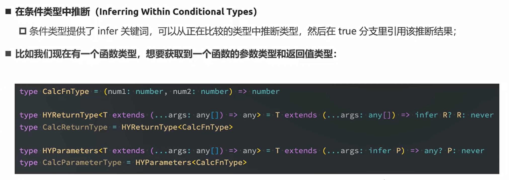
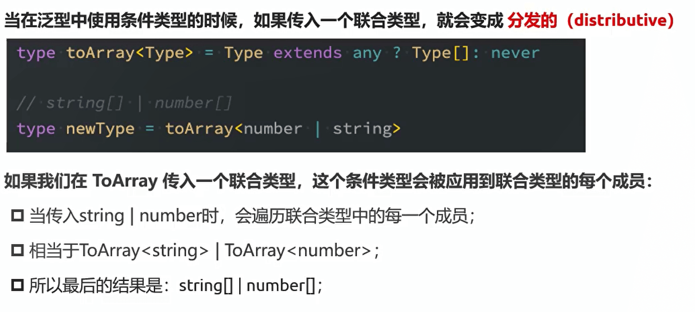

## 环境搭建

### 编译环境

- 全局安装：`npm install typescript -g`

- 查看版本：`tsc --version`
- 编译：`tsc ./hello.ts`

- 简化我们每次编写都要编译的步骤：
  - 方式一：使用webpack
  - 方式二：**使用ts-node库**


### 使用ts-node库

- 全局安装：`npm install ts-node -g`
- 同时我们的ts-node还依赖两个包，我们一起安装：`npm install tslib @types/node -g`
- 使用：`ts-node ./test.ts`


### TS配置文件

生成配置文件：`tsc --init`


## TS类型

### 变量声明

- 完整的声明格式：
  - 声明了类型后TypeScript就会进行类型检测，声明的类型可以称之为类型注解（Type Annotation) ;
  - `let/var/const 标识符: 数据类型 = 赋值;`【`let message: string = "hello world"`】

- 注意：ts中声明类型的string是小写的，和String是有区别的


### 变量的类型推导

- 在开发中，有时候为了方便起见我们并不会在声明每一个变量时都写上对应的数据类型，我们更希望可以通过TypeScript本身的特性帮肋我们推断出对应的变量类型
- 如果我们给message赋值为123，那他的类型就默认为number
- 这是因为在一个变量第一次赋值时，会根据后面的赋值内容的类型，来推断出变量的类型
- 声明一个标识符时，如果有直接进行赋值，会根据赋值的类型推导出标识符的类型注解，这个过程称之为类型推导
  - let进行类型推导，推导出来的通用类型
  - const进行类型推导，推导出来的字面量类型（后续专门讲解)


### js与ts的数据类型

js和ts大部分数据类型都是一样的，我们就不演示了，主要说明不一样的

number、boolean、string、Symbol、null、undefined等


#### Array类型

明确的指定 <数组> 的类型注解：

- string[] ：数组类型，并且数组中存放的字符串类型

  - 一般在我们开发过程中，数组中放的都是相同的类型，不要放不同的类型

  - ```ts
    let arr: string[] = ["aaa","bbb","ccc"]
    arr.push("ccc")
    arr.push(123)//报错，类型不同
    ```

- 第二种写法：`Array<string>`，这是泛型的写法，后续学习


#### Object类型

- 明确指定

  - ```typescript
    let obj:{
        name: string,
        age: number
    } = {
        name:'jl',
        age:18
    }
    ```

  - 注意：我们不建议直接使用object类型来作为对象的类型，因为设置了object类型我们就不能获取数据，也不能设置数据`let obj:object ={...}`【不建议 】

- 使用type关键字声明，后续学习


#### any类型

- 在某些情况下，我们确实无法确定一个变量的类型，并且可能它会发生一些变化，这个时候我们可以使用any类型
- any类型表示不限制标识符的任意类型，并且可以在该标识符上面进行任意的操作


####  unknown类型

- unknown是TypeScript中比较特殊的一种类型，它用于描述类型不确定的变量。

  - 和any类型有点类似，但是unknown类型的值上做任何事情都是不合法的【any任何操作都是合法的】

  - ```ts
    let foo: any = "aaa"
    foo = 123// 可以
    console.log(foo.length)// 可以
    ```

  - ```ts
    let foo: unknown = "aaa"
    foo = 123// 可以
    console.log(foo.length)// 报错
    ```

- 那不允许操作有什么用呢？

  - 他要求我们必须要进行类型的校验（缩小），才能根据缩小之后的类型进行对应的操作

  - ```ts
    let foo: unknown = "aaa"
    foo = 123// 允许的
    // 类型缩小
    if(typeof foo === 'string'){
        console.log(foo.length)// 可以
    }
    ```


#### void类型

- void通常用来指定一个函数是没有返回值的，那么它的返回值就是void类型

  - ```ts
    function sum(num1: number, num2:number): void{
        console.log(num1 + num2);
    }
    ```

- 如果返回值类型是void类型，那么我们也可以返回undefined

  - ```ts
    function sum(num1: number, num2:number): void{
        console.log(num1 + num2);
        return undefined
    }
    ```

- 应用场景：用来指定函数类型是void

  - ```ts
    type fooType = () => void	//这个表达式可以用来表示函数类型
    const foo: fooType = () =>{
        
    }
    ```

  - ```js
    // 举例：将所有的函数都延迟一秒执行
    function delayFn(fn){
        setTimeout(()=>{
            fn()
        },1000)
    }
    
    delayFn(123)//在这里我们传入123就不合适了
    
    
    // 我们指定fn的类型为一个函数类型
    function delayFn(fn: ()=>void ){}
    ```

- 关于定义函数的类型

  - 当**基于上下文的类型推导推导出来的返回类型**为void的时候，并不会强制函数一定不能返回内容。允许我们返回东西

  - ```js
    msg.forEach((item, index, arr)=>{
        console.log(item)
        return 111 //允许的，但是不建议，没有意义
    })
    ```


#### never类型

- 开发中很少定义never类型，在某些情况下进行类型推导会有never
- never表示永远不会发生值的类型，比如一个函数：
  - 如果一个函数中是一个死循环或者抛出一个异常，那么这个函数会返回东西吗?
  - 不会，那么写void类型或者其他类型作为返回值类型都不合适，我们就可以使用never类型


#### tuple类型

- tuple是元组类型，很多语言中也有这种数据类型，比如Python、Swift等

- 例子：当我们保存个人信息的时候：

  - ```ts
    // 不合适：数组中最好存放相同的数据类型，并且我们取出的数据不知道是什么类型
    let info1: any[] = ['xjn', 18, 1.88]
    
    //使用对象类型，这也是我们使用最多的
    let info2 = {
        name:'xjn',
        age:18,
        heigth:1.88
    }
    
    //使用元组类型：元组中可以存放不同的数据类型，取出的数据具有明确的类型
    let info3: [string, number, number] = ['xjn', 18, 1.88]
    ```
  
- 使用场景：在函数中使用较多，特别是函数的返回值

  - ```js
    // react中的useState
    
    function useState(initState :any): [ number, (newValue: number)=> void ] {
        let stateValue = initState
    
        function setStateValue(newValue: any){
            stateValue = newValue
        }
    
        return [ stateValue, setStateValue ]
    
    }
    
    const [ num, setNum ] = useState(10)
    ```


- 那么tuple和数组有什么区别呢?
  - 首先，**数组中通常建议存放相同类型的元素，不同类型的元素是不推荐放在数组中**。(可以放在对象或者元组中)
  - 其次，**元组中每个元素都有自己特性的类型，根据索引值获取到的值可以确定对应的类型**


### 参数的类型

在ts中定义一个函数时，要明确的指定参数的类型

```typescript
function add(num1: number, num2:number ){
    return num1 + num2
}
```


### 返回值类型

不指定也是ok的，它会自动进行类型推导

```ts
function add(num1: number, num2:number ): number{
    return num1 + num2
}
```


### 匿名函数的参数类型

匿名函数最好不要添加类型注解。因为函数执行的上下文可以帮助确定参数和返回的类型


### 对象类型的使用

先了解

对象类型和函数类型一起使用

```ts
type posType = {
    x:number, 
    y:number
}

function position(obj : posType){
    console.log(`x:${obj.x}`);
    console.log(`y:${obj.y}`);
}

position( { x:30, y:40 } )
```


## TS语法细节

### 联合类型

- TypeScript的类型系统允许我们使用多种运算符，从现有类型中构建新类型

- 我们来使用第一种组合类型的方法：联合类型(Union Type)
  - 联合类型是由两个或者多个其他类型组成的类型
  - 表示可以是这些类型中的任何一个值
  - 联合类型中的每一个类型被称之为联合成员(union's members) 

- 使用 `|` (或)
  - 基本使用：`let foo : number | string = '123'`
  - 两种/多种满足一个即可
  
- 一般我们在使用联合类型的时候，会进行缩小类型

  - ```ts
    let str: number | string = 'xjn'
    
    // str = 123
    
    // 直接使用会报错：number上不存在length属性
    // console.log(str.length);
    
    if( typeof str == "string" ){
        console.log(str.length);
    }
    ```


### 类型别名

关键词：`type`

```ts
type pointType = {
    x:number,
    y: number,
    z?: number,//可选
}

function point(obj: pointType){
    console.log(obj.x, obj.y, obj.z);
}
```

```js
type my = string | number
let str: my = 123
```


### 接口的声明

使用关键词`interface`

- 类型别名是赋值的方式

  - 类似于`const name = "xjn"`。之后我们在可以使用xjn，也可以使用name
  - `type Atype = number | string`。type也类似这样的

- 接口是声明的方式：

  - 类似于`class Person{}`

  - `interface PointType{}`

  - ```ts
    interface pointType{
        x:number,
        y: number,
        z?: number,
    }
    
    function point(obj: pointType){
        console.log(obj.x, obj.y, obj.z);
    }
    ```


### interface和type的区别

- 类型别名和接口是非常相似的，在定义对象的时候，大部分时候两者都是可以使用的
- **接口几乎所有的特性都可以在type中使用**


- 区别一：type类型使用范围更广泛，interface只能用来声明对象

- 区别二：

  - 在声明对象的时候，type不允许两个名称相同的别名存在。
  - interface可以多次声明，并且两次声明的值都是有效的都需要满足

- 区别三：interface支持继承

  - ```ts
    interface person{
        name: string,
        age: number
    }
    
    interface A extends person{
        height: number,
    }
    ```

- 区别四：interface可以被类实现【这里先知道就行】

- ...

**一般在开发中如果是非对象类型的定义使用type，如果是对象类型的声明那么使用interface，因为interface的功能更多一些**


### 交叉类型

- 使用 `&` (且)

  - 错误使用：`let foo : number & string = 'xjn'//这是没有意义的`

  - ```ts
    //正确使用：
    interface One{
        name: string,
        age: number
    }
    
    interface Two{
        name: string,
        coding: ()=>void
    }
    
    let Three : One & Two
    
    let info: Three = {
        name: 'why',
        age: 18,
        coding: function(){
    		console.log("111")
        }
    }
    ```

  - 两种/多种同时满足才行


### 类型断言as

- 有时候TypeScript无法获取具体的类型信息，这个我们需要使用类型断言（Type Assertions)。

  - 比如我们通过`document.getElementByld`， TypeScript只知道该函数会返回`HTMLElement`，但并不知道它具体的类型

  - ```ts
    // 获取Dom：
    // 我们在使用标签选择的时候，是什么类型我们是比价确定的
    const myEl = ducument.querySelect("img") as HTMLImageElemnt
    
    // 但是开发中我们一般会设置class去获取class，这个时候ts的类型推断是 Element | null，我们不能获取具体的类型
    // 这个时候我们可以用类型断言
    const myEl = ducument.querySelect(".img") as HTMLImageElemnt
    myEl.src = '..'
    ```

- TypeScript只允许类型断言转换为更具体或者不太具体的类型(一般是any/unknown)版本，此规则可防止不可能的强制转换


### 非空类型断言

非空类型断言：其实就是告诉编译器`info.firend`一定不为空，不需要帮我检测，**但这个是危险的** 。只有在确保我们这个`info.friend`是有值的情况下才能使用

非空断言使用的是!，表示可以确定某个标识符是有值的，跳过ts在编译阶段对它的检测

`info.firend!.name = "jl"`

```ts
interface Person{
    name: string,
    age: number,
    friend?: {
        name: string
    }
}

const info: Person = {
    name:"why",
    age:18
}

//访问属性的时候，可以使用可选链 ?.
console.log(info.friend?.name)

//当我们进行赋值的时候，不能使用可选链了
info.firend?.name = "jl"//错误的

//解决方法一：类型缩小
if(info.friend){
	info.firend.name = "jl"
}

//解决方法二：非空类型断言：其实就是告诉编译器info.firend一定不为空，不需要帮我检测，但这个是危险的
info.firend!.name = "jl"
```


### 字面量类型

```ts
// 1.基本使用
const name: 'why' = 'why'
const age: 18 = 18

// 2.但一般我们不会这样用，那是没有意义的，一般我们会将多个字面量类型联合在一起
type Direction = 'left' | 'right' | 'up' | 'down'
let d1: Direction = 'left'	//这个赋值只能是在四个当中的一个

// 3.例子：封装请求：
function request(url: string, method: 'post' | 'get'){}

// 4.ts的小细节，关于这个请求的
type MethodType = 'post' | 'get'
function request(url: string, method: MethodType){}

const info = {
    url:"xxx",
    method: 'post'
}
request(info.url, info.method)//这个是错误的，因为info.method类型是string，由info推导出来的

// 解决方法一：类型断言
request(info.url, info.method as MethodType)

// 解决办法二：给info添加变量声明
const info:{
    url: string,
    method: MethodType
} = {
    url:"xxx",
    method: 'post'
}

// 解决方法三：强制变成自变量类型
const info = {
    url:"xxx",
    method: 'post'
} as const//这个时候我们的url变成自变量类型xxx，method变成自变量类型post
```


### 类型缩小

- 什么是类型缩小
  - 我们可以通过类似于`typeof padding === “number”`的判断语句，来改变TypeScript的执行路径
  - 在给定的执行路径中，我们可以缩小比声明时更小的类型，这个过程称之为缩小(Narrowing ) 
  - 而我们编写的`typeof padding === "number"`可以称之为类型保护(type guards) 

- 常见的类型保护如下
  - typeof
  
  - instanceof：判断是不是某一个类的实例
  
    - ```ts
      // 传入时间打印
      function printDate( date: string | Date ){
          if( date instanceof Date ){
              console.log(date);
          }
      }
      ```
  
  - in：用于判断某个对象是否具有带名称的属性，有返回true
    - ```ts
      interface ISwim{
          swim: () => void;
      }
      
      interface iRun{
          run: () => void;
      }
      
      function move( animal: ISwim | iRun ){
          // 我们不能通过这样的方式去判断，因为animal可能没有ISim
          // if( animal.ISwim )
      
          if( "swim" in animal ){
              console.log("swim");
          }else{
              console.log("run");
          }
      
      }
      ```
  
  - 平等缩小（`=== 、!==`）


## TS函数语法

### ts函数类型

#### 编写函数类型表达式，来表示函数类型

- 格式：`(参数列表) => 返回值`，**使用箭头**

- `const bar: () => void = () =>{}`

- ```ts
  // 0.声明式函数：const bar = (arg) =>{}
  const bar = (arg :number): number =>{
      return 123
  }
  
  // 1.给函数添加上类型
  const bar: (参数列表) => 返回类型 = (arg :number): number =>{
      return 123
  }
  // 2.加上返回值类型
  const bar: (参数列表) => number = (arg :number): number =>{
      return 123
  }
  // 3.加上参数类型
  // 3.1 但是这样写是错的，必须先写形参的名字，在写类型
  const bar: (number) => number = (arg :number): number =>{
      return 123
  }
  // 3.2 正确写法
  const bar: (num1: number) => number = (arg :number): number =>{
      return 123
  }
  
  
  //起别名
  type barType  = (num1: number) => number
  const bar1: barType = (arg: number) =>{
  	return 123
  }
  ```

- 小案例：

  - ```js
    // js代码
    function calc(calcFn){
        const num1 = 10
        const num2 = 20
        
        // 将进行什么计算交给传来的函数
        const res =calcFn(num1, num2)
        console.log(res)
    }
    
    function add(num1, num2){
        return num1 + num2
    }
    calc(add)
    ```

  - ```js
    // ts代码
    type calcType = (num1: number, num2: number) => number
    function calc(calcFn : calcType){
        const num1 = 10
        const num2 = 20
        
        // 将进行什么计算交给传来的函数
        const res =calcFn(num1, num2)
        console.log(res)
    }
    
    function add(num1: number, num2: number){
        return num1 + num2
    }
    calc(add)
    ```

- 小细节：ts对于传入的函数类型的参数个数不进行检验【比如我们使用高阶函数forEach，我们可以就传一个参数】

  - ```js
    type calcType = (num1: number, num2: number) => number
    function calc(calcFn : calcType){
        const num1 = 10
        const num2 = 20
        
        // 将进行什么计算交给传来的函数
        const res =calcFn(num1, num2)
        console.log(res)
    }
    
    // 下面都是允许的
    calc(function(num1, num2){
        return num1+num2
    })
    
    calc(function(num1){
        return num1
    })
    
    calc(function(){
        return 1
    })
    ```


#### 函数调用签名

- 我们从对象的角度来看，当我们的函数赋值给一个对象的时候，这个对象只能表达这个函数，但是我们这个对象还可能有其他的属性

- 但是函数声明表达式并不能支持声明属性

- 语法：`(参数列表): 返回值类型`，**这里我们就是冒号了而不是箭头**

- ```ts
  //函数类型表达式：
  type barType  = (num1: number) => number
  const bar: barType = (arg: number): number =>{
  	return 123
  }
  
  // 从对象的角度来看,对象还会有其他的属性
  //不被允许
  bar.name = 'why'
  bar.age = 18
  ```

- 在JavaScript中，函数除了可以被调用，自己也是可以有属性值的。然而前面讲到的函数类型表达式并不能支持声明属性。如果我们想描述一个带有属性的函数，我们可以在一个对象类型中写一个**调用签名**

- ```ts
  //函数调用签名，它是一个对象，所以我们type interface都可以用，但一般对象我们推荐使用interface
  interface barType{
      name: string,
      age: number
      // 函数是可以被调用的：函数调用签名
      // (参数列表): 返回值类型 
      (num1: number): number
  }
  
  const bar: barType = (arg: number) =>{
  	return 123
  }
  
  bar.name = 'why'
  bar.age = 18
  bar(123)
  ```

- 开发中

  - 如果只是描述函数类型本身（函数可以被调用），使用函数类型表达式。
  - 如果描述函数作为对象可以被调用，同时也是有其他属性时，使用函数调用签名


### 构造签名

js函数也可以使用new操作符进行调用，当被调用的时候，ts为认为这是一个构造函数，因为他们产生一个新对象

```ts
class Person{}  // 代表的是构造函数 

interface ICPerson{
    new (): Person	//构造签名，在函数调用签名前添加new
}
 
function factory(fn: ICPerson){
    const f = new fn()
    return f
}

faction(Person)
```


### 函数的可选参数

```ts
// 1.y是一个可选参数,可选参数的类型：number | undefined
// 2.可选参数需要写在最后
function foo(x: number, y?:number){}

foo(10)
foo(10,20)

// 2.当我们设置了可选参数的时候，我们不能直接对其操作，因为它可能是undefined，需要进行类型缩小
function foo(x: number, y?:number){
    if(y!== undefined){
        console.log(y+10)
    }
}
```


### 参数的默认值

```ts
// 函数的参数可以有默认值
// 1.有默认值的情况下，参数的类型注解可以省略
// 2.有默认值的情况下，可以接受undefined的值
function foo(x: number, y:number = 100){}

foo(10)
foo(10, undefined) // 与foo(10)一样的
foo(10,20)
```


### 剩余参数

```ts
function foo(...nums: string[]){}
```


### 函数的重载

- 在TypeScript中，如果我们编写了一个add函数，希望可以仅对字符串与字符串之间和数字与数字类型之间进行相加，应该如何编写呢?

- 我们可能会这样来编写，但是其实是错误的

  - ```ts
    // 运算符“+”不能应用于联合类型，我们不能将string和number类型在一起
    function add(a1: number| string, a2: number | string){
        return a1 + a2
    }
    ```

  - 这个时候我们可以使用函数的重载写法

- 在TypeScript中，我们可以去编写不同的重载签名(overload signatures)来表示函数可以以不同的方式进行调用

- 一般是编写两个或者以上的重载签名，再去编写一个通用的函数以及实现

  - ```ts
    // 1.先编写重载签名，后面没有{}
    function add(arg1: number, arg2: number): number
    function add(arg1: string, arg2: string): string
    
    // 2.编写通用的函数实现(在我们实现了重载签名之后，通用函数是不能被调用)
    function add(arg1: any, arg2: any): any{
        return arg1 + arg2
    }
    
    add(19, 20)
    add("aa", "bb")
    add(20, "aa")// 报错，不被允许，我们调用的并不是any类型的add函数
    ```


### 函数重载和联合类型的区别

- 在开发中，可以使用联合类型尽量使用联合类型，联合类型实现不了在用函数重载

```ts
// 函数重载
function getLength(arg: string ): number
function getLength(arg: any[] ): number
function getLength(arg){
	return arg.length
}

getLength("aaaa")
getLength(['aa', 'bb', 'cc'])
```

```ts
// 联合类型
function getLength( arg: string | any[] ) : number{
	return arg.length
}

getLength("aaaa")
getLength(['aa', 'bb', 'cc'])
```

```ts
//拓展：对象类型实现
function getLength( str : { length: number } ): number{
	return str.length
}

getLength("aaaa")
getLength(['aa', 'bb', 'cc'])
```


## this类型

### 默认类型

- 在没有对ts进行特殊配置的情况下，this是any类型

- 当我们使用`tsc init`生成配置文件的时候，`"noImplicitThis": true`，ts会根据上下文推导this，在不能正确的推导的时候就会报错，需要我们明确的指定this

  - ```ts
    const info = {
        name:"why",
        studying:functon(){
        	// 默认是any类型
        	console.log(this.name + "studying")
    	}
    }
    
    info.studying()
    ```
    
  - ```ts
    // 配置  "noImplicitThis": true
    const info = {
        name:"why",
        studying:functon(){
        	//不会报错，因为他可以根据上下文推导出来，this类型是info类型
        	console.log(this.name + "studying")
    	}
    }
    
    info.studying()
    
    function foo(){
        console.log(this)	//报错，推导不出来
    }
    ```


### 指定this的类型

- 在开启`nolmplicitThis:true`的情况下，我们必须指定this的类型。

- 如何指定呢?函数的第一个参数类型:

  - 函数的第一个参数我们可以根据该函数之后被调用的情况，用于声明this的类型（**名词必须叫this**) 

  - 在后续调用函数传入参数时，从第二个参数开始传递的，this参数会在编译后被抹除

  - ```ts
    function foo(this: {name:string,age:number},other:any){
        console.log(this)
        console.log(other)
    }
    
    foo.call({name:'aa',age:19},{other:"hhh"})
    ```


### this相关的内置工具

- Typescript提供了一些工具类型来辅助进行常见的类型转换，这些类型全局可用。
- ThisParameterType
  - 用于提取一个函数类型Type的this (opens new window)参数类型
  - 如果这个函数类型没有this参数返回unknown
- OmitThisParameter:
  - 用于移除一个函数类型Type的this参数类型，并且返回当前的函数类型

```ts
function foo(this: {name:string,age:number}, other:any){
    console.log(this)
    console.log(other)
}

// 获取函数的类型
type fooType = typeof foo

// 1.获取函数中的this类型：使用ThisParameterType方法（采用泛型方式）
type fooThisType = ThisParameterType<fooType>

// 2.删除this参数类型，剩余的函数的类型返回
type PureThisType = OmitThisParameter<fooType>
```


## TS面向对象

### 类的基本使用

- 我们来定义一个Person类：使用class关键字来定义一个类
- 我们可以声明类的属性:在类的内部声明类的属性以及对应的类型
  - 如果类型没有声明，那么它们默认是any的
  - 我们也可以给属性设置初始化值
  - 初始化我们可以在声明成员属性的时候初始化，也可以在constructor中初始化
  - 在默认的`strictPropertylnitialization`模式下面我们的属性是必须初始化的，如果没有初始化，那么编译时就会报错。如果我们在`strictPropertyInitialization`模式下确实不希望给属性初始化，可以使用`name!: string`语法（后面了解）
- 类可以有自己的构造函数constructor，当我们通过new关键字创建一个实例时，构造函数会被调用;
  - 构造函数不需要返回任何值，默认返回当前创建出来的实例

```ts
class Person{
    // 在ts中，我们必须要先声明成员属性（name、age就是成员属性）
    name: string
    // 也可以添加初始化值
    age: number = 0

    //也可以在constructor中初始化
    constructor(name: string, age: number){
        this.name = name
        this.age = age
    }
}

const p1 = new Person("xjn",18)
```


### 类的成员修饰符

- 在TypeScript中，类的属性和方法支持三种修饰符: public、private、protected
  - public修饰的是在任何地方可见、公有的属性或方法，默认编写的属性就是public的
  - private修饰的是仅在同一类中可见、私有的属性或方法
  - protected修饰的是仅在类自身及子类（继承）中可见、受保护的属性或方法

```ts
class Person{
    name: string
    private age: number 

    constructor(name: string, age: number){
        this.name = name
        this.age = age
    }
    
    private eating(){
        console.log("吃饭");
    }
}

const p1 = new Person("xjn",18)
p1.eating() //报错，私有属性
```


### 类的readonly

只读属性不能进行写入操作

```ts
class Person{
    readonly name: string
    age: number

    constructor(name: string, age: number){
        this.name = name
        this.age = age
    }
    
    private eating(){
        console.log("吃饭");
    }
}

const p1 = new Person("xjn",18)
p1.name = 'hhh' //报错，name只读
```


### getters/setters

- 在前面一些私有属性我们是不能直接访问的，或者某些属性我们想要监听它的获取(getter)和设置(setter)的过程，这个时候我可以使用存取器。

```ts
class Person{
    // 约定：私有属性名字前面加上 _ 
    private _name: string = ''
    age: number = 0

    constructor(name: string){
        this.name = name
    }


    set name(newValue: string){
        this._name = newValue
    }

    get name(){
        return this._name
    }
}

const p1 = new Person("xjn")
// 调用的其实是set name方法，但是使用get、set不需要类似于函数调用一样写括号
p1.name = "hhh"
// 调用的是get name方法
console.log(p1.name);
```


### 参数属性

- TypeScript提供了特殊的语法，可以把一个构造函数参数转成一个同名同值的类属性。
  - 这些就被称为参数属性(parameter properties) ;
  - 你可以通过在构造函数参数前**添加一个可见性修饰符public private protected 或者readonly 来创建参数属性**，最后这些类属性字段也会得到这些修饰符

```ts
class Person{
    name: string
    age: number

    constructor(name: string, age: number){
        this.name = name
        this.age = age
    }
}

//算是语法糖写法：
class Person{
    constructor(private name: string, private age: number){
        this.name = name
        this.age = age
    }
}

const p1 = new Person('xjn', 18)
console.log(p1.name)
```


### 抽象类abstract

- 我们知道，继承是多态使用的前提。
  - 所以在定义很多通用的调用接口时,我们通常会让调用者传入父类，通过多态来实现更加灵活的调用方式。
  - 但是，父类本身可能并不需要对某些方法进行具体的实现，所以父类中定义的方法，我们可以定义为抽象方法。
- 抽象类特点：
  - 抽象类是不能被实例的话（也就是不能通过new创建)
  - 抽象类可以包含抽象方法，也可以包含有实现体的方法
  - 有抽象方法的类，必须是一个抽象类
  - 抽象方法必须被子类实现，否则该类必须是一个抽象类

```ts
// 2.但是抽象方法必须实现在抽象类中
abstract class numAbs{
    // 1.定义方法名称，但是父类并不实现，交给子类来实习各自不同的方法
    // 我的称之为抽象方法：关键字abstract
    abstract getNum(): any;
    
    // 5.抽象类中也可以有普通的方法
    abc(){}
}

class one extends numAbs{
    // 3.当子类继承抽象类的时候，其父类定义的抽象方法必须实现
    getNum(){
        return 'one';
    }
}

class two extends numAbs{
    getNum() {
        return 'two';
    }
}

function addNum(num: numAbs){
    console.log(num.getNum());
    
}

addNum(new one())
addNum(new two())

// 4.同时我们的抽象类是不能实例化的
addNum(new num())//报错
```


### 类的类型

- 类的本身也可以作为一种数据类型的

- 类的作用
  - 可以创建类对应的实例对象（new）
  - 类本身可以作为这个实例的类型
  - 类也可以当做一个有构造签名的函数

```ts
class Person{}

const name: string = 'aaa'
// 1.可以创建类对应的实例对象，也可以作为类型
const p : Person = new Person()

// 2. 类也可以当做一个有构造签名的函数
function factory( ctor: new ()=> void ){}
factory(Person)
```


### 对象类型的修饰符

- 属性?：可选的属性
- readonly

```ts
type Person1{
	name?: string,
    readonly age: number
}

interface Person2{
	name?: string,
    readonly age: number
}
```


### 索引签名

- 什么是索引签名呢?
  - 有的时候，你不能提前知道一个类型里的所有属性的名字，但是你知道这些值的特征
  - 这种情况，你就可以用一个索引签名(index signature)来描述可能的值的类型
  - 索引签名：可以通过字符串索引，去获取一个值，也是一个字符串
- **索引签名的属性类型必须是string或者是number（不能是联合类型）** 【`[index: string/number] : string`】

```ts
interface IIndexType{
    // 返回值类型的目的是告知通过索引去获取到的值是什么类型
    [xxx]: yyy
    
    // 类型只能是string和number其中的一个，不允许写联合类型
    [ index: 类型 ]: any
    [ index: number ]: string
}
// 符合要求，我们可以通过 name[0]等去取值,且取到的string类型
const name: IIndexType =  [ 'a', 'b', 'c' ]  
```

```ts
interface IIndexType{
    [ index: string ]: any
}
// 也是没有问题的，因为这两个本质上一个意思， name[0] => name['0']
const name: IIndexType =  [ 'a', 'b', 'c' ]  
```

```ts
interface IIndexType{
    [ index: string ]: string
}
// 报错，报错原型就是严格的字面量赋值
// name是一个数组类型，我们确实index为string，他还有数组的一些方法比如forEach
const name: IIndexType =  [ 'a', 'b', 'c' ]  
// 但是他的返回值不是sting，是函数
name.forEach => name['forEach']
```

-  解决方法
  - 我们让其成为不新鲜的是不起作用的
  - 设置any
  - 设置联合类型


```ts
type a = {
    [index: string] : string,
    heigth: number ,//也报错：因为我们设置了 签名为string，需要满足上面的要求解决办法就是 [index: string] : string |number
}

let b: a = {
    name: 'xjn',
    age: 18,//报错，因为我们设置了 签名为string
}

// 获取
console.log(b["name"],b.name);
```


- 当我们想写两个类型的时候，必须要分开写，不允许写在一起

```ts
// 这样我们通过name[0] / name['forEach'] 我们可以明确知道我们取什么类型
interface IIndexType{
    [index: number]: number,
    [ other: string ]: any
}
```


- 数字类型索引的类型，必须是字符串类型索引的类型的子类型

```ts
interface IIndexType{
    [index: number]: number,//上面的类似必须是其子类型
    [ other: string ]:number | string
}
```


- 如果索引签名中有定义其他属性，·其他属性返回的类型,﹑必须符合string类型返回的属性

```ts
interface IIndexType{
    [index: number]: number,
    [ other: string ]:number | string
    
    aaa: string
    bbb: blooean//不被允许的，与上述定义的other矛盾了
}
```


### 接口继承与实现

作用：

- 减少代码的重复编写

```ts
interface person{
    name: string,
    age: number
}

interface A extends person{
    height: number,
}
```

- 接口被类实现

```ts
interface PersonA{
	name: string
    age: number
    runing:()=>void
}

interface PersonB{
    height: number,
    playing: ()=> void
}

class One implements PersonA, PersonB{
    name: string
    age: number
    height: number
    runing(){

    }

    playing(){

    }
}
```


### 严格的字面量赋值检测

```ts
// 奇怪现象：

// 这个会报错：
interface Person{
    name: string,
    age: number
}

const a: Person = {
    name: 'jl',
    age: 18, 

    height: 1.88
}
```

```ts
// 但是当当我们将添加height先定义在赋值的时候：不报错
interface Person{
    name: string,
    age: number
}

let obj = {
    name: 'jl',
    age: 18,
    height: 1.88
}

const b: Person = obj
```


**解释现象：**

- 第一次创建的对象字面量，称之为fresh（新鲜的）
- 对于新鲜的字面量，会进行严格的类型检测，必须完全满足类型的要求（不能有多余的属性）
- 当类型断言或对象字面量的类型扩大（比如赋值）时，新鲜度会消失，就不会报错


### ts枚举类型

- 枚举类型是为数不多的TypeScript特性有的特性之一：
  - 枚举其实就是将一组可能出现的值，一个个列举出来，定义在一个类型中，这个类型就是枚举类型
  - 枚举允许开发者定义一组命名常量，常量可以是数字、字符串类型

```ts
// 定义类是 class，定义函数是function，定义枚举类型是enum

// 定义枚举类型：枚举类型的作用就是将所有可能出现的值都枚举出来
enum Direction{
    UP,
    DOWN,
    LEFT,
    RIGHT
}

const d1: Direction = Direction.UP
```

- 枚举类型默认是有值的，但我们不写的时候，默认从0开始递增，我们也可以手动设置初始化值

```ts
enum Direction{
    UP = 100,
    DOWN,//默认为101
    LEFT = "LEFT", //定义了LEFT初始化值，RIGHT也必须要定义初始化值
    RIGHT = "RIGHT"
}
```


## TS泛型编程

### 泛型基本使用

**类型变量，**他作用于类型，而不是值

```ts
// 更加通用
function foo<Type>(arg: Type): Type{
    return arg;
}
```

我们可以通过两种方式来调用它

- 方式一：通过<类型>的方式将类型传递给函数
- 方式二：通过类型推导，自动推到出我们传入变量的类型
  - 在这里会推导出它们是字面量类型的，因为字面量类型对于我们的函数也是适用的
- **在开发中，如果他可以正确的推导我们就简写，无法正确的推导我们就手动指定**

```ts
// 方式一：完整写法
const a = foo<number>(123)

// 方式二：自动进行类型推导
const a = foo(123)
const b = foo("123")
const c = foo<string[]>(["123"])
```

- 我们也可以指定多个类型：`function foo<T, V>(arg: T, other: V){}`

- 开发中我们常用：T(type)、V(value)、K(key)、E(element)来定义泛型的类型

```js
// 练习
function useState<T>(initState: T): [ T, (newState: T)=>void ]{
    let stateValue = initState

    function setStateValue(newState: T){
        stateValue = newState
    }


    return [stateValue, setStateValue]
}

const [ count, setCount ] = useState(10) 
```


### 泛型接口

在我们定义接口的时候也可以用泛型的

```ts
// 以前：
interface user{
    name: string,
    age: number,
    height: string
}

// 但是现在当我们不确定类型的时候，我们可以使用泛型
interface user<Type>{
    name:Type,
    age:number,
    height:Type
}

// 但是我们在使用泛型接口的时候需要指定其类型，因为ts无法正确的推导其类型
const a: user<string> = {
    name:"why",
    age:18,
    height:"1.88"
}

// 同时我们还可以设置默认值：设置了默认值之后就可以不指定其类型
interface user<Type = string>{}
```


### 泛型类

```ts
class Point<Type>{
    x: Type
    y: Type

    constructor(x:Type, y:Type){
        this.x = x
        this.y = y
    }
}

const a = new Point(1,2)
const b = new Point<string>('1','2')
```


### 泛型约束的基本使用

- 有时候我们希望传入的类型有某些共性，但是这些共性可能不是在同一种类型中
  - 比如string和array都是有length的，或者某些对象也是会有length属性的
  - 那么只要是拥有length的属性都可以作为我们的参数类型，那么应该如何操作呢

```ts
// 以前
function getLength(arg : string | string[]){
    console.log(arg.length);
    
}

getLength('123')
getLength(['a', 'b', 'c'])
getLength( { length: 10 } )//当我们想传这样的数据的时候就会报错


// 解决办法：传参类型改为有length
function getLength(arg : { length: number })
```

```ts
// 上述案例中，确实我们也暂时用不到泛型呀，我们可以改一下我们的案例，还是传入有length属性的参数，返回这个参数
function getLength(arg : { length: number }){
    return arg
}

// 这个时候我们接收的info所有的类型全部都丢失了
const info1 = getLength('123')
const info2 = getLength(['a', 'b', 'c'])
const info3 = getLength( { length: 10 } )

// 我们可以修改
function getLength<T>(arg : T): T{
    return arg
}

// 但是这样又有一个问题，传入的参数类型缺少了约束，我们的要求是传入getLength的参数，必须要有length，我们现在直接使用泛型，是没有越是的
const info4 = getLength(123) // 也不会报错，但是我们希望他会报错提示我们
```

```ts
// 添加约束，我们可以使用关键词extends
// 一般我们会将{ length: number }抽出去用interface/type
function getLength<T extends { length: number } >(arg : T): T{
    return arg
}

const info1 = getLength('123')
const info2 = getLength(['a', 'b', 'c'])
const info3 = getLength( { length: 10 } )

const info4 = getLength(123)// 这个时候他就会报错了
```

 


### 泛型参数的使用约束

先了解关键词：`keyof`

```ts
interface user{
    name:string,
    age:number
}

type One = keyof user	// One就是"name"|"age"的联合类型
```

- 在泛型约束中使用类型参数
  - 你可以声明一个类型参数，这个类型参数被其他类型参数约束
- 举个栗子:我们希望获取一个对象给定属性名的值
  - 我们需要确保我们不会获取obj上不存在的属性
  - 所以我们在两个类型之间建立一个约束;

```ts
// 原先
function getObj(obj, key){
    return obj[key]
}

const info = {
    name:"jl",
    age:18
}

const a = getObj(info, 'name')
```

```ts
// 我们在使用改方法的时候，我们需要限制一个条件：传入的key必须是我们obj里面有的key
// 所以我们需要添加约束：使用keyof
function getObj<O, K extends keyof O>(obj: O, key: K){
    return obj[key]
}

const info = {
    name:"jl",
    age:18
}

const a = getObj(info, 'name')
const b = getObj(info, 'address')// 报错
```


### 难点

一般我们在平时的业务中是用不到的，只有在写一些通用的库会用到


#### 映射类型

`E:\coderwhy\11-TypeScript开发实战\day102\187、188、189`


#### 条件类型


#### 在条件类型中进行推断(infer)




#### 分发条件类型




## 拓展知识

### TS类型检测 - 鸭子类型

我们先来看下述的代码

```ts
class Person{
	constructor(public name: string, public age: number){

	}
}

function printPerson(p: Person){
	console.log(p.name, p.age);
}
printPerson(new Person('jl', 18))// 这是没有问题的
printPerson({ name:'hh', age:20 })//很奇怪，也不会报错没

// 我们再创建一个类
class Dog{
	constructor(public name: string, public age: number){

	}
}

printPerson(new Dog('hsq', 2)) // 更奇怪了。printPerson明明要求我们传入一个Person类型，但我们传入Dog类型却没有报错
```


这是因为：

- TypeScript对于类型检测的时候使用的鸭子类型
- 鸭子类型：如果一只鸟,走起来像鸭子,·游起来像鸭子·看起来像鸭子。那么你视以认为它就是一只鸭子
- 鸭子类型：只关心属性和行为,不关心你具体是不是对应的类型


### 类型查找

我们这里先给大家介绍另外的一种typescript文件: `.d.ts文件`

我们之前编写的typescript文件都是.ts 文件，这些文件最终会输出.js文件，也是我们通常编写代码的地方;

还有另外一种文件.d.ts 文件，它是用来做类型的声明(declare)，称之为**类型声明**( Type Declaration)或者**类型定义**(Type Definition)文件。

它仅仅用来做类型检测，告知typescript我们有哪些类型;


### TS模块化

#### 概念

- TypeScript中最主要使用的模块化方案就是**ES Module**
- 在前面我们已经学习过各种各样模块化方案以及对应的细节，这里我们主要学习TypeScript中一些比较特别的细节。


#### 非模块

- 我们需要先理解 TypeScript认为什么是一个模块。
  - JavaScript规范声明任何没有export 的JavaScript 文件都应该被认为是一个脚本，而非一个模块。
  - 在一个脚本文件中，变量和类型会被声明在共享的全局作用域，将多个输入文件合并成一个输出文件，或者在HTML使用
    多个`<script>`标签加载这些文件。
- 如果你有一个文件，现在没有任何import或者export，但是你希望它被作为模块处理，添加这行代码：`export {}`
- 这会把文件改成一个没有导出任何内容的模块，这个语法可以生效，无论你的模块目标是什么


#### 内置类型导入

- 如果你导入的东西是一个类型（type/interface），那么推荐你在导入的时候加上type关键字，表明被导入的是一个类型

  - ```ts
    import { type IFoo, type IPerson } from './utils'
    
    // 这样写也是对的
    import type {  IFoo, IPerson } from './utils'
    ```

- 这些可以让一个非TypeScript编译器比如Babel、swc或者esbuild知道什么样的导入可以被安全移除。


#### declare 声明模块

我们也可以声明模块，比如lodash模块默认不能使用的情况，可以自己来声明这个模块【声明模块都是编写在.d.ts文件中的】

```ts
declare module "loadsh" {
    expore function join(arg: any[]): ang;
}
```

声明模块的语法: `declare module '模块名' {}`。在声明模块的内部，我们可以通过export导出对应库的类、函数等;

**声明文件模块**

在ts中我们使用图片是需要导入的，但是默认ts并不识别图片格式，我们需要声明文件模块

```ts
declare module "*.png"
declare module "*.jpg"
...
```

**声明命名空间**

```ts
// 我们在引入外部链接的时候，声明模块不合适，因为他就不是模块，我们声明命名空间:用jquery举例
declare namespace ${
    export function ajax();
}
```


### 外部定义类型声明

- 外部类型声明通常是我们使用一些库（比如第三方库）时，需要的一些类型声明。
- 这些库通常有两种类型声明方式:
  - 方式一:在自己库中进行类型声明(编写.d.ts文件)，比如axios
  - 方式二:通过社区的一个公有库`DefinitelyTyped`存放类型声明文件
    - github地址：`https://github.com/DefinitelyTyped/DefinitelyTyped`
    - 查找安装地址：``
    - 比如我们安装react的类型声明：`npm i @types/react --save-dev`
  - 方式三：自己定义声明文件


### 认识tsconfig.json文件

- 什么是tsconfig.json文件呢?(官方的解释)
  - 当目录中出现了tsconfig.json文件，则说明该目录是TypeScript项目的根目录
  - tsconfig.json文件指定了编译项目所需的根目录下的文件以及编译选项。
- 官方的解释有点“官方”，直接看我的解释。
- tsconfig.json文件有两个作用:
  - 作用一(主要的作用)︰让TypeScript Compiler在编译的时候，知道如何去编译TypeScript代码和进行类型检测
    - 比如是否允许不明确的this选项，是否允许隐式的any类型;
    - 将TypeScript代码编译成什么版本的JavaScript代码;
  - 作用二：让编辑器（比如VSCode）可以按照正确的方式识别TypeScript代码
    - 对于哪些语法进行提示、类型错误检测等等;
- JavaScrip项目可以使用jsconfig,json文件，它的作用与tsconfig,json 基本相同，只是默认启用了一些JavaScript相关编译选项


### TS内置工具

Typescript提供了一些工具类型来辅助进行常见的类型转换，这些类型全局可用。

- `ThisParameterType<Type>`
  - 用于提取一个函数类型Type的this (opens new window)参数类型
  - 如果这个函数类型没有this参数返回unknown
- `OmitThisParameter<Type>`：用于移除一个函数类型Type的this参数类型，并且返回当前的函数类型

```ts
function foo(this: {name:string,age:number}, other:any){
    console.log(this)
    console.log(other)
}

// 获取函数的类型
type fooType = typeof foo

// 1.获取函数中的this类型：使用ThisParameterType方法（采用泛型方式）
type fooThisType = ThisParameterType<fooType>

// 2.删除this参数类型，剩余的函数的类型返回
type PureThisType = OmitThisParameter<fooType>
```

- `Partial<Type>`：用于构造一个Type下面的所有属性都设置为可选属性
- `Required<Type>`：用于构造一个Type下面的所有属性都设置为必选属性
- `ReadOnly<Type>`：用于构造一个Type下面的所有属性都设置为只读属性

```ts
interface IPerson{
    name: sring,
    age: number,
    height?: string
}

// 将IPerson所有属性都变为可选的
type IP1 = Partial<IPerson>

// 将IPerson所有属性都变为必选的
type IP2 = Required<IPerson>

// 将IPerson所有属性都变为只读的
type IP2 = ReadOnly<IPerson>
```

- `Record<Keys, Type>`：用于创建一个新的对象类型，它所有的key是Keys类型，它所有的value是Type类型。
- `Pick<Type, Keys>`：用于构造一个类型，它是从Type类型里面挑了一些属性Keys
- `Omit<Type, Keys>`：用于构造一个类型，它是从Type类型里面过滤了一些属性Keys

```ts
interface IPerson{
    name: sring,
    age: number,
    height?: string
}

// 我只想选到 "name" 和 "age"
type IP1 = Pick<IPerson, "name" | "age">

// 我想过滤到 "height"
type IP2 = Pick<IPerson, "height">
```

- `Exclude<UnionType, ExcludeMembers>`：用于构造一个类型，它是从UnionType联合类型里面排除了所有可以赋给ExcludedMembers的类型。
- `Extract<Type, Union>`：用于构造一个类型，它是从UnionType联合类型里面提取类型。

```ts
type p1 = "name" | "age" | "height"

// 去除height
type p2 = Exclude<p1, "height">

// 提取height
type p3 = Extract<p1, "height">
```

- `NonNullable<Type>`：用于构造一个类型，这个类型从Type中排除了所有的null、undefined的类型。
- `ReturnType<Type>`：用于构造一个含有Type函数的返回值的类型。
- `InstanceType<Type>`：用于构造一个由所有Type的构造函数的实例类型组成的类型。


## 补充

### 对axios进行封装

```ts
// config index.ts
export const BASE_URL = 'http://codercba.com:8000'
export const TIMEOUT = 10000
```

```ts
// modules index.ts
import { jlReq1 } from "..";

jlReq1.request({
    url:'/home/multidata'
}).then(res =>{
    console.log(res.data);
})
```

```ts
// request index.ts
import axios from 'axios'
import type { AxiosInstance } from 'axios'

import { jlRequestConfig } from './type'


class jlRequest{
    instance: AxiosInstance

    // 创建axios实例
    constructor(config: jlRequestConfig){
        this.instance = axios.create(config)

        // 请求拦截器
        this.instance.interceptors.request.use((config)=>{
            console.log("全局请求成功拦截，这里可以开启loading、header携带token等");
            
            return config
        },(error) =>{
            console.log(error);
        })

        // 响应拦截器
        this.instance.interceptors.response.use((res)=>{
            console.log("全局响应成功拦截，这里可以去掉loading");
            
            return res
        },(error) =>{
            console.log(error);
        })

        // 针对特定的实例添加拦截器
        this.instance.interceptors.request.use(
            config.interceptors?.requestSuccessFn,
            config.interceptors?.requestFailureFn
        )

        this.instance.interceptors.response.use(
            config.interceptors?.responseSuccessFn,
            config.interceptors?.responseFailureFn
        )
    }

    // 创建网络请求的方法
    request(config: jlRequestConfig){

        // 可以设置单次请求的成功拦截
        // if(config.interceptors?.requestSuccessFn){
        //     config = config.interceptors.requestSuccessFn(config)
        // }
 
        return this.instance.request(config)
    }

    get(config: jlRequestConfig){
        return this.request({...config, method:'GET'})
    }

    post(config: jlRequestConfig){
        return this.request({...config, method:'POST'})
    }

}

export default jlRequest
```

```ts
// request type.ts
import type { AxiosRequestConfig, AxiosResponse, InternalAxiosRequestConfig } from 'axios'

// 在这里配置拦截器的类型，这样我们就可以动态的设置哪个请求有对应的拦截器
export interface jlRequestConfig extends AxiosRequestConfig{
    // 可选
    interceptors?: {
        requestSuccessFn?: (config: InternalAxiosRequestConfig) => InternalAxiosRequestConfig,
        // requestSuccessFn?: (config: AxiosRequestConfig) => AxiosRequestConfig,
        requestFailureFn?: (error: any) => any,
        responseSuccessFn?: (res: AxiosResponse) => AxiosResponse,
        responseFailureFn?: (error :any) => any,
    }
}
```

```ts
// index.ts
import { BASE_URL, TIMEOUT } from "./config";
import jlRequest from "./request";

const jlReq = new jlRequest({
    baseURL:BASE_URL,
    timeout:TIMEOUT
})

const jlReq1 = new jlRequest({
    baseURL:BASE_URL,
    timeout:TIMEOUT,
    // 当我们这个接口需要额外的拦截器的时候，我们就可以配置
    interceptors:{
        requestSuccessFn(config){
            console.log('jlReq1的请求拦截');
            
            return config
        },
        requestFailureFn(error){
            return error
        },
        responseSuccessFn(res) {
            return res
        },
        responseFailureFn(error) {
            return error
        },
    }
})

export { jlReq, jlReq1 }
```


### 小知识

- 定义类是 class，定义函数是function，定义枚举类型是enum
- 当我们使用第三方库的时候他的返回值类型并没有导出，当时我们又想使用

  ```ts
  import { login } from '.'
  
  let options = Parameters<typeof login>[0];// Parameters<typeof login>可以拿到所有的类型，我们可以去第0个
  
  let resp: ReturnType<typeof login> | null
  ```

  
