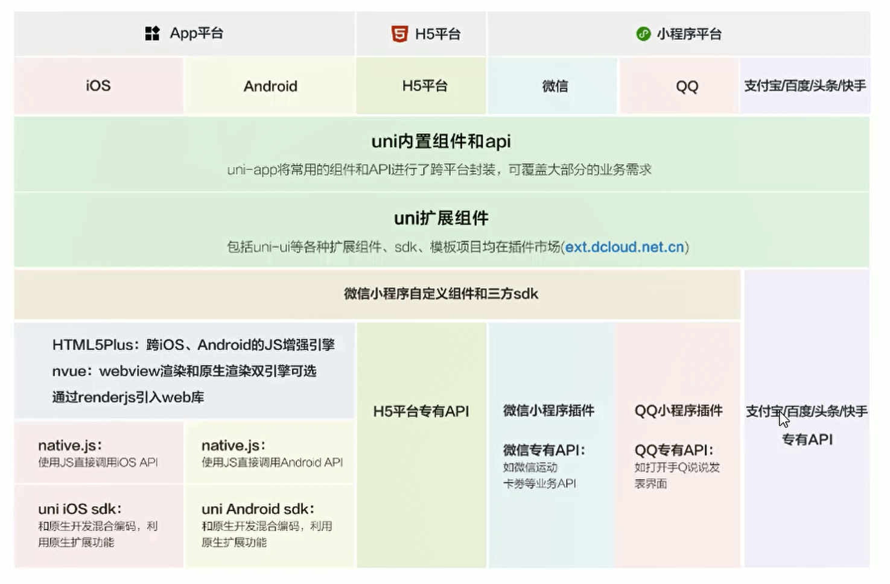

[uni-app官网 (dcloud.net.cn)](https://uniapp.dcloud.net.cn/)

## 认识uniapp

### 介绍

- uni-app是一个使用Vue.js 开发前端应用的**跨端框架**。
- 即开发者编写一套代码，便可发布到iOS、Android、Web(响应式)、以及各种小程序（微信/支付宝/百度/头条/飞书/QQ/快手/钉钉/淘宝)、快应用等多个平台。
- uni-app在手，做啥都不愁。即使不跨端, uni-app也是更好的小程序开发框架、更好的App跨平台框架、更方便的H5开发框架。


### uniapp架构图




### 软件推荐

- 编写uniapp：[HBuilderX](https://www.dcloud.io/hbuilderx.html)
- 微信小程序：微信开发者工具
- 手机模拟器：mumu模拟器


### 运行uniapp

- 在浏览器运行：选中uniapp项目，点击工具栏的运行-→运行到浏览器→选择浏览器，即可体验uni-app的web版。
- 在微信开发者工具运行
  - 选中uniapp项目，点击工具栏的运行→运行到小程序模拟器→微信开发者工具，即可在微信开发者工具里面体验uni-app
  - 其它注意事项：
    - 微信开发者工具需要开启服务端口：小程序开发工具设置→安全(目的是让HBuilder可以启动微信开发者工具)
    - 如第一次使用，需配置微信开发者工具的安装路径

- 在运行App到手机或模拟器（需要先安装模拟器)

  - 先连接真机或者模拟器(Android的还需要配置**adb调试桥命令行工具**)
    - adb的作用：1、连接手机。2、按照app。3、调试打印log。4、热更新
    - HBuilderX有内置的adb，自己可以配置一下环境变量

  - ...建立连接一些列操作


## uniapp基础语法

### uniapp目录结构

```
- pages：页面
- static：静态文件
- unpackage：打包文件
- App.vue：入口组件
- index.htm
- main.js：入口文件
- manifest.json：配置文件
- pages.json：类似于小程序的app.json
- uni.scss：uniapp内置样式变量
```


#### main.js

入口文件，主要作用：

- 初始化vue实例
- 定义全局组件
- 定义全局属性
- 按照插件


#### App.vue

入口组件

- App.vue是uni-app的入口组件，所有页面都是在App.vue下进行切换
- App.vue本身不是页面，这里不能编写视图元素，也就是没有`<template>`元素
- 作用
  - 应用的生命周期（类似于小程序的app生命周期）
    - `onLaunch`，`onShow`，`onHide`，
  - 编写全局样式
  - 定义全局数据globalData（类似于小程序）
    - 获取：`const app = getApp();console.log(app.globalData)`
    - 拓展：拿到页面的路由：`const pages = getCurrentPages();console.log(pages[pages.length - 1].route)`

- App.vue 中的style标签不支持写scoped属性，是无效的，局部页面也是不用加的，默认加上了


#### uni.scss

- 在uni.scss中定义的变量，我们无需@import就可以在任意组件中直接使用。
- 使用uni.scss中的变量，需在 HBuilderX里面安装scss插件(dart-sass插件)
- 然后在该组件的style 上加lang= "scss”，重启即可生效。


作用：

- 重写uniapp内置的样式变量
- 定义自定义的全局样式变量
- 全局样式导入


注意：

- 每次修改uni.scss文件都需要重新编译
- 他与app.vue中的styles的区别就是app.vue写每个页面公共的css


#### pages.json

诸多参数都类似于小程序的app.json


### uniapp开发规范

为了实现多端兼容，综合考虑编译速度、运行性能等因素,uni-app约定了如下开发规范：

- **页面文件遵循vue单文件组件**(SFC)规范
- **组件标签靠近小程序规范**，详见uni-app组件规范
  - 不推荐直接使用div，推荐view
- **接口能力(JS API)靠近微信小程序规范**，但需将前缀wx,替换为uni，详见uni-app接口规范
- **数据绑定及事件处理同Vue.js规范**，同时补充了App及页面的生命周期
- 为兼容多端运行，建议使用flex布局进行开发，推荐**使用rpx单位**(750设计稿)


### uniapp内置组件

```
view
text
image(支持相对路径、绝对路径、动态响应)
button：在小程序端的主题和在其它端的主题色不一样（可通过条件编译来统一风格)
scroll-view：可滚动视图区
swiper、swiper-item
```


### 扩展组件uni-ui

官网按需导入`uni_modules`


### 重写组件样式

```css
// 方案一： wx app
.uni-forms-item_label{
    coLor: red !important;
}

// 方案二： wx app h5
:depp(.uni-forms-item_label){
    coLor: red !important;
}

// 方案三： wx app h5
:global(.uni-forms-item_label){
    coLor: red !important;
}
```


### 条件编译

具体的语法：以#ifdef或#ifndef 加 %PLATFORM%开头，以#endif结尾。

- #ifdef: if defined仅在某平台存在
- #ifndef: if not defined除了某平台,其它平台均存在
- %PLATFORM%:平台名称

```vue
<view class="content">
    <!-- #ifdef H5 -->
    <view class="h5">仅在h5执行</view>
    <!-- #endif -->
    
    <!-- #ifdef MP-WEIXIN -->
    <view class="h5">仅在小程序执行</view>
    <!-- #endif -->
    
    <!-- #ifdef APP-PLUS -->
    <view class="h5">在安卓和ios都执行</view>
    <!-- #endif -->
    
    <!-- #ifdef APP-PLUS || MP-WEIXIN -->
    <view class="h5">两个都执行</view>
    <!-- #endif -->
</view>
```

```js
onLoad(){
    // #ifdef H5
    document.title = h5
    // #endif
}
```

```css
<style>
.box{
    /* #ifdef H5 */
    color: red;
    /* #endif */
    
    /* #ifdef APP-PLUS */
    color: green;
    /* #endif */
}
</style>
```


### 路由跳转

方式一：`<navigator></navigator>`

方式二：`uni.navigateTo()/uni.switchTab()`

都类似于wx


### 参数传递

uni-app中，常见页面通讯方式：

- 方式一: url查询字符串和EventChannel
- 方式二:使用事件总线
- 方式三:全局数据globalData
- 方式四:本地数据存储
- 方式五: Vuex和Pinia，状态管理库。


#### 方式一

url和EventChannel(兼容h5、weapp.app)

```
// 传递
<navigator url="/pages/test/test?name=jl&age=18"></navigator>

// 接收，在js onLoad中接收
onLoad(options){
	console.log(options)
}
```

```
// 传递
uni.navigateTo({
	url:'/pages/test/test?name=jl&age=18'
})

// 接收，在js onLoad中接收
onLoad(options){
	console.log(options)
}
```

```
// 传递:navigateTo还可以有eventChannel
uni.navigateTo({
	url:'/pages/test/test',
	success:res=>{
		res.eventChannel.emit('data', {
			name:'jl',
			age:18
		})
	}
})

// 接收，在js onLoad中接收
onLoad(options){
	const eventChannel = this.getOpenerEventChannel();
	eventChannel.on('data', (data)=>{
		console.log(data)
	})
}
```

```
// test页面：数据反向传递
goBackHome(){
	uni.navigateBack({
		delta:1
	})
	
	const eventChannel = this.getOpenerEventChannel();
	eventChannel.emit('acctepData',{
			name:'jl',
			age:18
	})
}

// home接收：我们点击执行这个方法进入的test页面，也在这个方法中监听返回的数据
goTestPage(){
    uni.navigateTo({
        url:'/pages/test/test',
        event:{
            acctepData(data){
                console.log(data)
            }
        }
    })
}
```


#### 方式二

```
uni.$emit
uni.$on
uni.$off
```

```
// test页面
goBackHome(){
	uni.navigateBack({
		delta:1
	})
	
	// 触发一个全局事件（在触发事件之前一定要先监听）
	uni.$emit('acctepData',{
			name:'jl',
			age:18
	})
}

// home
onLoad(){
	// 可以加上off来解除，性能优化
	uni.$on('acctepData',(data)=>{
		console.log(data)
	})
}
```


注意事项:

- 需先监听，再触发事件，比如:你在A界面触发，然后跳转到B页面后才监听是不行的。
- 通常on和off 是同时使用，可以避免多次重复监听
- 适合页面返回传递参数、适合跨组件通讯，不适合界面跳转传递参数


### 生命周期

页面生命周期+vue生命周期


### 自定义组件

在vue中我们自定义组件需要导入注册才能使用，在uniapp中使用easycom组件模式可以精简到一步

只需要我们在创建的时候选择创建组件（类似于小程序）即可

注意：**组件生命周期和页面生命周期有一点不同，写的时候注意查看官网**


## 部署流程

### 小程序

### H5

### App


## 其他

- 在使用background-image的时候，如果使用本地图片，对于小程序来说，是不支持的。小程序背景图只能是https链接或base64格式。但是我们在用uniapp的时候，对于图片小于64kb都会自动转为base64，但是转的条件是这个图片必须在static根文件夹下，不能在static下新建一个文件夹放图片，这样是无法转的


