## 初始Vue

### hello world

```javascript
<!DOCTYPE html>
<html lang="zh-CN">
<head>
    <meta charset="UTF-8">
    <meta http-equiv="X-UA-Compatible" content="IE=edge">
    <meta name="viewport" content="width=device-width, initial-scale=1.0">
    <title>Document</title>
    <script src="../vue.js"></script>
</head>
<body>
    <!-- 创建容器 -->
    <div id="app">
        <h1>hello world,{{name}}</h1>
    </div>
    <script type="text/javascript">
        Vue.config.productionTip = false //阻止 vue 在启动的时的生产提示

        //创建Vue实例
        const vm = new Vue({
            el:'#app',
            data:{
                name:'鲸落',
                age:21,
            }
        })
		//对于 el:"#app" 还可以手动挂载:
        //vm.$mount('#app');
    </script>
</body>
</html>
```


### MVVM模型


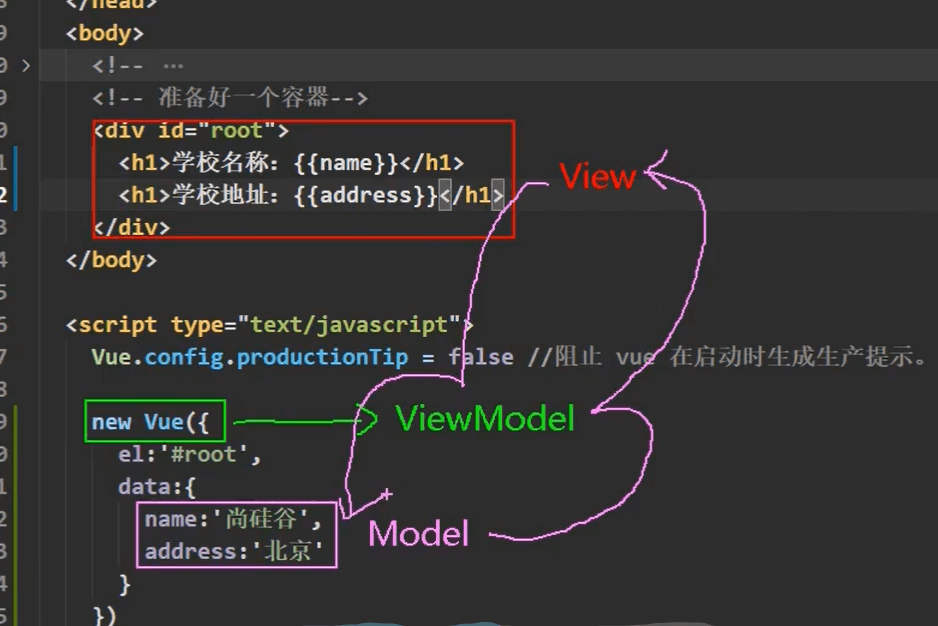

1. data中所有的属性,最后都出现在了vm身上。【const vm = new Vue()，还有vm_data】
2. vm身上所有的属性及 Vue原型上所有属性，在Vue模板中都可以直接使用。

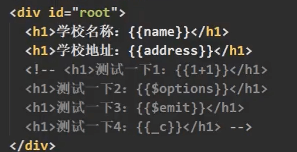


### Object.defineProperty()

```javascript
<script type="text/javascript">
    let person = {
        name:"鲸落",
        sex:'男',
        // age:18.
    }

    Object.defineProperty(person,age,{
        value:'18',
        enumerable:true,//控制属性是否可以被枚举
        writable:true,//控制属性是否可以被修改
        configurable:true,//控制属性是否可以被删除
        //同时还有set和get方式，要理解
        //get的作用：当有人读取改属性的时候，get就会被调用，且返回值就作为他自己的值
        get(){
            console.log("读属性");
            return age
        },
        set(value){
            console.log("改属性");
            console.log(value);
        }
    })

	console.log(person);
</script>
```


### 事件处理

#### @click

事件的基本使用:

1. 使用v-on :xxx或@xxx绑定事件，其中xxx是事件名
2. 事件的回调需要配置在methods对象中,最终会在vm 上;
3. methods中配置的函数,不要用箭头函数!否则this就不是vm了;
4. methods中配置的函数，都是被Vue所管理的函数，this的指向是vm或组件实例对象
5. @click="demo”和@click="demo($event)”效果一致，但后者可以传参，在进行多个数据的传参的时候， &event 起到占位的作用

```vue
<body>
    <!-- 创建容器 -->
    <div id="app">
        <button @click="one(18,$event)">ss</button>
    </div>
    <script type="text/javascript">
        Vue.config.productionTip = false //阻止 vue 在启动的时的生产提示

        //创建Vue实例
        new Vue({
            el:'#app',
            data:{
                // one:"www.baidu.com"
            },
            methods: {
                one(number,event){
                    console.log("点击");
                    console.log(number,event);
                }
            }
        })
    </script> 
</body>
```

#### 事件修饰符

Vue中的事件修饰符:[注：修饰符可以连这写]

1. prevent: 阻止默认事件（常用）
2. stop:阻止事件冒泡（常用）
3. once:事件只触发一次（常用）
4. capture:使用事件的捕获模式;
5. self:只有event.target是当前操作的元素时才触发事件;
6. passive:事件的默认行为立即执行,无需等待事件回调执行完毕;

```javas
<button @click.stop.prevent="one">click</button>
```


#### 键盘事件

1. Vue中常用的按键别名:
   回车=>enter
   删除=>delete(捕获“删除”和“退格”键)退出=>esc
   空格=>space

   换行=>tab	（特殊，必须配合keydown使用）

   上=> up

   下 =>down

   左=>left

   右=> right

2. Vue未提供别名的按键，可以使用按键原始的key值去绑定，但注意要转为kebab-case（短横线命名)

3. 系统修饰键（用法特殊）:ctrl、alt、shift、meta
   (1).配合keyup使用:按下修饰键的同时，再按下其他键，随后释放其他键，事件才被触发。

   (2).配合keydown使用:正常触发事件。

4. 也可以使用keyCode去指定具体的按键(不推荐)

5. Vue.config.keyCodes.自定义键名=键码,可以去定制按键别名

```javas
<input type="text" name="" id="" @keyup.enter="one">
```


### 计算属性computed

计算属性:

1. 定义:要用的属性不存在,要通过已有属性计算得来。
2. 原理:**底层借助了objcet.defineproperty方法提供的getter和setter**
3. get函数什么时候执行?
   (1).初次读取时会执行一次。
   (2).当依赖的数据发生改变时会被再次调用。
4. 优势:与methods实现相比，内部有缓存机制(复用），效率更高，调试方便。
5. 备注:
   1.计算属性最终会出现在vm上，直接读取使用即可。
   2.如果计算属性要被修改，那必须写set函数去响应修改，且set中要引起计算时依赖的数据发生改变

```javas
<body>
    <!-- 创建容器 -->
    <div id="app">
        姓：<input type="text" name="" id="" v-model="firstName">
        名：<input type="text" name="" id="" v-model="lastName">
        全名：<span>{{fullName}}</span>
    </div>
    <script type="text/javascript">
        Vue.config.productionTip = false //阻止 vue 在启动的时的生产提示

        //创建Vue实例
        new Vue({
            el:'#app',
            data:{
                firstName:"鲸",
                lastName:"落"
            },
            methods: {

            },
            computed: {
                fullName:{
                    //get有什么作用?当有人读取fullName时，get就会被调用，且返回值就作为fullName的值
                    //get什么时候调用?1.初次读取fullName时。2.所依赖的数据发生变化时。
                    get(){
                        return this.firstName + '-' + this.lastName
                    },
                    //set什么时候被调用？1.当fullName被修改的时候 
                    set(){
						
                    }
                }
                //简写:在你确定了你的set方法不需要的时候，直接写
                //注意：fullName在调用的时候，他表面是个函数，其实他是个属性，所以调用的时候{{fullName}}即可，不用括号
                fullName(){

                }
            }
        })
    </script> 
</body>
```


### 监听属性watch

#### 监视属性watch

1. 当被监视的属性变化时,回调函数自动调用,进行相关操作
2. 监视的属性必须存在（可以是data的属性，也可以是computed的计算属性）,才能进行监视!!
3. 监视的两种写法:
   (1).new Vue时传入watch配置(2).通过vm. $watch监视

```
<!DOCTYPE html>
<html lang="zh-CN">
<head>
    <meta charset="UTF-8">
    <meta http-equiv="X-UA-Compatible" content="IE=edge">
    <meta name="viewport" content="width=device-width, initial-scale=1.0">
    <title>Document</title>
    <script src="../vue.js"></script>
</head>
<body>
    <!-- 创建容器 -->
    <div id="app">
        <div>11{{info}}</div>
        <button @click="click">点击</button>
    </div>
    <script type="text/javascript">
        Vue.config.productionTip = false //阻止 vue 在启动的时的生产提示

        //创建Vue实例
        new Vue({
            el:'#app',
            data:{
                isHot:true
            },
            methods: {
                click(){
                    this.isHot = !this.isHot
                }
            },
            computed: {
                info(){
                    return this.isHot ? "炎热" : "凉爽"
                }
            },
            watch: {
            //其实对与监视，‘isHot’才是正确的写法，对与直接写isHot也行，但当我们要写比如number.a的时候就要加引号了
                isHot:{
                    //立即监听：在初始化的时候就监听一次
                    immediate:true,
                    //handler在isHot发生改变的时候被调用
                    handler(newValue,oldValue){
                        console.log("gaibian");
                    }
                }
                //简写：当监听属性不需要deep、immediate等的时候，就可以这样写
                isHot(newValue,oldValue){}
            }
        })
    </script> 
</body>
</html>

//通过vm. $watch监视:
const vm = new Vue({...})
vm.$watch('isHot',{ 大括号写的就和watch里面的一样了 })
```

#### 深度监听

深度监视:

1. vue中的watch默认不监测对象内部值的改变(一层）。
2. 配置deep:true可以监测对象内部值改变(多层）
3. 备注:
   1. vue自身可以监测对象内部值的改变，但Vue提供的watch默认不可以!
   2. 使用watch时根据数据的具体结构,决定是否采用深度监视。

```
<!DOCTYPE html>
<html lang="zh-CN">
<head>
    <meta charset="UTF-8">
    <meta http-equiv="X-UA-Compatible" content="IE=edge">
    <meta name="viewport" content="width=device-width, initial-scale=1.0">
    <title>Document</title>
    <script src="../vue.js"></script>
</head>
<body>
    <!-- 创建容器 -->
    <div id="app">
        <div>a是{{number.a}}</div>
        <button @click="number.a++">a+1</button>
    </div>
    <script type="text/javascript">
        Vue.config.productionTip = false //阻止 vue 在启动的时的生产提示

        //创建Vue实例
        new Vue({
            el:'#app',
            data:{
                number:{
                    a:1,
                    b:1
                }
            },
            watch: {
                number:{
                    //深度监听：监视多级结构中所有属性的变化
                    //当我没有加上deep的时候，在我们改变a的时候，无法监测number的变化
                    deep:true,
                    handler(){
                        console.log("监听到了number改变");
                    }
                }
            }
        })
    </script> 
</body>
</html>
```


### watch与computed对比

computed和watch之间的区别:

1. computed能完成的功能,watch都可以完成。
2. watch能完成的功能，computed不一定能完成，例如:watch可以进行异步操作。
3. 两个重要的小原则:
   1. 所被Vue管理的函数，最好写成普通函数，这样this的指向才是vm或组件实例对象。
   2. 所有不被Vue所管理的函数（定时器的回调函数、ajax的回调函数等、Promise的回调函数），最好写成箭头函数，这样this的指向才是vm或组件实例对象。


### 动态绑定class样式

**:class**

```javas
<body>
    <div id="app">
        <!-- 绑定class样式：字符串写法，适用于  样式的类名不确定，需要动态指定 -->
        <div :class="num"></div>
        <!-- 绑定class样式：数组写法，适用于  要绑定的样式的个数、名字不确定 -->
        <div :class="arr"></div>
        <!-- 绑定class样式：对象写法，适用于  要绑定的样式的个数、名字确定，但要动态决定用不用 -->
        <div :class="classObj"></div>
    </div>
    <script>
        new Vue({
            el:'#app',
            data:{
                num:"normal",
                arr:[
                    'one',
                    'two',
                    'three'
                ],
                classObj:{
                    one:true,
                    two:false
                }
            }
        })
    </script>
</body>
```


### 动态绑定style

与动态绑定class同理

**:style**

```javas
<body>
    <div id="app">
         <!-- 绑定class样式：对象写法-->
        <div :style="styleObj"></div>
    </div>
    <script>
        new Vue({
            el:'#app',
            data:{
                styleObj:{
                    color:'red',
                    backgroundColor:'#fff'
                }
            }
        })
    </script>
</body>
```


### 条件渲染v-show与v-if

#### v-show

v-show为true的时候显示，false的时候隐藏

```javas
<div v-show="true">显示</div>
<div v-show="false">隐藏</div>
```

写法:

1. v-show="表达式"
2. 适用于:切换频率较高的场景。
3. 特点:不展示的DOM元素未被移除,仅仅是使用样式隐藏掉

#### v-if

v-if为true的时候显示，false的时候隐藏

```javas
<div v-if="true">显示</div>
<div v-if="false">隐藏</div>
```

**v-if与template的配合使用**

在三个div外面包裹一个template，在dom解析的时候，会将template清除，没有了，仅起到包裹的作用

注意：template这样的作用只能和v-if一起使用

```javas
<template v-if="a==1">
    <div>111</div>
    <div>222</div>
    <div>333</div>
</template>
```

写法:

1. v-if="表达式"
2. v-else-if="表达式"
3. v-else="表达式"适用于:切换频率较低的场景。
4. 特点:不展示的DOM元素直接被移除。
5. 注意: v-if可以和:v-else-if、v-else一起使用，但要求结构不能被“打断”。

#### v-show与v-if的区别

如果大家的切换频率很高，建议使用v-show，因为不展示的dom节点还在，只是动态控制隐藏和显示，而v-if是直接将dom元素移除


### 列表渲染v-for

#### v-for的使用

注意：在使用v-for的时候必须带上他的标识符key

v-for指令:

1. 用于展示列表数据
2. 语法:v-for="(item,index) in xxx" :key="yyy"
3. 可遍历:数组、对象、字符串（用的很少)、指定次数（用的很少)

```javascript
<body>
    <div id="app">
        <div>遍历数组</div>
        <ul>
            <li v-for="(item,index) in persons" :key="index">{{item.name}}-{{item.age}}</li>
        </ul>
        <div>遍历对象</div>
        <ul>
            <!-- 但与遍历数组不同的是，遍历对象的第一个值时value，第二个值是name，不是index -->
            <li v-for="(value,name) in cars" :key="name">{{value}}-{{name}}</li>
        </ul>
    </div>
    <script>
        new Vue({
            el:'#app',
            data:{
                persons:[
                    {id:'001',name:'鲸落',age:18},
                    {id:'002',name:'To fly',age:19},
                    {id:'003',name:'巴西世界杯冠军',age:20}
                ],
                cars:{
                    name:"五菱宏光",
                    prices:'1w',
                    color:'白色'
                }
            }
        })
    </script>
</body>
```

key作用与原理

面试题:react、vue中的key有什么作用?（key的内部原理)

1. 虚拟DOM中key的作用：key是虚拟DOM对象的标识，当数据发生变化时，Vue会根据【新数据】生成【新的虚拟DOM】,随后Vue进行【新虚拟DOM】与【旧虚拟DOM】的差异比较，比较规则如下:

2. 对比规则:

   1. 旧虚拟DOM中找到了与新虚拟DOM相同的key:
      1. 若虚拟DOM中内容没变,直接使用之前的真实DOM !
      2. 若虚拟DOM中内容变了，则生成新的真实DOM，随后替换掉页面中之前的真实DOM。
   2. 旧虚拟DOM中未找到与新虚拟DOM相同的key，创建新的真实DOM,随后渲染到到页面。

3. 用index作为key可能会引发的问题:

   1. 若对数据进行:逆序添加、逆序删除等破坏顺序操作:
      会产生没有必要的真实DOM更新 ——> 界面效果没问题,但效率低.

   2. 如果结构中还包含输入类的DOM：

      会产生错误DOM更新 ——> 界面有问题。

4. 开发中如何选择key? :

   1. 最好使用每条数据的唯一标识作为key,比如id、手机号、身份证号、学号等唯一值。
   2. 如果不存在对数据的逆序添加、逆序删除等破坏顺序操作，仅用于渲染列表用于展示，使用index作为key是没有问题的。


#### 列表过滤

##### 监视器watch实现

```javascript
<body>
    <div id="app">
        <input type="text" placeholder="请输入姓名" v-model="name">
        <ul>
            <li v-for="(item,index) in filPersons" :key="index">{{item.name}}-{{item.age}}-{{item.sex}}</li>
        </ul>
    </div>
    <script>
        new Vue({
            el:'#app',
            data:{
                name:'',
                persons:[
                    {id:'001',name:'马冬梅',age:18,sex:'女'},
                    {id:'002',name:'马东锡',age:19,sex:'男'},
                    {id:'003',name:'周杰伦',age:20,sex:'男'},
                    {id:'004',name:'小冬伦',age:21,sex:'女'},
                ],
                filPersons:[]
            },
            watch: {
                name:{
                    immediate:true,
                    handler(newValue,oldValue){
                        this.filPersons = this.persons.filter((p)=>{
                            return p.name.indexOf(newValue) != -1
                        })
                    }
                }
            }
        })
    </script>
</body>
```

##### 计算属性computed实现

```javascript
<body>
    <div id="app">
        <input type="text" placeholder="请输入姓名" v-model="name">
        <ul>
            <li v-for="(item,index) in filPersons" :key="index">{{item.name}}-{{item.age}}-{{item.sex}}</li>
        </ul>
    </div>
    <script>
        new Vue({
            el:'#app',
            data:{
                name:'',
                persons:[
                    {id:'001',name:'马冬梅',age:18,sex:'女'},
                    {id:'002',name:'马东锡',age:19,sex:'男'},
                    {id:'003',name:'周杰伦',age:20,sex:'男'},
                    {id:'004',name:'小冬伦',age:21,sex:'女'},
                ],
            },
            computed: {
                filPersons(){
                    return this.persons.filter((p)=>{
                        return p.name.indexOf(this.name) != -1
                    })
                }
            }
        })
    </script>
</body>
```

#### 列表排序

```javascript
<body>
    <div id="app">
        <input type="text" placeholder="请输入姓名" v-model="name">
        <button @click="sortType = 2">升序</button>
        <button @click="sortType = 1">降序</button>
        <button @click="sortType = 0">原序</button>
        <ul>
            <li v-for="(item,index) in filPersons" :key="index">{{item.name}}-{{item.age}}-{{item.sex}}</li>
        </ul>
    </div>
    <script>
        new Vue({
            el:'#app',
            data:{
                name:'',
                sortType:0,
                persons:[
                    {id:'001',name:'马冬梅',age:30,sex:'女'},
                    {id:'002',name:'马东锡',age:19,sex:'男'},
                    {id:'003',name:'周杰伦',age:20,sex:'男'},
                    {id:'004',name:'小冬伦',age:11,sex:'女'},
                ],
            },
            computed: {
                filPersons(){
                   const arr = this.persons.filter((p)=>{
                        return p.name.indexOf(this.name) != -1
                    })
                    if(this.sortType){
                        arr.sort((a,b)=>{
                            return this.sortType == 1 ? b.age - a.age : a.age - b.age;
                        })
                    }
                    return arr
                }
            }
        })
    </script>
</body>
```


### Vue的数据监测

#### Vue监测数据的原理—对象

#### Vue.set 与 vm.$set

```javascript
<body>
    <div id="app">
        <button @click="addSex">点击添加一个性别</button>
        <div>姓名：{{person.name}}</div>
        <div>年龄：{{person.age}}</div>
        <div v-show="person.sex">性别：{{person.sex}}</div>
    </div>
    <script>
        new Vue({
            el:'#app',
            data:{
                person:{
                    name:"鲸落",
                    age:18,
                }
            },
            methods: {
                addSex(){
                    //二者都可以实现添加
                    // Vue.set(this.person,"sex","男")
                    this.$set(this.person,"sex","男")
                }
            }
        })
    </script>
</body>
```


#### Vue监测数据的原理—数组

#### Vue监视数据的原理总结

vue监视数据的原理:
1. vue会监视data中所有层次的数据。

2. 如何监测对象中的数据?

   通过setter实现监视，且要在new Vue时就传入要监测的数据。

   (1).对象中后追加的属性，Vue默认不做响应式处理
   (2).如若给后添加的属性做响应式,请使用如下API:
   	Vue.set(target，propertyName/index，value）或 

   ​	vm.$set(target，propertyName/index，value)

3. 如何监测数组中的数据?

   通过包裹数组更新元素的方法实现,本质就是做了两件事:

   (1).调用原生对应的方法对数组进行更新。
   (2).重新解析模板，进而更新页面。

4. 在Vue2修改数组中的某个元素一定要用如下方法:

   1. 使用这些API：push()、pop()、shift()、unshift()、splice()、sort()、reverse()
   2. Vue.set()或vm.$set()

   

   特别注意:Vue.set()和 vm.$set()不能给vm或 vm的**根数据对象**添加属性！！

### 表单数据收集

使用lable来增加交互性：点击文字也可以进输入框

```
//lable的for与input的id对应
<form>
    <label for="demo">
    	账号：<input type="text" id="demo">
    </label>
</form>
```

 收集表单数据:

1. 若:<input type="text"/>，则v-model收集的是value值，用户输入的就是value值。

2. 若:<input type="radio"/>，则v-model收集的是value值，且要给标签配置value值.

3. 若:<input type="checkbox"/>

   1. 没有配置input的value属性，那么收集的就是checked（勾选or未勾选，是布尔值)

   2. 配置input的value属性:
      (1)v-model的初始值是非数组，那么收集的就是checked（勾选or未勾选，是布尔值)

      (2)v-model的初始值是数组，那么收集的的就是value组成的数组

4. 备注:v-model的三个修饰符:

   1. lazy:失去焦点再收集数据
   2. number:输入字符串转为有效的数字
   3. trim:输入首尾空格过滤

```js
<body>
    <div id="app">
        <form @submit.prevent="submit">
            <!-- v-model.trim：去掉字符串前后的空格，当然空格在中间就去不掉了 -->
            账号：<input type="text" v-model.trim="userInfo.count">
            <br/><br/>
            密码：<input type="password" v-model="userInfo.password">
            <br/><br/>
            性别：<!-- 注意配置name -->
            男：<input type="radio" name="sex" value="male" v-model="userInfo.sex">
            女：<input type="radio" name="sex" value="female" v-model="userInfo.sex">
            <br/><br/>
            <!-- type=number 是原生demo，加上则输入框只能输入数字，但获得的数字类型是字符串，不是number类型
            要想变成number类型，则使用v-mode给我们提供的v-model.number -->
            年龄：<input type="number" v-model.number="userInfo.age">
            <br/><br/>
            爱好：<!-- 写上value是为了获取选择的值，而下面的隐私只是为了获取点了或没点，不用value即可 -->
            学习<input type="checkbox" value="study" v-model="userInfo.hobby">
            吃饭<input type="checkbox" value="eat" v-model="userInfo.hobby">
            打游戏<input type="checkbox" value="game" v-model="userInfo.hobby">
            <br/><br/>
            所在区域：
            <select v-model="userInfo.city">
                <option value="">选择城市</option>
                <option value="a">北京</option>
                <option value="b">上海</option>
                <option value="c">合肥</option>
            </select>
            <br/><br/>
            <!-- 对于这样长的输入框，我们加入v-mode.lazy来实现，他在失去焦点的时候收集信息，没有那么频繁的收集 -->
            其他信息：<textarea v-model.lazy="userInfo.other"></textarea>
            <br/><br/>
            <!-- 没有加value，仅获取true和false -->
            <input type="checkbox" v-model="userInfo.agree">隐私信息
            <br/><br/>
            <button>提交</button>
        </form>
    </div>
    <script>
        new Vue({
            el:'#app',
            data () {
                return {
                    userInfo:{
                        count:"",
                        password:"",
                        sex:"",
                        age:"",
                        hobby:[],//注意hobby的类型也会影响收集表单的值.
                        city:'',
                        other:'',
                        agree:''
                    }
                }
            },
            methods: {
                submit(){
                    console.log(this.userInfo);
                    console.log(JSON.stringify(this.userInfo));
                }
            }
        })
    </script>
</body>
```


### 过滤器

定义:对要显示的数据进行特定格式化后再显示（适用于一些简单逻辑的处理）。

语法:

1. 注册过滤器:Vue.filter(name,callback)或new Vue{filters:{}
2. 使用过滤器:{{ xxx│过滤器名}}或v-bind:属性=“xxx|过滤器名"
3. 备注:
   1. 过滤器也可以接收额外参数、多个过滤器也可以串联
   2. 并没有改变原本的数据,是产生新的对应的数据


### Vue指令v-

#### V-bind

**动态绑定**：单项绑定

```javascript
<!DOCTYPE html>
<html lang="zh-CN">
<head>
    <meta charset="UTF-8">
    <meta http-equiv="X-UA-Compatible" content="IE=edge">
    <meta name="viewport" content="width=device-width, initial-scale=1.0">
    <title>Document</title>
    <script src="../vue.js"></script>
</head>
<body>
    <!-- 创建容器 -->
    <div id="app">
        <a v-bind:href="baidu"></a>
		<!-- 等价 -->
        <a :href="baidu"></a>
    </div>
    <script type="text/javascript">
        Vue.config.productionTip = false //阻止 vue 在启动的时的生产提示

        //创建Vue实例
        new Vue({
            el:'#app',
            data:{
                baidu:"www.baidu.com"
            }
        })
    </script>
</body>
</html>
```


#### V-model

**动态绑定**：双项绑定

```javascript
<!DOCTYPE html>
<html lang="zh-CN">
<head>
    <meta charset="UTF-8">
    <meta http-equiv="X-UA-Compatible" content="IE=edge">
    <meta name="viewport" content="width=device-width, initial-scale=1.0">
    <title>Document</title>
    <script src="../vue.js"></script>
</head>
<body>
    <!-- 创建容器 -->
    <div id="app">
        单项绑定：<input type="text" name="" id="" :value="one">
        双项绑定：<input type="text" name="" id="" v-model:value="one">
    </div>
    <script type="text/javascript">
        Vue.config.productionTip = false //阻止 vue 在启动的时的生产提示

        //创建Vue实例
        new Vue({
            el:'#app',
            data:{
                one:"www.baidu.com"
            }
        })
    </script> 
</body>
</html>
```


如下代码是错误的，**因为v-mode只能用在表单类元素上** `<h1 v-mode1:value = "one">非表单</h1>`

#### v-text

我们学过的指令:

1. v-bind : 单向绑定解析表达式,可简写为·:XXX
2. v-model-→双向数据绑定
3. v-for -→遍历数组/对象/字符串
4. v-on: 绑定事件监听,可简写为@
5. v-if -→ 条件渲染（动态控制节点是否存存在) 
6. v-else:条件渲染（动态控制节点是否存存在)
7. v-show :条件渲染(动态控制节点是否展示)


v-text指令：【v-text用的少】

1. 作用:向其所在的节点中渲染文内容。
2. 与插值语法的区别:v-text会替换掉节点中的内容，{{xx}}则不会。

```javascript
<body>
    <div id="app">
        <div>{{name}}</div>
        <div v-text="name"></div>
		<!-- 用v-text不认nameA的html代码 -->
        <div v-text="nameA"></div>
    </div>
    <script>
        new Vue({
            el:'#app',
            data:{
                name:'鲸落',
                nameA:'<h1>鲸落</h1>'
            },
        })
    </script>
</body>
```

#### v-html

与v-text对比，他认识data中的html标签，他支持结构解析

v-html指令:

1. 作用:向指定节点中渲染包含html结构的内容。
2. 与插值语法的区别:
   1. v-html会替换掉节点中所有的内容，{{xx}}则不会。
   2. v-html可以识别html结构。
3. 严重注意:v-html有安全性问题!!!!【少用】
   1. 在网站上动态渲染任意HTML是非常危险的，容易导致XSS攻击。
   2. 一定要在可信的内容上使用v-html，永不要用在用户提交的内容上!

#### v-cloak

v-cloak指令（没有值):

1. 本质是一个特殊属性，Vue实例创建完毕并接管容器后，会删掉v-cloak属性。
2. 使用css配合v-cloak可以解决网速慢时页面展示出{{xxx}}的问题。

#### v-once

V-once指令:

1. v-once所在节点在初次动态渲染后,就视为静态内容了。
2. 以后数据的改变不会引起v-once所在结构的更新，可以用于优化性能。

```javascript
<body>
    <div id="app">
        <div v-once>n的初始值：{{n}}</div>
        <div>n执行++：{{n}}</div>
        <button @click="n++">n+1</button>
    </div>
    <script>
        new Vue({
            el:'#app',
            data:{
                n:1
            },
        })
    </script>
</body>
```

#### v-pre

v-pre指令:

1. 跳过其所在节点的编译过程。
2. 可利用它跳过:没有使用指令语法、没有使用插值语法的节点，会加快编译。


### 自定义指令(待)


### 生命周期

#### 生命周期定义

1. 又名:生命周期回调函数、生命周期函数、生命周期钩子
2. 是什么:Vue在关键时刻帮我们调用的一些特殊名称的函数。
3. 生命周期函数的名字不可更改，但函数的具体内容是程序员根据需求编写的。
4. 生命周期函数中的this指向是vm或组件实例对象。

#### 完成流程图


#### 细分析


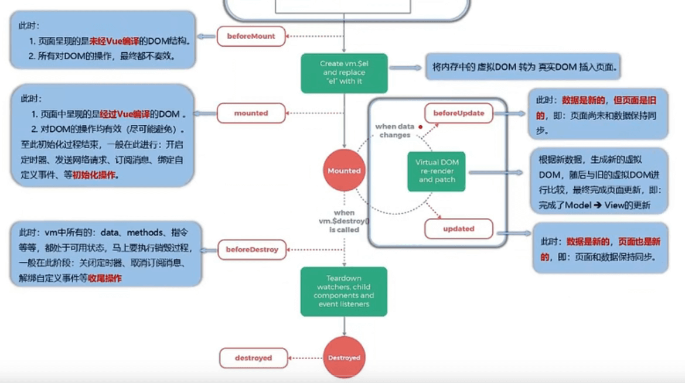

#### 总结

注意：beforeCreated() 表示创建之前，是在数据监测和数据代理创建之前，不是vm创建之前

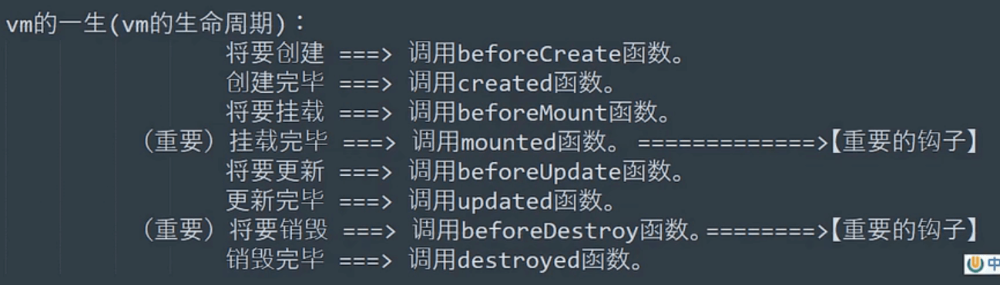

常用的生命周期钩子:

1. mounted:发送ajax请求、启动定时器、绑定自定义事件、订阅消息等【初始化操作】
2. beforeDestroy:清除定时器、解绑自定义事件、取消订阅消息等【收尾工作】。

关于销毁Vue实例

1. 销毁后借助Vue开发者工具看不到任何信息。
2. 销毁后自定义事件会失效，但原生DOM事件依然有效。
3. 一般不会再beforeDestroy操作数据，因为即便操作数据，也不会再触发更新流程了。


## Vue组件化编程

非单文件组件︰一个文件中包含有n个组件。
单文件组件︰一个文件中只包含有1个组件。


### 非单文件组件

**Vue中使用组件的三大步骤:**

1. 定义组件(创建组件)
2. 注册组件（分为全局注册和局部注册
3. 使用组件(写组件标签)

**如何定义一个组件?**
使用Vue.extend(options)创建，其中options和new Vue(options)时传入的那个options几乎一样，但也有一点区别，

区别如下:

1. el不要写，为什么?——最终所有的组件都要经过一个vm的管理，由vm中的el决定服务哪个容器
2. data必须写成函数，为什么?——避免组件被复用时，数据存在引用关系。
3. 备注:使用template可以配置组件结构。

**如何注册组件?**

1. 局部注册:靠new Vue的时候传入components选项
2. 全局注册:靠Vue.component('组件名’,组件)

**编写组件标签**:
<school></school>

```javascript
<body>
    <div id="app">
        <!-- <h2>学校名字：{{SchoolName}}</h2>
        <h2>学校地址：{{address}}</h2>
        <hr>
        <h2>学生名字：{{StudentName}}</h2>
        <h2>学生年龄：{{age}}</h2> -->
        <hr>
        <!-- 第三部：引用组件标签 -->
        <school></school>
        <student></student>
    </div>
    <script>
        //第一步：创建组件：
        //创建school组件
        const school = Vue.extend({
            template:
            `
                <div>
                    <h2>学校名字：{{SchoolName}}</h2>
                    <h2>学校地址：{{address}}</h2>
                </div>
            `,
            // el:'#app',//组件定义时,一定不要写el配置项,
            data(){ //data数据要写函数返回的形式
                return{
                    SchoolName:"河北地质大学",
                    address:"河北", 
                }
            }
        })

         //创建school组件
         const student = Vue.extend({
            // el:'#app',//组件定义时,一定不要写el配置项,
            template:
            `
                <div>
                    <h2>学生名字：{{StudentName}}</h2>
                    <h2>学生年龄：{{age}}</h2>
                </div>
            `,
            data(){ //data数据要写函数返回的形式
                return{
                    StudentName:"鲸落",
                    age:18
                }
            }
        })

        //第一个school是组件的名字，第二个school是组件在哪
        //第二步：注册组件（全局注册）
        Vue.component('school',school)

        new Vue({
            el:'#app',
            //第二步：注册组件（局部注册）
            components: {
                student,
            },
            // data:{
            //     SchoolName:"河北地质大学",
            //     address:"河北", 
            //     StudentName:"鲸落",
            //     age:18
            // }
        })
    </script>
</body>
```

### 组件注意点

1. 关于组件名:

   一个单词组成:
   		第一种写法(首字母小写):school

   ​		第二种写法(首字母大写):School

   多个单词组成:
   		第一种写法(kebab-case命名):my-school

   ​		第二种写法(CamelCase命名): MySchool(需要Vue脚手架支持)
   备注:
   ​		(1).组件名尽可能回避HTML中已有的元素名称，例如:h2、H2都不行。

   ​		(2).可以使用name配置项指定组件在开发者工具中呈现的名字。

2. 关于组件标签:

   第一种写法:<school></school>

   第二种写法:<school/>
   备注:不使用脚手架时，<school/>会导致后续组件不能渲染。

3. 一个简写方式:
   const school = Vue.extend(options）可简写为: const school = options


### 组件的嵌套

在需要嵌套的组件里加上components进行注册即可

```javascript
<body>
    <div id="app">
        <school></school>
        <!-- <student></student> -->
    </div>
    <script>

        const student = Vue.extend({
            template:
            `
                <div>
                    <h2>学生名字：{{StudentName}}</h2>
                    <h2>学生年龄：{{age}}</h2>
                </div>
            `,
            data(){ 
                return{
                    StudentName:"鲸落",
                    age:18
                }
            }
        })

        const school = Vue.extend({
            template:
            `
                <div>
                    <h2>学校名字：{{SchoolName}}</h2>
                    <h2>学校地址：{{address}}</h2>
                    <student></student>
                </div>
            `,
            data(){ 
                return{
                    SchoolName:"河北地质大学",
                    address:"河北", 
                }
            },
            components: {
                student
            }
        })


        new Vue({
            el:'#app',
            components: {
                // student,
                school
            },
        })
    </script>
</body>
```


### Vuecomponent构造函数

关于VueComponent:

1. school组件本质是一个名为VueComponent的构造函数，且不是程序员定义的，是Vue.extend生成的。

2. 我们只需要写<school/>或<school></school>，Vue解析时会帮我们创建school组件的实例对象，即lvue帮我们执行的:new Vuecomponent(options)。

3. 特别注意:每次调用vue.extend，返回的都是一个全新的VueComponent！！！

4. 关于this指向:
   1. 组件配置中:
      data函数、methods中的函数、watch中的函数、computed中的函数它们的this均是【VueComponent实例对象】
   2. new Vue(options)配置中:
      data函数、methods中的函数、watch中的函数、computed中的函数它们的this均是【Vue实例对象】。

5. VueComponent的实例对象，以后简称vc（也可称之为:组件实例对象）。
   vue的实例对象,以后简称vm.

6. 一个重要的内置关系:`VueComponent.prototype.__proto__ == Vue.prototype`

   为什么要有这个关系:让组件实例对象(vc）可以访问到 Vue原型上的属性、方法。

### 单文件组件

1. xx.Vue：创建一个个的vue文件来形成一个组件，但这些组件最后都要归一个组件管着，就是App.vue组件，在App.vue中引入并注册

2. 我现在创建了school.vue和student.vue两个组件，在App.vue中：

   ```javascript
   <template>
     <div>
       <school></school>
       <student></student>
     </div>
   </template>
   
   <script>
       export default {
           name:'App',
           components: {
               school,
               student,
           }
       }
   </script>
   ```

   

3. main.js，与App.vue进行对象，创建Vue实例，其他组件不能与main.js对话，权限不够，只能与App.vue对话

   ```
   import App from './App.vue'
   
   new Vue({
       el:"app",//准备的容器
       components: {App},//只要注册一个App就可以了，其他的组件在App中注册了
   })
   ```

   

4. 这时候我们加上一个app.html进行一个测试

   ```
   <body>
       <!-- 准备容器 -->
       <div id="app">
           <!-- 组件一定要引入，不然就白费 -->
           <App></App>
       </div>
       <!-- 引入js文件 -->
       <script src="../vue.js"></script>
       <script src="main.js"></script>
   </body>
   ```


## Vue使用习惯

1. pages页面放置路由组件
2. components页面放置组件
3. router文件夹配置路由
4. store文件夹配置仓库


## 使用Vue脚手架

创建Vue文件：vue create 名字

### 分析Vue脚手架

1. .gitignore：git上传忽略文件

2. babel.config.js：babel控制文件

3. package.json：配置文件

4. main.js：整个文件的入口文件

   ```
   // 整个项目的入口文件：
   
   //引入vue
   import Vue from 'vue'
   //引入App组件
   import App from './App.vue'
   //关闭vue的生产提示
   Vue.config.productionTip = false
   //创建vue1的实例对象
   new Vue({
     //将App组件放入实例中
     render: h => h(App),
   }).$mount('#app')
   ```

   

5. assets：静态资源

### 配置可选择文件

1. vue.config.js：`module.exports = {}`
2. lintOnSave:false 【关闭Vue编译时候的语法检查】
3. 在Vue中，Vue = this.$


### ref属性

ref 与 `$refs`

1. 被用来给元素或子组件注册引用信息(id的替代者)

2. 应用在html标签上获取的是真实DOM元素，应用在组件标签上是组件实例对象(vc)

3. 3.使用方式:
   打标识:`<h1 ref="xxx">.....</h1>或<School ref="xxx">x</School>`

   获取: this.$refs.xxx


### 组件通信

#### 父给子：props

子用props来接受父传来的数据

```javascript
//App.vue:这个:age加不加引号主要是看他是否涉及到js的运行，:age传的就是number18，不加传的是string18，当你是运行表达式的时候就要加冒号
<school name="鲸落" :age="18"></school>

//school.vue:
<template>
  <div>
    名字：{{name}}
    年龄：{{age}}
  </div>
</template>

<script>
export default {
    name:'school',
    data(){
        return{
            // name:'鲸落',
            // age:18,

            // props是只读的，Vue底层会监测你对props的修改，
            // 如果进行了修改,就会发出警告，若业务需求确实需要修改，
            // 那么请复制props的内容到data中一份，然后去修改data中的数据。
            myAge:this.age
        }
    },
    //简单的声明
    props:['name','age'],
    //接收到的数据进行限制，但也只是报警告错误，比如你限制传来number，接收的是string，还是会正常执行，但控制台会报错
    props:{
        name:String,
        age:Number,
    },
    //接收的同时进行数据的限制+默认值的指定+必要性的限制
    props:{
        name:{
            type:String,
            required:true,//必传的，意思是name是必传的
        },
        age:{
            type:Number,
            default:99,//默认值【不是必传的，但如果传就是你传的数，不传就默认的数，99】
        }
    }
}
</script>
```


#### 子给父：绑定自定义事件

子使用`$emit`来绑定自定义事件来给父传送数据，父用`$on`来接收【使用 `$off`解绑自定义事件】，而在父组件上，子组件需要绑定自定义事件

```javascript
//子：one.vue
<template>
  <div>
    <div>{{name}}</div>
    <button @click="send">发送</button>
  </div>
</template>

<script>
export default {
    name:"one",
    data(){
        return{
           name:"鲸落"
        }
    },
    methods:{
        send(){
            console.log("dd");
            this.$emit('myName',this.name)
            //this.$off('myName')【解绑自定义事件】
            //解绑多个自定义得用数组：this.$off(['myName','first'])
            //解绑所有的自定义事件：this.$off()
            //当前使用destory()也会解绑自定义事件
        }
    }
}
</script>

//父：App.vue
<template>
  <div id="app">
      //绑定了自定义事件，来接受子传来的数据【其实对于这样的接收事件来说，如果当组件之间的通讯变多的时候，或者当我要设置组件挂在完成后三秒在传参，就不方便了，我们可以按下面这样写：（在下面）】
    <one @myName="myName"></one>
	//<one @myName.once="myName"></one>【自定义事件触发一次就不触发了】
	//<one v-on:myName="myName"></one>
  </div>
</template>

<script>
import one from "./components/one.vue"

export default {
  name:"App",
  components:{
    one
  },
  methods:{
    myName(name){
      console.log(name);
    }
  },
}
</script>


//父：App.vue
<template>
  <div id="app">
     //采用ref的形式，使用this.$refs来获取到改Vuecomponents实例，
    <one ref="ones"></one>
  </div>
</template>

<script>
import one from "./components/one.vue"

export default {
  name:"App",
  components:{
    one
  },
  methods:{
    myName(name){
      console.log(name);
    }
  },
  mounted(){
      //获取到Vuecomponents实例，使用$on来添加自定义事件【灵活性更强】
    this.$refs.ones.$on('myName',this.myName)
    //this.$refs.ones.$once('myName',this.myName)【自定义事件触发一次就不触发了】
  }
}
</script>
```

组件上也可以绑定原生DOM事件，需要使用**native**修饰符。`<school @click.native="demo"></school>`

注意：通过 `this.$refs.xx.$on(' atguigu',回调)`定自定义事件时，回调要么配置在methods中，要么用箭头函数,否则this指向会出问题!


#### 任意组件间通信：全局事件总线


#### 任意组件间通信：消息订阅与发布

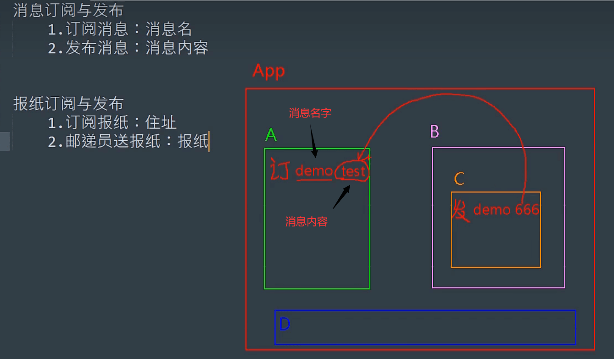

原生的js无法事件该操作，所以我们借用第三方库，推荐：pubsub-js：`npm i pubsub-js`

```javascript
//school.vue：
//先引入：
import pubsub from 'pubsub-js'
//订阅消息：
mounted(){
    this.pubId = pubsub.subscribe("hello",function(msgName,data)){【两个参数，第一个是发布的名字，第二个是传的参数】
        console.log("hello你好呀",msgName,data)
    	//同样的，这个时候打印this为undefined，解决方法当然是使用箭头函数，或者配置一个函数
    })
}
//取消订阅：
beforeDestroy(){
     pubsub.unsubscribe("hello")//但是这样是不行的，对于pubsub这个库来说不行，定义一个变量来表示：
    pubsub.unsubscribe(this.pubId)
}

//studen.vue：
//先引入：
import pubsub from 'pubsub-js'
//发布消息：
pubsub.subscribe("hello","hhhh")
```


### mixin混入

功能：可以把说个组件共用的配置提取成一个混入，比如什么data数据，method方法，在外部定义一个mixin.js进行定义

对象使用方式:
	第一步定义混合,例如:
	{
		data(){....},

​		methods:{....}
​	}
​	第二步使用混入，例如:
​		(1).全局混入：import {xxx} from ".."   Vue.mixin(xxx)

​		(2).局部混入：import {xxx} from ".."   mixins: [xxx]

```javascript
export const mixin = {
    methods:{
        show(){
            console.log("鲸落")
        }
    }
}

//引入
import {mixin} from ".."
//最重要的点！！！mixin
mixins: [mixin]
```


### 插件

功能:用于增强Vue
本质:包含install方法的一个对象，install的第一个参数是Vue，第二个以后的参数是插件使用者传递的数据。

```javascript
??.js:
export default {
	install(vue){
        console.log(vue)
    }
}

//引入：
import ?? from ".."
Vue.use(??)
```

使用插件:Vue.use()


## $nextTick

1. 语法:this.$nextTick(回调函数)
2. 作用:在下一次DOM更新结束后执行其指定的回调。
3. 什么时候用:当改变数据后，要基于更新后的新DOM进行某些操作时，要在nextTick所指定的回调函数中执行。


### 过渡与动画

#### 动画

```
当你想让哪个地方有动画就给他包包裹上标签：<transition></transition>
然后加上class .v-enter-avtive【进入】.v-leave-active【离开】来实现效果
给 transition加上name，就要改变v-的值，
如：<transition name="hello"></transition>【用来区分多个动画】
则：.hello-enter-avtive【进入】.hello-leave-active【离开】

但对于<transition>他只能包裹一个标签，想要包裹多个标签使用<transition-group>【需要指定key值】
```

#### 过渡

Vue在进入和离开的时候除了`.v-enter-avtive【进入】.v-leave-active【离开】`，

还有`v-enter,v-enter-to,v-leave,v-leave-to`，

v-enter：进去的起点

v-enter-to：进去的终点

过渡就是设置起点终点，让其变化

#### 第三方动画库

推荐：animate.css

安装：npm install animate.css

引入：import 'animate.css'

配置：加上`name="animate__animated animate__bounce"`

加动画：配上class即可，进入：`enter-active-class=""`，离开`leave-active-class=""`

#### 总结

1. 作用：在插入、更新或移除DOM元素时，在合适的时候给元素添加样式类名。
2. 图示：
3. 写法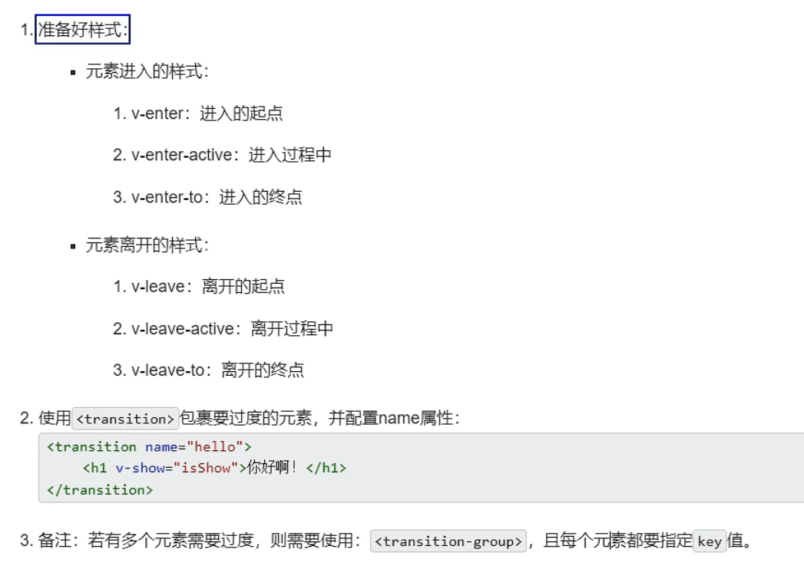


## Vue中的ajax

### 配置代理解决跨域

#### 解决跨域的办法

1. 其实可以后端配置cors来解决真正意义上的跨域，但不安全
2. jsonp：得前端后端一起配合设置，而且只能解决get请求
3. 配置代码☆【用的最多】，分nginx和vue-cli

#### 配置代理服务器

```javascript
devServer:{
		proxy:{
			'/api':{
				target:'http://localhost:8000',
				changeOrigin:true,
				pathRewrite:{
					'^/api':''
				}
			}
		}
	}
```


### 插槽

#### 默认插槽

```javascript
//App.vue:加入的数据也在App.vue中
<school>
   <!-- 放在插槽里 -->
	    
</school>
<school>
    <ul>
    	<li></li>
    </ul>
</school>
<school>
    
</school>

//school.vue:
<template>
    <div>
    <!-- 定义一个插槽，等着组件使用的时候往里面填充 -->
    	<slot>里面可以加默认值，当没有放东西的时候就展示默认值</slot>
    </div>
</template>
```


#### 具名插槽

就是具有名字的插槽，当一个页面有多个插槽的时候，给每个页面起一个名字，`<slot name=""></slot>`

```javascript
//App.vue:加入的数据也在App.vue中
<school>
	<!-- 你想把他放哪个插槽里就定义一个slot属性 -->
	    
</school>
<school>
    <ul slot="slotTwo">
    	<li></li>
    </ul>
</school>

//school.vue:
<template>
    <div>
    	<slot name="slotOne">里面可以加默认值，当没有放东西的时候就展示默认值</slot>
    	<slot name="slotTwo">里面可以加默认值，当没有放东西的时候就展示默认值</slot>
    </div>
</template>
```


#### 作用域插槽

```javascript
//App.vue:

<school>
    //使用作用域插槽接受数据必须要用template，使用scope接收
    <template scope="起一个名字，可以随便，比如hello，获取插槽传来的数据就是hello.message">
        <ul>
            <li></li>
        </ul>
    </template>
</school>

//school.vue:加入的数据在school.vue中，所以我们要把数据传给App.vue中
<template>
    <div>
    	<slot :msg="传的数据,比如message">里面可以加默认值，当没有放东西的时候就展示默认值</slot>
    </div>
</template>
```

#### 总结

1. 作用：让父组件可以向子组件指定位置插入html结构，也是一种组件间通信的方式，适用于父组件==>子组件。

2. 分类：默认插槽、具名插槽、作用域插槽

3. 默认插槽：

4. 具名插槽：

5. 作用域插槽：

   


## Vuex

### 工作原理图

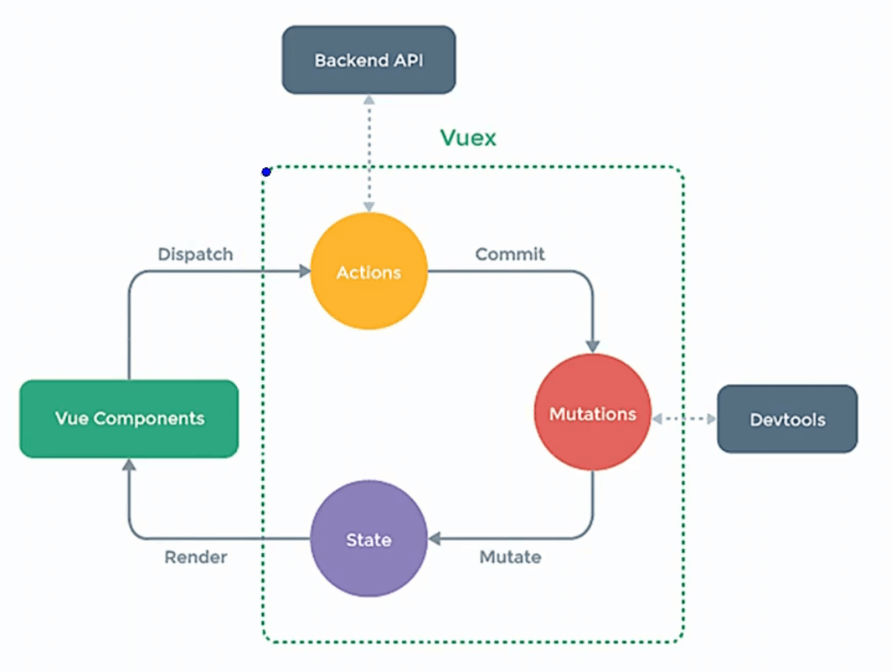

### 解析管理图


1. actions、mutation、state都是对象 {}
2. 最图中虽然没有store，但它确实最核心的，他是管理这几个东西的管理者
3. dispatch与actions对话，commit与mutations对话

### Vuex使用前配置

注意！！！：在vue2中只能用vuex3，vue3中只能用vuex4

1. 安装：npm i vuex

2. 使用：import vuex from 'vuex'	Vue.use(vuex)【在我们use(vuex)后，我们在创建vm的时候就可以传入store了，这样所有的组件和实例对象都可以看到store了，即$store】

3. 在vm上加上store【注意看第三部分】

   1. 先创建store，建议：在src文件夹下创建一个store文件夹 — index.js

      ```javascript
      //1.引入vuex
      import vuex from "vuex"
      
      //2.准备
      //准备actions —— 用于响应组件中的动作
       const actions = {}
      
       //准备mutations —— 用于操作数据（state）
       const mutations = {}
      
       //准备state —— 用于存储数据
       const state = {}
      
       
       //3.创建store
       const store = new vuex.Store({
          actions,
          mutations,
          state
       })
      
       //4.暴露store
       export default store
      
      //上面那一步类似于main.js中：
      // new Vue({
      //     render: h => h(App),
      // }).$mount('#app')
      ```
      
      
      
   2. main.js中引入我们写的store
   
      ```javascript
      import Vue from 'vue'
      import App from './App.vue'
      Vue.config.productionTip = false
      
      import vuex from 'vuex'
      Vue.use(vuex)
      //1.引入store
      import store from './store'
      
      new Vue({
        //2.使用
        store,
        render: h => h(App),
      }).$mount('#app')
      ```
   
      
   
   3. 这个时候我们打开项目，会报一个错误：`[vuex] must call Vue.use(Vuex) before creating a store instance`，这是我们js代码在解析的时候，会先扫描代码，然后先解析所有import，解决办法：我们把use(vuex)放在store中执行，我们改代码
   
      ```javascript
      //store-index.js:
      
      //0.引入vue
      import Vue from 'vue'
      
      //1.引入vuex
      import vuex from "vuex"
      Vue.use(vuex)
      
      //2.准备
       const actions = {}
       const mutations = {}
       const state = {}
       
       //3.创建store
       const store = new vuex.Store({
          actions,
          mutations,
          state
       })
      
       //4.暴露store
       export default store
      
      
      //main.js:
      
      import Vue from 'vue'
      import App from './App.vue'
      Vue.config.productionTip = false
      
      import store from './store'
      
      new Vue({
        store,
        render: h => h(App),
      }).$mount('#app')
      ```
   
      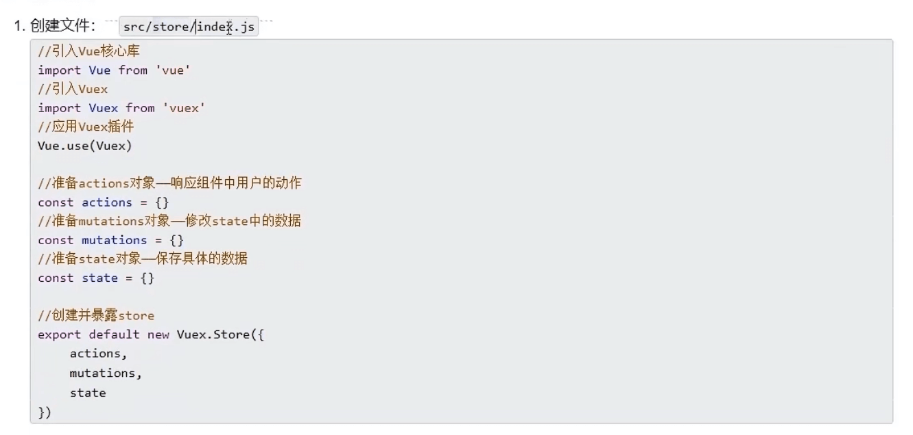
   
      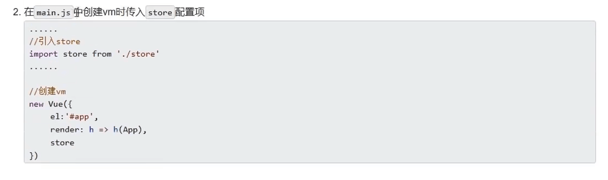
   
   4. 在组件中打印`console.log(this)`，就可以看到$store这个实例对象了。


### Vuex的基础使用

1. 在one.vue中定义，把我的操作给store

   ```javascript
   <template>
     <div>
       <div>sum:???</div>
       <button @click="count">++</button>
     </div>
   </template>
   
   <script>
   export default {
       methods:{
         count(){
             //将 ‘jia’这个操作给store（actions）
           this.$store.dispatch("jia",1)
         }
       }
   }
   </script>
   ```

   

2. 将我们的这个加的操作在actions中定义

   ```javascript
   const actions = {
      jia(){
         console.log("jia被点击了");
      }
    }
   ```

   我们在看这个jia()这个函数的参数

   ```javascript
   const actions = {
       jia(context,value){
           //两个参数：context与value
           //context：算是一个微小的store,最重要的是他身上有commit和dispatch
           //value是传来的值
           console.log("jia被点击了",context,value);
       }
   }
   ```

   之后，commit给mutations，【为什么？看Vuex原理图】

   ```javascript
   const actions = {
       jia(context,value){
           console.log("jia被点击了",context,value);
           //commit给mutations jia 这个操作，加多少，加value这个值
           //一般在开发中到mutations的操作/函数用大写，为了区分与actions的操作
           context.commit("JIA",value);
       }
   }
   ```

   

3. mutations中定义操作，进行操作state的数

   ```javascript
   const mutations = {
       JIA(){
           console.log("jia被点击了");
       }
   }
   ```

   我们还是要看一下参数

   ```javascript
   const mutations = {
       JIA(state,value){
           //state就是state的数据
           //value就是传来的数据
           console.log("jia被点击了",state,value);
       }
   }
   ```

   然后进行操作，对state的数据进行修改

   ```javascript
   const mutations = {
       JIA(state,value){
           state.sum += value;
       }
   }
   ```

   

4. 将仓库里修改的数据得放到页面上呀

   ```javascript
   //我们直接打印这个this.$store可以看到他里面有这些数据，所有我们通过$store可以拿到state里面的数据
   <div>sum:{{$store.state.sum}}</div>
   ```


补充：上面那个是使用dispatch与state对话，下面我们直接使用commit与mutations对话

```js
//one.vue中：
this.$store.commiT("JIA",1);
//store-index.js：
const mutations = {
	JIA(state,value){
		state.sum += value
	}
}
```


### getters配置项

当state中的数据需要进行加工后在使用，可以使用getters进行加工

```javascript
//配置：类似于vue中的computed
const getters = {
    bigSum(state){
		return state.sum * 10
    }
}

 const store = new vuex.Store({
    actions,
    mutations,
    state,
    getters
 })
 
 //使用
 <div>{{$store.getters.bigSum}}</div>
```


### mapState和mapGetters

1. 为了精简我们在template中代码，我们使用mapState和mapGetters来代替`$store.state`和`$store.getters`

   ```javascript
   <div>sum:{{$store.state.sum}}</div>
   <div>{{$store.getters.bigSum}}</div>
   ```

   

2. 使用步骤

   ```javascript
   1.引入：import {mapState} from 'vuex'
   2.使用：mapState【其实就是借助mapState生成计算属性，从state中读取数据】
   
   computed:{
       //mapState其实是个对象，你将一个对象放到另一个对象里当然会报错呀
       //mapState({sumJiaJia:'sum'})【后面的要加引号其实两个都是字符串，但前面那个可以简写】
       //解决办法1：es6的语法（对象写法）：
       ...mapState({
           sumJiaJia:'sum',
       })
       //解决办法2：当state中的名字和你起的名字（sumJiaJia）一样的时候（数组写法）
       ...mapState(['sum'])
   }
   
   //mapGetters同理
   ```

   


### mapActions和mapMutations

注意：mapActions与mapMutations使用时，若需要传递参数需要:在模板中绑定事件时传递好参数，否则参数是事件对象。

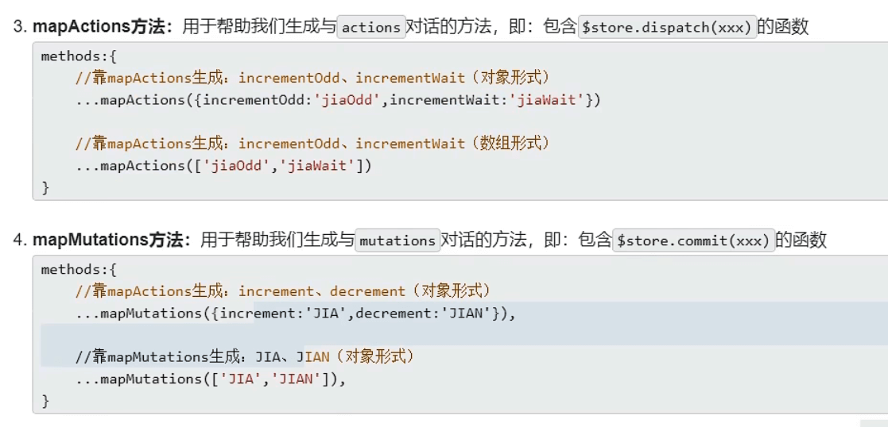


### Vuex模块化

目的：让代码更好的维护，让多种数据分类更加明确

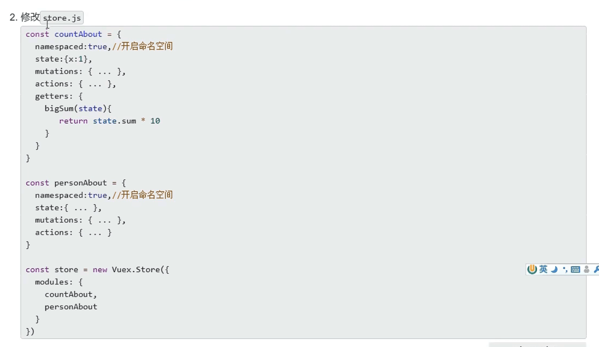


## Vue-Router

### 如何使用

安装使用：【vue-router3只能在vue2中使用，vue-router4只能在vue3中使用】

1. 安装：npm i vue-router@3

2. 引入：import VueRouter from 'vue-router'

3. 使用：vue.user(VueRouter)

4. 配置：【文件夹router-index.js】

   ```javascript
   //引入vue-router
   import VueRouter from 'vue-router'
   import Vue from 'vue'
   Vue.use(VueRouter)
   //引入组件
   import One from "../components/One"
   
   //创建并保留一个路由
   export default new VueRouter({
       routes:[
           {
               path:'/one',
               component:One
           },
           {}
       ]
   })
   
   
   //简写：在路由配置里引入组件
   export default new VueRouter({
       routes:[
           {
               path:'/one',
               component:()=> import("../components/One")
           },
           {}
       ]
   })
   ```

   

5. main.js的配置

   ```javascript
   //引入并使用
   import router from './router'
   
   new Vue({
     store,
     render: h => h(App),
     router:router
   }).$mount('#app')
   ```

   

6. html页面的配置

   ```java
   vue-router提供的跳转标签：
   <vue-router></vue-router>它来实现页面的跳转
   其中有几个属性：
       1.to：向哪个页面跳转，加路由【<vue-router to="/one"></vue-router>】
       2.active-class：加高亮的属性
       3.replace:浏览器不能后退
       
   vue-router提供的跳转标签：
   <router-view></router-view>它来实现页面的展示
   ```


注意：

1. 路由组件通常存放在pages文件夹，一般组件通常存放在[components文件夹。
2. 通过切换，“隐藏”了的路由组件，默认是被销毁掉的，需要的时候再去挂载
3. .每个组件都有自己的`$route`属性，里面存储着自己的路由信息。
4. 整个应用只有一个`router`，可以通过组件的`$router`属性获取到。


### 重定向

```vue
routes:[
    {
        path:'/',
        redirect:"/one"
    },
    {
        path:'/one',
        component:One,
    },
]
```


### 嵌套路由

又称多级路由

```javascript
//配置：
export default new VueRouter({
    routes:[//一级路由
        {
            path:'/one',
            component:One,
            children:[
                {
                    path:'two',//其子路由不需要加 ‘/’
                    component:''
                },
                {}
            ]
        },
        {}
    ]
})

//template中：
<vue-router to="/one/two"></vue-router>
```


### 路由传参

#### query参数

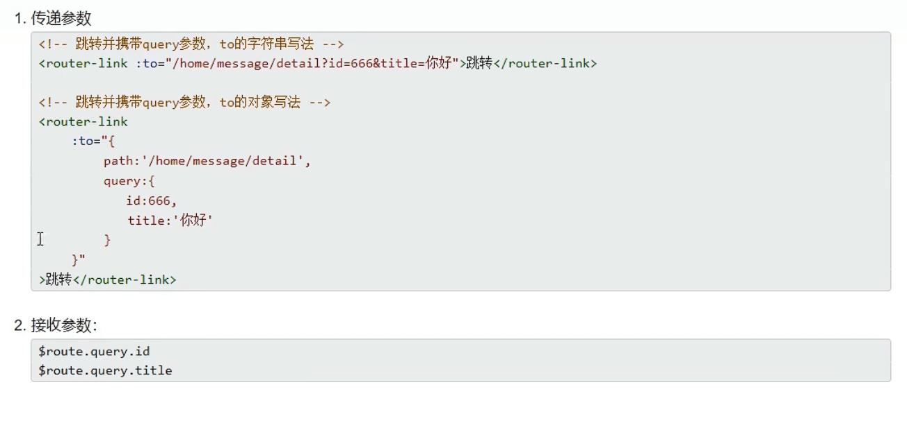

#### params参数


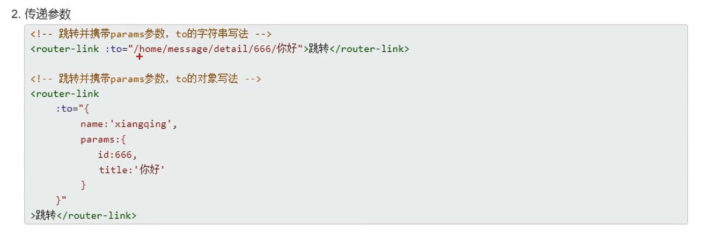

特别注意：路由携带params参数时，若使用to的对象写法，则不能使用path配置项，必须使用name配置

#### 拓展name

```javascript
//在router-index.js中加上name
export default new VueRouter({
    routes:[
        {
            name:'one',
            path:'/one',
            component:One
        },
        {}
    ]
})

//在路径上就可以使用了【当然要加:了】【当然仅path的时候没必要这样写，在写到params参数的时候就必须要name了，query不是必须的】
<vue-router :to="`{path:'/one/two'}`"></vue-router>
```

#### 路由的props

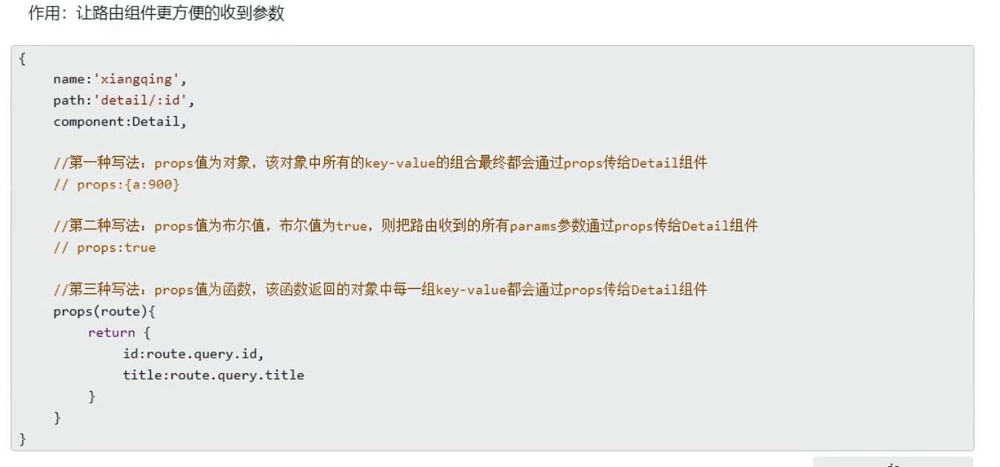


### 编程式导航

最重要的当时是配置在Vue上的实例对象`$router`【注意不是`$route`】【可以这样理解，router是路由器，而route仅仅是路由，只有路由器才有权限控制浏览器的上下流动】

几个重要的配置属性：`this.$router`

1. push('')//带记录的跳转
2. replace('')//销毁式跳转
3. back()//后退一步
4. forward()//前进一步
5. go()//里面放到是数字，正数代表前进，负数代表后退

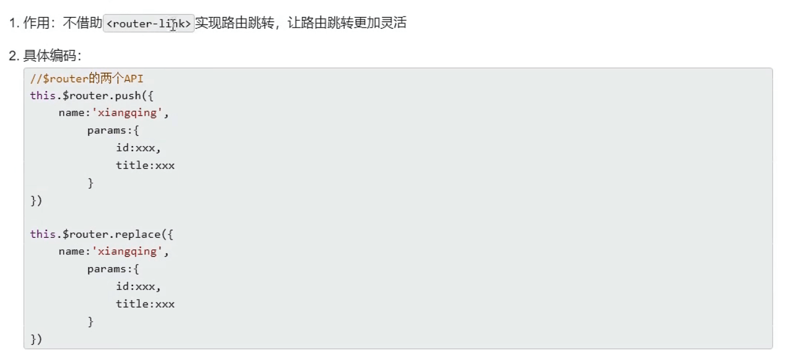

### 缓存路由组件

作用：让不展示的路由组件保持挂载，不被销毁。

```javascript
//使用keep-alive标签包裹住即可，其中include是指你想让哪个组件生效，要是不写就全部生效，里面写的是那个组件<script>配置的name名字，多个可用数组来写，【:include="['news','message']"】
<keep-alive include="News">
	<router-view></router-view>    
</keep-alive>
```

### 路由独有的生命周期钩子

作用:路由组件所独有的两个钩子，用于捕获路由组件的激活状态。

具体名字：

1. activated：路由组件被激活时触发
2. deactivated：路由组件失活时触发。

使用场景：比如开一个定时器的操作，当我给这个组件的展示区加上`<keep-alive>`那我在跳转的时候这个组件就不会被销毁，一直在加载定时器，很浪费资源这个时候我们就可以把开启定时器的操作放在activated中，关闭定时器的操作放在deactivated


### 路由守卫

就是保护路由的跳转的，就是一个权限的问题，有的页面可以随便跳转，有的页面跳转却需要权限

那我们在哪给这个添加路由守卫呢？

答案是在路由创建之后，暴露之前添加，所有在router-index.js中我们就不能直接暴露了

解决办法：使用全局路由守卫【分为前置和后置】

```javascript
//别这个暴露了，这么暴露是你创建完就暴露了，你接触不到vuerouter
export default new VueRouter({})

//选择这个暴露：
const router = new VueRouter({})

//在这添加操作：
router.

export default router
```

#### 前置路由守卫

借助自带的方法  **beforeEach**()：可以理解为，在跳转之前

```javascript
//全局前置路由【初始化的时候被调用、路由每次切换的时候所调的函数】
router.beforeEach(()=>{})

//三个参数【to:去哪，from:从哪去，next:借着往下走，俗称放行，不加next()函数就不能跳转了】
router.beforeEach((to,from,next)=>{
    console.log(to,from)
    next()【可以在next()外加一些限制来限制其跳转】
})
```

#### 后置路由守卫

**afterEach()**

```javascript
//后置路由【初始化的时候被调用、路由每次切换的时候所调的函数】
router.afterEach(()=>{})

//两个参数【to:去哪，from:从哪去】
//用的少，不过也有，比如在浏览器的那个标题的修改【document.title】
router.beforeEach((to,from)=>{
    console.log(to,from)
})
```

#### 补充meta

我们前面在配置路由的时候有：name，path，component，children，都是route给我们配置好的，但如果我们想自己加一些东西呢？

可以加在meta中，获取就通过 `什么.meta.名字`

```javascript
routers:[
    {
        name:'',
        path:'',
        components:'',
        children:[
            {},
            {}
        ],
        meta:{
            isAuth:true,【这可以去上面的前置导航后卫配合，获取：to.meta.isAuth来限制是否跳转】
            title:"name",【后置导航守卫中：document.title = to.meta.title】
        }
    }
]
```


#### 独享路由守卫

就是某一个路由所单独响应的守卫【beforeEnter】，他与什么name，path，component，children是同级的，在进入之前帮我们调一下

```javascript
routers:[
    {
        name:'',
        path:'',
        components:'',
        children:[
            {},
            {}
        ],
        meta:{},
        beforeEnter((to,from,next)=>{//【与前置守卫相同】
        	
    	})
    }
]
```


#### 组件内路由守卫

他与全局路由守卫和独享路由守卫不同，他不写在router-index.js中，他写在组件中

beforeRouteEnter【通过路由规则，进入该组件的时候被调用】和beforeRouteLeave【通过路由规则，离开该组件的时候被调用】

注意是必须通过路由规则进入才会调用这两个方法

```javascript
//他与mouted、method同级
beforeRouteEnter(to,from,next){}//【同样与前置路由的语法相同】
beforeRouteLeave(to,from,next){}//【注意这个离开也有next()放行】
```


#### 总结

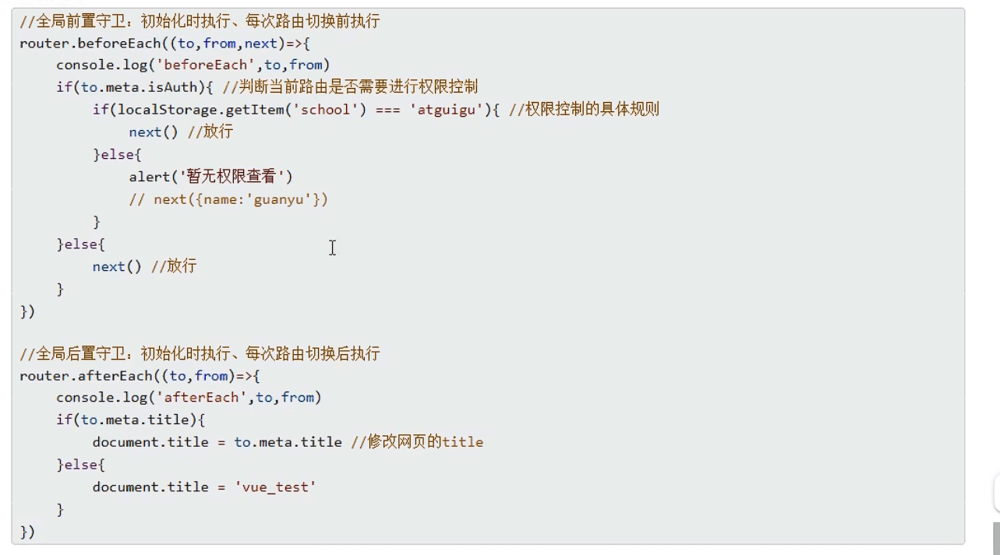


### history模式和hash模式

修改模式：router-index.js中，一般我们都使用history，但他会出现404的问题，需要后端配合

```javascript
//注意，他与routers同级
new VueRouter({
    mode:'',【只有两个值，hash和history】
    routers:[
        {}
    ]
})
```

1. 对于一个url来说，什么是hash值?——#及其后面的内容就是hash值。
2. hash值不会包含在HTTP请求中，即: hash值不会带给服务器。

3. hash模式:
1. 地址中永远带着#号，不美观。
2. 若以后将地址通过第三方手机app分享，若app校验严格，则地址会被标记为不合法。
3. 兼容性较好。
4. history模式:
   1. 地址干净，美观。
   2. 兼容性和hash模式相比略差。
   3. 应用部署上线时需要后端人员支持，解决刷新页面服务端404的问题。

