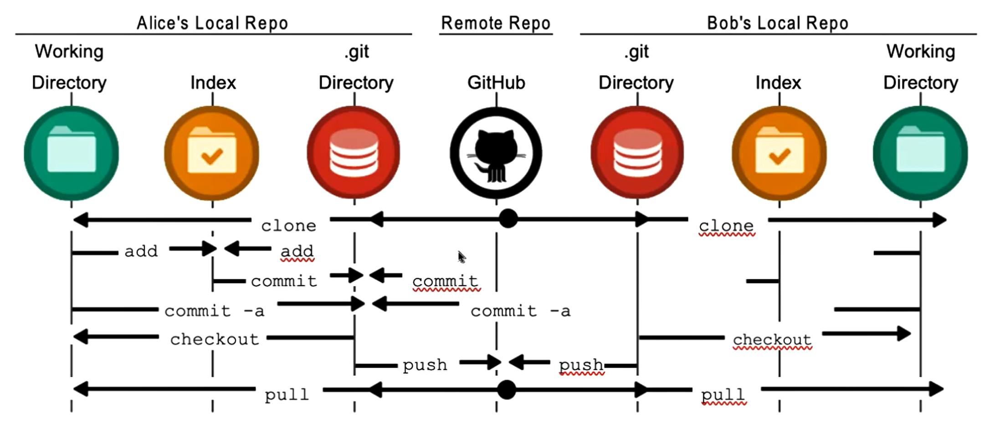

## Git的使用

### 安装

先下载安装git


### 设置用户名和邮箱

安装后，第一件事是设置你的用户名和邮箱地址

- 这一点很重要，因为每一个Git提交都会使用这些信息，它们会写入到你的每一次提交中，不可更改
- 如果使用了--global选项，那么该命令只需要运行一次，因为之后无论你在该系统上做任何事情，Git都会使用那些信息

- ```js
  git config --global user.name "Name"
  
  git config --global user.email "email"
  ```

- 检测当前git的配置信息：`git config --list`


### 初始化本地仓库

- 初始化git仓库 - `git init`

- 将文件添加到git仓库中：`git add .`（. 是将当前文件夹所有的文件都加入到暂存区中）
- 提交：`git commit -m "描述信息"`
  - 可以通过`git log`查看提交的信息


### 已有仓库

- 获取已有的git仓库 - `git clone 地址`


### 文件状态划分

- 现在我们的电脑上已经有一个Git仓库:
  - 在实际开发中，你需要将某些文件交由这个Git仓库来管理
  - 并且我们之后会修改文件的内容，当达成某一个目标时，想要记录下来这次操作，就会将它提交到仓库中
- 那么我们需要对文件来划分不同的状态，以确定这个文件是否已经归于Git仓库的管理:
  - 未跟踪:默认情况下，Git仓库下的文件也没有添加到Git仓库管理中，我们需要通过add命令来操作
  - 已跟踪:添加到Git仓库管理的文件处于已跟踪状态，Git可以对其进行各种跟踪管理
- 已跟踪的文件又可以进行细分状态划分:
  - staged：暂缓区中的文件状态
  - Unmodified：commit命令，可以将staged中文件提交到Git仓库
  - Modified：修改了某个文件后，会处于Modified状态

- 查看文件的状态：`git status`


### Git操作流程图




### Git忽略文件

`.gitignore`


### 远程仓库的连接

目前Git服务器验证手段主要有两种

- 方式一：基于HTTP的凭证存储(credential Storage) 
- 方式二：基于SSH的密钥


#### HTTP凭证存储

需要输入账号密码


#### SSH的密钥

需要生成公钥私钥

- 创建ssh：`ssh-keygen -t rsa -C 'youremail@qq.com'`（在git中使用）
- 在密钥地址中找到.ssh文件夹，pub文件用记事本打开，复制ssh密钥到github的SSH那儿，然后完成创建


### 常见命令

- `git init`：初始化本次仓库
- `git add .`：提交到本地暂缓区
- `git commit -m "描述信息"`：添加提交信息
- `git log`：查看日志
  - 让日志简洁：`git log --pretty=oneline`
  - 多个分支的时候信息更加明确：`git log --pretty=oneline --graph`
- `git reflog`：查看所有的版本日志信息，包括我们版本回退后，前面的版本
- `git clone 地址`：克隆远程仓库
- `git status`：查看文件的状态
- `git reset`：版本回退/切换
  - 回退上个版本：`git reset --hard HEAD^`
  - 回退上上个版本：`git reset --hard HEAD^^`
  - 如果是上1000个版本，我们可以使用`HEAD~1000`
  - 我们可以可以指定某一个commit id（git log查看id）：`git reset --hard 884ef0f45`
- `git remote`：查看远程仓库名称

- 提交代码
  - `git push`
  - `git push origin main`
- `git pull`：从远程操作拿代码
  - `git pull` = `git fetch` + `git merge`
- 与远程仓库建立连接：`git remote add origin(名字) xxx.git`
- `git branch dev`：创建新的分支命名为dev
- `git checkout dev`：切换到dev分支
- `git branch -d dev`：删除dev分支
- `git merge dev`：将dev合并到主分支上
- `git pull`：用户从远程获取代码合并到本地


接下来的：`E:\coderwhy\05-前端工程化基础\06-Github_tag管理-git原理-分支管理`


## Git提交代码

在git提交代码到github一些众所周知的问题，我们可以没有办法顺利提交，但是如果我们有tizi的话，可以这样设置git全局代理

这里提供几种方式，自己可以都试试，我使用了sock是可以的

代理主要是本地地址+端口号，本地地址都一样`127.0.0.1`，端口号看每个人电脑自己的那个软件


```js
git config --global http.proxy http://127.0.0.1:7890
git config --global https.proxy https://1:27.0.0.1:7890
```

**sock**

```js
git config --global http.proxy socks5://127.0.0.1:7890
git config --global https.proxy socks5://127.0.0.1:7890
```

或者可以设置仅github代理

```js
git config --global http.https://github.com.proxy socks5://127.0.0.1:7890
git config --global https.https://github.com.proxy socks5://127.0.0.1:7890

// 取消代理
git config --global --unset http.https://github.com.proxy
```


当我们在其他的项目中，遇到了问题，可以取消代理（包括http和https）

- 查看代理：`git config --global http.proxy`
- 取消代理：`git config --global --unset http.proxy`
- 查看本地代理详细信息：`git config --global -f`


## 自动化部署脚本

```shell
#!/bin/bash

# 提示用户输入提交信息，如果未输入，则使用默认值
read -p "请输入提交信息 (默认: 新增文章): " commit_message

# 如果用户未输入，使用默认值
if [ -z "$commit_message" ]; then
  commit_message="新增文章"
fi

# 执行git add
git add .

# 执行git commit，使用用户输入的提交信息或默认值
git commit -m "$commit_message"

# 执行git push
git push
```


