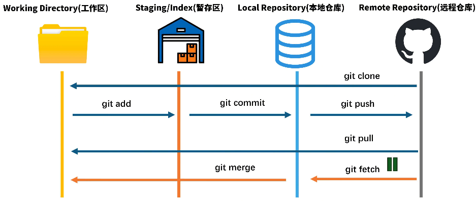

## git 简介

### Git 分区概念




### old

git的通用操作流程：


主要涉及到几个关键点：

1. 版本库`.git`：当我们使用git管理文件时，比如`git init`时，这个时候，会多一个`.git`文件，我们把这个文件称之为版本库。`.git文件`另外一个作用就是它在创建的时候，会自动创建master分支，并且将HEAD指针指向master分支。
2. 工作区（Workspace）：本地电脑存放项目文件的地方
3. 暂存区（Index/Stage）：
   - 在使用git管理项目文件的时候，其本地的项目文件会多出一个.git的文件夹，将这个.git文件夹称之为版本库。
   - 其中.git文件夹中包含了两个部分，一个是暂存区（Index或者Stage）,顾名思义就是暂时存放文件的地方，通常使用add命令将工作区的文件添加到暂存区里
4. 本地仓库（Workspace）：.git文件夹里还包括git**自动创建的master分支**，并且将HEAD指针指向master分支。使用commit命令可以将暂存区中的文件添加到本地仓库中
5. 远程仓库（Workspace）：不是在本地仓库中，项目代码在远程git服务器上，比如项目放在github上，就是一个远程仓库，通常使用clone命令将远程仓库拷贝到本地仓库中，开发后推送到远程仓库中即可


更细节的来看：


日常开发时代码实际上放置在工作区中，也就是本地的XXX.jsx这些文件，通过add等这些命令将代码文教提交给暂存区（Index/Stage），也就意味着代码全权交给了git进行管理，之后通过commit等命令将暂存区提交到分支上，也就是意味打了一个版本，也可以说代码提交到了本地仓库中。另外，团队协作过程中自然而然还涉及到与远程仓库的交互。

因此，经过这样的分析，git命令可以分为这样的逻辑进行理解和记忆：

1. git管理配置的命令
2. **几个核心存储区的交互命令：**
   1. 工作区与暂存区的交互
   2. 暂存区与本地仓库（分支）上的交互
   3. 本地仓库与远程仓库的交互


## git配置命令

### 查询配置信息

1. 列出当前配置：`git config --list`
2. 列出repository配置：`git config --local --list`
3. 列出全局配置：`git config --global --list`
4. 列出系统配置：`git config --system --list`


### 第一次使用git，配置用户信息

1. 配置用户名：`git config --global user.name "your name"`
2. 配置用户邮箱：`git config --global user.email "youremail"`


### 其他配置

1. 配置解决冲突时使用哪种差异分析工具，比如要使用vimdiff：`git config --global merge.tool vimdiff`
2. 配置git命令输出为彩色的：`git config --global color.ui auto`
3. 配置git使用的文本编辑器：`git config --global core.editor vi`


## 工作区上的操作命令

### 新建仓库

1. 将工作区中的项目文件使用git进行管理，即创建一个新的本地仓库：`git init`
2. 从远程git仓库复制项目：`git clone <url>`，如：`git clone git://github.com/wasd/example.git`
3. 克隆项目时如果想定义新的项目名，可以在clone命令后指定新的项目名：`git clone git://github.com/wasd/example.git mygit`


### 提交

1. 提交工作区所有文件到暂存区：`git add .`
2. 提交工作区中指定文件到暂存区：`git add <file1> <file2> ...`
3. 提交工作区中某个文件夹中所有文件到暂存区：`git add [dir]`


### 撤销

> 1. 撤销上一次对文件的操作：`git checkout --<file>`。要确定上一次对文件的修改不再需要，如果想保留上一次的修改以备以后继续工作，可以使用stashing和分支来处理

1. 删除工作区文件，并且也从暂存区删除对应文件的记录：`git rm <file1> <file2>`
2. 从暂存区中删除文件，但是工作区依然还有该文件:`git rm --cached <file>`
3. 取消暂存区已经暂存的文件：`git reset HEAD <file>...`
4. 临时将工作区文件的修改保存至堆栈中，隐藏当前变更：`git stash`
5. 查看当前所有的储藏：`git stash list`
6. 应用最新的储藏：`git stash apply`，如果想应用更早的储藏：`git stash apply stash@{2}`；重新应用被暂存的变更，需要加上`--index`参数：`git stash apply --index`
7. 使用apply命令只是应用储藏，而内容仍然还在栈上，需要移除指定的储藏：`git stash drop stash{0}`；如果使用pop命令不仅可以重新应用储藏，还可以立刻从堆栈中清除：`git stash pop`
8. 在某些情况下，你可能想应用储藏的修改，在进行了一些其他的修改后，又要取消之前所应用储藏的修改。Git没有提供类似于 stash unapply 的命令，但是可以通过取消该储藏的补丁达到同样的效果：`git stash show -p stash@{0} | git apply -R`；同样的，如果你沒有指定具体的某个储藏，Git 会选择最近的储藏：`git stash show -p | git apply -R`


### 更新文件

1. 重命名文件，并将已改名文件提交到暂存区：`git mv [file-original] [file-renamed]`


### 查新信息

1. 查询当前工作区所有文件的状态：`git status`
2. 比较工作区中当前文件和暂存区之间的差异，也就是修改之后还没有暂存的内容：`git diff`
3. 指定文件在工作区和暂存区上差异比较：`git diff <file-name>`


## 暂存区上的操作命令

### 提交文件到版本库

1. 将暂存区中的文件提交到本地仓库中，即打上新版本：`git commit -m "commit_info"`
2. 将所有已经使用git管理过的文件暂存后一并提交，跳过add到暂存区的过程：`git commit -a -m "commit_info"`
3. 提交文件时，发现漏掉几个文件，或者注释写错了，可以撤销上一次提交：`git commit --amend`


### 查看信息

1. 比较暂存区与上一版本的差异：`git diff --cached`
2. 指定文件在暂存区和本地仓库的不同：`git diff <file-name> --cached`
3. 查看提交历史：`git log`，参数`-p`展开每次提交的内容差异，用`-2`显示最近的两次更新，如`git log -p -2`


### 打标签

Git 使用的标签有两种类型：**轻量级的（lightweight）和含附注的（annotated）**。轻量级标签就像是个不会变化的分支，实际上它就是个指向特定提交对象的引用。而含附注标签，实际上是存储在仓库中的一个独立对象，它有自身的校验和信息，包含着标签的名字，电子邮件地址和日期，以及标签说明，标签本身也允许使用 GNU Privacy Guard (GPG) 来签署或验证。一般我们都建议使用含附注型的标签，以便保留相关信息；当然，如果只是临时性加注标签，或者不需要旁注额外信息，用轻量级标签也没问题。

1. 列出现在所有的标签：`git tag`
2. 使用特定的搜索模式列出符合条件的标签，例如只对1.4.2系列的版本感兴趣：`git tag -l "v1.4.2.*"`
3. 创建一个含附注类型的标签，需要加`-a`参数，如`git tag -a v1.4 -m "my version 1.4"`
4. 使用git show命令查看相应标签的版本信息，并连同显示打标签时的提交对象：`git show v1.4`
5. 如果有自己的私钥，可以使用GPG来签署标签，只需要在命令中使用`-s`参数：`git tag -s v1.5 -m "my signed 1.5 tag"`
6. 验证已签署的标签：git tag -v ，如`git tag -v v1.5`
7. 创建一个轻量级标签的话，就直接使用git tag命令即可，连`-a`,`-s`以及`-m`选项都不需要，直接给出标签名字即可，如`git tag v1.5`
8. 将标签推送到远程仓库中：git push origin ，如`git push origin v1.5`
9. 将本地所有的标签全部推送到远程仓库中：`git push origin --tags`


### 分支管理

> 1. 将一个分支里提交的改变移到基底分支上重放一遍：`git rebase <rebase-branch> <branch-name>`，如`git rebase master server`，将特性分支server提交的改变在基底分支master上重演一遍；使用rebase操作最大的好处是像在单个分支上操作的，提交的修改历史也是一根线；如果想把基于一个特性分支上的另一个特性分支变基到其他分支上，可以使用`--onto`操作：`git rebase --onto <rebase-branch> <feature branch> <sub-feature-branch>`，如`git rebase --onto master server client`；使用rebase操作应该遵循的原则是：**一旦分支中的提交对象发布到公共仓库，就千万不要对该分支进行rebase操作**

1. 创建分支：`git branch <branch-name>`，如`git branch testing`
2. 从当前所处的分支切换到其他分支：`git checkout <branch-name>`，如`git checkout testing`
3. 新建并切换到新建分支上：`git checkout -b <branch-name>`
4. 删除分支：`git branch -d <branch-name>`
5. 将当前分支与指定分支进行合并：`git merge <branch-name>`
6. 显示本地仓库的所有分支：`git branch`
7. 查看各个分支最后一个提交对象的信息：`git branch -v`
8. 查看哪些分支已经合并到当前分支：`git branch --merged`
9. 查看当前哪些分支还没有合并到当前分支：`git branch --no-merged`
10. 把远程分支合并到当前分支：`git merge <remote-name>/<branch-name>`，如`git merge origin/serverfix`
    - 如果是单线的历史分支不存在任何需要解决的分歧，只是简单的将HEAD指针前移，所以这种合并过程可以称为快进（Fast forward），而如果是历史分支是分叉的，会以当前分叉的两个分支作为两个祖先，创建新的提交对象；如果在合并分支时，遇到合并冲突需要人工解决后，再才能提交
11. 在远程分支的基础上创建新的本地分支`：git checkout -b <branch-name> <remote-name>/<branch-name>`，如`git checkout -b serverfix origin/serverfix`
12. 从远程分支checkout出来的本地分支，称之为跟踪分支
    - 在跟踪分支上向远程分支上推送内容：`git push`，该命令会自动判断应该向远程仓库中的哪个分支推送数据
    - 在跟踪分支上合并远程分支：`git pull`


:::info 补充：`rebase`/`merge`/`squash merge` 区别

| 操作     | rebase                     | merge                               | squash merge           |
| -------- | -------------------------- | ----------------------------------- | ---------------------- |
| 特点     | 只有线性提交记录           | 会出现所有的提交记录，包括merge记录 | 只出现一条merge记录，  |
| 优点     | 减少一次merge记录          | 保证分支可溯源                      | 历史记录更加清爽干净   |
| 缺点     | 必须使用强推               | 多一次merge记录                     | 历史记录被合并到了一起 |
| 应用场景 | 在私有分支上可以使用rebase | 多人协作推荐使用merge               | 当需要保持记录清爽时   |

:::


## 本地仓库上的操作

1. 查看本地仓库关联的远程仓库：`git remote`；在克隆完每个远程仓库后，远程仓库默认为`origin`;加上`-v`的参数后，会显示远程仓库的`url`地址
2. 添加远程仓库，一般会取一个简短的别名：`git remote add [remote-name] [url]`，比如：`git remote add example git://github.com/example/example.git`
3. 从远程仓库中抓取本地仓库中没有的更新：`git fetch [remote-name]`，如`git fetch origin`;使用fetch只是将远端数据拉到本地仓库，并不自动合并到当前工作分支，只能人工合并。如果设置了某个分支关联到远程仓库的某个分支的话，可以使用`git pull`来拉去远程分支的数据，然后将远端分支自动合并到本地仓库中的当前分支
4. 将本地仓库某分支推送到远程仓库上：`git push [remote-name] [branch-name]`，如`git push origin master`
5. 如果想将本地分支推送到远程仓库的不同名分支：`git push <remote-name> <local-branch>:<remote-branch>`，如`git push origin serverfix:awesomebranch`
6. 如果想删除远程分支：`git push [romote-name] :<remote-branch>`，如`git push origin :serverfix`。这里省略了本地分支，也就相当于将空白内容推送给远程分支，就等于删掉了远程分支
7. 查看远程仓库的详细信息：`git remote show origin`
8. 修改某个远程仓库在本地的简称：`git remote rename [old-name] [new-name]`，如`git remote rename origin org`
9. 移除远程仓库：`git remote rm [remote-name]`


:::info `git pull` 与 `git pull --rebase`

前提：我们拉下来的代码将会进行merge合并

使用git pull 会将本地代码与远端代码进行merge并且创建了一个额外的merge记录，但其实这个merge信息并不像我们主动去merge的时候所需要的merge信息那么有用。所以大部分情况下我们仅仅要做的是把自己的提交挂到同事的提交之后，保持历史数据的线性干净，这个时候我们就可以使用`git pull --rebase` 命令

 `git pull --rebase`，会将你的提交暂时放到一边，然后拉去远端仓库的提交，再把你的提交挂到后面去

`git pull = git fetch + git merge`

`git pull --rebase = git fetch + git rebase`

:::


## 忽略文件.gitignore

一般我们总会有些文件无需纳入 Git 的管理，也不希望它们总出现在未跟踪文件列表。通常都是些自动生成的文件，比如日志文件，或者编译过程中创建的临时文件等。我们可以创建一个名为 .gitignore 的文件，列出要忽略的文件模式。如：

```
# 此为注释 – 将被 Git 忽略
# 忽略所有 .a 结尾的文件
*.a
# 但 lib.a 除外
!lib.a
# 仅仅忽略项目根目录下的 TODO 文件，不包括 subdir/TODO
/TODO
# 忽略 build/ 目录下的所有文件
build/
# 会忽略 doc/notes.txt 但不包括 doc/server/arch.txt
doc/*.txt
# 忽略 doc/ 目录下所有扩展名为 txt 的文件
doc/**/*.txt
```

如果 .env 文件早就已经被提交（比如第一次开发就 commit 进去了），即使后面你加了 .env 到 .gitignore，它也还是会被继续追踪。
解决方法：
```
# 从 Git 的“追踪列表”里移除 .env，但保留文件本地不删
git rm --cached .env

# 确保 .env 在 .gitignore 中。
echo ".env" >> .gitignore

# 重新 commit 一下，之后就不会再被追踪了。
git add .gitignore
git commit -m "remove tracked .env and ignore it"
```


## 常用命令!

- `git add .`
- `git comit -m "描述信息"`
- `git push`：提交
- `git push -f`：强制推送
- `git pull`：拉取代码，`git pull = git fetch + git merge`
- `git pull --rebase`：
- `git clone ...`：克隆
- `git init`：初始化
- `git reset --soft HEAD^`: 撤回当前commit提交
- `git rebase ...`：变基
- `git merge ...`：合并
- `git stash`：存入缓存区
- `git stash pop`：从缓存区取出
- `git status`：查看文件的状态
- `git log`：查看日志
- `git reset`：版本回退/切换
  - 回退上个版本：`git reset --hard HEAD^`
  - 回退上上个版本：`git reset --hard HEAD^^`
  - 如果是上1000个版本，我们可以使用`HEAD~1000`
  - 我们可以可以指定某一个commit id（git log查看id）：`git reset --hard 884ef0f45`

- `git branch dev`：创建新的分支命名为dev
- `git checkout dev`：切换到dev分支
- `git branch -d dev`：删除本地dev分支
- `git push origin --delete dev`：删除远程dev分支


## 参考文章

[git基本操作，一篇文章就够了！ - 掘金 (juejin.cn)](https://juejin.cn/post/6844903598522908686)
