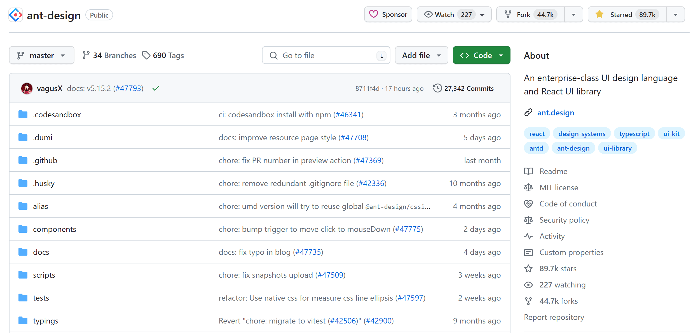
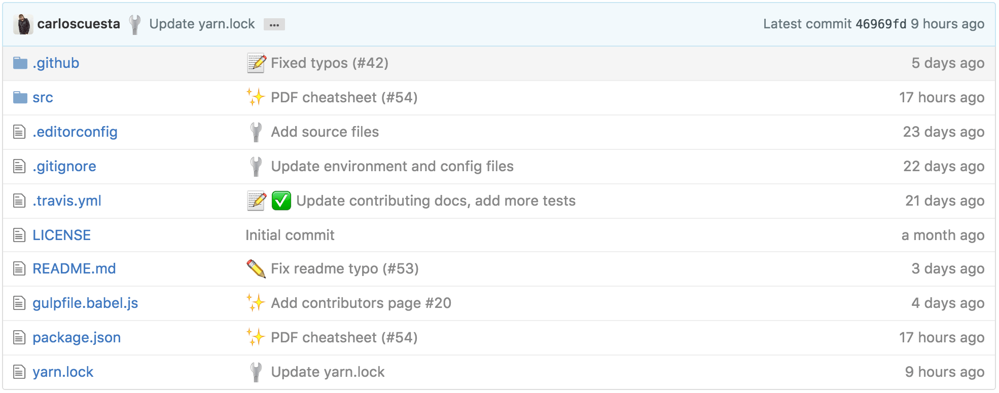

## 前提

执行 `git commit` 时使用引号里的东西为本次提交打上一个 "标签", 使得此次 commit 的主要工作得以凸现，也能够使得其在整个提交历史中易于区分与查找。

基本上有两种模式，emoji模式和 type模式

在我实习的公司使用的是type模式，在逛github上，月看到了emoji模式，都纪录下来


## type模式




### commit 格式

初次提交示例：

```
git commit -m "feat: first commit"
```


### type 指南

| 类型      | 说明                                                         | 举例         |
| :-------- | :----------------------------------------------------------- | ------------ |
| **build** | **编译相关修改，例如发布新版本、补丁包、对项目的依赖或者依赖的改动，** | 发布包的新版 |
| **chore** | **其他修改，例如构建流程，或增加依赖库、更新依赖，开发工具引入，解决冲突等** | 修改依赖     |
| **docs**  | **文档相关修改，注释**                                       | 文档         |
| **feat**  | **新功能、新特性，有需求单号请带上**                         | 新功能       |
| **fix**   | **修复BUG，描述中带上单号（如果有）**                    | bug          |
| perf      | 性能优化                                                     |              |
| refactor  | 代码重构                                                     |              |
| revert    | 回退                                                         |              |
| style     | 代码格式调整                                                 | 样式         |
| test      | 测试用例修改                                                 |              |


## emoji模式

如图




### commit 格式

`git commit` 时，提交信息遵循以下格式：

```
:emoji1: :emoji2: 不超过 50 个字的摘要，首字母大写，使用祈使语气，句末不要加句号

提交信息主体

引用相关 issue 或 PR 编号 <#110>
```

初次提交示例：

```
git commit -m ":tada: Initialize Repo"
```


### emoji 指南

| emoji             | emoji 代码                    | commit 说明           |
| :---------------- | :---------------------------- | :-------------------- |
| 🎉 (庆祝)          | `:tada:`                      | 初次提交              |
| 🆕 (全新)          | `:new:`                       | 引入新功能            |
| 🔖 (书签)          | `:bookmark:`                  | 发行/版本标签         |
| 🐛 (bug)           | `:bug:`                       | 修复 bug              |
| 🚑 (急救车)        | `:ambulance:`                 | 重要补丁              |
| 🌐 (地球)          | `:globe_with_meridians:`      | 国际化与本地化        |
| 💄 (口红)          | `:lipstick:`                  | 更新 UI 和样式文件    |
| 🎬 (场记板)        | `:clapper:`                   | 更新演示/示例         |
| 🚨 (警车灯)        | `:rotating_light:`            | 移除 linter 警告      |
| 🔧 (扳手)          | `:wrench:`                    | 修改配置文件          |
| ➕ (加号)          | `:heavy_plus_sign:`           | 增加一个依赖          |
| ➖ (减号)          | `:heavy_minus_sign:`          | 减少一个依赖          |
| ⬆️ (上升箭头)      | `:arrow_up:`                  | 升级依赖              |
| ⬇️ (下降箭头)      | `:arrow_down:`                | 降级依赖              |
| ⚡️ (闪电) 🐎 (赛马) | `:zap:` `:racehorse:`         | 提升性能              |
| 📈 (上升趋势图)    | `:chart_with_upwards_trend:`  | 添加分析或跟踪代码    |
| 🚀 (火箭)          | `:rocket:`                    | 部署功能              |
| ✅ (白色复选框)    | `:white_check_mark:`          | 增加测试              |
| 📝 (备忘录) 📖 (书) | `:memo:` `:book:`             | 撰写文档              |
| 🔨 (锤子)          | `:hammer:`                    | 重大重构              |
| 🎨 (调色板)        | `:art:`                       | 改进代码结构/代码格式 |
| 🔥 (火焰)          | `:fire:`                      | 移除代码或文件        |
| ✏️ (铅笔)          | `:pencil2:`                   | 修复 typo             |
| 🚧 (施工)          | `:construction:`              | 工作进行中            |
| 🗑 (垃圾桶)        | `:wastebasket:`               | 废弃或删除            |
| ♿️ (轮椅)          | `:wheelchair:`                | 可访问性              |
| 👷 (工人)          | `:construction_worker:`       | 添加 CI 构建系统      |
| 💚 (绿心)          | `:green_heart:`               | 修复 CI 构建问题      |
| 🔒 (锁)            | `:lock:`                      | 修复安全问题          |
| 🐳 (鲸鱼)          | `:whale:`                     | Docker 相关工作       |
| 🍎 (苹果)          | `:apple:`                     | 修复 macOS 下的问题   |
| 🐧 (企鹅)          | `:penguin:`                   | 修复 Linux 下的问题   |
| 🏁 (旗帜)          | `:checkered_flag:`            | 修复 Windows 下的问题 |
| 🔀 (交叉箭头)      | `:twisted_rightwards_arrows:` | 分支合并              |


### 如何在命令行中显示 emoji

默认情况下，在命令行中并不会显示出 emoji, 仅显示 emoji 代码。不过可以使用 [emojify](https://github.com/mrowa44/emojify) 使得在命令行也可显示 emoji, 它是一个 shell 脚本，安装与使用都很简单，在 [这里](https://github.com/mrowa44/emojify) 查看如何安装与使用。

