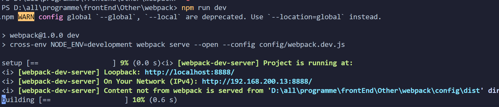

## 复习

**webpack优点**

- 拥有依赖管理、动态打包、代码分离、按需加载、代码压缩、静态资源压缩、缓存等配置
- webpack 扩展性强，插件机制完善，开发者可自定义插件、loader
- webpack 社区庞大，更新速度快，轮子丰富


### 使用

- 安装：`npm install webpack webpack-cli -D`
- 创建文件：`webpack.config.js`文件
- 写入内容
- 运行：`webpack` / `npx webpack`


### entry（入口）

入口是指依赖关系图的开始，从入口开始寻找依赖，打包构建，webpack 允许一个或多个入口配置：

```js
// 一个入口
module.exports = {
	entry: './src/index.js'
}
```

```js
// 多个入口
const path = require('path')
const srcPath = path.join(__dirname, '../src')
modules.export = {
    entry:{
        index:path.join(srcPath, 'index.js'),
        other:path.join(srcPath, 'other.js'),
    }
}
```


### output（出口）

输出用于配置 webpack 构建打包的出口，如打包的位置，打包的文件名

```js
const path = require('path')

modules.export = {
    entry:'./index.js',
    output:{
        path:path.join(__dirname, 'dist'),
        filename:'[name].js'
    }
}
```


### loader（转换）

webpack 自带 JavaScript 和 JSON 文件的打包构建能力，无需格外配置，对于其他类型的文件如css等，则需要安装loader处理；

loader 让 webpack 能够去处理其他类型的文件，并将它们转换为有效模块，以供应用程序使用，以及被添加到依赖图中。

```js
module.exports = {
  module:{
    rules:[
        {
            test: /\.css$/,
            use: ["style-loader", "css-loader"],
        }
    ]
  }
};
```


### plugins（插件）

插件则是用于扩展 webpack 的能力

```js
module.exports = {
  plugins: [new HtmlWebpackPlugin({ template: './src/index.html' })],
};
```


### mode（模式）

webpack5 提供了模式选择，包括开发模式（development）、生产模式（production）、空模式，并对不同模式做了对应的内置优化。可通过配置模式让项目性能更优

```js
module.exports = {
  mode: 'development',
};
```


### resolve（解析）

resolve 用于设置模块如何解析，常用配置如下：

- alias：配置别名，简化模块引入；
- extensions：在引入模块时可不带后缀；
- symlinks：用于配置 npm link 是否生效，禁用可提升编译速度。

```js
module.exports = {
  resolve: {
    extensions: ['.js', '.jsx', '.ts', '.tsx', '.json', '.d.ts'],
    alias: {
      '@': './',
    },
    symlinks: false,
  }
}
```


### optimization（优化）

optimization 用于自定义 webpack 的内置优化配置，一般用于生产模式提升性能，常用配置项如下：

- minimize：是否需要压缩 bundle；
- minimizer：配置压缩工具，如 TerserPlugin、OptimizeCSSAssetsPlugin；
- splitChunks：拆分 bundle；
- runtimeChunk：是否需要将所有生成 chunk 之间共享的运行时文件拆分出来。

```js
module.exports = {
  optimization: {
    minimizer: [
      new CssMinimizerPlugin(),
    ],
    splitChunks: {
      chunks: 'all',
      // 重复打包问题
      cacheGroups:{
        vendors:{ 
          //node_modules里的代码
          test: /[\\/]node_modules[\\/]/,
          chunks: "all",
          //chunks name
          name: 'vendors', 
          //优先级
          priority: 10, 
          enforce: true 
        }
      }
    },
  },
}
```


## 实践基础篇

**实现目标：**

- 分离开发环境、生产环境配置；
- 模块化开发；
- sourceMap 定位警告和错误；
- 动态生成引入 bundle.js 的 HTML5 文件；
- 实时编译；
- 封装编译、打包命令。


### 目录结构

> 需要先安装webpack和webpack-cli

目录结构：

```bash
webpack
├─ config
│  ├─ webpack.common.js
│  ├─ webpack.dev.js
│  └─ webpack.prod.js
├─ node_modules
├─ src
│  └─ index.js
├─ package-lock.json
└─ package.json
```


### 安装插件

```js
// 刚刚已经安装过了
npm install webpack webpack-cli --save-dev

npm i webpack-merge -D
```


### 添加代码

```js
// /config/webpack.common.js

module.exports = {} // 暂不添加配置
```

```js
// /config/webpack.dev.js

const { merge } = require('webpack-merge')
const common = require('./webpack.common')

module.exports = merge(common, {}) // 暂不添加配置
```

```js
// /config/webpack.prod.js

const { merge } = require('webpack-merge')
const common = require('./webpack.common')

module.exports = merge(common, {}) // 暂不添加配置
```


### entry

```js
// /config/webpack.common.js

module.exports = {
    entry: './src/index.js',
}
```


### output

output 属性输出它所创建的 bundle的位置和命名；

生产环境的 output 需要通过 contenthash 值来区分版本和变动，可达到清缓存的效果，而本地环境为了构建效率，则不引人 contenthash。

新增 paths.js，封装路径方法resolveApp：（有的后续有用到）

```js
// /config/paths.js

const fs = require('fs')
const path = require('path')
// process.cwd() 对应控制台所在目录
const appDirectory = fs.realpathSync(process.cwd());
const resolveApp = relativePath => path.resolve(appDirectory, relativePath);

module.exports = {
  resolveApp,
  appPublic: resolveApp('public'),
  appHtml: resolveApp('public/index.html'),
  appSrc: resolveApp('src'),
  appDist: resolveApp('dist'),
  appTsConfig: resolveApp('tsconfig.json'),
}
```


```js
// /config/webpack.dev.js

const { merge } = require('webpack-merge')
const common = require('./webpack.common')

const { resolveApp } = require('./paths')

module.exports = merge(common, {
    output:{
        // bundle 文件名
        filename: '[name].bundle.js',
        // bundle 文件路径
        path: resolveApp('dist'),
        // 编译前清除目录
        clean: true
    }
}) 
```

```js
// /config/webpack.prod.js

const { merge } = require('webpack-merge')
const common = require('./webpack.common')

const { resolveApp } = require('./paths')

module.exports = merge(common, {
    output:{
        // bundle 文件名称 【只有这里和开发环境不一样】
        filename: '[name].[contenthash].bundle.js',
        // bundle 文件路径
        path: resolveApp('dist'),
        // 编译前清除目录
        clean: true
    }
}) 
```


占位符作用 

- [name] - chunk name（例如 [name].js -> app.js）。如果 chunk 没有名称，则会使用其 id 作为名称
- [contenthash] - 输出文件内容的 md4-hash（例如 [contenthash].js -> 4ea6ff1de66c537eb9b2.js）


### mode

添加生产环境和开发环境：

```js
module.exports =  merge(common, {
  // 生产模式
  mode: 'production',
})

module.exports =  merge(common, {
  // 开发模式
  mode: 'development',
})

```


### source-map

使用source-map追踪 error 和 warning，将编译后的代码映射回原始源代码

```js
// /config/webpack.dev.js

module.exports = merge(common, {
    mode: 'development',
    devtool: 'eval-cheap-module-source-map',
}) 
```

更多devtool：[webpack文档](https://www.webpackjs.com/configuration/devtool/#root)


运行一下看看

- 开发：`npx webpack --config config/webpack.dev.js`
- 生成：`npx webpack --config config/webpack.prod.js`


### HtmlWebpackPlugin

引入 HtmlWebpackPlugin 插件，生成一个 HTML5 文件， 其中包括使用 script 标签的 body 中的所有 webpack 包

```js
npm install --save-dev html-webpack-plugin
```

修改webpack.common.js

```js
// /config/webpack.common.js
const HtmlWebpackPlugin = require('html-webpack-plugin');
module.exports = {
    entry: './src/index.js',
    plugins:[
        new HtmlWebpackPlugin({
            title: 'Webpack',
        })
    ]
}
```


### DevServer

- webpack-dev-server 提供了一个基本的 web server，并且具有实时重新加载功能
- webpack-dev-server 默认配置 conpress: true，为每个静态文件开启 gzip压缩

安装：`npm install --save-dev webpack-dev-server`

修改开发环境配置文件webpack.dev.js：

```js
// /config/webpack.dev.js

const { merge } = require('webpack-merge')
const common = require('./webpack.common')

const path = require('path')

const { resolveApp } = require('./paths')

module.exports = merge(common, {
    mode: 'development',
    devtool: 'eval-cheap-module-source-map',
    output:{
        // bundle 文件名
        filename: '[name].bundle.js',
        // bundle 文件路径
        path: resolveApp('dist'),
        // 编译前清除目录
        clean: true
    },
    devServer: {
        // 告诉服务器位置。
        static: {
            directory: path.join(__dirname, 'dist'),
        },
        port: 8888,
        hot: true,
    }
}) 
```


运行启动：`npx webpack serve --open --config config/webpack.dev.js`


### 执行命令

通过 cross-env 配置环境变量，区分开发环境和生产环境

安装：`npm install --save-dev cross-env`


修改 package.json：

```js
{
    "scripts": {
        "dev": "cross-env NODE_ENV=development webpack serve --open --config config/webpack.dev.js",
        "build": "cross-env NODE_ENV=production webpack --config config/webpack.prod.js"
      },
}
```


现在可以运行 webpack 指令：

- npm run dev：本地构建
- npm run build：生产打包


## 实践进阶篇

**实现目标：**

- 加载图片
- 加载字体
- 加载 CSS
- 使用 SASS
- 使用 PostCSS，并自动为 CSS 规则添加前缀，解析最新的 CSS 语法，引入 css-modules 解决全局命名冲突问题
- 使用 React
- 使用 TypeScript


### 加载图片

**webpack4中：**

- [url-loader | webpack](https://v4.webpack.js.org/loaders/url-loader/)

```js
module:{
    rules:[
        {
            // 图片考虑 base64情况
            test: /\.(png|svg|jpg|gif)$/,
            use: {
                loader: 'url-loader',
                options: {
                    // 图片小于8kb，则转换成base64编码
                    limit: 8 * 1024,
                    // 打包后的文件名
                    name: '[name].[ext]',
                    // 图片路径
                    outputPath: 'images/'
                }
            }
        }
    ]
}
```

- [file-loader | webpack](https://v4.webpack.js.org/loaders/file-loader/)

```js
module:{
    rules:[
        {
            // 图片考虑 base64情况
            test: /\.(png|svg|jpg|gif)$/,
            use: 'file-loader'
        }
    ]
}
```


**webpack5之后**，使用[Asset Modules | webpack](https://webpack.js.org/guides/asset-modules/#resource-assets)

```js
// /config/webpack.common.js

const HtmlWebpackPlugin = require('html-webpack-plugin');
const webpack = require('webpack');
const paths = require('./paths');
module.exports = {
    entry: './src/index.js',
    plugins:[
        new HtmlWebpackPlugin({
            title: 'Webpack',
        }),
        new webpack.DefinePlugin({
            NODE_ENV: JSON.stringify(process.env.NODE_ENV)
        })
    ],
    module:{
        rules:[
            {
                test: /\.(png|svg|jpg|jpeg|gif)$/,
                include: [
                    paths.resolveApp('src'),
                ],
                type: 'asset/resource'
            },
        ]
    }
}
```


### 加载SASS

安装：

- `npm install style-loader -D`
- `npm install css-loader -D`

- `npm install --save-dev sass-loader sass `

```js
// /config/webpack.common.js

const HtmlWebpackPlugin = require('html-webpack-plugin');
const webpack = require('webpack');
const paths = require('./paths');
module.exports = {
    entry: './src/index.js',
    plugins:[
        new HtmlWebpackPlugin({
            title: 'Webpack',
        }),
        new webpack.DefinePlugin({
            NODE_ENV: JSON.stringify(process.env.NODE_ENV)
        })
    ],
    module:{
        rules:[
            {
                test: /\.(png|svg|jpg|jpeg|gif)$/,
                include: [
                    paths.resolveApp('src'),
                ],
                type: 'asset/resource'
            },
            {
                test: /.(scss|sass)$/,
                include: paths.appSrc,
                use: [
                    // 将 JS 字符串生成为 style 节点
                    'style-loader',
                    // 将 CSS 转化成 CommonJS 模块
                    'css-loader',
                    // 将 Sass 编译成 CSS
                    'sass-loader',
                ],
            }
        ]
    }
}
```


### 使用PostCSS

[postcss](https://github.com/postcss/postcss)是一个用 JavaScript 工具和插件转换 CSS 代码的工具； 

- 可以自动为 CSS 规则添加前缀；
- 将最新的 CSS 语法转换成大多数浏览器都能理解的语法；
- css-modules 解决全局命名冲突问题。

[postcss-loader](https://webpack.docschina.org/loaders/postcss-loader/)使用postcss处理 CSS 的 loader；

安装 PostCSS 相关依赖：`npm install --save-dev postcss-loader postcss postcss-preset-env`

修改通用环境配置文件 webpack.commom.js：

```js
// /config/webpack.common.js

const HtmlWebpackPlugin = require('html-webpack-plugin');
const webpack = require('webpack');
const paths = require('./paths');
module.exports = {
    entry: './src/index.js',
    plugins:[
        new HtmlWebpackPlugin({
            title: 'Webpack',
        }),
        new webpack.DefinePlugin({
            NODE_ENV: JSON.stringify(process.env.NODE_ENV)
        })
    ],
    module:{
        rules:[
            {
                test: /\.(png|svg|jpg|jpeg|gif)$/,
                include: [
                    paths.resolveApp('src'),
                ],
                type: 'asset/resource'
            },
            {
                test: /.(scss|sass)$/,
                include: paths.appSrc,
                use: [
                    // 将 JS 字符串生成为 style 节点
                    'style-loader',
                    // 将 CSS 转化成 CommonJS 模块
                    {
                        loader: 'css-loader',
                        options: {
                          modules: true,
                          importLoaders: 2,
                        },
                    },
                    // 将 PostCSS 编译成 CSS
                    {
                        loader: 'postcss-loader',
                        options: {
                            postcssOptions: {
                                plugins: [
                                    [
                                        // postcss-preset-env 包含 autoprefixer
                                        'postcss-preset-env',
                                    ],
                                ],
                            },
                        },
                    },
                    // 将 Sass 编译成 CSS
                    'sass-loader',
                ],
            }
        ]
    }
}
```


### 使用React+TypeScript

安装React相关和TypeScript： 

为提高性能，选择最新的 esbuild-loader；

```js
npm i react react-dom @types/react @types/react-dom -D
npm i -D typescript esbuild-loader
```

加入TS配置tsconfig.json：

```js
{
    "compilerOptions": {
        "outDir": "./dist/",
        "noImplicitAny": true,
        "module": "es6",
        "target": "es5",
        "jsx": "react",
        "allowJs": true,
        "moduleResolution": "node",
        "allowSyntheticDefaultImports": true,
        "esModuleInterop": true,
      }
}
```

修改通用环境配置文件 webpack.commom.js：

```js
// /config/webpack.common.js

const HtmlWebpackPlugin = require('html-webpack-plugin');
const webpack = require('webpack');
const paths = require('./paths');
module.exports = {
    entry: './src/index.js',
    plugins:[
        new HtmlWebpackPlugin({
            title: 'Webpack',
        }),
        new webpack.DefinePlugin({
            NODE_ENV: JSON.stringify(process.env.NODE_ENV)
        })
    ],
    resolve:{
        extensions:['.js','.jsx','.tsx']
    },
    module:{
        rules:[
            {
                test: /\.(png|svg|jpg|jpeg|gif)$/,
                include: [
                    paths.resolveApp('src'),
                ],
                type: 'asset/resource'
            },
            {
                test: /.(scss|sass)$/,
                include: paths.appSrc,
                use: [
                    // 将 JS 字符串生成为 style 节点
                    'style-loader',
                    // 将 CSS 转化成 CommonJS 模块
                    {
                        loader: 'css-loader',
                        options: {
                          modules: true,
                          importLoaders: 2,
                        },
                    },
                    // 将 PostCSS 编译成 CSS
                    {
                        loader: 'postcss-loader',
                        options: {
                            postcssOptions: {
                                plugins: [
                                    [
                                        // postcss-preset-env 包含 autoprefixer
                                        'postcss-preset-env',
                                    ],
                                ],
                            },
                        },
                    },
                    // 将 Sass 编译成 CSS
                    'sass-loader',
                ],
            },
            {
                test: /\.(js|ts|jsx|tsx)$/,
                include: paths.appSrc,
                use: [
                  {
                    loader: 'esbuild-loader',
                    options: {
                      loader: 'tsx',
                      target: 'es2015',
                    },
                  }
                ]
            }
        ]
    }
}
```


## 优化篇

本篇将从优化开发体验、加快编译速度、减小打包体积、加快加载速度 4 个角度出发，介绍如何对 webpack 项目进行优化；


### 效率工具

#### 编译进度条

[progress-bar-webpack-plugin - npm (npmjs.com)](https://www.npmjs.com/package/progress-bar-webpack-plugin)

安装：

```js
npm i -D progress-bar-webpack-plugin
```

webpack.common.js添加代码

```js
// /config/webpack.common.js

const chalk = require('chalk')
const ProgressBarPlugin = require('progress-bar-webpack-plugin')

module.exports = {
    plugins:[
        new ProgressBarPlugin({
            format: `:msg [:bar] ${chalk.green.bold(':percent')} (:elapsed s)`
        })
    ]
}
```





#### 编译速度分析

[speed-measure-webpack-plugin - npm (npmjs.com)](https://www.npmjs.com/package/speed-measure-webpack-plugin)

安装：`npm i -D speed-measure-webpack-plugin`

webpack.dev.js 配置方式如下：

```js
const SpeedMeasurePlugin = require("speed-measure-webpack-plugin");
const smp = new SpeedMeasurePlugin();
module.exports = smp.wrap({
  // ...webpack config...
})
```

效果：


#### 打包体积分析

[webpack-bundle-analyzer - npm (npmjs.com)](https://www.npmjs.com/package/webpack-bundle-analyzer)

安装：`npm i -D webpack-bundle-analyzer`

webpack.prod.js 配置方式如下：

```js
const BundleAnalyzerPlugin = require('webpack-bundle-analyzer').BundleAnalyzerPlugin;
module.exports = {
  plugins: [
    // 打包体积分析
    new BundleAnalyzerPlugin()
  ],
}
```


### 优化开发

#### 热更新

热更新指的是，在开发过程中，修改代码后，仅更新修改部分的内容，无需刷新整个页面； 

webpack.dev.js 配置方式如下：

```jsx
module.export = {
    devServer: {
        contentBase: './dist',
        hot: true, // 热更新
    },
}
```


#### 热更新React组件

使用[react-refresh-webpack-plugin](https://github.com/pmmmwh/react-refresh-webpack-plugin)热更新 react 组件

安装：`npm install -D @pmmmwh/react-refresh-webpack-plugin react-refresh`


webpack.dev.js 配置方式如下：

```jsx
const ReactRefreshWebpackPlugin = require('@pmmmwh/react-refresh-webpack-plugin');

module.exports = {
    plugins: [
        new webpack.HotModuleReplacementPlugin(),
        new ReactRefreshWebpackPlugin(),
    ]
}
```


### 构建速度优化

#### cache

webpack5 较于 webpack4，新增了持久化缓存、改进缓存算法等优化

通过配置[Cache | webpack](https://webpack.docschina.org/configuration/cache/#root)，cache: filesystem，来缓存生成的 webpack 模块和 chunk，改善构建速度，可提速 90% 左右； 

webpack.common.js 配置方式如下：

```jsx
module.exports = {
    cache: {
      type: 'filesystem', // 使用文件缓存
    },
}
```

引入缓存后，首次构建时间将增加 15%，二次构建时间将减少 90%，具体缩小时间和文件大小有关，我们在效率工具中也添加了编译速度分析，大家可以打包的时候看一下


#### 减少loader、plugins

每个的 loader、plugin 都有其启动时间，尽量少地使用工具，将非必须的 loader、plugins 删除


#### 指定include

为 loader 指定 include，减少 loader 应用范围，仅应用于最少数量的必要模块

```js
// 例如：
module.exports = {
    rules: [
       {
        test: /\.(png|svg|jpg|jpeg|gif)$/i,
        include: [
          paths.resolveApp('src'),
        ],
        type: 'asset/resource',
      }
    ]
}
```


#### 优化resolve配置

[解析(Resolve) | webpack](https://webpack.docschina.org/configuration/resolve/#root)用来配置 webpack 如何解析模块，可通过优化 resolve 配置来覆盖默认配置项，减少解析范围；

**alias**

alias 可以创建 import 或 require 的别名，用来简化模块引入； 

webpack.common.js 配置方式如下： 

```jsx
module.exports = {
    resolve: {
        alias: {
          '@': paths.appSrc, // @ 代表 src 路径
        },
    }
}
```


**extensions**

extensions 表示需要解析的文件类型列表。 

根据项目中的文件类型，定义 extensions，以覆盖 webpack 默认的 extensions，加快解析速度； 

由于 webpack 的解析顺序是从左到右，因此要将使用频率高的文件类型放在左侧，如下我将 tsx 放在最左侧； 

webpack.common.js 配置方式如下：

```jsx
module.exports = {
    resolve: {
         extensions: ['.tsx', '.ts', '.js'],
    }
}
```


**modules**

modules 表示 webpack 解析模块时需要解析的目录； 

指定目录可缩小 webpack 解析范围，加快构建速度； 

webpack.common.js 配置方式如下：

```jsx
module.exports = {
  resolve{
    modules: [
      'node_modules',
       paths.appSrc,
    ]
  }
}
```


**symlinks**

如果项目不使用 symlinks（例如 npm link 或者 yarn link），可以设置 resolve.symlinks: false，减少解析工作量。 

webpack.common.js 配置方式如下：

```jsx
module.exports = {
    resolve: {
        symlinks: false,
    },
}
```


#### 多线程

通过[thread-loader | webpack](https://webpack.docschina.org/loaders/thread-loader/#root)将耗时的 loader 放在一个独立的 worker 池中运行，加快 loader 构建速度； 

安装：

```jsx
npm i -D thread-loader
```

配置：

```jsx
{
    loader: 'thread-loader',
    options: {
        workerParallelJobs: 2
    }
},
```


#### 区分环境

切忌在开发环境使用生产环境才会用到的工具，如在开发环境下，应该排除 [fullhash]/[chunkhash]/[contenthash] 等工具。

在生产环境，应该避免使用开发环境才会用到的工具，如 webpack-dev-server 等插件；


#### devtool

不同的 devtool 设置，会导致性能差异。在多数情况下，最佳选择是 eval-cheap-module-source-map； 

webpack.dev.js配置如下：

```jsx
export.module = {
    devtool: 'eval-cheap-module-source-map',
}
```


#### 输出结果不携带路径信息

默认 webpack 会在输出的 bundle 中生成路径信息，将路径信息删除可小幅提升构建速度。

```jsx
module.exports = {
    output: {
        pathinfo: false,
      },
    };
}
```


#### IgnorePlugin

IgnorePlugin 在构建模块时直接剔除那些需要被排除的模块，常用于moment和国际化；

```javascript
new webpack.IgnorePlugin(/\.\/locale/, /moment/)
```


#### DllPlugin

核心思想是将项目依赖的框架等模块单独构建打包，与普通构建流程区分开。

```javascript
javascript复制代码output: {
    filename: '[name].dll.js',
    // 输出的文件都放到 dist 目录下
    path: distPath,
    library: '_dll_[name]',
  },
   
  plugins: [
    // 接入 DllPlugin
    new DllPlugin({
      // 动态链接库的全局变量名称，需要和 output.library 中保持一致
      // 该字段的值也就是输出的 manifest.json 文件 中 name 字段的值
      // 例如 react.manifest.json 中就有 "name": "_dll_react"
      name: '_dll_[name]',
      // 描述动态链接库的 manifest.json 文件输出时的文件名称
      path: path.join(distPath, '[name].manifest.json'),
    }),
  ],
```


#### Externals

Webpack 配置中的 externals 和 DllPlugin 解决的是同一类问题：将依赖的框架等模块从构建过程中移除。

它们的区别在于：

- 在 Webpack 的配置方面，externals 更简单，而 DllPlugin 需要独立的配置文件。
- DllPlugin 包含了依赖包的独立构建流程，而 externals 配置中不包含依赖框架的生成方式，通常使用已传入 CDN 的依赖包。
- externals 配置的依赖包需要单独指定依赖模块的加载方式：全局对象、CommonJS、AMD 等。
- 在引用依赖包的子模块时，DllPlugin 无须更改，而 externals 则会将子模块打入项目包中。

```javascript
// 引入cdn
<script
  src="https://code.jquery.com/jquery-3.1.0.js"
  integrity="sha256-slogkvB1K3VOkzAI8QITxV3VzpOnkeNVsKvtkYLMjfk="
  crossorigin="anonymous"
></script>


// webpack配置
module.exports = {
  //...
  externals: {
    jquery: 'jQuery',
  },
};

// 页面
import $ from 'jquery';
$('.my-element').animate(/* ... */);
```


### 减少打包体积

#### 代码压缩

- js压缩：webpack5 自带最新的 terser-webpack-plugin，无需手动安装；
- css压缩：`npm install -D css-minimizer-webpack-plugin`
- html压缩：插件`html-minifier-terser`
- 文件大小压缩
- 图片压缩


#### 代码分离

代码分离能够把代码分离到不同的 bundle 中，然后可以按需加载或并行加载这些文件。代码分离可以用于获取更小的 bundle，以及控制资源加载优先级，可以缩短页面加载时间


**抽离重复代码**

[SplitChunksPlugin | webpack 文档](https://webpack.docschina.org/plugins/split-chunks-plugin)插件开箱即用，可以将公共的依赖模块提取到已有的入口 chunk 中，或者提取到一个新生成的 chunk； 

webpack 将根据以下条件自动拆分 chunks： 

- 新的 chunk 可以被共享，或者模块来自于 node_modules 文件夹
- 新的 chunk 体积大于 20kb（在进行 min+gz 之前的体积）
- 当按需加载 chunks 时，并行请求的最大数量小于或等于 30
- 当加载初始化页面时，并发请求的最大数量小于或等于 30； 通过 splitChunks 把 react 等公共库抽离出来，不重复引入占用体积

注意：切记不要为 cacheGroups 定义固定的 name，因为 cacheGroups.name 指定字符串或始终返回相同字符串的函数时，会将所有常见模块和 vendor 合并为一个 chunk。这会导致更大的初始下载量并减慢页面加载速度；


**CSS文件分离**

[MiniCssExtractPlugin | webpack 文档 ](https://webpack.docschina.org/plugins/mini-css-extract-plugin/)插件将 CSS 提取到单独的文件中，为每个包含 CSS 的 JS 文件创建一个 CSS 文件，并且支持 CSS 和 SourceMaps 的按需加载


**最小化 entry chunk**

通过配置 optimization.runtimeChunk = true，为运行时代码创建一个额外的 chunk，减少 entry chunk 体积，提高性能； 

webpack.prod.js 配置方式如下：

```jsx
module.exports = {
    optimization: {
        runtimeChunk: true,
      },
    };
}
```


#### Tree shaking

`Tree Shaking` 是一个术语，在计算机中表示消除死代码，依赖于`ES Module`的静态语法分析（不执行任何的代码，可以明确知道模块的依赖关系）

在`webpack`实现`Tree shaking`有两种不同的方案：

- usedExports：通过标记某些函数是否被使用，之后通过Terser来进行优化的
- sideEffects：跳过整个模块/文件，直接查看该文件是否有副作用

`css`也可以进行`tree shaking`优化：安装`PurgeCss`插件


## 补充：打包原理

### webpack简化源码剖析

webpack 在执行npx webpack进行打包后，都干了什么事情?

```js
(function (modules) {
  var installedModules = {};
  function __webpack_require__(moduleId) {
    if (installedModules[moduleId]) {
      return installedModules[moduleId].exports;
    }
    var module = (installedModules[moduleId] = {
      i: moduleId,
      l: false,
      exports: {}
    }); modules[moduleId].call(
      module.exports, module, module.exports, __webpack_require__
    );
    module.l = true; return module.exports;
  }
  return __webpack_require__((__webpack_require__.s = "./index.js"));
})({
  "./index.js": function (module, exports) {
    eval(
      '// import a from "./a";\n\nconsole.log("hello word");\n\n\n//# sourceURL=webpack:///./index.js?'
    )
  },
  "./a.js": function (module, exports) {
    eval(
      '// import a from "./a";\n\nconsole.log("hello word");\n\n\n//#sourceURL = webpack:///./index.js?'
    )
  },
  "./b.js": function (module, exports) {
    eval(
      '// import a from "./a";\n\nconsole.log("hello word");\n\n\n//#sourceURL = webpack:///./index.js?'
    );
  }
});
```

从上面的代码可知，使用__webpack_require__来实现内部的模块化，把代码都缓存在installedModules中，代码文件是以对象的形式传递进来，key是路径，value是包裹的代码字符串，并且代码内的require都被替换成了webpack_require。


### webpack打包原理


`const compier = webpack(options) compier.run()`

创建一个webpack

- 接收一份配置(webpack.config.js)
- 分析出入口模块位置
  - 读取入口模块的内容，分析内容
  - 哪些是依赖
  - 哪些是源码
    - es6，jsx，处理需要编译浏览器能够执行
  - 分析其他模块
- 拿到对象数据结构
  - 模块路径
  - 处理好的内容
- 创建bundle.js
  - 启动器函数，来补充代码里有可能出现的module exports require，让浏览器能够顺利的执行


## 参考链接

[构建webpack5知识体系【近万字总结】 - 掘金 (juejin.cn)](https://juejin.cn/post/7062899360995999780)


