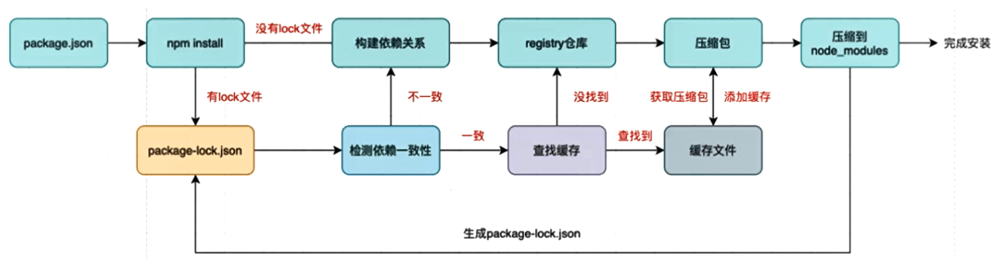

## 工程化学习路线

**模块化 - 包管理工具 - 构建工具 - 脚手架**


### 模块化

- **CommonJs**
- **ES Module**
- AMD
- CMD
- UMD


### 包管理工具

- **npm**
- yarn
- pnpm
- cnpm
- bower


### 构建工具

- **webpack**
  - 概率
  - 原理
  - 配置
    - babel
    - css预编译器
    - postcss
    - eslint
  - 拓展
  - 优化
    - 性能优化概述
    - 减少模块解析
    - 优化loader性能
    - 热替换
    - 手动分包
    - 自动分包
    - 代码压缩
    - tree shaking
    - 懒加载
    - ESLint
    - bundle analyzer
    - gzip
- rollup
- grunt
- esbuild
- gulp
- parcel
- fis3
- snowpack
- vite


### 脚手架

- create vite
- vue-cli
- umijs
- create-react-app


## 模块化

### CommonJs

- 导入：`const a = require('.')`

- 导出：`exports/module.exports`


#### CommonJs导出的本质

- `const all = require('./one')`那么我们这一步操作就是想办法通过这个`require`这个函数拿到`exports`对象，对于all拿到了当前这个对象的引用内存地址，所有这里所做的一种操作相当于引用赋值

- 我们在`require('./one')`的时候，并不是在查找`exports`，而是`module.exports`，但是`exports`和`module.exports`是相同的对象，`exports === module.exports`为true


:::info 补充

当我们了解exports和module.exports后，我们在想，对于这个exports，没有存在的意义呀，module.exports将事情都做了

那为什么node中要设计两个呢。这个和CommonJs的规范有关的

- CommonJs中是没有`module.exports`的概念的
- 但是为了实现模块的导出，Node中使用的是**Module的类，每一个模块都是Module的一个实例，也就是module**
- 所以在Node中真正用于导出的其实根本不是exports，而是module.exports
- 因为module才是导出的真正实现者

:::


#### require的查找规则

`require('X')`

- 情况一：X是node的核心模块，如http、path等

  - 直接返回核心模块，停止查找
  - `const http = require('http')`

- 情况二：X是以./或../或/开头的

  - 第一步：将X当做一个文件在对应的目录下查找
    - 如果有后缀名，按照后缀名的格式查找对应的文件
    - 如果没有后缀名，会按照如下顺序：
      1. 直接查找文件X
      2. 查找X.js文件
      3. 查找X.json文件
      4. 查找X.node文件
  - 第二步：没有找到对应的文件，将X作为一个目录查找
    - 目录下面的index文件
      1. 查找X/index.js文件
      2. 查找X/index.json文件
      3. 查找X/index.node文件

  - 如果都没有找到，报错：not found

- 情况三：直接是一个X(没有路径)，并且X不是一个核心模块

  - `node_modules`中查找


#### 模块的加载过程

- 结论一：模块在被第一次引入时，模块中的js代码会被运行一次
- 结论二：模块被多次引入时，会缓存，最终只加载(运行)一次
  - 为什么只会加载运行一次呢?
  - 这是因为每个模块对象module都有一个属性:loaded
  - 为false表示还没有加载，为true表示已经加载
  - 在第一次引用的时候，module.loaded是false，执行一次代码，将module.loaded改变为true。第二次引用的时候发现是true就不会再次执行
- 结论三：如果有循环引入，那么加载顺序是什么
  - 
  - Node采用的是深度优先算法: main -> aaa -> ccc -> ddd -> eee ->bbb


结论一验证：


#### CommonJs规范缺点

- **CommonJS加载模块是同步的**
  - 同步的意味着只有等到对应的模块加载完毕，当前模块中的内容才能被运行
  - 这个在服务器不会有什么问题，因为服务器加载的js文件都是本地文件，加载速度非常快
- 如果将它应用于浏览器呢
  - 浏览器加载js文件需要先从服务器将文件下载下来，之后再加载运行;
  - 那么采用同步的就意味着后续的js代码都无法正常运行，即使是一些简单的DOM操作
- 所以在浏览器中，我们通常不使用CommonJS规范:
  - 当然在webpack中使用CommonJS是另外一回事
  - 因为它会将我们的代码转成浏览器可以直接执行的代码;

- 在早期为了可以在浏览器中使用模块化，通常会采用AMD或CMD
  - 但是目前一方面现代的浏览器已经支持**ES Modules**，另一方面借助于webpack等工具可以实现对CommonJS或者ES Module代码的转换
  - AMD和CMD已经使用非常少了


### AMD

- AMD主要是应用于浏览器的一种模块化规范:
  - AMD是Asynchronous Module Definition(异步模块定义)的缩写
  - 它采用的是**异步加载模块**
  - 事实上AMD的规范还要早于CommonJS，但是CommonJS目前依然在被使用，而AMD使用的较少了
- 我们提到过，**规范只是定义代码的应该如何去编写**，只有有了具体的实现才能被应用
  - AMD实现的比较常用的库是require.js和curl.js


### CMD

- CMD规范也是应用于浏览器的一种模块化规范
  - CMD是Common Module Definition(通用模块定义)的缩写
  - 它也采用的也是**异步加载模块**，但是它将CommonJS的优点吸收了过来
  - 但是目前CMD使用也非常少了
- CMD也有自己比较优秀的实现方案:SeaJS


### ES Module

#### 导入导出

导入：`import X from '.'`

导出：`export/ default export`

```js
const name = 'hghh'
const age = 18

// 导出方式一：
export {
	name,
    age
}

// 导出方式二：重命名
export {
	name as myName,
    age
}

// 导出方式三：直接导出
export const name = 'hghh'
export const age = 18
```

```js
// 导入方式一
import { name, age } from '.'
// 导入方式二：重命名
import { name as myName, age } from '.'
// 导入方式三：导入整个模块请别名
import * as foo from '.'	(取的时候：foo.name)
```


#### export和import的结合使用

一般我们会定义一个index.js文件来作为一个暴露出去的文件，所需要的参数都会经过这个文件进行先导入在导出

```js
import { a, b } from './x.js'
import { c } from './y.js'

export {
	a,b,c
}

// 优化一：（推荐）
export { a, b } from './x.js'
export { c } from './y.js'

// 优化二：
export * from './x.js'
export * from './y.js'
```


#### 注意事项

- 在浏览器中直接使用esmodule时，必须在文件名后面加上`.js`
- 要开始本地服务来打开html文件
  - 


#### default用法

- 前面我们学习的导出功能都是有名字的导出
  - 在导出export时指定了名字
  - 在导入import时需要知道具体的名字
- 还有一种导出叫做**默认导出**
  - 默认导出export时可以不需要指定名字
  - 在导入时不需要使用`{}`，并且可以自己来指定名字
  - **它也方便我们和现有的CommonJS等规范相互操作**
    - 可以导出的时候使用commonjs，导入的时候使用exmodule
- 注意：**一个模块只能有一个默认导出**

```js
// 导出
function foo(){
	...
}

// 只导出 foo
export default foo
    
// 优化：
export default function(){
    
}
```

```js
// 导入：随便起一个标识符的名字
import aaa from './'
```


#### import函数

当我们需要在一定的逻辑判读后，导入某个文件，要**使用import函数**

```js
let flag = true
if(flag){
    // 这是错误的：不允许在逻辑代码中编写import导入声明，只能写在js代码的顶层
    import { name, age } from './foo.js'
}

// 如果确实想要在逻辑中使用，用import函数
let flag = true
if(flag){
    // 返回值是一个promise
    const importPromise = import('./foo.js')
    importPromise.then(res =>{
        console.log(res)
    })
    
    import('./foo.js').then(res =>{
		console.log(res)
    })
}
```


#### ES Module的解析流程

[ES 模块：卡通深度探讨 - Mozilla Hacks - Web 开发人员博客](https://hacks.mozilla.org/2018/03/es-modules-a-cartoon-deep-dive/)

ES Module的解析过程可以划分为三个阶段:

- 阶段一：构建(Construction)，根据地址查找js文件并且下载，将其解析成模块记录(Module Record) 
- 阶段二︰实例化(Instantiation)，对模块记录进行实例化，并且分配内存空间，解析模块的导入和导出语句，把模块指向对应的内存地址
- 阶段三：运行(Evaluation)，运行代码，计算值，并且将值填充到内存地址中


## 包管理工具

### npm

#### package.json配置文件

- **项目的相关信息**。这个配置文件会记录着你项目的名称、版本号、项目描述等;也会记录着你项目所依赖的其他库的信息和依赖库的版本号。

- 创建：`npm init` 【要是全部保持默认可以使用 `npm init -y`】
- 常见属性：
  - 必须填写的属性：name和version
  - **name**是项目的名称
  - **version**是当前项目的版本号
  - **description**是描述信息，很多时候是作为项目的基本描述
  - **author**是作者相关信息（发布时用到)
  - license是开源协议（发布时用到)
  - **main属性：设置程序的入口**
  - **scripts属性**：
    - scripts属性用于配置一些脚本命令，以键值对的形式存在
    - 配置后我们可以通过npm run命令的key来执行这个命令
    - npm start和npm run start的区别是什么?
      - 它们是等价的
      - 对于常用的 start、 test、stop、restart可以省略掉run直接通过npm start等方式运行
  - **dependencies属性**：dependencies属性是指定无论开发环境还是生成环境都需要依赖的包
  - **devDependencies属性**：—些包在生成环境是不需要的，比如webpack、babel等。这个时候我们会通过`npm install webpack --save-dev`【简写：`npm install webpack -D`】，将它安装到devDependencies属性中。
  - peerDependencies属性：还有一种项目依赖关系是对等依赖，也就是你依赖的一个包，它必须是以另外一个宿主包为前提的;比如element-plus是依赖于vue3的，ant design是依赖于react、react-dom
  - ...


#### 依赖的版本管理

- npm的包通常需要遵从semver版本规范
- semver版本规范是X.Y.Z:
  - X主版本号(major)：当你做了不兼容的API修改（可能不兼容之前的版本)
  - Y次版本号(minor)：当你做了向下兼容的功能性新增(新功能增加，但是兼容之前的版本)
  - Z修订号(patch)：当你做了向下兼容的问题修正（没有新功能，修复了之前版本的bug)
- 我们会发现安装的依赖版本出现：^2.0.3或~2.0.3，这是什么意思呢？
  - x.y.z：表示一个明确的版本号
  - ^x.y.z：表示x是保持不变的，y和z永远安装最新的版本
  - ~x.y.z：表示x和y保持不变的，z永远安装最新的版本


#### npm install

- `npm install`：安装全部依赖

- 全局安装：`npm install 名字 -g`
- 局部安装：`npm install 名字`


#### npm install原理




#### npm发布自己的包

- 注册账号
- [npm (npmjs.com)](https://www.npmjs.com/)
- 命令行登录：`npm login`
- 修改`package.json`
- 发布：`npm publick`
- 更新：先修改版本号，在重新发布
- 删除发布的包：`npm unpublick`
- 让发布的包过期：`npm deprecate`
- 查看npm镜像：`npm config get registry`
- 我们可以直接设置npm的镜像：`npm config set registry https: //registry.npm.taobao.org`


### yarn

- yarn是由Facebook、Google、Exponent和 Tilde联合推出了一个新的JS包管理工具
- yarn是为了弥补$\textcolor{Red}{早期npm的一些缺陷}$而出现的
- 早期的npm存在很多的缺陷，比如安装依赖速度很慢、版本依赖混乱等等一系列的问题
- 常见命令
  - 全部：`yarn install`
  - 安装：`yarn add 包`
  - 卸载：`yarn remove 包`
- 查看npm镜像：`yarn config get registry`
- 我们可以直接设置npm的镜像：`yarn config set registry https: //registry.npm.taobao.org`


### cnpm

- cnpm也只是在中国才用，c应该是chinese的意思
- 由于一些特殊的原因，某些情况下我们没办法很好的从 https://registry.npmjs.org下载下来一些需要的包
- 查看npm镜像：`npm config get registry`
- 我们可以直接设置npm的镜像：`npm config set registry https: //registry.npm.taobao.org`
- 但是对于大多数人来说（比如我)，并不希望将npm镜像修改了:
  - 第一，不太希望随意修改npm原本从官方下来包的渠道
  - 第二，担心某天淘宝的镜像挂了或者不维护了，又要改来改去

- 这个时候，我们可以使用cnpm，并且将cnpm设置为淘宝的镜像


### pnpm

[pnpm官网](https://pnpm.io/zh/)

#### 硬连接和软连接

- 硬链接(hard link) ：**硬链接指向真实的物理资源**
  - 硬链接(英语: hard link)是电脑文件系统中的多个文件平等地共享同一个文件存储单元
  - 删除一个文件名字后，还可以用其它名字继续访问该文件
- 符号链接(软链接soft link、Symbolic link) ：**硬链接就是快捷方式**
  - 符号链接（软链接、Symbolic link)是一类特殊的文件
  - 其包含有一条以绝对路径或者相对路径的形式指向其它文件或者目录的引用


#### 作用

- 当使用npm或yarn时，如果你有100个项目，并且所有项目都有一个相同的依赖包。那么，你在硬盘上就需要保存100份该相同依赖包的副本。（这也是pnpm所解决的最大的问题）
- 如果是使用pnpm，依赖包将被**存放在一个统一的位置**，因此：
  - 如果你对同一依赖包使用相同的版本，那么磁盘上只有这个依赖包的一份文件
  - 如果你对同一依赖包需要使用不同的版本，则仅有版本之间不同的文件会被存储起来
  - 所有文件都**保存在硬盘上的统一的位置**：
    - 当安装软件包时，其包含的所有文件都会**硬链接**到此位置，而不会占用额外的硬盘空间
    - 这让你可以在项目之间方便地共享相同版本的依赖包


#### 扁平化与非扁平化的 node_modules

- 当使用npm或 Yarn Classic安装依赖包时，所有软件包都将被提升到node_modules的根目录下
  - 其结果是，源码可以访问本不属于当前项目所设定的依赖包
  - 因为他采用的是扁平化的node_modules


#### 使用

- 安装：`npm install pnpm -g`

- 以下是一个与npm 等价命令的对照表:

  |        npm命令        |    pnpm等价命令     |
  | :-------------------: | :-----------------: |
  |     `npm install`     |   `pnpm install`    |
  |  `npm install <pkg>`  |  `pnpm add <pkg>`   |
  | `npm uninstall <pkg>` | `pnpm remove <pkg>` |
  |    `npm run <cmd>`    |    `pnpm <cmd>`     |

- 我们可以通过一些终端命令获取pnpm存储store的目录：`pnpm store path`【获取当前活跃的store目录】

- 另外一个非常重要的store命令是prune(修剪)︰`pnpm store prune`【从store中删除当前未被引用的包来释放store的空间】


## 构建工具

### webpack

[webpack (docschina.org)](https://webpack.docschina.org/)


#### webpack的安装

局部安装（开发环境）：`npm install webpack webpack-cli -D`


#### 配置

在项目同级的目录下新建 `webpack.config.js`

```js
const path = require('path');

module.exports = {
  mode: 'development',//工作模式
  entry: './src/js/app.js',//入口
  output: {//出口
    path: path.resolve(__dirname, './build'),//输出文件路径，__dirname获取当前文件的路径
    filename: 'app.js',//输出文件名字
  },
};
```

使用：`npx webpack`。也可以在package.json中的script配置，执行`npm run build`


#### loader

**处理CSS：css-loader + style-loader**

安装：`npm install css-loader -D`

```js
const path = require('path');

module.exports = {
  mode: 'development',
  entry: './src/js/app.js',
  output: {
    path: path.resolve(__dirname, './build'),
    filename: 'app.js',
  },
  module: {
      rules: [
          {
              test: /\.css$/,// 匹配文件：匹配以css结尾的文件
              use: [
                  {
                      loader:'css-loader'
                  }
              ],// 匹配上了要使用什么来处理
          }
      ]
  }
};
```


- 我们已经可以通过css-loader来加载css文件了，但是你会发现这个css在我们的代码中并没有生效（页面没有效果)。
- 这是为什么呢?

  - 因为css-loader只是负责将.css文件进行解析，并不会将解析之后的css插入到页面中
  - 如果我们希望再完成插入style的操作，那么我们还需要另外一个loader，就是style-loader

安装style-loader：`npm install style-loader -D`

```js
const path = require('path');

module.exports = {
  mode: 'development',
  entry: './src/js/app.js',
  output: {
    path: path.resolve(__dirname, './build'),
    filename: 'app.js',
  },
  module: {
      rules: [
          {
              test: /\.css$/,// 匹配文件：匹配以css结尾的文件
              use: [//use中多个loader的使用顺序是从后往前的！！！，所以先解析后插入
                  {
                      loader:'style-loader'
                  },
                  {
                      loader:'css-loader'
                  },
              ],// 匹配上了要使用什么来处理
          }
      ]
  }
};
```


**loader简写形式**

简写一：当我们的loader只有一个的时候

```js
module: {
    rules: [
        {
            test: /\.css$/,// 匹配文件：匹配以css结尾的文件
            loader:'css-loader'
        }
    ]
}
```

简写二：我们`{loader:'css-loader'}`，是因为他可以使用其他的属性，当我们不需要使用的时候，可以简写

```js
module: {
    rules: [
        {
            test: /\.css$/,// 匹配文件：匹配以css结尾的文件
            use: ['style-loader', 'css-loader'],
        }
    ]
}
```


**处理less：less-loader**

```js
module: {
    rules: [
        {
            test: /\.css$/,
            use: ['style-loader', 'css-loader', 'less-loader'],
        }
    ]
}
```


**css属性添加浏览器前缀：postcss-loader**

`npm install postcss-loader -D`

- PostCSS是一个通过JavaScript来转换样式的工具
- 这个工具可以帮助我们进行一些CSS的转换和适配，比如自动添加浏览器前缀、css样式的重置
- **但是实现这些功能，我们需要借助于PostCSS对应的插件**
  - `autoprefixer`：`npm install autoprefixer -D`

```js
module: {
    rules: [
        {
            test: /\.css$/,
            use: ['style-loader', 'css-loader', 
                 	{
                        loader:'postcss-loader',
                        options: {
                            postcssOptions: {
                                plugins: [
                                    'autoprefixer'
                                ]
                            }
                        }
                    }
                 ],
        }
    ]
}
```

对于上部分的内容，我们也可以单独的将其抽出放到`postcss.config.js`文件中


**css属性添加浏览器前缀：postcss-preset-env**

- 事实上，在配置postcss-loader时，我们配置插件并不需要使用autoprefixer
- 我们可以使用另外一个插件:postcss-preset-env
  - postcss-preset-env也是一个postcss的插件
  - **它可以帮助我们将一些现代的CSS特性，转成大多数浏览器认识的CSS，并且会根据目标浏览器或者运行时环境添加所需的polyfill**
  - 也包括会自动帮助我们添加autoprefixer(所以相当于已经内置了autoprefixer) 


#### 认识asset module type

- 我们当前使用的webpack版本是webpack5:
- 在webpack5之前，加载这些资源我们需要使用一些loader，比如raw-loader 、url-loader、file-loader
- 在webpack5开始，我们可以直接使用**资源模块类型**（asset module type)，来替代上面的这些loader（webpack对常用的进行了内置）
- 资源模块类型(asset module type)，通过添加4种新的模块类型，来替换所有这些loader
  - asset/resource 发送一个单独的文件并导出URL（之前通过使用file-loader实现）
  - asset/inline 导出一个资源的data URI（之前通过使用url-loader实现）
  - asset/source 导出资源的源代码（之前通过使用raw-loader实现）
  - asset 在导出一个data URI和发送一个单独的文件之间自动选择。（之前通过使用url-loader，并且配置资源体积限制实现）

```js
// 如：
module: {
    rules: [
        {
            test: /\.(png|jpg|jpeg|svg|gif)$/,
            type: "asset",//还有一些其他的可以查官网
            parser
            generator
        }
    ]
}
```


**asset/resource、asset/inline、asset区别**

- asset/resource：打包两张图片，·并且这两张图片有自己的地址,·将地址设置到img/backgroundimage中
- asset/inline：将图片进行base64编码，植入到js代码中
- asset：自动选择


#### 插件plugin

- Loader是用于**特定的模块类型**进行转换
- Plugin可以用于**执行更加广泛的任务**，比如打包优化、资源管理、环境变量注入等


**CleanWebpackPlugin**

- 每次修改了一些配置,重新打包时，都需要手动删除dist文件夹。我们可以借助于一个插件来帮助我们完成，这个插件就是CleanWebpackPlugin
- 安装：`npm install clean-webpack-plugin -D`

```js
const { CleanWebpackPlugin } = request('clean-webpack-plugin')

module.exports = {
    module:{}
    plugins:[
    	new CleanWebpackPlugin()
    ]
}
```


**HTMLWebpackPlugin**

- 我们的HTML文件是编写在根目录下的，而最终打包的dist文件夹中是没有index.html文件的。
- 在进行项目部署的时，必然也是需要有对应的入口文件index.html;
- 所以我们也需要对index.html进行打包处理;

- 安装：`npm install html-webpack-plugin -D`


#### webpack搭建本地服务器

- 我们希望可以做到，当文件发生变化时，可以自动的完成编译和展示。
- 为了完成自动编译，webpack提供了几种可选的方式:
  - webpack watch mode
  - **webpack-dev-server** (常用)
  - webpack-dev-middleware


**webpack-dev-server**

- 安装：`npm install webpack-dev-server -D`
- 执行：在package.json中script配置一个命令：`serve:webpack serve`，然后执行`npm run serve`


#### 模块热替换（HMR）

- 什么是HMR呢?

  - HMR的全称是Hot Module Replacement，翻译为模块热替换;
  - 模块热替换是指在应用程序运行过程中，替换、添加、删除模块，而无需重新刷新整个页面

- HMR通过如下几种方式,来提高开发的速度:

  - 不重新加载整个页面，这样可以保留某些应用程序的状态不丢失
  - 只更新需要变化的内容，节省开发的时间
  - 修改了css、js源代码，会立即在浏览器更新，相当于直接在浏览器的devtools中直接修改样式

- 如何使用HMR呢？

  - 默认情况下，webpack-dev-server已经支持HMR，我们只需要开启即可（默认已经开启)

  - ```js
    module.exports = {
        module:{}
        devServer: {
    		hot: true
        }
    }
    ```

  - 在不开启HMR的情况下，当我们修改了源代码之后，整个页面会自动刷新，使用的是live reloading

  - 但是你会发现，当我们修改了某一个模块的代码时，依然是刷新的整个页面。这是因为我们需要去指定哪些模块发生更新时，进行HMR

```js
if(module.hot){
	module.hot.accept("./foo.js",()=>{
        console.log("更新了!")
    })
}
```


#### 常见devServer配置

- hot：热更新
- host：主机
- port：端口号
- open：是否自动打开（自动打开设置为true）
- compress：是否对文件进行压缩（自动进行gzip压缩）

```js
module.exports = {
    module:{}
    devServer: {
		hot: true
    }
}
```


#### source-map

- 但是，当代码报错需要调试时(debug)，调试转换后的代码是很困难的
- 那么如何可以调试这种转换后不一致的代码呢?答案就是source-map
  - source-map是从**已转换的代码**，映射到**原始的源文件**
  - 使浏览器可以重构原始源并在调试器中**显示重建的原始源**

- 如何可以使用source-map呢?两个步骤:
  - 第一步：根据源文件，生成source-map文件，webpack在打包时，可以通过配置生成source-map
  - 第二步：在转换后的代码，最后添加一个注释，它指向source-map

```js
module.exports = {
    mode:'production'
    devtool: "source-map",
    ...
}
```


#### babel

- 事实上，在开发中我们很少直接去接触babel，但是babel对于前端开发来说，目前是不可缺少的一部分
  - 开发中，我们想要使用ES6+的语法，想要使用TypeScript，开发React项目，它们都是离不开Babel的
  - 所以，学习Babel对于我们理解代码从编写到线上的转变过程至关重要
- 那么，Babel到底是什么呢?
  - Babel是一个工具链，主要用于旧浏览器或者环境中将ECMAScript 2015+代码转换为向后兼容版本的JavaScript
  - 包括:语法转换、源代码转换等

- babel本身可以作为一个独立的工具（和postcss一样)，不和webpack等构建工具配置来单独使用。

- 我们在进行所有转换的时候，需要一个一个进行设置。但是如果要转换的内容过多，一个个设置是比较麻烦的，我们可以使用预设(preset)：

  - 安装`@babel/preset-env`预设：`npm install @babel/preset-env -D`

  - 执行命令：`npx babel src --out-dir dist --preset=@babel/preset-env`


**babel编译器执行原理**

首先先了解v8引擎的执行原理：[js运行原理 - 鲸落 (xiaojunnan.cn)](http://www.xiaojunnan.cn/jsRunPrinciple#v8引擎执行原理)


webpack+gulp+rollup：`E:\coderwhy\16-Webpack+Gulp+Vite+Rollup：689 - 791`


### gulp

### rollup

### vite

[Vite | 下一代的前端工具链 (vitejs.dev)](https://cn.vitejs.dev/)

#### vite的底层的原理

- 开发阶段使用ESBuild，打包阶段使用rollup

- vite开启服务器使用的是connect（vite1使用的是koa）


#### 对相关代码的支持

vite对这些文件的类型以及做了预设的配置，只需要我们安装相关的东西即可

- vite可以直接支持css的处理，直接导入css即可
- vite可以直接支持css预处理器，比如less
  - 直接导入less
  - 之后安装less编译器：`npm install less -D`
- vite直接支持postcss的转换
  - 只需要安装postcss，并且配置postcss.config.js的配置文件
  - `npm install postcss postcss-preset-env -D`

- typescript
  - 当我们使用ts的时候，你会发现vite请求的文件依然是ts文件，那浏览器是如何识别ts代码的呢？
  - 其他vite将ts里的代码转为了js的代码，尽管他请求的是ts代码，但是执行的依然是js代码


#### ESBuild解析

ESBuild的特点：

- 超快的构建速度，并且不需要缓存
- 支持ES6和CommonJS的模块化
- 支持ES6的Tree Shaking
- 支持Go、JavaScript的API;
- 支持TypeScript、JSX等语法编译
- 支持SourceMap
- 支持代码压缩;支持扩展其他插件


## 脚手架

### create vite

- 创建项目：`npm create vite`，进行一系列的选项

- 创建项目：`pnpm create vite`，进行一系列的选项


