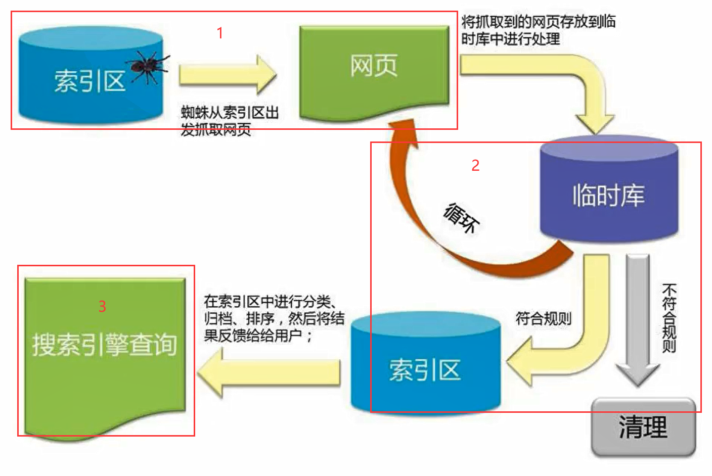

## data和params

- `data` 参数：通常用于 POST、PUT、PATCH 等请求方法，用于发送请求的主体数据。这些数据通常以 JSON 格式进行编码，并作为请求的有效载荷发送到服务器。`data` 参数的值会被放置在请求的主体部分。

  - ```js
    axios.post('/api/users', {
      name: 'John Doe',
      age: 30
    })
    ```

- `params` 参数：通常用于 GET 请求，用于将查询字符串参数附加到 URL 上。这些参数会在请求的 URL 中以键值对的形式进行编码，并发送到服务器。`params` 参数的值会被添加到 URL 的查询字符串部分。

  - ```js
    axios.get('/api/users', {
      params: {
        page: 1,
        limit: 10
      }
    })
    ```

- 总结

  - 使用 `data` 参数发送请求的主体数据，适用于 POST、PUT、PATCH 等请求方法。
  - 使用 `params` 参数将查询字符串参数附加到 URL 上，适用于 GET 请求。


## params和query

在HTTP请求中，"params"和"query"是两种常见的参数传递方式，它们有一些区别。

1. Params（路径参数）：
   - 用途：Params用于在URL的路径中传递参数，通常用于指定资源的标识符或路由参数。
   - 格式：Params参数出现在URL的路径部分，以占位符的形式表示。
   - 示例：`/api/users/:id`，其中`:id`是一个参数占位符，可以被具体的值替代，例如`/api/users/123`。
   - 在Axios中使用：在Axios中，Params参数可以通过将其作为URL的一部分来传递，例如`axios.get('/api/users/' + userId)`。
2. Query（查询参数）：
   - 用途：Query用于在URL的查询字符串中传递参数，通常用于指定附加的选项或过滤条件。
   - 格式：Query参数出现在URL的问号后面，以键值对的形式表示。
   - 示例：`/api/users?name=John&age=30`，其中`name`和`age`是参数键，分别对应的值是`John`和`30`。
   - 在Axios中使用：在Axios中，Query参数可以通过使用`params`属性来传递，例如`axios.get('/api/users', { params: { name: 'John', age: 30 } })`。

总结：

- Params用于在URL的路径中传递参数，以占位符形式表示。
- Query用于在URL的查询字符串中传递参数，以键值对的形式表示。
- 在Axios中，Params参数可以直接拼接在URL中，而Query参数需要使用`params`属性传递


## js中for跳出循环（包括多层循环）return和break的区别

**单层循环**

- for循环中return语句：会直接跳出循环。因为js中for是没有局部作用域的概念的，所以只有把for循环放在函数中时，才可以在for循环中使用return语句。
- for循环中的break语句：和return一样会直接跳出循环。与return不同的是，使用break时，for循环可以不用一定放在函数中 

 **多层循环**

使用return会直接跳出函数

```js
var a=[1,2,3];
var b=[4,5,6,7,8];
function test(){
    for(var i=0;i<a.length;i++){
        for(var j=0;j<b.length;j++){
            if(b[j]==5){
                // break
                return;
            }else{
                console.log(13);
            }
        }

        console.log(12);
    }
    console.log(14);
}
test();//打印结果为：13
```


break不是跳出函数，而是跳出最里层的for循环，外面的循环和最外层for循环后面的语句也将继续执行

```js
 var a=[1,2,3];
 var b=[4,5,6,7,8];
 function test(){
     for(var i=0;i<a.length;i++){
         for(var j=0;j<b.length;j++){
             if(b[j]==5){
                 break ;
                 // return;
             }else{
                 console.log(13);
             }
         }

         console.log(12);
     }
     console.log(14);
 }
test();//打印结果为13 12 13 12 13 12 14
```


## 爬虫工作流程



Google爬虫的工作流程分为3个阶段，并非每个网页都会经历这3个阶段：

- 抓取:
  - 爬虫（也称蜘蛛)，从互联网上发现各类网页，网页中的外部连接也会被发现。
  - 抓取数以十亿被发现网页的内容，如:文本、图片和视频
- 索引编制:
  - 爬虫程序会分析网页上的文本、图片和视频文件
  - 并将信息存储在大型数据库（索引区)中
  - 例如`<title>`元素和Alt属性、图片、视频等
  - 爬虫会对内容类似的网页归类分组
  - 不符合规则内容和网站会被清理（禁止访问或需要权限网站等等）

- 呈现搜索结果


