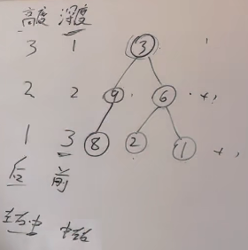

[代码随想录 (programmercarl.com)](https://www.programmercarl.com/)

每一种题还给了相关题目推荐，在刷完一类题型的时候返回将每个题的相关类似题刷一下巩固一下

## 数组

### 二分查找

[704. 二分查找 - 力扣（LeetCode）](https://leetcode.cn/problems/binary-search/)

```js
var search = function(nums, target) {
    const n = nums.length
    
    let left = 0
    let right = n - 1   
    
    while( left <= right ){
        let mid = Math.floor((left + right)/2)
        if( nums[mid] == target ){
            return mid
        }else{

            if( nums[mid] > target ){
                right = mid - 1
            }else{
                left = mid + 1
            }

        }

    }

    return -1

};
```


### 移除元素

[力扣 (leetcode.cn)](https://leetcode.cn/problems/remove-element/)

#### 双指针交换

```js
var removeElement = function(nums, val) {
    const n = nums.length
	// 定义快慢指针
    let slow = 0
    for(let i = 0;i<nums.length;i++){
        // 当他们不相等的时候, 往后跑赋值
        if(nums[i] !== val){
            nums[slow++] = nums[i]
        }
    }

    return slow
};
```


#### 覆盖方式

```js
var removeElement = (nums, val) => {
    let k = 0;
    for(let i = 0;i < nums.length;i++){
        if(nums[i] != val){
            nums[k++] = nums[i]
        }
    }
    return k;
}
```


### 有序数组的平方

[Loading Question... - 力扣（LeetCode）](https://leetcode.cn/problems/squares-of-a-sorted-array/)

#### 使用已有方法

```js
var sortedSquares = function(nums) {
    return nums.map(item => item*item).sort((a, b) => a-b)
};
```


#### 双指针

```js
var sortedSquares = function(nums) {
    let i = 0
    let j = nums.length - 1
    let arr = []
    while(i <= j){
        let a = nums[i] * nums[i]
        let b = nums[j] * nums[j]

        if( a < b ){
            arr.unshift(b)
            j--
        }else{
            arr.unshift(a)
            i++
        }

    }

    return arr

};
```


### 长度最小的子数组

[209. 长度最小的子数组 - 力扣（LeetCode）](https://leetcode.cn/problems/minimum-size-subarray-sum/)

#### 滑动窗口

```js
var minSubArrayLen = function(target, nums) {
   let n = nums.length

    let j = 0

    let num = 0
    let result = Number.MAX_VALUE
    let isChange = false
    for( let i = 0;i<n;i ++ ){
        num += nums[i]
        
        while( num >= target ){
            // 纪录最小值
            result = Math.min(result, i - j + 1)
            // j向前走，num要把那个之前的j值减掉
            num -= nums[j]
            j++
            isChange = true
        }

    }
    
    return isChange ? result : 0

};
```


### 螺旋矩阵 II

[59. 螺旋矩阵 II - 力扣（LeetCode）](https://leetcode.cn/problems/spiral-matrix-ii/)

```js
// 第一圈循环

var generateMatrix = function(n) {
    // 填充二维数组全为0
    let arr = new Array(n).fill(0).map(() => new Array(n).fill(0))
    // 定义起始位置这定义了其实位置之后，我们要明确我们的循环规则：左闭右开
    let x = y =0
    // 定义我们循环的次数(根据n有两种情况)
    let loop = Math.floor(n/2)
    // 定义填充的值
    let count = 1

    
        let i = j = 0;
        // 上边的循环：为什么是n-1，因为左闭右开
        for(j = 0;j<n-1;j++){
			arr[i][j] = count++
        }
        
        // 右边的循环
        for(i = 0;i<n-1;i++){
            arr[i][j] = count++
        }
        
        // 下边的循环,j已经变成了n-1了不需要初始化值，当然你初始化也是没有问题的
        for(j = n-1; j >=0; j--){
            arr[i][j] = count++
        }
        
        //左边的循环,i已经变成了n-1了不需要初始化值，当然你初始化也是没有问题的
        for(i = n -1;i >=0;i--){
            arr[i][j] = count++
        }
     

};
```

```js
// 下一圈循环 --- 一圈一圈的循环

var generateMatrix = function(n) {
    // 我们还需要定义一些参数
    // 控制每条边的终止位置：
    // 其实对于控制终止位置我们定义一个参数就可以了，方便理解可以定义两个
    let offsetX = 1
    let offsetY = 1
    
    let arr = new Array(n).fill(0).map(() => new Array(n).fill(0))
    let x = y =0
    let loop = Math.floor(n/2)
    let count = 1

    while(loop--){
        let i = x, j = y;

        // for(j = 0;j<n-offsetX;j++)
        for(;j<n-offsetX;j++){
			arr[i][j] = count++
        }
        
        // for(i = 0;i<n-1;i++)
        for(;i<n-offsetY;i++){
            arr[i][j] = count++
        }
        
        for(; j >x; j--){
            arr[i][j] = count++
        }
        
        for(;i >y;i--){
            arr[i][j] = count++
        }
        
        x++
        y++
        offsetX++
        offsetY++
    }
    
    // n为奇数的情况，最中间的部分我们要填充上最后的count
    if( n %2 == 1){
        arr[Math.floor(n/2)][Math.floor(n/2)] = count
    }
     
	return arr
};
```


## 链表

### 移除链表元素

[203. 移除链表元素 - 力扣（LeetCode）](https://leetcode.cn/problems/remove-linked-list-elements/)

#### 原链表删除元素的方法

```js
var removeElements = function(head, val) {
    if(!head) return head

    //头结点值为val的情况
    while( head && head.val == val ){
        head = head.next
    }


    let cur = head
    while(cur){
        if( cur.next && cur.next.val == val ){
            cur.next = cur.next.next
        }else{
            cur = cur.next
        }     
    }

    return head

};
```

#### 使用虚拟头结点的方法

```js
var removeElements = function(head, val) {
    var newNode = new ListNode(-1, head); // 设置一个虚拟头节点
    var prev = newNode; // prev记录当前节点的前一个节点
    while(prev.next) { // 从head开始遍历链表
        if(prev.next.val === val) { // 如果当前节点的值等于val
            prev.next = prev.next.next // 跳过当前的节点
        } else {
            prev = prev.next // 如果不等于，继续遍历链表
        }
    }
    return newNode.next; // 返回头节点
};
```

#### 双指针法

```js
var removeElements = function(head, val) {
    if( !head ) return head
    
    while( head && head.val == val ){
        head = head.next
    }

    let current = head
    let pre = null
    while(current){
        if( current.val == val ){
            pre.next = current.next
        }else{
            pre = current
        }
        current = current.next
    }

    return head
};
```


### 设计链表

[707. 设计链表 - 力扣（LeetCode）](https://leetcode.cn/problems/design-linked-list/)


### 反转链表

[206. 反转链表 - 力扣（LeetCode）](https://leetcode.cn/problems/reverse-linked-list/)

#### 递归

```js
var reverseList = function(head) {
   // 递归结束条件
   if(head === null || head.next === null) return head

    // 在这个位置执行的代码是在递归前执行的代码

    const newHead = reverseList(head.next)  //  每一次递归结束返回的newHead就是上面的那个head

    // 在这个位置执行的代码是在递归后执行的代码

    // 在这里我们要理解，来到这个head是谁
    // 第一次来到这个的时候，head是倒数第二个节点，因为倒数第一个直接返回head了
    // 这个时候我们需要将倒数第一个指向倒数第二个,并将倒数第二个指针设为空
    head.next.next = head
    head.next = null

    return newHead
};
```

#### 栈

```js
var reverseList = function(head) {
    // 当我们的链表没有节点或只有一个节点的时候，可以直接返回
    if(head === null || head.next === null) return head
    // 用数组来模拟战
    let arr = []
    let current = head
    while(current){
        arr.push(current)
        current = current.next
    }

    // 创建一个新的head
    const newHead = arr.pop()
    let newHeadCurrent = newHead
    while(arr.length){
        let node = arr.pop()
        // 上一个出来的指向刚出来的
        newHeadCurrent.next = node
        //往下走
        newHeadCurrent = newHeadCurrent.next
    }
    
    // 注意一定要将最后一个newHeadCurrent的next设置为null
    newHeadCurrent.next = null

    return newHead

};
```


#### 双指针

```js
var reverseList = function(head) {
    let cur = head
    let pre = null

    while(cur){
        let temp = cur.next
        cur.next = pre
        pre = cur
        cur = temp
    }
    return pre
};
```


### 两两交换链表中的节点

[24. 两两交换链表中的节点 - 力扣（LeetCode）](https://leetcode.cn/problems/swap-nodes-in-pairs/)

```js
var swapPairs = function(head) {
    let newNode = new ListNode(0, head)
    let cur = newNode
    // cur.next为空就是偶数的情况，cur.next.next就是奇数的情况
    while(cur.next !== null && cur.next.next !== null){
        // newNode -> 1 -> 2 -> 3 -> 4 -> 5

        // 纪录 1的位置
        let temp1 = cur.next
        // 纪录3的位置
        let temp2 = cur.next.next.next
        // newNode 指向 2
        cur.next = cur.next.next
        // 此时2 就是cur.next, 2指向1
        cur.next.next = temp1
        // 1指向3
        temp1.next = temp2

        // 接下来交换3/4，那么我们的cur就应该移动到1的位置：newNode -> 2 -> 1 -> 3 ...
        // cur.next在2的位置，cur.next.next跑到1
        cur = cur.next.next

    }
    return newNode.next
};
```


### 删除链表的倒数第 N 个结点

[19. 删除链表的倒数第 N 个结点 - 力扣（LeetCode）](https://leetcode.cn/problems/remove-nth-node-from-end-of-list/)

```js
var removeNthFromEnd = function(head, n) {
    // 使用虚拟头肩点的方式
    let newNode = new ListNode(0, head)

    let cur = newNode
    let pre = newNode

    while(n--){
        cur = cur.next
    }

    while(cur.next){
        cur = cur.next
        pre = pre.next
    }

    pre.next = pre.next.next

    return newNode.next

};
```


### 链表相交

[面试题 02.07. 链表相交 - 力扣（LeetCode）](https://leetcode.cn/problems/intersection-of-two-linked-lists-lcci/)

思路：[【图解：双指针】JavaScript - 链表相交 - 力扣（LeetCode）](https://leetcode.cn/problems/intersection-of-two-linked-lists-lcci/solution/tu-jie-shuang-zhi-zhen-javascript-by-lzx-zd6z/)

```js
var getIntersectionNode = function(headA, headB) {
    let a = headA
    let b = headB

    while(a !== b){
        a = a === null ? headB: a.next
        b = b === null ? headA: b.next
    }

    return a
};
```


### 环形链表II

[142. 环形链表 II - 力扣（LeetCode）](https://leetcode.cn/problems/linked-list-cycle-ii/)

```js
var detectCycle = function(head) {
    if(!head || !head.next) return null;
    // 定义快慢指针
    let slow =head.next, fast = head.next.next;
    while(fast && fast.next) {
        slow = slow.next;
        fast = fast.next.next;
        // 相等即是相遇
        if(fast == slow) {
            // 从头结点开始跑，还有一个从相遇点开始，当他们再次相遇的时候，即是环开始点
            slow = head;
            while (fast !== slow) {
                slow = slow.next;
                fast = fast.next;
            }
            return slow;
        }
    }
    return null;
};
```


## 字符串

### 反转字符串

[344. 反转字符串 - 力扣（LeetCode）](https://leetcode.cn/problems/reverse-string/)

**双指针法**

```js
var reverseString = function(s) {
    let i = 0
    let j = s.length - 1
    while(i < j){
        [ s[i], s[j] ] = [ s[j], s[i] ]
        i++
        j--
    }
};
```


### 反转链表II

[541. 反转字符串 II - 力扣（LeetCode）](https://leetcode.cn/problems/reverse-string-ii/)

```js
var reverseStr = function(s, k) {
    let arr = s.split('');
    // 每隔 2k 个字符的前 k 个字符进行反转
    for(let i = 0; i < arr.length; i += 2 * k) {
        let l = i;
        // i + k <= arr.length说明剩余字符小于 2k 但大于或等于 k 个，反转前 k 个字符
        // i + k > arr.length剩余字符少于 k 个，则将剩余字符全部反转
        let r = i + k <= arr.length ? i + k - 1 : arr.length - 1;
        while(l < r) {
            [arr[l], arr[r]] = [arr[r], arr[l]];
            l++;
            r--;
        }
    }
    return arr.join('');
};
```


### 替换空格

[剑指 Offer 05. 替换空格 - 力扣（LeetCode）](https://leetcode.cn/problems/ti-huan-kong-ge-lcof/)

```js
var replaceSpace = function(s) {
    let a = s.split('')

    for(let i = 0;i<a.length;i++){
        if(a[i] == ' ') a[i] = '%20'
    }

    return a.join('')
};
```


### 反转字符串中的单词

[151. 反转字符串中的单词 - 力扣（LeetCode）](https://leetcode.cn/problems/reverse-words-in-a-string/)

**容易想到的思路**

```js
var reverseWords = function(s) {
    let a = s.split(' ')
    let arr = []
    for(let i = 0; i< a.length;i++){
        if( a[i] != '' ){
            arr.unshift(a[i])
        }
    }

    return arr.join(" ")
};
```


**进阶**：使用 `O(1)` 额外空间复杂度的 **原地** 解法。


### 左旋转字符串

[剑指 Offer 58 - II. 左旋转字符串 - 力扣（LeetCode）](https://leetcode.cn/problems/zuo-xuan-zhuan-zi-fu-chuan-lcof/)

**数组头出尾进**

```js
var reverseLeftWords = function(s, n) {
    if( n >= s.length ) return s

    let a = s.split('')
    for(let i = 0; i< n ;i++){
        a.push(a.shift())
    }
    return a.join("")
};
```


**截取拼接**

```js
var reverseLeftWords = function(s, n) {
    if( n >= s.length ) return s
    return s.slice(n) + s.slice(0, n)
};
```


**将字符串双倍然后截取：**[【双倍字符串+截取】JavaScript - 左旋转字符串 - 力扣（LeetCode）](https://leetcode.cn/problems/zuo-xuan-zhuan-zi-fu-chuan-lcof/solution/shuang-bei-zi-fu-chuan-jie-qu-javascript-bzzv/)

```js
const reverseLeftWords = (s, k) => {
    const n = s.length;
    let a = s + s
    return a.slice(k, n+k)
};
```


### 找出字符串中第一个匹配项的下标

这题是经典的KMP算法

[28. 找出字符串中第一个匹配项的下标 - 力扣（LeetCode）](https://leetcode.cn/problems/find-the-index-of-the-first-occurrence-in-a-string/)

```js
var strStr = function(haystack, needle) {
    return haystack.indexOf(needle)
};
```

```js
var strStr = function(haystack, needle) {
    let i = 0

    let n = needle.length
    while( i< haystack.length ){
        if( haystack[i] == needle[0] && haystack.substr(i, n) == needle ){
            return i
        }else{
            i++
        }
    }

    return -1
}
```


### 重复的子字符串

这也是KMP的经典题目

[459. 重复的子字符串 - 力扣（LeetCode）](https://leetcode.cn/problems/repeated-substring-pattern/)

**移动匹配**

```js
var repeatedSubstringPattern = function(s) {
    let a = s + s
    let b = a.slice(1,a.length-1)
    return b.includes(s)
};
```


### 最长回文子串

[5. 最长回文子串 - 力扣（LeetCode）](https://leetcode.cn/problems/longest-palindromic-substring/)

**解题思路**

- 两种情况

  - 一种是回文子串长度为奇数（如aba，中心是b）

  - 另一种回文子串长度为偶数（如abba，中心是b，b）

- 核心就是循环遍历字符串 对取到的每个值 都假设他可能成为最后的中心进行判断


**循环截取字符串法**

```js
var longestPalindrome = function(s) {
    	const a = s.length
        if (a<2) return s
        let res = ''
        for (let i = 0; i < s.length; i++) {
            // 回文子串长度是奇数
            helper(i, i)
            // 回文子串长度是偶数
            helper(i, i + 1) 
        }

        function helper(m, n) {
            while (m >= 0 && n < a && s[m] == s[n]) {
                m--
                n++
            }
            // 注意此处m,n的值循环完后  是恰好不满足循环条件的时刻
            // 此时m到n的距离为n-m+1，但是mn两个边界不能取 所以应该取m+1到n-1的区间  长度是n-m-1
            if (n - m - 1 > res.length) {
                // slice也要取[m+1,n-1]这个区间 
                res = s.slice(m + 1, n)
            }
        }
        return res
};
```


**双指针法**

```js
var longestPalindrome = function(s) {
    	const a = s.length
        if (a<2) return s
        let l = 0
        let r = 0
        for (let i = 0; i < s.length; i++) {
            // 回文子串长度是奇数
            helper(i, i)
            // 回文子串长度是偶数
            helper(i, i + 1) 
        }

        function helper(m, n) {
            while (m >= 0 && n < a && s[m] == s[n]) {
                m--
                n++
            }
            // 注意此处m,n的值循环完后  是恰好不满足循环条件的时刻
            if (n - m - 1 > r - l - 1) {
               l = m
               r = n
            }
        }

        return s.slice(l+1, r)
};
```


### 最长公共前缀

[14. 最长公共前缀 - 力扣（LeetCode）](https://leetcode.cn/problems/longest-common-prefix/)

逐位比较，比较全部通过时`res`增加当前字符，不通过时直接返回`res`

```js
var longestCommonPrefix = function(strs) {
    let res = ''
    let n = strs.length
    if(!n) return res;
    if(n === 1) return strs[0]
    
    for(let i = 0;i<strs[0].length;i++){
        for(let j = 1;j<strs.length;j++){
            if(strs[j][i] !== strs[0][i]) return res
        }
        res += strs[0][i]
    }
    return res
};
```


## 双指针

### 三数之和

[15. 三数之和 - 力扣（LeetCode）](https://leetcode.cn/problems/3sum/)

```js
/**
 * @param {number[]} nums
 * @return {number[][]}
 */
var threeSum = function(nums) {
    nums.sort((a,b) => a-b)
    let arr = []
    const n = nums.length
    for(let i = 0;i<n-2;i++){
        // 当第一个数大于0的时候可以直接结束了
        if(nums[i] > 0) break
        // 当前数不等于前一个数,结束当前的i
        if( i>0 && nums[i] === nums[i-1] ) continue
        let left = i+1
        let right = n-1
        while(left < right){
            let sum = nums[i] + nums[left] + nums[right]
            if(sum > 0 ){
                right--
            }
            if(sum < 0){
                left++
            }
            
            if(sum == 0){
                arr.push([nums[i], nums[left], nums[right] ])
                 // 去重：去除这样的情况：[-2,0,0,2,2]
                while(left < right && nums[left] == nums[left + 1]){
                    left++
                }
                while(left < right && nums[right] == nums[right - 1]) {
                    right--
                }
                left++
                right--
            }

        }
        

    }

    return arr
};
```


### 四数之和

[18. 四数之和 - 力扣（LeetCode）](https://leetcode.cn/problems/4sum/)

```js
 var fourSum = function(nums, target) {
    nums.sort((a,b) => a-b)
    const n = nums.length
    let arr = []
    debugger
    for(let i = 0;i< n-3;i++){
        // 这里不能直接添加大于target，因为target可能为负数
        if( target >0 && nums[i] > target) break
        if(i>0 && nums[i] == nums[i-1]) continue

        for(let j = i+1;j< n-2;j++){
            // 这里我们也可以添加一个剪枝判断，这里i和j是一起的
            if( target >0 && nums[i] + nums[j] > target) break
            // if( nums[j] == nums[j-1]) continue
            if(j > i + 1 && nums[j] === nums[j - 1]) continue;

            let left = j+1
            let right = n-1

            while(left < right){
                let sum = nums[i] + nums[j] + nums[left] + nums[right]
                if(sum > target){
                    right--
                }
                if(sum < target){
                    left++
                }

                if( sum == target){
                    arr.push( [ nums[i], nums[j], nums[left], nums[right] ] )

                    while( left < right && nums[left] == nums[left+1] ){
                        left++
                    }

                    while( left <right && nums[right] == nums[right-1] ){
                        right--
                    }

                    left++
                    right--
                }
            }

        }

    }

    return arr

};
```


## 栈和队列

### 有效括号

[20. 有效的括号 - 力扣（LeetCode）](https://leetcode.cn/problems/valid-parentheses/)

```js
var isValid = function(s) {
    let arr = []
    // 这个可以不加，加上的话有性能优化
    if(a.length % 2 == 1) return false
    for(let i = 0;i<s.length;i++){
        switch(s[i]){
            case '(':arr.push(')');break;
            case '[':arr.push(']');break;
            case '{':arr.push('}');break;
            default :
                if(s[i] != arr.pop() ) return false
                break;
        }
    }

    
    return !arr.length
};
```


### 删除字符串中的所有相邻重复项

[1047. 删除字符串中的所有相邻重复项 - 力扣（LeetCode）](https://leetcode.cn/problems/remove-all-adjacent-duplicates-in-string/)

```js
var removeDuplicates = function(s) {
    let arr = []
    for(const value of s){
        let a = arr.pop()

        if( value != a ){
            arr.push(a)
            arr.push(value)
        }
    }

    return arr.join('')
};
```


### 逆波兰表达式求值

[150. 逆波兰表达式求值 - 力扣（LeetCode）](https://leetcode.cn/problems/evaluate-reverse-polish-notation/)

```js
var evalRPN = function (tokens) {
    const stack = [];
    for (const token of tokens) {
        if (isNaN(token) { // 非数字
            const n2 = stack.pop(); // 出栈两个数字
            const n1 = stack.pop();
            switch (token) { // 判断运算符类型，算出新数入栈
                case "+":
                    stack.push(n1 + n2);
                    break;
                case "-":
                    stack.push(n1 - n2);
                    break;
                case "*":
                    stack.push(n1 * n2);
                    break;
                case "/":
                    // parseInt是只保留整数部分,不能使用Math.floor，因为负数时会出错
                    stack.push(parseInt(n1 / n2));
                    break;
            }
        } else { // 数字
            stack.push(Number(token));
        }
    }
    return stack[0]; // 因没有遇到运算符而待在栈中的结果
};
```


### 滑动窗口最大值

[239. 滑动窗口最大值 - 力扣（LeetCode）](https://leetcode.cn/problems/sliding-window-maximum/)

涉及到堆的知识

### 前 K 个高频元素

[347. 前 K 个高频元素 - 力扣（LeetCode）](https://leetcode.cn/problems/top-k-frequent-elements/)

涉及到堆的知识


## 二叉树

[代码随想录：二叉树总结](https://www.programmercarl.com/二叉树总结篇.html#阶段总结)

在二叉树中，我们要遍历的话一定要确定我们使用的是哪种遍历方式：前中后序

- 前序遍历：中左右。中序遍历：左中右。后序遍历：左右中。

- 一般需要我们收集孩子的信息向上一层返回的时候都会使用后续遍历

### 遍历

[144. 二叉树的前序遍历 - 力扣（LeetCode）](https://leetcode.cn/problems/binary-tree-preorder-traversal/)

```js
var preorderTraversal = function(root) {
    let arr = []
    nodeMap(root)
    function nodeMap(node){
        if(node){
            arr.push(node.val)
            nodeMap(node.left)
            nodeMap(node.right)
        }
    }
    return arr
};
```


[94. 二叉树的中序遍历 - 力扣（LeetCode）](https://leetcode.cn/problems/binary-tree-inorder-traversal/)

```js
var postorderTraversal = function(root) {
    let arr = []
    nodeMap(root)
    function nodeMap(node){
        if(node){
            nodeMap(node.left)
            arr.push(node.val)
            nodeMap(node.right)
        }
    }
    return arr
};
```


[145. 二叉树的后序遍历 - 力扣（LeetCode）](https://leetcode.cn/problems/binary-tree-postorder-traversal/)

```js
var postorderTraversal = function(root) {
    let arr = []
    nodeMap(root)
    function nodeMap(node){
        if(node){
            nodeMap(node.left)
            nodeMap(node.right)
            arr.push(node.val)
        }
    }
    return arr
};
```


### 层序遍历

[102. 二叉树的层序遍历 - 力扣（LeetCode）](https://leetcode.cn/problems/binary-tree-level-order-traversal/)

```js
var levelOrder = function(root) {
    if(!root) return []
    //二叉树的层序遍历
    let res = [], queue = [root];
    while(queue.length !== 0) {
        // 记录当前层级节点数
        let length = queue.length;
        //存放每一层的节点
        let curLevel = [];
        for(let i = 0;i < length; i++) {
            let node = queue.shift();
            curLevel.push(node.val);
            // 存放当前层下一层的节点
            node.left && queue.push(node.left);
            node.right && queue.push(node.right);
        }
        //把每一层的结果放到结果数组
        res.push(curLevel);
    }
    return res;
};
```


### 反转二叉树

[226. 翻转二叉树 - 力扣（LeetCode）](https://leetcode.cn/problems/invert-binary-tree/)

**先序遍历的方式来反转二叉树**

```js
var invertTree = function(root) {
    if(!root) return null

    let rightNode = root.right
    root.right = invertTree(root.left);
    root.left = invertTree(rightNode);

    return root
};
```


**后序遍历的方式来反转二叉树**

```js
var invertTree = function(root) {
    if(!root) return null

    invertTree(root.left);
    invertTree(root.right);
    [root.left, root.right] = [root.right, root.left]

    return root
};
```


### 对称二叉树

[101. 对称二叉树 - 力扣（LeetCode）](https://leetcode.cn/problems/symmetric-tree/)

#### 使用递归后续遍历

在对左右进行遍历的时候，我们需要知道什么时候返回true，什么时候返回false

- 返回false的情况
  - 左空右不空
  - 左不空右空
  - 左不空右不空值不等
- 返回true的情况
  - 左右为空
- 继续递归的情况
  - 左不空右不空值相等

```js
var isSymmetric = function(root) {
    if(!root) return true
    
    function foo(left, right){
        if(left==null && right != null){
            return false
        }else if(left!=null && right == null){
            return false
        }else if(left == null && right == null){
            return true
        }else if(left != null && right != null && left.val != right.val){
            // left != null && right != null && 是可以省略的，来到这两个一定不是空了，写了方便理解
            return false
        }

        let a = foo(left.left, right.right)
        let b = foo(left.right, right.left)

        return a&&b
    }

    return foo(root.left, root.right)
};
```

```js
// 简单优化
var isSymmetric = function(root) {
    if(!root) return true
    
    function foo(left, right){
        if (left === null && right === null) return true;
        if (left === null || right === null) return false;

        if (left.val !== right.val) {
            return false
        } else {
            return foo(left.left, right.right) && foo(left.right, right.left)
        }
    }

    return foo(root.left, root.right)
};
```


#### 队列实现迭代判断是否为对称二叉树

```js
var isSymmetric = function(root) {
  if(!root) return true;
  let queue = [];
  queue.push(root.left);
  queue.push(root.right);
  while(queue.length) {
      let leftNode = queue.shift();    //左节点
      let rightNode = queue.shift();   //右节点
      if(leftNode === null && rightNode === null) {
          continue;
      }
      if(leftNode === null || rightNode === null || leftNode.val !== rightNode.val) {
          return false;
      }
      queue.push(leftNode.left);     //左节点左孩子入队
      queue.push(rightNode.right);   //右节点右孩子入队
      queue.push(leftNode.right);    //左节点右孩子入队
      queue.push(rightNode.left);    //右节点左孩子入队
  }
  
  return true;
};
```

用栈的思路与队一样，展示取数据的位置不一样


### 二叉树的最大深度

[104. 二叉树的最大深度 - 力扣（LeetCode）](https://leetcode.cn/problems/maximum-depth-of-binary-tree/)

我们先区分什么是高度，什么是深度（高度深度为1还是0仅仅是一个规则，不用太纠结） 



#### 层序遍历后返回长度

这个思路比较好想到，但是效率不高

```js
var maxDepth = function(root) {
    // 层续遍历
    if(!root) return 0

    let arr1 = []
    let arr2 = [root]

    while(arr2.length){
        let arr3 = []
        let n = arr2.length
        for(let i = 0;i<n;i++){
            let x = arr2.shift()
            arr3.push(x)
            x.left && arr2.push(x.left)
            x.right && arr2.push(x.right)
        }
        arr1.push(arr3)
    }

    return arr1.length
};
```


#### 后序遍历的思路

求深度一般是前序遍历，求高度是后续遍历。

那为什么这题是用后续遍历呢？核心是：**根节点的深度就是二叉树的深度**

```js
var maxDepth = function(root) {
    if(!root) return 0

    // 后序遍历：左右中
    let left = maxDepth(root.left)
    let right = maxDepth(root.right)
    let num = Math.max(left, right) + 1
    return num

};
```


### 二叉树的最小深度

[111. 二叉树的最小深度 - 力扣（LeetCode）](https://leetcode.cn/problems/minimum-depth-of-binary-tree/)

这题我们要注意，题目给我们的描述是   **最小深度是从根节点到最近叶子节点的最短路径上的节点数量**

我们的思路还是和求最大深度一样，我们求根节点的最小高度，就定义根节点的最小深度

```js
var minDepth = function(root) {
    if(!root) return 0

    let left = minDepth(root.left)
    let right = minDepth(root.right)

    // 这里我们不能直接去min，我们要去除根节点左右子树可能为空的情况

    if(root.left == null && root.right != null){
        return right+1
    }

    if(root.left != null && root.right == null){
        return left+1
    }

    let num = Math.min(left, right) + 1
    return num
};
```


### 完全二叉树的节点个数

[222. 完全二叉树的节点个数 - 力扣（LeetCode）](https://leetcode.cn/problems/count-complete-tree-nodes/)

如果这是一个普通的二叉树，我们可以通过前中后或层序遍历去求解（层序遍历使用一维数组的方式）

既然题目强调了是完全二叉树，我们可以通过完全二叉书的特性去解题

设深度为n，满二叉树的计算节点：2^n^-1

```js
// 终止条件我们有两个，节点为空和节点为满二叉树

var countNodes = function(root) {
    // 节点为空
    if(!root) return 0

    //满二叉树的终止条件
    let leftSize = 0
    let rightSize = 0

    let left = root.left
    let right = root.right

    while(left){
        left = left.left
        leftSize++
    }
    while(right){
        right = right.right
        rightSize++
    }
	//2 ** n-1
    if(leftSize == rightSize) return 2 ** (leftSize+1) - 1

    // 纪录左右节点数的数量:左右中
    let leftNum = countNodes(root.left)
    let rightNum = countNodes(root.right)

    let result = leftNum + rightNum + 1
    return result

};
```


