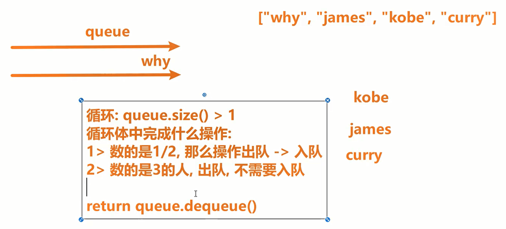
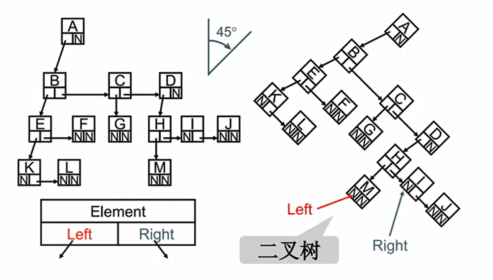
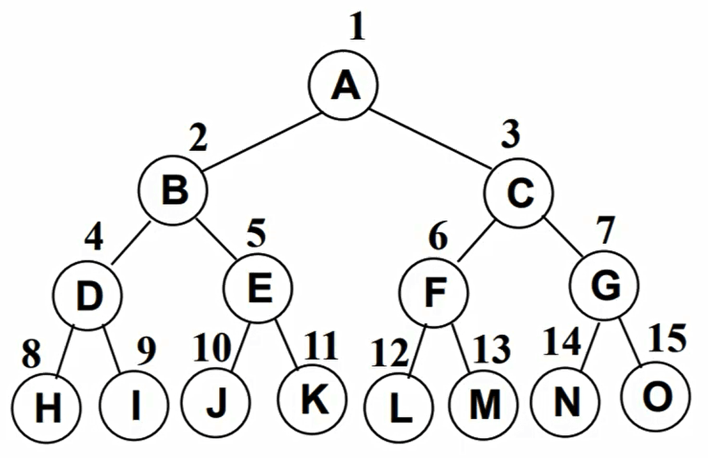
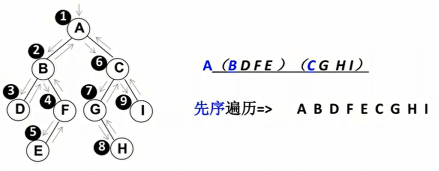
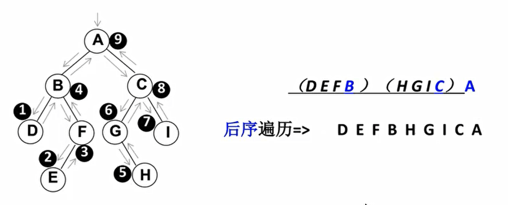
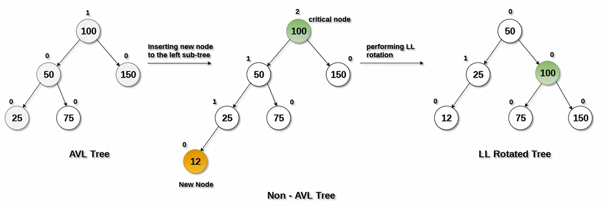
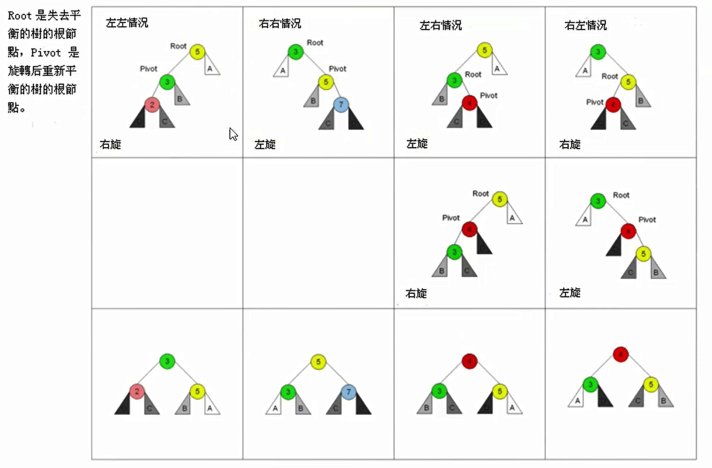
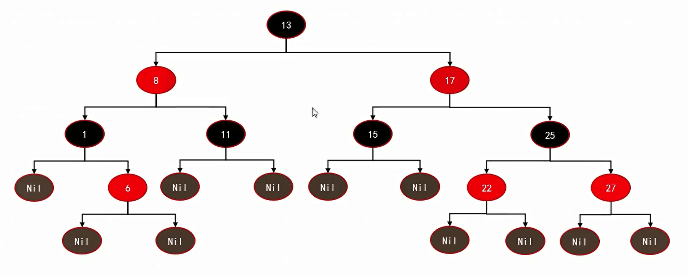
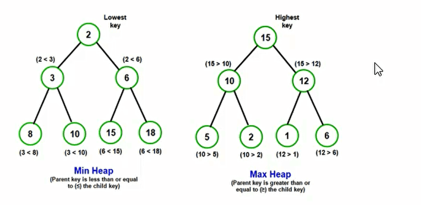

## 数据结构

数据结构是计算机科学中用于组织和存储数据的方式。它定义了数据的组织方式、访问方法和操作规则，使得数据能够高效地被使用和管理。

常见的数据结构包括：

1. 数组（Array）：将元素按照顺序存储在连续的内存空间中。
2. 链表（Linked List）：通过节点之间的指针链接起来的数据元素。
3. 栈（Stack）：遵循后进先出（LIFO）原则的数据结构。
4. 队列（Queue）：遵循先进先出（FIFO）原则的数据结构。
5. 树（Tree）：由节点和边组成的层次结构，如二叉树、AVL树、红黑树等。
6. 图（Graph）：由节点和边组成的非线性数据结构。
7. 哈希表（Hash Table）：通过哈希函数将键映射到存储位置的数据结构。


## 复杂度

### 时间复杂度

时间复杂度是衡量算法执行时间随输入规模增长而增加的度量。它用于分析算法的效率和性能。时间复杂度描述的是算法运行时间与输入规模之间的关系，通常用大O符号（O）表示。

在时间复杂度中，常见的几种表示方式有：

1. 常数时间复杂度（O(1)）：无论输入规模的大小，算法的执行时间都保持不变。例如，访问数组中的一个元素。
2. 线性时间复杂度（O(n)）：算法的执行时间与输入规模成线性关系。例如，对一个包含 n 个元素的数组进行遍历。
3. 对数时间复杂度（O(log n)）：算法的执行时间随着输入规模的增大而增长，但增长速度逐渐减慢。例如，二分查找算法。
4. 平方时间复杂度（O(n^2^)）：算法的执行时间与输入规模的平方成正比。例如，嵌套循环遍历一个二维数组。
5. 时间复杂度为O(n log n)：表示算法的执行时间随着输入规模n的增加而以n log n的速度增长。这种时间复杂度通常出现在分治算法、排序算法和某些二叉树操作等情况下。典型的算法有归并排序（Merge Sort）和快速排序（Quick Sort）。

还有其他更高级的时间复杂度表示方式，如指数时间复杂度（O(2^n^)）和阶乘时间复杂度（O(n!)），它们的增长速度更快，效率更低。

通过分析算法的时间复杂度，可以评估算法的执行效率和性能，选择更优的算法来解决问题。一般情况下，我们希望选择时间复杂度较低的算法，以获得更高效的计算结果。


### 空间复杂度

空间复杂度是衡量算法在执行过程中所需的额外空间或内存资源的度量。它描述的是算法所需的额外空间与输入规模之间的关系。

在计算空间复杂度时，通常考虑算法使用的额外空间，而不考虑输入数据所占用的空间。空间复杂度可以用大O符号（O）来表示。

常见的空间复杂度表示方式有：

1. 常数空间复杂度（O(1)）：算法所需的额外空间是固定的，与输入规模无关。例如，只需要几个变量来存储中间结果。
2. 线性空间复杂度（O(n)）：算法所需的额外空间随输入规模线性增长。例如，需要创建一个与输入规模相等的数组来存储数据。
3. 对数空间复杂度（O(log n)）：算法所需的额外空间随输入规模的增加而增长，但增长速度逐渐减慢。
4. 平方空间复杂度（O(n^2^)）：算法所需的额外空间与输入规模的平方成正比。例如，需要创建一个二维数组来存储矩阵。

除了以上表示方式外，还有其他更高级的空间复杂度表示方式，如指数空间复杂度（O(2^n)）和阶乘空间复杂度（O(n!)），它们的空间需求随着输入规模的增加呈指数或阶乘增长。

通过分析算法的空间复杂度，可以评估算法所需的内存资源使用情况，选择更合适的算法来解决问题。一般情况下，我们希望选择空间复杂度较低的算法，以节省内存资源并提高算法的效率。


## 数组

常见的线性结构

- 数组结构
- 栈结构
- 队列结构
- 链表结构


## 栈

### 认识栈结构


### 栈结构的实现

栈常见有哪些操作呢?

- push(element)：添加一个新元素到栈顶位置。
- pop()：移除栈顶的元素，同时返回被移除的元素。
- peek()：返回栈顶的元素，不对栈做任何修改（这个方法不会移除栈顶的元素，仅仅返回它)。
- isEmpty()：如果栈里没有任何元素就返回true，否则返回false。
- size()：返回栈里的元素个数。这个方法和数组的length属性很类似。


**基于数组来实现**

```js
// 封装一个栈 ：基于数组进行封装
class ArrayStack {
    // 定义私有属性
    #data = []

    // 实现栈的方法

    // 将一个元素压入栈中
    push(e){
        this.#data.push(e)
    }

    // 移除栈，并将数据返回
    pop(){
        return this.#data.pop()
    }

    // 查找栈顶元素
    peek(){
        return this.#data[this.#data.length - 1]
    }

    // 查看栈中是否有元素
    isEmpty(){
        return this.#data.length === 0
    }

    //返回栈数据个数
    size(){
        return this.#data.length
    }

}
```


### 面试题

#### 十进制转二进制

```js
function foo(num){
    // 实现的上述的new
    const stack = new ArrayStack()
    let str = ''

    while(num > 0){
        stack.push(num % 2)
        num = Math.floor(num/2)
    }
    
    while(!stack.isEmpty()){
        str += stack.pop()
    }

    return str
}
console.log(foo(35));
```


#### 有效括号

- 给定一个只包括 '('，')'，'{'，'}'，'['，']' 的字符串 s ，判断字符串是否有效。

- 有效字符串需满足

  - 左括号必须用相同类型的右括号闭合

  - 左括号必须以正确的顺序闭合

  - 每个右括号都有一个对应的相同类型的左括号

- 链接：https://leetcode.cn/problems/valid-parentheses

```js
function foo(str){
    const stack = new ArrayStack()
    

    for (const item of str) {
        switch (item) {
            case '(':
                stack.push(')')
                break;

            case '[':
                stack.push(']')
                break;

            case '{':
                stack.push('}')
                break;
        
            default:
                if( item !== stack.pop() ) return false
                break;
        }
    }

    return stack.isEmpty()

}
```


## 队

### 认识队结构


### 队结构的实现

对常见有哪些操作呢?

- enqueue(element)：向队列尾部添加一个(或多个）新的项。
- dequeue()：移除队列的第一(即排在队列最前面的)项，并返回被移除的元素。
- front/peek()：返回队列中第一个元素——最先被添加，也将是最先被移除的元素。
- isEmpty()：如果队里没有任何元素就返回true，否则返回false。
- size()：返回队里的元素个数。这个方法和数组的length属性很类似。

```js
// 封装一个队 ：基于数组进行封装
class ArrayQueue {
    // 定义私有属性
    #data = []

    // 实现队的方法

    // 将一个元素入队
    enqueue(e){
        this.#data.push(e)
    }

    // 出队，并将数据返回
    dequeue(){
        return this.#data.shift()
    }

    // 查找队顶元素
    front(){
        return this.#data[this.#data.length - 1]
    }

    // 查看队中是否有元素
    isEmpty(){
        return this.#data.length === 0
    }

    //返回队数据个数
    size(){
        return this.#data.length
    }

}
```


### 面试题

#### 击鼓传花

几个朋友一起玩一个游戏，围成一圈，开始数数，数到某个数字的人自动淘汰。最后剩下的这个人会获得胜利，请问 最后剩下的是原来在哪一个位置上的人/最后一个人的名字?



```js
function foo(arr, num){

    if(arr.length === 0) return 

    const stack = new ArrayQueue()

    for (const item of arr) {
        stack.enqueue(item)
    }

    while( stack.size() !== 1 ){
        // 以num 3举例，1、2入队。这里要从1开始，1.2入队
        for (let i = 1; i < num; i++) {
            stack.enqueue(stack.dequeue())
        }
        // 3 出队
        stack.dequeue()
    }

    // return stack.front()
    // 返回名字
    return stack.dequeue()
    // 返回在原数组中的位置
    return arr.indexOf(stack.dequeue())
}

console.log(foo(['a','b','c','d'],3));
```


### 双端队列

队列(Queue)结构，它是一种受限的线性结构，并且限制非常的严格。

双端队列在单向队列的基础上解除了一部分限制:允许在队列的两端添加（入队）和删除（出队）元素。


```js
// 首先我们先继承我的队结构
class ArrayDeque extands ArrayQueue{
    // 队结构是尾进头出，我们要增加上尾出头进
    addFront(value){
        this.data.unshift(value)
    }
    
    removeBack(){
		this.data.pop()
    }
}
```


### 优先级队列

优先级队列(Priority Queue)是一种比普通队列更加高效的数据结构。

- 它每次出队的元素都是具有最高优先级的，可以理解为元素按照关键字进行排序。
- 优先级队列可以用数组、链表等数据结构来实现，但是堆是最常用的实现方式。


## 链表

### 认识链表

- 不同于数组，链表中的元素在内存中不必是连续的空间。链表的每个元素由一个存储元素本身的节点和一个指向下一个元素的引用(有些语言称为指针或者链接)组成。
- 相对于数组，链表有一些优点:
  - 内存空间不是必须连续的。
  - 可以充分利用计算机的内存，实现灵活的内存动态管理。链表不必在创建时就确定大小，并且大小可以无限的延伸下去。
  - 链表在插入和删除数据时，时间复杂度可以达到O(1)。相对数组效率高很多。
- 相对于数组，链表有一些缺点:
  - 链表访问任何一个位置的元素时，都需要从头开始访问。(无法跳过第一个元素访问任何一个元素)。
  - 无法通过下标直接访问元素，需要从头一个个访问，直到找到对应的元素。


### 链表的实现

链表中应该有哪些常见的操作？

- append(element)：向链表尾部添加一个新的项
- traverse()：遍历数组
- insert(position,element)：向链表的特定位置插入一个新的项。
- get(position)：获取对应位置的元素
- indexOf(element)：返回元素在链表中的索引。如果链表中没有该元素则返回-1。
- update(position，element)：修改某个位置的元素
- removeAt(position)：从链表的特定位置移除一项。
- isEmpty()：如果链表中不包含任何元素，返回true，如果链表长度大于0则返回false。
- remove(value)：给值删除链表中所有相同的值

```js
// 我们首先需要创建两个类，一个是每一个node的类，还有一个统一去管理这些节点的类

// 创建Node节点类
class Node{
    constructor(value){
        // 创建的时候传入初始化值
        this.value = value
    }

    next = null
}

// 创建LinkList的类
class LinkList{

    // 注意事项：
        // 1. 我们在下述的this.head就是指向第一个节点，因为我们创建的时候就是这样赋值的
        // 2. 下标0也是指向第一个节点的
        // 3. 判断一个节点有没有值直接判断 ‘newNode’ 即可，不用 newNode.value
    	// 4. 所有的计数都是从 0 -> length-1
        
    head = null
    #size = 0

    // 向链表尾部添加节点。两种情况：链表本身为空 和 链表本身不为空
    append(value){
        // 1. 首先我们都是要根据value值先创建一个新的node节点
        const newNode = new Node(value)
        // 2. 在这里我们要分情况了
            // 2.1 链表本身为空
        if(!this.head){
            this.head = newNode 
        }else{
            // 2.2 链表本身不为空：我们要找到最后一个节点，将最后一个节点的next值指向新的节点

            // 我们使用一个新的值，一开始他是指向头结点的，我们判断他的指向的那个的next有没有值，
                // 有就指向下一个，没有就说明这个节点是最后一个
            let current = this.head
            while(current.next){
                current = current.next
            }
            
            // 经过while循环之后，现在的current.next一定为null的
            current.next = newNode
        }
        // 链表数量+1
        this.#size++
    }

    // 遍历列表, 返回所有的数据
    traverse(){
        let arr = []
        let current = this.head
        // 这里我们是判断current是不是有值 current.next 是判断他的下一个naxt是否为空
        while(current){
            arr.push(current.value)
            current = current.next
        }
        return arr
    }

    // 插入方法
    insert(value, position){
        // 先判断范围
        if(position < 0 || position > this.#size ) return false

        const newNode = new Node(value)
        // 分情况：直接插入头部 和 中间插入

        if( position === 0){
            newNode.next = this.head
            this.head = newNode
        }else{
            // 双指针法
            let current = this.head
            let previous = null
            let index = 0//head位置是0
            while(index++ < position){
                // 顺序不能错
                previous = current  //获取前一个位置
                current = current.next// 当前位置
            }
            // index 等于 position，newNode指向后一个，前一个指向newNode
            newNode.next = current
            previous.next = newNode
        }

        this.#size++

        return true
    }

    // 根据删除位置节点
    removeAt(position){
        // 先判断范围：删除不能删尾巴（.）
        if(position < 0 || position >= this.#size) return null

        // 在这里定义是为了拿到我们删除的值
        let current = this.head
        if(position === 0){
            this.head = current?.next ?? null
        }else{
            // 与insert方法类似，insert是  previous 指向 current 
            //  removeAt  previous.next 指向 current.next
            let previous = null
            let index = 0//head位置是0
            while(index < position){
                index++
                previous = current  //获取前一个位置
                current = current.next// 当前位置
            }
            // index 等于 position,后面一个指向前面的那个的前面
            // 这里要加判断，因为可能会到最后一个节点
            previous.next = current?.next ?? null
        }

        this.#size--

        // 返回删除的值
        return current.value ?? null
    }

    // 根据位置获取元素节点
    get(position){
        if(position < 0 || position >= this.#size ) return false

        // 查找元素返回
        let index = 0
        let current = this.head
        while(index < position){
            index++
            current = current.next
        }

        // index = position
        return current?.value ?? null

    }

    //给出位置修改这个位置上节点
    update(value, position){
        console.log(this.#size);
        if(position < 0 || position >= this.#size) return false

        // 查找元素返回
        let index = 0
        let current = this.head
        while(index < position){
            index++
            current = current.next
        }

        current.value = value

        return true

    }

    //根据值，获取你所在位置的索引
    indexOf(value){

        let current = this.head
        let index = 0
        while(current){
            if(current.value === value){
                return index
            }
            index++
            current = current.next
        }

        // 找不到
        return -1
    }

    // 判断是否为空
    isEmpty(){
        return this.#size === 0
    }
    
    // 给元素值删除元素，没有用双指针，核心是当前值的下一个值与value进行对比
    // 还有别的虚拟指针、双指针、递归法
   remove(value){
        while( this.head && this.head.value === value ){
            this.head = this.head.next
        }
        let current = this.head
        while(current){
            if( current.next &&  current.next.value === value ){
                current.next = current.next.next
            }else{
                current = current.next
            }
        }

        this.#size--

    }
    
    // 双指针法完成remove
    remove(value){

        if( !this.head ) return false
        
        while( this.head && this.head.value == value ){
            this.head = this.head.next
        }

        let current = this.head
        let pre = null
        while(current){
            if( current.value == value ){
                pre.next = current.next
            }else{
                pre = current
               
            }
            current = current.next
        }

        this.size--
    }

}
```


### 面试题

#### 删除node节点

[237. 删除链表中的节点 - 力扣（Leetcode）](https://leetcode.cn/problems/delete-node-in-a-linked-list/)


```js
// 其思路就是，我们把这个1的这个值给5，然后删除原来1位置的那个节点
var deleteNode = function(node) { 
    node.val = node.next.val
    node.next = node.next.next
};
```


#### 反转链表

[206. 反转链表 - 力扣（LeetCode）](https://leetcode.cn/problems/reverse-linked-list/)

**栈的思路**

```js
var reverseList = function(head) {
    // 当我们的链表没有节点或只有一个节点的时候，可以直接返回
    if(head === null || head.next === null) return head
    // 用数组来模拟战
    let arr = []
    let current = head
    while(current){
        arr.push(current)
        current = current.next
    }

    // 创建一个新的head
    const newHead = arr.pop()
    let newHeadCurrent = newHead
    while(arr.length){
        let node = arr.pop()
        // 上一个出来的指向刚出来的
        newHeadCurrent.next = node
        //往下走
        newHeadCurrent = newHeadCurrent.next
    }
	
    // 注意一定要将最后一个newHeadCurrent的next设置为null
    newHeadCurrent.next = null

    return newHead

};
```


非递归(**循环**)的思路


解题步骤：

- 将current指向下一个节点
- 将当前节点指向newHead【对于第一个节点来说newHead就是null，对于其他节点来说newHead就是前一个】
- 将newHead指向当前的元素【对于第一个节点来说，当前节点就是head指的，对于其他节点来说，我们有第四步，将head指向下一个，目的为了在下一次遍历的时候，下一个节点可以指向前一个节点】
- 将head指向下一个节点，也就是current 

```js
var reverseList = function(head) {
    // 当我们的链表没有节点或只有一个节点的时候，可以直接返回
    if(head === null || head.next === null) return head
    
    let newHead = null
    
    // 当head为null的时候，整个链表就反转过来了
    while(head){
        // 第一步
        let current = head.next
        // 第二步
        head.next = newHead
        // 为什么后面两步没有next？对于newHead、head、current，他们就是一个指向，类似与node.next
        // 第三步
        newHead = head
        // 第四步
        head = current
    }

    return newHead

};
```


**递归的思路**

```js
var reverseList = function(head) {
   // 递归结束条件
   if(head === null || head.next === null) return head

    // 在这个位置执行的代码是在递归前执行的代码

    const newHead = reverseList(head.next)  //  每一次递归结束返回的newHead就是上面的那个head

    // 在这个位置执行的代码是在递归后执行的代码

    // 在这里我们要理解，来到这个head是谁
    // 第一次来到这个的时候，head是倒数第二个节点，因为倒数第一个直接返回head了
    // 这个时候我们需要将倒数第一个指向倒数第二个,并将倒数第二个指针设为空
    head.next.next = head
    head.next = null

    return newHead
};
```


## 哈希表

### 认识哈希表

- 哈希表通常是基于数组进行实现的，但是相对于数组，它也很多的优势:
  - 它可以提供非常快速的 插入-删除-查找 操作;
  - 无论多少数据，插入和删除值都接近常量的时间:即O(1)的时间复杂度。实际上，只需要几个机器指令即可完成;
  - 哈希表的速度比树还要快，基本可以瞬间查找到想要的元素;
  - 哈希表相对于树来说编码要容易很多;
- 哈希表相对于数组的一些不足:
  - 哈希表中的数据是没有顺序的，所以不能以一种固定的方式(比如从小到大)来遍历其中的元素(没有特殊处理情况下)。
  - 通常情况下，哈希表中的key是不允许重复的，不能放置相同的key，用于保存不同的元素。


### 哈希函数的实现

```js
/**
 * 目的是传入一个字符串的时候，映射出一个索引值
 * @param {*} str ：传入字符串
 * @param {*} maxLength ：数组最大长度，且其取值尽量为质数
 */
function hashFunction(str, maxLength){
    // 1.计算hashcode
    let hashCode = 0
    const length = str.length
    for (let i = 0; i < length; i++) {
        // 使用霍纳法则来计算code
        // 31自己定义的
        hashCode = 31 * hashCode + str.charCodeAt(i)
    }

    // 2. 求出索引值
    return hashCode % maxLength
    
}
```


## 树

### 认识树

**普通表示方法**


**儿子-兄弟表示法**





### 二叉树

#### 概念

- 特点：树中的每个节点最多只能有两个子节点

- 定义：
  - 二叉树可以为空，也就是没有节点
  - 若不为空，则它是由根节点和称其 ==左子树TL== 和 ==右子树TR== 的两个不相交的二叉树组成
- 二叉树五种形态：
- 二叉树几个较重要的特性：
  - 一颗二叉树 ==第i层的最大节点数== 为：2^(i-1)^
  - 深度==为k的二叉树最大节点总数==为：2^k^ - 1
  - 对==任何非空二叉树T==，若n0表示叶节点的个数、n2是度为2的非叶节点个数，那么两者满足关系n0 = n2+1。


#### 完美二叉树

完美二叉树，也称为满二叉树。在二叉树中，除了最下一层的叶节点外，每层节点都有2个子节点，就构成了满二叉树。



#### 完全二叉树

- 除二叉树最后一层外，其他各层的节点数都达到最大个数。
- 且最后一层从左向右的叶节点连续存在，只缺右侧若干节点。
- 完美二叉树是特殊的完全二叉树。


#### 二叉搜索树

- 二叉搜索树是一颗二叉树，可以为空
- 如果不为空，满足下面性质
  - 非空左子树的所有键值小于其根节点的键值。
  - 非空右子树的所有键值大于其根节点的键值。
  - 左、右子树本身也都是二叉搜索树。
- 二叉搜索树的特点：
  - 二叉搜索树的特点就是相对==较小的值==总是保存在==左节点==上。相对==较大的值==总是保存在==右节点==上。
  - 那么利用这个特点，我们可以做什么事情呢?
  - 查找效率非常高，这也是二叉搜索树中，搜索的来源。


### 二叉搜索树

#### 封装

```js
class treeNode{
    constructor(value){
        this.value = value
    }
    left = null
    right = null
}


class BSTree{
     #root = null
}
```


#### 合集

- 插入操作
  - insert(value)：向树中插入一个新的数据
- 查找操作
  - search(value)：在树中查找一个数据，如果节点存在，则返回true，如果不存在，则返回false
  - min：返回树中的最小的值/数据
  - max：返回树中的最大的值/数据
- 遍历操作
  - inOrderTraverse：通过中序遍历方式遍历所有的节点
  - preOrderTraverse：通过先序遍历方式遍历所有的节点
  - postOrderTraverse：通过后序遍历方式遍历所有的节点
  - levelOrderTraverse：通过层序遍历方式遍历所有的节点
- 删除操作（有点复杂）
  - remove(value)：从树中移除某一个数据


#### 插入

```js
//  插入操作
insert(value){
    // 1. 常见节点
    const newNode = new treeNode(value)

    // 2. 分情况：有没有根节点
    if(!this.root){
        // 2.1 空节点
        this.root = newNode
    }else{
        // 2.2 非空节点，由于我们需要不停的进行对比查找，所有可以使用递归的方式
        insertNode(this.root, newNode)
    }

    function insertNode(node, newNode){
        if(newNode.value < node.value){
            // 比根节点小，去左边

            // 来到左边又有两种情况
            if( node.left === null ){
                // node节点左边为空
                node.left = newNode
            }else{
                // node节点左边不为空
                insertNode(node.left, newNode)
            }
        }else{
            // 去右边

            // 来到右边又有两种情况
            if( node.right === null ){
                // node节点右边为空
                node.right = newNode
            }else{
                // node节点右边不为空
                insertNode(node.right, newNode)
            }
        }
    }

}
```


#### 遍历

**先序遍历**



```js
preOrderTraverse(){
    traverseNode(this.root)

    function traverseNode(node){
        if(node){
            console.log(node.value);
            traverseNode(node.left)
            traverseNode(node.right)
        }
    }
}
```


**中序遍历**


```js
// 中序遍历
inOrderTraverse(){
    traverseNode(this.root)

    function traverseNode(node){
        if(node){
            traverseNode(node.left)
            console.log(node.value);
            traverseNode(node.right)
        }
    }
}
```


**后序遍历**



```js
// 后续遍历
postOrderTraverse(){
    traverseNode(this.root)

    function traverseNode(node){
        if(node){
            traverseNode(node.left)
            traverseNode(node.right)
            console.log(node.value);
        }
    }
}
```


**层寻遍历**

经典的递归运用常见


```js
// 层寻遍历
levelOrderTraverse(){
    if( !this.root ) return
    // 使用队列结构

    // 1.创建队列并加入第一个节点
    const queue = [this.root]

    // 2. 遍历队列中的所有节点让他们依次出队
    while( queue.length ){
        // 2.1 访问节点的过程
        const current = queue.shift()
        console.log(current.value);

        // 2.2 将左子节点放入队列中
        if( current.left ){
            queue.push(current.left)
        }

        // 2.3 将右子节点放入队列中
        if( current.right ){
            queue.push(current.right)
        }

    }
}
```


#### 查找

**最大值和最小值**

```js
max(){
    let current = this.root
    while( current && current.right ){
        current = current.right
    }

    // 可能根节点为空
    return current.value ?? null
}

min(){
    let current = this.root
    while( current && current.left ){
        current = current.left
    }

    // 可能根节点为空
    return current.value ?? null
}
```


**查找特定值**

```js
// 查找特定值
search(value){
    let current = this.root
    while( current ){
        if( current.value === value ) return true

        if( current.value < value ){
            current = current.right
        }else{
            current = current.left
        }
    }

    return false
}
```


#### 删除

删除节点要从查找要删的节点开始，找到节点后，需要考虑三种情况：

- 该节点是叶节点(没有字节点，比较简单)
- 该节点有一个子节点(也相对简单)
- 该节点有两个子节点(情况比较复杂）


#### 全部操作

```js
class treeNode{
    constructor(value){
        this.value = value
    }
    left = null
    right = null
}


class BSTree{
    root = null

    //  插入操作
    insert(value){
        // 1. 常见节点
        const newNode = new treeNode(value)

        // 2. 分情况：有没有根节点
        if(!this.root){
            // 2.1 空节点
            this.root = newNode
        }else{
            // 2.2 非空节点，由于我们需要不停的进行对比查找，所有可以使用递归的方式
             insertNode(this.root, newNode)
        }

        function insertNode(node, newNode){
            if(newNode.value < node.value){
                // 比根节点小，去左边
    
                // 来到左边又有两种情况
                if( node.left === null ){
                    // node节点左边为空
                    node.left = newNode
                }else{
                    // node节点左边不为空
                    insertNode(node.left, newNode)
                }
            }else{
                // 去右边
    
                // 来到右边又有两种情况
                if( node.right === null ){
                    // node节点右边为空
                    node.right = newNode
                }else{
                    // node节点右边不为空
                    insertNode(node.right, newNode)
                }
            }
        }

    }

    // 先序遍历
    preOrderTraverse(){
        traverseNode(this.root)
        
        function traverseNode(node){
            if(node){
                console.log(node.value);
                traverseNode(node.left)
                traverseNode(node.right)
            }
        }
    }

    // 中序遍历
    inOrderTraverse(){
        traverseNode(this.root)
        
        function traverseNode(node){
            if(node){
                traverseNode(node.left)
                console.log(node.value);
                traverseNode(node.right)
            }
        }
    }

    // 后续遍历
    postOrderTraverse(){
        traverseNode(this.root)
        
        function traverseNode(node){
            if(node){
                traverseNode(node.left)
                traverseNode(node.right)
                console.log(node.value);
            }
        }
    }

    // 层寻遍历
    levelOrderTraverse(){
        if( !this.root ) return
        // 使用队列结构

        // 1.创建队列并加入第一个节点
        const queue = [this.root]

        // 2. 遍历队列中的所有节点让他们依次出队
        while( queue.length ){
            // 2.1 访问节点的过程
            const current = queue.shift()
            console.log(current.value);

            // 2.2 将左子节点放入队列中
            if( current.left ){
                queue.push(current.left)
            }

            // 2.3 将右子节点放入队列中
            if( current.right ){
                queue.push(current.right)
            }

        }
        
    }

    //查找最大值
    max(){
        let current = this.root
        while( current && current.right ){
            current = current.right
        }

        // 可能根节点为空
        return current.value ?? null
    }

    //查找最小值
    min(){
        let current = this.root
        while( current && current.left ){
            current = current.left
        }

        // 可能根节点为空
        return current.value ?? null
    }

    // 查找特定值
    search(value){
        let current = this.root
        while( current ){
            if( current.value === value ) return true

            if( current.value < value ){
                current = current.right
            }else{
                current = current.left
            }
        }

        return false
    }
}
```


### 平衡二叉搜索树

#### 平衡树

- 平衡树(Balanced Tree)是一种特殊的二叉搜索树
  - 其目的是通过一些特殊的技巧来维护树的高度平衡
  - 从而保证树的搜索、插入、删除等操作的时间复杂度都较低
- 为什么需要平衡树呢?
  - 如果一棵树退化成链状结构，那么搜索、插入、删除等操作的时间复杂度就会达到最坏情况，即o(n)，因此不能满足要求。
  - 平衡树通过不断调整树的结构，**使得树的高度尽量平衡，从而保证搜索、插入、删除等操作的时间复杂度都较低**，通常为o(logn)。
  - 因此，如果我们需要高效地处理大量的数据，那么平衡树就显得非常重要了。


#### 如何让树更加平衡

- 方式一：限制插入、删除的节点(比如在树特性的状态下，不允许插入或者删除某些节点，不现实)
- 方式二：在随机插入或者删除元素后，通过某种方式观察树是否平衡，如果不平衡通过特定的方式(比如旋转)，让树保持
  平衡。




#### 常见的平衡二叉搜索树

- **AVL树**：这是一种最早的平衡二叉搜索树，在1962年由G.M.Adelson-velsky和E.M.Landis发明。
- **红黑树**：这是一种比较流行的平衡二叉搜索树，由R.Bayer在1972年发明。
- Splay树：这是一种动态平衡二叉搜索树，通过旋转操作对树进行平衡。
- Treap：这是一种随机化的平衡二叉搜索树，是二叉搜索树和堆的结合。
- B-树：这是一种适用于磁盘或其他外存存储设备的多路平衡查找树。


红黑树和AVL树是应用最广泛的平衡二叉搜索树：

- 红黑树︰红黑树被广泛应用于实现诸如操作系统内核、数据库、编译器等软件中的数据结构，其原因在于它在插入、删除查找操作时都具有较低的时间复杂度。
- AVL树: AVL树被用于实现各种需要高效查询的数据结构，如计算机图形学、数学计算和计算机科学研究中的一些特定算法


### AVL树

#### 认识AVL树

- 它是一种 **自平衡二叉搜索树**（自平衡就是他不需要借助别的东西来保持平衡，自己就可以）
- 它是二叉搜索树的一个变体，在保证二叉搜索树性质的同时，通过**旋转操作保证树的平衡**
- 在AVL树中，每个节点都有一个权值，该权值代表了以**该节点为根节点的子树的高度差**。
  - 在AvL树中，**任意节点的权值只有1或-1或0**，因此AVL树也被称为**高度平衡树**。
  - 对于每个节点，它的左子树和右子树的高度差不超过1。
  - 这使得AVL树具有比普通的二叉搜索树更高的查询效率。
  - 当插入或删除节点时，AVL树可以通过旋转操作来重新平衡树，从而保证其平衡性。


- AVL树的插入和删除操作与普通的二叉搜索树类似，但是在插入或者删除之后，需要继续保持树的平衡。
  - AVL树需要**通过旋转操作来维护平衡**。
  - 有四种情况旋转操作：**左左情况、右右情况、左右情况和右左情况双旋**。
  - 具体使用哪一种旋转，要根据不同的情况来进行区分和判断。

- 因为AVL树具有自平衡性，因此最坏的情况下时间复杂度仅（logn）



####  学习步骤

- 步骤一：学习AVL树节点的封装
- 步骤二：学习AVL树的旋转的代码实现
- 步骤三：写出不同情况下进行的不同旋转操作
- 步骤四：写出插入操作后，树的再平衡操作
- 步骤五：写出删除操作后，树的再平衡操作


#### AVL树节点的封装

```js
class AVLTreeNode{
    constructor(value){
        this.value = value
    }
    left = null
    right = null
    parent = null

    // 我们这里默认根节点为1
    height = 1

    // 判断当前节点是父节点的左子节点
    isLeft(){
        return !!( this.parent && this.parent.left === this )
    }
    // 判断当前节点是父节点的右子节点
    isRight(){
        return !!( this.parent && this.parent.right === this )
    }

    // 获取每个节点的高度
    getHeight(){
        const leftHeight = this.left ? this.left.getHeight() : 0
        const rightHeight = this.right ? this.right.getHeight() : 0

        return Math.max(leftHeight, rightHeight) + 1
    }

    // 获取权重：平衡因子 ( 左高度 - 右高度 = 1 || 0 || -1 )
    getBalance(){
        const leftHeight = this.left ? this.left.getHeight() : 0
        const rightHeight = this.right ? this.right.getHeight() : 0

        return leftHeight - rightHeight
    }

    // 直接判断当前节点是否平衡
    isBalance(){
        const factor = this.getBalance()
        if( factor === 1 || factor === 0 || factor === -1 ) return true
        else return false
    }

    // 获取更高的子节点(用来获取轴心 pivot)
    heightChild(){
        const leftHeight = this.left ? this.left.getHeight() : 0
        const rightHeight = this.right ? this.right.getHeight() : 0

        if(leftHeight > rightHeight) return this.left
        if(leftHeight < rightHeight) return this.right
        // 两个相等的情况基本上不会来到这里，因为只有不平衡才会来到这里
        return this.left ? this.left : this.right
    }

}
```


#### 右旋转

**我们的核心是关注不平衡的节点**

 **思路**


**代码实现**

```js
// 右旋转
rightRotation(){
    // 事先判断不平衡点是父节点的左边还是右边
    const isLeft = this.isLeft
    const isRight = this.isRight

    // 1. 处理pivot
    // 这个this是我们调用的时候，那个节点
    const pivot = this.left
    pivot.parent = this.parent

    // 2. 处理pivot的right
    this.left = pivot.right
    // 改变他的父节点
    if(pivot.right) pivot.right.parent = this

    // 3. 处理this(类似于根节点)
    pivot.right = this
    this.parent = pivot

    // 4. 挂载pivot
    if(!pivot.parent){ // pivot直接作为tree的根
        return pivot
    }
    if(isLeft){ // pivot作为父节点的左子节点
        pivot.parent.left = pivot
    }
    if(isRight){ // pivot作为父节点的右子节点
        pivot.parent.right = pivot
    }

    return pivot
}
```


#### 左旋转

```js
// 左旋转
leftRotation(){
    // 事先判断不平衡点是父节点的左边还是右边
    const isLeft = this.isLeft
    const isRight = this.isRight

    // 1. 处理pivot
    // 这个this是我们调用的时候，那个节点
    const pivot = this.right
    pivot.parent = this.parent

    // 2. 处理pivot的right
    this.right = pivot.left
    // 改变他的父节点
    if(pivot.left) pivot.left.parent = this

    // 3. 处理this(类似于根节点)
    pivot.left = this
    this.parent = pivot

    // 4. 挂载pivot
    if(!pivot.parent){ // pivot直接作为tree的根
        return pivot
    }
    if(isLeft){ // pivot作为父节点的左子节点
        pivot.parent.left = pivot
    }
    if(isRight){ // pivot作为父节点的右子节点
        pivot.parent.right = pivot
    }

    return pivot
}
```


#### AVL树的封装


### 红黑树

#### 了解红黑树

红黑树（英语: Red-black tree)是一种自平衡二叉查找树，是在计算机科学中用到的一种数据结构。

红黑树,除了符合二叉搜索树的基本规则外,还添加了一下特性

1. 节点是红色或黑色。
2. 根节点是黑色。
3. 每个叶子节点都是黑色的空节点(NIL节点，空节点)。
   - 第三条性质要求每个叶节点(空节点）是黑色的
   - 这是因为在红黑树中，黑色节点的数量表示从根节点到叶子节点的黑色节点数量。
4. 每个红色节点的两个子节点都是黑色。(从每个叶子到根的所有路径上不能有两个连续的红色节点)
   - 第四条性质保证了红色节点的颜色不会影响树的平衡，同时保证了红色节点的出现不会导致连续的红色节点
5. 从任一节点到其每个叶子的所有路径都包含相同数目的黑色节点。
   - 第五条性质是最重要的性质，保证了红黑树的平衡性。



#### 红黑树的相对平衡

- 前面的性质约束，确保了红黑树的关键特性:
  - 从根到叶子的最长可能路径,不会超过最短可能路径的两倍长。
  - **结果就是这个树基本是平衡的**
  - 虽然没有做到绝对的平衡，但是可以保证在最坏的情况下，依然是高效的。
- 为什么可以做到最长路径不超过最短路径的两倍呢?
  - 性质五决定了最短路径和最长路径必须有相同的黑色节点
  - 路径最短的情况:全部是黑色节点n
  - 路径最长的情况:黑色节点的数量也是n，中间全部是红色节点n-1
    - 性质二:根节点是黑节点;
    - 性质三:叶子节点都是黑节点
    - 性质四:两个红色节点不能相连
  - 最短路径为n-1(边的数量);
  - 最长路径为(n +n-1) - 1 = 2n - 2
  - **所以最长路径一定不超过最短路径的2倍**


### AVL树和红黑树对比

- AVL树是一种平衡度更高的二叉搜索树，所以在**搜索效率上会更高**
- 但是AVL树为了维护这种平衡性，在**插入和删除操作**时，通常会进行更多的旋转操作，所以效率相对**红黑树较低**
- **红黑树**在平衡度上相较于AVL树没有那么严格，所以**搜索效率上会低一些**
- 但是**红黑树在插入和删除操作**时，通常需要更少的旋转操作，所以**效率相对AVL树较高**
- 它们的搜索、添加、删除时间复杂度都是O(logn)，但是细节上会有一些差异

总结：

- 插入、删除上红黑树的效率较高一点（因为红黑树的平衡度上没有AVL树那么严格）
- 搜索上AVL树效率更高


## 堆

### 认识堆结构

- 堆是也是一种非常常见的数据结构，但是相对于前面的数据结构来说，要稍微难理解一点。
- 堆的本质是一种特殊的树形数据结构，使用**完全二叉树**来实现（**是完全二叉树不是二插搜索树**）
  - 堆可以进行很多分类，但是平时使用的**基本都是二叉堆**
  - 二叉堆又可以划分为最大堆和最小堆
- 最大堆和最小堆:
  - 最小堆：堆中每一个节点都小于等于 (<=) 它的子节点
  - 最大堆：堆中每一个节点都大于等于 (>=) 它的子节点



- 但是这个堆东西有什么意义呢?
  - 对于每一个新的数据结构，我们都需要搞清楚为什么需要它，这是我们能够记住并且把握它的关键。
  - 它到底帮助我们解决了什么问题?
- 如果有一个集合，我们希望获取其中的最大值或者最小值，有哪些方案呢?
  - 数组/链表:获取最大或最小值是o(n)级别的;
    - 可以进行排序，但是我们只是获取最大值或者最小值而已
    - 排序本身就会消耗性能;
  - 哈希表:不需要考虑了
  - 二叉搜索树:获取最大或最小值是o(logn)级别的。但是二叉搜索树操作较为复杂，并且还要维护树的平衡时才是o(logn)级别
- 这个时候需要一种数据结构来解决这个问题，就是**堆结构**。

- 但是我们还是不知道具体长什么样子，以及它是如何实现出来的
  - 二叉堆用树形结构表示出来是一颗完全二叉树
  - 通常在实现的时候我们底层会使用数组来实现
- 每个节点在数组中对应的索引i(index)有如下的规律
  - 如果i=0，它是根节点
  - 父节点的公式：floor(i/2-1)
  - 左子节点：2i+ 1
  - 右子节点：2i+2


### 堆结构的实现

#### 实现方法

- 常见的属性:
  - data:存储堆中的元素，通常使用数组来实现。
  - size:堆中当前元素的数量。
- 常见的方法:
  - insert(value):在堆中插入一个新元素。
  - extract/delete():从堆中 删除/提取 最大/最小 元素。
  - peek():返回堆中的最大/最小元素。
  - isEmpty():判断堆是否为空。
  - build_heap(list)：通过一个列表来构造堆。
  - size：返回数据长度

**这里我们实现的是最大堆**

**我们的所有操作都是以数组的形式来展示的**


#### 简单方法

```js
class Heap{
    data = []
    length = 0

    peek(){
        return this.data[0] || undefined
    }

    size(){
        return this.length
    }

    isEmpty(){
        return this.length === 0
    }  
}
```


#### 插入

因为每次插入元素后，都需要对堆进行重构，以维护最大堆的性质、这种策略叫做**上滤**

**插入的步骤**：

数组中没有元素：直接放在第一个（其实就是直接push到尾部）

数组中有元素

- 先将元素插入到数组最后

- 再进行上滤操作（固定步骤）

  - 将新元素和父元素进行比较
  - 新元素的索引位置：index = length - 1
  - 父元素的索引位置：floor( index / 2 - 1 )
  - 进行比较操作
    - 新元素 <= 父元素，直接break
    - 新元素 > 父元素，直接交换。交换完之后将索引改为父元素的索引

  - 进行下一次循环操作
  - （结束循环条件：index <= 0）

```js
//插入
insert(value){
    this.data.push(value)
    this.length++
    let i = this.length - 1
    // 上滤操作
    while(i > 0){
        let j = Math.floor(i / 2 - 1 )
        if( this.data[i] <= this.data[j] ){
            break;
        }else{
            this.swap(i, j)
            i = j
        }
    }
}
```


#### 删除/提取操作

删除操作也需要考虑在删除元素后的操作：因为每次删除元素后，需要对堆进行重构，以维护最大堆的性质。这种向下替换元素的策略叫作**下滤**(percolate down)。

**基本步骤**

- 去除第一个数（最大值），我们要在最后将其返回出去
- 将最后一个数放到第一个数的位置上。目的是为了保证堆只有一个数不满足最大堆，然后将第一个数进行下滤操作
- 下滤操作：
  - 从index=0开始（第一个数），比较左右子节点，找较大的数，给换上去
  - 没有右节点较大数就是左节点（左节点还没有其实就是我们的while循环结束条件了）
  - 找到较大的数，进行交换，并将那个节点的位置给index
  - 之后进行循环
  - 循环的结束条件就是没有左节点

```js
// 删除 / 提取操作
extract(){
    // 1.去除特殊情况
    if(this.length === 0) return undefined
    if(this.length === 1){
        this.length--
        return this.data.pop()
    }

    // 2.取最大值
    const topValue = this.data[0]
    this.data[0] = this.data.pop()
    this.length--

    // 3.下滤
    // 3.1 定义索引位置
    let index = 0
    // 结束条件：没有左子节点的时候
    while( 2 * index + 1 < this.length ){
        let leftChildIndex = index * 2 + 1
        let rightChildIndex = leftChildIndex + 1
        // 3.2 先让较大的值等于left，因为right可能没有值
        let largerIndex = leftChildIndex
        // 3.3 只有小于的情况才会有右节点     右边比较大的情况， >= 也是可以的，等于也可以交换
        if(rightChildIndex < this.length && this.data[rightChildIndex] > this.data[leftChildIndex]){
            largerIndex = rightChildIndex
        }

        // 3.4 较大的值和index进行比较
        if(this.data[index] >= this.data[largerIndex]){
            break;
        }

        // 3.5 交换位置
        this.swap(index, largerIndex)
        index = largerIndex
    }


    return topValue
}
```


#### 原地建堆

“原地建堆”(In-place heap construction.）是指建立堆的过程中，不使用额外的内存空间，直接在原有数组上进行操作。

```js
// 原地建堆：一个数组不符合堆的顺序，将其原地建堆
buildHeap(list){
    // 1.先直接赋值
    this.data = list
    this.length = list.length

    // 2.根据最大堆的特性，找到第一个非叶子节点的数据，进行下滤操作
    const start = Math.floor( this.length / 2 - 1 )
    for(let i = start; i >= 0; i--){
        // 纯下滤操作
        let index = i
        // 结束条件：没有左子节点的时候
        while( 2 * index + 1 < this.length ){
            let leftChildIndex = index * 2 + 1
            let rightChildIndex = leftChildIndex + 1
            // 3.2 先让较大的值等于left，因为right可能没有值
            let largerIndex = leftChildIndex
            // 3.3 只有小于的情况才会有右节点     右边比较大的情况
            if(rightChildIndex < this.length && this.data[rightChildIndex] > this.data[leftChildIndex]){
                largerIndex = rightChildIndex
            }

            // 3.4 较大的值和index进行比较
            if(this.data[index] >= this.data[largerIndex]){
                break;
            }

            // 3.5 交换位置
            this.swap(index, largerIndex)
            index = largerIndex
        }
    }


}
```


#### 完整代码

```js
class Heap{
    data = []
    length = 0

    // 私有方法，交换i和j位置的值
    swap(i, j){
        const temp = this.data[i]
        this.data[i] = this.data[j]
        this.data[j] = temp
    }

    peek(){
        return this.data[0] || undefined
    }

    size(){
        return this.length
    }

    isEmpty(){
        return this.length === 0
    }


    //插入
    insert(value){
        this.data.push(value)
        this.length++
        let i = this.length - 1
        // 上滤操作
        while(i > 0){
            let j = Math.floor(i / 2 - 1 )
            if( this.data[i] <= this.data[j] ){
                break;
            }else{
                this.swap(i, j)
                i = j
            }
        }
    }

    // 删除 / 提取操作
    extract(){
        // 1.去除特殊情况
        if(this.length === 0) return undefined
        if(this.length === 1){
            this.length--
            return this.data.pop()
        }

        // 2.取最大值
        const topValue = this.data[0]
        this.data[0] = this.data.pop()
        this.length--

        // 3.下滤
        this.x(0)


        return topValue
    }

    // 原地建堆：一个数组不符合堆的顺序，将其原地建堆
    buildHeap(list){
        // 1.先直接赋值
        this.data = list
        this.length = list.length

        // 2.根据最大堆的特性，找到第一个非叶子节点的数据，进行下滤操作
        const start = Math.floor( this.length / 2 - 1 )
        for(let i = start; i >= 0; i--){
            // 纯下滤操作
            this.x(i)
        }


    }

    // 下滤操作
    x(start) {
        let index = start
        // 结束条件：没有左子节点的时候
        while( 2 * index + 1 < this.length ){
            let leftChildIndex = index * 2 + 1
            let rightChildIndex = leftChildIndex + 1
            // 3.2 先让较大的值等于left，因为right可能没有值
            let largerIndex = leftChildIndex
            // 3.3 只有小于的情况才会有右节点     右边比较大的情况
            if(rightChildIndex < this.length && this.data[rightChildIndex] > this.data[leftChildIndex]){
                largerIndex = rightChildIndex
            }

            // 3.4 较大的值和index进行比较
            if(this.data[index] >= this.data[largerIndex]){
                break;
            }

            // 3.5 交换位置
            this.swap(index, largerIndex)
            index = largerIndex
        }
    }
    
}
```


#### 实现最小堆

当我们实现了最大堆的时候，实现最小堆就很简单了

**插入操作：**仅仅和最大堆有一个符号的区别

```js
// 最大堆
if( this.data[i] <= this.data[j] )
    
// 最小堆
if( this.data[i] >= this.data[j] )
```


**删除操作：**

```js
// 最大堆
if(rightChildIndex < this.length && this.data[rightChildIndex] > this.data[leftChildIndex])
if(this.data[index] >= this.data[largerIndex])
    
// 最大堆
if(rightChildIndex < this.length && this.data[rightChildIndex] < this.data[leftChildIndex])
if(this.data[index] <= this.data[largerIndex])
```


**原地建堆：**因为我们原地建堆与删除操作都涉及到了下滤，与删除操作修改一样

