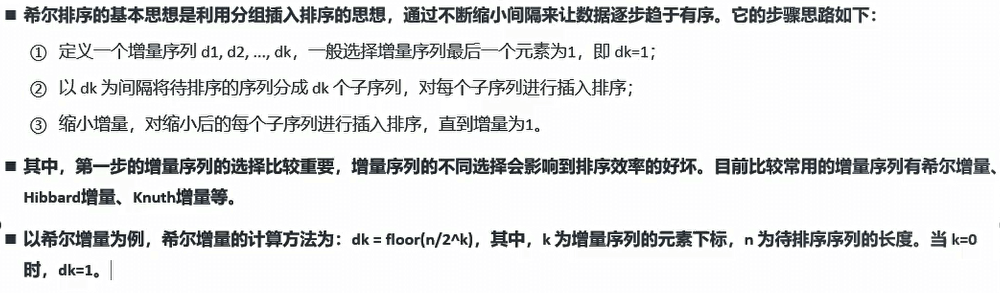
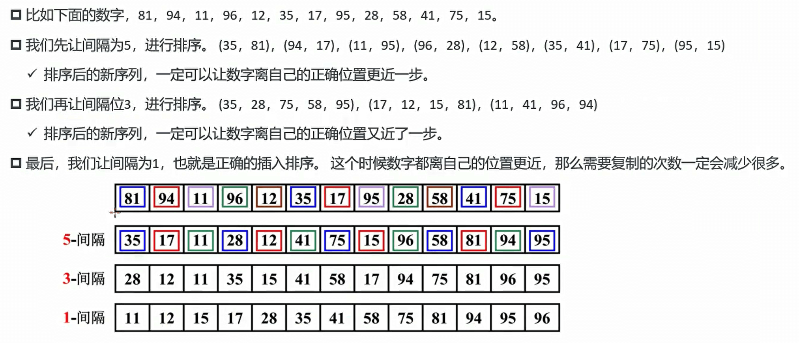

## 算法

算法是解决问题的一系列步骤或操作。它描述了如何进行计算，以及如何使用给定的输入来产生期望的输出。算法可以用于执行各种任务，例如搜索、排序、图像处理、机器学习等。

算法的设计旨在解决特定的问题，其效率通常是评估算法好坏的重要指标之一。常见的算法设计方法包括分治法、动态规划、贪心算法、回溯法等。在选择算法时，需要考虑问题的规模、时间复杂度、空间复杂度、可读性等因素。优秀的算法能够高效地处理大规模的数据，并提供正确和可靠的结果。


## 复杂度

### 时间复杂度

时间复杂度是衡量算法执行时间随输入规模增长而增加的度量。它用于分析算法的效率和性能。时间复杂度描述的是算法运行时间与输入规模之间的关系，通常用大O符号（O）表示。

在时间复杂度中，常见的几种表示方式有：

1. 常数时间复杂度（O(1)）：无论输入规模的大小，算法的执行时间都保持不变。例如，访问数组中的一个元素。
2. 线性时间复杂度（O(n)）：算法的执行时间与输入规模成线性关系。例如，对一个包含 n 个元素的数组进行遍历。
3. 对数时间复杂度（O(log n)）：算法的执行时间随着输入规模的增大而增长，但增长速度逐渐减慢。例如，二分查找算法。
4. 平方时间复杂度（O(n^2^)）：算法的执行时间与输入规模的平方成正比。例如，嵌套循环遍历一个二维数组。
5. 时间复杂度为O(n log n)：表示算法的执行时间随着输入规模n的增加而以n log n的速度增长。这种时间复杂度通常出现在分治算法、排序算法和某些二叉树操作等情况下。典型的算法有归并排序（Merge Sort）和快速排序（Quick Sort）。

还有其他更高级的时间复杂度表示方式，如指数时间复杂度（O(2^n^)）和阶乘时间复杂度（O(n!)），它们的增长速度更快，效率更低。

通过分析算法的时间复杂度，可以评估算法的执行效率和性能，选择更优的算法来解决问题。一般情况下，我们希望选择时间复杂度较低的算法，以获得更高效的计算结果。


### 空间复杂度

空间复杂度是衡量算法在执行过程中所需的额外空间或内存资源的度量。它描述的是算法所需的额外空间与输入规模之间的关系。

在计算空间复杂度时，通常考虑算法使用的额外空间，而不考虑输入数据所占用的空间。空间复杂度可以用大O符号（O）来表示。

常见的空间复杂度表示方式有：

1. 常数空间复杂度（O(1)）：算法所需的额外空间是固定的，与输入规模无关。例如，只需要几个变量来存储中间结果。
2. 线性空间复杂度（O(n)）：算法所需的额外空间随输入规模线性增长。例如，需要创建一个与输入规模相等的数组来存储数据。
3. 对数空间复杂度（O(log n)）：算法所需的额外空间随输入规模的增加而增长，但增长速度逐渐减慢。
4. 平方空间复杂度（O(n^2^)）：算法所需的额外空间与输入规模的平方成正比。例如，需要创建一个二维数组来存储矩阵。

除了以上表示方式外，还有其他更高级的空间复杂度表示方式，如指数空间复杂度（O(2^n)）和阶乘空间复杂度（O(n!)），它们的空间需求随着输入规模的增加呈指数或阶乘增长。

通过分析算法的空间复杂度，可以评估算法所需的内存资源使用情况，选择更合适的算法来解决问题。一般情况下，我们希望选择空间复杂度较低的算法，以节省内存资源并提高算法的效率。


## 查找算法

### 顺序查找

时间复杂度：`O(n)`

```js
function foo(arr, num){
    for (const index in arr) {
        if (arr[index] === num) {
            return index
        }
    }
    return -1
}

console.log(foo([1,2,3,4],5));
```


### 二分查找

时间复杂度：`O(log n)`

```js
function foo(arr, num){
    let left = 0;
    let right = arr.length - 1

    while( left <= right ){
        let mid = Math.floor( (left + right)/2 )
        const midNum = arr[mid]
        if( midNum === num){
            return mid
        }else{
            if( midNum < num ){
                //在右边
                left = mid+1

            }else{
                //在左边
                right = mid-1
            }
        }
    }
    
    return -1
}
```


## 排序算法


## 冒泡排序

### 基本思路

- 基本思路是通过**两两比较**相邻的元素并交换它们的位置，从而使整个序列按照顺序排列。
- 该算法一趟排序后，**最大值总是会移到数组最后面**，那么接下来就不用再考虑这个最大值。
- 一直重复这样的操作，最终就可以得到排序完成的数组。


### 实现步骤

- 从第一个元素开始，逐一比较相邻元素的大小。
- 如果前一个元素比后一个元素大，则交换位置。
- 在第一轮比较结束后，最大的元素被移动到了最后一个位置。
- 在下一轮比较中，不再考虑最后一个位置的元素，重复上述操作。
- 每轮比较结束后，需要排序的元素数量减一，直到没有需要排序的元素。
- 排序结束。
- 这个流程会一直循环，直到所有元素都有序排列为止。


### 代码实现

时间复杂度：O(n^2^)

```js
function foo(arr){
    const n = arr.length
    // 循环未排序的部分
    for (let i = 0; i < n - 1; i++) {
        // 这里为什么是n - 1：当第 n - 1 个元素放好后，第 n 个元素必然是最小的元素，已经在正确位置，不需要再比较。
        // arr.length - 1 - i：每一次排序过后，后面的数据就不用管他了
        // 内层循环找到最大值，不断交换
        for (let j = 0; j < n - 1 - i; j++) {
            if(arr[j] > arr[j+1]){
                // let temp = arr[j]
                // arr[j] = arr[j+1]
                // arr[j+1] = temp
    
                // 下面是es6的语法，简写
                [ arr[j], arr[j+1] ] = [ arr[j+1], arr[j] ]
            }
        }
        
    }
    return arr
}
```

```js
// 性能优化版本：当我们在循环的时候，某一次循环，发现没有发生交换的时候，这个排序就已经结束了，下一轮就不需要再继续下去消耗性能了

function foo(arr){
    const n = arr.length
    
    for (let i = 0; i < n-1; i++) {
        let isSwapped = false
        for (let j = 0; j < n-1-i; j++) {
            if( arr[j] > arr[j+1] ){
                [ arr[j], arr[j+1] ] = [ arr[j+1], arr[j] ]
                isSwapped = true
            }
        }

        if(!isSwapped) break
        
    }
    return arr
}

```


### 时间复杂度

- 在冒泡排序中，每次比较两个相邻的元素，并交换他们的位置,如果左边的元素比右边的元素大，则交换它们的位置。这样的比较和交换的过程可以用一个循环实现。
- 最好情况：O(n)
  - 即待排序的序列已经是有序的。
  - 此时仅需遍历一遍序列，不需要进行交换操作。
- 最坏情况:O(n^2)
  - 即待排序的序列是逆序的。
  - 需要进行n-1轮排序，每一轮中需要进行n-i-1次比较和交换操作。
- 平均情况:O(n^2)
  - 即待排序的序列是随机排列的。
  - 每一对元素的比较和交换都有1/2的概率发生，因此需要进行n-1轮排序，每一轮中需要进行n-i-1次比较和交换操作。

- 由此可见，冒泡排序的时间复杂度主要取决于数据的初始顺序。最坏情况下时间复杂度是O(n^2)，不适用于大规模数据的排序。


## 选择排序

### 基本思路

- 首先**在未排序的数列中找到最小元素**，然后**将其存放到数列的起始位置**
- 接着，再**从剩余未排序的元素中继续寻找最小元素，然后放到已排序序列的末尾**
- 以此类推，直到所有元素均排序完毕。


### 实现流程

- 遍历数组，找到未排序部分的最小值
  - 首先，将未排序部分的第一个元素标记为最小值
  - 然后，从未排序部分的第二个元素开始遍历，依次和已知的最小值进行比较
  - 如果找到了比最小值更小的元素，就更新最小值的位置
- 将未排序部分的最小值放置到已排序部分的后面
  - 首先，用解构赋值的方式交换最小值和已排序部分的末尾元素的位置
  - 然后，已排序部分的长度加一，未排序部分的长度减一
- 重复执行步骤1和2，直到所有元素都有序


### 实现步骤

时间复杂度：O(n^2^)

```js
// 先找到最小的排到第一个
function foo(arr){
    const n = arr.length
    
    let minIndex = 0

    // 从第一个开始，第0个是自己不需要找
    for (let j = 1; j < n; j++) {
        if(arr[minIndex] > arr[j]){
            minIndex = j
        }
    }

    //这里我们就可以找到最小值了
    console.log(arr[minIndex]);
    //交换,这个时候就最小值在第一个了
    [ arr[0], arr[minIndex] ] = [ arr[minIndex], arr[0] ]


    return arr
}
```

```js
// 循环上述步骤
function foo(arr){
    const n = arr.length
    
    // 为什么是n-1，因为排到最后一个，一定是最大的
    for (let i = 0; i < n - 1; i++) {
        
        let minIndex = i

        // 从第i+1个开始，前面已经排序过了
        // 作用：找到最小值
        for (let j = 1 + i; j < n; j++) {
            if(arr[minIndex] > arr[j]){
                minIndex = j
            }
        }

        //小优化：不相等的时候交换
        if(i !== minIndex){
            [ arr[i], arr[minIndex] ] = [ arr[minIndex], arr[i] ]
        }
        
    }


    return arr
}
```


### 时间复杂度

- 最好情况时间复杂度：O(n^2)
  - 最好情况是指待排序的数组本身就是有序的。
  - 在这种情况下，内层循环每次都需要比较n-1次，因此比较次数为n(n-1)/2，交换次数为0。
  - 所以，选择排序的时间复杂度为O(n^2)。
- 最坏情况时间复杂度:O(n^2)
  - 最坏情况是指待排序的数组是倒序排列的。
  - 在这种情况下，每次内层循环都需要比较n-i-1次，因此比较次数为n(n-1)/2，交换次数也为n(n-1)/2。
  - 所以，选择排序的时间复杂度为O(n^2)。
- 平均情况时间复杂度:O(n-2)
  - 平均情况是指待排序的数组是随机排列的。
  - 在这种情况下，每个元素在内层循环中的位置是等概率的，因此比较次数和交换次数的期望值都是n(n-1)/4。
  - 所以，选择排序的时间复杂度为O(n^2)。


## 插入排序


### 基本思路

- 首先假设第一个数据是已经排好序的，接着取出下一个数据，在已经排好序的数据中从后往前扫描，**找到比它小的数的位置**，将**该位置之后的数整体后移一个单位，然后再将该数据插入到该位置**
- 不断重复上述操作，直到所有的数据都插入到已经排好序的数据中，排序完成。


### 实现步骤

- 1.首先，假设数组的第一个元素已经排好序了，因为它只有一个元素，所以可以认为是有序的。
- 2.然后，从第二个元素开始，不断与前面的有序数组元素进行比较。
- 3.如果当前元素小于前面的有序数组元素，则把当前元素插入到前面的合适位置。
- 4.否则，继续与前面的有序数组元素进行比较。
- 5.以此类推，直到整个数组都有序。
- 6.循环步骤2~5，直到最后一个元素。


### 代码实现

时间复杂度：O(n^2^)

```js
// 内循环
function foo(arr){
    const n = arr.length

    // 假设数组的那么我们前面有三个牌已经排好了，我们应该去第4个牌来与前面进行比较
    let newNum = arr[4]
    // 不确定循环次数，还不知道在哪里插入。假设拿到第四个牌，那么我们前面有三个牌已经排好了
    let j = 4 - 1
    // 我们的找法是从后往前找的
    while(arr[j] > newNum && j >=0 ){
        //后移操作
        arr[j+1] = arr[j]
        j--
    }

    //循环结束，要么 j=-1，要么 arr[j] == newNum
    // 把后面空的位置给newNum
    arr[j+1] = newNum

    return arr
}
```

```js
// 循环上述步骤
function foo(arr){
    const n = arr.length
    // 从下标为1的开始，因为下标为0的第一个我们默认是排好序的
    for (let i = 1; i < n; i++) {
        let newNum = arr[i]
        let j = i - 1
        while(arr[j] > newNum && j >=0 ){
            arr[j+1] = arr[j]
            j--
        }
        arr[j+1] = newNum
    }

    return arr
}
```


### 时间复杂度

- 最好情况：O(n)
  - 如果待排序数组已经排好序
  - 那么每个元素只需要比较一次就可以确定它的位置，因此比较的次数为n-1，移动的次数为0。
  - 所以最好情况下，插入排序的时间复杂度为线性级别，即o(n)。
- 最坏情况：O(n^2)
  - 如果待排序数组是倒序排列的
  - 那么每个元素都需要比较和移动i次，其中i是元素在数组中的位置。
  - 因此比较的次数为n(n-1)/2，移动的次数也为n(n-1)/2。
  - 所以最坏情况下，插入排序的时间复杂度为平方级别，即O(n^2)。
- 平均情况：O(n^2)
  - 对于一个随机排列的数组，插入排序的时间复杂度也为平方级别，即O(n^2)。


## 归并排序

### 基本思路

- 它的基本思想是将待排序数组分成若干个子数组。
- 然后将相邻的子数组归并成一个有序数组。
- 最后再将这些有序数组归并(merge)成一个整体有序的数组。


### 实现步骤

- 归并排序是一种基于**分治思想**的排序算法，其基本思路可以分为三个步骤:
- 步骤一：**分解**(Divide)。归并排序使用递归算法来实现分解过程，具体实现中可以分为以下几个步骤
  - 如果待排序数组长度为1，认为这个数组已经有序，直接返回;
  - 将待排序数组分成两个长度相等的子数组，分别对这两个子数组进行递归排序
  - 将两个排好序的子数组合并成一个有序数组，返回这个有序数组。 
- 步骤二：**合并**(Merge)。合并过程中，需要比较每个子数组的元素并将它们有序地合并成一个新的数组:
  - 可以使用两个指针i和j分别指向两个子数组的开头，比较它们的元素大小，并将小的元素插入到新的有序数组中。
  - 如果其中一个子数组已经遍历完，就将另一个子数组的剩余部分直接插入到新的有序数组中。
  - 最后返回这个有序数组。
- 步骤三：归并排序的递归终止条件
  - 归并排序使用递归算法来实现分解过程，当子数组的长度为1时，认为这个子数组已经有序，递归结束。


### 代码实现

时间复杂度：O(n logn)

```js
function mergeSort(arr){

    // 1.3 递归结束条件
    if(arr.length <= 1) return arr

    const n = arr.length

    // 1 分解：对数组进行分解（递归）
    // 1.1 切割操作
    const mid = Math.floor(n/2)
    const leftArr = arr.slice(0, mid)
    // 不写slice(mid, n)就默认从mid切割到末尾
    const rightArr = arr.slice(mid)

    // 1.2 递归切割
    const newLeftArr = mergeSort(leftArr)
    const newRightArr = mergeSort(rightArr)

    // 当我们可以执行下述代码的时候，上述的newArr数组只有一个数了

    // 2.合并：将两个子数组进行合并（双指针）
    // 2.1 定义双指针
    let newArr = []
    let i = j = 0
    while( i < newLeftArr.length && j < newRightArr.length ){
        // 2.2 比较大小
        if(newLeftArr[i] <= newRightArr[j]){
            newArr.push(newLeftArr[i])
            i++
        }else{
            newArr.push(newRightArr[j])
            j++
        }
    } 
    // 结束条件是一边相等，为length结束，因为取值最多取到length-1
    // 2.3 其中一个子数组已经遍历完，另一个子数组的可能还有剩余部分，直接插入到新的有序数组中

    // 循环完左边有剩余
     if( i < newLeftArr.length ){
        newArr.push(...newLeftArr.slice(i))
     }
      // 循环完右边有剩余
     if( j < newLeftArr.length ){
        newArr.push(...newRightArr.slice(j))
     }

     // 3.返回新数组
    return newArr
}
```


### 时间复杂度

- 复杂度的分析过程:
  - 假设数组长度为n，需要进行logn次归并操作
  - 每次归并操作需要o(n)的时间复杂度
  - 因此，归并排序的时间复杂度为O(nlogn)
- 最好情况:o(log n)
  - 最好情况下，待排序数组已经是有序的了，那么每个子数组都只需要合并一次，即只需要进行一次归并操作。
  - 因此，此时的时间复杂度是O(log n)。
- 最坏情况：O(nlogn)
  - 最坏情况下，待排序数组是逆序的，那么每个子数组都需要进行多次合并。
  - 因此，此时的时间复杂度为o(nlogn)。
- 平均情况：O(nlogn)
  - 在平均情况下，我们假设待排序数组中任意两个元素都是等概率出现的。
  - 此时，可以证明归并排序的时间复杂度为O(nlogn)。


## 快速排序

### 基本思路

快速排序(Quick Sort)是一种基于分治思想的排序算法:

- 基本思路是将**一个大数组分成两个小数组**，然后**递归地对两个小数组进行排序**。
- 具体实现方式是通过**选择一个基准元素**（pivot)，将数组分成左右两部分，**左部分的元素都小于或等于基准元素，右部分**
  **的元素都大于基准元素**。
- 然后，对左右两部分分别进行递归调用快速排序，最终将整个数组排序。


### 实现步骤

- 1.首先，我们需要选择一个**基准元素**，通常选择**第一个或最后一个元素**作为基准元素。

- 2.然后，我们定义**两个指针i和j**，分别指向数组的左右两端。

- 3.接下来，我们**从右侧开始，向左移动j指针，直到找到一个小于或等于基准元素的值**

- 4.然后，我们**从左侧开始，向右移动i指针，直到找到一个大于或等于基准元素的值**

- 5.如果**i指针小于或等于j指针，交换i和j指针所指向的元素**

- 6.**重复步骤3-5，直到i指针大于j指针**，这时，我们**将基准元素与i指针所指向的元素交换位置，将基准元素放到中间位置**

- 7.接着，我们**将数组分为两部分，左侧部分包含小于或等于基准元素的元素，右侧部分包含大于基准元素的元素**

- 8.然后，**对左右两部分分别进行递归调用快速排序，直到左右两部分只剩下一个元素**

- 9.最终，**整个数组就变得有序**了

  


### 代码实现

时间复杂度：O(n logn)

```js
// 第一次交换
function quickSort(arr){

    const n = arr.length

    //初始划分区域
    position(0, n-1)
    function position(left, right){
        // 1.找到基准元素
        const pivot = arr[right]
        // 2.双指针：目的是左边都是比pivot小的数字，右边都是比pviot大的数字
        let i = left
        let j = right - 1   // right是基准，前一个

        // 3.开始寻找对比
        while(arr[i] < pivot){
            // 找比pivot大的数，没有就继续++
            i++
        }
        while(arr[j] > pivot){
            // 找比pivot小的数，没有就继续--
            j--
        }

        // 来到这，说明我们已经找到了,然后交换，并继续++--
        if( i <= j){
            [ arr[i], arr[j] ] = [ arr[j], arr[i] ]
            i++
            j--
        }
    }
    
     
    return arr
}
```

```js
//循环上述代码
function quickSort(arr){

    const n = arr.length

    //初始划分区域
    position(0, n-1)
    function position(left, right){

        // 结束条件
        if(left >= right) return

        // 1.找到基准元素
        const pivot = arr[right]
        // 2.双指针：目的是左边都是比pivot小的数字，右边都是比pviot大的数字
        let i = left
        let j = right - 1   // right是基准，前一个

        // 3.开始寻找对比：i>j的时候停止
        while(i <= j){
            while(arr[i] < pivot){
                // 找比pivot大的数，没有就继续++
                i++
            }
            while(arr[j] > pivot){
                // 找比pivot小的数，没有就继续--
                j--
            }
    
            // 来到这，说明我们已经找到了,然后交换，并继续++--
            if( i <= j){
                [ arr[i], arr[j] ] = [ arr[j], arr[i] ]
                i++
                j--
            }
        }

        // 4. 交换基准元素与i位置的元素
        [ arr[i], arr[right] ] = [ arr[right], arr[i] ]

        //5.继续划分（递归调用）
        position(left, i-1)
        // position(left, j)
        position(i+1, right)  // i位置是之前的基准元素换到这里，已经固定了

    }
    
     
    return arr
}
```

```js
// geng'hao
function quickSort(arr) {
  function sort(left, right) {
    if (left >= right) return;

    const pivot = arr[right]; // 选择最右边为基准
    let i = left;

    for (let j = left; j < right; j++) {
      if (arr[j] < pivot) {
        [arr[i], arr[j]] = [arr[j], arr[i]];
        i++;
      }
    }

    [arr[i], arr[right]] = [arr[right], arr[i]]; // 把 pivot 放到中间

    sort(left, i - 1);
    sort(i + 1, right);
  }

  sort(0, arr.length - 1);
  return arr;
}
```


### 时间复杂度

- 快速排序的时间复杂度主要取决于基准元素的选择、数组的划分、递归深度等因素。
- 下面是快速排序的复杂度算法分析过程:
- 最好情况:O(nlogn)
  - 当每次划分后，两部分的大小都相等，即基准元素恰好位于数组的中间位置，此时递归的深度为O(log n)
  - 每一层需要进行n次比较，因此最好情况下的时间复杂度为O(nlogn)。
- 最坏情况:O(n^2)
  - 当每次划分后，其中一部分为空，即基准元素是数组中的最大或最小值，此时递归的深度为o(n)。
  - 每一层需要进行n次比较，因此最坏情况下的时间复杂度为0(n^2)。
  - 需要注意的是，采用三数取中法或随机选择基准元素可以有效避免最坏情况的发生。
- 平均情况:O(nlogn)
  - 在平均情况下，每次划分后，两部分的大小大致相等，此时递归的深度为o(log n)
  - 每一层需要进行大约n次比较，因此平均情况下的时间复杂度为O(nlogn)。
- 需要注意的是，快速排序是一个原地排序算法，不需要额外的数组空间。


## 堆排序

### 基本思路

- 堆排序(Heap Sort)是堆排序是一种基于比较的排序算法，它的核心思想是使用二叉堆来维护一个有序序列。

  - 二叉堆是一种完全二叉树，其中每个节点都满足父节点比子节点大(或小)的条件。

  - 在堆排序中，我们使用最大堆来进行排序，也就是保证每个节点都比它的子节点大。

- 堆排序和选择排序有一定的关系，因为它们都利用了“选择”这个基本操作。

  - 选择排序的基本思想是在待排序的序列中选出最小(或最大）的元素，然后将其放置到序列的起始位置。

  - 堆排序也是一种选择排序算法，它使用最大堆来维护一个有序序列，然后不断选择出最大的值。


### 实现步骤

在堆排序中，我们首先构建一个最大堆。

- 然后，我们将**堆的根节点（也就是最大值)与堆的最后一个元素交换**，这样**最大值就被放在了正确的位置**上。
- 接着，**我们将堆的大小减小一，并将剩余的元素重新构建成一个最大堆**。
- 我们不断重复这个过程，直到堆的大小为1。
- 这样，我们就得到了一个有序的序列。


### 代码实现

**堆排序的两大步骤：构建最大堆和排序**

```js
function foo(arr){

    const n = arr.length
    
    // 原地建堆
    const start = Math.floor( n / 2  - 1 )
    for(let i = start; i >= 0;i--){
        heapDown(arr, n, i)
    }
    
    // 思路
    // 1. 对最大堆进行排序操作
    // [ arr[0], arr[n-1] ] = [ arr[n-1], arr[0] ]
    // heapDown(arr, n-1, 0)
    // 2. 我们只需要n-1个了下一次，然后对n-1个的数组进行下滤操作

    for (let i = n-1; i >= 0; i--) {
        [ arr[0], arr[i] ] = [ arr[i], arr[0] ]
        heapDown(arr, i, 0)
    }

    return arr
}

/**
 * 
 * @param {*} arr 数组
 * @param {*} n 范围/长度
 * @param {*} index 对哪个位置间下滤
 */
function heapDown(arr, n, index){
    while( 2 * index + 1 < n ){
        let leftChildIndex = index * 2 + 1
        let rightChildIndex = leftChildIndex + 1
        let largerIndex = leftChildIndex
        if(rightChildIndex < n && arr[rightChildIndex] > arr[leftChildIndex]){
            largerIndex = rightChildIndex
        }

        if(arr[index] >= arr[largerIndex]){
            break;
        }

        [ arr[index], arr[largerIndex] ] = [ arr[largerIndex], arr[index] ]

        index = largerIndex
    }
}
```


### 时间复杂度

- 堆排序的时间复杂度分析较为复杂，因为它既涉及到堆的建立过程
  也涉及到排序过程。
- 下面我们分别对这两个步骤的时间复杂度进行分析。
- 步骤一:堆的建立过程
  - 堆的建立过程包括n/2次堆的向下调整操作，每次调整的时间复杂度logn，因此它的时间复杂度为o(n log n)。
- 步骤二:排序过程
  - 排序过程需要执行n次堆的删除最大值操作，每次操作都需要将堆的最后一个元素与堆顶元素交换，然后向下调整堆。
  - 每次向下调整操作的时间复杂度为o(log n)，因此整个排序过程的时间复杂度为o(n log n)。
- 综合起来，堆排序的时间复杂度为o(n log n)。
- 需要注意的是，堆排序的空间复杂度为o(1)，因为它只使用了常数个辅助变量来存储堆的信息。


## 希尔排序

### 基本思路




### 实现步骤




### 代码实现

```js
function shellSort(arr){
    const n = arr.length
    // 选择不同的增量/步长
    let gap = Math.floor(n/2)

    // 第一层循环：不断改变步长
    while( gap > 0){
        // 获取不同的gap，使用gap进行插入排序

        // 第二次循环：找到不同的数列集合进行插入排序
        for(let i = gap; i<n;i++){
            let j = i
            const num = arr[i]
            // 使用num向前去找一个比num小的值
            
            // 第三次循环：排序操作
            while(j > gap - 1 && num < arr[j-gap]){
                arr[j] = arr[j-gap]
                j = j-gap
            }
            arr[j] = num
        }
        gap = Math.floor(gap/2)
    }
}
```


### 时间复杂度

希尔排序的效率和增量是有关系的。，希尔排序使用原始增量，最坏的情况下时间复杂度为o(n^2)， 通常情况下都要好于o(n^2)


## 动态规划

### 解题思路

- 动态规划的核心思想是将问题划分为若干个子问题，并在计算子问题的基础上,，逐步构建出原问题的解
- 具体地说，动态规划通常涉及以下四个步骤:
  - 步骤一：定义状态。
    - 将原问题划分为若千个子问题，定义状态表示子问题的解，通常使用一个数组或者矩阵来表示。
  - 步骤二：确定状态转移方程。
    - 在计算子问题的基础上，逐步构建出原问题的解。
    - 这个过程通常使用“状态转移方程”来描述，表示从一个状态转移到另一个状态时的转移规则。
  - 步骤三：初始化状态。
  - 步骤四：计算原问题的解(最终答案)。
    - 通过计算状态之间的转移，最终计算出原问题的解。√通常使用递归或者迭代(循环)的方式计算。

- 代码随想录动规五部曲
  - 确定dp数组（dp table）以及下标的含义
  - 确定递推公式
  - dp数组如何初始化
  - 确定遍历顺序
  - 举例推导dp数组


### 背包问题理论基础 — 01背包问题

- **掌握01背包，理解完全背包，了解多重背包问题**
- 01背包：n种物品，每种物品只有一个
- 完全背包：n种物品，每种物品有无限个
- 多重背包：n种物品，每种物品的个数各不相同


#### 题目

纯粹的01背包问题：n种物品每种物品一个，每个物品有重量和价值，有一个最多放重量为m的背包，求背包最多放多少价值的东西

|       | 重量 | 价值 |
| :---: | :--: | :--: |
| 物品1 |  1   |  15  |
| 物品2 |  3   |  20  |
| 物品3 |  4   |  30  |

背包最大重量为n，请求这个背包的最多可以装多少价值的东西


#### 暴力解法

用回溯法进行暴力搜索，每个物品只有两种状态，取和不取。来列举所有的情况看看最大的价值。他的时间复杂度是 2^n^


#### 动态规划

**二维dp数组实现01背包**

- 明确dp数组及其下标值的含义
  - `dp[i][j]`：任取0 - i 的物品放到容量为j的背包中
- 递推公式
  - 不放物品i：`dp[i][j] = dp[i-1][j] `
  - 放物品i：`dp[i][j] = dp[i-1][ j-wight[i] ] + value[i]`
    - 这里分两步，`dp[i-1][j-weight[i]]`表示物品i-1的最大价值，后面还要加上放入物品i的价值value[i]
    - `weight[i]`表示i的重量
    - `value[i]`表示i的价值
  - 所以：`dp[i][j] = Math.max( dp[i-1][j], dp[i-1][ j-wight[i] ] + value[i] )`
- 初始化
  - 第一行与第一列
  - j为0的话，就全是0
  - i要看第一个物品的重量，这里我们都可以初始化为物品1的重量
  - 其余部分可以初始化为0（要知道为什么，因为其他部分不收自己影响，初始化任何值都可以的，0一般好计算，没有其他影响）

| i \ j |  0   |  1   |  2   |  3   |  4   |
| :---: | :--: | :--: | :--: | :--: | :--: |
| 物品1 |  0   |  15  |  15  |  15  |  15  |
| 物品2 |  0   |  0   |  0   |  0   |  0   |
| 物品3 |  0   |  0   |  0   |  0   |  0   |

- 遍历顺序

```js
// 对于二维dp数组，第一层for循环是变量背包还是遍历物品都是可以的，但是先遍历物品更好理解。
for(i++){
	for(j++){
        
    }
}
```


```js
function testWeightBagProblem (weight, value, size) {
    // 定义 dp 数组
    const len = weight.length,
          dp = Array(len).fill().map(() => Array(size + 1).fill(0));

    // 初始化
    for(let j = weight[0]; j <= size; j++) {
        dp[0][j] = value[0];
    }

    // weight 数组的长度len 就是物品个数
    for(let i = 1; i < len; i++) { // 遍历物品
        for(let j = 0; j <= size; j++) { // 遍历背包容量
            if(j < weight[i]){
             	dp[i][j] = dp[i - 1][j]   
            }else{
                dp[i][j] = Math.max(dp[i - 1][j], dp[i - 1][j - weight[i]] + value[i])
            }
        }
    }

    console.table(dp)

    return dp[len - 1][size];
}


console.log(testWeightBagProblem([1, 3, 4, 5], [15, 20, 30, 55], 6));
```


**一维dp数组(滚动数组)实现01背包**

- 在使用二维数组的时候，递推公式：`dp[i][j] = max(dp[i - 1][j], dp[i - 1][j - weight[i]] + value[i])`

- **其实可以发现如果把dp[i - 1]那一层拷贝到dp[i]上，表达式完全可以是：`dp[i][j] = max(dp[i][j], dp[i][j - weight[i]] + value[i])`**

- **与其把dp[i - 1]这一层拷贝到dp[i]上，不如只用一个一维数组了**，只用dp[j]（一维数组，也可以理解是一个滚动数组）。

- 这就是滚动数组的由来，需要满足的条件是上一层可以重复利用，直接拷贝到当前层。


- 明确dp数组及其下标值的含义
  - `dp[j]`：容量为j的背包所装的最大的价值
- 递推公式
  - 不放物品j：`dp[j] = dp[j]`
  - 放物品i：`dp[j] = dp[j - weight[i]] + value[i]`
  - `  dp[j] = Math.max( dp[j], dp[j - weight[i]] + value[i] ) `

- 初始化值
  - dp数组在推导的时候一定是取价值最大的数，如果题目给的价值都是正整数那么非0下标都初始化为0就可以了。**这样才能让dp数组在递归公式的过程中取的最大的价值，而不是被初始值覆盖了**。
  - 初始化为0

- 遍历顺序

```js
// 先遍历物品，再遍历背包
for(i++){
    // 倒序遍历是为了保证物品i只被放入一次！。但如果一旦正序遍历了，那么物品0就会被重复加入多次！
    for(j--){
        
    }
}
```


```js
function testWeightBagProblem(wight, value, size) {
  const len = wight.length, 
    dp = Array(size + 1).fill(0);
  for(let i = 0; i < len; i++) {
    for(let j = size; j >= wight[i]; j--) {
      dp[j] = Math.max(dp[j], value[i] + dp[j - wight[i]]);
    }
  }
    
  return dp[size]
}

 console.log(testWeightBagProblem([1, 3, 4, 5], [15, 20, 30, 55], 6));
```


#### 总结

要理解几个问题

- 二维dp数组两个for循环颠倒顺序可不可以
- 一维dp数组两个for循环颠倒顺序可不可以
- 一维dp数组这个for循环为什么从后往前遍历，为什么不可以从前往后遍历
- 为什么二维数组中不用从后往前遍历，只要从前往后遍历就可以


### 背包问题理论基础 — 完全背包问题

- 完全背包问题就是所有物品可以无限取，01背包问题就是所有物品只能取一次

- 注意
  - 对于纯完全背包问题，两个for循环是可以颠倒的
  - 我们先遍历物品，在遍历背包，得到的是**组合数**（1,2和2,1相同只出现一个）
  - 先遍历背包后遍历物品得到的是**排列数**（1,2和2,1不同）

```js
// 将01背包dp数组转为正序遍历即可
// 先物品后背包
function testWeightBagProblem(wight, value, size) {
  const len = wight.length, 
    dp = Array(size + 1).fill(0);
  for(let i = 0; i < len; i++) {
    for(let j = wight[i]; j <= size; j++) {
      dp[j] = Math.max(dp[j], value[i] + dp[j - wight[i]]);
    }
  }
    
  return dp[size]
}
```

```js
// 先背包后物品
function testWeightBagProblem(wight, value, size) {
  const len = wight.length, 
    dp = Array(size + 1).fill(0);
  // for(let i = 0; i < len; i++) {
  //   for(let j = wight[i]; j <= size; j++) {
  //     dp[j] = Math.max(dp[j], value[i] + dp[j - wight[i]]);
  //   }
  // }
    
    for (let j = 0; j <= size; j++) {
      for (let i = 0; i < n; i++) {
        if( j>= wight[i] ){
          dp[j] = Math.max(dp[j], value[i] + dp[j - wight[i]]);
        }
      }
      
    }

  return dp[size]
}
```


### 斐波那契数列

[509. 斐波那契数 - 力扣（LeetCode）](https://leetcode.cn/problems/fibonacci-number/)

#### 介绍

斐波那契数列是一个经典的数列，在自然界中很多地方都可以找到，它的定义如下:

- 第0个和第1个斐波那契数分别为0和1，即F~0~ = 0, F~1~ = 1。
- 从第2个数开始，每个斐波那契数都是它前面两个斐波那契数之和，即F2 = FO+F1，F3= F1+F2，F4= F2+ F3，以此类推。


#### 递归解法

```js
function foo(num){

    if( num <= 1 ) return num

    return foo(num-1) + foo(num-2)

}
```


#### 记忆化搜索

- 对于递归算法，很容易出现重复计算的问题，因为在计算同一个子问题时，可能会被重复地计算多次。
- 为了避免这个问题，我们可以使用记忆化搜索(Memoization)的技巧，将已经计算过的结果保存下来，以便在后续的计
  算中直接使用。

```js
function foo(n, arr = []){

    if( n <= 1 ) return n

    // 取n值
    if(arr[n]){
        return arr[n]
    }

    // 没有 值就计算
    const res = foo(n-1, arr) + foo(n-2, arr)
    arr[n] = res    //将n位置的结果存储在数组arr中

    return res

}
```


#### 动态规划

```js
// 递归的思路是自顶向下，先告诉你最顶部的，再一一向下

// 这里的思路是自底向上
function foo(n){
    const arr = []
    for (let i = 0; i <= n; i++) {
        if( i<= 1){
            arr[i] = i
            continue
        }

        arr[i] = arr[i-1] + arr[i-2]
    }
    return arr[n]
}
```

```js
//这里我们可以引入动态规划的思想
function foo(n){
    // 1.定义状态：dp保留斐波那契数列中每一个位置对应的值（状态）
    // dp[x] 表示的就是x位置对应的值
    const dp = []
    // 3. 设置初始化状态 
    dp[0] = 0
    dp[1] = 1
    for (let i = 2; i <= n; i++) {
        // 2. 状态转移方程（一般来说状态转移方程都是在写循环里的）
        dp[i] = dp[i-1] + dp[i-2]
    }
    
    // 4.获取最终的结果
    return dp[n]
}
```


#### 动态规划 - 状态压缩

我们计算第n个的值，数组只需要纪录第n-1和第n-2的值就行，对于其他的值没有必要去纪录占用空间

```js
function foo(n){
    // 定义状态和初始化状态
    if( n <= 1) return n
    
    let prev = 0
    let cur = 1

    for (let i = 2; i <= n; i++) {
        // 状态转移方程
        const newValue = prev + cur
        prev = cur
        cur = newValue
    }
    
    // 获取最终的结果
    return cur
}

```


### 跳台阶/爬楼梯

思想类似于斐波那契数列。只有初始化值不一样

[70. 爬楼梯 - 力扣（LeetCode）](https://leetcode.cn/problems/climbing-stairs/)


### 买卖股票

[121. 买卖股票的最佳时机 - 力扣（LeetCode）](https://leetcode.cn/problems/best-time-to-buy-and-sell-stock/)


```js
// 遍历最后数组找到最大值
function foo(prices){
    const n = prices.length
    if(prices <= 1) return 0
    // 定义状态
    let dp = []

    // 设置初始化值
    dp[0] = 0

    // 状态转移方程，求do[i]
    let minPrice = prices[0]
    for (let i = 1; i < n; i++) {
        // 当前i位置 减去 前一个最小值
        dp[i] = prices[i] - minPrice
        // 获取当前最小值
        minPrice = Math.min( prices[i], minPrice )
    }

    return Math.max(...dp)
}
```

```js
// 在计算的时候就比较，然后直接获取
function foo(prices){
    const n = prices.length
    if(prices <= 1) return 0
    // 定义状态
    let dp = []

    // 设置初始化值
    dp[0] = 0

    // 状态转移方程，求do[i]
    let minPrice = prices[0]
    for (let i = 1; i < n; i++) {
        // 当前i位置 减去 前一个最小值
        dp[i] = Math.max(prices[i] - minPrice, dp[i-1])
        // 获取当前最小值
        minPrice = Math.min( prices[i], minPrice )
    }

    return dp[n-1]
}
```

```js
// 状态压缩：主要思路就是我们在求当前位置的值的时候之和前一个值有关系
function foo(prices){
    const n = prices.length
    if(prices <= 1) return 0
    // 定义状态
    let dp = []

    // 设置初始化值
    let preValue = 0

    // 状态转移方程，求do[i]
    let minPrice = prices[0]
    for (let i = 1; i < n; i++) {
        // 当前i位置 减去 前一个最小值
        preValue = Math.max(prices[i] - minPrice, preValue)
        // 获取当前最小值
        minPrice = Math.min( prices[i], minPrice )
    }

    return dp[n-1]
}
```


### 最大子数组和

[53. 最大子数组和 - 力扣（LeetCode）](https://leetcode.cn/problems/maximum-subarray/)


```js
function foo(nums){
    const n = nums.length
    // 定义状态：dp[i]：以i结尾的连续子数组的最大和
    let dp = []

    // 初始化值
    dp[0] = nums[0]

    // 转移方程
    for (let i = 1; i < n; i++) {
        dp[i] = Math.max(nums[i], nums[i] + dp[i-1])
    }

    return Math.max(...dp)
}
```

```js
// 状态压缩
function foo(nums){
    const n = nums.length

    // 初始化值：这种设计到之和前一个有关的数据，用一个变量定义，更新这个变量即可
    let preValues = nums[0]

    let max = preValues
    // 转移方程
    for (let i = 1; i < n; i++) {
        preValues= Math.max(nums[i], nums[i] + preValues)
        max = Math.max( preValues, max )
    }

    return max
}
```


### 不同路径

[62. 不同路径 - 力扣（LeetCode）](https://leetcode.cn/problems/unique-paths/)


