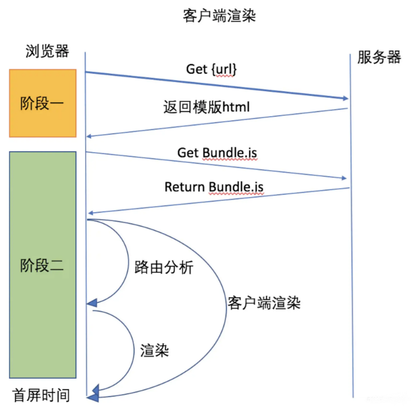
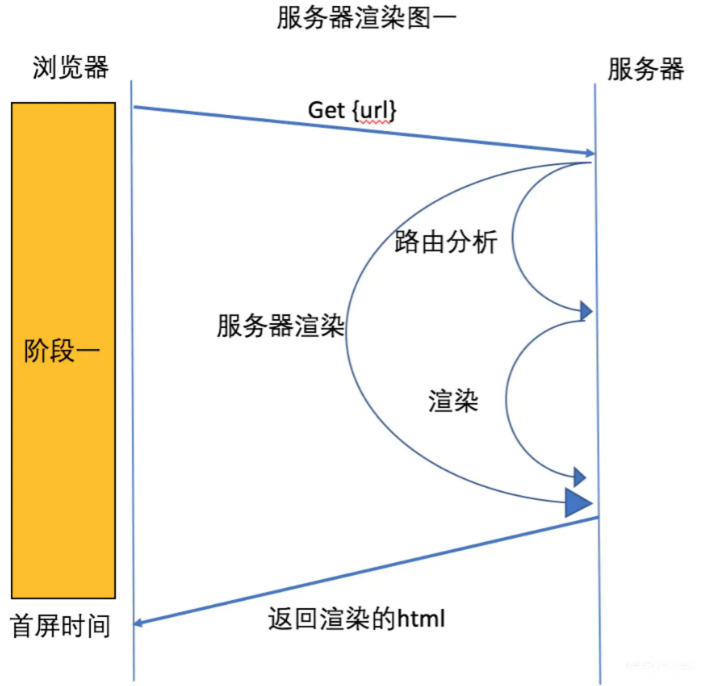
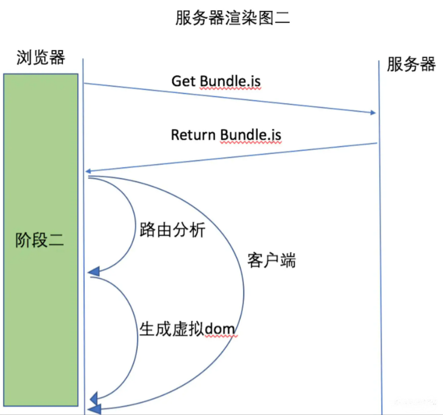
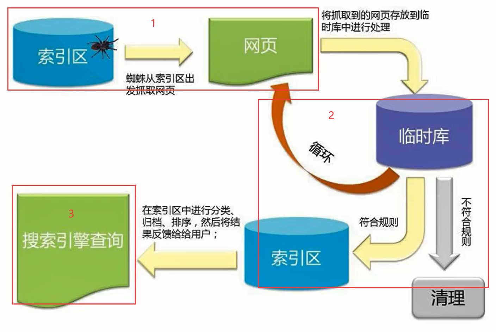

## data和params

- `data` 参数：通常用于 POST、PUT、PATCH 等请求方法，用于发送请求的主体数据。这些数据通常以 JSON 格式进行编码，并作为请求的有效载荷发送到服务器。`data` 参数的值会被放置在请求的主体部分。

  - ```js
    axios.post('/api/users', {
      name: 'John Doe',
      age: 30
    })
    ```

- `params` 参数：通常用于 GET 请求，用于将查询字符串参数附加到 URL 上。这些参数会在请求的 URL 中以键值对的形式进行编码，并发送到服务器。`params` 参数的值会被添加到 URL 的查询字符串部分。

  - ```js
    axios.get('/api/users', {
      params: {
        page: 1,
        limit: 10
      }
    })
    ```

- 总结

  - 使用 `data` 参数发送请求的主体数据，适用于 POST、PUT、PATCH 等请求方法。
  - 使用 `params` 参数将查询字符串参数附加到 URL 上，适用于 GET 请求。


## post和get区别

在 HTTP 协议中，POST 和 GET 是两种常见的请求方法，它们有以下区别：

1. GET 请求：
   - 用途：GET 用于从服务器获取资源或数据。通常用于获取、读取数据，并且不应该对服务器资源产生副作用。
   - 参数传递：GET 请求的参数通常通过 URL 的查询字符串（Query String）传递，参数会附加在 URL 的末尾。
   - 数据长度限制：由于参数附加在 URL 上，GET 请求对数据长度有限制，不适合传输大量数据。
   - 缓存：GET 请求可以被浏览器缓存，相同的请求可以从缓存中获取结果，提高性能。
2. POST 请求：
   - 用途：POST 用于向服务器提交数据，通常用于创建、更新或修改服务器上的资源。
   - 参数传递：POST 请求的参数通常通过请求的主体部分（Body）传递，可以传递较大量的数据，而不会受到 URL 长度限制。
   - 数据安全性：由于参数在请求主体中，POST 请求对数据的传输相对安全，适合传输敏感信息。
   - 不被缓存：POST 请求默认不会被浏览器缓存，每次请求都会获取最新的结果。

总结：

- GET 请求用于获取资源或数据，参数通过 URL 的查询字符串传递，适合读取数据，可以被缓存。
- POST 请求用于提交数据，参数通过请求主体传递，适合创建或修改资源，不会被缓存。


## params和query

在HTTP请求中，"params"和"query"是两种常见的参数传递方式，它们有一些区别。

1. Params（路径参数）：
   - 用途：Params用于在URL的路径中传递参数，通常用于指定资源的标识符或路由参数。
   - 格式：Params参数出现在URL的路径部分，以占位符的形式表示。
   - 示例：`/api/users/:id`，其中`:id`是一个参数占位符，可以被具体的值替代，例如`/api/users/123`。
   - 在Axios中使用：在Axios中，Params参数可以通过将其作为URL的一部分来传递，例如`axios.get('/api/users/' + userId)`。
2. Query（查询参数）：
   - 用途：Query用于在URL的查询字符串中传递参数，通常用于指定附加的选项或过滤条件。
   - 格式：Query参数出现在URL的问号后面，以键值对的形式表示。
   - 示例：`/api/users?name=John&age=30`，其中`name`和`age`是参数键，分别对应的值是`John`和`30`。
   - 在Axios中使用：在Axios中，Query参数可以通过使用`params`属性来传递，例如`axios.get('/api/users', { params: { name: 'John', age: 30 } })`。

总结：

- Params用于在URL的路径中传递参数，以占位符形式表示。
- Query用于在URL的查询字符串中传递参数，以键值对的形式表示。
- 在Axios中，Params参数可以直接拼接在URL中，而Query参数需要使用`params`属性传递


## js中for跳出循环（包括多层循环）return和break的区别

**单层循环**

- for循环中return语句：会直接跳出循环。因为js中for是没有局部作用域的概念的，所以只有把for循环放在函数中时，才可以在for循环中使用return语句。
- for循环中的break语句：和return一样会直接跳出循环。与return不同的是，使用break时，for循环可以不用一定放在函数中 

 **多层循环**

使用return会直接跳出函数

```js
var a=[1,2,3];
var b=[4,5,6,7,8];
function test(){
    for(var i=0;i<a.length;i++){
        for(var j=0;j<b.length;j++){
            if(b[j]==5){
                // break
                return;
            }else{
                console.log(13);
            }
        }

        console.log(12);
    }
    console.log(14);
}
test();//打印结果为：13
```


break不是跳出函数，而是跳出最里层的for循环，外面的循环和最外层for循环后面的语句也将继续执行

```js
 var a=[1,2,3];
 var b=[4,5,6,7,8];
 function test(){
     for(var i=0;i<a.length;i++){
         for(var j=0;j<b.length;j++){
             if(b[j]==5){
                 break ;
                 // return;
             }else{
                 console.log(13);
             }
         }

         console.log(12);
     }
     console.log(14);
 }
test();//打印结果为13 12 13 12 13 12 14
```


## SPA和SSR的区别

### 单页面程序(SPA)

**概念**

单页应用程序(SPA)全称是: Single-page application，SPA应用是**在客户端渲染**的（我们称之为**CSR**）

- SPA应用默认只返回一个空HTML页面，如body只有`<div id= "app”></div>`
- 而整个应用程序的内容都是通过Javascript动态加载，包括应用程序的逻辑、UI以及与服务器通信相关的所有数据。
- 常见的SPA应用框架有Vue、React等


**优点**

- 只需加载一次：SPA应用程序只需要在第一次请求时加载页面,页面切换不需重新加载，而传统的Web应用程序必须在每次请求时都得加载页面，需要花费更多时间。因此，SPA页面加载速度要比传统 Web应用程序更快。
- 更好的用户体验
  - SPA提供类似于桌面或移动应用程序的体验。用户切换页面不必重新加载新页面
  - 切换页面只是内容发生了变化，页面并没有重新加载，从而使体验变得更加流畅

- 可轻松的构建功能丰富的Web应用程序

**缺点**

- SPA应用默认只返回一个空HTML页面，不利于SEO
- 首屏加载的资源过大时，一样会影响首屏的渲染
- 也不利于构建复杂的项目，复杂Web应用程序的大文件可能变得难以维护


### 客户端渲染(CSR)

**渲染流程**：浏览器请求url --> 服务器返回index.html(空body、白屏) --> 再次请求bundle.js、路由分析 --> 浏览器渲染

bundle.js体积越大，会导致浏览器白屏时间越长。




### 静态站点生成(SSG)

**概念**

静态站点生成(SSG)全称是: Static Site Generate，是预先生成好的静态网站。

- SSG应用一般在构建阶段就确定了网站的内容。
- 如果网站的内容需要更新了，那必须得重新再次构建和部署。
- 构建SSG应用常见的库和框架有: Vue Nuxt、React Next.js 等。


**优点**

- 访问速度非常快，因为每个页面都是在构建阶段就已经提前生成好了。
- 直接给浏览器返回静态的HTML，也有利于SEO
- SSG应用依然保留了SPA应用的特性，比如:前端路由、响应式数据、虚拟DOM等


**缺点**

- 页面都是静态，不利于展示实时性的内容，实时性的更适合SSR。
- 如果站点内容更新了，那必须得重新再次构建和部署。


### 服务器端渲染(SSR)

**概念**

服务器端渲染全称是: Server Side Render，**在服务器端渲染页面**，并将渲染好HTML返回给浏览器呈现。

- SSR应用的页面是在服务端渲染的，用户每请求一个SSR页面都会先在服务端进行渲染，然后将渲染好的页面，返回给浏览器呈现。
- 构建SSR应用常见的库和框架有: Vue Nuxt、React Next.js等(SSR应用也称同构应用)。


**优点**

- 更快的首屏渲染速度
  - 浏览器显示静态页面的内容要比JavaScript动态生成的内容快得多。
  - 当用户访问首页时可立即返回静态页面内容，而不需要等待浏览器先加载完整个应用程序。
- 更好的SEO
  - 爬虫是最擅长爬取静态的HTML页面，服务器端直接返回一个静态的HTML给浏览器。
  - 这样有利于爬虫快速抓取网页内容，并编入索引，有利于SEO。
  - SSR应用程序在Hydration 之后依然可以保留Web应用程序的交互性。比如:前端路由、响应式数据、虚拟DOM等。


**缺点**

- SSR通常需要对服务器进行更多API调用，以及在服务器端渲染需要消耗更多的服务器资源，成本高。
- 增加了一定的开发成本，用户需要关心哪些代码是运行在服务器端，哪些代码是运行在浏览器端。
- SSR配置站点的缓存通常会比SPA站点要复杂一点。


**渲染流程**

- 阶段一：浏览器请求url --> 服务器路由分析、执行渲染 --> 服务器返回index.html(实时渲染的内容，字符串) --> 浏览器渲染
- 阶段二：浏览器请求bundle.js --> 服务器返回bundle.js --> 浏览器路由分析、生成虚拟DOM --> 比较DOM变化、绑定事件 --> 二次渲染






## 爬虫工作流程



Google爬虫的工作流程分为3个阶段，并非每个网页都会经历这3个阶段：

- 抓取:
  - 爬虫（也称蜘蛛)，从互联网上发现各类网页，网页中的外部连接也会被发现。
  - 抓取数以十亿被发现网页的内容，如:文本、图片和视频
- 索引编制:
  - 爬虫程序会分析网页上的文本、图片和视频文件
  - 并将信息存储在大型数据库（索引区)中
  - 例如`<title>`元素和Alt属性、图片、视频等
  - 爬虫会对内容类似的网页归类分组
  - 不符合规则内容和网站会被清理（禁止访问或需要权限网站等等）

- 呈现搜索结果


## session/token/cookie他们的区别

### 写在前面

我们知道，HTTP 是无状态的。也就是说，HTTP 请求方和响应方间无法维护状态，都是一次性的，它不知道前后的请求都发生了什么。

但有的场景下，我们需要维护状态。最典型的，一个用户登陆微博，发布、关注、评论，都应是在登录后的用户状态下的。我们知道，HTTP 是无状态的。也就是说，HTTP 请求方和响应方间无法维护状态，都是一次性的，它不知道前后的请求都发生了什么。

但有的场景下，我们需要维护状态。最典型的，一个用户登陆微博，发布、关注、评论，都应是在登录后的用户状态下的。

Session 、 Cookie 和 token 的主要目的就是为了弥补 HTTP 的无状态特性。


### 什么是cookie

- **cookie 存储在客户端：** cookie 是服务器发送到用户浏览器并保存在本地的一小块数据，它会在浏览器下次向同一服务器再发起请求时被携带并发送到服务器上。

- **cookie 是不可跨域的：** 每个 cookie 都会绑定单一的域名，无法在别的域名下获取使用，**一级域名和二级域名之间是允许共享使用的**（**靠的是 domain）**。
  - Domain属性指定浏览器发出 HTTP 请求时，哪些域名要附带这个 Cookie。如果没有指定该属性，浏览器会默认将其设为当前 URL 的一级域名，比如 [www.example.com](https://link.juejin.cn?target=http%3A%2F%2Fwww.example.com) 会设为 example.com，而且以后如果访问example.com的任何子域名，HTTP 请求也会带上这个 Cookie。如果服务器在Set-Cookie字段指定的域名，不属于当前域名，浏览器会拒绝这个 Cookie。


### 什么是session

- **session 是另一种记录服务器和客户端会话状态的机制**
- **session 是基于 cookie 实现的，session 存储在服务器端，sessionId 会被存储到客户端的cookie 中**


### session验证流程

- 用户第一次请求服务器的时候，服务器根据用户提交的相关信息，创建对应的 Session
- 请求返回时将此 Session 的唯一标识信息 SessionID 返回给浏览器
- 浏览器接收到服务器返回的 SessionID 信息后，会将此信息存入到 Cookie 中，同时 Cookie 记录此 SessionID 属于哪个域名
- 当用户第二次访问服务器的时候，请求会自动判断此域名下是否存在 Cookie 信息，如果存在自动将 Cookie 信息也发送给服务端，服务端会从 Cookie 中获取 SessionID，再根据 SessionID 查找对应的 Session 信息，如果没有找到说明用户没有登录或者登录失效，如果找到 Session 证明用户已经登录可执行后面操作。

根据以上流程可知，**SessionID 是连接 Cookie 和 Session 的一道桥梁**，大部分系统也是根据此原理来验证用户登录状态。


### cookie和session的区别

- **安全性：** Session 比 Cookie 安全，Session 是存储在服务器端的，Cookie 是存储在客户端的。
- **存取值的类型不同**：Cookie 只支持存字符串数据，想要设置其他类型的数据，需要将其转换成字符串，Session 可以存任意数据类型。
- **有效期不同：** Cookie 可设置为长时间保持，比如我们经常使用的默认登录功能，Session 一般失效时间较短，客户端关闭（默认情况下）或者 Session 超时都会失效
- **存储大小不同：** 单个 Cookie 保存的数据不能超过 4K，Session 可存储数据远高于 Cookie，但是当访问量过多，会占用过多的服务器资源。


### 什么是token

Token是在身份验证和授权过程中广泛使用的一种机制，用于确认用户的身份并获得权限。它通常是一个字符串，由服务器生成并返回给客户端（例如，Web浏览器或移动应用程序）。Token在客户端和服务器之间进行传递，用于识别和验证用户。


### token身份验证流程

1. 客户端使用用户名跟密码请求登录
2. 服务端收到请求，去验证用户名与密码
3. 验证成功后，服务端会签发一个 token 并把这个 token 发送给客户端
4. 客户端收到 token 以后，会把它存储起来，比如放在 cookie 里或者 localStorage 里
5. 客户端每次向服务端请求资源的时候需要带着服务端签发的 token
6. 服务端收到请求，然后去验证客户端请求里面带着的 token ，如果验证成功，就向客户端返回请求的数据


- **每一次请求都需要携带 token，需要把 token 放到 HTTP 的 Header 里**
- **基于 token 的用户认证是一种服务端无状态的认证方式，服务端不用存放 token 数据。用解析 token 的计算时间换取 session 的存储空间，从而减轻服务器的压力，减少频繁的查询数据库**
- **token 完全由应用管理，所以它可以避开同源策略**


### token和session的区别

1. 定义和作用：
   - Token（令牌）：Token是在身份验证和授权过程中用于确认用户身份和获得权限的一种机制。它通常是一个字符串，由服务器生成并返回给客户端，用于在客户端和服务器之间传递身份验证和授权信息。
   - Session（会话）：Session是服务器端用于维护用户状态和身份信息的一种机制。服务器为每个客户端创建一个会话，用于跟踪用户的状态，通过Session ID标识不同的会话。
2. 存储位置：
   - Token：Token通常存储在客户端，比如浏览器的Cookie或本地存储中，以便客户端可以将其附加到后续请求中。
   - Session：Session数据通常存储在服务器端，而不是在客户端。服务器通过Session ID来标识每个客户端的会话状态。
3. 状态维护：
   - Token：Token是无状态的，服务器不需要在后端存储Token的状态信息，因为所有必要的信息都包含在Token本身中。
   - Session：Session是有状态的，服务器需要在后端维护会话状态信息，以便跟踪用户状态和保存临时数据。
4. 应用场景：
   - Token：Token在Web API、移动应用和分布式系统中广泛使用，特别适合跨服务器进行身份验证和授权。
   - Session：Session通常在传统的Web应用中使用，用于跟踪用户状态和保存用户相关的数据。
5. 安全性：
   - Token：由于Token包含所有必要的验证信息，因此必须谨慎处理，确保其不被非法获取或篡改，通常通过加密和签名来增加安全性。
   - Session：Session数据存储在服务器端，相对较安全，但仍然需要采取措施防止会话劫持和其他安全漏洞。


### 有了 Cookie 为什么还需要 Token

Cookie 作为 HTTP 规范，其出现历史久远，因此存在一些历史遗留问题，比如跨域限制等，并且 Cookie 作为 HTTP 规范中的内容，其存在默认存储以及默认发送的行为，存在一定的安全性问题。相较于 Cookie，token 需要自己存储，自己进行发送，不存在跨域限制，因此 Token 更加的灵活，没有 Cookie 那么多的“历史包袱”束缚，在安全性上也能够做更多的优化。


### Token 有什么 优势？

Token的无状态特性、安全性、可扩展性以及跨平台和跨语言的支持，使得它成为现代Web应用和API身份验证和授权的首选机制。


