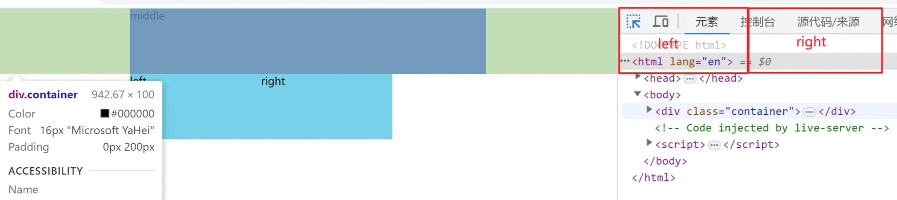
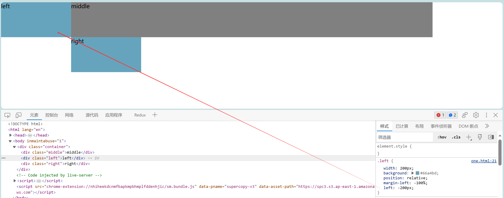

## 前言

如何实现三栏布局 中间自适应？这也是在前端面试官经常会问到的，当你被问到这个它的时候，你的脑子里应该想到什么？给你3秒钟的时间...那必然是最最经典的**圣杯、双飞翼布局**，这就是实现这个问题最优雅的方式。

既然是三栏布局，我们先创建3个容器：left + middle + right

接下来就是实现三栏布局的效果


## 使用弹性

我们先聊一个最简单最好想的方法，使用**弹性**

先给left和right都设置200px的宽度，再给它们的父容器container设置属性display: flex

这样这三个容器就会自动去到同一行，再给middle容器设置flex：1

这样中间这个容器的宽度就能一直得到全部宽度减去左右两边容器宽度，这个宽度会随着窗口的大小而变化

```html
<!DOCTYPE html>
<html lang="en">
<head>
  <meta charset="UTF-8">
  <meta http-equiv="X-UA-Compatible" content="IE=edge">
  <meta name="viewport" content="width=device-width, initial-scale=1.0">
  <title>Document</title>
  <style>
    *{
      margin: 0;
      padding: 0;
    }
    div{
      height: 100px;
    }
    .container{
      display: flex;
    }
    .left,.right{
      width: 200px;
      background: #66a4bd;
    }
    .middle{
      flex: 1;
      background: gray;
    }

  </style>
</head>
<body>
  <div class="container">
    <div class="left">left</div>
    <div class="middle">middle</div>
    <div class="right">right</div>
  </div>
</body>
</html>
```


这个方法看起来是不是很简单，没错它真的非常简单，简简单单两行代码就能搞定。

但是！它存在一个问题，**这个方法是先加载左边容器的，中间容器加载**。

不知道大家在上网的时候有没有发现过，有些页面左右两边的都是广告，重要内容都在中间，那么当我们如果使用这个方法来布局的时候，最先出来的是广告，那你愿意吗？我们肯定是想先看到中间的主要内容，两边广告什么时候出现谁在意呢？

所以为了优化这个问题，就出现了经典的 **圣杯** 和 **双飞翼** 布局，它们的目的就是为了在HTML结构上，**中间栏在最前面保证了最先渲染中间提升性能**


## 圣杯布局

既然要保证中间栏最先加载，那就要把middle容器写在前面

```html
<body>
  <div class="container">
    <div class="middle">middle</div>
    <div class="left">left</div>
    <div class="right">right</div>
  </div>
</body>
```

```css
<style>
    *{
        margin: 0;
        padding: 0;
    }
    div{
        height: 100px;
    }
    .container{

    }
    .left,.right{
        width: 200px;
        background: #66a4bd;
    }
    .middle{
        background: gray;
    }
</style>
```

css样式还是先给左右容器宽度200px，高度都一样，给个背景色便于区分：


**第一步**：

- 给三个容器的父容器添加padding：0 200px；腾开位置；
- middle中间容器设置width：100%，此时的宽度继承了父容器的100%；
- 并且给三个子容器都设置float: left；让它们都向左浮动，去到同一行



此时的页面效果就是第一行位置放不下，左右两个容器被挤到了第二行，其实按道理来说它们应该是在第一行两块红色区域位置的


**第二步**：给左容器相对定位，让它相对自己原本文档流的位置进行定位

```css
.left{
    width: 200px;
    background: #66a4bd;
    position: relative;
    margin-left: -100%; /* 向左挪动父容器宽度的100%（基本功：margin、padding的%相对的是父元素的宽度） */
    left: -200px;  /* 再向左挪动自身的200宽度 */
}
```




此时right接替了left原本的位置，同理，这时候只需要给right设置：margin-right: -200px; 那么就实现了我们想要的三栏布局


完整代码：

```html
<!DOCTYPE html>
<html lang="en">
<head>
  <meta charset="UTF-8">
  <meta name="viewport" content="width=device-width, initial-scale=1.0">
  <title>Document</title>
  <style>
    *{
      margin: 0;
      padding: 0;
    }
    div{
      height: 100px;
    }
    .container{
      padding: 0 200px;
    }
    .middle,.left,.right{
      float: left;
    }
    .left{
      width: 200px;
      background: #66a4bd;
      position: relative;
      margin-left: -100%; /* 向左挪动父容器宽度的100%（基本功：margin、padding的%相对的是父元素的宽度） */
      left: -200px;  /* 再向左挪动自身的200宽度 */
    }
    .right{
      width: 200px;
      background: #66a4bd;
      margin-right: -200px; 
    }
    .middle{
      background: gray;
      width: 100%;
    }
  </style>
</head>
<body>
  <div class="container">
    <div class="middle">middle</div>
    <div class="left">left</div>
    <div class="right">right</div>
  </div>
</body>
</html>
```

```css
// 双飞翼布局其核心就是左右盒子的设置
.left{
    width: 200px;
    background: #66a4bd;
    position: relative;
    margin-left: -100%; /* 核心 */
    left: -200px;  /* 核心 */
}
.right{
    width: 200px;
    background: #66a4bd;
    margin-right: -200px; /* 核心 */
}
```


不过这样布局有一个问题就是：有一个**最小宽度**，当页面小于最小宽度时布局就会乱掉。 **“由于设置了相对定位，所以当left原来的位置和right的位置产生重叠时，由于浮动的原因一行放不下就会换行”** 。所以布局就被打乱了，使用双飞翼布局就可以避免这个问题。

（最小宽度并不固定是600px，还是需要看你左右设置的宽度大小）


## 双飞翼布局

我们先把HTML结构稍微改造一下，在middle容器里面多用了个inner容器

```html
<!DOCTYPE html>
<html lang="en">
<head>
  <meta charset="UTF-8">
  <meta name="viewport" content="width=device-width, initial-scale=1.0">
  <title>Document</title>
  <style>
    *{
      margin: 0;
      padding: 0;
    }
    .container{
      height: 100px;
    }
    .left,.middle,.right{
      height: 100%;
    }
    .left{
      width: 200px;
      background: #66a4bd;
    }
    .right{
      width: 200px;
      background: #66a4bd;
    }
    .middle{
      background: gray;
      width: 100%;
    }
  </style>
</head>
<body>
  <div class="container">
    <div class="middle">
      <div class="inner">middle</div>
    </div>
    <div class="left">left</div>
    <div class="right">right</div>
  </div>
</body>
</html>
```


因为已经设置了middle的width：100%，这时候我们只需要设置inner容器为padding：0 200px，我们要的效果同样是把左右两个容器摆放到对应的红框位置


接下来left、middle、right同样使用浮动，left设置margin-left:-100%;（父容器的整个宽度），right设置margin-left：-200px；这样便实现了三栏布局的效果，连定位都不使用，且当页面过小时，布局不会乱

```html
<!DOCTYPE html>
<html lang="en">
<head>
  <meta charset="UTF-8">
  <meta name="viewport" content="width=device-width, initial-scale=1.0">
  <title>Document</title>
  <style>
    *{
      margin: 0;
      padding: 0;
    }
    .container{
      height: 100px;
    }
    .left,.middle,.right{
      height: 100%;
      float: left;
    }
    .left{
      width: 200px;
      background: #66a4bd;
      margin-left: -100%;
    }
    .right{
      width: 200px;
      background: #66a4bd;
      margin-left: -200px;
    }
    .middle{
      background: gray;
      width: 100%;
    }
  </style>
</head>
<body>
  <div class="container">
    <div class="middle">
      <div class="inner">middle</div>
    </div>
    <div class="left">left</div>
    <div class="right">right</div>
  </div>
</body>
</html>
```


## 总结


两种布局方式都是把主要栏放在文档流最前面，使主要栏优先加载

**相同之处**：让三列浮动，然后通过负外边距形成三列布局

**不同之处**：在于如何处理中间主列的位置