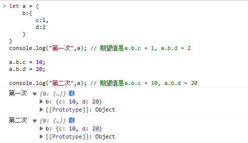
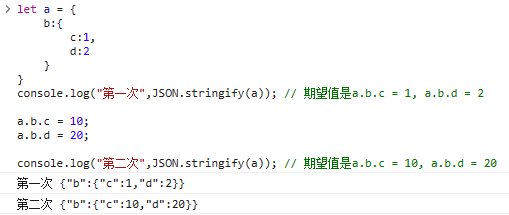
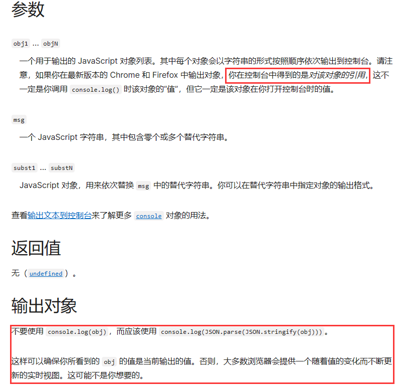

## console.log是异步还是同步

控制台`console.log`通常是同步的。这意味着，当代码执行到`console.log`语句时，它会立即写入到控制台中，并且`JavaScript`代码执行会在`console.log`完成后继续进行。

但是，在某些情况下，console.log也可以是异步的。例如，当使用Node.js中的console对象时，console.log实际上是一个异步方法，因为它使用了底层的文件系统API将日志信息写入I/O磁盘。在这种情况下，console.log将不会立即写入控制台，而是会被添加到一个输出缓冲区中，然后在Node.js事件循环的下一个迭代中异步地写入I/O磁盘。

总的来说，大多数情况下，在前端代码或者浏览器在控制台输出console.log是同步的，但要根据具体情况确定它是同步还是异步。


## 为什么console.log有时候不准？

在前端开发中，console.log有时候可能会出现不准确的情况，这通常是由于以下原因之一


### 对象引用

:::info 补充
小啰嗦一下：今天我在工作的时候就遇到了这个问题，当时我是震惊了，我一直在咦咦咦，为什么会打印出这样的结果？？

数据很简单，大概是这样的，大家可以猜猜两次分别打印什么

```js
let arr = []
let a = ['1', '2', '3']
let b = ['a', 'b', 'c']

arr.push(a)
console.log(arr)
arr.push(b)
console.log(arr)
```

```js
实际上上述两次打印的结果都是[ ['1', '2', '3'], ['a', 'b', 'c'] ]
```

然后请教了组里的大神，在查找一些资料，大概摸清楚什么原因了
:::


如果console.log输出一个对象或数组，那么它实际上输出的是该`对象`或数组的引用（**引用地址**）。所以就会存在当打印对象的时候，当引用到对象中的值的时候，对象中的值`已经发生变化`了的情况，会导致打印结果与预期不一致。我们可以用另一个例子来说明

```js
let a = {
    b:{
        c:1,
        d:2
    }
}
console.log("第一次",a); // 期望值是a.b.c = 1, a.b.d = 2

a.b.c = 10;
a.b.d = 20;

console.log("第二次",a); // 期望值是a.b.c = 10, a.b.d = 20
```

我们可以看控制台：

**可以看出控制台输出的引用地址对象信息在第一次，第二次的结果一样，和我们想要的期望值不一致**


不要着急，我们再看一个案例

```js
let a = {
    b:{
        c:1,
        d:2
    }
}
console.log("第一次",JSON.stringify(a)); // 期望值是a.b.c = 1, a.b.d = 2

a.b.c = 10;
a.b.d = 20;

console.log("第二次",JSON.stringify(a)); // 期望值是a.b.c = 10, a.b.d = 20
```

我们看控制台：

**可以看出控制台输出使用`JSON.stringify`在第一次，第二次的结果输出和我们想要的期望值一致**


 为什么使用`JSON.stringify`就一致了，是因为`例子1`在控制台显示的还是引用地址，`例子2`在控制台显示的是`string字符串`


这里我们可以看MDN中的解释：[console.log - Web API 接口参考 | MDN (mozilla.org)](https://developer.mozilla.org/zh-CN/docs/Web/API/console/log#参数)



当引用中的值改变了，在控制台也会随即改变，console.log显示就会有出入，解决方法是确保始终记录对象的**序列化快照**，字符串用(JSON.stringify)，例如使用console.log(JSON.stringify(obj))来解决输出不准问题。

其他的解决方案可以用用浏览器断点调试或者开发代码debugger打断点调试，执行完全停止，可以检查每个点的当前值。发现数据错误和bug也是最快的方法。


### 异步代码

如果`console.log`语句位于异步代码中，例如`回调函数`或`定时器`中，那么它可能不会按照预期的顺序执行。这可能导致console.log输出的顺序与代码实际执行的顺序不同，从而导致输出不准确的情况。


### 异常

如果代码中存在异常，并且该异常在console.log语句之前或之后抛出，那么console.log可能不会输出预期的结果，因为它可能不会执行到该语句。


### 浏览器控制台

有时浏览器控制台本身可能存在问题，例如缓存或其他错误，这可能会导致console.log输出不准确的情况。此外，浏览器在处理的时候对于读取 i/o 的操作一般会放到比较靠后的位置去处理。 所以有些时候打印出来的值不符合预期。在这些情况下，可以尝试使用不同的浏览器或更新浏览器版本来解决问题。


## 总结

为了避免console.log输出不准确的情况，可以采取以下措施：

- 在输出对象或数组时，可以使用JSON.stringify方法将其转换为字符串，以避免输出引用。(已在例子中讲解)
- 最好用浏览器断点调试或者开发代码debugger打断点调试，执行完全停止，可以检查每个点的当前值。发现数据错误和bug也是最快的方法。(已在上述提示)
- 尽可能避免在异步代码中使用console.log，或者确保在异步代码中正确处理console.log的执行顺序。
- 确保代码不会抛出异常，并在必要时使用try-catch语句处理异常。
- 确保浏览器控制台没有任何问题，并尝试使用其他浏览器或更新浏览器版本来解决问题。


————————————————

参考文章：https://blog.csdn.net/mingketao/article/details/130965573