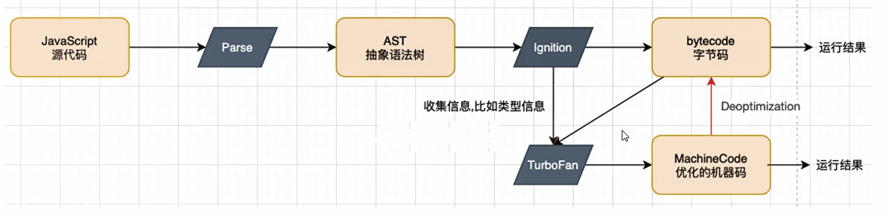

## 前言

- JavaScript代码下载好之后，是如何一步步被执行的呢?
- 我们知道，浏览器内核是由两部分组成的，以webkit为例：
  - WebCore:负责HTML解析、布局、渲染等等相关的工作
  - JavaScriptCore:解析、执行JavaScript代码
- 另外一个强大的JavaScript引擎就是**V8引擎**

## V8引擎执行原理

- **Parse模块**会将JavaScript代码转换成AST(抽象语法树)，这是因为解释器并不直接认识JavaScript代码
  - 如果函数没有被调用，那么是不会被转换成AST的
- **lgnition**是一个解释器，会将AST转换成ByteCode(字节码)
  - 同时会收集TurboFan优化所需要的信息（比如函数参数的类型信息，有了类型才能进行真实的运算)
  - 如果函数只调用一次，lgnition会解释执行ByteCode
  - 如果函数执行多次的话，看下一步
- **TurboFan**是一个编译器，可以将字节码编译为CPU可以直接执行的机器码;
  - 如果**一个函数被多次调用**，那么就会被标记为**热点函数**，那么就会经过TurboFan转换成优化的机器码，提高代码的执行性能
  - 但是，机器码实际上也会被还原为ByteCode，这是因为如果后续执行函数的过程中，类型发生了变化(比如sum函数原
    来执行的是number类型，后来执行变成了string类型)，之前优化的机器码并不能正确的处理运算，就会逆向的转换成字节码，在运行。所有我们一直保持传入函数的类型是一致的也是一种优化

## 全局代码执行前

### 初始化全局对象

- js引擎会 在执行代码之前，会在 堆内存中创建一个**全局对象**：Global Object (**GO**)【其实就会window】
  - 该对象 **所有的作用域(scope)** 都可以访问
  - 里面会包含 Date、Array、String、Number、setTimeout、setInterval 等等
  - 其中还有一个**window属性指向自己**

### 执行上下文栈

- js引擎内部有一个**执行上下文栈**（Execution Context Stack，简称ECS），它用于执行**代码的调用栈**
- 那么现在它要执行谁呢？执行的是**全局的代码块**：
  - 全局的代码块为了执行会构建一个 **Execution Context (EC，执行上下文)** 
  - EC会被放入到ECS中执行。然后才执行EC中的代码（我们想要执行代码就必须要在执行上下文中执行）
- EC被放入到ECS中里面包含两部分内容：
  - 第一部分：在代码执行前，在parser转成AST的过程中，会将全局定义的变量、函数等加入到GlobalObject中，变量声明为undefined，函数提前创建好【这个过程也称之为变量的作用域提升(hoisting)】
  - 第二部分：在代码执行中，对变量赋值，或者执行其他的函数

### VO对象

每一个执行上下文会关联一个VO(Variable Object，变量对象)，**变量、参数和函数声明**会被添加到这个VO对象中。

在 执行上下文 的时候都会有一个VO。当全局代码被执行的时候，这个VO就是全局对象GO。当函数被执行的时候，这个VO就是AO

## 全局代码执行中

**对变量进行赋值，函数的话直接跳过，因为之前我们已经创建了函数**

### 函数如何被执行

- 在执行的过程中**执行到一个函数**时，就会根据函数体创建一个**新的执行上下文**：**函数执行上下文**(Functional Execution Context,）并且压入到**执行上下文栈**中。
- **因为每个执行上下文都会关联一个VO，那么函数执行上下文关联的VO是什么呢?**
  - 当进入一个函数执行上下文时，会创建一个AO对象(Activation Object) 
  - 这个AO对象会使用arguments作为初始化，并且初始值是传入的参数
  - 这个AO对象会作为函数执行上下文的VO来存放变量的初始化
- **只有用function声明的才会被提前创建出来**

## 总结

- js引擎会在执行代码之前，会在堆内存中创建一个全局对象Global Object (GO)。
- 该对象在任何地方都可以访问到，里面会包含Date、Array、String、Number、setTimeout、setInterval等等
- js引擎内部有一个**执行上下文栈**，它用于执行全局代码块。全局代码块会创建一个全局上下文，在执行上下文中执行。
- 全局上下文被放到执行上下文里面包含两部分内容。
  - 第一部分：在代码执行前，会将全局定义的变量、函数等加入到**全局对象GO**中，但是并**不会赋值**，这个过程也称之为变量的作用域提升(hoisting)

  - 第二部分：在代码执行中，对变量赋值，或者执行其他的函数。

- 其中每一个执行上下文会关联一个VO。变量和函数声明会被添加到这个VO对象中。【当全局代码被执行的时候，这个VO就是全局对象GO。当函数被执行的时候，这个VO就是AO】

- 对于函数的执行，在执行一个函数时，会创建一个**函数执行上下文**，并且压入到执行上下文栈中。只有用function声明的才会被提前创建出来。当进入一个函数执行上下文时，会创建一个AO对象(Activation Object) ，这个AO对象会使用arguments作为初始化，并且初始值是传入的参数。【这个AO对象会作为函数执行上下文的VO来存放变量的初始化】

