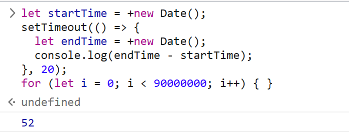
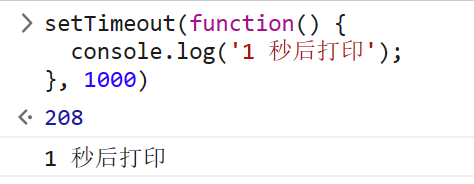
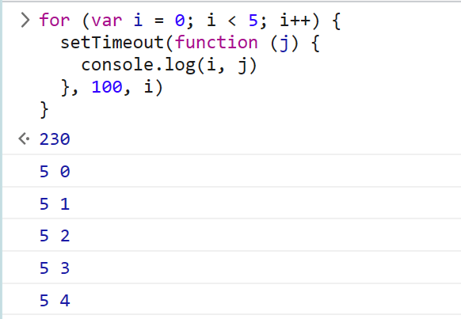
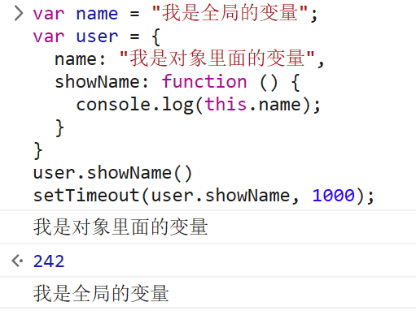
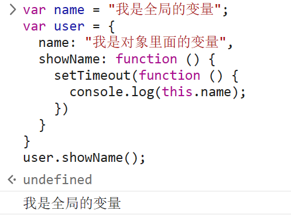
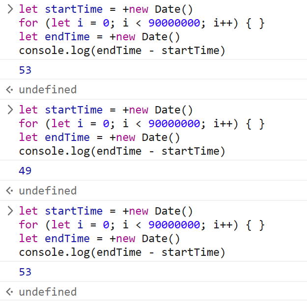
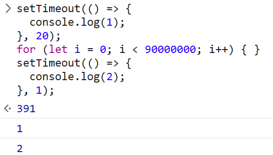
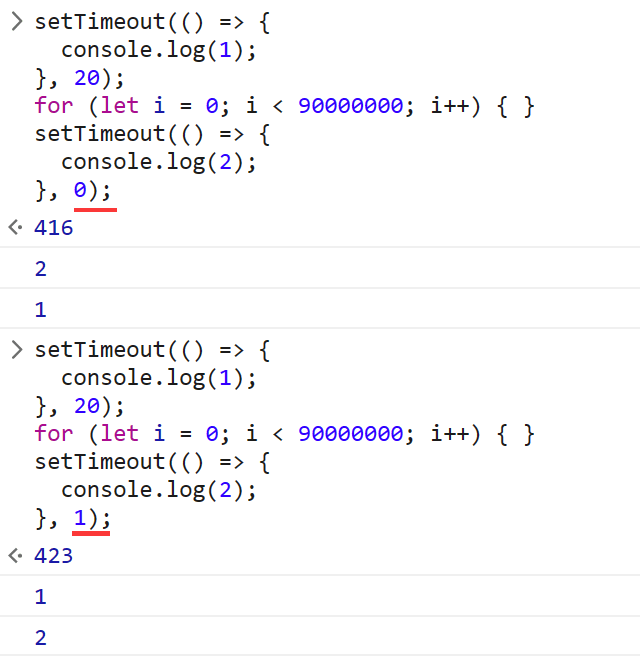
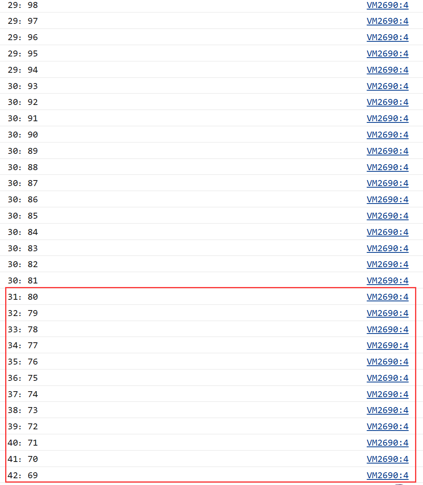
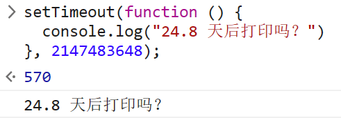

为什么都说定时器 `setTimeout` 不能准时执行呢？

本文从一段代码的执行时间开始，去了解 `setTimeout` 的基本使用，深入浅出地剖析浏览器是怎么实现 `setTimeout` 的，之后再去探索定时器 `setTimeout` 为什么不能够准时执行。


## 先看一段代码的执行

```js
let startTime = +new Date();
setTimeout(() => {
  let endTime = +new Date();
  console.log(endTime - startTime);
}, 20);
for (let i = 0; i < 90000000; i++) { } 
```

在看到这段代码的第一时间你是否会认为 `setTimeout` 会在 `20ms` 后执行，然后 `console.log()` 打印的是 `20` 呢？

我一开始的时候也认为打印的是 `20` 的，就算 JS 引擎计算 `endTime - startTime` 的时间需要花个 `1ms` 或 `2ms` ，那也应该是打印 `21` 或者 `22` 的。

但是结果远远出乎我的意料，当我把这段代码放到浏览器控制台上面执行的时候，结果是下面这样子的：



`console.log()` 打印的结果是 `52`，这跟我给 `setTimeout` 定下的 `20ms` 后执行的时间相差得也太多了吧，难怪都说定时器 `setTimeout` 不能够准时执行。

那为什么 `setTimeout` 不能够准时执行呢？这激起了我的探索欲望，于是开始查找资料


## setTimeout的使用

### 基本使用

> **`setTimeout()` 方法用于在指定的毫秒数后调用函数或计算表达式**。

简单来说 `setTimeout()` 是一个 **定时器**，**用来指定某个函数在多少毫秒之后执行**。

```js
setTimeout(function() {
  console.log('1 秒后打印');
}, 1000)
```




### `setTimeout` 的返回值

`1 秒后打印` 这个文本我懂，但是它前面那个 `208` 是怎么回事呢？

原来，**`setTimeout` 会返回一个整数，表示定时器的编号**，同时 **可以通过该编号来取消这个定时器**。

这个编号的意思就是说，我虽然通过 `setTimeout` 设置了在指定时间后执行代码，但是在没到时间之前是可以反悔的，反悔的方式是 **通过 `clearTimeout()` 去取消这个定时器**，如下：

```js
let timer = setTimeout(function() {
  console.log('1 秒后打印');
}, 1000);
clearTimeout(timer);
```

通过往 `clearTimeout` 传入定时器编号即可取消这个定时器


### `setTimeout` 的第三个参数

`setTimeout` 还有第三个参数，当然也不止三个参数，它可以有多个参数，如下：

```js
setTimeout(function(a, b, c, d) {
  console.log(a, b, c, d)
}, 100, 1, 2, 3, 4)
```

`setTimeout` 从第三个参数开始，后面的参数是可以当做匿名函数的参数传递进去的。

用第三个参数来解决一道经典面试题，这道题大家伙应该都有遇到过：

```js
for (var i = 0; i < 5; i++) {
  setTimeout(function () {
    console.log(i)
  }, 100)
}
```

在这个情况下是 `100ms` 后打印 5 个 `5`，那想让它在 `100ms` 后打印 `0 1 2 3 4` 有多种方法，其中一个方法就可以利用第三个参数来实现：

```js
for (var i = 0; i < 5; i++) {
  setTimeout(function (j) {
    console.log(i, j)
  }, 100, i)
}
```




### `setTimeout` 中的 `this`

**使用 `setTimeout` 设置的回调函数中的 `this` 是不符合直觉的**

如果被 `setTimeout` 推迟执行的回调函数是 **某个对象的方法**，那么该方法中的 `this` 关键字将指向全局环境，而不是定义时所在的那个对象。如下：

```js
var name = "我是全局的变量";
var user = {
  name: "我是对象里面的变量",
  showName: function () {
    console.log(this.name);
  }
}
user.showName()
setTimeout(user.showName, 1000);
```



这里在setTimeout中输出的是 `我是全局的变量`，因为这段代码在编译的时候，执行上下文中的 `this` 会被设置为全局 `window`，如果是严格模式或node中，会被设置为 `undefined`。

对于这个问题，可以这样解决：

```js
// 第一种是将 user.showName 放在匿名函数中执行
// function 函数
setTimeout(function () {
  user.showName();
}, 1000);

// 第一种是使用箭头函数
setTimeout(() => user.showName(), 1000);
// 第二种是使用 call/apply/bind 等方法，改变 showName 的 this 指向
setTimeout(user.showName.call(user), 1000)
```

`setTimeout` 中的 `this` 还有如下的情况：

```js
var name = "我是全局的变量";
var user = {
  name: "我是对象里面的变量",
  showName: function () {
    setTimeout(function () {
      console.log(this.name);
    })
  }
}
user.showName()
```



这种情况下，`setTimeout` 就相当于一个嵌套函数了，**嵌套函数中的 `this` 是不会继承外层函数的 `this` 值**，那这个问题的解决方案也有很多，比如：使用箭头函数、设置一个变量缓存 `this`、利用第三个参数传参、利用闭包、利用 `call`/`apply`/`bind` 等方法改变 `this` 指向等等


## 浏览器是怎么实现 `setTimeout` 的

既然要探究这个，就很有必要知道浏览器的事件循环机制了，我在之前也写过的关于事件循环的一些文章，有兴趣的小伙伴可以去看一下：[了解宏任务和微任务谁先执行 - 鲸落 (xiaojunnan.cn)](http://www.xiaojunnan.cn/eventLoop)

我们知道，浏览器是通过消息队列去维护任务的，要执行一段异步任务，需要先将任务添加到消息队列中。不过 **通过定时器设置回调函数有点特别，它们需要在指定的时间间隔内被调用，但消息队列中的任务是按照顺序执行的，所以为了保证回调函数能在指定时间内执行，不能将定时器的回调函数直接添加到消息队列中**。

那如果要在事件循环系统的基础之上加上定时器的功能，应该要如何设计呢？

原来在 Chrome 中除了正常使用的消息队列之外，还有另外一个 **消息队列（延迟队列）**，**这个队列中维护了需要延迟执行的任务列表**，包括了定时器和 Chromium 内部一些需要延迟执行的任务。所以当通过 JavaScript 创建一个定时器时，渲染进程会将该定时器的回调任务添加到 **延迟队列** 中。

在 Chrome 中有一个 **`ProcessDelayTask` 函数，该函数是专门用来处理延迟执行任务的**。**它的执行时机是在处理完消息队列中的一个任务之后**。`ProcessDelayTask` 函数会根据发起时间和延迟时间计算出到期的任务，然后依次执行这些到期的任务。等到期的任务执行完成之后，再继续下一个循环过程。通过这样的方式，一个完整的定时器就实现了。

而取消执行这个定时器比较简单，定时器会返回一个编号，那取消的具体方法是调用 `clearTimeout` 函数，并传入需要取消的定时器的编号。其中 **内部的操作是从延迟队列中，通过 这个编号查找到对应的任务，然后再将其从队列中删除掉**。


## 有哪些原因会导致 `setTimeout` 不准时呢

### 当前任务执行时间过久

通过 `setTimeout` 设置的回调任务被放入了延迟队列中并且等待下一次执行，这里 **并不是立即执行** 的；要执行消息队列中的下个任务，需要等待当前的任务执行完成，如果 **当前任务执行时间过久是会导致定时器设置的任务被延迟执行的**。

简单来说就是 JS 引擎会先执行同步的代码之后才会执行异步的代码，如果同步的代码执行时间过久，是会导致异步代码延迟执行的。

文章开篇的例子就是一个因为前面的任务执行时间过久而导致的 `setTimeout` 不能够准时执行。

```js
let startTime = +new Date();
setTimeout(() => {
  let endTime = +new Date();
  console.log(endTime - startTime);
}, 20);
for (let i = 0; i < 90000000; i++) { } 
```

这里导致 `setTimeout` 不能够准时执行的关键应该是这一句代码： `for (let i = 0; i < 90000000; i++) { } `，我们来看看这句的代码的执行时间：

```js
let startTime = +new Date()
for (let i = 0; i < 90000000; i++) { } 
let endTime = +new Date()
console.log(endTime - startTime)
```



可以看到，这一句 `90000000` 的 `for` 循环花了大概五十多毫秒（不同电脑性能不一样）

那开篇这段代码中 `setTimeout` 不能准时执行的原因就找到了

再来看一下下面这个例子：

```js
setTimeout(() => {
  console.log(1);
}, 20);
for (let i = 0; i < 90000000; i++) { } 
setTimeout(() => {
  console.log(2);
}, 1);
```

如果没有中间那一段 `for` 循环的代码，按照两个 `setTimeout` 设定的时间，打印的顺序应该是 `2`、`1` 的

那中间加上这样一段 `for` 循环的代码之后呢？



它的打印顺序是 `1`、`2`

之所以举这个例子，是因为我想说明 `setTimeout` 设置的回调任务是 **按照顺序添加到延迟队列里面的**，当执行完一个任务之后，`ProcessDelayTask` 函数会根据发起时间和延迟时间来计算出到期的任务，然后 **依次执行** 这些到期的任务。

在执行完前面的任务之后，上面例子的两个 `setTimeout` 都到期了，那么按照顺序执行就是打印 `1` 和 `2`。所以在这个场景下，`setTimeout` 就显得不那么可靠了。


:::info 疑惑

好吧其实这部分我也有点疑惑

```js
setTimeout(() => {
  console.log(1);
}, 20);
for (let i = 0; i < 90000000; i++) { } 
setTimeout(() => {
  console.log(2);
}, 0);
```

```js
setTimeout(() => {
  console.log(1);
}, 20);
for (let i = 0; i < 90000000; i++) { } 
setTimeout(() => {
  console.log(2);
}, 1);
```

上述代码的区别仅仅是在第二个setTimeout中执行的时间是0/1。但是他们的执行顺序确是不同的



具体什么原因还在思考中。

还有一个问题，上述代码在node环境中运行都是1,2。:dizzy_face:

:::


### 嵌套调用 `setTimeout` 存在最小时延 `4ms`

**如果 `setTimeout` 存在嵌套调用，那么系统会设置最短时间间隔为 `4ms`**。

`setTimeout` 的第二个参数设置为 `0` （未设置、小于 `0`、大于 `2147483647` 时都默认为 `0`）的时候，意味着马上执行，或者尽快执行。

但是在 Chrome 中它有这样的一个设置：

> If timeout is less than 0, then set timeout to 0. If nesting level is greater than 5, and timeout is less than 4, then set timeout to 4

上面这句话的意思是，如果延迟时间小于 `0`，则会把延迟时间设置为 `0`。如果定时器嵌套 `5` 次以上并且延迟时间小于 `4ms`，则会把延迟时间设置为 `4ms`。

即在定时器函数里面嵌套调用定时器，**系统会判断该函数方法被阻塞了**，如果延迟时间是小于 `4ms` 的，会延长定时器的执行时间至 `4ms`。

像下面这段代码，一直被嵌套调用，则后面的定时器都会有最小时延 `4ms`

```js
function cb() { setTimeout(cb, 0); }
setTimeout(cb, 0);
```


### 未激活的页面，`setTimeout` 的最小执行间隔是 `1000ms`

除了 `4ms` 延迟，还有一个很容易被忽略的地方，那就是未被激活的页面中定时器最小值大于 `1000ms`，也就是说，如果标签不是当前的激活标签，那么定时器最小的时间间隔是 `1000ms`，目的是为了 **优化后台页面的加载损耗以及降低耗电量**。

未被激活的页面是什么概念呢？

**就是切换了标签页或者把浏览器最小化**，有如下代码：

这是一个计时器，每 `50ms` 计时一次，倒计时从 `100` 到 `0`。

```js
let num = 100;
function setTime() {
  // 当前秒执行的计时
  console.log(new Date().getSeconds() + "：" + num);
  num ? num-- && setTimeout(() => setTime(), 50) : "";
}
setTime();
```

如下图，可以看到，我执行代码后立即切换标签页，在 `30s` 的时候把，它之后的几秒内都只是 **`1s` 执行一次定时器**



所以使用定时器 `setTimeout` 还得注意这个细节，不试一下还真不知道呢。


### 延时执行时间有最大值

Chrome、Safari、Firefox 等浏览器都是以 `32` 个 `bit` 来存储延时值的，`32bit` 最大只能存放的数字是 `2147483647` 毫秒（大约 24.8 天），如果设置的延迟值大于这个数时会溢出，那么相当于延时值被设置为 `0` 了，这导致定时器会被立即执行。

如下代码：

```js
setTimeout(function () {
  console.log("24.8 天后打印吗？")
}, 2147483648);
```




## 既然 `setTimeout` 不准时那么还可以用吗

定时器 `setTimeout` 用自然是可以用的，它的作用就是用来指定某个函数在多少毫秒之后执行，只是说 `setTimeout` 因为存在种种原因会出现不准时的情况，那么一些对于时间精度很高的需求就不太适合用 `setTimeout` 了，例如利用 `setTimeout` 来实现 JS 动画就不是一个很好的主意。

那相对而言，如果对于时间的精度要求不高的场景就可以用 `setTimeout` 了。


## 有什么可以替代 `setTimeout` 的吗

既然 `setTimeout` 在时效性上面有很多先天的不足，那么对于一些时间精度要求比较高的需求，应该有针对性地采取一些其他的方案。

比如要使用 JS 来实现动画效果，**函数 `requestAnimationFrame`** 就是一个很好的选择。

使用 `requestAnimationFrame` 实现的动画效果比 `setTimeout` 好的原因如下：

- 使用`requestAnimationFrame`不需要设置具体的时间
  - 它提供一个原生的API去执行动画的效果，它会在一帧（一般是 `16ms`）间隔内根据选择浏览器情况去执行相关动作。
  - `setTimeout` 是在特定的时间间隔去执行任务，不到时间间隔不会去执行，这样浏览器就没有办法去自动优化
- `requestAnimationFrame` 里面的回调函数是在页面刷新之前执行，它跟着屏幕的刷新频率走，保证每个刷新间隔只执行一次；
- 如果页面未激活的话，`requestAnimationFrame` 也会停止渲染，这样既可以保证页面的流畅性，又能节省主线程执行函数的开销。


## 一道 Event Loop 的面试题

两道题一个有`for (let i = 0; i < 90000000; i++) { }`，一个没有，看看你能做对吗

（这个可能也会涉及到上面那个知识点，在node环境下和在浏览器环境执行顺序是不一样的）

```js
function func1() {
  console.log('func1 start');
  return new Promise(resolve => {
    resolve('OK');
  })
}
function func2() {
  console.log('func2 start');
  return new Promise(resolve => {
    setTimeout(() => {
      resolve('OK');
    }, 10)
  })
}
console.log(1);
setTimeout(async () => {
  console.log(2);
  await func1();
  console.log(3);
}, 20);

console.log(4);
func1().then(() => {
  console.log(5);
})
func2().then(() => {
  console.log(6);
})
setTimeout(() => {
  console.log(7)
}, 0);
console.log(8);
```

```js
function func1() {
  console.log('func1 start');
  return new Promise(resolve => {
    resolve('OK');
  })
}
function func2() {
  console.log('func2 start');
  return new Promise(resolve => {
    setTimeout(() => {
      resolve('OK');
    }, 10)
  })
}
console.log(1);
setTimeout(async () => {
  console.log(2);
  await func1();
  console.log(3);
}, 20);
for (let i = 0; i < 90000000; i++) { }
console.log(4);
func1().then(() => {
  console.log(5);
})
func2().then(() => {
  console.log(6);
})
setTimeout(() => {
  console.log(7)
}, 0);
console.log(8);
```


## 总结

- `setTimeout()` 方法用于在指定的毫秒数后调用函数或计算表达式。
- 浏览器通过维护一个延迟队列来实现 `setTimeout`，有一个 `ProcessDelayTask` 函数来检查到期的任务然后依次执行。
- 导致定时器 `setTimeout` 不准时的原因有四个：
  - JS 是单线程执行任务，如果当前任务执行时间过久会导致定时器设置的任务被延迟执行。
  - 如果 `setTimeout` 存在嵌套调用且超过 5 次，那么系统会设置最短时间间隔为 `4ms`。
  - 未激活的页面，`setTimeout` 的最小执行间隔是 `1000ms`。
  - `setTimeout` 的延迟执行时间有最大值 `2147483647ms`。
- `setTimeout` 不宜用于对于时间精度要求较高的场景，可以用 `requestAnimationFrame ` 去替代执行。


参考链接：

[为什么都说定时器 setTimeout 不能准时执行呢？ - 掘金 (juejin.cn)](https://juejin.cn/post/6982081539249012766)


