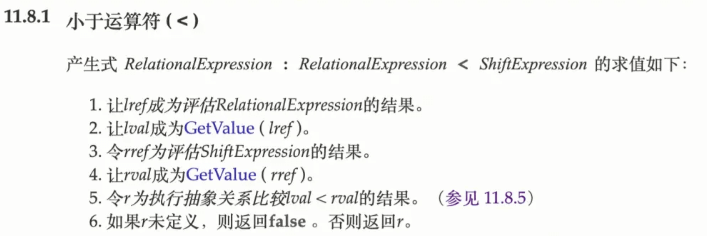
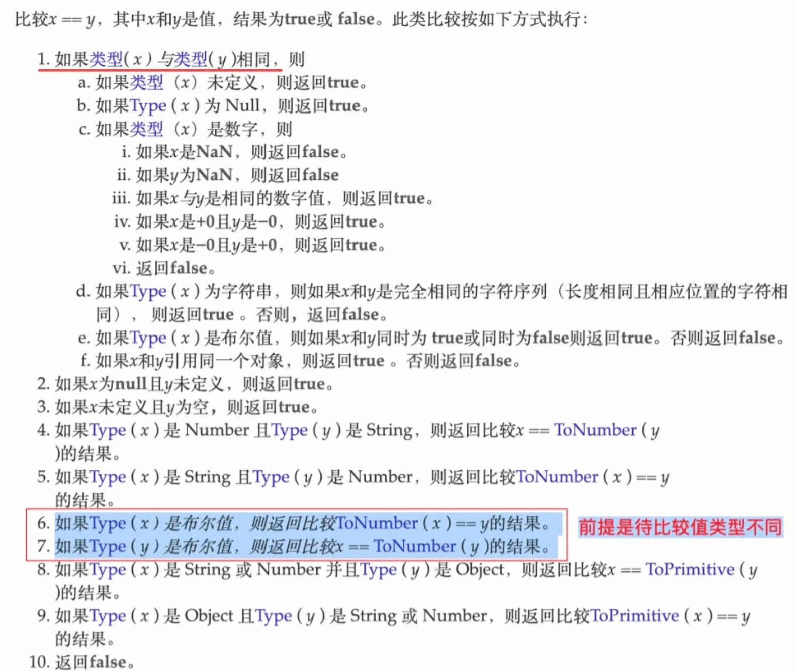

##  “null == 0 为 false 但 null <= 0 为 true”

 null 强制类型转换为数字是 0，`null <= 0` 也合理。但控制台输入了 `null == 0`却是false


那这个 `null <= 0` 到底是怎么计算的呢？

[查询 ES5 规范 11.8.3 <= 算法](https://262.ecma-international.org/5.1/#sec-11.8.3)，简单说就是 `x <= y` 等价于 `!(y < x)`


即 `null <= 0` 等价于 `!(0 < null)`，查下[ES5 规范 11.8.1 < 算法](https://262.ecma-international.org/5.1/#sec-11.8.1)和[ES5 规范 11.8.5 抽象关系比较算法](https://262.ecma-international.org/5.1/#sec-11.8.5)




看起来内容多且枯燥，简单说就是先 `GetValue` 进行表达式运算，再 `ToPrimitive` 转换为原始值，接着再比较，只有两种可能，要么是数字比较，要么字符串比较，数字就是比大小，字符串就是挨个比较 `Unicode` 码。

`!(0 < null)` 对应 `!(0 < ToNumber(null))`，即 `!(0 < 0)`，返回 true，即证。

简单小结一下：`null <= 0` => `!(0 < null)` => `!(0 < ToNumber(null))` => `!(0 < 0)` => `!false` => `true`。


> 补充：
>
> 1. == 允许在相等比较中进行强制类型转换，而 `===` 不允许。== 的工作量更大一些，因为如果值的类型不同还需要进行强制类型转换。
> 2. 如果待比较的值类型相同，== 和 === 等价
> 3. **如果不同，** **会发生隐式强制类型转换**，会将其中之一或两者都转换为相同的类型后再进行比较。


## `'42' == true` 和 `'42' == false` 均为 `false`，串符串 `'42'` 既不等于 `true`，也不等于 `false`。（一个值既非真值也非假值 ？？？）


我们普遍认为 `'42' == true` 是字符串 `'42'` 先强制转换为布尔值再比较，`'42' == true` 等价于 `ToBoolean('42') == true`，即 `true == true` 返回 `true`，但实际结果是 `false`

实际上根据[ES5 11.8.5 抽象相等比较算法](https://262.ecma-international.org/5.1/#sec-11.8.5)定义，




实际上的，根据*抽象相等比较算法*第7条“如果 `Type(y)` 是布尔值，则返回比较 `x == ToNumber(y)` 的结果”， `'42' == true` 的意思是“布尔类型 `true` 先转换为 `1`，再判断 `'42' == 1`。

同理，`'42' == 1` 根据*抽象相等比较算法*第5条“如果 `Type(x)` 是 String 且 `Type(y)` 是 Number，则返回比较 `ToNumber(x)== y` 的结果”，字符串 `'42'` 强制转换为数字 `42` 再比较，即 `42 == 1` ，返回 `false`，即证。

同理，`'42' == false` 根据*抽象相等比较算法*第7条“如果 `Type(y)` 是布尔值，则返回比较 `x == ToNumber(y)` 的结果”转换为 `'42' == 0`，根据抽象相等比较算法第5条“如果 `Type(x)` 是 String 且 `Type(y)` 是 Number，则返回比较 `ToNumber(x) == y` 的结果”转换为 `42 == 0`，返回 `false`，即证。

所以，千万不要使用 `== true` 或 `== false`。

简单小结一下：

- `'42' == true` => `'42' == ToNumber(true)` => `'42' == 1` => `ToNumber('42') == 1` => `42 == 1` => `false`。
- `'42' == false` => `'42' == ToNumber(false)` => `'42' == 0` => `ToNumber('42') == 0` => `42 == 0` => `false`。


## `null == undefined` 为 true，但 `null == ''`、`undefined == ''`、`null == 0`、`undefined == 0`、`null == false` 和 `undefined == false` 均为 `false`。

在回答这个问题前，先要搞清楚 JS 有哪些类型。

简单说**共8种**，即7种**原始类型**（string、number、bigint、boolean、undefined、symbol、null）和1种**对象类型**（object）。

typeof类型：[typeof - JavaScript | MDN (mozilla.org)](https://developer.mozilla.org/zh-CN/docs/Web/JavaScript/Reference/Operators/typeof#描述)

接下来，根据类型和宽松相等算法按图对比

- `null == undefined` 为 `true`。`null` 和 `undefined` 是不同原始类型，根据*抽象相等比较算法*第2条“如果 `x` 为 `null` 且 `y` 为 `undefined`，则返回 `true`”，这个相当于规则就是这么定义的，没有逻辑，记住就行。
- `null == ''`、`undefined == ''`、`null == 0`、`undefined == 0` 为 `false`。同理根据*抽象相等比较算法*第10条（没有匹配上前9条）返回 `false`。
- `null == false` 为 `false`。根据*抽象相等比较算法*第7条“如果 `Type(y)` 是布尔值，则返回比较 `x == ToNumber(y)` 的结果”转换为 `null == 0`，根据*抽象相等比较算法*第10条“返回 `false`”。`undefined == false` 同理。

简单小结一下：

- `null == undefined` => `true`（规则直接定义）。
- `null == ''` => `false`（规则直接定义）。
- `undefined == ''` => `false`（规则直接定义）。
- `null == 0` => `false`（规则直接定义）。
- `undefined == 0` => `false`（规则直接定义）。


## `'' == false`为`true`

`''` 和 `false` 是不同类型，根据抽象相等比较算法第7条“如果 `Type(y)` 是布尔值，则返回比较 `x == ToNumber(y)` 的结果”转换为 `'' == ToNumber(false)` ,即 `'' == 0`。
 根据*抽象相等比较算法*第5条“如果 `Type(x)` 是 String 且 `Type(y)` 是 Number，则返回比较 `ToNumber(x) == y` 的结果”转换为 `ToNumber('') == 0`。

这里要补充个知识点，`ToNumber('')` 是 `0` 还是 `NaN`？

> • `undefined` 转换为 `NaN`。 
>
> • `null` 转换为 `0`。 
>
> • `true` 转换为 `1`，`false` 转换为 `0`。
>
> • 空字符串或仅包含空格的字符串转换为 `0`。

即 `ToNumber('') == 0` 等价于 `0 == 0`，返回 `true`，即证。

简单小结一下：`'' == false` => `'' == ToNumber(false)` => `'' == 0` => `ToNumber('') == 0` => `0 == 0` => `true`。


## `[42] == 42`为`true`

`[42]` 和 `42` 是不同类型，根据*抽象相等比较算法*第9条“如果 `Type(x)` 是 Object 且 `Type(y)` 是 String 或 Number，则返回比较 `ToPrimitive(x) == y` 的结果”，转换为 `ToPrimitive([42]) == 42`。

`ToPrimitive` 是啥意思？[Symbol.toPrimitive - JavaScript | MDN (mozilla.org)](https://developer.mozilla.org/zh-CN/docs/Web/JavaScript/Reference/Global_Objects/Symbol/toPrimitive)

> Symbol.toPrimitive 是内置的 symbol 属性，其指定了一种接受首选类型并返回对象原始值的表示的方法。它被所有的强类型转换制算法优先调用。

简单说就是对象可以转换为一个原始值，可以通过自定义实现 `Symbol.toPrimitive`，根据不同 `hint` 值（number、string、default）返回对应自定义原始值。

下面是一个最直观的例子。

```js
// 一个没有提供 Symbol.toPrimitive 属性的对象，参与运算时的输出结果。
const obj1 = {};
console.log(+obj1); // NaN
console.log(`${obj1}`); // "[object Object]"
console.log(obj1 + ""); // "[object Object]"

// 接下面声明一个对象，手动赋予了 Symbol.toPrimitive 属性，再来查看输出结果。
const obj2 = {
  [Symbol.toPrimitive](hint) {
    if (hint === "number") {
      return 10;
    }
    if (hint === "string") {
      return "hello";
    }
    return true;
  },
};
console.log(+obj2); // 10  — hint 参数值是 "number"
console.log(`${obj2}`); // "hello"   — hint 参数值是 "string"
console.log(obj2 + ""); // "true"    — hint 参数值是 "default"
```


那数组的 `Symbol.toPrimitive` 又是什么呢？试一下就知道。


只是试显然不够，查了下[`Symbol.toPrimitive`文档](https://developer.mozilla.org/zh-CN/docs/Web/JavaScript/Reference/Global_Objects/Symbol/toPrimitive#%E6%8F%8F%E8%BF%B0)。简单讲，数组对象强制类型转换为逗号拼接数组项字符串。

`ToPrimitive([42]) == 42` 等价于 `'42' == 42`。根据*抽象相等比较算法*第5条“如果 `Type(x)` 是 String 且 `Type(y)` 是 Number，则返回比较 `ToNumber(x) == y` 的结果”，转换为 `ToNumber('42') == 42`，即 `42 == 42`，返回 `true`，即证。

简单小结一下：`[42] == 42` => `ToPrimitive([42]) == 42` => `'42' == 42` => `ToNumber('42') == 42` => `42 == 42` => `true`。


## `[] == ![]`为`true`

`![]` 是布尔值，但是 `true` 还是 `false`？

查文档看下定义：

> **`false`：** `0`、`-0`、`null`、`false`、`NaN`、`undefined` 和 `''`。 
>
> **`true`：** 所有其他值，包括任何对象，`[]` 和 `'false'`。

`[] == ![]` 等价于 `[] == !true`，等价于 `[] == false`。
 根据*抽象相等比较算法*第7条“如果 `Type(y)` 是布尔值，则返回比较 `x == ToNumber(y)` 的结果”，转换为 `[] == ToNumber(false)`，即 `[] == 0`。
 根据*抽象相等比较算法*第9条“如果 `Type(x)` 是 Object 且 `Type(y)` 是 String 或 Number，则返回比较 `ToPrimitive(x) == y` 的结果”，转换为 `ToPrimitive(\[]) == 0`，即 `'' == 0`。
 根据*抽象相等比较算法*第5条“如果 `Type(x)` 是 String 且 `Type(y)` 是 Number，则返回比较 `ToNumber(x) == y` 的结果”，转换为 `ToNumber('') == 0`，即 `0 == 0`，返回 `true`，即证。

简单小结一下：`[] == ![]` => `[] == !true` => `[] == false` => `[] == ToNumber(false)` => `[] == 0` => `ToPrimitive([]) == 0` => `'' == 0` => `ToNumber('') == 0` => `0 == 0` => `true`。


## `'' == [null]`为`true`

左侧是字符串 `''`，右侧是数组对象 `[null]`，根据*抽象相等比较算法*第8条“如果 `Type(x)` 是 String 或 Number 并且 `Type(y)` 是 Object，则返回比较 `x == ToPrimitive(y)` 的结果”，转换为 `'' == ToPrimitive（[null]）`。

这里有个问题，`[null]` 转字符串结果是 `'null'` 还是 `''` ？反正我第一反应是 `'null'`。

让我们来看下定义：

> **`Array.prototype.toString()`：** 数组的 `toString` 方法实际上在内部调用了 `join()` 方法来拼接数组并返回一个包含所有数组元素的字符串，元素之间用逗号分隔。
>
> **`Array.prototype.join()`：** 所有数组元素被转换成字符串并连接到一个字符串中。如果一个元素是 `undefined` 或 `null`，它将被转换为空字符串，而不是字符串 `'undefined'` 或 `'null'`。

`'' == ToPrimitive([null])` 即 `'' == ''`，返回 `true`，即证。

简单小结一下：`'' == [null]` => `'' == ToPrimitive([null])` => `'' == ''` => `true`。


## `NaN == NaN` 为 `false`。NaN 是 number 类型。

> **NaN**（“Not a Number”）是一个特殊种类的数值，当算术运算的结果不表示数值时，通常会遇到它。它也是 JavaScript 中唯一不等于自身的值。

定义里面就说了不等于自身，即证。

简单小结一下：`NaN == NaN` => `false`（规则直接定义）。


