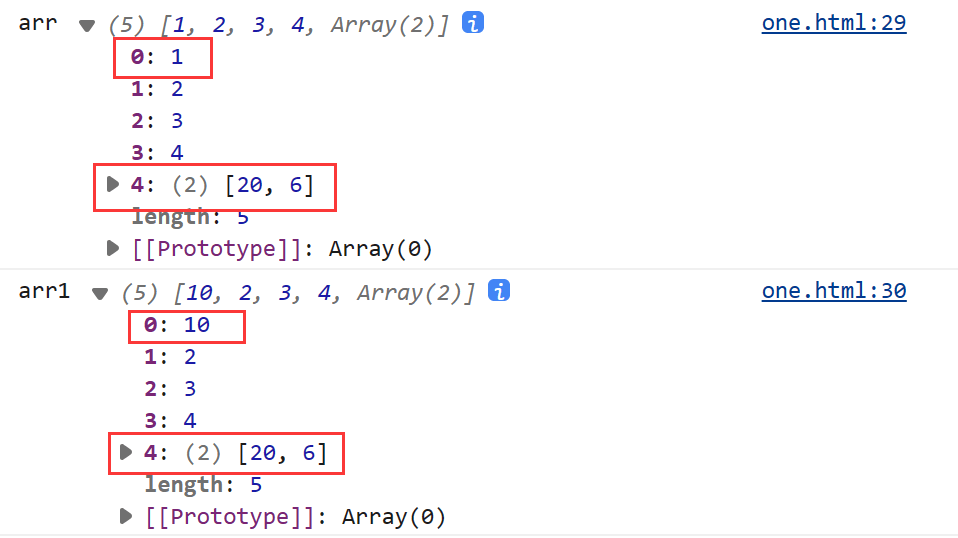
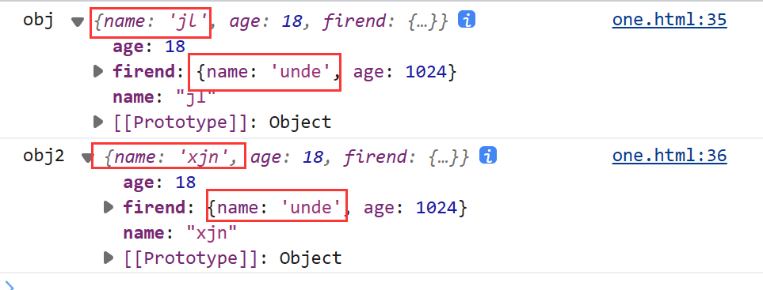
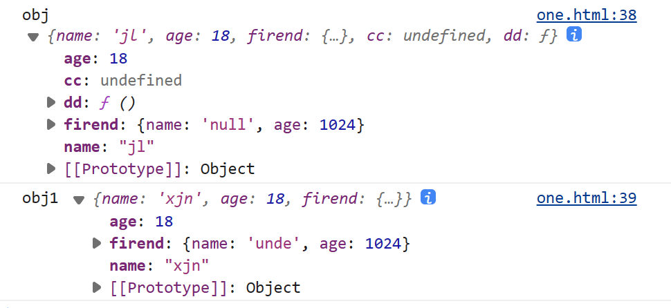
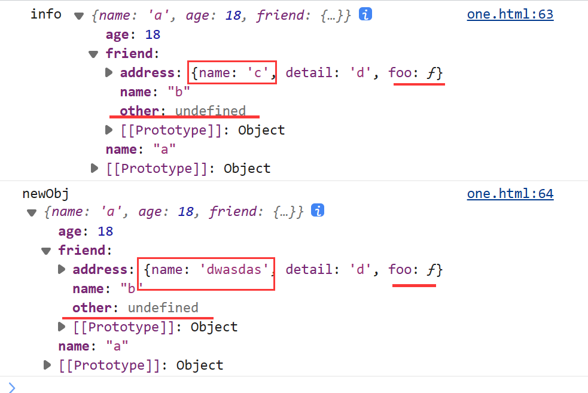

## 什么是深浅拷贝

JS 分为原始类型和引用类型，对于原始类型的拷贝，并没有深浅拷贝的区别，我们讨论的深浅拷贝都只针对引用类型。

- 浅拷贝复制的是对象的引用地址，没有开辟新的栈，复制的结果是两个对象指向同一个地址，所以修改其中一个对象的属性，另一个对象的属性也跟着改变了。
- 深拷贝会另外创造一个一模一样的对象，新对象跟原对象不共享内存，修改新对象不会改到原对象。


**这个的实现浅拷贝是一层深拷贝，多层浅拷贝，并不是完全的深拷贝**


## 实现浅拷贝的方法 - 数组

数组实现深拷贝可以使用以下方法

- 使用`slice()`
- 使用`concat()`
- ES6扩展运算符
- 使用`Array.form()`

```js
let arr = [1, 2, 3, 4, [5, 6]]

let arr1 = arr.slice()
let arr2 = [].concat(arr)
let arr3 = [...arr]
let arr4 = Array.from(arr)
```




## 实现浅拷贝的方法 - 对象

对象实现深拷贝可以使用以下方法

- 使用`Object.assign`
- ES6扩展运算

```js
let obj = {
    name:'jl',
    age: 18,
    firend:{
        name:'null',
        age:1024
    }
}

let obj1 = {...obj}
let obj2 = Object.assign({}, obj)
```




## 实现深拷贝 - JSON.stringify

用` JSON.stringify` 把对象转换成字符串，再用`JSON.parse`把字符串转换成新的对象

**但是当我们的对象中有function, undefind, symbol的时候，会将其忽略**

```js
let obj = {
    name:'jl',
    age: 18,
    firend:{
        name:'null',
        age:1024
    },
    cc: undefined,
    dd: function(){
        let dada = 'dasdas'
        }
}

let obj1 = JSON.parse(JSON.stringify(obj))
```




## 自己来实现一个深拷贝

```js
//工具函数，判断是不是对象
function isObject(value){
    //null,object,array都会返回object，但null是应该返回false
    //function也应该返回true
    const valueType = typeof value
    return (value !== null) && (valueType === 'object' || valueType === 'function')
}

function deepCopy(obj){
    //判断：如果是对象类型，才需要创建新对象。原始类型直接返回
    if(!isObject(obj)) return obj

    //判断是不是数组，是定义[],不是定义{}
    const newObj = Array.isArray(obj) ? [] :{}
    for(const key in obj){
        if(typeof obj[key] === 'function'){
            newObj[key] = obj[key]
        }else{
            newObj[key] = deepCopy(obj[key])
        }
    }

    return newObj
}

const info = {
    name:"a",
    age:18,
    friend:{
        name:"b",
        other: undefined,
        address:{
            name:"c",
            detail:"d",
            foo: function(){
                console.log('一层一层的');
            }
        }
    }
}       

const newObj = deepCopy(info)
newObj.friend.address.name = "dwasdas"
console.log('info', info);
console.log('newObj', newObj);
```




