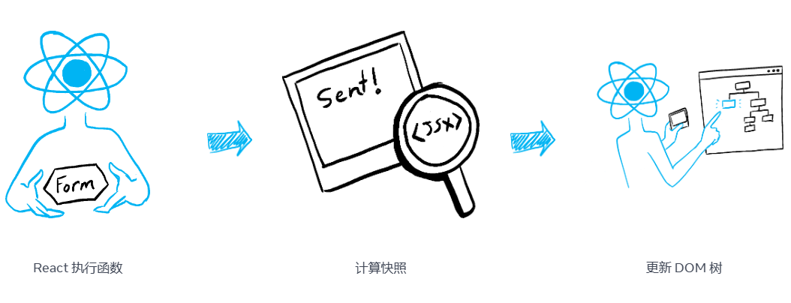
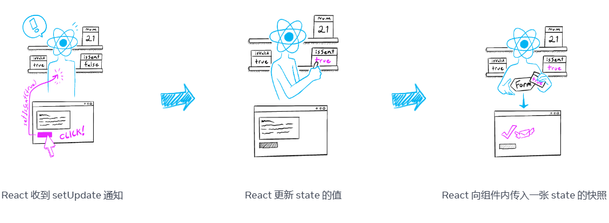

## state如同一张快照

> **也许 state 变量看起来和一般的可读写的 JavaScript 变量类似。但 state 在其表现出的特性上更像是一张快照。设置它不会更改你已有的 state 变量，但会触发重新渲染。**


### 设置 state 会触发渲染

你可能会认为你的用户界面会直接对点击之类的用户输入做出响应并发生变化。在 React 中，它的工作方式与这种思维模型略有不同。要使界面对输入做出反应，你需要设置其 state。

在这个例子中，当你按下 “send” 时，`setIsSent(true)` 会通知 React 重新渲染 UI：

```jsx
import { useState } from 'react';

export default function Form() {
  const [isSent, setIsSent] = useState(false);
  const [message, setMessage] = useState('Hi!');
  if (isSent) {
    return <h1>Your message is on its way!</h1>
  }
  return (
    <form onSubmit={(e) => {
      e.preventDefault();
      setIsSent(true);
      sendMessage(message);
    }}>
      <textarea
        placeholder="Message"
        value={message}
        onChange={e => setMessage(e.target.value)}
      />
      <button type="submit">Send</button>
    </form>
  );
}

function sendMessage(message) {
  // ...
}
```


当你单击按钮时会发生以下情况：

1. 执行 `onSubmit` 事件处理函数。
2. `setIsSent(true)` 将 `isSent` 设置为 `true` 并排列一个新的渲染。
3. React 根据新的 `isSent` 值重新渲染组件。

让我们仔细看看 state 和渲染之间的关系。


### 渲染会及时生成一张快照

**正在渲染** 就意味着 React 正在调用你的组件——一个函数。你从该函数返回的 JSX 就像是 UI 的一张及时的快照。它的 props、事件处理函数和内部变量都是 **根据当前渲染时的 state** 被计算出来的。

与照片或电影画面不同，你返回的 UI “快照”是可交互的。它其中包括类似事件处理函数的逻辑，这些逻辑用于指定如何对输入作出响应。React 随后会更新屏幕来匹配这张快照，并绑定事件处理函数。因此，按下按钮就会触发你 JSX 中的点击事件处理函数。

当 React 重新渲染一个组件时：

1. React 会再次调用你的函数
2. 函数会返回新的 JSX 快照
3. React 会更新界面以匹配返回的快照




作为一个组件的记忆，state 不同于在你的函数返回之后就会消失的普通变量。state 实际上“活”在 React 本身中——就像被摆在一个架子上！——位于你的函数之外。当 React 调用你的组件时，它会为**特定的那一次渲染提供一张 state 快照**。你的组件会在其 JSX 中返回一张包含一整套新的 props 和事件处理函数的 UI 快照 ，其中**所有的值**都是 **根据那一次渲染中 state 的值** 被计算出来的！



到这里概念可能比较抽象，没事，这里有个向你展示其运行原理的小例子。在这个例子中，你可能会以为点击“+3”按钮会调用 `setNumber(number + 1)` 三次从而使计数器递增三次。

看看你点击“+3”按钮时会发生什么：

```jsx
import { useState } from 'react';

export default function Counter() {
  const [number, setNumber] = useState(0);

  return (
    <>
      <h1>{number}</h1>
      <button onClick={() => {
        setNumber(number + 1);
        setNumber(number + 1);
        setNumber(number + 1);
      }}>+3</button>
    </>
  )
}
```


但是当你实践之后，每次点击只会让 `number` 递增一次！

**设置 state 只会为下一次渲染变更 state 的值**。在第一次渲染期间，`number` 为 `0`。这也就解释了为什么在 **那次渲染中的** `onClick` 处理函数中，即便在调用了 `setNumber(number + 1)` 之后，`number` 的值也仍然是 `0`：

```jsx
<button onClick={() => {
  setNumber(number + 1);
  setNumber(number + 1);
  setNumber(number + 1);
}}>+3</button>
```


以下是这个按钮的点击事件处理函数通知 React 要做的事情：

1. `setNumber(number + 1)`：`number` 是 `0` 所以 `setNumber(0 + 1)`
   - React 准备在下一次渲染时将 `number` 更改为 `1`
2. `setNumber(number + 1)`：`number` 是 `0` 所以 `setNumber(0 + 1)`
   - React 准备在下一次渲染时将 `number` 更改为 `1`
3. `setNumber(number + 1)`：`number` 是 `0` 所以 `setNumber(0 + 1)`
   - React 准备在下一次渲染时将 `number` 更改为 `1`

尽管你调用了三次 `setNumber(number + 1)`，但在 **这次渲染的** 事件处理函数中 `number` 会一直是 `0`，所以你会三次将 state 设置成 `1`。这就是为什么在你的事件处理函数执行完以后，React 重新渲染的组件中的 `number` 等于 `1` 而不是 `3`。

你还可以通过在心里把 state 变量替换成它们在你代码中的值来想象这个过程。由于 **这次渲染** 中的 state 变量 `number` 是 `0`，其事件处理函数看起来会像这样：

```jsx
<button onClick={() => {
  setNumber(0 + 1);
  setNumber(0 + 1);
  setNumber(0 + 1);
}}>+3</button>
```

对于下一次渲染来说，`number` 是 `1`，因此 **那次渲染中的** 点击事件处理函数看起来会像这样：

```jsx
<button onClick={() => {
  setNumber(1 + 1);
  setNumber(1 + 1);
  setNumber(1 + 1);
}}>+3</button>
```

这就是为什么再次点击按钮会将计数器设置为 `2`，下次点击时会设为 `3`，依此类推。


### 随时间变化的 state

好的，刚才那些很有意思。试着猜猜点击这个按钮会发出什么警告：

```jsx
import { useState } from 'react';

export default function Counter() {
  const [number, setNumber] = useState(0);

  return (
    <>
      <h1>{number}</h1>
      <button onClick={() => {
        setNumber(number + 5);
        alert(number);
      }}>+5</button>
    </>
  )
}
```

如果你使用之前替换的方法，你就能猜到这个提示框将会显示 “0”：

```jsx
setNumber(0 + 5);
alert(0);
```


但如果你在这个提示框上加上一个定时器， 使得它在组件重新渲染 **之后** 才触发，又会怎样呢？是会显示 “0” 还是 “5” ？猜一猜！

```jsx
import { useState } from 'react';

export default function Counter() {
  const [number, setNumber] = useState(0);

  return (
    <>
      <h1>{number}</h1>
      <button onClick={() => {
        setNumber(number + 5);
        setTimeout(() => {
          alert(number);
        }, 3000);
      }}>+5</button>
    </>
  )
}
```


答案还是5。惊讶吗？你如果使用替代法，就能看到被传入提示框的 state “快照”。

```jsx
setNumber(0 + 5);
setTimeout(() => {
  alert(0);
}, 3000);
```


到提示框运行时，React 中存储的 state 可能已经发生了更改，但它是**使用用户与之交互时状态的快照进行调度的**！

> **一个 state 变量的值永远不会在一次渲染的内部发生变化，** 即使其事件处理函数的代码是异步的。在 **那次渲染的** `onClick` 内部，`number` 的值即使在调用 `setNumber(number + 5)` 之后也还是 `0`。它的值在 React 通过调用你的组件“获取 UI 的快照”时就被“固定”了。


这里有个示例能够说明上述特性会使你的事件处理函数更不容易出现计时错误。下面是一个会在五秒延迟之后发送一条消息的表单。想象以下场景：

1. 你按下“发送”按钮，向 Alice 发送“你好”。
2. 在五秒延迟结束之前，将“To”字段的值更改为“Bob”。

你觉得 `alert` 会显示什么？它是会显示“你向 Alice 说了你好“还是会显示“你向 Bob 说了你好”？根据你已经学到的知识猜一猜，然后动手试一试：

```jsx
import { useState } from 'react';

export default function Form() {
  const [to, setTo] = useState('Alice');
  const [message, setMessage] = useState('Hello');

  function handleSubmit(e) {
    e.preventDefault();
    setTimeout(() => {
      alert(`You said ${message} to ${to}`);
    }, 5000);
  }

  return (
    <form onSubmit={handleSubmit}>
      <label> To:{' '}
        <select value={to} onChange={e => setTo(e.target.value)}>
          <option value="Alice">Alice</option>
          <option value="Bob">Bob</option>
        </select>
      </label>
      <textarea  placeholder="Message" value={message} onChange={e => setMessage(e.target.value)}/>
      <button type="submit">Send</button>
    </form>
  );
}
```


**React 会使 state 的值始终”固定“在一次渲染的各个事件处理函数内部。** 你无需担心代码运行时 state 是否发生了变化。

但是，万一你想在重新渲染之前读取最新的 state 怎么办？你应该使用 状态更新函数，等会将会介绍


## 把一系列 state 更新加入队列

> 设置组件 state 会把一次重新渲染加入队列。但有时你可能会希望在下次渲染加入队列之前对 state 的值执行多次操作。为此，了解 React 如何批量更新 state 会很有帮助。


### React 会对 state 更新进行批处理 

在下面的示例中，你可能会认为点击 “+3” 按钮会使计数器递增三次，因为它调用了 `setNumber(number + 1)` 三次：

```jsx
import { useState } from 'react';

export default function Counter() {
  const [number, setNumber] = useState(0);

  return (
    <>
      <h1>{number}</h1>
      <button onClick={() => {
        setNumber(number + 1);
        setNumber(number + 1);
        setNumber(number + 1);
      }}>+3</button>
    </>
  )
}
```

但是，你可能还记得上面中的内容，每一次渲染的 state 值都是固定的，因此无论你调用多少次 `setNumber(1)`，在第一次渲染的事件处理函数内部的 `number` 值总是 `0` 

但是这里还有另外一个影响因素需要讨论。**React 会等到事件处理函数中的** 所有 **代码都运行完毕再处理你的 state 更新。** 这就是为什么重新渲染只会发生在所有这些 `setNumber()` 调用 **之后** 的原因。

这可能会让你想起餐厅里帮你点菜的服务员。服务员不会在你说第一道菜的时候就跑到厨房！相反，他们会让你把菜点完，让你修改菜品，甚至会帮桌上的其他人点菜。

这让你可以更新多个 state 变量——甚至来自多个组件的 state 变量——而不会触发太多的 **重新渲染**。但这也意味着只有在你的事件处理函数及其中任何代码执行完成 **之后**，UI 才会更新。这种特性也就是 **批处理**，它会使你的 React 应用运行得更快。它还会帮你避免处理只更新了一部分 state 变量的令人困惑的“半成品”渲染。

**React 不会跨多个需要刻意触发的事件（如点击）进行批处理**——每次点击都是单独处理的。请放心，React 只会在一般来说安全的情况下才进行批处理。这可以确保，例如，如果第一次点击按钮会禁用表单，那么第二次点击就不会再次提交它。


### 在下次渲染前多次更新同一个 state 

如果你想在下次渲染之前多次更新同一个 state，你可以像 `setNumber(n => n + 1)` 这样传入一个根据队列中的前一个 state 计算下一个 state 的 **函数**，而不是像 `setNumber(number + 1)` 这样传入 **下一个 state 值**。这是一种告诉 React “用 state 值做某事”而不是仅仅替换它的方法。

```jsx
import { useState } from 'react';

export default function Counter() {
  const [number, setNumber] = useState(0);

  return (
    <>
      <h1>{number}</h1>
      <button onClick={() => {
        setNumber(n => n + 1);
        setNumber(n => n + 1);
        setNumber(n => n + 1);
      }}>+3</button>
    </>
  )
}
```


在这里，`n => n + 1` 被称为 **更新函数**。当你将它传递给一个 state 设置函数时：

1. React 会将此函数加入队列，以便在事件处理函数中的所有其他代码运行后进行处理。
2. 在下一次渲染期间，React 会遍历队列并给你更新之后的最终 state。

```jsx
setNumber(n => n + 1);
setNumber(n => n + 1);
setNumber(n => n + 1);
```

下面是 React 在执行事件处理函数时处理这几行代码的过程：

1. `setNumber(n => n + 1)`：`n => n + 1` 是一个函数。React 将它加入队列。
2. `setNumber(n => n + 1)`：`n => n + 1` 是一个函数。React 将它加入队列。
3. `setNumber(n => n + 1)`：`n => n + 1` 是一个函数。React 将它加入队列。

当你在下次渲染期间调用 `useState` 时，React 会遍历队列。之前的 `number` state 的值是 `0`，所以这就是 React 作为参数 `n` 传递给第一个更新函数的值。然后 React 会获取你上一个更新函数的返回值，并将其作为 `n` 传递给下一个更新函数，以此类推：

|   更新队列   | `n`  |   返回值    |
| :----------: | :--: | :---------: |
| `n => n + 1` | `0`  | `0 + 1 = 1` |
| `n => n + 1` | `1`  | `1 + 1 = 2` |
| `n => n + 1` | `2`  | `2 + 1 = 3` |

React 会保存 `3` 为最终结果并从 `useState` 中返回。

这就是为什么在上面的示例中点击“+3”正确地将值增加“+3”。


### 如果你在替换 state 后更新 state 会发生什么

这个事件处理函数会怎么样？你认为 `number` 在下一次渲染中的值是什么？

```jsx
<button onClick={() => {
  setNumber(number + 5);
  setNumber(n => n + 1);
}}>
```


这是事件处理函数告诉 React 要做的事情：

1. `setNumber(number + 5)`：`number` 为 `0`，所以 `setNumber(0 + 5)`。React 将 *“替换为 `5`”* 添加到其队列中。
2. `setNumber(n => n + 1)`：`n => n + 1` 是一个更新函数。 React 将 **该函数** 添加到其队列中。

在下一次渲染期间，React 会遍历 state 队列：

|   更新队列   |      `n`      |   返回值    |
| :----------: | :-----------: | :---------: |
| “替换为 `5`” | `0`（未使用） |     `5`     |
| `n => n + 1` |      `5`      | `5 + 1 = 6` |

React 会保存 `6` 为最终结果并从 `useState` 中返回。

> 你可能已经注意到，`setState(x)` 实际上会像 `setState(n => x)` 一样运行，只是没有使用 `n`！


### 如果你在更新 state 后替换 state 会发生什么 

让我们再看一个例子。你认为 `number` 在下一次渲染中的值是什么？

```jsx
<button onClick={() => {
  setNumber(number + 5);
  setNumber(n => n + 1);
  setNumber(42);
}}>
```

以下是 React 在执行事件处理函数时处理这几行代码的过程：

1. `setNumber(number + 5)`：`number` 为 `0`，所以 `setNumber(0 + 5)`。React 将 *“替换为 `5`”* 添加到其队列中。
2. `setNumber(n => n + 1)`：`n => n + 1` 是一个更新函数。React 将该函数添加到其队列中。
3. `setNumber(42)`：React 将 *“替换为 `42`”* 添加到其队列中。

在下一次渲染期间，React 会遍历 state 队列：

|   更新队列    |      `n`      |   返回值    |
| :-----------: | :-----------: | :---------: |
| “替换为 `5`”  | `0`（未使用） |     `5`     |
| `n => n + 1`  |      `5`      | `5 + 1 = 6` |
| “替换为 `42`” | `6`（未使用） |    `42`     |

然后 React 会保存 `42` 为最终结果并从 `useState` 中返回。


事件处理函数执行完成后，React 将触发重新渲染。在重新渲染期间，React 将处理队列。更新函数会在渲染期间执行，因此 **更新函数必须是纯函数** 并且只 **返回** 结果。不要尝试从它们内部设置 state 或者执行其他副作用。


### 命名惯例

通常可以通过相应 state 变量的第一个字母来命名更新函数的参数：

```jsx
setEnabled(e => !e);
setLastName(ln => ln.reverse());
setFriendCount(fc => fc * 2);
```

如果你喜欢更冗长的代码，另一个常见的惯例是重复使用完整的 state 变量名称，如 `setEnabled(enabled => !enabled)`，或使用前缀，如 `setEnabled(prevEnabled => !prevEnabled)`。


## 参考链接

[state 如同一张快照](https://react.docschina.org/learn/state-as-a-snapshot)

[把一系列 state 更新加入队列](https://react.docschina.org/learn/queueing-a-series-of-state-updates)


