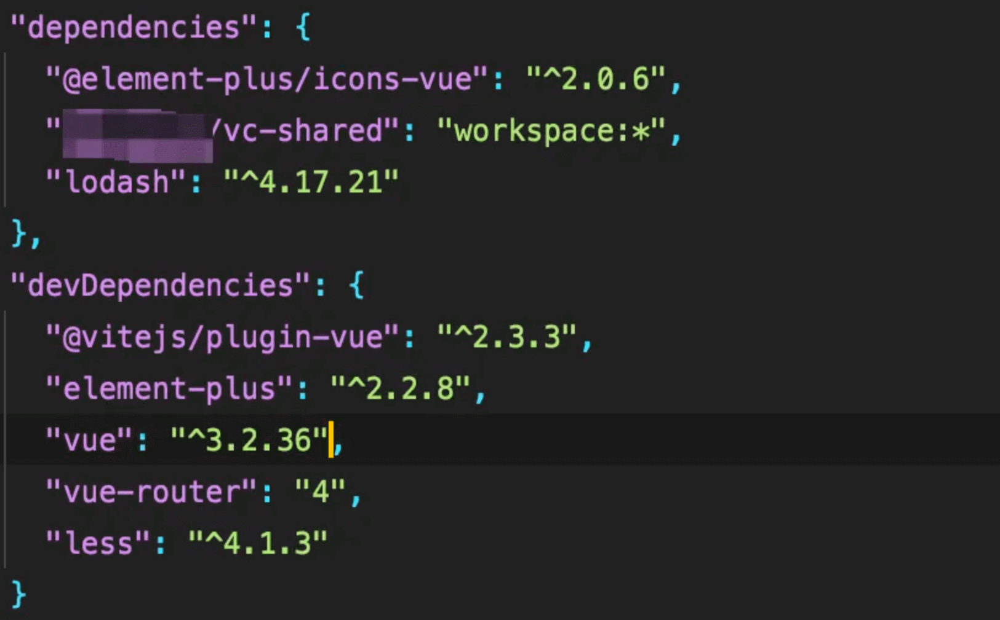
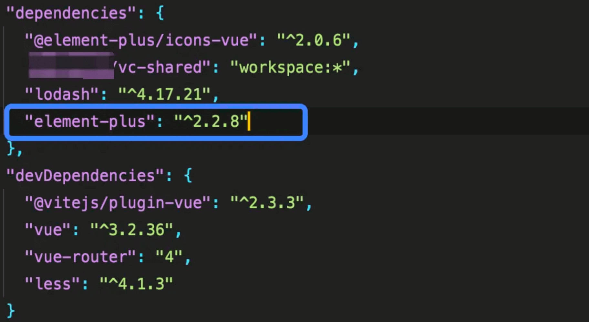
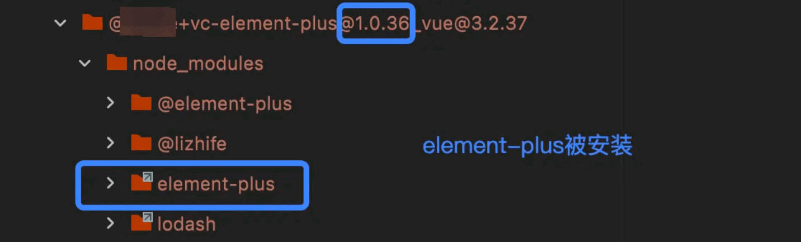

你是否真的理解 devDependencies 和 dependencies 的区别？如果不能确切的回答、理解还停留在模糊的阶段，那就接着往下看

> `devDependencies` 和 `dependencies` 简直就是自己最熟悉的陌生人了。对他们的理解一直都停留在表层，停留在百度、google里对他们区别的描述。以至于笔者一直都没有深刻的理解和认识，所以经常不知道装包时什么应该 `-D` 、 `-S`，现在查阅资料细致了解。事实上，如果你是在开发业务场景，不管放在`devDependencies`还是`dependencies`中，在打包的时候都会一起打包，但是如果你是在开发npm库，那会有一些比较细致的区别，可以看下文

本文的核心：理清 `devDependencies` 中的 dev ，到底指的是什么，搞清楚这个 dev 的概念。如此一来，`devDependencies` 和 `dependencies` 之间的区别就清晰可见了。

## 走出 “dev” 的误区

> 关于 “`devDependencies` 和 `dependencies` 有什么区别？” 这样的问题，我们随便百度、google一下都能出来很多个答案，其中**最广为流传的说法**大概就是：“ `devDependencies` 是开发环境下需要用到的依赖， `dependencies` 是生产环境下需要用到的依赖” 这样的话术，这也就是很容易让人走进误区的开端。至于为什么这么说，我们接着往下看。

### `devDependencies` 的 dev 理解误区

其中最大的误区便是对 “`dev`” 的理解。这么说可能不够清晰，笔者把它转述成一个问题：

- 安装在 `devDependencies` 中的依赖，在项目执行 `build` 的时候会不会被打包进 **dist** 产物中？

上面这个问题其实很简单，大家**不要掉到笔者这个提问的坑里**。我们从正常的项目打包流程分析（不管是 webpack 还是 vite，打包的核心步骤都类似），**这里从最简化的进行分析，只为了针对上述问题。**

1. 初始化配置
2. **项目入口**
3. **依赖解析**
4. loader处理
5. ... ...

好了，看到这样的打包流程（集中关注**第2、3**点），大家应该也意识到一点：**项目打包跟 `devDependencies` 这个字段并没什么关系**。这样一来，上述问题的答案也就很清晰了。只要是项目中用到的依赖（且安装到 `node_modules` 中），不管这个依赖是放在 `devDependencies` 还是放在 `dependencies` ，都会被打包工具解析、构建，最后都打进 dist 产物中。

总结：**生产打包 与 `devDependencies` 字段无关**。`devDependencies` 中的 `dev` **并不是**指我们 dev server 时候的 `dev` ，不能简单的把 dev 理解成当前项目的 “开发环境” 。接着往下，我们通过真实的装包来验证一下这个结论。

### 验证 devDependencies

这里可以做一个实验，来验证在打包过程中，是否会区分`devDependencies`和`dependencies`

第一步：我们首先安装一个loadsh的依赖，将他的位置放在`dependencies`，并在他的源码中添加：`console.log('这是loadsh源码')`

第二步：在我们打包后对打包文件进行全局搜索，可以搜到我们的`console.log`

第三步：我们将loadsh放到`devDependencies`中删除依赖重新安装依赖重新添加`console.log('这是loadsh源码')`重新打包

第四步：再次对打包后的文件进行全局搜索，还是可以搜到我们的`console.log`

证明：不管我们的依赖是放在`devDependencies`还是`dependencies`中，在打包的时候都会一起打包

所以，通过这个实践，就为了搞清楚一个点，`devDependencies` 的 dev 并不是指我们在业务项目开发中的 dev 和 prod，它甚至跟打包时候的 `mode` 扯不上关系

## 『npm包』的 devDependencies

> 这里提到了 **npm包** ，敏感的同学可能就猜到 `devDependencies` 和 `dependencies` 的真正区别了。其实 `devDependencies` 这个字段的 **dev** 的真正含义，更多是指 **npm包** 的开发阶段所需要的依赖

### npm包中的dev

怎么理解前面提到的 npm包 开发阶段所需要的依赖？我们大概回忆一下npm包从 开发 - 发包 的流程。

1. npm**初始化**——`package.json`。想要开发一个 npm包，最先一定是要进行初始化，执行命令 `npm init`，然后填写一些信息比如 name 、 version 、 description ...此时便会生成一个 `pakcage.json` 文件。
2. npm包的**开发**。这个阶段，也就是对 npm包 功能实现的阶段，我们会开始编写代码。然而，我们在编写npm包的时候，可能需要用到其他的库，这个时候我们就需要去**安装其他的库**。
3. npm包的**打包、发布**。npm包开发完成后，当然就是要对我们的项目进行打包，然后通过 `npm publish` 命令去发布我们的npm包。

整个 npm包的实现 大概就是这么一个流程。其中第二点提到了：**如果开发过程中需要用到其他的工具库，就要把依赖安装到当前项目里**！这就涉及到本文的重点了，要怎么安装呢？-D、还是-S？不同的命令会带来怎么样不同的后果呢？

现在，我门来通过一个具体案例开探讨这个问题的答案。

场景描述：现在要开发一个基于 element-plus 的二次封装的组件库，所以在开发调试阶段，笔者需要安装 `vue3` 、 `element-plus` ... 等依赖，以辅助我们开发组件。

### 实验一

将 `vue3` 、 `element-plus` 都放在组件库package.json的 `devDependencies` 中，然后将组件库发包。最后，在业务项目中安装该组件库，看依赖情况。

第一步：首先在业务项目中安装组件库 vc-element-plus。依赖如下图：

第二步：删除所有的node_modules，重新安装依赖

第三步：查看安装的 vc-element-plus 内部的依赖安装情况：

可以清晰看出，放在 `dependencies` 字段中的三个依赖包：`@element-plus/icons-vue` 、 `@xxx/vc-shared` 、 `lodash` 都被安装到组件库的 node_modules 中，而组件库位于**当前的业务项目**的 node_modules 中。换句话说，业务项目中拥有了组件库 `dependencies` 中的依赖包。

这里可以进行猜想，实验2中，`element-plus` 将被装到组件库的内部依赖中。紧接着，我们进行实验二验证一下猜想。

### 实验二

将 `vue3` 放在组件库package.json的 `devDependencies` 中，`element-plus` 放在组件库package.json的 `dependencies` 中，然后将组件库发包。最后，在业务项目中安装该组件库，看依赖情况。

第一步：首先在业务项目中安装组件库 vc-element-plus（版本号对比**实验一**已经不同）。依赖如下图：

第二步：删除所有的node_modules，重新安装依赖

第三步：查看安装的 vc-element-plus 内部的依赖安装情况：

ok，这样一对比，应该就很清晰了。很明显，实验二中安装了4个依赖，其中多出来的就是我们实验二中放进 `dependencies` 中 `element-plus`。（注意，`@element-plus`是图标那些的，跟`element-plus`不是同一个依赖源）

**到这里，大家应该对 `devDependencies` 和 `dependencies` 之间的区别有一个清晰的认识了。至于项目装包中什么时候使用 `-D`，什么时候使用 `-S` 也有自己的理解了**

### 总结 `devDependencies` 和 `dependencies` 的区别

结论：`devDependencies` 和 `dependencies`的区别核心体现在 **npm包** 中。只要开发的项目是**发npm包**提供给外部、其他业务项目使用的，需要非常注意依赖的安装地方，因为搞不好很容易在业务使用中会出现bug。而如果只是自己项目用，**不需要发npm包**的话，把依赖安装到 `devDependencies` 或者 `dependencies` 中，实质上是没有任何区别的。

为什么在开发 npm包 的时候 不严格区分 `devDependencies` 、 `dependencies` 进行装包可能会导致业务项目的使用中出现bug呢？笔者举一个例子来加深理解：

- 假设npm包开发者不小心把 vue3 的依赖写到了 `dependencies` 中（用于开发调试的），版本是 `3.0.36`。
- 业务项目自身用了 `vue@3.0.0` 的情况下，安装了这个 npm包 ，由于 npm包 中的 `dependencies` 有 `vue@3.0.36` 这个依赖，此时会在装 npm包 的同时安装36版本的vue。
- 由于 npm包中会用到vue，代码是这样引入的：`import { onMount } from 'vue'`，此时，npm包会在自己内部的 `node_modules` 中找到 `vue@3.0.36` 的包并使用，此时就会产生 2 个 vue3 实例，就很容易出现一些奇怪的bug。（业务项目的`vue@3.0.0` 和 npm包的`vue@3.0.36`）
- **这里还要注意一点就是 `externals`** 。有同学可能会说，npm包打包的时候会 `externals` 掉第三方的库，比如上述中的 vue3 ，`externals` 只是保证 vue3 的代码不打包进 npm包 的代码中而已。

经过笔者上述的场景列举，大家应该都能get到，如果开发npm包中不严格区分 `devDependencies` 、 `dependencies` 的依赖安装，可能会导致用户处在使用 npm包 的时候出现问题。所以，看完本文能清晰理解 `devDependencies` 和 `dependencies` 的区别了吗？

## 参考链接

[你真的理解 devDependencies 和 dependencies 的区别吗？ - 掘金 (juejin.cn)](https://juejin.cn/post/7135795969370619918)