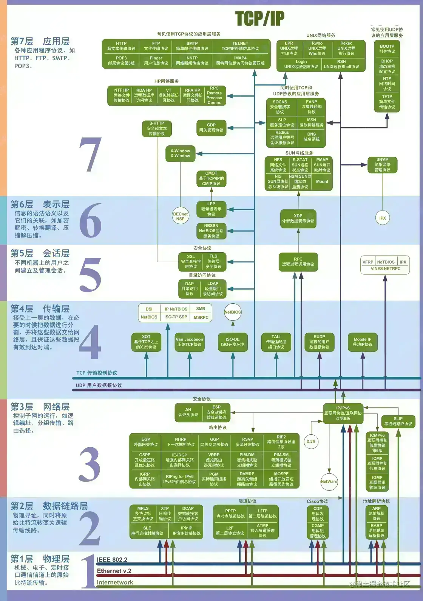

## 计算机网络体系结构

OSI七层协议记忆：“物联网淑慧试用”

## OSI七层模型各层功能

物理层传输01比特流，数据链路层传输帧，网络层传输分组，运输层传输报文段

**物理层**：主要任务是在物理媒体上实现比特流的透明传输

**数据链路层**：主要任务是把网络层传下来的数据报组装成帧（数据链路层的传输单位是帧）

**网络层**：主要任务是将分组从源端传到目的端，为分组交换网上的不同主机提供通讯服务（网络层的传输单位是数据报）

**传输层**：负责主机中两个进程的通信，向用户提供可靠地端到端服务（传输单位是报文段或用户数据段）

**会话层**：负责维扩两个结点之间的传输连接，以便确保点到点传输不中断，以及管理数据交换等功能

**表示层**：主要任务是用于处理通信系统中交换信息的表示方式，主要包括数据格式变换、数据加密与解密、数据压缩与恢复等功能

**应用层**：为应用软件提供了很多服务，比如文件服务器、数据库服务、电子邮件与其他网络软件服务

## 相关协议

## 补充

- SSL/TLS作用于应用层和运输层之间。如果硬要说在哪个位置，那就是：会话层

