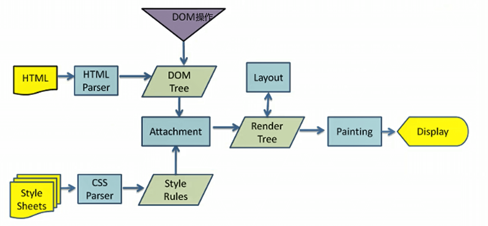
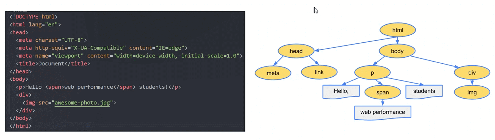
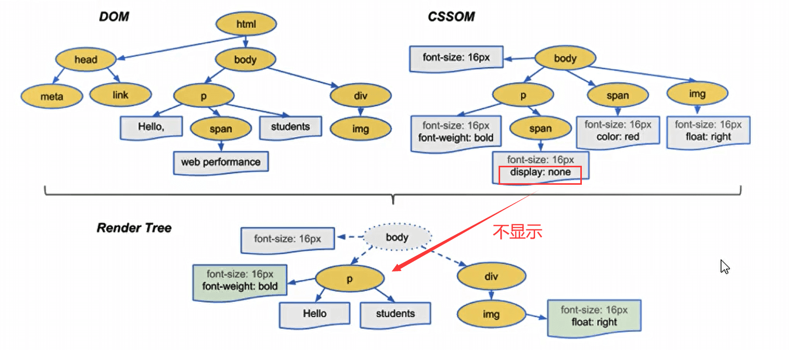

**当我们向浏览器的地址栏输入URL的时候，网络会进行一系列的操作，最终获取到我们所需要的文件，如何交给浏览器进行渲染**

我们所关注的问题也就是：

- **如何获取到我们所需要的文件**
- **浏览器是如何渲染的**


## 大致的执行顺序

- URL解析

- DNS 解析：缓存判断 + 查询IP地址
- TCP 连接：TCP 三次握手
- SSL/TLS四次握手（只有https才有这一步）
- 浏览器发送请求
- 服务器响应请求并返回数据
- 浏览器解析渲染页面
- 断开连接：TCP 四次挥手


## URL解析

浏览器先会判断输入的字符是不是一个合法的URL结构，如果不是，浏览器会使用搜索引擎对这个字符串进行搜索


**URL结构组成**

`https://www.example.com:80/path/to/myfile.html?key1=value1&key2=value2#anchor`

- 协议：`https://`
  - 互联网支持多种协议，必须指明网址使用哪一种协议，默认是 HTTP 协议。
  - 也就是说，如果省略协议，直接在浏览器地址栏输入`www.example.com`，那么浏览器默认会访问`http://www.example.com`。
  - HTTPS 是 HTTP 的加密版本，出于安全考虑，越来越多的网站使用这个协议。
- 主机：`www.example.com`
  - 主机（host）是资源所在的网站名或服务器的名字，又称为域名。上例的主机是`www.example.com`。
  - 有些主机没有域名，只有 IP 地址，比如`192.168.2.15`。
- 端口：`https://`
  - 同一个域名下面可能同时包含多个网站，它们之间通过端口（port）区分。
  - “端口”就是一个整数，可以简单理解成，访问者告诉服务器，想要访问哪一个网站。
  - 默认端口是80，如果省略了这个参数，服务器就会返回80端口的网站。
  - 端口紧跟在域名后面，两者之间使用冒号分隔，比如`www.example.com:80`。
- 路径：`/path/to/myfile.html`
  - 路径（path）是资源在网站的位置。比如，`/path/index.html`这个路径，指向网站的`/path`子目录下面的网页文件`index.html`
  - 互联网的早期，路径是真实存在的物理位置。现在由于服务器可以模拟这些位置，所以路径只是虚拟位置
  - 路径可能只包含目录，不包含文件名，比如`/foo/`，甚至结尾的斜杠都可以省略
  - 这时，服务器通常会默认跳转到该目录里面的`index.html`文件（即等同于请求`/foo/index.html`），但也可能有其他的处理（比如列出目录里面的所有文件），这取决于服务器的设置
  - 一般来说，访问`www.example.com`这个网址，很可能返回的是网页文件`www.example.com/index.html`
- 查询参数：`?key1=value1&key2=value2`
  - 查询参数（parameter）是提供给服务器的额外信息。参数的位置是在路径后面，两者之间使用`?`分隔
  - 查询参数可以有一组或多组。每组参数都是键值对（key-value pair）的形式，同时具有键名(key)和键值(value)，它们之间使用等号（`=`）连接。比如，`key1=value`就是一个键值对，`key1`是键名，`value1`是键值
  - 多组参数之间使用`&`连接，比如`key1=value1&key2=value2`
- 锚点：`#anchor`
  - 锚点（anchor）是网页内部的定位点，使用`#`加上锚点名称，放在网址的最后，比如`#anchor`
  - 浏览器加载页面以后，会自动滚动到锚点所在的位置
  - 锚点名称通过网页元素的`id`属性命名


## DNS解析

DNS（Domain Names System），域名系统，是互联网一项服务，是进行域名和与之相对应的 IP 地址进行转换的服务器


### 第一步：缓存判断

判断是正确的URL格式之后，DNS会在我们的缓存中查询是否有当前域名的IP地址

基本步骤：

- 浏览器缓存：浏览器检查是否在缓存中
- 操作系统缓存：操作系统DNS缓存，去本地的hosts文件查找
- 路由器缓存：路由器DNS缓存
- ISP 缓存： ISP DNS缓存（ISP DNS 就是在客户端电脑上设置的首选 DNS 服务器，又称本地的DNS服务器）


在经历上述缓存查找还没有找到的话，就进行下一步查询操作


### 第二步：查询IP地址

浏览器会去根域名服务器中查找，如果还没有就去顶级域名服务器中查找，最后是权威域名服务器。

找到IP地址后，将它记录在缓存中，供下次使用。


## TCP连接：三次握手

### 简单理解

简单的理解就是：

```
客户端：hello，你好，你是server吗？
服务端：hello，你好，我是server，你是client吗
客户端：yes，我是client
开始数据传输.....
——————————————————————————————————————————
客户端(男人)：我喜欢你，咱俩处对象吧
服务端(女人)：我也喜欢你，我答应你
客户端(男人)：太棒了，我们现在去看电影吧
开始数据传输.....
```

然后双方就正确建立连接，开始传输数据


### 详细分析


- 第一次握手：客户端发送一个带 `SYN=1，Seq=x` 的数据包到服务器端口
  - `第一次握手，由浏览器发起，告诉服务器我要发送请求了`
  - SYN(synchronous)：请求建立连接
  - seq(sequence)：随机序列号
  - 请注意TCP规定SYN被设置为1的报文段**不能携带数据**但要消耗掉一个序号。
- 第二次握手：服务器发回一个带 `SYN=1， ACK=1， seq=y, ack= x+1` 的响应包以示传达确认信息
  - `第二次握手，由服务器发起，告诉客户端我准备接受了，你赶紧发送吧`
  - ACK(acknowledgement)：确认，是一个确定字符
  - ack：**ack=上一次的seq+1**，作用是接受上一次远端主机传来的seq，加一然后再传给客户端，提示客户端已经成功接收上一次所有数据
  - **请注意这个报文段不能携带数据**，因为它是SYN被设置为一的报文段但同样要消耗掉一个序号
- 第三次握手：客户端再回传一个带 `ACK，seq = x + 1,  ack = y + 1` 的数据包，代表“握手结束”
  - `第三次握手，由浏览器发送，告诉服务器，我马上就发了，准备接受吧`
  - **确认报文段可以携带数据**。但**如果不携带数据则不消耗序号**，在这种情况下所发送的下一个数据报文段的序号仍是x + 1

然后双方就正确建立连接，开始传输数据


## SSL/TLS四次握手

**HTTPS 建立连接的过程，先进行 TCP 三次握手，再进行 TLS 四次握手**（仅对https）

因为 HTTPS 都是基于 TCP 传输协议实现的，得先建立完可靠的 TCP 连接才能做 TLS 握手的事情。

### 第一次握手：客户端发出请求Client Hello

- 首先，客户端先向服务器发出加密通信的请求，这被叫做clienthello请求。

- 在这一步，客户端主要向服务器提供以下信息：
  - 支持的协议版本，比如TLS1.0版本
  - 支持的加密方法，比如RSA公钥加密
  - 一个客户端生成的**随机数(client random)**, 稍后用于生成对话密钥(session key)


### 第二次握手：服务器回应Server Hello

- 服务器收到客户端请求后，向客户端发出回应，这叫做serverhello

- 这一步服务器主要干三件事：
  - 确认使用的加密通信协议版本，比如TLS1.00版本。如果游览器与服务器支持的版本不一致，服务器关闭加密通信
  - 确认使用的加密方法（客户端所支持），比如RSA公钥加密
  - 将服务器证书、非对称加密的公钥，以及一个随机数(Server random)发送给客户端游览器


### 客户端验证证书

客户端收到服务器回应以后，首先验证服务器证书，验证手段就是执行如下三种检查：

- 检查证书是否已过期；
- 检查证书中的域名与实际域名是否一致
- 检查证书是否是可信机构颁布的

如果，上述过程中有任何一个环节发现问题，那么浏览器就会向访问者显示一个警告，由其选择是否还要继续通信。如果证书受信任，或者是用户接受了不受信的证书，**浏览器会生成一串新的随机数（Premaster secret ）**。


### 第三次握手：客户端回应

此时，浏览器会根据前三次握手中的三个随机数：

- **Client random**
- **Server random**
- **Premaster secret**

通过一定的算法来**生成 “会话密钥” （Session Key）**，这个会话密钥就是接下来双方进行**对称加密解密**使用的密钥！


### 第四次握手：服务端回应

服务端收到客户端的回复，利用已知的加密解密方式进行解密，服务器收到客户端的第三个随机数（ Premaster secret） 之后，使用同样的算法计算出 “会话密钥” （Session Key）。


至此，整个握手阶段全部结束。接下来，客户端与服务器进入加密通信，就完全是使用普通的 HTTP 协议，只不过用 “会话密钥” 加密内容。（非对称加密解密将不再使用，接下来完全由对称加密接手了，因为密钥已经安全的传送给了通信的双方）


### 总结

1. 客户端请求建立SSL链接，并向服务发送一个**随机数–Client random**和**客户端支持的加密方法**，比如RSA公钥加密，此时是明文传输

2. 服务端回复一种客户端支持的**加密方法**、**一个随机数–Server random**、授信的**服务器证书**和**非对称加密的公钥**

3. 客户端收到服务端的回复后利用**服务端的公钥**，加上**新的随机数–Premaster secret** 通过服务端下发的**公钥及加密方法**进行加密，发送给服务器

4. 服务端收到客户端的回复，利用**已知的加解密方式进行解密**，同时利用**Client random、Server random和Premaster secret**通过一定的算法生成HTTP链接数据传输的对称加密**key – session key**


## 浏览器发送请求

连接建立成功之后，浏览器向服务器发送**HTTP请求报文**，来获取自己想要的数据


**请求报文由请求行、请求头、空行、请求体四部分组成**


- **请求行**：有请求方法、请求的url、http协议及其版本
- **请求头**：把浏览器的一些基础信息告诉服务器。比如包含了浏览器所使用的操作系统、浏览器内核等信息，以及当前请求的域名信息、浏览器端的 Cookie 信息等
- **空行**：最后一个请求头之后是一个空行，发送回车符和换行符，通知服务器以下不再有请求头
- **请求体**（报文主体/请求中文）：当使用POST, PUT等方法时，通常需要客户端向服务器传递数据。这些数据就储存在**请求正文**中。在请求包头中有一些与请求正文相关的信息，例如: 现在的Web应用通常采用Rest架构，请求的数据格式一般为json。这时就需要设置`Content-Type: application/json`。


## 服务端响应请求并返回数据

服务器对http请求报文进行解析，并给客户端发送**HTTP响应报文**对其进行响应


**HTTP响应报文也是由状态行、响应头、空行、响应体四部分组成**


- 响应行/状态行：由 HTTP 版本协议字段、状态码和状态码的描述文本 3 个部分组成
- 响应头：用于指示客户端如何处理响应体，告诉浏览器响应的类型、字符编码和字节大小等信息
- 空行：最后一个响应头部之后是一个空行，发送回车符和换行符，通知服务器以下不再有响应头部。
- 响应体：返回客户端所需数据

这个时候浏览器拿到我们服务器返回的HTML文件，可以开始解析渲染页面


## 浏览器解析渲染页面

**当我们经历了上述的一系列步骤之后，我们的浏览器就拿到了我的HTML文件那么它又是如何解析整个页面并且最终呈现出我们的网页呢?**

### 渲染流程图

**简图：**从这张图上我们可以得出一个重要的结论：**下载CSS文件并不会阻塞HTML的解析**


**详图**：




### 详细解析步骤

### 解析一：HTML解析过程

默认情况下服务器会给浏览器返回index.html文件，所以解析HTML是所有步骤的开始：解析HTML，会 **构建DOM Tree**

当遇到我们的script文件的时候，我们是不能进行去构建DOM Tree的。它会**停止继续构建，首先下载JavaScript代码，并且执行JavaScript的脚本，只有等到JavaScript脚本执行结束后，才会继续解析HTML，构建DOM树**。

具体的相关细节看下面的script与页面解析




### 解析二：生成CSS规则

- 在解析的过程中，如果遇到CSS的link元素，那么会由浏览器负责下载对应的CSS文件
  - 注意:下载CSS文件是不会影响DOM的解析的

- 浏览器下载完CSS文件后，就会对CSS文件进行解析，解析出对应的规则树
  - 我们可以称之为 **CSSOM** (CSS Object Model，**CSS对象模型**）


### 解析三：构建Render Tree

当有了 **DOM Tree 和 CSSOM Tree** 后，就可以两个结合来 **构建 Render Tree**



- 注意一：**link元素不会阻塞DOM Tree的构建过程，但是会阻塞Render Tree的构建过程**
  - 因为Render Tree在构建时，需要对应的CSSOM Tree。当我们DOMTree解析完成的时候，如果CSSOM Tree没解析完成就会阻塞。当然一般情况下浏览器会进行优化处理，不会傻傻的等待

- 注意二：**Render Tree和DOMTree并不是一一对应的关系**
  - 比如对于display为none的元素，压根不会出现在render tree中


### 解析四：布局(layout)和绘制(Paint)

- 第四步是在**渲染树(Render Tree)**上运行 **布局(Layout)** 以计算每个节点的几何体。
  - 渲染树会 表示 **要显示哪些节点以及其他样式**，但是 **不表示 每个节点的尺寸、位置** 等信息
  - **布局的主要目的是为了确定呈现树中所有节点的宽度、高度和位置信息**
- 第五步是将每个节点 **绘制(Paint)** 到屏幕上
  - 在绘制阶段，浏览器将布局阶段计算的 每个frame转为屏幕上实际的像素点
  - 包括 将元素的可见部分进行绘制，比如文本、颜色、边框、阴影、替换元素（比如img）


### 特殊解析：composite合成

- 绘制的过程,可以将布局后的元素**绘制到多个合成图层中**【这是浏览器的一种优化手段】

- 默认情况下，标准流中的内容都是被绘制在**同一个图层**(Layer)中的

- 而一些特殊的属性，会创建一个新的合成层（Compositinglayer )，并且新的图层可以利用GPU来加速绘制
  - 因为每个合成层都是单独渲染的

- 那么哪些属性可以形成新的合成层呢?常见的一些属性：

  - 3D transforms

  - video、canvas、iframe
  - opacity动画转换时
  - position: fixed
  - will-change:一个实验性的属性，提前告诉浏览器元素可能发生哪些变化
  - animation或 transition设置了opacity、transform

- 分层确实可以提高性能，但是它以内存管理为代价，因此不应作为web性能优化策略的一部分过度使用


### 其他相关概念

#### 回流

- 回流reflow(也可以称之为重排)
  - 第一次确定节点的大小和位置，称之为**布局**(layout)
  - 之后对节点的大小、位置修改 **重新计算** 称之为**回流**
- 什么情况下引起回流呢?
  - 比如DOM结构发生改变（添加新的节点或者移除节点)
  - 比如改变了布局(修改了width、height、padding、font-size等值)
  - 比如窗口resize(修改了窗口的尺寸等)
  - 比如调用getComputedStyle方法获取尺寸、位置信息


#### 重绘

- 重绘repaint【字面理解就是对页面再做绘制】
  - 第一次渲染内容称之为**绘制**(paint)
  - 之后重新渲染称之为**重绘**
- 什么情况下会引起重绘呢?
  - 比如修改背景色、文字颜色、边框颜色、样式等


#### 联系

- 回流一定会引起重绘，所以回流是一件很消耗性能的事情。
- 所以在开发中要尽量避免发生回流
  - 修改样式时尽量一次性修改【比如通过cssText修改，比如通过添加class修改】
  - 尽量 **避免频繁的操作DOM**【我们可以在一个DocumentFragment或者父元素中将要操作的DOM操作完成，再一次性的操作】
  - 尽量 **避免通过getComputedStyle获取尺寸、位置等信息**
  - 对某些元素使用position的absolute或者fixed【并不是不会引起回流，而是开销相对较小，不会对其他元素造成影响】


### script元素

#### script元素和页面联系

- 我们现在已经知道了页面的渲染过程，但是JavaScript在哪里呢?
  - 事实上，浏览器在解析HTML的过程中，**遇到了 script元素是不能继续构建DOM树的**
  - 它会 **停止继续构建，首先下载JavaScript代码，并且执行JavaScript的脚本**
  - 只有 **等到JavaScript脚本执行结束后，才会继续解析HTML，构建DOM树**
- 为什么要这样做呢?
  - 这是 **因为JavaScript的作用之一就是操作DOM，并且可以修改DOM**
  - 如果我们等到DOM树构建完成并且渲染再执行JavaScript会造成严重的回流和重绘，影响页面的性能
  - 所以会在遇到script元素时，优先下载和执行JavaScript代码，再继续构建DOM树
- 但是这个也往往会带来新的问题，特别是现代页面开发中:
  - 在目前的开发模式中（比如Vue、React)，脚本往往比HTML页面更“重”，处理时间需要更长
  - 所以会造成页面的解析阻塞，在脚本下载、执行完成之前，用户在界面上什么都看不到
- 为了解决这个问题，script元素给我们提供了两个属性(attribute) : defer和async


#### defer属性

- defer属性告诉浏览器 **不要等待脚本下载，而继续解析HTML，构建DOM Tree**

  - 脚本会 **由浏览器来进行下载，但是不会阻塞DOM Tree的构建过程**
  - 如果脚本提前下载好了，它会 **等待DOM Tree构建完成，在DOMContentLoaded事件之前先执行defer中的代码**

- 所以DOMContentLoaded总是会等待defer中的代码先执行完成

  - ```html
    <script src="./foo.js" defer></script>
    <script>
    	 window.addEventListener("DOMContentLoaded",()=>{
             console.log("DOMContentLoaded");
         })
    </script>
    ```

- **多个带defer的脚步是可以保持正确的执行顺序的**

- 从某种角度来说，defer可以提高页面的性能，并且推荐放到head元素中

- 注意：defer仅适用于外部脚本，对于script默认内容会被忽略


#### async属性

- async特性与defer有些类似，它也能够让脚本不阻塞页面
- async是让一个脚本完全独立的:
  - 浏览器 **不会因async 脚本而阻塞**(与defer类似)
  - **async脚本不能保证顺序，它是独立下载、独立运行，不会等待其他脚本**
  - **async不会能保证在DOMContentLoaded之前或者之后执行**


- defer通常用于需要在文档解析后操作DOM的JavaScript代码，并且对多个script文件有顺序要求的
- async通常用于独立的脚本，对其他脚本，甚至DOM没有依赖的


## 断开连接：TCP 四次挥手

在渲染完成后，浏览器可能会继续加载页面中的其他资源，如异步加载的内容或者通过JavaScript生成的动态内容。

而在此过程中，如果没有其他资源需要加载，浏览器将与服务器之间的TCP连接断开。


### 简单理解

```
主动方：我已经关闭了向你那边的主动通道了，这是我最后一次给你发消息了，之后只能被动接收你的信息了
被动方：收到你通道关闭的信息
被动方：那我也告诉你，我这边向你的主动通道也关闭了
主动方：最后收到你关闭的信息，OK结束
断开连接，结束通讯
————————————————————————————————————————————————————————————————————————————
提出分手的可能是男生（客户端），也可能是女生（服务端）
主动方：分手吧，我不喜欢你了！
被动方：行，你等我忙完手上的工作我在收拾你！
被动方：我忙完了，分手就分手！
主动方：好，好聚好散，拜拜！
断开连接，结束通讯
```


### 详细分析

由于**TCP连接是全双工的**，因此，每个方向都必须要单独进行关闭，这一原则是当一方完成数据发送任务后，发送一个FIN来终止这一方向的连接，收到一个FIN只是意味着这一方向上没有数据流动了，即不会再收到数据了，但是在这个TCP连接上仍然能够发送数据，直到这一方向也发送了FIN。首先进行关闭的一方将执行主动关闭，而另一方则执行被动关闭。

**任何一方都可以在数据传送结束后发出连接释放的通知，所有主动发起关闭请求可以是客户端，也可以是服务端**

**这里我们假设是由客户端先主动发起关闭请求**


- 第一次挥手：TCP客户进程会发送TCP连接释放报文段，并进入终止等待1(FIN-WAIT-1)状态。
  - FIN：终止位，表示断开TCP连接
  - TCP规定终止位FIN等于1的报文段即使不携带数据，也要消耗掉一个序号
- 第二次挥手：TCP服务器进程收到TCP连接释放报文段后，会发送一个普通的TCP确认报文段并进入关闭等待(CLOSE-WAIT)状态。
  - 序号seq字段的值设置为v，与之前收到的TCP连接释放报文段中的确认号匹配
  - TCP客户进程收到TCP确认报文段后就进入终止等待2(FIN-WAIT-2)状态，等待TCP服务器进程发出的TCP连接释放报文段
  - 这时的TCP连接属于半关闭状态，也就是TCP客户进程已经没有数据要发送了。但如果TCP服务器进程还有数据要发送，TCP客户进程仍要接收，也就是说从**TCP服务器进程到TCP客户进程这个方向的连接并未关闭，这个状态可能要持续一段时间。**
- 第三次挥手：TCP服务器进程发送TCP连接释放报文段
  - 假定序号seq字段的值为w，这是因为在半关闭状态下，TCP服务器进程可能又发送了一些数据。
  - 确认号ack字段的值为u+1，这是对之前收到的TCP连接释放报文段的重复确认。
- 第四次挥手：TCP服务器进程收到确定报文段后就进入关闭状态，而TCP客户进程还要经过2MSL后才能进入关闭状态。


之后断开连接，结束通讯


## 总结

- 浏览器先判断是否为合法的url格式，不合法则在搜索引擎中搜索
- 合法后，DNS解析会先判断缓存中是否有url的ip地址。
- 缓存的查询顺序是：浏览器缓存 -> 操作系统缓存（本地的hosts文件） -> 路由器缓存 -> 本地的DNS服务器缓存
- 在缓存中没有的情况，则向服务器发起请求查询ip地址。
- 查询IP地址的顺序是：根域名服务器 -> 顶级域名服务器 -> 权威域名服务器。直到查找到返回，并将其存储在缓存中下次使用
- TSP建立连接，也就是三次握手
- 第一次握手，携带建立连接请求SYN=1和随机序列seq=x
- 第二次握手，携带确定字段ACK=1、连接请求SYN=1、随机序列seq=y和ack为上一次握手的seq+1，就是x+1
- 第三次握手，携带确定字段ACK=1、ack=y+1、seq=x+1
- 如果是https，还有一个TLS四次握手
- 第一次握手，客户端向服务端发送 支持的协议版本 + 支持的加密方法 + 生成的随机数
- 第二次握手，服务端向客户端发送 证书 + 公钥 + 随机数
- 第三次握手前，客户端会先验证证书有没有过期、域名对不对、是否可信机构颁发的。
- 没有问题或者用户接受不受信的证书，浏览器会生成一个新的随机数
- 第三次握手，将之前的三个随机数通过一定的算法生成会话秘钥，之后的加密解密都是用这个秘钥
- 第四次握手，服务端收到回复，是用确定的加密方法进行解密，得到第三个随机数，使用同样的算法计算出会话秘钥
- 建立连接之后，浏览器发送http请求
- 请求报文由请求行、请求头、空行和请求体组成
- 服务器解析请求报文，返回响应报文
- 响应报文由响应行、响应头、空行和响应体组成，我们需要的html文件就在响应体中
- 浏览器拿到html文件并开始解析，构建dom tree。遇到css文件，下载并构建CSSOM tree。等到两者都构建完成之后，一起构建Render tree。然后进行布局和绘制
- 其中遇到了script标签，则停止构建dom tree，等下载完成之后才会继续构建dom tree
- 当资源传输完毕之后，TSP关闭连接，进行四次挥手的操作，其中四次挥手的操作客户端和服务器都可以发起
- 第一次挥手，携带断开连接的FIN=1、确定字段ACK=1、随机序列seq=u，ack=v
- 第二次挥手，携带确定字段ACK=1、随机序列seq=v，ack=u+1
- 第三次挥手，携带确定字段ACK=1、断开连接FIN=1、随机序列seq=w、ack=u+1
- 第四次挥手，携带确定字段ACK=1，随机序列seq=u+1，ack=w+1
- 等待2MSL后进入关闭状态
- 断开连接，结束通讯


## 参考链接

[在浏览器输入 URL 回车之后发生了什么（超详细版）](https://juejin.cn/post/6844903922084085773?searchId=20230802223229AA8C4FCC51FB3AE4FBA6)

[深入浅出TCP三次握手 （多图详解）_三次握手详细过程](https://blog.csdn.net/weixin_45629285/article/details/121195202)

[深入浅出TCP四次挥手 （多图详解）](https://juejin.cn/post/7063829623024386056)

[彻底弄懂HTTP缓存机制及原理](https://www.cnblogs.com/chenqf/p/6386163.html)

[HTTP 的发展 - HTTP | MDN (mozilla.org)](https://developer.mozilla.org/zh-CN/docs/Web/HTTP/Basics_of_HTTP/Evolution_of_HTTP)

[URL 简介 - 网址的组成部分 - 《阮一峰 HTML 语言教程》](https://www.bookstack.cn/read/html-tutorial/spilt.2.docs-url.md)

[SSL/TLS四次握手过程是怎么样的？](https://blog.csdn.net/Mind_programmonkey/article/details/118380707)
