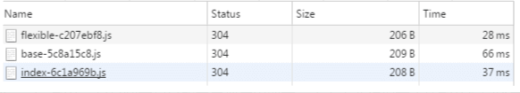
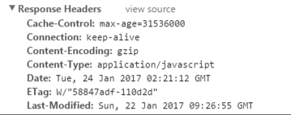
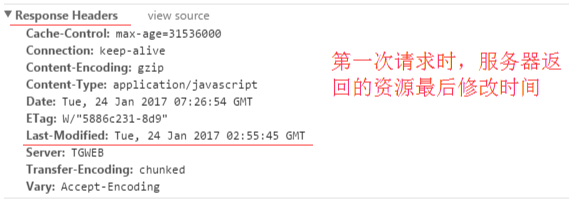
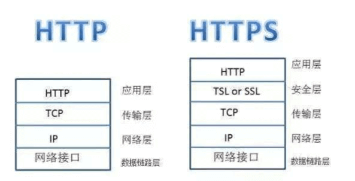
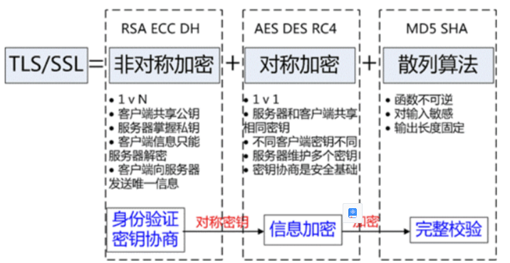

## 细说HTTP缓存

HTTP缓存属于客户端缓存，我们常认为浏览器有一个缓存数据库，用来保存一些静态文件，下面我们分为以下几个方面来简单介绍HTTP缓存

- 缓存的规则
- 缓存的方案
- 缓存的优点
- 不同刷新的请求执行过程


### 缓存的规则

缓存规则分为**强制缓存**，**协商缓存**和**启发式缓存**

#### 强制缓存

当缓存数据库中有客户端需要的数据，**浏览器如果判断本地缓存未过期**，就直接使用，当缓存服务器没有需要的数据时，客户端才会向服务端请求。


#### 协商缓存

又称对比缓存。浏览器第一次请求数据时，服务器会将缓存标识与数据一起返回给客户端，客户端将二者备份至缓存数据库中。再次请求数据时，客户端将备份的缓存标识发送给服务器，服务器根据缓存标识进行判断，判断成功后，返回`304`状态码，通知客户端比较成功，可以使用缓存数据。如果失效，服务端会返回新的数据


**第一次访问**


**再次访问**



通过两图的对比，我们可以很清楚的发现，在**协商缓存**生效时，状态码为304，并且报文大小和请求时间大大减少。

原因是，服务端在进行标识比较后，只返回header部分，通过状态码通知客户端使用缓存，不再需要将报文主体部分返回给客户端。


#### 启发式缓存

**启发式缓存就是无任何缓存相关的请求头的一种兜底策略，只有在服务端没有返回明确的缓存策略时才会激活浏览器的启发式缓存策略**

如果响应中未显示Expires，Cache-Control：max-age或Cache-Control：s-maxage，并且响应中不包含其他有关缓存的限制，缓存可以使用启发式方法计算新鲜度寿命。通常会根据响应头中的2个时间字段 Date 减去 Last-Modified 值的 10% 作为缓存时间

```
// Date 减去 Last-Modified 值的 10% 作为缓存时间。
// Date：创建报文的日期时间, Last-Modified 服务器声明文档最后被修改时间
response_is_fresh =  max(0,（Date -  Last-Modified)) % 10
```


#### 总结

- 强制缓存如果生效，不需要再和服务器发生交互，而对比缓存不管是否生效，都需要与服务端发生交互。
- 两类缓存规则可以同时存在，强制缓存优先级高于对比缓存，也就是说，当执行强制缓存的规则时，如果缓存生效，直接使用缓存，不再执行对比缓存规则。


### 缓存方案

#### 强制缓存

**浏览器是如何判断缓存数据是否失效呢**

我们知道，在没有缓存数据的时候，浏览器向服务器请求数据时，服务器会将数据和缓存规则一并返回，缓存规则信息包含在响应header中。

对于强制缓存来说，响应header中会有两个字段来标明失效规则（Expires/Cache-Control）

使用chrome的开发者工具，可以很明显的看到对于强制缓存生效时，网络请求的情况


**Expires**

- Expires的值为服务端返回的到期时间，即下一次请求时，请求时间小于服务端返回的到期时间，直接使用缓存数据。

- 不过Expires 是HTTP 1.0的东西，现在默认浏览器均默认使用HTTP 1.1，所以它的作用基本忽略。、
- 另一个问题是，到期时间是由服务端生成的，但是客户端时间可能跟服务端时间有误差，这就会导致缓存命中的误差。所以HTTP 1.1 的版本，使用Cache-Control替代。

**Cache-Control**

- Cache-Control 是最重要的规则。常见的取值有private、public、no-cache、max-age，no-store，默认为private。
- private：客户端可以缓存
- public：客户端和代理服务器都可缓存
- max-age=xxx： 缓存的内容将在 xxx 秒后失效
- no-cache：需要使用**对比缓存**来验证缓存数据（后面介绍）
- no-store：所有内容都不会缓存，强制缓存，对比缓存都不会触发（对于前端开发来说，缓存越多越好，so...基本上和它说886）

**举个例子**



图中Cache-Control仅指定了max-age，所以默认为private，缓存时间为31536000秒（365天）。也就是说，在365天内再次请求这条数据，都会直接获取缓存数据库中的数据，直接使用。


#### 协商缓存

对于**协商缓存**来说，缓存标识的传递是我们着重需要理解的，它在请求header和响应header间进行传递，一共分为两种标识传递，接下来，我们分开介绍。

**Last-Modified / If-Modified-Since**

Last-Modified：服务器在响应请求时，告诉浏览器资源的最后修改时间。



If-Modified-Since：

- 再次请求服务器时，会在其**请求头**上附带上 `If-Modified-Since` 字段（值就是第一次获取请求资源时响应头中返回的 `Last-Modified` 值）
- 服务器收到请求后发现有头If-Modified-Since 则与被请求资源的最后修改时间进行比对。
- 若资源的最后修改时间大于If-Modified-Since，说明资源又被改动过，则响应整片资源内容，返回状态码200；
- 若资源的最后修改时间小于或等于If-Modified-Since，说明资源无新修改，则响应HTTP 304，告知浏览器继续使用所保存的cache。


**Etag / If-None-Match**（优先级高于Last-Modified / If-Modified-Since）

Etag：服务器响应请求时，告诉浏览器当前资源在服务器的唯一标识（生成规则由服务器决定）。


If-None-Match：

- 再次请求服务器时，通过此字段通知服务器客户段缓存数据的唯一标识。
- 服务器收到请求后发现有头If-None-Match 则与被请求资源的唯一标识进行比对，
- 不同，说明资源又被改动过，则响应整片资源内容，返回状态码200；
- 相同，说明资源无新修改，则响应HTTP 304，告知浏览器继续使用所保存的cache。


**last-modified/Etag区别**

- 时间粒度：
  - last-modified时间粒度为1秒。某些文件修改非常频繁,比如 1s 内修改了 N 次，这种修改无法判断
- 资源消耗
  - etag需要生成hash值，消耗更大。last-modified是时间戳
- etag优先级更高


#### 启发式缓存

启发式缓存会引起什么问题吗？？

文件响应头中的 `Date` 和 `Last-Modified` 信息，这里的这两个时间是决定下次刷新页面之后，是请求服务器还是走本地缓存的关键因素，注意是**下一次请求**！


此时当前这一次请求的响应头 `（Date - Last-Modified） * 0.1` 是决定该文件缓存时间的长短，也就是 `（2023-04-13 - 2023-03-09）` 等于35天（具体时间时分秒先不计算），再乘以0.1，则当前文件则会缓存大约3.5天的时间，用户下次请求这个文件的时候，在3.5天之内请求则直接走本地缓存获取，超过3.5天去请求当前文件，则会去请求服务器的资源，不再走缓存！


#### 总结

浏览器第一次请求：

浏览器再次请求：


### 缓存的优点

- 减少了冗余的数据传递，节省宽带流量
- 减少了服务器的负担，大大提高了网站性能
- 加快了客户端加载网页的速度 这也正是HTTP缓存属于客户端缓存的原因。


### 不同刷新的请求执行过程

- **浏览器地址栏中写入URL，回车**：浏览器发现缓存中有这个文件了，不用继续请求了，直接去缓存拿。（最快）
- **F5**：F5就是告诉浏览器，别偷懒，好歹去服务器看看这个文件是否有过期了。于是浏览器就战战兢兢的发送一个请求带上If-Modify-since。
- **Ctrl+F5**：告诉浏览器，你先把你缓存中的这个文件给我删了，然后再去服务器请求个完整的资源文件下来。于是客户端就完成了强行更新的操作


## 细说HTTP请求方法

### 常见的HTTP请求方法

有GET、POST、DELETE、PUT、HEAD、OPTIONS、TRACE、PATCH、CONNECT 方法


### GET和POST的区别

- **用途**
  - GET 用于从服务器获取资源或数据。通常用于获取、读取数据。
  - POST 用于向服务器提交数据，通常用于创建、更新或修改服务器上的资源

- **参数传递**
  - GET 请求的参数通常通过 URL 的查询字符串（Query String）传递，参数会附加在 URL 的末尾，浏览器对其有长度限制。
  - POST 请求的参数通常通过请求的主体部分（Body）传递，可以传递较大量的数据，而不会受到 URL 长度限制。

- **缓存**
  - GET 请求可以被浏览器缓存，相同的请求可以从缓存中获取结果，提高性能。
  - POST 请求默认不会被浏览器缓存，每次请求都会获取最新的结果。

- **数据安全性**
  - GET比POST更不安全，因为参数直接暴露在URL上。
  - POST参数在请求主体中，对数据的传输相对安全，适合传输敏感信息。
- **幂等性**：HTTP 方法的幂等性是指**一次和多次请求某一个资源应该具有同样的副作用**。说白了就是，同一个请求，发送一次和发送 N 次效果是一样的！
  - get读请求：get操作一次和十次是一样的，具有幂等性
  - post写请求：post操作一次和操作十次是不一样的，不具具有幂等性


补充：有些文章中提到，post 会将 header 和 body 分开发送，先发送 header，服务端返回 100 状态码再发送 body。HTTP 协议中没有明确说明 POST 会产生两个 TCP 数据包，而且实际测试(Chrome)发现，header 和 body 不会分开发送。所以，header 和 body 分开发送是部分浏览器或框架的请求方法，不属于 post 必然行为。


### POST和PUT的区别

两者都是将数据携带传输给后端，但是有一定的区别的

**它们最根本的区别就是：POST方法不具有幂等性，而PUT方法则有幂等性**

幂等（idempotent、idempotence）是一个抽象代数的概念。在计算机中，可以这么理解，一个幂等操作的特点就是其任意多次执行所产生的影响均与依次一次执行的影响相同。

POST在每次请求的时候，服务器会每次都创建一个文件，但是在PUT方法的时候只是简单地更新，而不是去重新创建。因此PUT是幂等的。

举例来说，当你在掘金编辑博客时，后台提供了一个API：test。如果你发送n次test请求，后台始终都只产生了一篇文章，说明前面的请求被覆盖了，那么这个test在多次请求中没有副作用，则它使用的应该是幂等方法PUT。如果n次请求后，后台产生了n篇文章，那么test则是非幂等方法POST。


## HTTP的发展

**HTTP**（HyperText Transfer Protocol）是万维网（World Wide Web）的基础协议

### 发展历程

[HTTP 的发展 - HTTP | MDN (mozilla.org)](https://developer.mozilla.org/zh-CN/docs/Web/HTTP/Basics_of_HTTP/Evolution_of_HTTP)

**HTTP/0.9——单行协议**

最初版本的 HTTP 协议并没有版本号，后来它的版本号被定位在 0.9 以区分后来的版本。HTTP/0.9 极其简单：请求由单行指令构成，以唯一可用方法 `GET`开头，其后跟目标资源的路径（一旦连接到服务器，协议、服务器、端口号这些都不是必须的）


**HTTP/1.0——构建可扩展性**

由于 HTTP/0.9 协议的应用十分有限，浏览器和服务器迅速扩展内容使其用途更广：

- 协议版本信息现在会随着每个请求发送（`HTTP/1.0` 被追加到了 `GET` 行）。
- 状态码会在响应开始时发送，使浏览器能了解请求执行成功或失败，并相应调整行为（如更新或使用本地缓存）。
- 引入了 HTTP 标头的概念，无论是对于请求还是响应，允许传输元数据，使协议变得非常灵活，更具扩展性。
- 在新 HTTP 标头的帮助下，具备了传输除纯文本 HTML 文件以外其他类型文档的能力（凭借 [`Content-Type`](https://developer.mozilla.org/zh-CN/docs/Web/HTTP/Headers/Content-Type) 标头）


**HTTP/1.1——标准化的协议**

HTTP/1.1 消除了大量歧义内容并引入了多项改进：

- 连接可以复用，节省了多次打开 TCP 连接加载网页文档资源的时间。
- 增加管线化技术，允许在第一个应答被完全发送之前就发送第二个请求，以降低通信延迟。
- 支持响应分块。
- 引入额外的缓存控制机制。
- 引入内容协商机制，包括语言、编码、类型等。并允许客户端和服务器之间约定以最合适的内容进行交换。
- 凭借 [`Host`](https://developer.mozilla.org/zh-CN/docs/Web/HTTP/Headers/Host) 标头，能够使不同域名配置在同一个 IP 地址的服务器上。


**HTTP/2——为了更优异的表现**

HTTP/2 在 HTTP/1.1 有几处基本的不同

- HTTP/2 是二进制协议而不是文本协议。不再可读，也不可无障碍的手动创建，改善的优化技术现在可被实施。
- 这是一个多路复用协议。并行的请求能在同一个链接中处理，移除了 HTTP/1.x 中顺序和阻塞的约束。
- 压缩了标头。因为标头在一系列请求中常常是相似的，其移除了重复和传输重复数据的成本。
- 其允许服务器在客户端缓存中填充数据，通过一个叫服务器推送的机制来提前请求。


**HTTP/3——基于QUIC的HTTP**


### http1.0与http1.1的区别

- **缓存处理**
  - 在HTTP1.0中主要使用header里的If-Modified-Since,Expires来做为缓存判断的标准
  - HTTP1.1则引入了更多的缓存控制策略例如Entity tag，If-Unmodified-Since, If-Match, If-None-Match等更多可供选择的缓存头来控制缓存策略
- **长链接**
  - HTTP 1.1支持长连接（PersistentConnection）和请求的流水线（Pipelining）处理，在一个TCP连接上可以传送多个HTTP请求和响应，减少了建立和关闭连接的消耗和延迟，在HTTP1.1中默认开启Connection： keep-alive，一定程度上弥补了HTTP1.0每次请求都要创建连接的缺点
- **host头处理**
  - http1.1 中新增了 host 字段，用来指定服务器的域名。http1.0 中认为每台服务器都绑定一个唯一的 IP 地址，因此，请求消息中的 URL 并没有传递主机名（hostname）。但随着虚拟主机技术的发展，在一台物理服务器上可以存在多个虚拟主机，并且它们共享一个IP地址。因此有了 host 字段，这样就可以将请求发往到同一台服务器上的不同网站。

- **宽带优化**
  - HTTP1.0中，存在一些浪费带宽的现象，例如客户端只是需要某个对象的一部分，而服务器却将整个对象送过来了，并且不支持断点续传功能，HTTP1.1则在请求头引入了range头域，它允许只请求资源的某个部分，即返回码是206（Partial Content），这样就方便了开发者自由的选择以便于充分利用带宽和连接
- **错误通知的管理**
  - 在HTTP1.1中新增了24个错误状态响应码，如409（Conflict）表示请求的资源与资源的当前状态发生冲突；410（Gone）表示服务器上的某个资源被永久性的删除

- **请求方法**
  - HTTP1.0定义了三种请求方法：GET、POST和HEAD方法
  - HTTP1.1新增了五种请求方法：OPTIONS、PUT、DELETE、TRACE和CONNECT方法


### HTTP2.0和HTTP1.X的区别

- **新的二进制格式**
  - HTTP1.x解析是基于文本的，基于文本协议的格式解析存在天然缺陷，文本的表现形式有多样性，考虑的场景必然很多
  - 二进制则不同，只认0和1的组合。基于这种考虑HTTP2.0的协议解析决定采用二进制格式
- **头部压缩**
  - 在HTTP1.1中，HTTP请求和响应都是由状态行、请求/响应头部、消息主体三部分组成。一般而言，消息主体都会经过gzip压缩，或者本身传输的就是压缩过后的二进制文件，但状态行和头部却没有经过任何压缩，直接以纯文本传输。随着Web功能越来越复杂，每个页面产生的请求数也越来越多，导致消耗在头部的流量越来越多，尤其是每次都要传输UserAgent、Cookie这类不会频繁变动的内容，完全是一种浪费
  - HTTP/2 对这一点做了优化，引入了头信息压缩机制。一方面，头信息使用 gzip 或 compress 压缩后再发送；另一方面，客户端和服务器同时维护一张头信息表，所有字段都会存入这个表，生成一个索引号，以后就不发送同样字段了，只发送索引号，这样就能提高速度了
- **服务器推送**
  - HTTP/2 允许服务器未经请求，主动向客户端发送资源，这叫做服务器推送
  - 使用服务器推送提前给客户端推送必要的资源，这样就可以相对减少一些延迟时间
  - **这里需要注意的是 http2 下服务器主动推送的是静态资源，和 WebSocket 以及使用 SSE 等方式向客户端发送即时数据的推送是不同的**
- **多路复用**
  - 在http1.1中，浏览器客户端在同一时间，针对同一域名下的请求有一定数量的限制，超过限制数目的请求会被阻塞。这也是为何一些站点会有多个静态资源 CDN 域名的原因之一。
  - http2.0中的多路复用优化了这一性能。多路复用允许同时通过单一的http/2 连接发起多重的请求-响应消息。有了新的分帧机制后，http/2 不再依赖多个TCP连接去实现多流并行了。每个数据流都拆分成很多互不依赖的帧，而这些帧可以交错（乱序发送），还可以分优先级，最后再在另一端把它们重新组合起来。
  - http 2.0 连接都是持久化的，而且客户端与服务器之间也只需要一个连接（每个域名一个连接）即可。http2连接可以承载数十或数百个流的复用，多路复用意味着来自很多流的数据包能够混合在一起通过同样连接传输。当到达终点时，再根据不同帧首部的流标识符重新连接将不同的数据流进行组装。


## 常见HTTP请求头

- **Accept**
  - 表示浏览器支持的MIME类型（又称媒体类型，对标服务端返回的Content-Type）
    - 浏览器通常使用 MIME 类型*而不是文件扩展名*来决定如何处理 URL，因此 Web 服务器在`Content-Type`响应标头中添加正确的 MIME 类型非常重要。如果配置不正确，浏览器可能会曲解文件内容，网站将无法正常工作，并且下载的文件也可能被错误处理
    - MIME 类型通常仅包含两个部分：类型（type）和子类型（subtype），中间由斜杠 `/` 分割，中间没有空白字符：`type/subtype`
    - ***类型\***代表数据类型所属的大致分类，例如 `video` 或 `text`
    - ***子类型\***标识了 MIME 类型所代表的指定类型的确切数据类型。以 `text` 类型为例，它的子类型包括：`plain`（纯文本）、`html`（[HTML](https://developer.mozilla.org/zh-CN/docs/Glossary/HTML) 源代码）、`calender`（iCalendar/`.ics` 文件）
    - 每种类型都有自己的一组可能的子类型。一个 MIME 类型总是包含类型与子类型这两部分，且二者必需成对出现
    - 有一个可选的**参数**，能够提供额外的信息：`type/subtype;parameter=value`
    - 例如，对于主类型为 `text` 的任何 MIME 类型，可以添加可选的 `charset` 参数，以指定数据中的字符所使用的字符集。如果没有指定 `charset`，默认值为 [ASCII](https://developer.mozilla.org/zh-CN/docs/Glossary/ASCII)（`US-ASCII`），除非被[用户代理的](https://developer.mozilla.org/zh-CN/docs/Glossary/User_agent)设置覆盖。要指定 UTF-8 文本文件，则使用 MIME 类型 `text/plain;charset=UTF-8`
  
  - 常见值
    - `Accept: text/html`：浏览器可以接受服务器回发的类型为 `text/html`
    - `Accept: */*`：代表浏览器可以处理所有类型(一般浏览器发给服务器都是发这个)
  
- **Accept-Encoding**
  - HTTP 请求头 **Accept-Encoding** 会将客户端能够理解的内容编码方式——通常是某种压缩算法——进行通知（给服务端）。通过内容协商的方式，服务端会选择一个客户端提议的方式，使用并在响应头 [`Content-Encoding`](https://developer.mozilla.org/zh-CN/docs/Web/HTTP/Headers/Content-Encoding) 中通知客户端该选择
  - 常见值
    - `gzip`：涉及到页面性能优化

- **Connection**
  - **Connection: keep-alive** 当一个网页打开完成后，客户端和服务器之间用于传输HTTP数据的TCP连接不会关闭，如果客户端再次访问这个服务器上的网页，会继续使用这一条已经建立的连接。
  -  **Connection: close** 代表一个Request完成后，客户端和服务器之间用于传输HTTP数据的TCP连接会关闭， 当客户端再次发送Request，需要重新建立TCP连接。
- **HOST**：指明了请求将要发送到的服务器主机名和端口号
- **User-Agent**：告诉服务器， 客户端使用的操作系统和浏览器的名称和版本
- **Cookie**：用来存储一些用户信息以便让服务器辨别用户身份的
- 缓存相关
  - `Cache-control`（强缓存）
  - `If-Modified-Since`（协商缓存）
  - `If-None-Match`（协商缓存）


## 常见HTTP响应头

- **Content-Type**
  - `Content-Type：text/html;charset=UTF-8` 告诉客户端，资源文件的类型，还有字符编码，客户端通过utf-8对资源进行解码，然后对资源进行html解析。
- **Content-Encoding**（对应请求中的Accept-Encoding）
  - `Content-Encoding:gzip` 告诉客户端，服务端发送的资源是采用gzip编码的，客户端看到这个信息后，应该采用gzip对资源进行解码。
- **Date**（涉及启发式缓存）：服务端发送资源时的服务器时间
- **Set-Cookie**
  - 响应标头 `Set-Cookie` 被用来由服务器端向用户代理发送 cookie，所以用户代理可在后续的请求中将其发送回服务器。
  - 服务器要发送多个 cookie，则应该在同一响应中发送多个 `Set-Cookie` 标头

- 请求跨域相关
  - **Access-Control-Allow-Origin** 
    - `Access-Control-Allow-Origin: * ` :   `*`号代表所有网站可以跨域资源共享，如果当前字段为*那么Access-Control-Allow-Credentials就不能为true
    - `Access-Control-Allow-Origin: www.baidu.com` 指定哪些网站可以跨域资源共享
  - Access-Control-Allow-Methods
    - `ccess-Control-Allow-Methods：GET,POST,PUT,DELETE `允许哪些方法来访问
  - Access-Control-Allow-Credentials
    - `Access-Control-Allow-Credentials: true`： 是否允许发送cookie。
    - 默认情况下，Cookie不包括在CORS请求之中。
    - 设为true，即表示服务器明确许可，Cookie可以包含在请求中，一起发给服务器。
    - 这个值也只能设为true，如果服务器不要浏览器发送Cookie，删除该字段即可。
    - 如果access-control-allow-origin为*，当前字段就不能为true
- 缓存相关
  - Cache-Control（对应请求中的Cache-Control）
  - `expires`
  - `Last-Modified`
  - `Etag`


## 常见HTTP状态码

HTTP 响应状态码用来表明特定 HTTP请求是否成功完成。 响应被归为以下五大类：（同时列出一些常见的状态码）

- [信息响应](https://developer.mozilla.org/zh-CN/docs/Web/HTTP/Status#信息响应) (`100`–`199`)

- [成功响应](https://developer.mozilla.org/zh-CN/docs/Web/HTTP/Status#成功响应) (`200`–`299`)
  - `200 OK`：请求成功
  - `201 Created`：该请求已成功，并因此创建了一个新的资源。这通常是在 POST 请求，或是某些 PUT 请求之后返回的响应。
  - `204`：请求成功没有数据
  - `206`：获取资源的部分内容
  
- [重定向消息](https://developer.mozilla.org/zh-CN/docs/Web/HTTP/Status#重定向消息) (`300`–`399`)
  - `301 Moved Permanently`：永久重定向。请求资源的 URL 已永久更改。在响应中给出了新的 URL
  - `302`：表示临时重定向
  - `304 Not Modified`：这是用于缓存。它告诉客户端响应还没有被修改，因此客户端可以继续使用相同的缓存版本的响应
  - `307`：临时重定向。307 的定义实际上和 302 是一致的，唯一的区别在于，307 状态码不允许浏览器将原本为 POST 的请求重定向到 GET 请求上
  - `308`：永久重定向。308 的定义实际上和 301 是一致的，唯一的区别在于，308 状态码不允许浏览器将原本为 POST 的请求重定向到 GET 请求上。

- [客户端错误响应](https://developer.mozilla.org/zh-CN/docs/Web/HTTP/Status#客户端错误响应) (`400`–`499`)

  - `400 Bad Request`：由于被认为是客户端错误（例如，错误的请求语法、无效的请求消息帧或欺骗性的请求路由），服务器无法或不会处理请求。
  - `401 Unauthorized`：身份认证不通过（虽然 HTTP 标准指定了"unauthorized"，但从语义上来说，这个响应意味着"unauthenticated"。也就是说，客户端必须对自身进行身份验证才能获得请求的响应。）
  - `403 Forbidden`：客户端错误，指的是服务器端有能力处理该请求，但是拒绝授权访问
  - `404 Not Found`：服务器找不到请求的资源
  - `405 Method Not Allowed`：服务器知道请求方法，但目标资源不支持该方法
  - `410`：表示服务器上资源被删除
  - `429`：接口调用太频繁拒接了

- [服务端错误响应](https://developer.mozilla.org/zh-CN/docs/Web/HTTP/Status#服务端错误响应) (`500`–`599`)
  - `500 Internal Server Error`：服务器遇到了不知道如何处理的情况
  - `501 Not Implemented`：服务器不支持请求方法，因此无法处理
  - `502 Bad Gateway`：此错误响应表明服务器得到一个错误的响应

  - `504 Gateway Timeout`：是一种 HTTP 协议的服务器端错误状态代码，表示扮演网关或者代理的服务器无法在规定的时间内获得想要的响应。


## TCP异常处理

[TCP 才不傻：三次握手和四次挥手的异常处理 - 知乎 (zhihu.com)](https://zhuanlan.zhihu.com/p/398890723)


## TCP常见优化方法

- 窗口调整和拥塞控制优化


## 思考的问题

### TCP第四次挥手为什么要等待2MSL

为了保证客户端发送的最后一个ACK报文段能够到达服务器。因为这个ACK有可能丢失，从而导致处在LAST-ACK状态的服务器收不到对FIN-ACK的确认报文。服务器会超时重传这个FIN-ACK，接着客户端再重传一次确认，重新启动时间等待计时器。最后客户端和服务器都能正常的关闭。假设客户端不等待2MSL，而是在发送完ACK之后直接释放关闭，一但这个ACK丢失的话，服务器就无法正常的进入关闭连接状态。


### 为什么会采用三次握手，若采用二次握手可以吗？ 四次呢？

**为什么需要三次握手，两次不行吗？**

这是由TCP的自身特点**可靠传输**决定的。客户端和服务端要进行可靠传输，那么就需要**确认双方的`接收`和`发送`能力**。第一次握手可以确认客服端的`发送能力`,第二次握手，服务端`SYN=1,Seq=Y`就确认了`发送能力`,`ack=X+1`就确认了`接收能力`，第三次握手可以确认客户端的`接收能力`。

试想如果是用两次握手，则会出现下面这种情况： 如客户端发出连接请求，但因连接请求报文丢失而未收到确认，于是客户端再重传一次连接请求。后来收到了确认，建立了连接。数据传输完毕后，就释放了连接，客户端共发出了两个连接请求报文段，其中第一个丢失，第二个到达了服务端，但是第一个丢失的报文段只是在某些网络结点长时间滞留了，延误到连接释放以后的某个时间才到达服务端，此时服务端误认为客户端又发出一次新的连接请求，于是就向客户端发出确认报文段，同意建立连接，不采用三次握手，只要服务端发出确认，就建立新的连接了，此时客户端忽略服务端发来的确认，也不发送数据，则服务端一致等待客户端发送数据，浪费资源。


**四次呢？**

四次是可以的。TCP三次握手原本应该是"四次握手"，但是中间的同步报文段SYN和应答报文ACK是可以合在一起的，这两个操作在时间上是同时发送的，于是就没必要分成两次传输，直接一步到位。分成两次反而会更浪费系统资源


### 为什么建立连接是三次握手，关闭连接确是四次挥手呢？

因为当服务端收到客户端的SYN连接请求报文后，可以**直接发送SYN+ACK报文**。其中ACK报文是用来应答的，SYN报文是用来同步的。但是关闭连接时，当服务端收到FIN报文时，很可能并不会立即关闭，所以只能先回复一个ACK报文，告诉客户端，“你发的FIN报文我收到了”。只有等到我服务端所有的报文都发送完了，我才能发送FIN报文，因此不能一起发送。故需要四次挥手。


### URL为什么要解析

一开始在互联网上，所有的地址都是IP地址，但是由于这些IP地址太难记了，所以就出现了域名（比如 findland.cn ）。 而域名解析就是将域名转换为IP地址去访问输入的网址的这样一种行为。


### 什么是半连接队列/全连接队列

在 TCP 三次握手的时候，Linux 内核会维护两个队列，分别是：

- 半连接队列，也称 SYN 队列；
- 全连接队列，也称 accepet 队列；

服务端收到客户端发起的 SYN 请求后，内核会把该连接存储到半连接队列，并向客户端响应 SYN+ACK，接着客户端会返回 ACK，服务端收到第三次握手的 ACK 后，内核会把连接从半连接队列移除，然后加入全连接队列，等待进程调用 accept 函数时把连接取出来。

服务端收到客户端发起的 SYN 请求后，内核会把该连接存储到**半连接队列**，并向客户端响应 SYN+ACK，接着客户端会返回 ACK，服务端收到第三次握手的 ACK 后，内核会把连接从**半连接队列**移除，然后创建新的完全的连接，并将其添加到**全连接队列**，等待进程调用 accept 函数时把连接取出来。


## 补充知识点

### 前端对DNS解析优化

一次DNS解析需要耗费 20-120ms，所以为了优化DNS，我们可以考虑两个方向：

1. 减少DNS请求次数
2. 缩短DNS解析时间`dns-prefetch`


#### 什么是dns-prefetch

`dns-prefetch`(**DNS预获取**)是前端网络性能优化的一种措施。它根据浏览器定义的规则，**提前解析**之后可能会用到的域名，使解析结果**缓存到系统缓存**中，缩短DNS解析时间，进而提高网站的访问速度。


#### 为什么要用dns-prefetch？

每当浏览器从（第三方）服务器发送一次请求时，都要先通过**DNS解析**将该跨域域名解析为 IP地址，然后浏览器才能发出请求。

如果某一时间内，有多个请求都发送给同一个服务器，那么DNS解析会多次并且重复触发。这样会导致整体的网页加载有延迟的情况。

我们知道，虽然DNS解析占用不了多大带宽，但是它会产生很高的延迟，尤其是对于移动网络会更为明显。

因此，为了减少DNS解析产生的延迟，我们可以通过`dns-prefetch`预解析技术有效地缩短DNS解析时间。

```html
<link rel="dns-prefetch" href="https://baidu.com/"> 
```


#### 原理

`dns-prefetch`就是在**将解析后的IP缓存在系统中**。


### UDP/TCP区别

TCP/IP 中有两个具有代表性的传输层协议，分别是 TCP 和 UDP。


#### 介绍UDP

我们先简单了解一个TCP协议和UDP协议是什么，这里主要介绍UDP协议，上面有详细介绍TCP，这边不多叙述

**TCP协议**

TCP是面向连接的协议，也就是说，在收发数据前，必须和对方建立可靠的连接。 一个TCP连接必须要经过三次握手

**UDP协议**

- UDP是一个非连接的协议，传输数据之前源端和终端不建立连接， 当它想传送时就简单地去抓取来自应用程序的数据，并尽可能快地把它扔到网络上。
- 由于传输数据不建立连接，因此也就不需要维护连接状态，包括收发状态等， 因此一台服务机可同时向多个客户机传输相同的消息。


#### 区别

- 连接
  - TCP 是面向连接的传输层协议，传输数据前先要建立连接
  - UDP 是不需要连接，即刻传输数据
- 服务对象
  - TCP 是一对一的两点服务，即一条连接只有两个端点
  - UDP 支持一对一、一对多、多对多的交互通信
- 可靠性
  - TCP 是可靠交付数据的，数据可以无差错、不丢失、不重复、按需到达
  - UDP 是尽最大努力交付，不保证可靠交付数据
- 拥塞控制、流量控制
  - TCP 有拥塞控制和流量控制机制，保证数据传输的安全性。
  - UDP 则没有，即使网络非常拥堵了，也不会影响 UDP 的发送速率。
- 传输数据形式
  - TCP面向字节流，实际上是TCP把数据看成一连串无结构的字节流
  - UDP是面向报文的
- 首部开销
  - TCP首部开销20字节，如果使用了「选项」字段则会变长的。
  - UDP的首部开销小，只有8个字节，且固定不变


#### 应用场景

- TCP应用场景
  - 效率要求相对低，但对准确性要求相对高的场景。
  - 因为传输中需要对数据确认、重发、排序等操作，相比之下效率没有UDP高
  - 举几个例子：文件传输（准确高要求高、但是速度可以相对慢）、接受邮件、远程登录
- UDP应用场景
  - 效率要求相对高，对准确性要求相对低的场景。
  - 举几个例子：QQ聊天、在线视频、网络语音电话（即时通讯，速度要求高，但是出现偶尔断续不是太大问题，并且此处完全不可以使用重发机制）、广播通信（广播、多播）


### HTTP与HTTPS

#### HTTP

HTTP协议也就是超文本传输协议，是一种使用明文数据传输的网络协议。一直以来HTTP协议都是最主流的网页协议，HTTP协议被用于在Web浏览器和网站服务器之间传递信息，以明文方式发送内容，不提供任何方式的数据加密，如果攻击者截取了Web浏览器和网站服务器之间的传输报文，就可以直接读懂其中的信息。


#### HTTPS

为了解决HTTP协议的这一缺陷，需要使用另一种协议：安全套接字层超文本传输协议HTTPS，为了数据传输的安全，HTTPS在HTTP的基础上加入了**SSL/TLS协议**，SSL/TLS依靠证书来验证服务器的身份，并为浏览器和服务器之间的通信加密。HTTPS协议可以理解为HTTP协议的升级，就是在HTTP的基础上增加了数据加密。在数据进行传输之前，对数据进行加密，然后再发送到服务器。这样，就算数据被第三者所截获，但是由于数据是加密的，所以你的个人信息仍然是安全的。这就是HTTP和HTTPS的最大区别。


#### 图解





#### 区别

- HTTP 是超文本传输协议，信息是明文传输，HTTPS 则是具有安全性的 SSL 加密传输协议
- HTTP 和 HTTPS 使用的是完全不同的连接方式，默认端口号也不一样，前者是80，后者是443
- HTTP协议连接很简单，是无状态的；HTTPS协议是有SSL和HTTP协议构建的可进行加密传输、身份认证的网络协议，比HTTP更加安全
- HTTPS协议需要CA证书，费用较高；而HTTP协议不需要


## 概念解释

- ACK：此标志表示应答域有效，就是说前面所说的TCP应答号将会包含在TCP数据包中；有两个取值：0和1，为1的时候表示应答域有效，反之为0。TCP协议规定，只有ACK=1时有效，也规定连接建立后所有发送的报文的ACK必须为1。
- SYN：在连接建立时用来同步序号。当SYN=1而ACK=0时，表明这是一个连接请求报文。对方若同意建立连接，则应在响应报文中使SYN=1和ACK=1. 因此, SYN置1就表示这是一个连接请求或连接接受报文。
- FIN：即完，终结的意思， 用来释放一个连接。当 FIN = 1 时，表明此报文段的发送方的数据已经发送完毕，并要求释放连接。

- 报文：我们将位于**应用层**的信息分组称为报文。报文是网络中交换与传输的数据单元，也是网络传输的单元。报文包含了将要发送的完整的数据信息，其长短不需一致。报文在传输过程中会不断地封装成分组、包、帧来传输，封装的方式就是添加一些控制信息组成的首部，那些就是报文头

- 字节流：一切文件数据在存储时，都是以二进制数字的形式保存，都一个一个的字节，那么传输时一样如此。所以，字节流可以传输任意文件数据。在操作流的时候，我们要时刻明确，无论使用什么样的流对象，底层传输的始终为二进制数据

- 拥塞控制

  - 拥塞控制就是防止过多的数据注入到网络中，这样可以使网络中的路由器或链路不致过载
  - 解决方法：[流量控制和拥塞控制](https://blog.csdn.net/weixin_39003229/article/details/81842940)

- 流量控制

  - 如果发送方把数据发送得过快，接收方可能会来不及接收，这就会造成数据的丢失。
  - TCP的流量控制是利用滑动窗口机制实现的，接收方在返回的数据中会包含自己的接收窗口的大小，以控制发送方的数据发送
  - 流量控制是为了预防拥塞

- TLS/SSL 的功能实现主要依赖于三类基本算法

  - 散列函数 Hash、对称加密和非对称加密
  - 其利用非对称加密实现身份认证和密钥协商，对称加密算法采用协商的密钥对数据加密，基于散列函数验证信息的完整性
  - 


## 参考链接

[在浏览器输入 URL 回车之后发生了什么（超详细版）](https://juejin.cn/post/6844903922084085773?searchId=20230802223229AA8C4FCC51FB3AE4FBA6)

[深入浅出TCP三次握手 （多图详解）_三次握手详细过程](https://blog.csdn.net/weixin_45629285/article/details/121195202)

[深入浅出TCP四次挥手 （多图详解）](https://juejin.cn/post/7063829623024386056)

[彻底弄懂HTTP缓存机制及原理](https://www.cnblogs.com/chenqf/p/6386163.html)

[HTTP 的发展 - HTTP | MDN (mozilla.org)](https://developer.mozilla.org/zh-CN/docs/Web/HTTP/Basics_of_HTTP/Evolution_of_HTTP)

[URL 简介 - 网址的组成部分 - 《阮一峰 HTML 语言教程》](https://www.bookstack.cn/read/html-tutorial/spilt.2.docs-url.md)

[SSL/TLS四次握手过程是怎么样的？](

