## 脚手架的简单雏形

### 在命令行启动cli

1. 新建项目目录 my-node-cli

```js
mkdir my-node-cli 
cd my-node-cli 
npm init # 生成 package.json 文件
```

2. 新建程序入口文件 cli.js：`touch cli.js # 新建 cli.js 文件`  （window需要安装touch：`npm install touch-cli -g`）

3. 在 package.json 文件中指定入口文件为 cli.js：

```js
{
  "name": "my-node-cli",
  "version": "1.0.0",
  "description": "",
  "main": "cli.js", // 设置入口文件
  "bin": "cli.js", // 手动添加入口文件为 cli.js
  "scripts": {
    "test": "echo \"Error: no test specified\" && exit 1"
  },
  "author": "jl",
  "license": "ISC"
}
```

4. 此时项目目录结构：

```bash
my-node-cli      
├─ cli.js        
└─ package.json     
```

5. 打开 cli.js 进行编辑

```js
#! /usr/bin/env node

// #! 符号的名称叫 Shebang，用于指定脚本的解释程序
// Node CLI 应用入口文件必须要有这样的文件头
// 如果是Linux 或者 macOS 系统下还需要修改此文件的读写权限为 755
// 具体就是通过 chmod 755 cli.js 实现修改

// 用于检查入口文件是否正常执行
console.log('my-node-cli working~')
```

6. npm link 链接到全局

```bash
npm link # or yarn link
```

7. 我们就可以来测试了，在命令行中输入 my-node-cli 执行一下，就可以看到命令行中打印了`my-node-cli working~`


### 询问用户信息

实现与询问用户信息的功能需要引入 inquirer.js，为了使用 `require` 引入 inquirer ，要使用 8.2.5 版本的 inquirer

```
npm install inquirer@8.2.5 --dev
```

接着我们在 cli.js 来设置我们的问题

```js
#! /usr/bin/env node

const inquirer = require('inquirer')

inquirer.prompt([
  {
    type: 'input', //type： input, number, confirm, list, checkbox ... 
    name: 'name', // key 名
    message: 'Your name', // 提示信息
    default: 'my-node-cli' // 默认值
  }
]).then(answers => {
  // 打印互用输入结果
  console.log(answers)
})
```

在命令行输入 my-node-cli 看一下执行结果

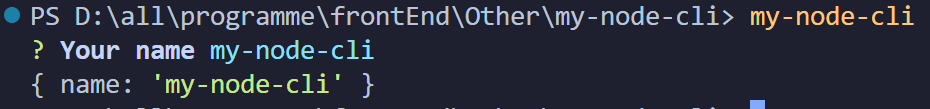


### 生成对应的文件

新建`templates `文件夹，然后在里面新建index.html和common.css文件

```html
<!DOCTYPE html>
<html lang="en">
<head>
  <meta charset="UTF-8">
  <meta http-equiv="X-UA-Compatible" content="IE=edge">
  <meta name="viewport" content="width=device-width, initial-scale=1.0">
  <title>
    <!-- ejs 语法 -->
    <%= name %>
  </title>
</head>
<body>
  <h1><%= name %></h1>
</body>

</html>
```

```css
/* common.css */
body {
  margin: 20px auto;
  background-color: azure;
}
```

此时的目录结构

```bash
bash复制代码my-node-cli           
├─ templates          
│  ├─ common.css      
│  └─ index.html      
├─ cli.js             
├─ package-lock.json  
└─ package.json       
```


**接着完善文件生成逻辑**

这里借助 ejs 模版引擎将用户输入的数据渲染到模版文件上

```js
npm install ejs --save
```

完善cli.js

```js
#! /usr/bin/env node

const inquirer = require('inquirer')
const path = require('path')
const fs = require('fs')
const ejs = require('ejs')

inquirer.prompt([
  {
    type: 'input', //type：input,confirm,list,rawlist,checkbox,password...
    name: 'name', // key 名
    message: 'Your name', // 提示信息
    default: 'my-node-cli' // 默认值
  }
]).then(answers => {
  // 模版文件目录
  const destUrl = path.join(__dirname, 'templates'); 
  // 生成文件目录
  // process.cwd() 对应控制台所在目录
  const cwdUrl = process.cwd();
  // 从模版目录中读取文件
  fs.readdir(destUrl, (err, files) => {
    if (err) throw err;
    files.forEach((file) => {
      // 使用 ejs 渲染对应的模版文件
      // renderFile（模版文件地址，传入渲染数据）
      ejs.renderFile(path.join(destUrl, file), answers).then(data => {
        // 生成 ejs 处理后的模版文件
        fs.writeFileSync(path.join(cwdUrl, file) , data)
      })
    })
  })
})
```

同样，在控制台执行一下 my-node-cli ，此时 `index.html`、`common.css` 已经成功创建

我们打印一下当前的目录结构

```bash
my-node-cli           
├─ templates          
│  ├─ common.css      
│  └─ index.html      
├─ cli.js             
├─ common.css .................... 生成对应的 common.css 文件        
├─ index.html .................... 生成对应的 index.html 文件        
├─ package-lock.json  
└─ package.json       
```

打开生成的 index.html 文件看一下

```html
<!DOCTYPE html>
<html lang="en">

<head>
  <meta charset="UTF-8">
  <meta http-equiv="X-UA-Compatible" content="IE=edge">
  <meta name="viewport" content="width=device-width, initial-scale=1.0">
  <!-- ejs 语法 -->
  <title>
    my-app
  </title>
</head>

<body>
  <h1>my-app</h1>
</body>

</html>
```

用户输入的 `{ name: 'my-app' }` 已经添加到了生成的文件中了


## 热门脚手架工具库

### 推荐

实际生产中搭建一个脚手架或者阅读其他脚手架源码的时候需要了解下面这些工具库

| 名称                                                         | 简介                                                         |
| ------------------------------------------------------------ | ------------------------------------------------------------ |
| [ commander](https://link.juejin.cn?target=https%3A%2F%2Fgithub.com%2Ftj%2Fcommander.js%2Fblob%2Fmaster%2FReadme_zh-CN.md) | 命令行自定义指令                                             |
| [ inquirer](https://link.juejin.cn?target=https%3A%2F%2Fgithub.com%2FSBoudrias%2FInquirer.js%2F) | 命令行询问用户问题，记录回答结果                             |
| [ chalk](https://link.juejin.cn?target=https%3A%2F%2Fwww.npmjs.com%2Fpackage%2Fchalk) | 控制台输出内容样式美化                                       |
| [ ora](https://link.juejin.cn?target=https%3A%2F%2Fwww.npmjs.com%2Fpackage%2Fora) | 控制台 loading 样式                                          |
| [ figlet](https://link.juejin.cn?target=https%3A%2F%2Fwww.npmjs.com%2Fpackage%2Ffiglet) | 控制台打印 logo                                              |
| [ easy-table](https://link.juejin.cn?target=https%3A%2F%2Fwww.npmjs.com%2Fpackage%2Feasy-table) | 控制台输出表格                                               |
| [ download-git-repo](https://link.juejin.cn?target=https%3A%2F%2Fwww.npmjs.com%2Fpackage%2Fdownload-git-repo) | 下载远程模版                                                 |
| [ fs-extra](https://link.juejin.cn?target=https%3A%2F%2Fwww.npmjs.com%2Fpackage%2Ffs-extra) | 系统fs模块的扩展，提供了更多便利的 API，并继承了fs模块的 API |
| [ cross-spawn](https://link.juejin.cn?target=https%3A%2F%2Fwww.npmjs.com%2Fpackage%2Fcross-spawn) | 支持跨平台调用系统上的命令                                   |

重点介绍下面这些，其他工具可以查看说明文档


### commander 自定义命令行指令

#### 新建一个简单的 Node Cli 项目

```js
// package.json
{
  "name": "one",
  "version": "1.0.0",
  "description": "",
  "bin": "./bin/cli.js",
  "scripts": {
    "test": "echo \"Error: no test specified\" && exit 1"
  },
  "author": "jl",
  "license": "ISC",
  "devDependencies": {
    "commander": "^11.1.0"
  }
}
```

目录结构：

```bash
one          
├─ bin                
│  └─ cli.js          
├─ package-lock.json  
└─ package.json              
```


#### 引入 commander 编写代码

```bash
# 安装依赖
npm install commander # yarn add commander 
```

完善 cli.js 代码

```js
#! /usr/bin/env node

const program = require('commander')

program
.version('0.1.0')
.command('create <name>')
.description('create a new project')
.action(name => { 
    // 打印命令行输入的值
    console.log("project name is " + name)
})

program.parse()
```


#### npm link 链接到全局

- 执行 `npm link` 将应用 `one` 链接到全局
- 完成之后，在命令行中执行 `one`

看一下，命令行中的输出内容

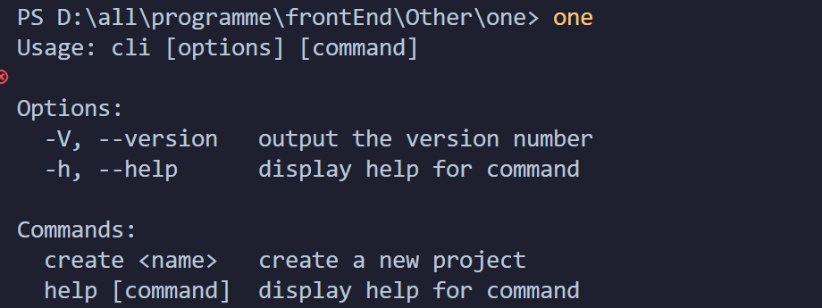


这个时候就有了 `one` 命令使用的说明信息，在 Commands 下面出现了我们刚刚创建的 create 命令 `create <name>`，我们在命令行中运行一下

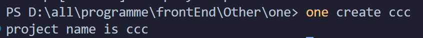

这个时候控制台就打印出来 create 命令后面的 `<name>` 值


### chalk 命令行美化工具

chalk（粉笔）可以**美化我们在命令行中输出内容的样式**，例如对重点信息添加颜色

安装依赖：`npm install chalk@4.1.2`，需要安装该版本才能只能node

在项目中打开 bin/cli.js

```js
#! /usr/bin/env node

const program = require('commander')
const chalk = require('chalk')

program
.version('0.1.0')
.command('create <name>')
.description('create a new project')
.action(name => { 
    // 打印命令行输入的值

    // 文本样式
    console.log("project name is " + chalk.bold(name))

    // 颜色
    console.log("project name is " + chalk.cyan(name))
    console.log("project name is " + chalk.green(name))

    // 背景色
    console.log("project name is " + chalk.bgRed(name))

    // 使用RGB颜色输出
    console.log("project name is " + chalk.rgb(4, 156, 219).underline(name));
    console.log("project name is " + chalk.hex('#049CDB').bold(name));
    console.log("project name is " + chalk.bgHex('#049CDB').bold(name))
})

program.parse()
```

看一下效果：

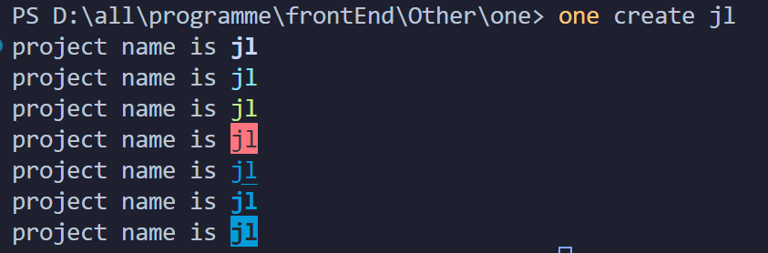


### inquirer 命令行交互工具

inquirer 在脚手架工具中的**使用频率是非常高**的，其实在上文**脚手架的简单雏形**中，我们已经使用到了，这里就不过多介绍了。


### ora 命令行 loading 动效

安装：`npm install ora@5.4.1`

在bin/cli中添加：

```js
const ora = require('ora')

// 自定义文本信息
const message = 'Loading unicorns'
// 初始化
const spinner = ora(message);
// 开始加载动画
spinner.start();
setTimeout(() => {
    // 修改动画样式

    // Type: string
    // Default: 'cyan'
    // Values: 'black' | 'red' | 'green' | 'yellow' | 'blue' | 'magenta' | 'cyan' | 'white' | 'gray'
    spinner.color = 'red';    
    spinner.text = 'Loading rainbows';

    setTimeout(() => {
        // 加载状态修改
        spinner.stop() // 停止
        spinner.succeed('Loading succeed'); // 成功 ✔
        // spinner.fail(text?);  失败 ✖
        // spinner.warn(text?);  提示 ⚠
        // spinner.info(text?);  信息 ℹ
    }, 2000);
}, 2000);
```

看效果

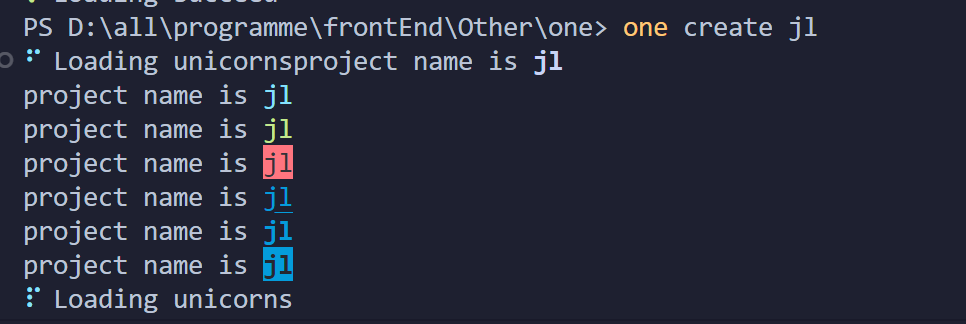


### cross-spawn 跨平台 shell 工具 — 安装依赖

安装：`npm install cross-spawn`

在脚手架里面，可以用来自动执行 shell 命令，例如：

```js
#! /usr/bin/env node 

const spawn = require('cross-spawn');
const chalk = require('chalk')

// 定义需要按照的依赖
const dependencies = ['vue', 'vuex', 'vue-router'];

// 执行安装
const child = spawn('npm', ['install', '-D'].concat(dependencies), { 
    stdio: 'inherit' 
});

// 监听执行结果
child.on('close', function(code) {
    // 执行失败
    if(code !== 0) {
        console.log(chalk.red('Error occurred while installing dependencies!'));
        process.exit(1);
    }
    // 执行成功
    else {
        console.log(chalk.cyan('Install finished'))   
    }
})
```

看效果：

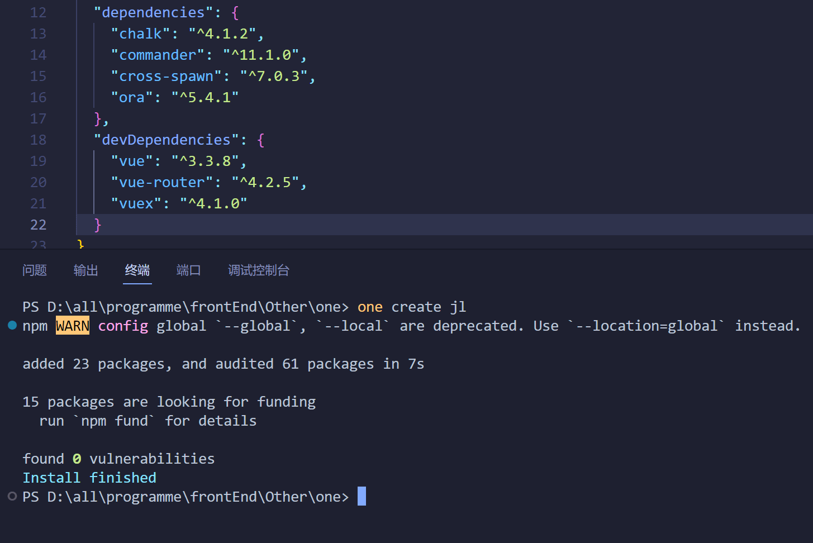


## 简答自己的脚手架

先给我们的脚手架起个名字吧，就叫：xjn-cli

**需要实现哪些基本功能：**

1. 通过 `xjn create <name>` 命令启动项目
2. 询问用户需要选择需要下载的模板
3. 远程拉取模板文件

**搭建步骤拆解：**

1. 创建项目
2. 创建脚手架启动命令（使用 commander）
3. 询问用户问题获取创建所需信息（使用 inquirer）
4. 下载远程模板（使用 download-git-repo）
5. 发布项目


### 创建项目

先创建一个简单的 Node-Cli 结构

```bash
zhurong-cli           
├─ bin                
│  └─ cli.js  # 启动文件      
├─ README.md          
└─ package.json       
```

配置脚手架启动文件

```js
{
  "name": "xjn-cli",
  "version": "1.0.0",
  "description": "",
  "main": "./bin/cli.js",
  "bin": {
    "xjn": "./bin/cli.js"
  },
  "scripts": {
    "test": "echo \"Error: no test specified\" && exit 1"
  },
  "author": "jl",
  "license": "ISC"
}
```

简单编辑一下我们的 cli.js

```js
#! /usr/bin/env node

console.log('zhurong-cli working ~')
```

然后`npm link`，`xjn`，测试是否打印


### 创建脚手架启动命令

**简单分析一下我们要怎么做？**

1. 首先我们要借助 commander 依赖去实现这个需求
2. 参照 vue-cli 常用的命令有 create、config 等等，在最新版本中可以使用 vue ui 进行可视化创建
3. 如果创建的存在，需要提示是否覆盖


#### 安装依赖

`npm install commander --save`


#### 创建命令

打开 cli.js 进行编辑

```js
#! /usr/bin/env node

const program = require('commander')

program
  // 定义命令和参数
  .command('create <app-name>')
  .description('create a new project')
  // -f or --force 为强制创建，如果创建的目录存在则直接覆盖
  .option('-f, --force', 'overwrite target directory if it exist')
  .action((name, options) => {
    // 打印执行结果
    console.log('name:',name,'options:',options)
  })
  
program
   // 配置版本号信息
  .version(`v${require('../package.json').version}`)
  .usage('<command> [option]')
  
// 解析用户执行命令传入参数
program.parse(process.argv);
```


在命令行输入 xjn，检查一下命令是否创建成功

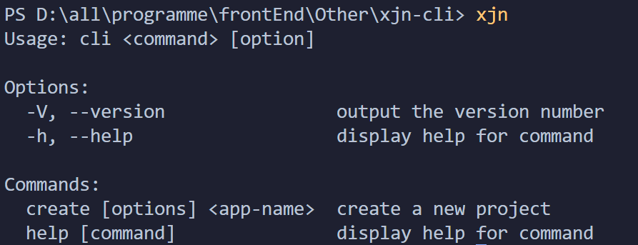

我们可以看到 Commands 下面已经有了 `create [options] <app-name>`，接着执行一下这个命令


成功！


#### 执行命令

创建 lib 文件夹并在文件夹下创建 create.js

```js
// lib/create.js

module.exports = async function (name, options) {
  // 验证是否正常取到值
  console.log('>>> create.js', name, options)
}
```

在 cli.js 中使用 create.js

```js
#! /usr/bin/env node

const program = require('commander')

program
  // 定义命令和参数
  .command('create <app-name>')
  .description('create a new project')
  // -f or --force 为强制创建，如果创建的目录存在则直接覆盖
  .option('-f, --force', 'overwrite target directory if it exist')
  .action((name, options) => {
    // 在 create.js 中执行创建任务
    require('../lib/create.js')(name, options)
  })
  
program
   // 配置版本号信息
  .version(`v${require('../package.json').version}`)
  .usage('<command> [option]')
  
// 解析用户执行命令传入参数
program.parse(process.argv);
```

执行一下 `xjn create jl`，此时在 create.js 正常打印了我们出入的信息

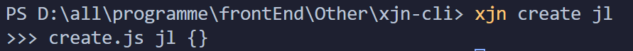


在创建目录的时候，需要思考一个问题：**目录是否已经存在？**

1. 如果存在
   - 当 `{ force: true }` 时，直接移除原来的目录，直接创建
   - 当 `{ force: false }` 时 询问用户是否需要覆盖
2. 如果不存在，直接创建

这里用到了 fs 的扩展工具 [ fs-extra](https://link.juejin.cn/?target=https%3A%2F%2Fwww.npmjs.com%2Fpackage%2Ffs-extra)，先来安装一下

```js
# fs-extra 是对 fs 模块的扩展，支持 promise 
npm install fs-extra --save
```

我们接着完善一下 create.js 内部的实现逻辑

```js
// lib/create.js

const path = require('path')
const fs = require('fs-extra')

module.exports = async function (name, options) {
  // 执行创建命令

  // 当前命令行选择的目录
  const cwd  = process.cwd();
  // 需要创建的目录地址
  const targetAir  = path.join(cwd, name)

  // 目录是否已经存在？
  if (fs.existsSync(targetAir)) {

    // 是否为强制创建？
    if (options.force) {
      await fs.remove(targetAir)
    } else {
      // TODO：询问用户是否确定要覆盖
    }
  }
}
```

询问部分的逻辑，我们将在下文继续完善


#### 创建更多的命令

如果想添加其他命令也是同样的处理方式，这里就不扩展说明了，示例如下

```js
// bin/cli.js

// 配置 config 命令
program
  .command('config [value]')
  .description('inspect and modify the config')
  .option('-g, --get <path>', 'get value from option')
  .option('-s, --set <path> <value>')
  .option('-d, --delete <path>', 'delete option from config')
  .action((value, options) => {
    console.log(value, options)
  })

// 配置 ui 命令
program
  .command('ui')
  .description('start add open roc-cli ui')
  .option('-p, --port <port>', 'Port used for the UI Server')
  .action((option) => {
    console.log(option)
  })
```


#### 完善帮助信息

我们先看一下 vue-cli 执行 --help 打印的信息

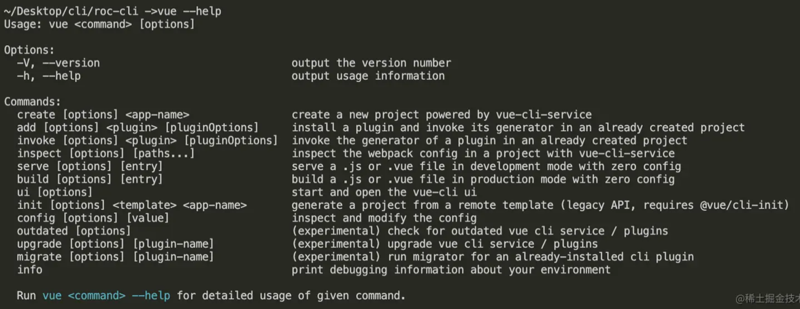


对比 `xjn --help` 打印的结果，结尾处少了一条说明信息，这里我们做补充，重点需要注意**说明信息是带有颜色的**，这里就需要用到我们工具库里面的 [chalk](https://link.juejin.cn/?target=https%3A%2F%2Fwww.npmjs.com%2Fpackage%2Fchalk) 来处理

先安装：`npm install chalk@4.1.2`

修改`bin/cli.js`

```js
#! /usr/bin/env node

const program = require('commander')
const chalk = require('chalk')

program
  // 定义命令和参数
  .command('create <app-name>')
  .description('create a new project')
  // -f or --force 为强制创建，如果创建的目录存在则直接覆盖
  .option('-f, --force', 'overwrite target directory if it exist')
  .action((name, options) => {
    // 在 create.js 中执行创建任务
    require('../lib/create.js')(name, options)
  })

program
  // 监听 --help 执行
  .on('--help', () => {
    // 新增说明信息
    console.log(`\r\nRun ${chalk.cyan(`xjn <command> --help`)} for detailed usage of given command\r\n`)
  })
  
program
   // 配置版本号信息
  .version(`v${require('../package.json').version}`)
  .usage('<command> [option]')
  
// 解析用户执行命令传入参数
program.parse(process.argv);
```

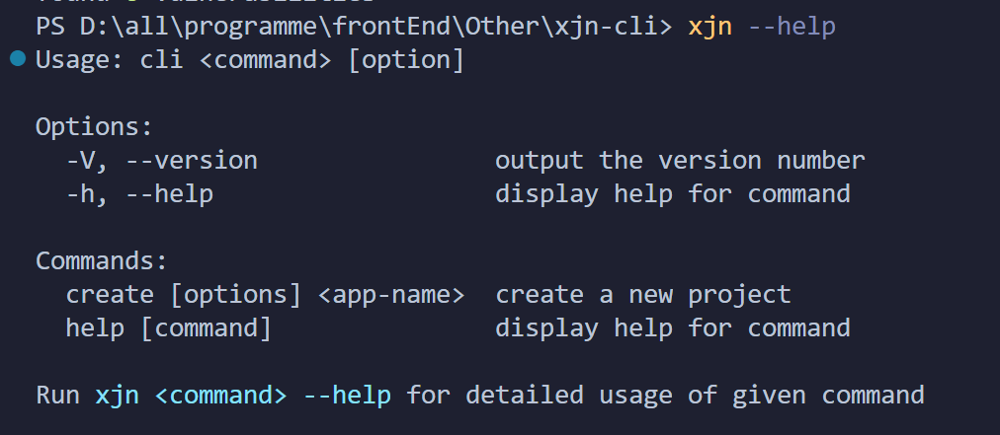


#### 打印个 Logo

如果此时我们想给脚手架整个 Logo，工具库里的 [figlet](https://link.juejin.cn/?target=https%3A%2F%2Fwww.npmjs.com%2Fpackage%2Ffiglet) 就是干这个的

安装：`npm install figlet`

修改cli.js

```js
#! /usr/bin/env node

const program = require('commander')
const chalk = require('chalk')
const figlet = require('figlet')

program
  // 定义命令和参数
  .command('create <app-name>')
  .description('create a new project')
  // -f or --force 为强制创建，如果创建的目录存在则直接覆盖
  .option('-f, --force', 'overwrite target directory if it exist')
  .action((name, options) => {
    // 在 create.js 中执行创建任务
    require('../lib/create.js')(name, options)
  })

  program
  .on('--help', () => {
    // 使用 figlet 绘制 Logo
    console.log('\r\n' + figlet.textSync('xjn', {
      font: 'Ghost',
      horizontalLayout: 'default',
      verticalLayout: 'default',
      width: 80,
      whitespaceBreak: true
    }));
    // 新增说明信息
    console.log(`\r\nRun ${chalk.cyan(`roc <command> --help`)} show details\r\n`)
  })

program
   // 配置版本号信息
  .version(`v${require('../package.json').version}`)
  .usage('<command> [option]')
  
// 解析用户执行命令传入参数
program.parse(process.argv);
```

看执行效果：

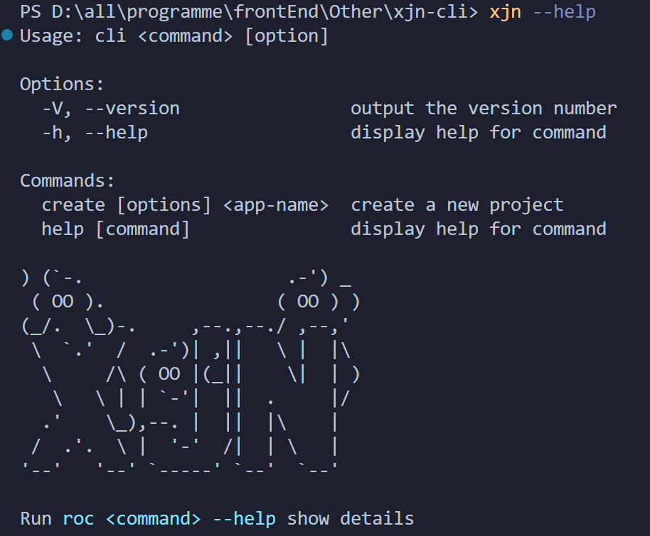


### 询问用户问题获取创建所需信息

这里召唤我们的老朋友 [ inquirer](https://link.juejin.cn/?target=https%3A%2F%2Fwww.npmjs.com%2Fpackage%2Finquirer)，让他来帮我们解决命令行交互的问题

**接下来我们要做的：**

1. 上一步遗留：询问用户是否覆盖已存在的目录
2. 用户选择模板
3. 用户选择版本
4. 获取下载模板的链接


#### 询问是否覆盖已存在的目录

这里解决上一步遗留的问题：

1. 如果目录已存在
   - 当 `{ force: false }` 时 询问用户是否需要覆盖

逻辑实际上已经完成，这里补充一下询问的内容

先安装：`npm install inquirer@8.2.5 --dev`

然后询问用户是否进行 Overwrite

```js
// lib/create.js

const path = require('path')

// fs-extra 是对 fs 模块的扩展，支持 promise 语法
const fs = require('fs-extra')
const inquirer = require('inquirer')

module.exports = async function (name, options) {
  // 执行创建命令

  // 当前命令行选择的目录
  const cwd  = process.cwd();
  // 需要创建的目录地址
  const targetAir  = path.join(cwd, name)

  // 目录是否已经存在？
  if (fs.existsSync(targetAir)) {

    // 是否为强制创建？
    if (options.force) {
      await fs.remove(targetAir)
    } else {

      // 询问用户是否确定要覆盖
      let { action } = await inquirer.prompt([
        {
          name: 'action',
          type: 'list',
          message: 'Target directory already exists Pick an action:',
          choices: [
            {
              name: 'Overwrite',
              value: 'overwrite'
            },{
              name: 'Cancel',
              value: false
            }
          ]
        }
      ])

      if (!action) {
        return;
      } else if (action === 'overwrite') {
        // 移除已存在的目录
        console.log(`\r\nRemoving...`)
        await fs.remove(targetAir)
      }
    }
  }
}
```


我们来测试一下：

1. 在当前目录，即命令行中显示的目录下手动创建2个目录，这里随便取名为 one 和 two
2. 执行 `xjn create one`，效果如下

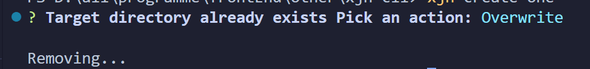

3. 执行 `xjn create two -f`，可以直接看到 my-project2 被移除

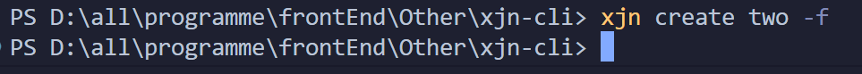


> **注意：为什么这里只做移除？** 因为后面获取到模板地址后，下载的时候会直接创建项目目录


#### 如何获取模版信息

我们在 lib 目录下创建一个 http.js 专门处理模板和版本信息的获取

```js
// lib/http.js

// 通过 axios 处理请求
const axios = require('axios')

axios.interceptors.response.use(res => {
  return res.data;
})


/**
 * 获取模板列表
 * @returns Promise
 */
async function getRepoList() {
  return axios.get('https://api.github.com/orgs/zhurong-cli/repos')
}

/**
 * 获取版本信息
 * @param {string} repo 模板名称
 * @returns Promise
 */
async function  getTagList(repo) {
  return axios.get(`https://api.github.com/repos/zhurong-cli/${repo}/tags`)
}

module.exports = {
  getRepoList,
  getTagList
}
```


#### 用户选择模板

我们专门新建一个 Generator.js 来处理项目创建逻辑

```js
// lib/Generator.js

class Generator {
    constructor (name, targetDir){
      // 目录名称
      this.name = name;
      // 创建位置
      this.targetDir = targetDir;
    }
  
    // 核心创建逻辑
    create(){
  
    }
  }
  
  module.exports = Generator;  
```

在 create.js 中引入 Generator 类

```js
// lib/create.js

const path = require('path')
const Generator = require('./Generator')

// fs-extra 是对 fs 模块的扩展，支持 promise 语法
const fs = require('fs-extra')
const inquirer = require('inquirer')

module.exports = async function (name, options) {
  // 执行创建命令

  // 当前命令行选择的目录
  const cwd  = process.cwd();
  // 需要创建的目录地址
  const targetAir  = path.join(cwd, name)

  // 目录是否已经存在？
  if (fs.existsSync(targetAir)) {

    // 是否为强制创建？
    if (options.force) {
      await fs.remove(targetAir)
    } else {

      // 询问用户是否确定要覆盖
      let { action } = await inquirer.prompt([
        {
          name: 'action',
          type: 'list',
          message: 'Target directory already exists Pick an action:',
          choices: [
            {
              name: 'Overwrite',
              value: 'overwrite'
            },{
              name: 'Cancel',
              value: false
            }
          ]
        }
      ])

      if (!action) {
        return;
      } else if (action === 'overwrite') {
        // 移除已存在的目录
        console.log(`\r\nRemoving...`)
        await fs.remove(targetAir)
      }
    }
  }

  // 创建项目
  const generator = new Generator(name, targetAir);

  // 开始创建项目
  generator.create()
}
```


接着来写询问用户选择模版都逻辑

```js
// lib/Generator.js

const { getRepoList } = require('./http')
const ora = require('ora')
const inquirer = require('inquirer')

// 添加加载动画
async function wrapLoading(fn, message, ...args) {
  // 使用 ora 初始化，传入提示信息 message
  const spinner = ora(message);
  // 开始加载动画
  spinner.start();

  try {
    // 执行传入方法 fn
    const result = await fn(...args);
    // 状态为修改为成功
    spinner.succeed();
    return result; 
  } catch (error) {
    // 状态为修改为失败
    spinner.fail('Request failed, refetch ...')
  } 
}

class Generator {
  constructor (name, targetDir){
    // 目录名称
    this.name = name;
    // 创建位置
    this.targetDir = targetDir;
  }

  // 获取用户选择的模板
  // 1）从远程拉取模板数据
  // 2）用户选择自己新下载的模板名称
  // 3）return 用户选择的名称

  async getRepo() {
    // 1）从远程拉取模板数据
    const repoList = await wrapLoading(getRepoList, 'waiting fetch template');
    if (!repoList) return;

    // 过滤我们需要的模板名称
    const repos = repoList.map(item => item.name);

    // 2）用户选择自己新下载的模板名称
    const { repo } = await inquirer.prompt({
      name: 'repo',
      type: 'list',
      choices: repos,
      message: 'Please choose a template to create project'
    })

    // 3）return 用户选择的名称
    return repo;
  }

  // 核心创建逻辑
  // 1）获取模板名称
  // 2）获取 tag 名称
  // 3）下载模板到模板目录
  async create(){

    // 1）获取模板名称
    const repo = await this.getRepo()
    
    console.log('用户选择了，repo=' + repo)
  }
}

module.exports = Generator;
```


测试一下，看看现在是个什么样子

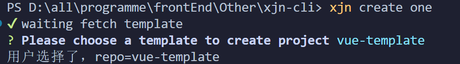

成功拿到模板名称 repo 的结果


#### 用户选择版本

过程和上述一样

```js
// lib/Generator.js

const { getRepoList, getTagList } = require('./http')
const ora = require('ora')
const inquirer = require('inquirer')

// 添加加载动画
async function wrapLoading(fn, message, ...args) {
  // 使用 ora 初始化，传入提示信息 message
  const spinner = ora(message);
  // 开始加载动画
  spinner.start();

  try {
    // 执行传入方法 fn
    const result = await fn(...args);
    // 状态为修改为成功
    spinner.succeed();
    return result; 
  } catch (error) {
    // 状态为修改为失败
    spinner.fail('Request failed, refetch ...')
  } 
}

class Generator {
  constructor (name, targetDir){
    // 目录名称
    this.name = name;
    // 创建位置
    this.targetDir = targetDir;
  }

  // 获取用户选择的模板
  // 1）从远程拉取模板数据
  // 2）用户选择自己新下载的模板名称
  // 3）return 用户选择的名称
  async getRepo() {
    // 1）从远程拉取模板数据
    const repoList = await wrapLoading(getRepoList, 'waiting fetch template');
    if (!repoList) return;

    // 过滤我们需要的模板名称
    const repos = repoList.map(item => item.name);

    // 2）用户选择自己新下载的模板名称
    const { repo } = await inquirer.prompt({
      name: 'repo',
      type: 'list',
      choices: repos,
      message: 'Please choose a template to create project'
    })

    // 3）return 用户选择的名称
    return repo;
  }


  // 获取用户选择的版本
  // 1）基于 repo 结果，远程拉取对应的 tag 列表
  // 2）用户选择自己需要下载的 tag
  // 3）return 用户选择的 tag

  async getTag(repo) {
    // 1）基于 repo 结果，远程拉取对应的 tag 列表
    const tags = await wrapLoading(getTagList, 'waiting fetch tag', repo);
    if (!tags) return;
    
    // 过滤我们需要的 tag 名称
    const tagsList = tags.map(item => item.name);

    // 2）用户选择自己需要下载的 tag
    const { tag } = await inquirer.prompt({
      name: 'tag',
      type: 'list',
      choices: tagsList,
      message: 'Place choose a tag to create project'
    })

    // 3）return 用户选择的 tag
    return tag
  }


  // 核心创建逻辑
  // 1）获取模板名称
  // 2）获取 tag 名称
  // 3）下载模板到模板目录
  async create(){

    // 1）获取模板名称
    const repo = await this.getRepo()

    // 2) 获取 tag 名称
    const tag = await this.getTag(repo)
    
    console.log('用户选择了，repo=' + repo)
  }
}

module.exports = Generator;
```

执行：

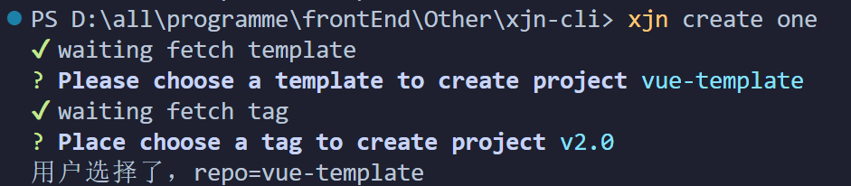


### 下载远程模板

下载远程模版需要使用 [download-git-repo](https://link.juejin.cn?target=https%3A%2F%2Fwww.npmjs.com%2Fpackage%2Fdownload-git-repo) 工具包，实际上它也在我们上面列的工具菜单上，但是在使用它的时候，需要注意一个问题，就是它是**不支持 promise**的，所以我们这里需要使用 使用 util 模块中的 [promisify](https://link.juejin.cn?target=http%3A%2F%2Fnodejs.cn%2Fapi%2Futil.html%23util_util_promisify_original) 方法对其进行 promise 化


#### 安装依赖与 promise 化

```js
npm install download-git-repo --save
```

进行 promise 化处理

```js
// lib/Generator.js

...
const util = require('util')
const downloadGitRepo = require('download-git-repo') // 不支持 Promise

class Generator {
  constructor (name, targetDir){
    ...

    // 对 download-git-repo 进行 promise 化改造
    this.downloadGitRepo = util.promisify(downloadGitRepo);
  }
  
  ...
}
```

```js
// lib/Generator.js

const { getRepoList, getTagList } = require('./http')
const ora = require('ora')
const inquirer = require('inquirer')

const util = require('util')
const downloadGitRepo = require('download-git-repo') // 不支持 Promise

// 添加加载动画
async function wrapLoading(fn, message, ...args) {
  // 使用 ora 初始化，传入提示信息 message
  const spinner = ora(message);
  // 开始加载动画
  spinner.start();

  try {
    // 执行传入方法 fn
    const result = await fn(...args);
    // 状态为修改为成功
    spinner.succeed();
    return result; 
  } catch (error) {
    // 状态为修改为失败
    spinner.fail('Request failed, refetch ...')
  } 
}

class Generator {
  constructor (name, targetDir){
    // 目录名称
    this.name = name;
    // 创建位置
    this.targetDir = targetDir;

     // 对 download-git-repo 进行 promise 化改造
     this.downloadGitRepo = util.promisify(downloadGitRepo);
  }

  // 获取用户选择的模板
  // 1）从远程拉取模板数据
  // 2）用户选择自己新下载的模板名称
  // 3）return 用户选择的名称
  async getRepo() {
    // 1）从远程拉取模板数据
    const repoList = await wrapLoading(getRepoList, 'waiting fetch template');
    if (!repoList) return;

    // 过滤我们需要的模板名称
    const repos = repoList.map(item => item.name);

    // 2）用户选择自己新下载的模板名称
    const { repo } = await inquirer.prompt({
      name: 'repo',
      type: 'list',
      choices: repos,
      message: 'Please choose a template to create project'
    })

    // 3）return 用户选择的名称
    return repo;
  }


  // 获取用户选择的版本
  // 1）基于 repo 结果，远程拉取对应的 tag 列表
  // 2）用户选择自己需要下载的 tag
  // 3）return 用户选择的 tag

  async getTag(repo) {
    // 1）基于 repo 结果，远程拉取对应的 tag 列表
    const tags = await wrapLoading(getTagList, 'waiting fetch tag', repo);
    if (!tags) return;
    
    // 过滤我们需要的 tag 名称
    const tagsList = tags.map(item => item.name);

    // 2）用户选择自己需要下载的 tag
    const { tag } = await inquirer.prompt({
      name: 'tag',
      type: 'list',
      choices: tagsList,
      message: 'Place choose a tag to create project'
    })

    // 3）return 用户选择的 tag
    return tag
  }


  // 核心创建逻辑
  // 1）获取模板名称
  // 2）获取 tag 名称
  // 3）下载模板到模板目录
  async create(){

    // 1）获取模板名称
    const repo = await this.getRepo()

    // 2) 获取 tag 名称
    const tag = await this.getTag(repo)
    
    console.log('用户选择了，repo=' + repo)
  }
}

module.exports = Generator;
```


#### 核心下载功能

接着，就是模板下载部分的逻辑了

```js
// lib/Generator.js

const { getRepoList, getTagList } = require('./http')
const ora = require('ora')
const inquirer = require('inquirer')

const util = require('util')
const downloadGitRepo = require('download-git-repo') // 不支持 Promise

// 添加加载动画
async function wrapLoading(fn, message, ...args) {
  // 使用 ora 初始化，传入提示信息 message
  const spinner = ora(message);
  // 开始加载动画
  spinner.start();

  try {
    // 执行传入方法 fn
    const result = await fn(...args);
    // 状态为修改为成功
    spinner.succeed();
    return result; 
  } catch (error) {
    // 状态为修改为失败
    spinner.fail('Request failed, refetch ...')
  } 
}

class Generator {
  constructor (name, targetDir){
    // 目录名称
    this.name = name;
    // 创建位置
    this.targetDir = targetDir;

     // 对 download-git-repo 进行 promise 化改造
     this.downloadGitRepo = util.promisify(downloadGitRepo);
  }

  // 获取用户选择的模板
  // 1）从远程拉取模板数据
  // 2）用户选择自己新下载的模板名称
  // 3）return 用户选择的名称
  async getRepo() {
    // 1）从远程拉取模板数据
    const repoList = await wrapLoading(getRepoList, 'waiting fetch template');
    if (!repoList) return;

    // 过滤我们需要的模板名称
    const repos = repoList.map(item => item.name);

    // 2）用户选择自己新下载的模板名称
    const { repo } = await inquirer.prompt({
      name: 'repo',
      type: 'list',
      choices: repos,
      message: 'Please choose a template to create project'
    })

    // 3）return 用户选择的名称
    return repo;
  }


  // 获取用户选择的版本
  // 1）基于 repo 结果，远程拉取对应的 tag 列表
  // 2）用户选择自己需要下载的 tag
  // 3）return 用户选择的 tag

  async getTag(repo) {
    // 1）基于 repo 结果，远程拉取对应的 tag 列表
    const tags = await wrapLoading(getTagList, 'waiting fetch tag', repo);
    if (!tags) return;
    
    // 过滤我们需要的 tag 名称
    const tagsList = tags.map(item => item.name);

    // 2）用户选择自己需要下载的 tag
    const { tag } = await inquirer.prompt({
      name: 'tag',
      type: 'list',
      choices: tagsList,
      message: 'Place choose a tag to create project'
    })

    // 3）return 用户选择的 tag
    return tag
  }


  // 下载远程模板
  // 1）拼接下载地址
  // 2）调用下载方法
  async download(repo, tag){

    // 1）拼接下载地址
    const requestUrl = `zhurong-cli/${repo}${tag?'#'+tag:''}`;

    // 2）调用下载方法
    await wrapLoading(
      this.downloadGitRepo, // 远程下载方法
      'waiting download template', // 加载提示信息
      requestUrl, // 参数1: 下载地址
      path.resolve(process.cwd(), this.targetDir)) // 参数2: 创建位置
  }

  // 核心创建逻辑
  // 1）获取模板名称
  // 2）获取 tag 名称
  // 3）下载模板到模板目录
  // 4）模板使用提示
  async create(){

    // 1）获取模板名称
    const repo = await this.getRepo()

    // 2) 获取 tag 名称
    const tag = await this.getTag(repo)

    // 3）下载模板到模板目录
    await this.download(repo, tag)
    
    // 4）模板使用提示
    console.log(`\r\nSuccessfully created project ${chalk.cyan(this.name)}`)
    console.log(`\r\n  cd ${chalk.cyan(this.name)}`)
    console.log('  npm run dev\r\n')
  }
  
}

module.exports = Generator;
```

完成这块，一个简单的脚手架就完成了

来试一下效果如何

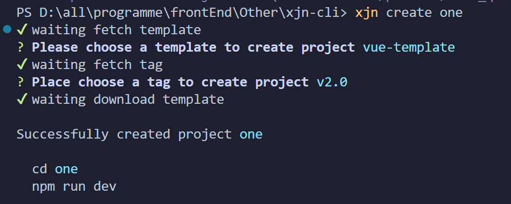


### 发布项目

上面都是在本地测试，实际在使用的时候，可能就需要发布到 npm 仓库，通过 npm 全局安装之后，直接到目标目录下面去创建项目，如何发布呢？

1. 第一步，在 git 上建好仓库
2. 第二步，完善 package.json 中的配置

```json
{
  "name": "xjn-cli",
  "version": "1.0.0",
  "description": "xjn的脚手架",
  "main": "./bin/cli.js",
  "bin": {
    "xjn": "./bin/cli.js"
  },
  "scripts": {
    "test": "echo \"Error: no test specified\" && exit 1"
  },
  "files": [
    "bin",
    "lib"
  ],
  "author": {
    "name": "xjn",
    "github": "https://github.com/xiaojunnanya"
  },
  "keywords": [
    "xjn-cli",
    "jl",
    "脚手架"
  ],
  "license": "ISC",
  "dependencies": {
    "axios": "^1.6.1",
    "chalk": "^4.1.2",
    "commander": "^11.1.0",
    "download-git-repo": "^3.0.2",
    "figlet": "^1.7.0",
    "fs-extra": "^11.1.1",
    "inquirer": "^8.2.5"
  }
}
```

3. 第三步，使用 `npm publish` 进行发布，更新到时候，注意修改版本号

4. 之后这样我们就可以通过 npm 或者 yarn 全局安装使用了


### 使用

1. 先全局安装：`npm install xjn -g`
2. 使用：`xjn create one`


## plop：一款小而美的脚手架工具

> plop 小在体积轻量，美在简单易用

更多使用方法  [ plop 使用文档](https://link.juejin.cn?target=https%3A%2F%2Fgithub.com%2Fplopjs%2Fplop)

我们可以将其直接集成到项目中，解决一下重复性的活着需要标准化的创建工作，下面我们就来做个小案例，比如

**我们已经约定好了组件的创建规范**：

- 组件名称使用大驼峰
- 样式需要单独拧出来写
- 需要搭配说明文档

**plop 的使用过程大致可以拆解为**：

1. 安装 plop，新增配置文件 plopfile.js
2. 编辑 plop 配置文件
3. 创建模板文件
4. 执行创建任务

下面进入 coding 环节

### 安装 plop

首先用我们的 xjn-cli 初始化一个 vue 项目

```shell
# 全局安装
$ npm install xjn-cli -g 
# 创建 vue 项目
$ xjn create plop-demo
```

我们这里为了团队统一使用，plop 直接就集成到项目之中

```shell
npm install plop --save-dev
```

项目目录下面创建 plop 的配置文件 plopfile.js


### 编辑 plop 配置文件

```js
// ./plopfile.js

module.exports = plop => {
  plop.setGenerator('component', {
    // 描述
    description: 'create a component',
    // 询问组件的名称
    prompts: [
      {
        type: 'input',
        name: 'name',
        message: 'Your component name',
        default: 'MyComponent'
      }
    ],
    // 获取到回答内容后续的动作
    actions: [
      //每一个对象都是一个动作
      {
        type: 'add', // 代表添加文件
        // 被创建文件的路径及名称
        // name 为用户输入的结果，使用 {{}} 使用变量
        // properCase: plop 自带方法，将 name 转换为大驼峰
        path: 'src/components/{{ properCase name }}/index.vue',
        // 模板文件地址
        templateFile: 'plop-templates/component.vue.hbs'
      },
      {
        type: 'add',
        path: 'src/components/{{ properCase name }}/index.scss',
        templateFile: 'plop-templates/component.scss.hbs'
      },
      {
        type: 'add',
        path: 'src/components/{{ properCase name }}/README.md',
        templateFile: 'plop-templates/README.md.hbs'
      }
    ]
  })
}
```

上面用到 properCase 方法将 name 转化为大驼峰，其他格式还包括

- `camelCase`: changeFormatToThis
- `snakeCase`: change_format_to_this
- `dashCase/kebabCase`: change-format-to-this
- `dotCase`: change.format.to.this
- `pathCase`: change/format/to/this
- `properCase/pascalCase`: ChangeFormatToThis
- `lowerCase`: change format to this
- `sentenceCase`: Change format to this,
- `constantCase`: CHANGE_FORMAT_TO_THIS
- `titleCase`: Change Format To This

我们看到上面已经引用了模板文件，实际上我们还没创建，接着创建一下


### 创建模板文件

项目文件夹下面创建 plop-templates 文件夹，里面创建对应的模板文件

```shell
plop-templates         
├─ README.md.hbs ............... 说明文档模板     
├─ component.scss.hbs .......... 组件样式模板
└─ component.vue.hbs ........... 组件模板
```


模板引擎我们用到是 Handlebars ，更多语法说明 [Handlebars 中文网](https://link.juejin.cn?target=https%3A%2F%2Fwww.handlebarsjs.cn%2F)

编辑 component.scss.hbs

```hbs
{{!-- ./plop-templates/component.scss.hbs --}}
{{!-- dashCase/kebabCase: change-format-to-this --}}
{{!-- name: 输入模板名称 --}}

.{{ dashCase name }} {

}
```

编辑 component.vue.hbs

```hbs
{{!-- ./plop-templates/component.vue.hbs --}}

<template>
  <div class="{{ dashCase name }}">{{ name }}</div>
</template>

<script>
  export default {
    name: '{{ properCase name }}',
  }
</script>

<style lang="scss">
@import "./index.scss";

</style>
```

README.md.hbs

```hbs
hbs复制代码{{!-- ./plop-templates/README.md.hbs --}}

这里是组件 {{ name }} 的使用说明
```


补充说明：

- 这里模板都是最简单实现，实际生产中可以根据需求丰富模板内容
- 模板中的 dashCase、properCase 为变更 name 命令的显示规则，上文已经列表过
  - `dashCase`：变为横线链接 aa-bb-cc
  - `properCase`：变为大驼峰 AaBbCc
  - `...`
- Handlebars 中使用变量，用 `{{}}` 包裹


### 执行创建任务

打开 package.json

```json
// scripts 中 增加一条命令
...
"scripts": {
    ...
    "plop": "plop"
  },
...  
```

此时我们就可以使用 `npm run plop` 来创建组件了


## 参考链接

[从 0 构建自己的脚手架/CLI知识体系（万字） 🛠 - 掘金 (juejin.cn)](https://juejin.cn/post/6966119324478079007)


