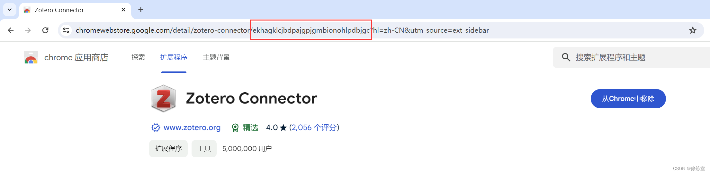
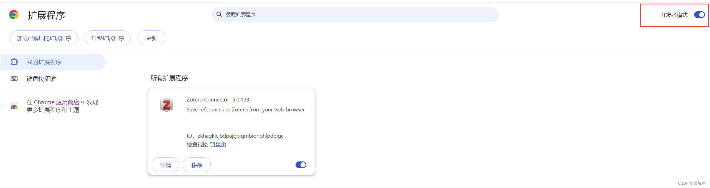

Google Chrome 插件为我们提供了这样的便利，但有时找到一个有用的插件后，我们可能需要将其下载到本地以便离线使用或备份。


## 为什么可以从Google Chrome商店直接下载插件？

Google Chrome 扩展插件主要通过Chrome Web Store分发，但Google并没有直接提供一个下载扩展插件的按钮。这是因为Google鼓励用户在在线环境中使用Chrome Web Store直接安装和更新扩展，以保证扩展的安全性和最新性。

然而，通过特定的URL链接，我们可以直接触达Google的扩展服务接口，从而下载到扩展的CRX文件（Chrome Extension File）。CRX文件是一种特殊格式的压缩文件，包含了扩展的所有代码和资源。


## 如何下载Google Chrome插件？

### 步骤1：获取插件ID

首先，访问Chrome Web Store，找到你想要的插件页面。插件的ID通常位于页面的URL中，格式如：`https://chrome.google.com/webstore/detail/[插件名]/[插件ID]`。复制这个ID备用。




### 步骤2：使用链接下载CRX文件

打开一个新的浏览器标签页，输入以下链接，替换其中的`[插件ID]`为你刚才复制的ID：

```
https://clients2.google.com/service/update2/crx?response=redirect&os=win&arch=x64&os_arch=x86_64&nacl_arch=x86-64&prod=chromecrx&prodchannel=&prodversion=77.0.3865.90&lang=zh-CN&acceptformat=crx2,crx3&x=id%3D[插件ID]%26installsource%3Dondemand%26uc
```

访问这个链接后，浏览器会自动开始下载CRX文件。请保存这个文件到你的电脑。


### 步骤3：安装CRX格式的插件

在Chrome浏览器中，进入扩展程序页面：`chrome://extensions/`，并开启页面右上角的“开发者模式”。将下载的CRX文件拖放到这个页面中，Chrome会提示你确认安装。




## 注意事项

1. 版本兼容性：确保你的Chrome版本与插件兼容。如果安装不成功，可能是由于版本不匹配。
2. 安全性：从官方渠道下载扩展更安全。如果你从其他来源下载CRX文件，需要确保这些文件是可信的，以避免恶意软件的风险。
3. 后缀名修改：如果Chrome不允许直接安装CRX文件，尝试将文件后缀名从.crx更改为.zip或.rar，然后解压缩，并通过“加载已解压的扩展程序”选项进行安装。

