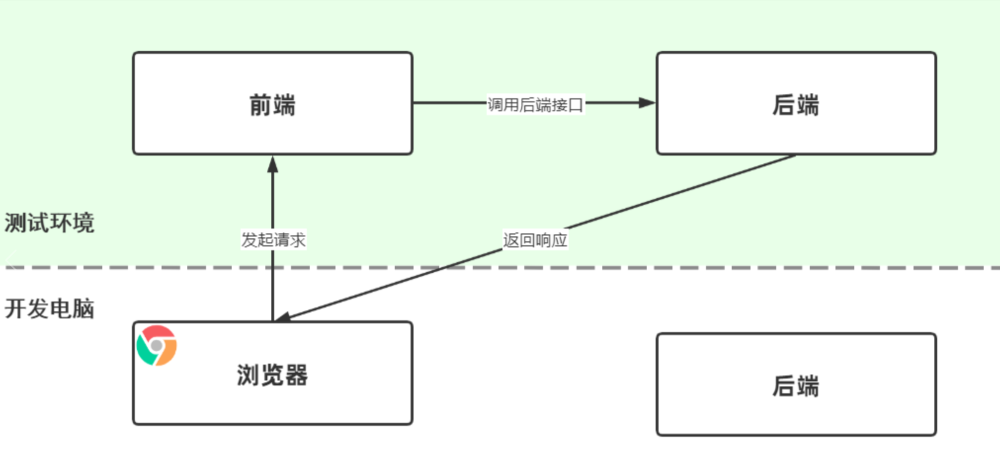
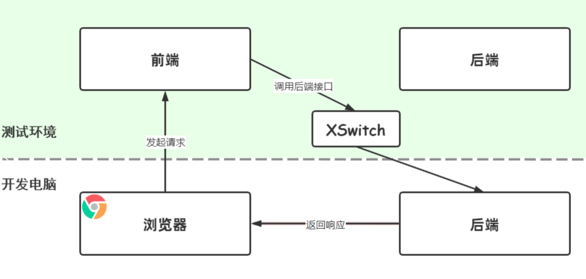
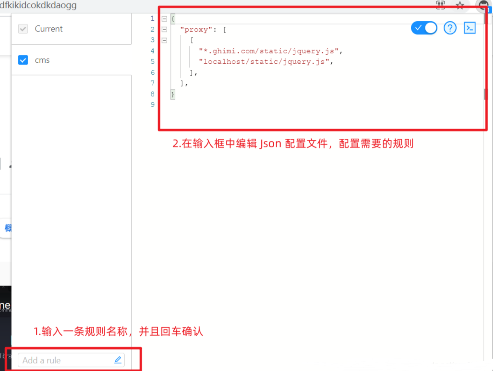

XSwitch 是一款简单的 Chrome 插件，可以把线上或者日常环境的 CSS、JS ，XHR 转发到本地。对于开发人员来说可以通过简单配置优化我们的接口开发过程。


## 使用场景

当前我们有一个前后端分离的项目，在测试环境部署了前后端分离的实例。我们目前在自己电脑上访问的话当然是测试环境的前端代码了，那么对应访问的后端也当然是前端自动路由到测试环境的后端地址了。但是我正在做接口的开发，我需要的是前端对后端的请求路由到当前电脑上正在开发的后端地址，此时 XSwitch 这个插件就可以帮助我们快速实现这个需求。


使用 XSwitch 之前：



使用 XSwitch 之后：


可以看到，通过 XSwitch 可以很方便的将我们的接口调用劫持到我们本地启动的后端环境上面。


## 使用方式

首先去 Chrome 应用商店安装该插件，在安装完成后你可以在扩展栏中开到该扩展的图标，点击图标可以获取到一个选项卡：




如图所示，可以通过自定义规则实现我们需要的请求拦截：

```json
{
  // 通过设置 proxy 设置我们需要的路径替换地址
  "proxy": [
    [
      // 原始替换地址,*表示匹配前面的任意多个字符
      "https://g.alicdn.com/platform/daily-test/isDaily.js",
      // 替换后的地址,这里替换的结果为将线上的 js文件替换成为了本地的 js 文件
      "https://localhost/platform/daily-test/isDaily.js",
    ],
  ],
}
```

其中，这里的 json 配置文件为 json5 格式的，因此我们可以随意在上面添加`//`注释。


**支持正则表达式**

我们可以通过使用正则表达式实现一些只能代理。

```json
{
  // 通过设置 proxy 设置我们需要的路径替换地址
  "proxy": [
    [
      // 原始替换地址,这里使用了一个正则表达式,表示该网站所有资源
      "https://g.alicdn.com/(.*)",
      // 替换后的地址,这里将对应的资源全部替换成为了本地的了
      "https://localhost/$1",
    ],
  ],
}
```

当然,这里只是简单举了一个小的例子,你可以按照你的需求实现自己的代理逻辑。


## 支持跨域

对于请求转发最麻烦的事情大概就是被这种各样的跨域问题给绊住了吧，XSwitch 支持跨域请求。
比如这里我们想要从百度站点的一个请求转发到谷歌（举例），我们只要设置跨域即可：

```json
{
  // 通过设置 proxy 设置我们需要的路径替换地址
  "proxy": [
    [
      // 原始替换地址,这里使用了一个正则表达式,表示该网站所有资源
      "https://www.baidu.com/(.*)",
      // 替换后的地址,这里将对应的资源全部替换成为了本地的了
      "https://www.google.com/$1",
    ],
  ],
  "cros":[
		"www.google.com"
   ]
}
```

当然这里只是举例，具体如何配置还要根据实际业务场景类配置。


## http-server

我第一次遇到的场景就是，我们公司的产品需要适配繁体字，但是由于我们公司的产品很庞大，我们只是想要测试一下情况来评估方案看效果，具体会涉及到哪个css的修改需要测试


可以使用http-server来对本地的项目打包dist文件起一个http服务器，然后通过XSwitch来将线上的css地址代理转发到我本地的css文件


- 安装：`npm install http-server -g`
- 使用：`http-server`
  - 其他的一些命令可以自己去了解，这里写一个最重要的命令
  - `http-server --cors`：允许跨域资源共享 

