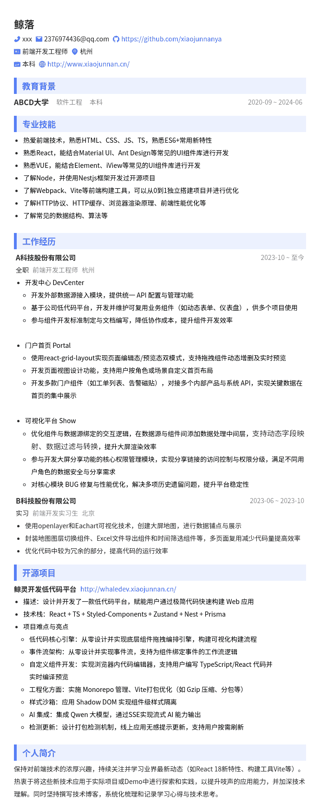

# Hello你好! 我是鲸落
热爱前端，喜欢探索前端的相关技术，热爱分享

## 技术栈
- HTML
- CSS
- JavaScript
- TypeScript
- React
- Next
- Node/Express
- NestJS
- 微信小程序原生开发
- Vue2

## 联系方式
- 邮箱：2376974436@qq.com
- GitHub：[鲸落](https://github.com/xiaojunnanya)

:::info 补充
还是挺喜欢首页的介绍视频的，如果您有空的话可以花一分钟时间看一看:blush:
:::

:::note 个人简历（更新与2025.7） 如有合适岗位可邮箱联系

:::
